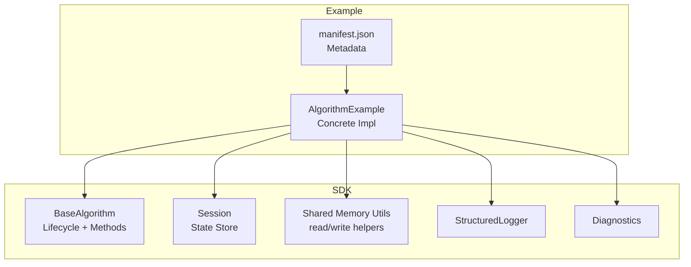
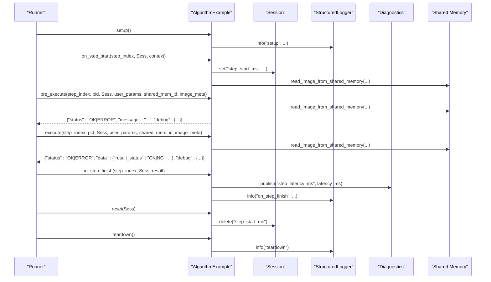
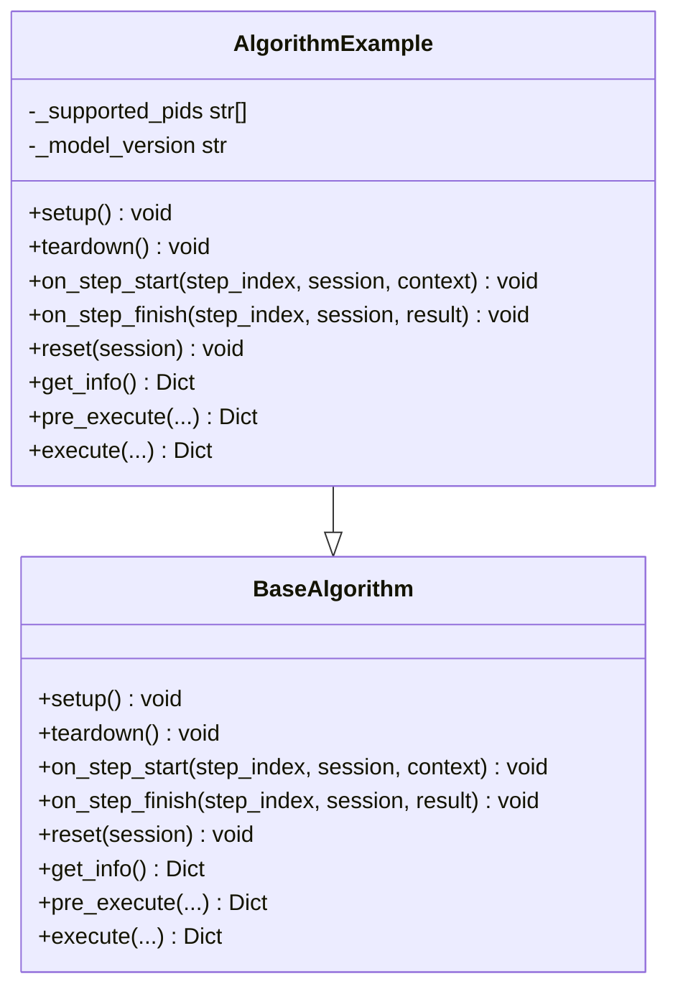
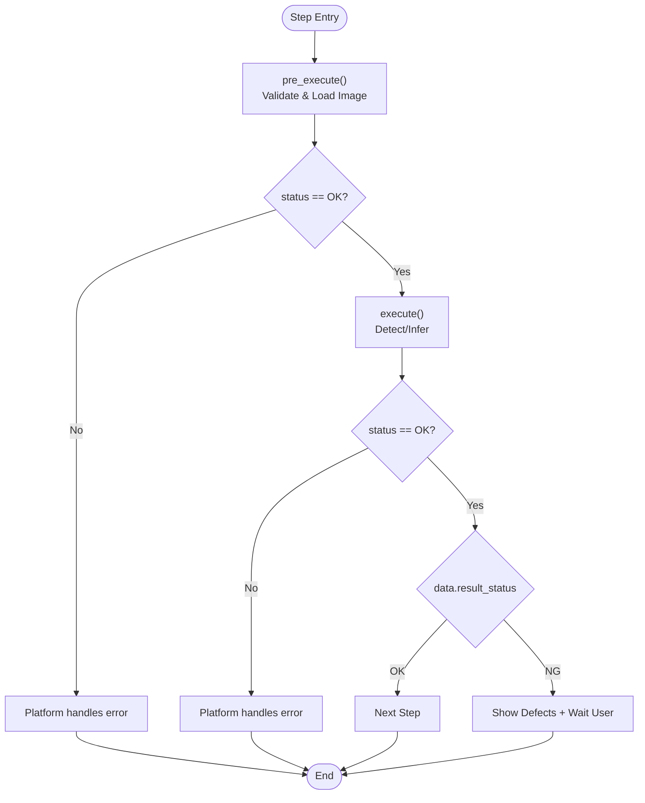
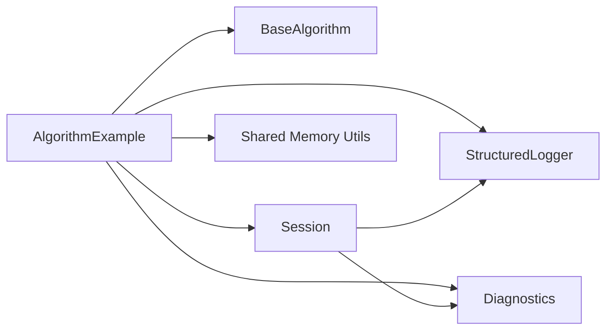

# BaseAlgorithm Interface

<cite>
**Referenced Files in This Document**
- [base.py](file://procvision_algorithm_sdk/base.py)
- [main.py](file://algorithm-example/algorithm_example/main.py)
- [manifest.json](file://algorithm-example/manifest.json)
- [session.py](file://procvision_algorithm_sdk/session.py)
- [shared_memory.py](file://procvision_algorithm_sdk/shared_memory.py)
- [logger.py](file://procvision_algorithm_sdk/logger.py)
- [diagnostics.py](file://procvision_algorithm_sdk/diagnostics.py)
- [test_base_algo.py](file://tests/test_base_algo.py)
- [README.md](file://README.md)
- [spec.md](file://spec.md)
</cite>

## Table of Contents
1. [Introduction](#introduction)
2. [Project Structure](#project-structure)
3. [Core Components](#core-components)
4. [Architecture Overview](#architecture-overview)
5. [Detailed Component Analysis](#detailed-component-analysis)
6. [Dependency Analysis](#dependency-analysis)
7. [Performance Considerations](#performance-considerations)
8. [Troubleshooting Guide](#troubleshooting-guide)
9. [Conclusion](#conclusion)
10. [Appendices](#appendices)

## Introduction
This document specifies the BaseAlgorithm interface as the core contract for all algorithm implementations. It explains the lifecycle methods (setup, teardown, on_step_start, on_step_finish, reset), the required abstract methods (get_info, pre_execute, execute), and the return value contracts. It also connects manifest.json metadata to get_info output, particularly for supported_pids and steps, and provides guidance on error handling, performance, and common implementation pitfalls.

## Project Structure
The SDK exposes a minimal yet robust contract for algorithm authors:
- BaseAlgorithm defines the interface and lifecycle hooks.
- Session provides a JSON-serializable state store for cross-step coordination.
- Shared memory utilities enable safe, read-only image access.
- StructuredLogger and Diagnostics support observability.
- The AlgorithmExample implementation demonstrates correct patterns.

**Diagram sources**
- [base.py](file://procvision_algorithm_sdk/base.py#L1-L58)
- [session.py](file://procvision_algorithm_sdk/session.py#L1-L36)
- [shared_memory.py](file://procvision_algorithm_sdk/shared_memory.py#L1-L53)
- [logger.py](file://procvision_algorithm_sdk/logger.py#L1-L24)
- [diagnostics.py](file://procvision_algorithm_sdk/diagnostics.py#L1-L12)
- [main.py](file://algorithm-example/algorithm_example/main.py#L1-L150)
- [manifest.json](file://algorithm-example/manifest.json#L1-L25)

**Section sources**
- [base.py](file://procvision_algorithm_sdk/base.py#L1-L58)
- [README.md](file://README.md#L1-L116)

## Core Components
- BaseAlgorithm: Abstract interface with lifecycle hooks and required methods.
- Session: JSON-serializable state container for inter-step communication.
- Shared Memory Utilities: Safe read of images from shared memory identifiers.
- StructuredLogger: Structured logging with timestamp_ms.
- Diagnostics: Publishable metrics for monitoring.

Key responsibilities:
- BaseAlgorithm enforces a strict contract for algorithm discovery, preparation, execution, and cleanup.
- Session ensures only JSON-serializable values are stored.
- Shared memory utilities normalize image formats and handle color spaces.

**Section sources**
- [base.py](file://procvision_algorithm_sdk/base.py#L1-L58)
- [session.py](file://procvision_algorithm_sdk/session.py#L1-L36)
- [shared_memory.py](file://procvision_algorithm_sdk/shared_memory.py#L1-L53)
- [logger.py](file://procvision_algorithm_sdk/logger.py#L1-L24)
- [diagnostics.py](file://procvision_algorithm_sdk/diagnostics.py#L1-L12)

## Architecture Overview
The BaseAlgorithm lifecycle orchestrates resource management and step boundaries while delegating image access and logging to SDK utilities.

**Diagram sources**
- [main.py](file://algorithm-example/algorithm_example/main.py#L1-L150)
- [session.py](file://procvision_algorithm_sdk/session.py#L1-L36)
- [shared_memory.py](file://procvision_algorithm_sdk/shared_memory.py#L1-L53)
- [logger.py](file://procvision_algorithm_sdk/logger.py#L1-L24)
- [diagnostics.py](file://procvision_algorithm_sdk/diagnostics.py#L1-L12)

## Detailed Component Analysis

### BaseAlgorithm Interface Contract
BaseAlgorithm defines:
- Lifecycle hooks: setup, teardown, on_step_start, on_step_finish, reset
- Required abstract methods: get_info, pre_execute, execute
- Internal fields: logger, diagnostics, _resources_loaded, _model_version, _supported_pids

Method signatures and responsibilities:
- setup(): Initialize resources once per process lifetime. Cache heavy assets here.
- teardown(): Release resources acquired in setup().
- on_step_start(step_index, session, context): Called before each step; use to record timing or prepare per-step state.
- on_step_finish(step_index, session, result): Called after each step; compute latency, publish diagnostics, log outcomes.
- reset(session): Reset per-session state (e.g., remove temporary keys).
- get_info(): Return algorithm metadata and schema for supported_pids and steps.
- pre_execute(...): Validate inputs, load image, and return preparation status and optional debug info.
- execute(...): Perform detection/inference and return result_status plus structured data.

Parameters:
- step_index: zero-based index of the current step.
- pid: product identifier string (not bound in constructor).
- session: runtime state container (JSON-serializable values only).
- user_params: validated parameters from manifest schema.
- shared_mem_id: shared memory identifier for the image.
- image_meta: image metadata (width, height, timestamp_ms, camera_id, color_space).

Return value structures:
- Both pre_execute and execute must return a dictionary with:
  - status: "OK" | "ERROR"
  - message: human-readable string
  - error_code: machine-readable code (optional)
  - data: structured payload (optional)
  - debug: technical metrics (optional)

Notes:
- pre_execute must not return real detection results; only reference data.
- execute’s business outcome is encoded in data.result_status ("OK" | "NG").
- NG is not a top-level status; it belongs to data.result_status.

**Section sources**
- [base.py](file://procvision_algorithm_sdk/base.py#L1-L58)
- [spec.md](file://spec.md#L880-L1079)
- [spec.md](file://spec.md#L1380-L1579)

### AlgorithmExample Implementation Patterns
AlgorithmExample demonstrates:
- Supported PIDs declaration and enforcement in both get_info and execution paths.
- Resource caching in setup and cleanup in teardown.
- Step timing via session state and diagnostic publishing.
- Safe image access using shared memory utilities.
- Consistent return value contracts with status, message, and optional error_code/data/debug.

**Diagram sources**
- [base.py](file://procvision_algorithm_sdk/base.py#L1-L58)
- [main.py](file://algorithm-example/algorithm_example/main.py#L1-L150)

**Section sources**
- [main.py](file://algorithm-example/algorithm_example/main.py#L1-L150)
- [test_base_algo.py](file://tests/test_base_algo.py#L1-L65)

### Relationship Between manifest.json and get_info
- manifest.json declares:
  - name, version, description, entry_point
  - supported_pids: list of product IDs the algorithm supports
  - steps: ordered list of steps with index, name, and params schema
- get_info() must mirror supported_pids and steps so the platform can validate user_params and present UI accordingly.

Best practices:
- Keep supported_pids aligned with the algorithm’s capabilities.
- Define steps with clear indices and parameter schemas to enable Dev Runner validation.

**Section sources**
- [manifest.json](file://algorithm-example/manifest.json#L1-L25)
- [main.py](file://algorithm-example/algorithm_example/main.py#L1-L150)
- [spec.md](file://spec.md#L880-L1079)

### Lifecycle Method Details

#### setup
- Purpose: Load and cache resources once per process.
- Pattern: Initialize model weights, configuration, or expensive assets.
- Performance tip: Cache in-memory models or static resources to avoid repeated IO.

**Section sources**
- [base.py](file://procvision_algorithm_sdk/base.py#L1-L58)
- [main.py](file://algorithm-example/algorithm_example/main.py#L1-L150)

#### teardown
- Purpose: Release resources allocated in setup.
- Pattern: Close files, free memory, or invalidate caches.

**Section sources**
- [base.py](file://procvision_algorithm_sdk/base.py#L1-L58)
- [main.py](file://algorithm-example/algorithm_example/main.py#L1-L150)

#### on_step_start
- Purpose: Prepare per-step state and measurements.
- Pattern: Record timestamps in session, initialize per-step metrics.

**Section sources**
- [base.py](file://procvision_algorithm_sdk/base.py#L1-L58)
- [main.py](file://algorithm-example/algorithm_example/main.py#L1-L150)
- [session.py](file://procvision_algorithm_sdk/session.py#L1-L36)

#### on_step_finish
- Purpose: Compute latency, publish diagnostics, and log outcomes.
- Pattern: Read per-step state from session, publish metrics, and log.

**Section sources**
- [base.py](file://procvision_algorithm_sdk/base.py#L1-L58)
- [main.py](file://algorithm-example/algorithm_example/main.py#L1-L150)
- [diagnostics.py](file://procvision_algorithm_sdk/diagnostics.py#L1-L12)

#### reset
- Purpose: Clear per-session transient state.
- Pattern: Delete temporary keys set during on_step_start.

**Section sources**
- [base.py](file://procvision_algorithm_sdk/base.py#L1-L58)
- [main.py](file://algorithm-example/algorithm_example/main.py#L1-L150)
- [session.py](file://procvision_algorithm_sdk/session.py#L1-L36)

### Required Abstract Methods

#### get_info
- Returns algorithm metadata and schema:
  - name, version, description
  - supported_pids: list of product IDs
  - steps: list of step definitions with index, name, and params schema
- Must match manifest.json for supported_pids and steps.

**Section sources**
- [base.py](file://procvision_algorithm_sdk/base.py#L1-L58)
- [manifest.json](file://algorithm-example/manifest.json#L1-L25)
- [main.py](file://algorithm-example/algorithm_example/main.py#L1-L150)

#### pre_execute
- Validates pid against supported_pids.
- Loads image from shared memory using shared_mem_id and image_meta.
- Returns preparation status and optional debug info.
- Must not return real detection results.

Return value structure:
- status: "OK" | "ERROR"
- message: human-readable string
- error_code: machine-readable code (optional)
- debug: technical metrics (optional)

Common validations:
- pid not in supported_pids
- image_meta missing width/height or invalid
- image load failure

**Section sources**
- [base.py](file://procvision_algorithm_sdk/base.py#L1-L58)
- [shared_memory.py](file://procvision_algorithm_sdk/shared_memory.py#L1-L53)
- [test_base_algo.py](file://tests/test_base_algo.py#L1-L65)
- [spec.md](file://spec.md#L880-L1079)

#### execute
- Validates pid and loads image.
- Performs detection/inference and returns result_status plus structured data.
- result_status: "OK" | "NG"
- Optional fields: defect_rects, position_rects, ng_reason, debug.

Return value structure:
- status: "OK" | "ERROR"
- message: human-readable string
- error_code: machine-readable code (optional)
- data: {
  result_status: "OK" | "NG"
  ng_reason: string (when NG)
  defect_rects: list of rectangles
  position_rects: list of rectangles
  debug: technical metrics
}

**Section sources**
- [base.py](file://procvision_algorithm_sdk/base.py#L1-L58)
- [shared_memory.py](file://procvision_algorithm_sdk/shared_memory.py#L1-L53)
- [test_base_algo.py](file://tests/test_base_algo.py#L1-L65)
- [spec.md](file://spec.md#L1380-L1579)

### Parameter Reference
- step_index: integer, zero-based step index
- pid: string, product identifier
- session: Session object with JSON-serializable state
- user_params: validated parameters from manifest schema
- shared_mem_id: string, shared memory identifier
- image_meta: dict with keys width, height, timestamp_ms, camera_id, color_space

**Section sources**
- [base.py](file://procvision_algorithm_sdk/base.py#L1-L58)
- [README.md](file://README.md#L1-L116)

### Return Value Contracts
- Top-level status: "OK" | "ERROR"
- data.result_status: "OK" | "NG" (business outcome)
- message: human-readable string
- error_code: machine-readable code (recommended)
- debug: technical metrics (recommended)

Validation rules:
- pre_execute must not return "NG" at top-level; use "ERROR" for failures.
- When result_status is "NG", include ng_reason and defect_rects/position_rects as appropriate.
- debug is optional but recommended for performance monitoring.

**Section sources**
- [spec.md](file://spec.md#L880-L1079)
- [spec.md](file://spec.md#L1380-L1579)

### Data Flow Through Steps

**Diagram sources**
- [base.py](file://procvision_algorithm_sdk/base.py#L1-L58)
- [spec.md](file://spec.md#L880-L1079)
- [spec.md](file://spec.md#L1380-L1579)

## Dependency Analysis
- AlgorithmExample depends on BaseAlgorithm, Session, Shared Memory utilities, Logger, and Diagnostics.
- Session enforces JSON-serializability for stored values.
- Shared memory utilities normalize image arrays and handle color spaces.

**Diagram sources**
- [main.py](file://algorithm-example/algorithm_example/main.py#L1-L150)
- [base.py](file://procvision_algorithm_sdk/base.py#L1-L58)
- [session.py](file://procvision_algorithm_sdk/session.py#L1-L36)
- [shared_memory.py](file://procvision_algorithm_sdk/shared_memory.py#L1-L53)
- [logger.py](file://procvision_algorithm_sdk/logger.py#L1-L24)
- [diagnostics.py](file://procvision_algorithm_sdk/diagnostics.py#L1-L12)

**Section sources**
- [main.py](file://algorithm-example/algorithm_example/main.py#L1-L150)
- [base.py](file://procvision_algorithm_sdk/base.py#L1-L58)
- [session.py](file://procvision_algorithm_sdk/session.py#L1-L36)
- [shared_memory.py](file://procvision_algorithm_sdk/shared_memory.py#L1-L53)

## Performance Considerations
- Cache resources in setup to avoid repeated initialization.
- Minimize image copies; leverage shared memory utilities for efficient reads.
- Use debug fields to track latency and throughput.
- Keep supported_pids and steps minimal and precise to reduce validation overhead.

[No sources needed since this section provides general guidance]

## Troubleshooting Guide
Common implementation errors:
- Non-JSON-serializable values in session state: Session.set raises TypeError for non-serializable values.
- Incorrect status usage: pre_execute must not return "NG" at top-level; use "ERROR" for failures.
- Missing message or error_code: Include human-readable message and machine-readable error_code for platform handling.
- Incorrect result_status placement: Place "OK"/"NG" under data.result_status, not top-level status.
- Missing ng_reason when NG: Provide ng_reason for clarity.
- Excessive data: Respect limits on defect_rects/position_rects for UI rendering performance.

Validation references:
- Session.set enforces JSON-serializability.
- Tests demonstrate expected return structures and error handling.

**Section sources**
- [session.py](file://procvision_algorithm_sdk/session.py#L1-L36)
- [test_base_algo.py](file://tests/test_base_algo.py#L1-L65)
- [spec.md](file://spec.md#L880-L1079)
- [spec.md](file://spec.md#L1380-L1579)

## Conclusion
BaseAlgorithm provides a strict, well-defined contract for algorithm implementations. By adhering to lifecycle hooks, return value contracts, and manifest-driven metadata, developers can build robust, maintainable, and observable algorithms that integrate cleanly with the platform.

[No sources needed since this section summarizes without analyzing specific files]

## Appendices

### Appendix A: Manifest and get_info Alignment Checklist
- supported_pids must match between manifest.json and get_info().
- steps must define index, name, and params schema in get_info() to enable Dev Runner validation.
- Ensure steps align with the algorithm’s intended workflow.

**Section sources**
- [manifest.json](file://algorithm-example/manifest.json#L1-L25)
- [main.py](file://algorithm-example/algorithm_example/main.py#L1-L150)

### Appendix B: Example Return Structures
- pre_execute: {"status": "OK|ERROR", "message": "...", "debug": {...}}
- execute: {"status": "OK|ERROR", "data": {"result_status": "OK|NG", ...}, "debug": {...}}

**Section sources**
- [test_base_algo.py](file://tests/test_base_algo.py#L1-L65)
- [spec.md](file://spec.md#L880-L1079)
- [spec.md](file://spec.md#L1380-L1579)