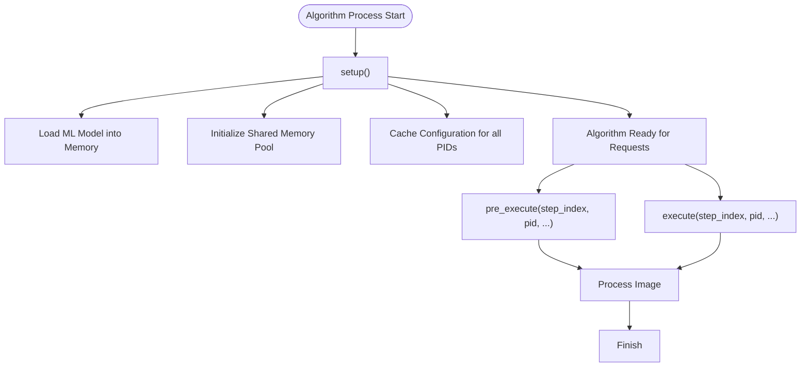
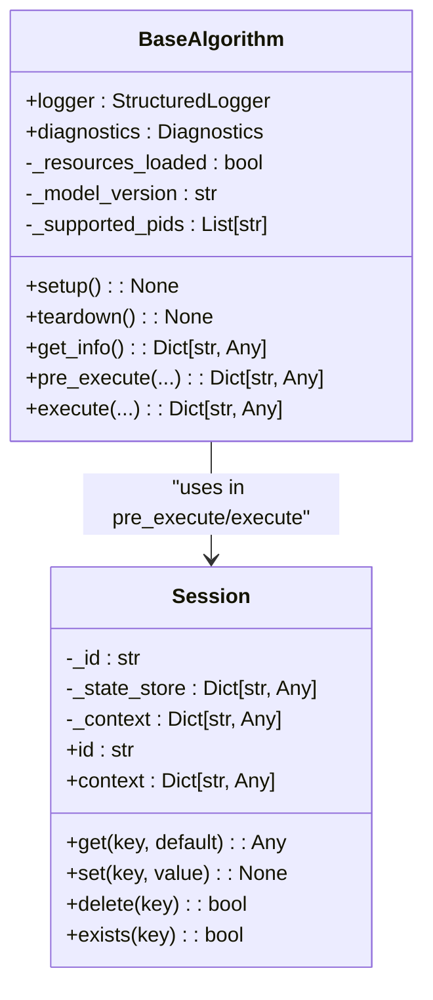
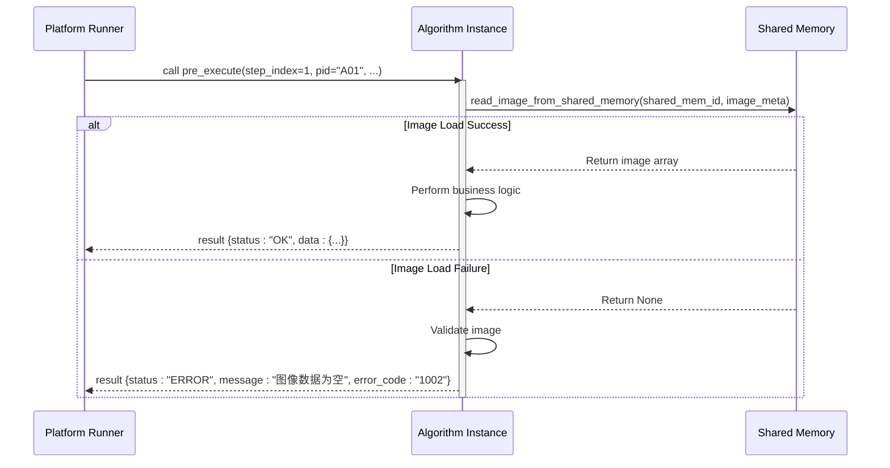

# Best Practices

<cite>
**Referenced Files in This Document**   
- [spec.md](file://spec.md)
- [runner_spec.md](file://runner_spec.md)
- [base.py](file://procvision_algorithm_sdk/base.py)
- [session.py](file://procvision_algorithm_sdk/session.py)
- [logger.py](file://procvision_algorithm_sdk/logger.py)
- [diagnostics.py](file://procvision_algorithm_sdk/diagnostics.py)
- [shared_memory.py](file://procvision_algorithm_sdk/shared_memory.py)
- [cli.py](file://procvision_algorithm_sdk/cli.py)
- [main.py](file://algorithm-example/algorithm_example/main.py)
</cite>

## Table of Contents
1. [Introduction](#introduction)
2. [Performance Optimization](#performance-optimization)
3. [Error Handling Patterns](#error-handling-patterns)
4. [Structured Logging Guidelines](#structured-logging-guidelines)
5. [Security Considerations](#security-considerations)
6. [Algorithm Design Principles](#algorithm-design-principles)
7. [Testing and Documentation](#testing-and-documentation)
8. [Version Control Practices](#version-control-practices)
9. [Consistent Behavior Across PIDs and Steps](#consistent-behavior-across-pids-and-steps)

## Introduction
This document outlines best practices for developing algorithms on the ProcVision industrial vision platform. The guidelines are derived from the platform specifications (spec.md, runner_spec.md) and the reference implementation in the algorithm SDK. These practices ensure optimal performance, reliability, maintainability, and security of algorithm modules. The core principles include performance optimization through resource management, robust error handling with meaningful status codes, structured logging for observability, secure coding practices, adherence to sound algorithm design, comprehensive testing, and consistent behavior across different product IDs (PIDs) and processing steps.

## Performance Optimization
Optimizing performance is critical for real-time industrial vision applications. The primary strategies involve efficient resource management during initialization, optimized image processing, and minimizing state storage.

### Resource Caching in Setup
The `setup()` lifecycle hook is the designated place for initializing heavy-weight resources. This method is called once when the algorithm instance starts, making it ideal for loading models, establishing shared memory pools, or initializing hardware connections. By caching these resources at the instance level, they can be reused across all subsequent `pre_execute` and `execute` calls for different PIDs and steps, avoiding the overhead of repeated initialization.



**Diagram sources**
- [base.py](file://procvision_algorithm_sdk/base.py#L15-L25)
- [spec.md](file://spec.md#L150-L180)

**Section sources**
- [base.py](file://procvision_algorithm_sdk/base.py#L15-L25)
- [spec.md](file://spec.md#L150-L180)

### Efficient Image Processing
Image data is transmitted from the platform to the algorithm via shared memory, identified by a `shared_mem_id`. The algorithm must use the provided `read_image_from_shared_memory(shared_mem_id, image_meta)` function to retrieve the image data. This function handles the underlying details of reading from shared memory and decoding the image (typically JPEG). To optimize performance:
- Minimize data copying; work directly with the returned `numpy.ndarray` where possible.
- Leverage hardware acceleration (e.g., GPU) for computationally intensive operations like deep learning inference.
- Ensure image processing algorithms are optimized for the expected image resolution and frame rate.

### Minimizing State Storage
State should be stored judiciously to prevent memory leaks and ensure scalability. The SDK provides two primary mechanisms:
1. **Instance Attributes**: For persistent data that must survive across multiple detection sessions (e.g., a loaded model, configuration cache). This data is shared among all PIDs.
2. **Session Object**: For transient data that is specific to a single detection flow. The `Session` object, passed to every `pre_execute` and `execute` call, allows algorithms to store and retrieve JSON-serializable data using `session.set()` and `session.get()`. This state is automatically cleared when the detection session ends. Algorithms should avoid storing large data blobs (e.g., full images) in the session and keep the total size under 100KB.



**Diagram sources**
- [base.py](file://procvision_algorithm_sdk/base.py#L1-L58)
- [session.py](file://procvision_algorithm_sdk/session.py#L1-L36)

**Section sources**
- [shared_memory.py](file://procvision_algorithm_sdk/shared_memory.py#L1-L53)
- [session.py](file://procvision_algorithm_sdk/session.py#L1-L36)

## Error Handling Patterns
Robust error handling is essential for system stability and effective debugging. The ProcVision SDK mandates a specific pattern for communicating errors.

### Meaningful Status Codes and Messages
Algorithms must **never** throw unhandled exceptions. Instead, all errors should be communicated through the return value of `pre_execute` and `execute` methods. The return dictionary must contain a `status` field with a value of either `"OK"` or `"ERROR"`. When `status` is `"ERROR"`, the `message` field must contain a human-readable description of the problem, and the `error_code` field should contain a standardized code.

The platform defines a set of standard error codes (e.g., `1001` for invalid PID, `1002` for image load failure, `1003` for model not found). Using these codes allows the platform to provide consistent user feedback and implement automated recovery strategies. For example, a `1005` (timeout) error might trigger a retry, while a `1004` (GPU OOM) error would require manual intervention.



**Diagram sources**
- [spec.md](file://spec.md#L350-L450)
- [runner_spec.md](file://runner_spec.md#L150-L200)

**Section sources**
- [spec.md](file://spec.md#L350-L450)
- [base.py](file://procvision_algorithm_sdk/base.py#L40-L57)

## Structured Logging Guidelines
Logging is a critical tool for debugging, monitoring, and auditing algorithm behavior. The SDK provides a `StructuredLogger` to ensure logs are consistent and machine-readable.

### Context-Rich Log Entries
Algorithms must use the `self.logger` instance provided by the `BaseAlgorithm` class. Direct `print()` statements are prohibited as they can interfere with the protocol communication on `stdout`. The `StructuredLogger` writes JSON-formatted log entries to `stderr`, which is isolated from the protocol stream.

Log entries should be rich in context. The `info()`, `debug()`, and `error()` methods accept keyword arguments that are included in the JSON output. Essential fields include `step_index`, `pid`, `session_id`, and any relevant performance metrics (e.g., `latency_ms`). This context allows logs to be easily correlated with specific detection events and traced through the system.

```python
# Example of structured logging
self.logger.info(
    "Step execution completed",
    step_index=step_index,
    pid=pid,
    latency_ms=latency,
    result_status=result.get("data", {}).get("result_status")
)
```

**Section sources**
- [logger.py](file://procvision_algorithm_sdk/logger.py#L1-L24)
- [spec.md](file://spec.md#L400-L420)

## Security Considerations
Security is paramount in an industrial environment. Key practices include input validation and adhering to secure coding principles.

### Input Validation
All inputs to the algorithm must be treated as untrusted and validated. This includes:
- **PID Validation**: The first step in `pre_execute` and `execute` should be to check if the provided `pid` is in the algorithm's `supported_pids` list. If not, return an `ERROR` status with code `1001`.
- **Parameter Validation**: Ensure `user_params` contain only the keys defined in the step's schema and that their values are within the specified ranges (e.g., `threshold` between 0.0 and 1.0).
- **Image Metadata Validation**: Validate that `image_meta` contains valid `width` and `height` values before attempting to read the image.

### Secure Coding Practices
- **No External Network Access**: Algorithms run in a completely offline environment. Any attempt to access the internet should be considered a security violation.
- **Dependency Management**: All dependencies must be included in the offline delivery package. The `requirements.txt` and `wheels/` directory must be carefully curated to avoid including unnecessary or potentially malicious packages.
- **Environment Isolation**: The algorithm runs in an isolated virtual environment (`venv`) created by the runner, which helps contain any potential security issues.

**Section sources**
- [spec.md](file://spec.md#L100-L120)
- [runner_spec.md](file://runner_spec.md#L250-L270)
- [main.py](file://algorithm-example/algorithm_example/main.py#L20-L30)

## Algorithm Design Principles
Adhering to sound design principles ensures algorithms are maintainable, testable, and reliable.

### Single Responsibility per Step
Each step in the algorithm's `steps` list should have a single, well-defined purpose. For example, one step should be responsible for locating a component, while a subsequent step is responsible for inspecting it for defects. This separation of concerns makes the algorithm logic clearer and easier to configure and debug.

### Clear Parameter Definitions
The `get_info()` method must return a clear schema for the `user_params` of each step. Each parameter should have a `key`, `type` (e.g., `int`, `float`, `rect`, `enum`), and metadata like `default`, `min`, `max`, and `description`. This schema is used by the platform's UI to generate configuration forms.

### Robustness to Edge Cases
Algorithms must be designed to handle edge cases gracefully. This includes:
- Handling missing or corrupted image data.
- Managing resource exhaustion (e.g., GPU OOM).
- Dealing with unexpected input parameters.
- Recovering from transient errors (e.g., a temporary sensor glitch).

The use of the `reset()` lifecycle hook allows the algorithm to clean up any temporary state when a detection is interrupted or restarted.

**Section sources**
- [spec.md](file://spec.md#L200-L300)
- [base.py](file://procvision_algorithm_sdk/base.py#L40-L57)

## Testing and Documentation
Comprehensive testing and in-code documentation are essential for quality assurance.

### Testing Coverage
The SDK provides a `procvision-cli` tool for local testing. Algorithms should be tested with:
- **Unit Tests**: For core logic (e.g., `test_base_algo.py`, `test_session.py`).
- **Integration Tests**: Using `procvision-cli validate` to verify the package structure, entry point, and `get_info()` consistency.
- **End-to-End Tests**: Using `procvision-cli run` to simulate a full execution with real or synthetic images, verifying the `pre_execute` and `execute` flows.

### Documentation within Code
Code should be self-documenting with clear function and variable names. Critical sections should be explained with comments. The `get_info()` method's `description` and parameter `description` fields serve as the primary user-facing documentation for the algorithm's configuration.

**Section sources**
- [cli.py](file://procvision_algorithm_sdk/cli.py#L1-L615)
- [test_base_algo.py](file://tests/test_base_algo.py#L1-L65)
- [test_cli.py](file://tests/test_cli.py#L1-L20)

## Version Control Practices
Version control is crucial for managing algorithm development.
- **Semantic Versioning**: Use semantic versioning (e.g., `1.0.0`, `1.0.1`) for algorithm releases. The `version` field in `manifest.json` and `get_info()` must be kept in sync.
- **Branching Strategy**: Use a branching strategy (e.g., Git Flow) to manage development, testing, and release cycles.
- **Tagging**: Tag releases in the repository to correspond with the versioned delivery packages.

## Consistent Behavior Across PIDs and Steps
The platform's design philosophy (v0.2.0+) is for a single algorithm instance to support multiple PIDs. This requires careful design:
- The `__init__` method should not be tied to a specific PID.
- The `setup()` method should initialize resources for all `supported_pids` (e.g., load configurations for each PID).
- The `pre_execute` and `execute` methods must use the `pid` parameter to dynamically select the appropriate configuration and logic path.
- The `supported_pids` list returned by `get_info()` must exactly match the list in `manifest.json`.

This design ensures consistent behavior and efficient resource utilization across all supported products.

**Section sources**
- [spec.md](file://spec.md#L80-L140)
- [base.py](file://procvision_algorithm_sdk/base.py#L10-L15)
- [main.py](file://algorithm-example/algorithm_example/main.py#L10-L20)