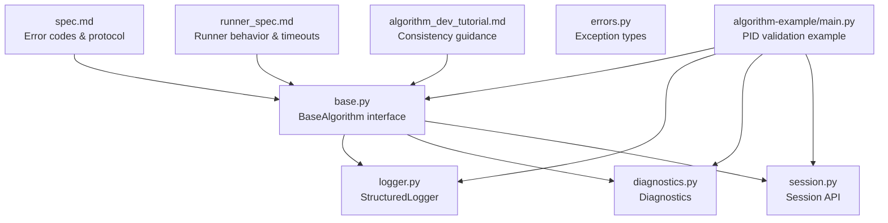
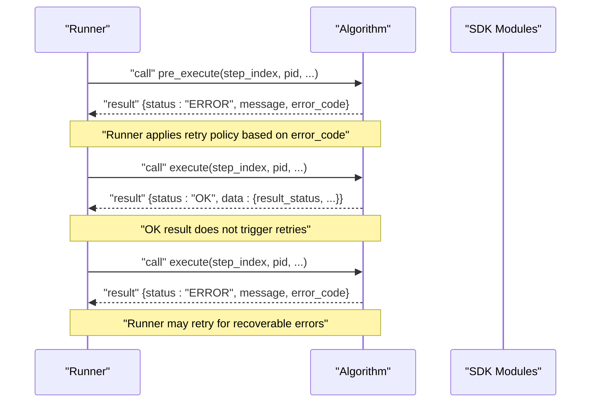
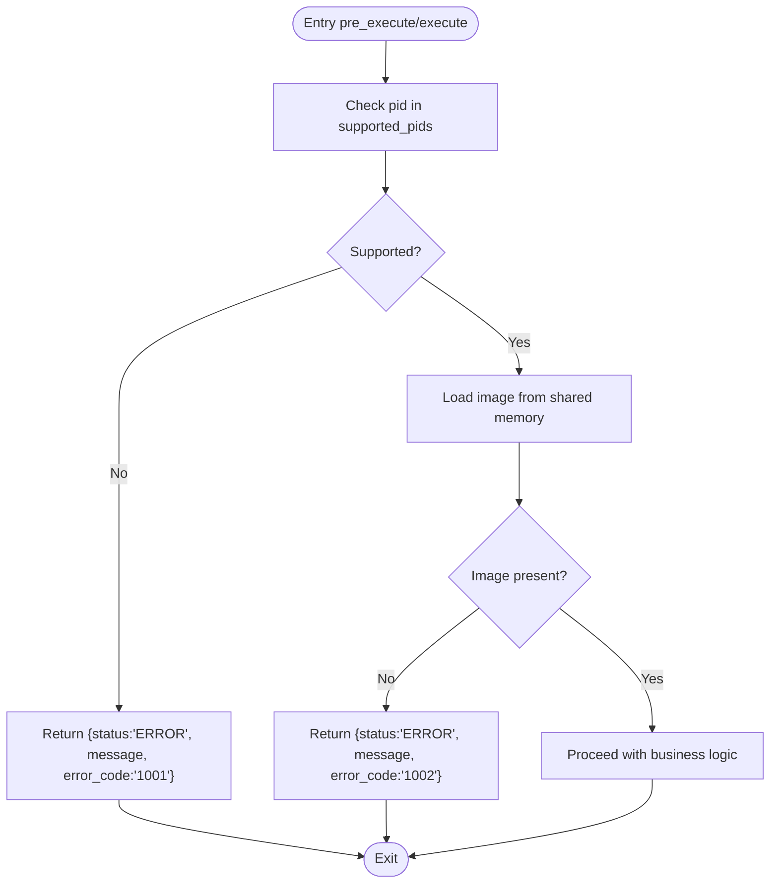
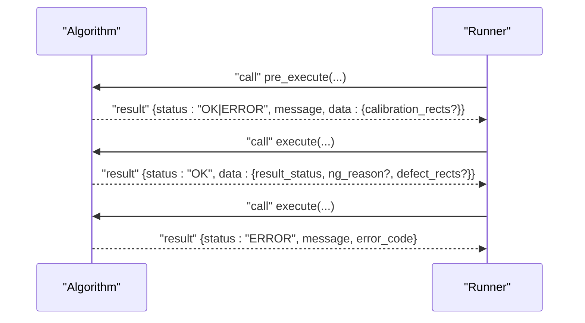
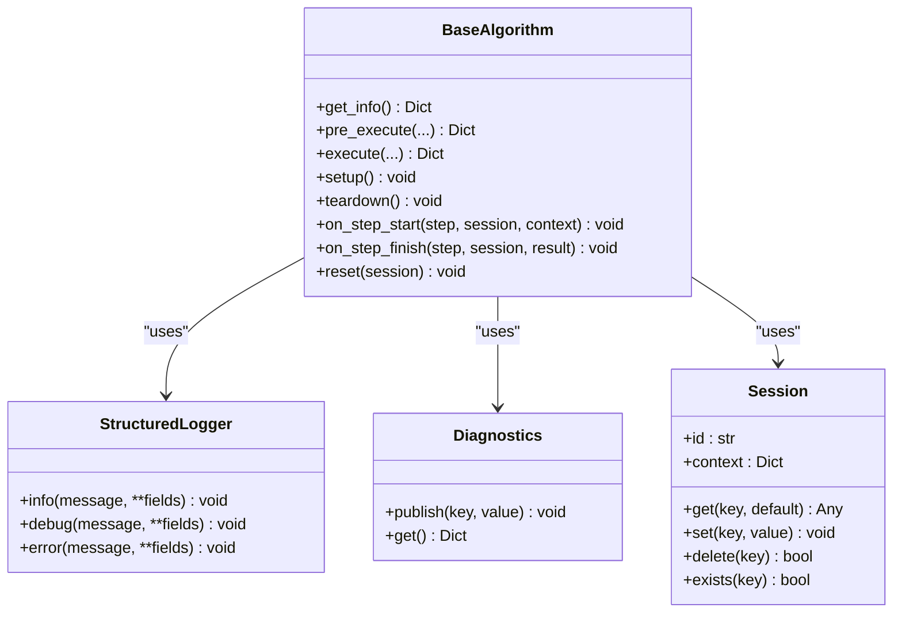
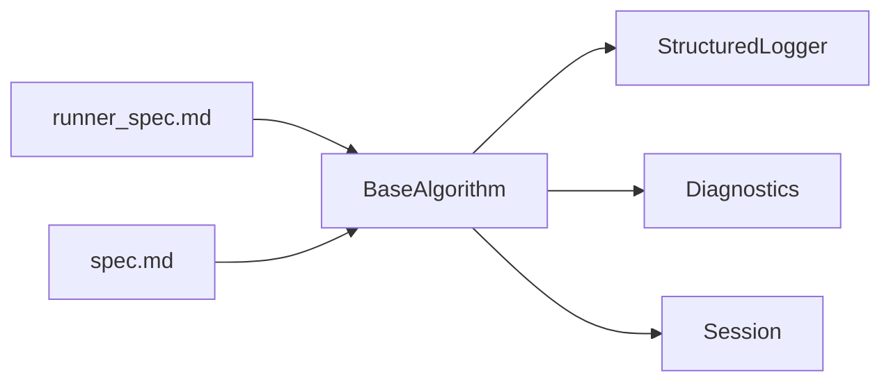

# Error Handling

<cite>
**Referenced Files in This Document**
- [spec.md](file://spec.md)
- [runner_spec.md](file://runner_spec.md)
- [algorithm_dev_tutorial.md](file://algorithm_dev_tutorial.md)
- [procvision_algorithm_sdk/base.py](file://procvision_algorithm_sdk/base.py)
- [procvision_algorithm_sdk/errors.py](file://procvision_algorithm_sdk/errors.py)
- [procvision_algorithm_sdk/logger.py](file://procvision_algorithm_sdk/logger.py)
- [procvision_algorithm_sdk/diagnostics.py](file://procvision_algorithm_sdk/diagnostics.py)
- [procvision_algorithm_sdk/session.py](file://procvision_algorithm_sdk/session.py)
- [algorithm-example/algorithm_example/main.py](file://algorithm-example/algorithm_example/main.py)
</cite>

## Table of Contents
1. [Introduction](#introduction)
2. [Project Structure](#project-structure)
3. [Core Components](#core-components)
4. [Architecture Overview](#architecture-overview)
5. [Detailed Component Analysis](#detailed-component-analysis)
6. [Dependency Analysis](#dependency-analysis)
7. [Performance Considerations](#performance-considerations)
8. [Troubleshooting Guide](#troubleshooting-guide)
9. [Conclusion](#conclusion)
10. [Appendices](#appendices)

## Introduction
This document provides a comprehensive guide to error handling in ProcVision algorithms, focusing on the standardized error code system defined in the specifications and how to return errors via the response payload rather than raising exceptions. It covers:
- The standard error code family (1001–1007, 9999)
- The protocol for returning errors with status="ERROR" and error_code
- Validation patterns for PID against supported_pids
- Guidance on recoverable versus fatal errors and retry strategies
- Best practices for concise, actionable messages and diagnostic context
- Consistent error reporting across pre_execute and execute

## Project Structure
The error handling guidance spans several specification documents and SDK modules:
- Specifications define the error code semantics and protocol
- SDK modules provide logging, diagnostics, and session utilities used during error reporting
- Example algorithm demonstrates practical PID validation and error returns

**Diagram sources**
- [spec.md](file://spec.md#L1829-L1840)
- [runner_spec.md](file://runner_spec.md#L1-L282)
- [algorithm_dev_tutorial.md](file://algorithm_dev_tutorial.md#L1-L347)
- [procvision_algorithm_sdk/base.py](file://procvision_algorithm_sdk/base.py#L1-L58)
- [procvision_algorithm_sdk/errors.py](file://procvision_algorithm_sdk/errors.py#L1-L14)
- [procvision_algorithm_sdk/logger.py](file://procvision_algorithm_sdk/logger.py#L1-L24)
- [procvision_algorithm_sdk/diagnostics.py](file://procvision_algorithm_sdk/diagnostics.py#L1-L12)
- [procvision_algorithm_sdk/session.py](file://procvision_algorithm_sdk/session.py#L1-L36)
- [algorithm-example/algorithm_example/main.py](file://algorithm-example/algorithm_example/main.py#L1-L150)

**Section sources**
- [spec.md](file://spec.md#L1829-L1840)
- [runner_spec.md](file://runner_spec.md#L1-L282)
- [algorithm_dev_tutorial.md](file://algorithm_dev_tutorial.md#L1-L347)
- [procvision_algorithm_sdk/base.py](file://procvision_algorithm_sdk/base.py#L1-L58)
- [procvision_algorithm_sdk/errors.py](file://procvision_algorithm_sdk/errors.py#L1-L14)
- [procvision_algorithm_sdk/logger.py](file://procvision_algorithm_sdk/logger.py#L1-L24)
- [procvision_algorithm_sdk/diagnostics.py](file://procvision_algorithm_sdk/diagnostics.py#L1-L12)
- [procvision_algorithm_sdk/session.py](file://procvision_algorithm_sdk/session.py#L1-L36)
- [algorithm-example/algorithm_example/main.py](file://algorithm-example/algorithm_example/main.py#L1-L150)

## Core Components
- Standard error codes: invalid_pid (1001), image_load_failed (1002), model_not_found (1003), gpu_oom (1004), timeout (1005), invalid_params (1006), coordinate_invalid (1007), unknown_error (9999)
- Protocol: Always return status="ERROR" with a machine-readable error_code and a human-readable message; do not raise exceptions
- Validation: Validate pid against supported_pids and return appropriate error_code when mismatched
- Recoverable vs. fatal: Runner applies retry policies for certain errors; fatal errors terminate the process and restart

**Section sources**
- [spec.md](file://spec.md#L1829-L1840)
- [runner_spec.md](file://runner_spec.md#L1-L282)
- [procvision_algorithm_sdk/base.py](file://procvision_algorithm_sdk/base.py#L1-L58)

## Architecture Overview
The error handling architecture separates concerns:
- Algorithm methods pre_execute and execute return structured payloads with status, message, and error_code
- Runner enforces timeouts and applies retry strategies based on error_code categories
- Logging and diagnostics are emitted via structured channels to aid triage

**Diagram sources**
- [runner_spec.md](file://runner_spec.md#L1-L282)
- [procvision_algorithm_sdk/base.py](file://procvision_algorithm_sdk/base.py#L1-L58)

## Detailed Component Analysis

### Standard Error Code System
The error code table defines the canonical classification and recommended handling for common failure modes. These codes must be returned in the response payload when applicable.

- 1001 invalid_pid: pid not included in supported_pids
- 1002 image_load_failed: image could not be loaded from shared memory
- 1003 model_not_found: required model/configuration missing
- 1004 gpu_oom: GPU out-of-memory during inference
- 1005 timeout: execution exceeded configured limits
- 1006 invalid_params: parameter validation failed
- 1007 coordinate_invalid: returned coordinates exceed image bounds
- 9999 unknown_error: unclassified failures

Runner behavior:
- Heartbeat and call timeouts are enforced; timeouts are treated as program errors and handled according to Runner’s policy
- Retry strategies apply to recoverable errors; fatal errors lead to process restart

**Section sources**
- [spec.md](file://spec.md#L1829-L1840)
- [runner_spec.md](file://runner_spec.md#L1-L282)

### Returning Errors via Status='ERROR'
Key protocol requirements:
- Use top-level status="ERROR" for failures
- Provide a concise message (<100 characters) and a machine-readable error_code
- Do not raise exceptions; surface errors through the response payload
- Include diagnostic context in debug fields and/or diagnostics publisher

Best practices:
- Keep messages actionable and short
- Attach debug metrics (latency, model version) to aid remote diagnosis
- Log structured events via the logger to stderr

**Section sources**
- [spec.md](file://spec.md#L1061-L1092)
- [spec.md](file://spec.md#L1829-L1840)
- [procvision_algorithm_sdk/logger.py](file://procvision_algorithm_sdk/logger.py#L1-L24)
- [procvision_algorithm_sdk/diagnostics.py](file://procvision_algorithm_sdk/diagnostics.py#L1-L12)

### Validating PID Against Supported PIDs
Validation should occur early in both pre_execute and execute. If pid is not supported, immediately return an error payload with error_code 1001 and a clear message.

Implementation pattern:
- Compare pid against self._supported_pids or the value from get_info().supported_pids
- Return a structured error result with status="ERROR", message, and error_code="1001"

Example reference:
- The example algorithm demonstrates PID validation and error return in both pre_execute and execute

**Diagram sources**
- [algorithm-example/algorithm_example/main.py](file://algorithm-example/algorithm_example/main.py#L1-L150)
- [procvision_algorithm_sdk/base.py](file://procvision_algorithm_sdk/base.py#L1-L58)

**Section sources**
- [algorithm-example/algorithm_example/main.py](file://algorithm-example/algorithm_example/main.py#L1-L150)
- [procvision_algorithm_sdk/base.py](file://procvision_algorithm_sdk/base.py#L1-L58)

### Recoverable vs. Fatal Errors and Retry Strategies
Runner applies distinct policies:
- Recoverable errors (e.g., timeouts, partial parameter issues) may be retried up to a configured limit
- Fatal errors (e.g., model_not_found, gpu_oom) typically cause immediate termination and process restart
- The error_code classification determines whether Runner retries or fails fast

Guidance:
- Use error_code 1005 (timeout) when exceeding pre_execute/execute limits
- Use error_code 1006 (invalid_params) for parameter validation failures
- Use error_code 1004 (gpu_oom) when encountering out-of-memory conditions
- Use error_code 1003 (model_not_found) when resources are missing at startup or during setup

**Section sources**
- [runner_spec.md](file://runner_spec.md#L1-L282)
- [spec.md](file://spec.md#L1829-L1840)

### Consistent Error Reporting Across pre_execute and execute
Tutorial guidance emphasizes consistent reporting:
- pre_execute should not include business result_status; only calibration_rects and hints
- execute must include data.result_status when status="OK"
- Both methods should return status="ERROR" with error_code and message for failures

**Diagram sources**
- [algorithm_dev_tutorial.md](file://algorithm_dev_tutorial.md#L1-L347)
- [procvision_algorithm_sdk/base.py](file://procvision_algorithm_sdk/base.py#L1-L58)

**Section sources**
- [algorithm_dev_tutorial.md](file://algorithm_dev_tutorial.md#L1-L347)
- [procvision_algorithm_sdk/base.py](file://procvision_algorithm_sdk/base.py#L1-L58)

### Practical Implementation Patterns
- Use StructuredLogger to emit structured log records to stderr for diagnostics
- Use Diagnostics to publish runtime metrics (latency, model version) for platform consumption
- Use Session to persist cross-step state safely; note that values must be JSON serializable

**Diagram sources**
- [procvision_algorithm_sdk/base.py](file://procvision_algorithm_sdk/base.py#L1-L58)
- [procvision_algorithm_sdk/logger.py](file://procvision_algorithm_sdk/logger.py#L1-L24)
- [procvision_algorithm_sdk/diagnostics.py](file://procvision_algorithm_sdk/diagnostics.py#L1-L12)
- [procvision_algorithm_sdk/session.py](file://procvision_algorithm_sdk/session.py#L1-L36)

**Section sources**
- [procvision_algorithm_sdk/logger.py](file://procvision_algorithm_sdk/logger.py#L1-L24)
- [procvision_algorithm_sdk/diagnostics.py](file://procvision_algorithm_sdk/diagnostics.py#L1-L12)
- [procvision_algorithm_sdk/session.py](file://procvision_algorithm_sdk/session.py#L1-L36)
- [procvision_algorithm_sdk/base.py](file://procvision_algorithm_sdk/base.py#L1-L58)

## Dependency Analysis
- BaseAlgorithm defines the contract for pre_execute and execute, requiring status="ERROR" returns
- StructuredLogger and Diagnostics are used for observability and diagnostics
- Session provides cross-step state storage with serialization constraints
- Runner enforces timeouts and retry policies based on error_code semantics

**Diagram sources**
- [procvision_algorithm_sdk/base.py](file://procvision_algorithm_sdk/base.py#L1-L58)
- [procvision_algorithm_sdk/logger.py](file://procvision_algorithm_sdk/logger.py#L1-L24)
- [procvision_algorithm_sdk/diagnostics.py](file://procvision_algorithm_sdk/diagnostics.py#L1-L12)
- [procvision_algorithm_sdk/session.py](file://procvision_algorithm_sdk/session.py#L1-L36)
- [runner_spec.md](file://runner_spec.md#L1-L282)
- [spec.md](file://spec.md#L1829-L1840)

**Section sources**
- [procvision_algorithm_sdk/base.py](file://procvision_algorithm_sdk/base.py#L1-L58)
- [procvision_algorithm_sdk/logger.py](file://procvision_algorithm_sdk/logger.py#L1-L24)
- [procvision_algorithm_sdk/diagnostics.py](file://procvision_algorithm_sdk/diagnostics.py#L1-L12)
- [procvision_algorithm_sdk/session.py](file://procvision_algorithm_sdk/session.py#L1-L36)
- [runner_spec.md](file://runner_spec.md#L1-L282)
- [spec.md](file://spec.md#L1829-L1840)

## Performance Considerations
- Keep error messages concise (<100 characters) to minimize payload overhead
- Prefer lightweight diagnostics; avoid large debug payloads
- Ensure image loading and preprocessing are efficient to avoid timeouts
- Use structured logging sparingly; excessive logging can impact throughput

[No sources needed since this section provides general guidance]

## Troubleshooting Guide
Common scenarios and remedies:
- invalid_pid (1001): Verify manifest.json and get_info().supported_pids match; ensure pid is included
- image_load_failed (1002): Confirm shared memory ID and image_meta are correct; check platform writing behavior
- model_not_found (1003): Validate model paths and setup() logic; return error early if resources are missing
- gpu_oom (1004): Reduce batch size or memory footprint; release unused resources before retry
- timeout (1005): Shorten compute time or increase Runner timeouts; split heavy steps
- invalid_params (1006): Add strict parameter validation; return detailed error_code and message
- coordinate_invalid (1007): Clamp coordinates to image bounds; validate before returning rectangles
- unknown_error (9999): Emit structured logs with full context; include trace IDs and timestamps

Diagnostic tips:
- Use StructuredLogger to emit structured records with step_index and latency
- Publish debug metrics via Diagnostics for UI visibility
- Keep Session values small and JSON serializable

**Section sources**
- [spec.md](file://spec.md#L1829-L1840)
- [runner_spec.md](file://runner_spec.md#L1-L282)
- [procvision_algorithm_sdk/logger.py](file://procvision_algorithm_sdk/logger.py#L1-L24)
- [procvision_algorithm_sdk/diagnostics.py](file://procvision_algorithm_sdk/diagnostics.py#L1-L12)
- [procvision_algorithm_sdk/session.py](file://procvision_algorithm_sdk/session.py#L1-L36)

## Conclusion
Robust error handling in ProcVision algorithms hinges on:
- Using standardized error codes consistently
- Returning status="ERROR" with concise messages and machine-readable error_code
- Validating inputs (especially pid) early and failing fast
- Leveraging structured logging and diagnostics for remote troubleshooting
- Following Runner-defined retry and timeout policies for resilient operation

[No sources needed since this section summarizes without analyzing specific files]

## Appendices

### Appendix A: Error Code Quick Reference
- 1001 invalid_pid: product not supported
- 1002 image_load_failed: image unavailable
- 1003 model_not_found: missing model/config
- 1004 gpu_oom: out of GPU memory
- 1005 timeout: execution exceeded limits
- 1006 invalid_params: parameter validation failure
- 1007 coordinate_invalid: rectangle out of bounds
- 9999 unknown_error: unexpected failure

**Section sources**
- [spec.md](file://spec.md#L1829-L1840)

### Appendix B: Example Implementation References
- PID validation and error returns in pre_execute and execute
- Structured logging and diagnostics usage
- Session state management

**Section sources**
- [algorithm-example/algorithm_example/main.py](file://algorithm-example/algorithm_example/main.py#L1-L150)
- [procvision_algorithm_sdk/logger.py](file://procvision_algorithm_sdk/logger.py#L1-L24)
- [procvision_algorithm_sdk/diagnostics.py](file://procvision_algorithm_sdk/diagnostics.py#L1-L12)
- [procvision_algorithm_sdk/session.py](file://procvision_algorithm_sdk/session.py#L1-L36)