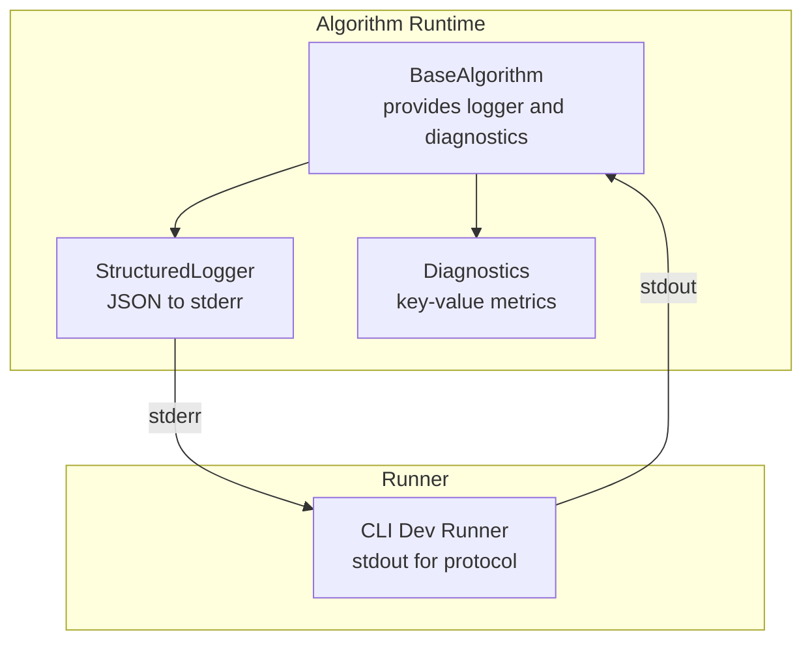
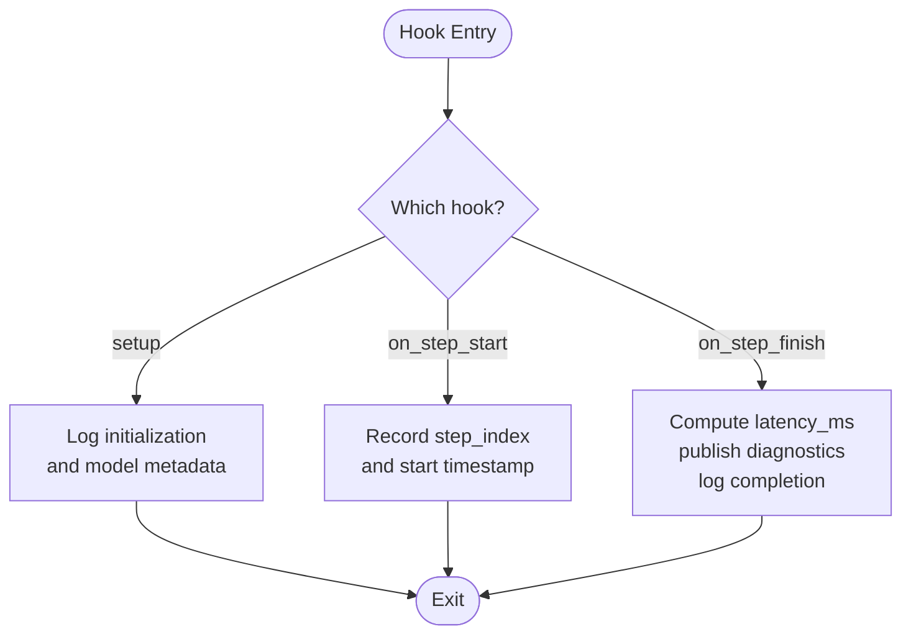
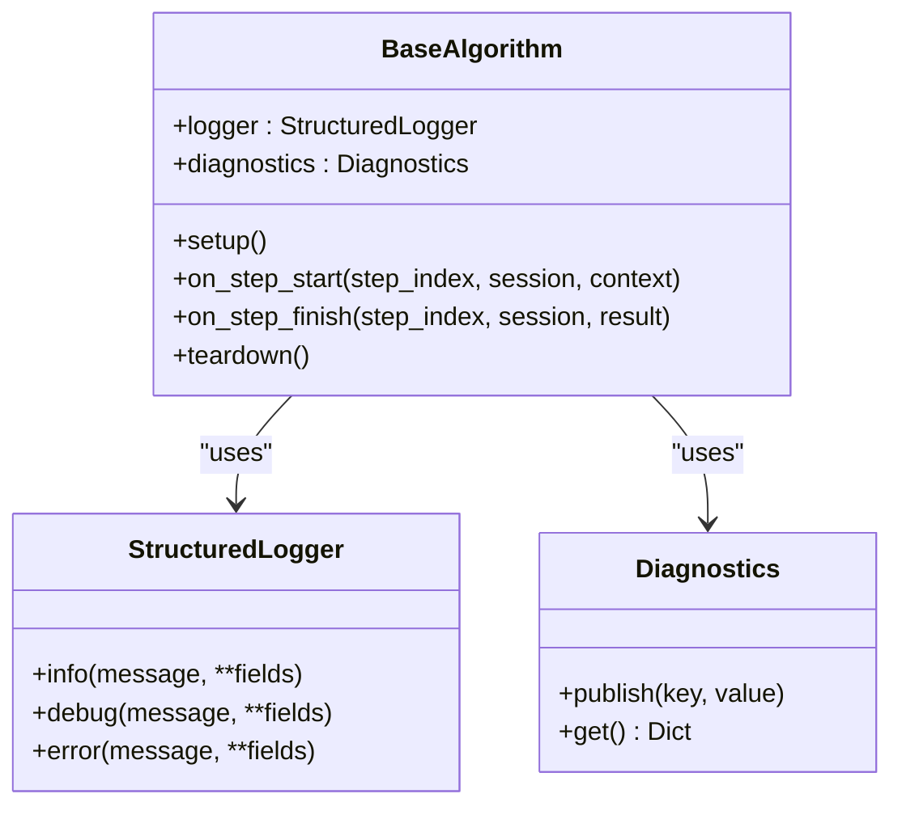

# Logging Guidelines

<cite>
**Referenced Files in This Document**
- [logger.py](file://procvision_algorithm_sdk/logger.py)
- [diagnostics.py](file://procvision_algorithm_sdk/diagnostics.py)
- [base.py](file://procvision_algorithm_sdk/base.py)
- [cli.py](file://procvision_algorithm_sdk/cli.py)
- [spec.md](file://spec.md)
- [algorithm_dev_tutorial.md](file://algorithm_dev_tutorial.md)
</cite>

## Table of Contents
1. [Introduction](#introduction)
2. [Project Structure](#project-structure)
3. [Core Components](#core-components)
4. [Architecture Overview](#architecture-overview)
5. [Detailed Component Analysis](#detailed-component-analysis)
6. [Dependency Analysis](#dependency-analysis)
7. [Performance Considerations](#performance-considerations)
8. [Troubleshooting Guide](#troubleshooting-guide)
9. [Conclusion](#conclusion)
10. [Appendices](#appendices)

## Introduction
This document defines structured logging guidelines for ProcVision algorithms built with the SDK. It explains how to use StructuredLogger.info/debug/error to emit JSON-formatted logs to stderr, including required fields such as timestamp_ms, level, and message, plus custom fields like step_index and latency_ms. It also clarifies how logs are isolated from protocol messages on stdout to prevent communication channel pollution, and provides practical examples from the algorithm development tutorial for setup, on_step_start, and on_step_finish.

## Project Structure
The logging capability is provided by a dedicated logger module and integrated into the BaseAlgorithm lifecycle. The CLI demonstrates how the algorithm’s stdout is reserved for protocol frames while stderr receives logs.



**Diagram sources**
- [base.py](file://procvision_algorithm_sdk/base.py#L1-L57)
- [logger.py](file://procvision_algorithm_sdk/logger.py#L1-L24)
- [diagnostics.py](file://procvision_algorithm_sdk/diagnostics.py#L1-L11)
- [cli.py](file://procvision_algorithm_sdk/cli.py#L199-L236)
- [spec.md](file://spec.md#L630-L650)

**Section sources**
- [base.py](file://procvision_algorithm_sdk/base.py#L1-L57)
- [logger.py](file://procvision_algorithm_sdk/logger.py#L1-L24)
- [diagnostics.py](file://procvision_algorithm_sdk/diagnostics.py#L1-L11)
- [cli.py](file://procvision_algorithm_sdk/cli.py#L199-L236)
- [spec.md](file://spec.md#L630-L650)

## Core Components
- StructuredLogger: Emits JSON records to stderr with standardized fields and custom key/value pairs.
- Diagnostics: Aggregates key-value metrics for later inclusion in logs or results.
- BaseAlgorithm: Provides logger and diagnostics instances to algorithm implementations.

Key behaviors:
- Required fields: level, timestamp_ms, message.
- Optional/custom fields: step_index, latency_ms, and any domain-specific keys.
- Output destination: stderr (logs) versus stdout (protocol frames).

**Section sources**
- [logger.py](file://procvision_algorithm_sdk/logger.py#L1-L24)
- [diagnostics.py](file://procvision_algorithm_sdk/diagnostics.py#L1-L11)
- [base.py](file://procvision_algorithm_sdk/base.py#L1-L57)

## Architecture Overview
The runtime architecture separates protocol frames from logs by channel. Protocol messages are written to stdout; logs are written to stderr. The CLI orchestrates the lifecycle and ensures logs do not interfere with protocol streams.

```mermaid
sequenceDiagram
participant Runner as "Runner (stdout)"
participant Algo as "Algorithm (stdout)"
participant Logger as "StructuredLogger (stderr)"
Runner->>Algo : "Protocol frame"
Algo-->>Runner : "Protocol frame"
Algo->>Logger : "info/debug/error(...)"
Logger-->>Runner : "No protocol output"
Note over Logger,Runner : "Logs go to stderr; protocol stays on stdout"
```

**Diagram sources**
- [spec.md](file://spec.md#L630-L650)
- [cli.py](file://procvision_algorithm_sdk/cli.py#L199-L236)
- [logger.py](file://procvision_algorithm_sdk/logger.py#L1-L24)

## Detailed Component Analysis

### StructuredLogger
StructuredLogger writes a single-line JSON record per log entry. The record includes:
- Required fields: level, timestamp_ms, message.
- Custom fields: any additional key/value pairs passed to info/debug/error.

Implementation highlights:
- Sink defaults to stderr.
- Timestamp is milliseconds since epoch.
- Records are flushed immediately to ensure timely visibility.

Best practices:
- Keep message human-readable and concise.
- Use custom fields to carry structured context (e.g., step_index, latency_ms).
- Avoid embedding binary or unserializable data in custom fields.

**Section sources**
- [logger.py](file://procvision_algorithm_sdk/logger.py#L1-L24)

### Diagnostics
Diagnostics maintains a dictionary of metrics and labels that can be published during execution and later included in logs or results. This enables platform aggregation of performance and diagnostic signals.

Best practices:
- Publish numeric metrics suitable for histograms and averages.
- Keep keys descriptive and consistent across runs.
- Retrieve diagnostics via get() and merge into debug payloads.

**Section sources**
- [diagnostics.py](file://procvision_algorithm_sdk/diagnostics.py#L1-L11)

### BaseAlgorithm Integration
BaseAlgorithm initializes logger and diagnostics instances for each algorithm instance. Hooks such as setup, on_step_start, on_step_finish, and teardown are the primary places to emit structured logs and diagnostics.

Lifecycle hooks:
- setup: Initialize resources and log initialization events.
- on_step_start: Record step transitions and begin timing.
- on_step_finish: Emit latency and summarize diagnostics.
- teardown: Log cleanup and resource release.

**Section sources**
- [base.py](file://procvision_algorithm_sdk/base.py#L1-L57)

### Example Usage from Tutorial
The tutorial demonstrates logging in lifecycle hooks and shows how to compute and log latency_ms alongside step_index. It also illustrates publishing diagnostics for platform aggregation.

- setup: Log initialization and model metadata.
- on_step_start: Record step_index and start timing.
- on_step_finish: Compute latency_ms and publish to diagnostics and logs.

See:
- Hook signatures and semantics: [Hook definitions](file://procvision_algorithm_sdk/base.py#L1-L57)
- Tutorial examples: [Algorithm tutorial](file://algorithm_dev_tutorial.md#L1-L348)

**Section sources**
- [base.py](file://procvision_algorithm_sdk/base.py#L1-L57)
- [algorithm_dev_tutorial.md](file://algorithm_dev_tutorial.md#L1-L348)

### Protocol Isolation: stdout vs stderr
The specification mandates that protocol frames are sent on stdout, while logs must go to stderr. The CLI run flow confirms that stdout is used for protocol messages and stderr for logs.

Evidence:
- Protocol isolation requirement: [Protocol isolation](file://spec.md#L630-L650)
- CLI run flow writing protocol frames to stdout: [Run flow](file://procvision_algorithm_sdk/cli.py#L199-L236)

**Section sources**
- [spec.md](file://spec.md#L630-L650)
- [cli.py](file://procvision_algorithm_sdk/cli.py#L199-L236)

### Logging Fields and Verbosity
Required fields:
- level: "info", "debug", or "error".
- timestamp_ms: integer milliseconds since epoch.
- message: human-readable event description.

Optional/custom fields commonly used:
- step_index: integer step identifier.
- latency_ms: computed duration for step transitions or processing.

Verbosity recommendations:
- Use info for significant events (resource loading, step transitions).
- Use debug for fine-grained timing and intermediate states.
- Use error for failures and recoverable issues.

Machine parsability:
- Keep all fields JSON serializable.
- Avoid interleaving logs with protocol frames on stdout.

**Section sources**
- [logger.py](file://procvision_algorithm_sdk/logger.py#L1-L24)
- [algorithm_dev_tutorial.md](file://algorithm_dev_tutorial.md#L1-L348)
- [spec.md](file://spec.md#L630-L650)

### Logging in Lifecycle Hooks: Setup, on_step_start, on_step_finish
- setup: Log initialization, model version, and resource acquisition.
- on_step_start: Log step_index and start timing; store timestamps in session for later computation.
- on_step_finish: Compute latency_ms, publish to diagnostics, and log step completion with step_index and latency_ms.

Example references:
- Hook definitions: [Hooks](file://procvision_algorithm_sdk/base.py#L1-L57)
- Tutorial usage: [Tutorial examples](file://algorithm_dev_tutorial.md#L1-L348)



**Diagram sources**
- [base.py](file://procvision_algorithm_sdk/base.py#L1-L57)
- [algorithm_dev_tutorial.md](file://algorithm_dev_tutorial.md#L1-L348)

**Section sources**
- [base.py](file://procvision_algorithm_sdk/base.py#L1-L57)
- [algorithm_dev_tutorial.md](file://algorithm_dev_tutorial.md#L1-L348)

## Dependency Analysis
The BaseAlgorithm composes StructuredLogger and Diagnostics. The CLI orchestrates lifecycle calls and ensures protocol frames remain on stdout.



**Diagram sources**
- [base.py](file://procvision_algorithm_sdk/base.py#L1-L57)
- [logger.py](file://procvision_algorithm_sdk/logger.py#L1-L24)
- [diagnostics.py](file://procvision_algorithm_sdk/diagnostics.py#L1-L11)

**Section sources**
- [base.py](file://procvision_algorithm_sdk/base.py#L1-L57)
- [logger.py](file://procvision_algorithm_sdk/logger.py#L1-L24)
- [diagnostics.py](file://procvision_algorithm_sdk/diagnostics.py#L1-L11)

## Performance Considerations
- Prefer lightweight logging in hot paths; defer heavy serialization to debug level.
- Use Diagnostics for aggregatable metrics to minimize log volume.
- Avoid excessive flushes; StructuredLogger flushes per record, which is appropriate for observability.

[No sources needed since this section provides general guidance]

## Troubleshooting Guide
Common issues and remedies:
- Logs not appearing: Verify logs are emitted to stderr and not mixed with stdout protocol frames.
- Missing fields: Ensure level, timestamp_ms, and message are present; add custom fields like step_index and latency_ms.
- Serialization errors: Ensure all custom fields are JSON serializable.
- Timing discrepancies: Confirm step_index increments correctly and latency_ms is computed from timestamps recorded in on_step_start and on_step_finish.

**Section sources**
- [logger.py](file://procvision_algorithm_sdk/logger.py#L1-L24)
- [algorithm_dev_tutorial.md](file://algorithm_dev_tutorial.md#L1-L348)
- [spec.md](file://spec.md#L630-L650)

## Conclusion
Structured logging with StructuredLogger ensures machine-parsable, context-rich logs that support debugging and monitoring. By emitting logs to stderr and reserving stdout for protocol frames, algorithms remain robust against channel pollution. Use info for key events, debug for timing, and error for failures. Include step_index and latency_ms to enable precise diagnostics across steps.

[No sources needed since this section summarizes without analyzing specific files]

## Appendices

### Field Reference
- Required:
  - level: "info", "debug", or "error"
  - timestamp_ms: integer milliseconds since epoch
  - message: string description
- Optional/custom:
  - step_index: integer step index
  - latency_ms: computed duration
  - Any other domain-specific keys

**Section sources**
- [logger.py](file://procvision_algorithm_sdk/logger.py#L1-L24)
- [algorithm_dev_tutorial.md](file://algorithm_dev_tutorial.md#L1-L348)