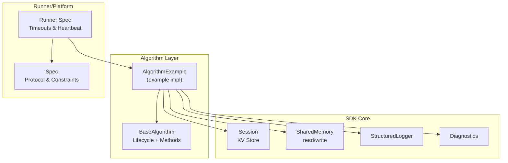
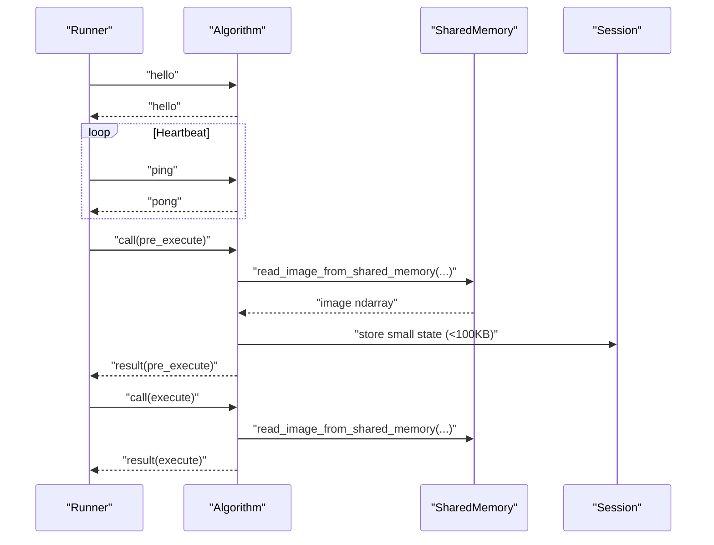
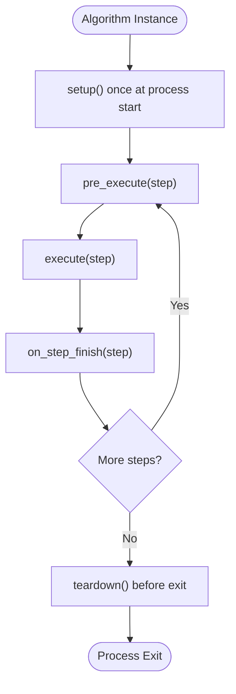
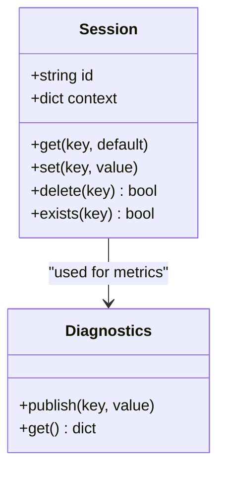
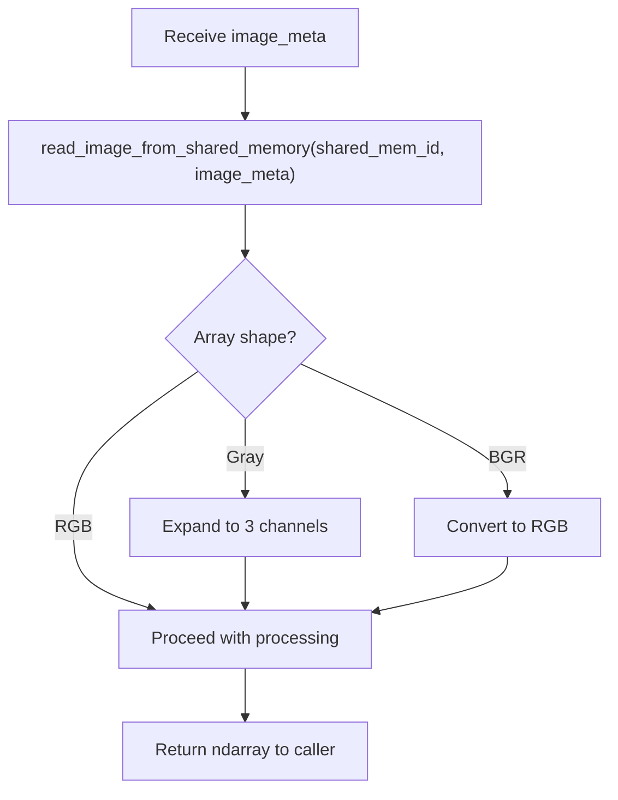
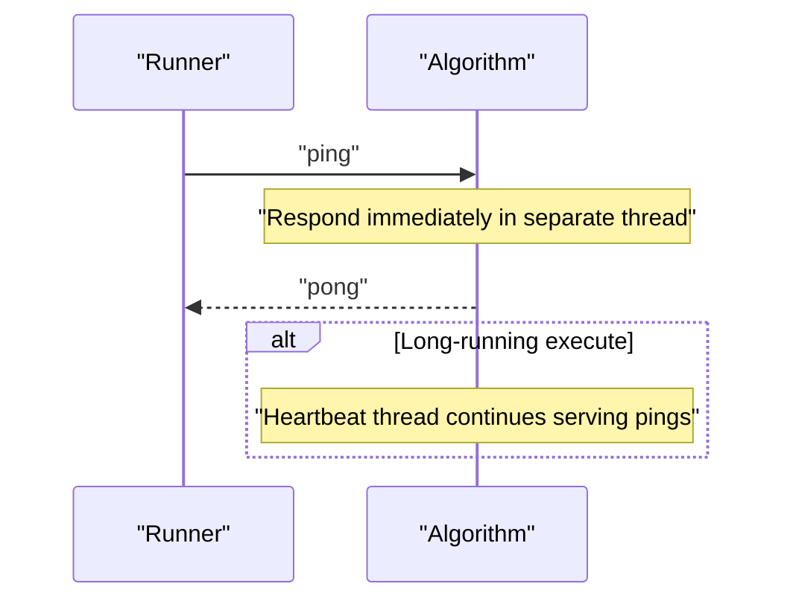
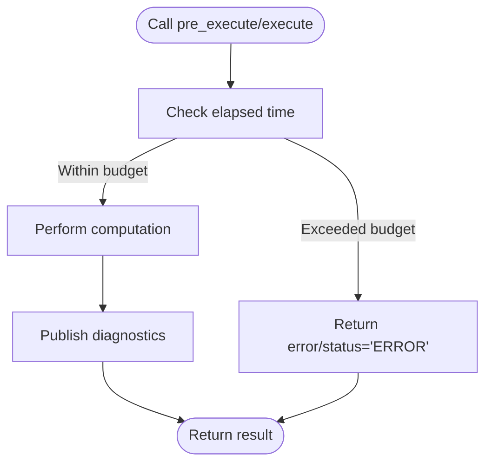
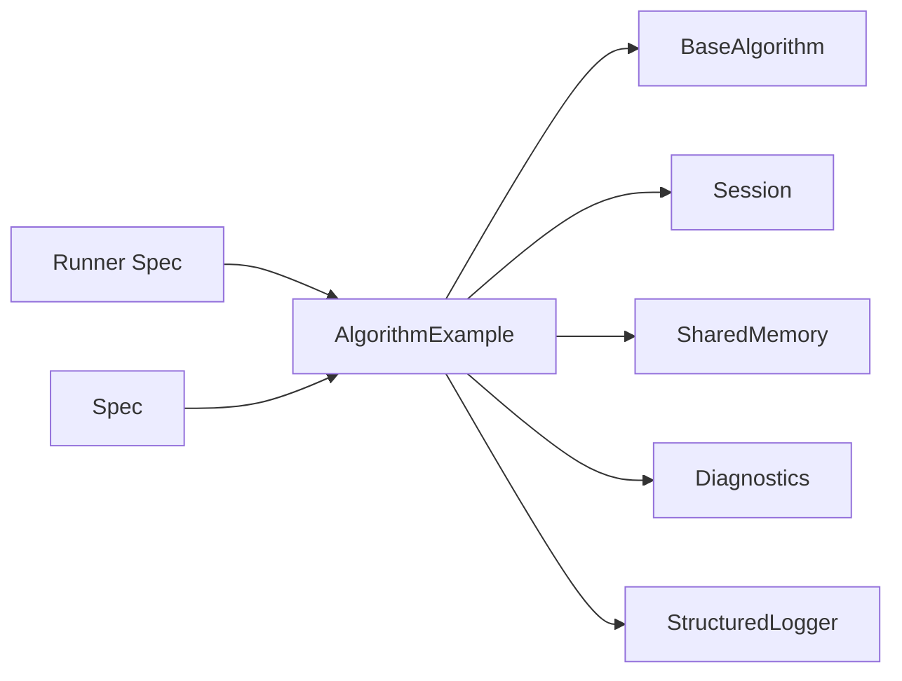

# Performance Optimization

<cite>
**Referenced Files in This Document**
- [base.py](file://procvision_algorithm_sdk/base.py)
- [session.py](file://procvision_algorithm_sdk/session.py)
- [shared_memory.py](file://procvision_algorithm_sdk/shared_memory.py)
- [diagnostics.py](file://procvision_algorithm_sdk/diagnostics.py)
- [logger.py](file://procvision_algorithm_sdk/logger.py)
- [spec.md](file://spec.md)
- [runner_spec.md](file://runner_spec.md)
- [algorithm_example/main.py](file://algorithm-example/algorithm_example/main.py)
</cite>

## Table of Contents
1. [Introduction](#introduction)
2. [Project Structure](#project-structure)
3. [Core Components](#core-components)
4. [Architecture Overview](#architecture-overview)
5. [Detailed Component Analysis](#detailed-component-analysis)
6. [Dependency Analysis](#dependency-analysis)
7. [Performance Considerations](#performance-considerations)
8. [Troubleshooting Guide](#troubleshooting-guide)
9. [Conclusion](#conclusion)
10. [Appendices](#appendices)

## Introduction
This document focuses on performance optimization for ProcVision algorithm development. It consolidates best practices around resource lifecycle, image processing efficiency, session state storage limits, asynchronous heartbeat handling, and timeouts defined in the specification. It also highlights common pitfalls such as repeated model loading and improper shared memory usage.

## Project Structure
The SDK provides a minimal yet powerful foundation for algorithm development:
- BaseAlgorithm defines lifecycle hooks and abstract methods for pre_execute and execute.
- Session offers lightweight, in-process state storage for cross-step sharing.
- SharedMemory utilities enable fast image acquisition from shared memory.
- Diagnostics and StructuredLogger support structured logging and diagnostic aggregation.
- The specification documents timeouts, heartbeat behavior, and protocol constraints.

**Diagram sources**
- [base.py](file://procvision_algorithm_sdk/base.py#L1-L58)
- [session.py](file://procvision_algorithm_sdk/session.py#L1-L36)
- [shared_memory.py](file://procvision_algorithm_sdk/shared_memory.py#L1-L53)
- [logger.py](file://procvision_algorithm_sdk/logger.py#L1-L24)
- [diagnostics.py](file://procvision_algorithm_sdk/diagnostics.py#L1-L12)
- [runner_spec.md](file://runner_spec.md#L1-L282)
- [spec.md](file://spec.md#L634-L689)

**Section sources**
- [base.py](file://procvision_algorithm_sdk/base.py#L1-L58)
- [session.py](file://procvision_algorithm_sdk/session.py#L1-L36)
- [shared_memory.py](file://procvision_algorithm_sdk/shared_memory.py#L1-L53)
- [logger.py](file://procvision_algorithm_sdk/logger.py#L1-L24)
- [diagnostics.py](file://procvision_algorithm_sdk/diagnostics.py#L1-L12)
- [runner_spec.md](file://runner_spec.md#L1-L282)
- [spec.md](file://spec.md#L634-L689)

## Core Components
- BaseAlgorithm: Defines setup, teardown, on_step_start, on_step_finish, reset, get_info, pre_execute, and execute. Resource-heavy initialization belongs in setup; compute-heavy logic in pre_execute/execute.
- Session: Lightweight KV store for cross-step sharing; keep data under 100KB and avoid storing large binary objects.
- SharedMemory: Provides read_image_from_shared_memory with JPEG-only image_meta and robust fallback behavior.
- Diagnostics: Aggregates metrics for reporting to platform UI.
- StructuredLogger: Emits JSON records to stderr for protocol isolation.

**Section sources**
- [base.py](file://procvision_algorithm_sdk/base.py#L1-L58)
- [session.py](file://procvision_algorithm_sdk/session.py#L1-L36)
- [shared_memory.py](file://procvision_algorithm_sdk/shared_memory.py#L1-L53)
- [diagnostics.py](file://procvision_algorithm_sdk/diagnostics.py#L1-L12)
- [logger.py](file://procvision_algorithm_sdk/logger.py#L1-L24)

## Architecture Overview
The algorithm communicates with the runner via stdin/stdout frames. Heartbeat pings must be responded to promptly; pre_execute and execute must respect timeout budgets. Images are passed via shared memory with minimal metadata.

**Diagram sources**
- [runner_spec.md](file://runner_spec.md#L1-L282)
- [spec.md](file://spec.md#L634-L689)
- [shared_memory.py](file://procvision_algorithm_sdk/shared_memory.py#L1-L53)
- [session.py](file://procvision_algorithm_sdk/session.py#L1-L36)

## Detailed Component Analysis

### BaseAlgorithm Lifecycle and Resource Management
- setup(): Load models and heavy resources here. Initialize caches keyed by PID if needed.
- teardown(): Release models and free memory.
- on_step_start/on_step_finish(): Record timing and publish diagnostics.
- reset(): Clear transient state for retries.

**Diagram sources**
- [base.py](file://procvision_algorithm_sdk/base.py#L1-L58)

**Section sources**
- [base.py](file://procvision_algorithm_sdk/base.py#L1-L58)

### Session State Storage Best Practices
- Keep data under 100KB; avoid large binary objects.
- Use JSON-serializable values; set() validates serializability.
- Use keys scoped to step or detection flow to avoid collisions.
- Delete temporary keys in reset() or on_step_finish().

**Diagram sources**
- [session.py](file://procvision_algorithm_sdk/session.py#L1-L36)
- [diagnostics.py](file://procvision_algorithm_sdk/diagnostics.py#L1-L12)

**Section sources**
- [session.py](file://procvision_algorithm_sdk/session.py#L1-L36)
- [diagnostics.py](file://procvision_algorithm_sdk/diagnostics.py#L1-L12)

### Image Processing with NumPy and Pillow
- Use read_image_from_shared_memory to obtain a numpy array.
- Prefer in-place operations and views to minimize copies.
- Convert color spaces efficiently; avoid repeated conversions.
- For grayscale inputs, expand to 3 channels once per pipeline stage.
- Avoid storing large arrays in Session; pass via shared memory ID and meta.

**Diagram sources**
- [shared_memory.py](file://procvision_algorithm_sdk/shared_memory.py#L1-L53)

**Section sources**
- [shared_memory.py](file://procvision_algorithm_sdk/shared_memory.py#L1-L53)

### Asynchronous Heartbeat Handling
- Runner sends ping every 5 seconds; algorithm must reply pong within 2 seconds.
- Implement heartbeat handling in a dedicated thread to avoid blocking execute().
- Do not log heartbeat frames; Runner handles heartbeat logs.

**Diagram sources**
- [runner_spec.md](file://runner_spec.md#L1-L282)
- [spec.md](file://spec.md#L639-L678)

**Section sources**
- [runner_spec.md](file://runner_spec.md#L1-L282)
- [spec.md](file://spec.md#L639-L678)

### Timeouts and Pre-Execute/Execute Budgets
- pre_execute timeout: 10 seconds.
- execute timeout: 30 seconds.
- Implement early exits and short-circuit logic to respect budget.
- Use diagnostics to report latency and model version.

**Diagram sources**
- [spec.md](file://spec.md#L678-L689)

**Section sources**
- [spec.md](file://spec.md#L678-L689)

### Example Algorithm Patterns
- The example demonstrates:
  - Using setup() to initialize model version.
  - Recording step latency via Session and Diagnostics.
  - Returning structured results with debug fields.

**Section sources**
- [algorithm_example/main.py](file://algorithm-example/algorithm_example/main.py#L1-L150)

## Dependency Analysis
The algorithm depends on BaseAlgorithm, Session, SharedMemory, Diagnostics, and Logger. The runner enforces timeouts and heartbeat policies.

**Diagram sources**
- [algorithm_example/main.py](file://algorithm-example/algorithm_example/main.py#L1-L150)
- [base.py](file://procvision_algorithm_sdk/base.py#L1-L58)
- [session.py](file://procvision_algorithm_sdk/session.py#L1-L36)
- [shared_memory.py](file://procvision_algorithm_sdk/shared_memory.py#L1-L53)
- [diagnostics.py](file://procvision_algorithm_sdk/diagnostics.py#L1-L12)
- [logger.py](file://procvision_algorithm_sdk/logger.py#L1-L24)
- [runner_spec.md](file://runner_spec.md#L1-L282)
- [spec.md](file://spec.md#L634-L689)

**Section sources**
- [algorithm_example/main.py](file://algorithm-example/algorithm_example/main.py#L1-L150)
- [base.py](file://procvision_algorithm_sdk/base.py#L1-L58)
- [session.py](file://procvision_algorithm_sdk/session.py#L1-L36)
- [shared_memory.py](file://procvision_algorithm_sdk/shared_memory.py#L1-L53)
- [diagnostics.py](file://procvision_algorithm_sdk/diagnostics.py#L1-L12)
- [logger.py](file://procvision_algorithm_sdk/logger.py#L1-L24)
- [runner_spec.md](file://runner_spec.md#L1-L282)
- [spec.md](file://spec.md#L634-L689)

## Performance Considerations
- Resource initialization
  - Move model loading and heavy resource initialization into setup() rather than __init__(). This ensures resources are loaded once per process and reused across PIDs.
  - Keep model version and PID-specific caches initialized during setup; avoid reloading models per step.
- Image processing
  - Use numpy arrays directly from read_image_from_shared_memory.
  - Minimize redundant conversions; convert once per pipeline stage.
  - Avoid copying large arrays; use views and in-place operations where possible.
- Session state storage
  - Keep Session data under 100KB; avoid storing large binary objects.
  - Use JSON-serializable primitives; delete temporary keys after use.
- Heartbeat and timeouts
  - Implement asynchronous heartbeat handling to prevent execute() from blocking ping responses.
  - Respect pre_execute (10s) and execute (30s) budgets; short-circuit early on failure conditions.
- Diagnostics and logging
  - Emit structured logs via StructuredLogger; avoid printing to stdout to keep protocol clean.
  - Publish latency and model version via Diagnostics for visibility.

[No sources needed since this section provides general guidance]

## Troubleshooting Guide
Common performance pitfalls and remedies:
- Repeated model loading
  - Symptom: High latency in pre_execute/execute.
  - Fix: Move model loading to setup(); cache per PID if needed.
- Improper shared memory usage
  - Symptom: Excessive memory usage or slow reads.
  - Fix: Do not store large arrays in Session; rely on shared memory ID and image_meta.
- Blocking heartbeat
  - Symptom: Runner reports heartbeat timeout.
  - Fix: Handle heartbeat asynchronously; do not perform long-running work in the main thread.
- Excessive Session size
  - Symptom: Memory pressure or serialization errors.
  - Fix: Keep Session under 100KB; delete temporary keys after steps.
- Missing diagnostics
  - Symptom: Hard-to-trace performance regressions.
  - Fix: Publish latency and model version via Diagnostics; log via StructuredLogger.

**Section sources**
- [session.py](file://procvision_algorithm_sdk/session.py#L1-L36)
- [shared_memory.py](file://procvision_algorithm_sdk/shared_memory.py#L1-L53)
- [runner_spec.md](file://runner_spec.md#L1-L282)
- [spec.md](file://spec.md#L639-L678)

## Conclusion
By centralizing resource initialization in setup(), leveraging efficient numpy/Pillow workflows, adhering to Session size limits, and implementing asynchronous heartbeat handling, algorithms can meet strict timeout budgets while maintaining reliability and observability. The provided patterns and constraints in the specification and SDK guide ensure predictable performance across diverse industrial scenarios.

[No sources needed since this section summarizes without analyzing specific files]

## Appendices
- Timeout and heartbeat parameters
  - pre_execute timeout: 10 seconds
  - execute timeout: 30 seconds
  - heartbeat interval: 5 seconds
  - heartbeat grace: 2 seconds
  - maximum retries: 2
  - graceful termination window: 3 seconds
  - automatic restart limit: 3

**Section sources**
- [runner_spec.md](file://runner_spec.md#L1-L282)
- [spec.md](file://spec.md#L678-L689)