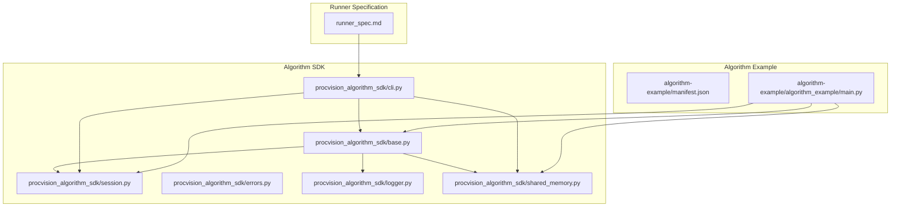
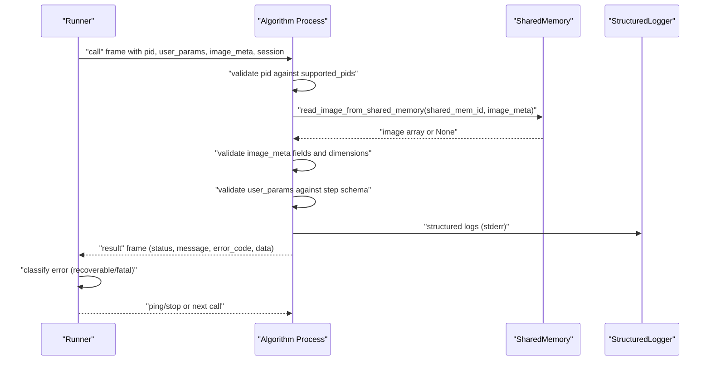
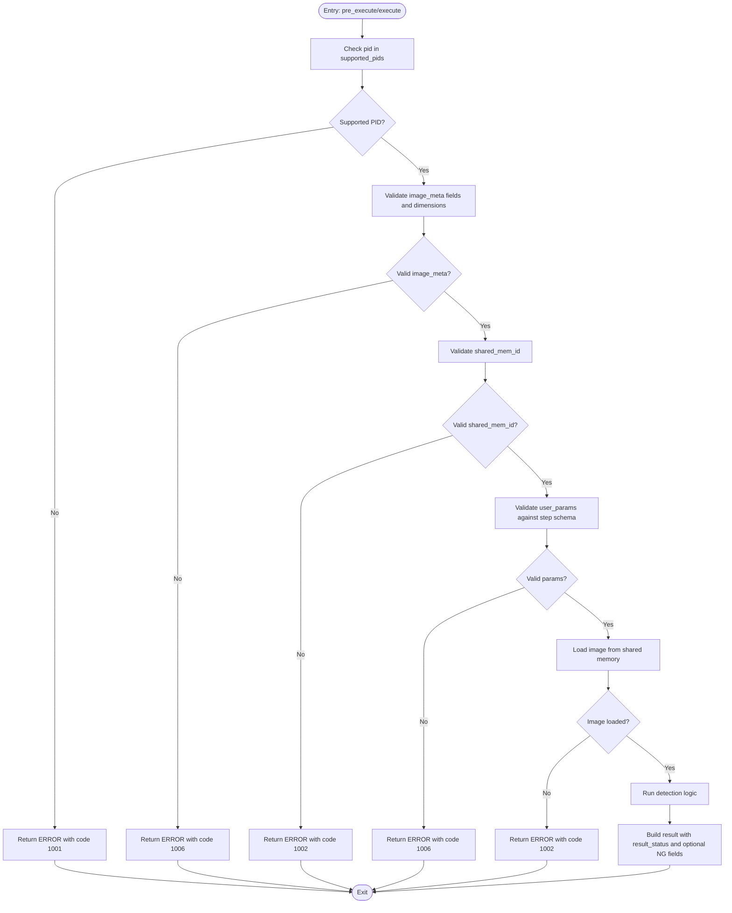
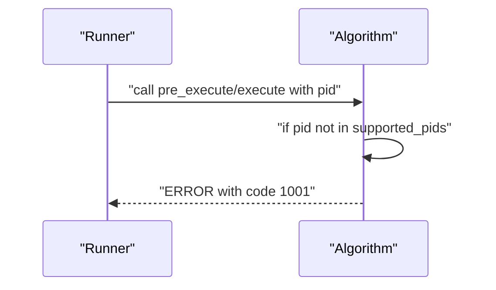
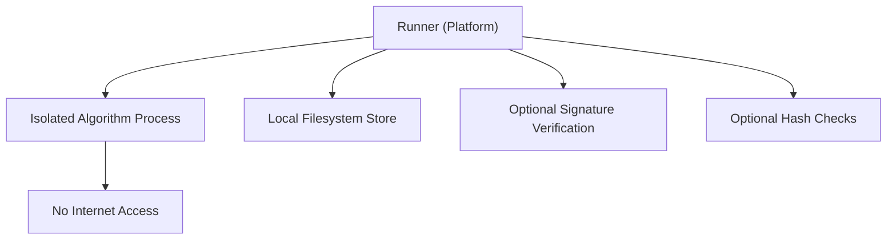
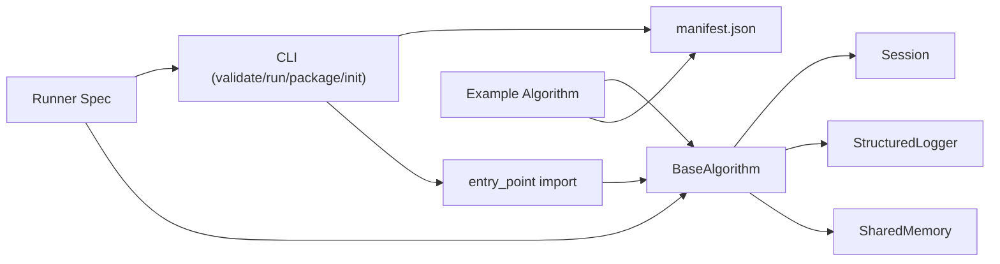

# Security Practices

<cite>
**Referenced Files in This Document**
- [runner_spec.md](file://runner_spec.md)
- [README.md](file://README.md)
- [spec.md](file://spec.md)
- [procvision_algorithm_sdk/base.py](file://procvision_algorithm_sdk/base.py)
- [procvision_algorithm_sdk/session.py](file://procvision_algorithm_sdk/session.py)
- [procvision_algorithm_sdk/errors.py](file://procvision_algorithm_sdk/errors.py)
- [procvision_algorithm_sdk/cli.py](file://procvision_algorithm_sdk/cli.py)
- [procvision_algorithm_sdk/logger.py](file://procvision_algorithm_sdk/logger.py)
- [procvision_algorithm_sdk/shared_memory.py](file://procvision_algorithm_sdk/shared_memory.py)
- [algorithm-example/algorithm_example/main.py](file://algorithm-example/algorithm_example/main.py)
- [algorithm-example/manifest.json](file://algorithm-example/manifest.json)
</cite>

## Table of Contents
1. [Introduction](#introduction)
2. [Project Structure](#project-structure)
3. [Core Components](#core-components)
4. [Architecture Overview](#architecture-overview)
5. [Detailed Component Analysis](#detailed-component-analysis)
6. [Dependency Analysis](#dependency-analysis)
7. [Performance Considerations](#performance-considerations)
8. [Troubleshooting Guide](#troubleshooting-guide)
9. [Conclusion](#conclusion)
10. [Appendices](#appendices)

## Introduction
This document consolidates security practices for ProcVision algorithm development. It focuses on input validation for user_params and image_meta to prevent injection and malformed data processing, validates that the received PID is within the algorithm’s supported_pids list to prevent unauthorized product processing, and outlines secure coding practices such as avoiding dynamic code execution and external network calls. It also documents the platform’s security model (isolated environment without internet access), error message handling to avoid information leakage, and references runner_spec.md’s security constraints regarding access boundaries and optional signature verification for algorithm packages.

## Project Structure
The repository provides:
- An SDK with base algorithm abstraction, session state, structured logging, diagnostics, and shared memory utilities
- A CLI for local validation, packaging, and simulation
- Example algorithm implementation and manifest
- Runner specification detailing platform-side runtime behavior, security constraints, and optional signing

**Diagram sources**
- [procvision_algorithm_sdk/base.py](file://procvision_algorithm_sdk/base.py#L1-L58)
- [procvision_algorithm_sdk/session.py](file://procvision_algorithm_sdk/session.py#L1-L36)
- [procvision_algorithm_sdk/errors.py](file://procvision_algorithm_sdk/errors.py#L1-L14)
- [procvision_algorithm_sdk/logger.py](file://procvision_algorithm_sdk/logger.py#L1-L24)
- [procvision_algorithm_sdk/shared_memory.py](file://procvision_algorithm_sdk/shared_memory.py#L1-L53)
- [procvision_algorithm_sdk/cli.py](file://procvision_algorithm_sdk/cli.py#L1-L615)
- [algorithm-example/algorithm_example/main.py](file://algorithm-example/algorithm_example/main.py#L1-L150)
- [algorithm-example/manifest.json](file://algorithm-example/manifest.json#L1-L25)
- [runner_spec.md](file://runner_spec.md#L1-L283)

**Section sources**
- [README.md](file://README.md#L1-L116)
- [runner_spec.md](file://runner_spec.md#L1-L283)

## Core Components
- BaseAlgorithm: Defines lifecycle hooks and abstract methods for pre_execute and execute, with access to Session, StructuredLogger, and Diagnostics.
- Session: Provides a JSON-serializable state store and context for cross-step persistence.
- StructuredLogger: Emits structured log records to stderr for Runner aggregation.
- Diagnostics: Publishes diagnostic metrics for performance and debugging.
- SharedMemory Utilities: Read/write image data from shared memory with minimal decoding support.
- CLI: Validates algorithm packages, simulates execution, and packages offline deliverables.

Key security-relevant responsibilities:
- Validate PID against supported_pids in pre_execute and execute
- Validate image_meta fields and dimensions
- Validate user_params against declared step schemas
- Avoid dynamic code execution and external network calls
- Emit user-friendly error messages without exposing internal details

**Section sources**
- [procvision_algorithm_sdk/base.py](file://procvision_algorithm_sdk/base.py#L1-L58)
- [procvision_algorithm_sdk/session.py](file://procvision_algorithm_sdk/session.py#L1-L36)
- [procvision_algorithm_sdk/logger.py](file://procvision_algorithm_sdk/logger.py#L1-L24)
- [procvision_algorithm_sdk/shared_memory.py](file://procvision_algorithm_sdk/shared_memory.py#L1-L53)
- [procvision_algorithm_sdk/cli.py](file://procvision_algorithm_sdk/cli.py#L1-L615)
- [algorithm-example/algorithm_example/main.py](file://algorithm-example/algorithm_example/main.py#L1-L150)

## Architecture Overview
The platform runs algorithms in isolated processes without internet access. Algorithms receive user_params and image_meta via stdin/stdout frames, and must validate inputs strictly before processing. The Runner enforces timeouts, heartbeats, and error classification, while the algorithm returns structured results with standardized error codes.

**Diagram sources**
- [runner_spec.md](file://runner_spec.md#L1-L283)
- [procvision_algorithm_sdk/shared_memory.py](file://procvision_algorithm_sdk/shared_memory.py#L1-L53)
- [procvision_algorithm_sdk/logger.py](file://procvision_algorithm_sdk/logger.py#L1-L24)
- [procvision_algorithm_sdk/base.py](file://procvision_algorithm_sdk/base.py#L1-L58)

## Detailed Component Analysis

### Input Validation Requirements for user_params and image_meta
- Validate that pid is included in supported_pids before processing.
- Validate image_meta fields: width, height, timestamp_ms, camera_id.
- Validate image dimensions within reasonable bounds.
- Validate shared_mem_id format and length.
- Validate user_params against the step’s declared schema (types, ranges, presence).
- Limit defect_rects count to protect downstream consumers.

**Diagram sources**
- [spec.md](file://spec.md#L1628-L1718)
- [procvision_algorithm_sdk/shared_memory.py](file://procvision_algorithm_sdk/shared_memory.py#L1-L53)

**Section sources**
- [spec.md](file://spec.md#L1628-L1718)
- [procvision_algorithm_sdk/shared_memory.py](file://procvision_algorithm_sdk/shared_memory.py#L1-L53)

### Validating PID Against supported_pids
- Algorithms must reject unsupported PIDs early with standardized error code 1001.
- The example algorithm demonstrates checking pid against self._supported_pids and returning an error response when mismatched.

**Diagram sources**
- [algorithm-example/algorithm_example/main.py](file://algorithm-example/algorithm_example/main.py#L1-L150)
- [runner_spec.md](file://runner_spec.md#L1-L283)

**Section sources**
- [algorithm-example/algorithm_example/main.py](file://algorithm-example/algorithm_example/main.py#L1-L150)
- [runner_spec.md](file://runner_spec.md#L1-L283)

### Secure Coding Practices
- Avoid dynamic code execution: do not use eval/exec/importlib.import_module dynamically from untrusted inputs; rely on static entry_point from manifest.
- Avoid external network calls: algorithms run in isolated environments without internet access; do not attempt outbound connections.
- Validate all inputs rigorously before use.
- Emit structured logs with user-friendly messages; avoid exposing stack traces or internal details.

Evidence from SDK:
- CLI imports entry_point statically and does not allow arbitrary dynamic imports.
- StructuredLogger writes to stderr; algorithms should avoid printing sensitive details.

**Section sources**
- [procvision_algorithm_sdk/cli.py](file://procvision_algorithm_sdk/cli.py#L1-L615)
- [procvision_algorithm_sdk/logger.py](file://procvision_algorithm_sdk/logger.py#L1-L24)
- [runner_spec.md](file://runner_spec.md#L1-L283)

### Platform Security Model and Access Boundaries
- Algorithms run in isolated processes without internet access.
- Runner injects environment variables and manages lifecycle; no secrets are provided to algorithms.
- Package management supports optional signature verification and hash checks for wheels/requirements.

**Diagram sources**
- [runner_spec.md](file://runner_spec.md#L1-L283)

**Section sources**
- [runner_spec.md](file://runner_spec.md#L1-L283)

### Error Message Handling and Information Leakage
- Use standardized error codes (e.g., 1001, 1002, 1006, 1004, 9999).
- Return user-friendly messages; avoid exposing internal stack traces or implementation details.
- Emit structured logs for diagnostics without leaking secrets.

**Section sources**
- [runner_spec.md](file://runner_spec.md#L1-L283)
- [procvision_algorithm_sdk/logger.py](file://procvision_algorithm_sdk/logger.py#L1-L24)

### Package Signing and Integrity (Optional)
- Runner can optionally verify signatures and hashes during installation to ensure integrity and provenance of algorithm packages.

**Section sources**
- [runner_spec.md](file://runner_spec.md#L253-L277)

## Dependency Analysis
The algorithm interacts with SDK components and the Runner protocol. The CLI validates manifests and entry points, and the example algorithm demonstrates PID and parameter validation.

**Diagram sources**
- [procvision_algorithm_sdk/cli.py](file://procvision_algorithm_sdk/cli.py#L1-L615)
- [procvision_algorithm_sdk/base.py](file://procvision_algorithm_sdk/base.py#L1-L58)
- [procvision_algorithm_sdk/session.py](file://procvision_algorithm_sdk/session.py#L1-L36)
- [procvision_algorithm_sdk/logger.py](file://procvision_algorithm_sdk/logger.py#L1-L24)
- [procvision_algorithm_sdk/shared_memory.py](file://procvision_algorithm_sdk/shared_memory.py#L1-L53)
- [runner_spec.md](file://runner_spec.md#L1-L283)
- [algorithm-example/algorithm_example/main.py](file://algorithm-example/algorithm_example/main.py#L1-L150)
- [algorithm-example/manifest.json](file://algorithm-example/manifest.json#L1-L25)

**Section sources**
- [procvision_algorithm_sdk/cli.py](file://procvision_algorithm_sdk/cli.py#L1-L615)
- [procvision_algorithm_sdk/base.py](file://procvision_algorithm_sdk/base.py#L1-L58)
- [procvision_algorithm_sdk/session.py](file://procvision_algorithm_sdk/session.py#L1-L36)
- [procvision_algorithm_sdk/logger.py](file://procvision_algorithm_sdk/logger.py#L1-L24)
- [procvision_algorithm_sdk/shared_memory.py](file://procvision_algorithm_sdk/shared_memory.py#L1-L53)
- [runner_spec.md](file://runner_spec.md#L1-L283)
- [algorithm-example/algorithm_example/main.py](file://algorithm-example/algorithm_example/main.py#L1-L150)
- [algorithm-example/manifest.json](file://algorithm-example/manifest.json#L1-L25)

## Performance Considerations
- Validate inputs early to fail fast and reduce unnecessary computation.
- Limit defect_rects count to bound memory and downstream processing costs.
- Use structured logs judiciously; excessive logging can impact performance.

[No sources needed since this section provides general guidance]

## Troubleshooting Guide
Common issues and resolutions:
- Unsupported PID: Ensure supported_pids in manifest and get_info match the incoming pid.
- Invalid image_meta: Verify width/height/timestamp_ms/camera_id presence and reasonableness.
- Invalid shared_mem_id: Confirm length/format and that the image was written prior to reading.
- Invalid user_params: Align with declared step schema (types, ranges, required fields).
- GPU OOM: Catch GPUOutOfMemoryError and return standardized error code 1004.
- Unknown errors: Return standardized error code 9999 with a user-friendly message.

**Section sources**
- [runner_spec.md](file://runner_spec.md#L1-L283)
- [procvision_algorithm_sdk/errors.py](file://procvision_algorithm_sdk/errors.py#L1-L14)
- [spec.md](file://spec.md#L1628-L1718)

## Conclusion
By enforcing strict input validation for PID, image_meta, and user_params, avoiding dynamic code execution and external network calls, and adhering to the Runner’s security model, algorithms remain robust, secure, and maintainable. Standardized error codes and user-friendly messages improve operability while preventing information disclosure.

[No sources needed since this section summarizes without analyzing specific files]

## Appendices

### Appendix A: Example Algorithm and Manifest
- The example algorithm demonstrates supported_pids validation and basic pre_execute/execute logic.
- The manifest declares entry_point and supported_pids.

**Section sources**
- [algorithm-example/algorithm_example/main.py](file://algorithm-example/algorithm_example/main.py#L1-L150)
- [algorithm-example/manifest.json](file://algorithm-example/manifest.json#L1-L25)