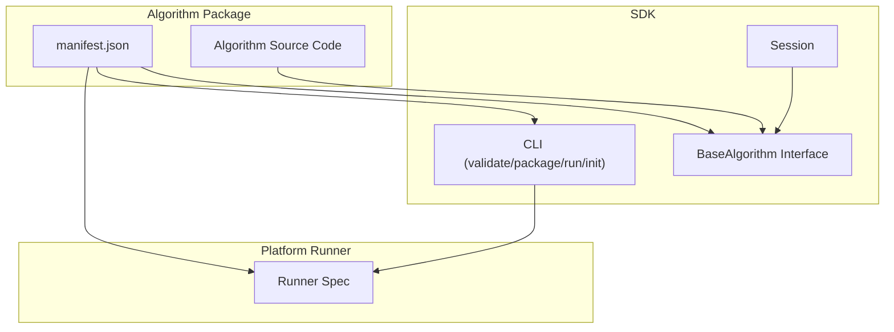
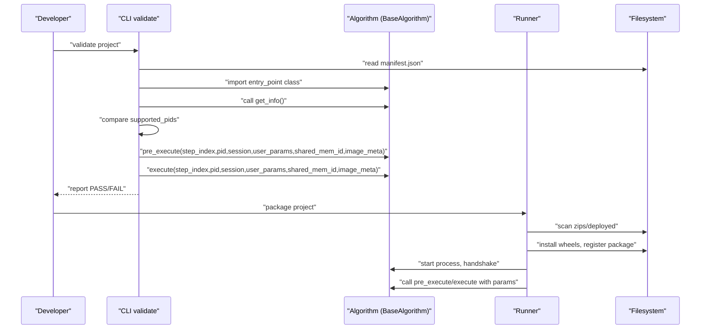
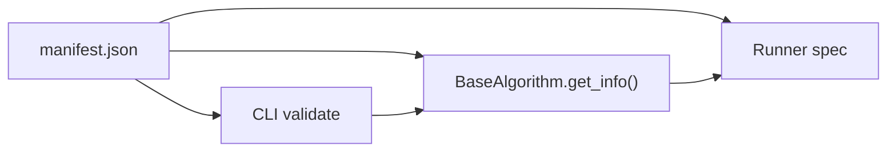

# Configuration

<cite>
**Referenced Files in This Document**
- [manifest.json](file://algorithm-example/manifest.json)
- [spec.md](file://spec.md)
- [runner_spec.md](file://runner_spec.md)
- [cli.py](file://procvision_algorithm_sdk/cli.py)
- [base.py](file://procvision_algorithm_sdk/base.py)
- [session.py](file://procvision_algorithm_sdk/session.py)
- [pyproject.toml](file://pyproject.toml)
- [README.md](file://README.md)
- [test_cli_validate.py](file://tests/test_cli_validate.py)
- [test_base_algo.py](file://tests/test_base_algo.py)
</cite>

## Table of Contents
1. [Introduction](#introduction)
2. [Project Structure](#project-structure)
3. [Core Components](#core-components)
4. [Architecture Overview](#architecture-overview)
5. [Detailed Component Analysis](#detailed-component-analysis)
6. [Dependency Analysis](#dependency-analysis)
7. [Performance Considerations](#performance-considerations)
8. [Troubleshooting Guide](#troubleshooting-guide)
9. [Conclusion](#conclusion)
10. [Appendices](#appendices)

## Introduction
This document explains the configuration system centered on manifest.json and how it integrates with the algorithm SDK and platform runtime. It covers:
- Manifest fields: name, version, entry_point, description, supported_pids, and steps (index, name, params)
- How params define user-configurable algorithm settings with type, default, validation (min/max), and metadata
- Alignment between manifest steps and get_info output
- Role of .procvision_env.json for packaging configuration (Python version, ABI, platform)
- Schema validation rules and examples of valid configurations
- How configuration drives platform integration, such as step parameter UI generation
- Best practices for versioning, PID management, and parameter design
- References to spec.md for complete schema specifications

## Project Structure
The configuration system spans:
- Algorithm example with manifest.json
- SDK base interface and CLI for validation and packaging
- Platform runner specification for deployment and runtime behavior
- Tests validating CLI behavior and basic algorithm contract

**Diagram sources**
- [manifest.json](file://algorithm-example/manifest.json#L1-L25)
- [cli.py](file://procvision_algorithm_sdk/cli.py#L1-L120)
- [base.py](file://procvision_algorithm_sdk/base.py#L1-L58)
- [session.py](file://procvision_algorithm_sdk/session.py#L1-L36)
- [runner_spec.md](file://runner_spec.md#L1-L120)

**Section sources**
- [manifest.json](file://algorithm-example/manifest.json#L1-L25)
- [cli.py](file://procvision_algorithm_sdk/cli.py#L1-L120)
- [base.py](file://procvision_algorithm_sdk/base.py#L1-L58)
- [session.py](file://procvision_algorithm_sdk/session.py#L1-L36)
- [runner_spec.md](file://runner_spec.md#L1-L120)

## Core Components
- manifest.json: Defines algorithm identity, entry point, supported product IDs, and step-level parameter schemas.
- get_info(): Returns the same algorithm identity and step schemas used by the platform to generate UI and validate runtime inputs.
- CLI validate: Validates manifest presence, required fields, entry import, supported_pids match, and smoke execution of pre_execute/execute.
- CLI package: Builds offline zip with wheels and manifest, honoring .procvision_env.json defaults.
- Runner spec: Describes how the platform loads, validates, and executes algorithms based on manifest and get_info.

**Section sources**
- [manifest.json](file://algorithm-example/manifest.json#L1-L25)
- [spec.md](file://spec.md#L868-L956)
- [cli.py](file://procvision_algorithm_sdk/cli.py#L35-L120)
- [runner_spec.md](file://runner_spec.md#L1-L120)

## Architecture Overview
The configuration-driven pipeline connects manifest.json and get_info() to platform runtime:

**Diagram sources**
- [cli.py](file://procvision_algorithm_sdk/cli.py#L35-L120)
- [spec.md](file://spec.md#L868-L956)
- [runner_spec.md](file://runner_spec.md#L120-L220)

## Detailed Component Analysis

### Manifest Fields and Their Roles
- name: Unique algorithm identifier. Must match get_info()["name"].
- version: Semantic version. Must match get_info()["version"].
- entry_point: Python import path to the algorithm class implementing BaseAlgorithm.
- description: Human-readable description.
- supported_pids: Product IDs supported by this algorithm package. Must match get_info()["supported_pids"].
- steps: Ordered list of algorithm steps. Each step defines:
  - index: Step index (platform convention starts at 1).
  - name: Human-readable step label.
  - params: List of parameter definitions for UI and validation.

Alignment between manifest steps and get_info output:
- The platform uses manifest.steps to render UI and collect user_params.
- get_info()["steps"] must mirror manifest.steps to ensure UI and backend agree on parameter keys and types.

Validation rules enforced by CLI:
- Required manifest fields: name, version, entry_point, supported_pids.
- supported_pids must match between manifest and get_info().
- get_info() must return a dict with steps as a list.
- pre_execute/execute must return dicts with status and message/data semantics.

**Section sources**
- [manifest.json](file://algorithm-example/manifest.json#L1-L25)
- [cli.py](file://procvision_algorithm_sdk/cli.py#L35-L120)
- [spec.md](file://spec.md#L868-L956)

### Parameter Schema: Types, Defaults, Validation, and Metadata
Parameter definitions live under steps[].params and describe user-configurable settings. Supported types and constraints are defined in spec.md:

- int: Supports min, max, unit.
- float: Supports min, max, unit.
- rect: Rectangular region definition with format and description; platform validates coordinates against image bounds.
- enum: Discrete choices with default.
- bool: Boolean switch.
- string: Supports min_length, max_length, pattern.

Metadata fields commonly used:
- key: Unique parameter key within the step.
- required: Boolean flag indicating mandatory parameters.
- default: Default value for the parameter.
- min/max: Numeric bounds for int/float.
- unit: Optional unit label (e.g., ms, lux).
- description: Human-readable description for UI tooltips.
- choices: Enum values.
- pattern: Optional regex for string validation.

Validation behavior:
- CLI smoke tests exercise pre_execute/execute with minimal user_params and verify status/message/data shape.
- Runner enforces step_index from 1 and passes user_params according to step param schema.

Best practices:
- Keep supported_pids small and explicit; limit to 1–20 per package.
- Use enums for modes and flags to reduce ambiguity.
- Provide sensible defaults and tight min/max bounds.
- Use units consistently for numeric parameters.

**Section sources**
- [spec.md](file://spec.md#L868-L956)
- [cli.py](file://procvision_algorithm_sdk/cli.py#L64-L120)

### Steps and Indexing
- Platform indexing: step_index starts at 1 in Runner calls.
- Algorithm indexing: get_info()["steps"][i]["index"] should align with platform expectations.
- Pre-execute vs execute:
  - pre_execute: No business result; may return calibration_rects and hints.
  - execute: Business result in data.result_status with optional ng_reason and defect_rects.

**Section sources**
- [runner_spec.md](file://runner_spec.md#L1-L120)
- [spec.md](file://spec.md#L868-L956)

### Packaging Configuration with .procvision_env.json
The CLI package command reads .procvision_env.json (if present) to set:
- python_version
- implementation
- abi
- wheels_platform

It then downloads wheels with platform-specific constraints and packages the offline zip. If .procvision_env.json is absent, the CLI falls back to defaults and attempts to auto-generate requirements.txt.

Key behaviors:
- Wheels downloaded with --only-binary=:all: to ensure offline installability.
- Wheels directory included in the zip archive.
- Offline zip includes manifest.json, requirements.txt, wheels/, and optional assets/.

**Section sources**
- [cli.py](file://procvision_algorithm_sdk/cli.py#L120-L220)
- [README.md](file://README.md#L60-L115)

### Alignment Between Manifest Steps and get_info Output
The platform uses manifest.steps to generate UI and collect user_params. At runtime, the algorithm’s get_info() must return identical steps to ensure:
- Parameter keys match
- Types and defaults match
- UI labels and descriptions match

The CLI validate routine verifies supported_pids equality between manifest and get_info(), and runs a smoke pre_execute/execute to confirm return shapes.

**Section sources**
- [cli.py](file://procvision_algorithm_sdk/cli.py#L35-L120)
- [spec.md](file://spec.md#L868-L956)

### Platform Integration and UI Generation
- Runner scans deployed packages, registers supported_pids, and routes calls by pid.
- During pre_execute/execute, Runner injects step_index, pid, session, user_params, shared_mem_id, and image_meta.
- get_info() informs the platform about step names and parameter schemas, enabling dynamic UI generation and validation.

**Section sources**
- [runner_spec.md](file://runner_spec.md#L120-L220)
- [spec.md](file://spec.md#L868-L956)

### Versioning, PID Management, and Parameter Design Best Practices
- Versioning:
  - Keep manifest.version and get_info()["version"] synchronized.
  - Use semantic versioning; increment major/minor/patch appropriately.
- PID management:
  - supported_pids should be precise and limited; avoid broad ranges.
  - Keep supported_pids in sync between manifest and get_info().
- Parameter design:
  - Prefer enums for discrete modes.
  - Provide defaults and tight bounds.
  - Use units for numeric parameters.
  - Keep parameter counts reasonable per step.

**Section sources**
- [cli.py](file://procvision_algorithm_sdk/cli.py#L35-L120)
- [spec.md](file://spec.md#L868-L956)

## Dependency Analysis
The configuration system depends on:
- manifest.json for identity and step schemas
- BaseAlgorithm.get_info() for runtime schema alignment
- CLI validate to enforce manifest and get_info consistency
- Runner spec for deployment and runtime invocation

**Diagram sources**
- [manifest.json](file://algorithm-example/manifest.json#L1-L25)
- [cli.py](file://procvision_algorithm_sdk/cli.py#L35-L120)
- [base.py](file://procvision_algorithm_sdk/base.py#L1-L58)
- [runner_spec.md](file://runner_spec.md#L1-L120)

**Section sources**
- [manifest.json](file://algorithm-example/manifest.json#L1-L25)
- [cli.py](file://procvision_algorithm_sdk/cli.py#L35-L120)
- [base.py](file://procvision_algorithm_sdk/base.py#L1-L58)
- [runner_spec.md](file://runner_spec.md#L1-L120)

## Performance Considerations
- Limit supported_pids to a manageable number (1–20) to reduce initialization overhead.
- Keep parameter lists concise per step to minimize UI rendering and validation costs.
- Avoid heavy resource loading in BaseAlgorithm.__init__; defer to setup() and use shared memory for images.

[No sources needed since this section provides general guidance]

## Troubleshooting Guide
Common issues and resolutions:
- Missing manifest.json or invalid fields:
  - CLI validate reports FAIL when required fields are missing.
- Entry import failure:
  - Ensure entry_point resolves to a subclass of BaseAlgorithm.
- supported_pids mismatch:
  - Align manifest.supported_pids with get_info()["supported_pids"].
- pre_execute/execute return shape errors:
  - Verify status and message presence; execute must include data.result_status.
- Packaging failures:
  - Confirm wheels_platform, python_version, implementation, and abi match target environment.
  - Ensure wheels/ directory is included in the offline zip.

Validation and testing:
- Use CLI validate to catch structural and behavioral issues early.
- Use CLI run to simulate a single step with local images and params.

**Section sources**
- [cli.py](file://procvision_algorithm_sdk/cli.py#L35-L120)
- [test_cli_validate.py](file://tests/test_cli_validate.py#L1-L11)
- [test_base_algo.py](file://tests/test_base_algo.py#L1-L65)

## Conclusion
The manifest.json-centric configuration system ensures strong alignment between algorithm packaging, runtime execution, and platform integration. By keeping manifest fields, get_info(), and CLI validations synchronized, developers can deliver robust, portable algorithm packages that integrate seamlessly with the platform’s Runner and UI generation.

[No sources needed since this section summarizes without analyzing specific files]

## Appendices

### Appendix A: Complete Schema Specifications
Refer to spec.md for authoritative definitions of:
- Parameter types and constraints
- Return value schemas for pre_execute/execute
- Session and shared memory conventions
- Runner protocol and lifecycle

**Section sources**
- [spec.md](file://spec.md#L868-L956)

### Appendix B: CLI Commands and Behaviors
- validate: Checks manifest existence, required fields, entry import, supported_pids match, and smoke execution.
- package: Builds offline zip with wheels and manifest; honors .procvision_env.json defaults.
- run: Simulates a single step using local images and params.
- init: Scaffolds a new algorithm package with manifest.json and boilerplate code.

**Section sources**
- [cli.py](file://procvision_algorithm_sdk/cli.py#L120-L220)
- [README.md](file://README.md#L60-L115)