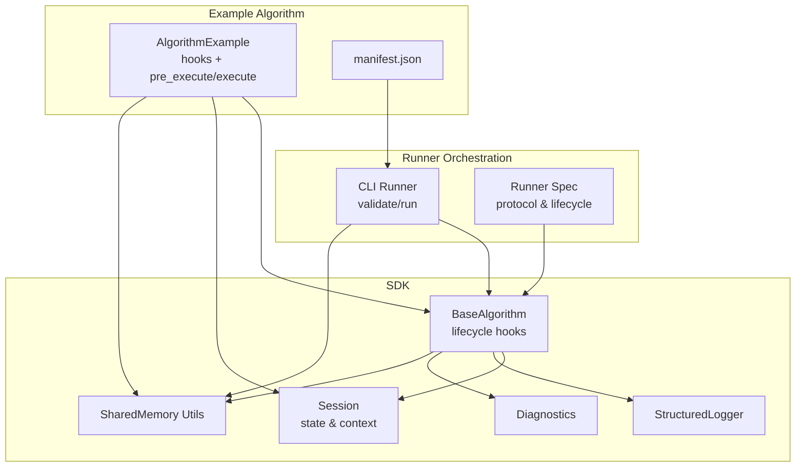
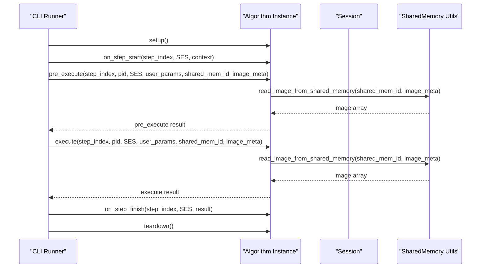
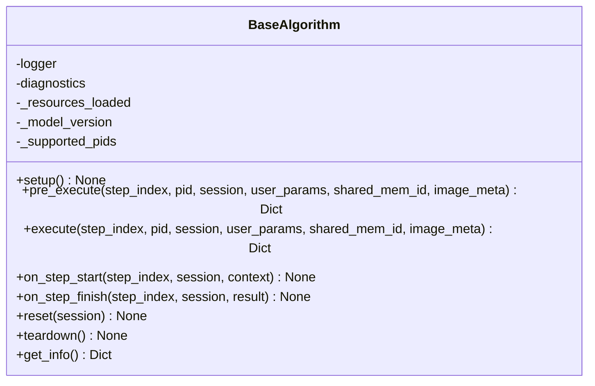
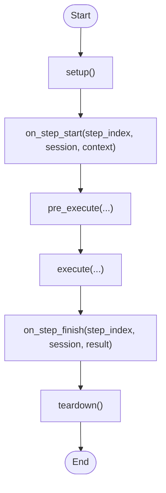
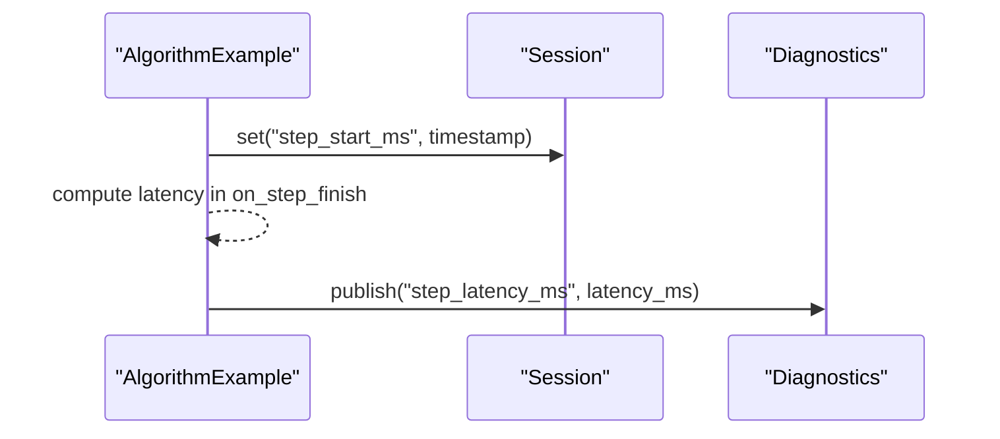
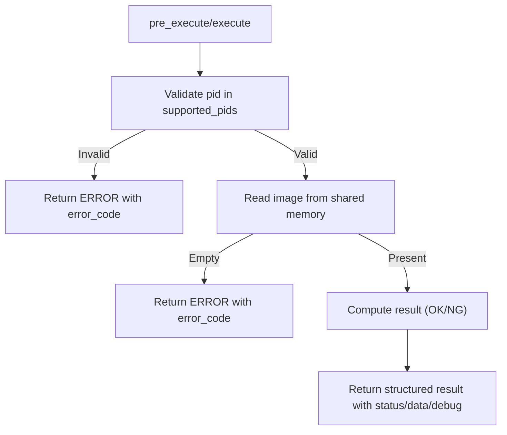
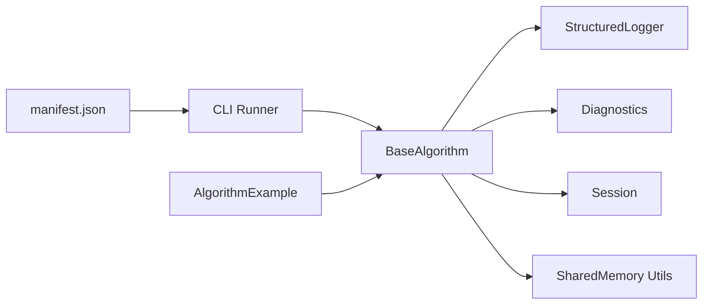

# Algorithm Lifecycle

<cite>
**Referenced Files in This Document**
- [base.py](file://procvision_algorithm_sdk/base.py)
- [cli.py](file://procvision_algorithm_sdk/cli.py)
- [session.py](file://procvision_algorithm_sdk/session.py)
- [shared_memory.py](file://procvision_algorithm_sdk/shared_memory.py)
- [logger.py](file://procvision_algorithm_sdk/logger.py)
- [diagnostics.py](file://procvision_algorithm_sdk/diagnostics.py)
- [algorithm_example/main.py](file://algorithm-example/algorithm_example/main.py)
- [algorithm_example/manifest.json](file://algorithm-example/manifest.json)
- [tests/test_base_algo.py](file://tests/test_base_algo.py)
- [runner_spec.md](file://runner_spec.md)
- [spec_runner.md](file://spec_runner.md)
- [algorithm_dev_tutorial.md](file://algorithm_dev_tutorial.md)
</cite>

## Table of Contents
1. [Introduction](#introduction)
2. [Project Structure](#project-structure)
3. [Core Components](#core-components)
4. [Architecture Overview](#architecture-overview)
5. [Detailed Component Analysis](#detailed-component-analysis)
6. [Dependency Analysis](#dependency-analysis)
7. [Performance Considerations](#performance-considerations)
8. [Troubleshooting Guide](#troubleshooting-guide)
9. [Conclusion](#conclusion)
10. [Appendices](#appendices)

## Introduction
This document explains the Algorithm Lifecycle sub-component within the ProcVision platform. It focuses on the BaseAlgorithm abstract class lifecycle methods: setup, pre_execute, execute, on_step_start, on_step_finish, and teardown. It documents invocation order and timing during execution, parameter semantics, integration points with Session and shared memory, and best practices for robust implementations. It also highlights common implementation pitfalls and provides concrete examples from the codebase.

## Project Structure
The lifecycle is defined in the SDK and exercised by the CLI and example algorithm. Key files:
- BaseAlgorithm definition and lifecycle hooks
- CLI orchestration of lifecycle phases
- Example algorithm demonstrating on_step_start usage and shared memory integration
- Session for state management
- Shared memory utilities for image transport
- Logger and Diagnostics for structured logging and metrics

**Diagram sources**
- [base.py](file://procvision_algorithm_sdk/base.py#L1-L57)
- [cli.py](file://procvision_algorithm_sdk/cli.py#L1-L615)
- [session.py](file://procvision_algorithm_sdk/session.py#L1-L36)
- [shared_memory.py](file://procvision_algorithm_sdk/shared_memory.py#L1-L53)
- [logger.py](file://procvision_algorithm_sdk/logger.py#L1-L24)
- [diagnostics.py](file://procvision_algorithm_sdk/diagnostics.py#L1-L12)
- [algorithm_example/main.py](file://algorithm-example/algorithm_example/main.py#L1-L150)
- [algorithm_example/manifest.json](file://algorithm-example/manifest.json#L1-L25)
- [runner_spec.md](file://runner_spec.md#L1-L283)

**Section sources**
- [base.py](file://procvision_algorithm_sdk/base.py#L1-L57)
- [cli.py](file://procvision_algorithm_sdk/cli.py#L1-L615)
- [algorithm_example/main.py](file://algorithm-example/algorithm_example/main.py#L1-L150)
- [algorithm_example/manifest.json](file://algorithm-example/manifest.json#L1-L25)

## Core Components
- BaseAlgorithm: Defines lifecycle hooks and abstract methods that subclasses must implement.
- Session: Provides a JSON-serializable state store and read-only context for cross-step sharing.
- SharedMemory Utilities: Provide development-time image transport via shared memory identifiers and metadata.
- StructuredLogger and Diagnostics: Provide structured logging and diagnostic publishing for observability.
- CLI Runner: Orchestrates lifecycle phases for local validation and execution.

Key lifecycle methods:
- setup: One-time process initialization (e.g., load models, caches).
- pre_execute: Step-level preparation and validation; returns a structured result.
- execute: Step-level detection logic; returns a structured result with business outcome.
- on_step_start: Step boundary hook for timing and diagnostics.
- on_step_finish: Step boundary hook for cleanup and metrics aggregation.
- teardown: One-time process teardown (e.g., close handles, release resources).

Parameters passed to lifecycle methods:
- step_index: Integer index of the current step (1-based).
- pid: Product identifier string.
- session: Session object containing id and context, plus a state store.
- user_params: Dictionary of user-provided parameters.
- shared_mem_id: String identifying the shared memory region for the image.
- image_meta: Dictionary containing image metadata (width, height, timestamp_ms, camera_id).

Integration points:
- Session: Used for cross-step state and lightweight diagnostics.
- Shared Memory: Used to read image arrays for processing.

**Section sources**
- [base.py](file://procvision_algorithm_sdk/base.py#L1-L57)
- [session.py](file://procvision_algorithm_sdk/session.py#L1-L36)
- [shared_memory.py](file://procvision_algorithm_sdk/shared_memory.py#L1-L53)
- [logger.py](file://procvision_algorithm_sdk/logger.py#L1-L24)
- [diagnostics.py](file://procvision_algorithm_sdk/diagnostics.py#L1-L12)

## Architecture Overview
The lifecycle is orchestrated by the CLI for local runs and by the Production Runner for production-grade execution. The CLI demonstrates the invocation order and parameter injection for a single step.

**Diagram sources**
- [cli.py](file://procvision_algorithm_sdk/cli.py#L192-L225)
- [base.py](file://procvision_algorithm_sdk/base.py#L1-L57)
- [shared_memory.py](file://procvision_algorithm_sdk/shared_memory.py#L1-L53)
- [session.py](file://procvision_algorithm_sdk/session.py#L1-L36)

**Section sources**
- [cli.py](file://procvision_algorithm_sdk/cli.py#L192-L225)
- [runner_spec.md](file://runner_spec.md#L1-L283)

## Detailed Component Analysis

### BaseAlgorithm Lifecycle Hooks
BaseAlgorithm defines the lifecycle contract:
- setup/teardown: Process-level initialization and cleanup.
- on_step_start/on_step_finish: Step-level hooks for timing and diagnostics.
- reset: Optional step-level reset for re-execution scenarios.
- get_info: Abstract method returning algorithm metadata and steps.
- pre_execute: Abstract method validating conditions and preparing step execution.
- execute: Abstract method performing detection and returning results.

Implementation patterns:
- Lightweight hooks: on_step_start/on_step_finish should avoid heavy computation.
- Resource management: Heavy resources should be loaded in setup and released in teardown.
- Result structure: Both pre_execute and execute must return a dictionary with a status field and optional data.

**Diagram sources**
- [base.py](file://procvision_algorithm_sdk/base.py#L1-L57)

**Section sources**
- [base.py](file://procvision_algorithm_sdk/base.py#L1-L57)

### Invocation Order and Timing
Local execution flow (as demonstrated by the CLI):
- setup
- on_step_start(step_index, session, context)
- pre_execute(step_index, pid, session, user_params, shared_mem_id, image_meta)
- execute(step_index, pid, session, user_params, shared_mem_id, image_meta)
- on_step_finish(step_index, session, result)
- teardown

Notes:
- step_index is 1-based.
- context passed to on_step_start includes pid and trace_id from session.context.
- Results from pre_execute and execute are dictionaries with status and optional data.

**Diagram sources**
- [cli.py](file://procvision_algorithm_sdk/cli.py#L192-L225)
- [base.py](file://procvision_algorithm_sdk/base.py#L1-L57)

**Section sources**
- [cli.py](file://procvision_algorithm_sdk/cli.py#L192-L225)
- [algorithm_dev_tutorial.md](file://algorithm_dev_tutorial.md#L56-L80)

### Parameter Semantics
- step_index: Integer step index (1-based).
- pid: Product identifier string.
- session: Session object with id, context, and state store.
- user_params: Arbitrary user-provided parameters dictionary.
- shared_mem_id: Identifier for shared memory region.
- image_meta: Dictionary with width, height, timestamp_ms, camera_id.

Integration with Session:
- Use session.get/set/delete/exists for lightweight cross-step state.
- Store timestamps and intermediate results for latency calculation.

Integration with Shared Memory:
- Use read_image_from_shared_memory(shared_mem_id, image_meta) to obtain image arrays.
- Ensure image_meta dimensions match the written image.

**Section sources**
- [cli.py](file://procvision_algorithm_sdk/cli.py#L192-L225)
- [session.py](file://procvision_algorithm_sdk/session.py#L1-L36)
- [shared_memory.py](file://procvision_algorithm_sdk/shared_memory.py#L1-L53)

### Example: Using on_step_start to Record Timestamps
The example algorithm demonstrates:
- Recording step_start_ms in session on step start.
- Computing latency in on_step_finish and publishing via Diagnostics.
- Resetting the step_start_ms on reset.

**Diagram sources**
- [algorithm_example/main.py](file://algorithm-example/algorithm_example/main.py#L1-L150)

**Section sources**
- [algorithm_example/main.py](file://algorithm-example/algorithm_example/main.py#L1-L150)

### Example: Shared Memory Integration in pre_execute and execute
The example algorithm reads images from shared memory and validates presence, then returns structured results with calibration or defect rectangles depending on step outcomes.

**Diagram sources**
- [algorithm_example/main.py](file://algorithm-example/algorithm_example/main.py#L1-L150)
- [shared_memory.py](file://procvision_algorithm_sdk/shared_memory.py#L1-L53)

**Section sources**
- [algorithm_example/main.py](file://algorithm-example/algorithm_example/main.py#L1-L150)
- [tests/test_base_algo.py](file://tests/test_base_algo.py#L1-L65)

### Abstract Methods: get_info, pre_execute, execute
- get_info: Returns algorithm metadata including name, version, description, supported_pids, and steps. The CLI validates that get_info returns a dictionary and that steps are present.
- pre_execute: Validates conditions (e.g., pid support, image availability) and prepares step execution. Must return a dictionary with status and optional message/error_code/data/debug.
- execute: Performs detection logic and returns a dictionary with status and data. For NG results, include result_status, ng_reason, and defect_rects.

Validation references:
- CLI smoke test validates get_info, pre_execute, and execute return dictionaries and statuses.
- Runner spec defines result structure expectations for OK/NG outcomes.

**Section sources**
- [cli.py](file://procvision_algorithm_sdk/cli.py#L78-L124)
- [tests/test_base_algo.py](file://tests/test_base_algo.py#L1-L65)
- [runner_spec.md](file://runner_spec.md#L1-L283)

## Dependency Analysis
Lifecycle method dependencies and relationships:

- BaseAlgorithm depends on StructuredLogger, Diagnostics, and Session.
- CLI orchestrates BaseAlgorithm lifecycle and passes parameters.
- Example algorithm implements BaseAlgorithm and uses Session and SharedMemory.

**Diagram sources**
- [base.py](file://procvision_algorithm_sdk/base.py#L1-L57)
- [cli.py](file://procvision_algorithm_sdk/cli.py#L1-L615)
- [algorithm_example/main.py](file://algorithm-example/algorithm_example/main.py#L1-L150)
- [algorithm_example/manifest.json](file://algorithm-example/manifest.json#L1-L25)

**Section sources**
- [base.py](file://procvision_algorithm_sdk/base.py#L1-L57)
- [cli.py](file://procvision_algorithm_sdk/cli.py#L1-L615)
- [algorithm_example/main.py](file://algorithm-example/algorithm_example/main.py#L1-L150)

## Performance Considerations
- Keep on_step_start/on_step_finish lightweight; heavy work belongs in pre_execute/execute.
- Load heavy resources (models, GPU memory) in setup and release in teardown.
- Minimize image copies; rely on shared memory for zero-copy transport.
- Use Diagnostics to track latency and throughput; avoid excessive logging in hot paths.

[No sources needed since this section provides general guidance]

## Troubleshooting Guide
Common implementation errors:
- Returning non-dictionary results from pre_execute/execute: The CLI validates that both return dictionaries and that status is either OK or ERROR.
- Missing required fields in results: Runner spec requires specific fields for OK/NG outcomes; ensure result_status, ng_reason, and defect_rects are included appropriately.
- Incorrect pid handling: Validate pid against supported_pids and return appropriate error_code.
- Image loading failures: Ensure image_meta width/height are valid and image is present in shared memory.
- Session state serialization: Values stored in session must be JSON serializable.

Best practices:
- Always return a dictionary with status from pre_execute/execute.
- Use structured logging for observability and diagnostics.
- Manage resources in setup/teardown/reset to prevent leaks.
- Keep hooks idempotent and safe to call multiple times.

**Section sources**
- [cli.py](file://procvision_algorithm_sdk/cli.py#L78-L124)
- [runner_spec.md](file://runner_spec.md#L1-L283)
- [tests/test_base_algo.py](file://tests/test_base_algo.py#L1-L65)
- [session.py](file://procvision_algorithm_sdk/session.py#L1-L36)

## Conclusion
The Algorithm Lifecycle in ProcVision is centered around BaseAlgorithm’s lifecycle hooks and abstract methods. The CLI demonstrates the invocation order and parameter passing, while the example algorithm illustrates practical usage of on_step_start for timing, Session for state management, and shared memory for image transport. Following the best practices and validation expectations ensures robust, observable, and production-ready algorithms.

[No sources needed since this section summarizes without analyzing specific files]

## Appendices

### Appendix A: Lifecycle Method Reference
- setup: One-time initialization; load models and heavy resources.
- pre_execute: Validate conditions and prepare step execution; return structured result.
- execute: Perform detection; return structured result with business outcome.
- on_step_start: Record timestamps and initialize per-step state.
- on_step_finish: Publish diagnostics and finalize per-step metrics.
- reset: Clear per-step state for re-execution.
- teardown: Release all resources.

**Section sources**
- [base.py](file://procvision_algorithm_sdk/base.py#L1-L57)
- [algorithm_dev_tutorial.md](file://algorithm_dev_tutorial.md#L56-L80)

### Appendix B: Runner Protocol and Result Contracts
- Runner protocol defines call/result frames and constraints for pre vs execute phases.
- Result structure includes status, message, error_code, and data with result_status, ng_reason, defect_rects, and debug fields.

**Section sources**
- [runner_spec.md](file://runner_spec.md#L1-L283)
- [spec_runner.md](file://spec_runner.md#L1-L193)