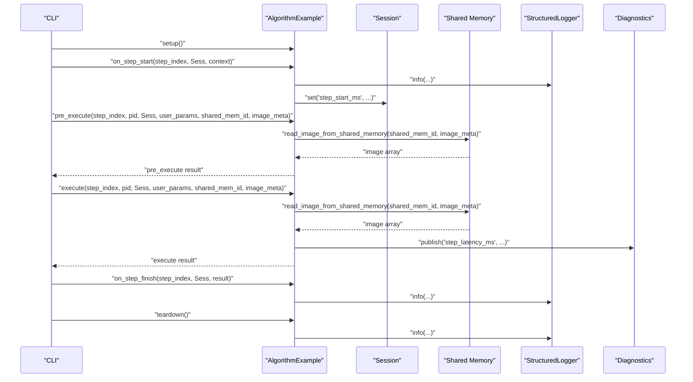
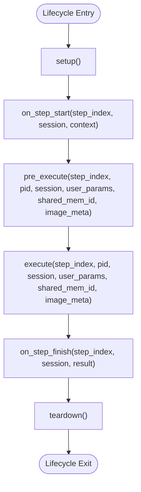
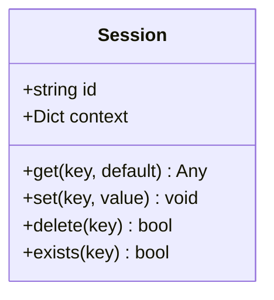
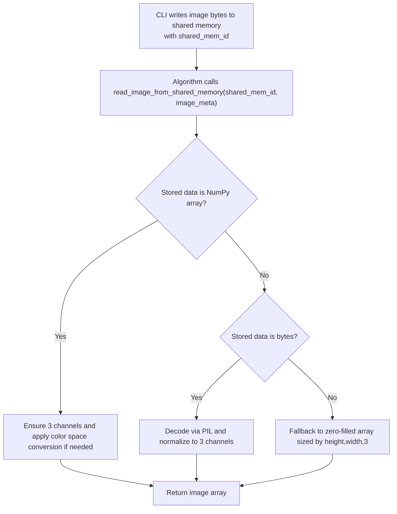
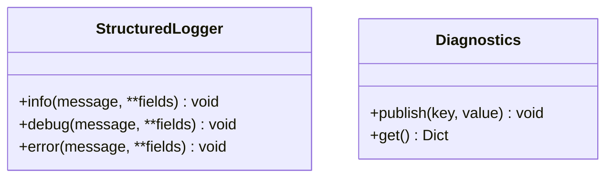
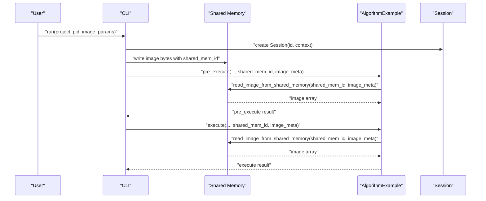
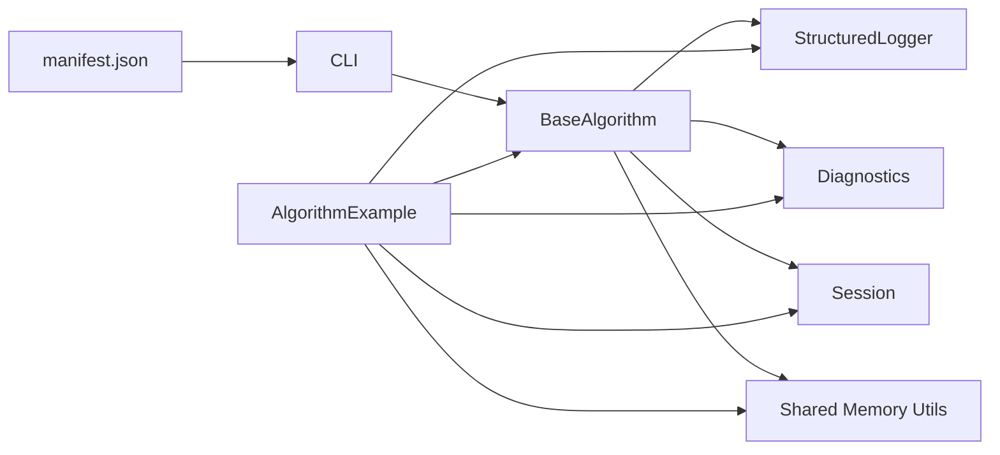

# Core Concepts

<cite>
**Referenced Files in This Document**
- [README.md](file://README.md)
- [procvision_algorithm_sdk/base.py](file://procvision_algorithm_sdk/base.py)
- [procvision_algorithm_sdk/session.py](file://procvision_algorithm_sdk/session.py)
- [procvision_algorithm_sdk/shared_memory.py](file://procvision_algorithm_sdk/shared_memory.py)
- [procvision_algorithm_sdk/logger.py](file://procvision_algorithm_sdk/logger.py)
- [procvision_algorithm_sdk/diagnostics.py](file://procvision_algorithm_sdk/diagnostics.py)
- [procvision_algorithm_sdk/cli.py](file://procvision_algorithm_sdk/cli.py)
- [algorithm-example/algorithm_example/main.py](file://algorithm-example/algorithm_example/main.py)
- [algorithm-example/manifest.json](file://algorithm-example/manifest.json)
- [tests/test_base_algo.py](file://tests/test_base_algo.py)
- [tests/test_session.py](file://tests/test_session.py)
- [tests/test_shared_memory.py](file://tests/test_shared_memory.py)
</cite>

## Table of Contents
1. [Introduction](#introduction)
2. [Project Structure](#project-structure)
3. [Core Components](#core-components)
4. [Architecture Overview](#architecture-overview)
5. [Detailed Component Analysis](#detailed-component-analysis)
6. [Dependency Analysis](#dependency-analysis)
7. [Performance Considerations](#performance-considerations)
8. [Troubleshooting Guide](#troubleshooting-guide)
9. [Conclusion](#conclusion)

## Introduction
This section introduces the foundational concepts of the ProcVision Algorithm SDK, focusing on the algorithm lifecycle, session-based state management, shared memory image transfer, structured logging and diagnostics, and the end-to-end data flow from image input to result output. It aligns terminology with the codebase (e.g., shared_mem_id, image_meta, user_params) and demonstrates how algorithms integrate with the platform via the BaseAlgorithm interface and the CLI.

## Project Structure
The SDK exposes a minimal yet cohesive set of primitives:
- BaseAlgorithm defines the lifecycle hooks and abstract methods that implementers must override.
- Session provides JSON-serializable state storage and context access.
- Shared memory utilities enable efficient image transfer using a shared_mem_id and image_meta.
- StructuredLogger and Diagnostics support structured logging and diagnostic collection.
- CLI orchestrates validation, local runs, packaging, and initialization scaffolding.

```mermaid
graph TB
subgraph "SDK Core"
BA["BaseAlgorithm<br/>Lifecycle & Hooks"]
SESS["Session<br/>State Store"]
SM["Shared Memory Utils<br/>read/write"]
LOG["StructuredLogger<br/>JSON Logs"]
DIAG["Diagnostics<br/>Key/Value Metrics"]
end
subgraph "CLI"
CLI["CLI<br/>validate/run/package/init"]
end
subgraph "Example Algorithm"
ALG["AlgorithmExample<br/>extends BaseAlgorithm"]
MAN["manifest.json"]
end
CLI --> BA
CLI --> SESS
CLI --> SM
ALG --> BA
ALG --> SESS
ALG --> SM
ALG --> LOG
ALG --> DIAG
MAN --> CLI
```

**Diagram sources**
- [procvision_algorithm_sdk/base.py](file://procvision_algorithm_sdk/base.py#L1-L58)
- [procvision_algorithm_sdk/session.py](file://procvision_algorithm_sdk/session.py#L1-L36)
- [procvision_algorithm_sdk/shared_memory.py](file://procvision_algorithm_sdk/shared_memory.py#L1-L53)
- [procvision_algorithm_sdk/logger.py](file://procvision_algorithm_sdk/logger.py#L1-L24)
- [procvision_algorithm_sdk/diagnostics.py](file://procvision_algorithm_sdk/diagnostics.py#L1-L12)
- [procvision_algorithm_sdk/cli.py](file://procvision_algorithm_sdk/cli.py#L1-L615)
- [algorithm-example/algorithm_example/main.py](file://algorithm-example/algorithm_example/main.py#L1-L150)
- [algorithm-example/manifest.json](file://algorithm-example/manifest.json#L1-L25)

**Section sources**
- [README.md](file://README.md#L1-L116)
- [procvision_algorithm_sdk/base.py](file://procvision_algorithm_sdk/base.py#L1-L58)
- [procvision_algorithm_sdk/session.py](file://procvision_algorithm_sdk/session.py#L1-L36)
- [procvision_algorithm_sdk/shared_memory.py](file://procvision_algorithm_sdk/shared_memory.py#L1-L53)
- [procvision_algorithm_sdk/logger.py](file://procvision_algorithm_sdk/logger.py#L1-L24)
- [procvision_algorithm_sdk/diagnostics.py](file://procvision_algorithm_sdk/diagnostics.py#L1-L12)
- [procvision_algorithm_sdk/cli.py](file://procvision_algorithm_sdk/cli.py#L1-L615)
- [algorithm-example/algorithm_example/main.py](file://algorithm-example/algorithm_example/main.py#L1-L150)
- [algorithm-example/manifest.json](file://algorithm-example/manifest.json#L1-L25)

## Core Components
- BaseAlgorithm: Defines the algorithm lifecycle and contract. It provides hooks for setup, teardown, per-step start/finish, reset, and abstract methods for pre_execute and execute. It also composes StructuredLogger and Diagnostics for logging and diagnostics collection.
- Session: A JSON-serializable state container keyed by strings. It stores arbitrary JSON-serializable values and exposes get/set/delete/existence checks. It also exposes immutable context.
- Shared Memory Utilities: Provide read_image_from_shared_memory and development helpers for writing images to a shared memory-like registry. The function interprets image_meta (width, height, color_space) and returns a NumPy array suitable for downstream processing.
- StructuredLogger: Emits JSON-formatted log records with a standardized timestamp field and leveled messages.
- Diagnostics: A simple key/value store to publish metrics and retrieve them as a snapshot.

**Section sources**
- [procvision_algorithm_sdk/base.py](file://procvision_algorithm_sdk/base.py#L1-L58)
- [procvision_algorithm_sdk/session.py](file://procvision_algorithm_sdk/session.py#L1-L36)
- [procvision_algorithm_sdk/shared_memory.py](file://procvision_algorithm_sdk/shared_memory.py#L1-L53)
- [procvision_algorithm_sdk/logger.py](file://procvision_algorithm_sdk/logger.py#L1-L24)
- [procvision_algorithm_sdk/diagnostics.py](file://procvision_algorithm_sdk/diagnostics.py#L1-L12)

## Architecture Overview
The algorithm lifecycle is orchestrated by the CLI and executed against a BaseAlgorithm subclass. The CLI constructs a Session, prepares image_meta, writes the image to shared memory (via dev_write_image_to_shared_memory), and invokes the lifecycle methods. The algorithm reads the image from shared memory using read_image_from_shared_memory and returns structured results.



**Diagram sources**
- [procvision_algorithm_sdk/cli.py](file://procvision_algorithm_sdk/cli.py#L1-L615)
- [procvision_algorithm_sdk/base.py](file://procvision_algorithm_sdk/base.py#L1-L58)
- [procvision_algorithm_sdk/session.py](file://procvision_algorithm_sdk/session.py#L1-L36)
- [procvision_algorithm_sdk/shared_memory.py](file://procvision_algorithm_sdk/shared_memory.py#L1-L53)
- [procvision_algorithm_sdk/logger.py](file://procvision_algorithm_sdk/logger.py#L1-L24)
- [procvision_algorithm_sdk/diagnostics.py](file://procvision_algorithm_sdk/diagnostics.py#L1-L12)
- [algorithm-example/algorithm_example/main.py](file://algorithm-example/algorithm_example/main.py#L1-L150)

## Detailed Component Analysis

### Algorithm Lifecycle: setup, on_step_start, pre_execute, execute, on_step_finish, teardown
- setup: Called once before any steps to initialize resources.
- on_step_start: Receives step_index, Session, and context. Use it to record timestamps and prepare per-step state.
- pre_execute: Validates inputs, reads image from shared memory, performs preparation (e.g., calibration), and returns a structured result with status and optional debug data.
- execute: Performs detection/inference using the prepared state and image, returning a structured result with result_status and optional defect/position rectangles.
- on_step_finish: Computes diagnostics (e.g., latency) and logs completion.
- teardown: Releases resources.



**Diagram sources**
- [procvision_algorithm_sdk/base.py](file://procvision_algorithm_sdk/base.py#L1-L58)
- [procvision_algorithm_sdk/cli.py](file://procvision_algorithm_sdk/cli.py#L1-L615)

**Section sources**
- [procvision_algorithm_sdk/base.py](file://procvision_algorithm_sdk/base.py#L1-L58)
- [procvision_algorithm_sdk/cli.py](file://procvision_algorithm_sdk/cli.py#L1-L615)
- [algorithm-example/algorithm_example/main.py](file://algorithm-example/algorithm_example/main.py#L1-L150)

### Session-Based State Management
- Session holds a JSON-serializable state store and an immutable context. Values stored must be JSON-serializable; otherwise, a TypeError is raised during set.
- Example usage: on_step_start records a timestamp in session under a key, and on_step_finish computes latency using that timestamp.
- Best practice: Use keys that clearly indicate intent (e.g., step_start_ms) and keep values small and immutable where possible.



**Diagram sources**
- [procvision_algorithm_sdk/session.py](file://procvision_algorithm_sdk/session.py#L1-L36)

**Section sources**
- [procvision_algorithm_sdk/session.py](file://procvision_algorithm_sdk/session.py#L1-L36)
- [algorithm-example/algorithm_example/main.py](file://algorithm-example/algorithm_example/main.py#L1-L150)
- [tests/test_session.py](file://tests/test_session.py#L1-L24)

### Shared Memory Image Transfer and Metadata Handling
- The CLI writes the image bytes to a shared memory-like registry keyed by shared_mem_id and passes image_meta containing width, height, timestamp_ms, and camera_id.
- read_image_from_shared_memory interprets image_meta and returns a normalized NumPy array:
  - If the stored data is a NumPy array, it ensures 3-channel shape and color space conversion if needed.
  - If the stored data is raw bytes, it attempts to decode via PIL and convert to RGB/3-channel.
  - If decoding fails, it falls back to a zero-filled array sized by height and width.
- This mechanism decouples image transport from the algorithm implementation while enabling fast, zero-copy-like access in development mode.



**Diagram sources**
- [procvision_algorithm_sdk/shared_memory.py](file://procvision_algorithm_sdk/shared_memory.py#L1-L53)
- [procvision_algorithm_sdk/cli.py](file://procvision_algorithm_sdk/cli.py#L1-L615)

**Section sources**
- [procvision_algorithm_sdk/shared_memory.py](file://procvision_algorithm_sdk/shared_memory.py#L1-L53)
- [procvision_algorithm_sdk/cli.py](file://procvision_algorithm_sdk/cli.py#L1-L615)
- [tests/test_shared_memory.py](file://tests/test_shared_memory.py#L1-L16)

### Structured Logging and Diagnostics Collection
- StructuredLogger emits JSON records with level, timestamp_ms, and message plus additional fields. Timestamps are in milliseconds.
- Diagnostics provides a simple publish/get mechanism to collect metrics (e.g., step latency) during execution.
- Example usage: on_step_start logs the event and sets a timestamp in session; on_step_finish computes latency and publishes it via Diagnostics.



**Diagram sources**
- [procvision_algorithm_sdk/logger.py](file://procvision_algorithm_sdk/logger.py#L1-L24)
- [procvision_algorithm_sdk/diagnostics.py](file://procvision_algorithm_sdk/diagnostics.py#L1-L12)

**Section sources**
- [procvision_algorithm_sdk/logger.py](file://procvision_algorithm_sdk/logger.py#L1-L24)
- [procvision_algorithm_sdk/diagnostics.py](file://procvision_algorithm_sdk/diagnostics.py#L1-L12)
- [algorithm-example/algorithm_example/main.py](file://algorithm-example/algorithm_example/main.py#L1-L150)

### Data Flow: From Image Input to Result Output
- The CLI loads manifest.json, constructs a Session, writes the image bytes to shared memory using shared_mem_id, and builds image_meta.
- The algorithm’s pre_execute and execute call read_image_from_shared_memory to obtain the image array.
- Results are returned with a standardized structure: status and optional data (e.g., result_status, defect_rects, debug fields).



**Diagram sources**
- [procvision_algorithm_sdk/cli.py](file://procvision_algorithm_sdk/cli.py#L1-L615)
- [procvision_algorithm_sdk/shared_memory.py](file://procvision_algorithm_sdk/shared_memory.py#L1-L53)
- [algorithm-example/algorithm_example/main.py](file://algorithm-example/algorithm_example/main.py#L1-L150)

**Section sources**
- [procvision_algorithm_sdk/cli.py](file://procvision_algorithm_sdk/cli.py#L1-L615)
- [algorithm-example/algorithm_example/main.py](file://algorithm-example/algorithm_example/main.py#L1-L150)

### Integration with the Platform
- The CLI validates the algorithm package structure and entry point, ensuring supported_pids match get_info and that pre_execute/execute return valid structures.
- The example algorithm demonstrates how to integrate with the platform by implementing get_info, pre_execute, and execute, and by using shared_mem_id and image_meta consistently.

**Section sources**
- [procvision_algorithm_sdk/cli.py](file://procvision_algorithm_sdk/cli.py#L1-L615)
- [algorithm-example/manifest.json](file://algorithm-example/manifest.json#L1-L25)
- [algorithm-example/algorithm_example/main.py](file://algorithm-example/algorithm_example/main.py#L1-L150)
- [tests/test_base_algo.py](file://tests/test_base_algo.py#L1-L65)

## Dependency Analysis
The following diagram shows how the core components depend on each other and how the CLI orchestrates them.



**Diagram sources**
- [procvision_algorithm_sdk/cli.py](file://procvision_algorithm_sdk/cli.py#L1-L615)
- [procvision_algorithm_sdk/base.py](file://procvision_algorithm_sdk/base.py#L1-L58)
- [procvision_algorithm_sdk/session.py](file://procvision_algorithm_sdk/session.py#L1-L36)
- [procvision_algorithm_sdk/shared_memory.py](file://procvision_algorithm_sdk/shared_memory.py#L1-L53)
- [procvision_algorithm_sdk/logger.py](file://procvision_algorithm_sdk/logger.py#L1-L24)
- [procvision_algorithm_sdk/diagnostics.py](file://procvision_algorithm_sdk/diagnostics.py#L1-L12)
- [algorithm-example/algorithm_example/main.py](file://algorithm-example/algorithm_example/main.py#L1-L150)
- [algorithm-example/manifest.json](file://algorithm-example/manifest.json#L1-L25)

**Section sources**
- [procvision_algorithm_sdk/base.py](file://procvision_algorithm_sdk/base.py#L1-L58)
- [procvision_algorithm_sdk/session.py](file://procvision_algorithm_sdk/session.py#L1-L36)
- [procvision_algorithm_sdk/shared_memory.py](file://procvision_algorithm_sdk/shared_memory.py#L1-L53)
- [procvision_algorithm_sdk/logger.py](file://procvision_algorithm_sdk/logger.py#L1-L24)
- [procvision_algorithm_sdk/diagnostics.py](file://procvision_algorithm_sdk/diagnostics.py#L1-L12)
- [procvision_algorithm_sdk/cli.py](file://procvision_algorithm_sdk/cli.py#L1-L615)
- [algorithm-example/algorithm_example/main.py](file://algorithm-example/algorithm_example/main.py#L1-L150)
- [algorithm-example/manifest.json](file://algorithm-example/manifest.json#L1-L25)

## Performance Considerations
- Large image transfers: read_image_from_shared_memory returns a NumPy array; for large images, consider minimizing copies and avoiding unnecessary conversions. The function already handles color space and channel normalization efficiently.
- State access patterns: Session state is JSON-serializable and stored in-memory. Keep state small and immutable where possible to reduce serialization overhead and improve cache locality.
- Logging overhead: StructuredLogger writes JSON records; batch or throttle logs in hot paths to minimize I/O.
- Diagnostics publishing: Publish only essential metrics; frequent publishing can add overhead in tight loops.

[No sources needed since this section provides general guidance]

## Troubleshooting Guide
- Non-JSON-serializable values in Session: Setting a non-serializable value raises a TypeError. Ensure all values stored in Session are JSON-serializable.
- Empty or invalid image data: If read_image_from_shared_memory returns None or a zero-filled fallback, verify that the CLI wrote the image bytes to shared_mem_id and that image_meta contains valid width and height.
- Lifecycle hook failures: If on_step_start/on_step_finish fail, the CLI catches exceptions and continues; ensure these hooks handle missing keys gracefully (e.g., step_start_ms).
- Validation failures: The CLI validate command checks manifest presence, entry point importability, get_info correctness, and pre_execute/execute return structures. Review the generated report for failing checks.

**Section sources**
- [procvision_algorithm_sdk/session.py](file://procvision_algorithm_sdk/session.py#L1-L36)
- [procvision_algorithm_sdk/shared_memory.py](file://procvision_algorithm_sdk/shared_memory.py#L1-L53)
- [procvision_algorithm_sdk/cli.py](file://procvision_algorithm_sdk/cli.py#L1-L615)
- [tests/test_session.py](file://tests/test_session.py#L1-L24)
- [tests/test_shared_memory.py](file://tests/test_shared_memory.py#L1-L16)

## Conclusion
The ProcVision Algorithm SDK provides a clear, minimal foundation for building algorithms that integrate cleanly with the platform. By adhering to the lifecycle hooks, using Session for JSON-serializable state, leveraging shared memory for efficient image transfer, and employing structured logging and diagnostics, developers can implement robust, observable, and portable algorithms. The CLI offers strong validation and local execution capabilities to streamline development and testing.