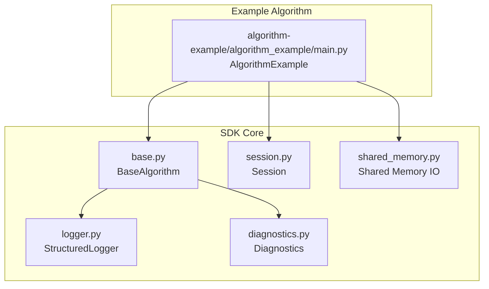
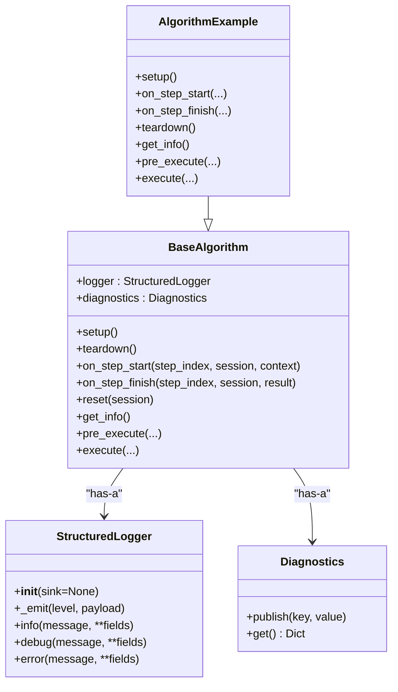
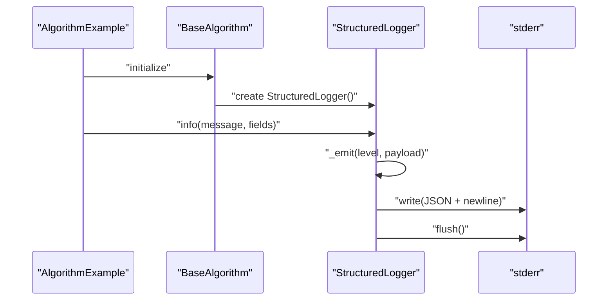
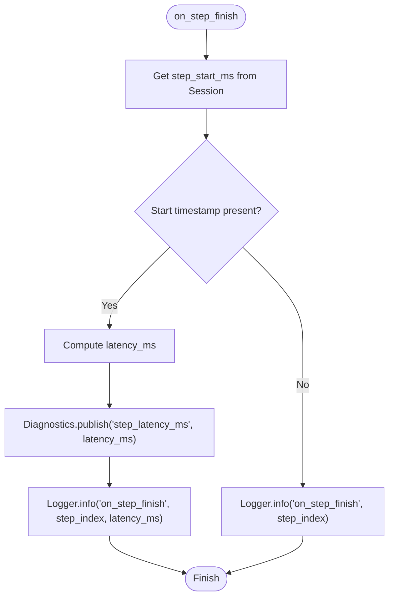
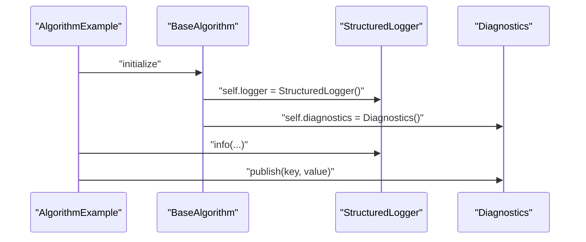
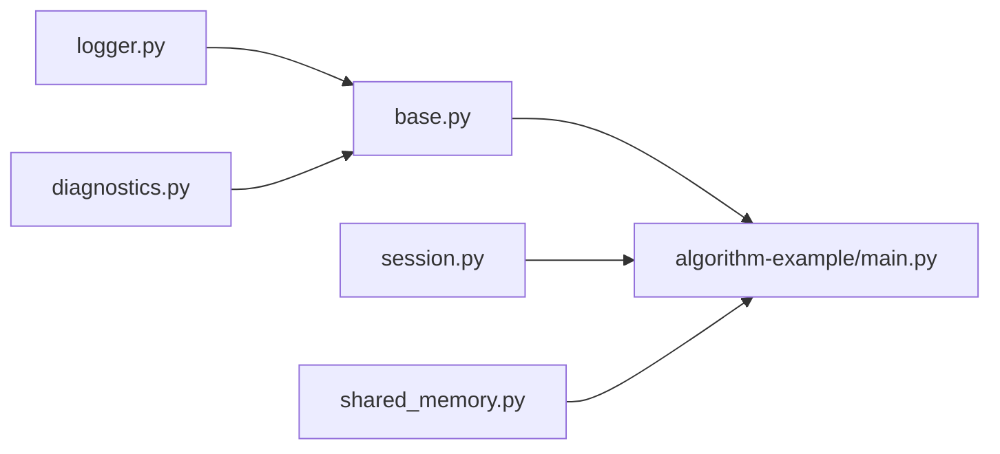

# Logging & Diagnostics

<cite>
**Referenced Files in This Document**
- [logger.py](file://procvision_algorithm_sdk/logger.py)
- [diagnostics.py](file://procvision_algorithm_sdk/diagnostics.py)
- [base.py](file://procvision_algorithm_sdk/base.py)
- [main.py](file://algorithm-example/algorithm_example/main.py)
- [session.py](file://procvision_algorithm_sdk/session.py)
- [shared_memory.py](file://procvision_algorithm_sdk/shared_memory.py)
- [__init__.py](file://procvision_algorithm_sdk/__init__.py)
- [README.md](file://README.md)
- [algorithm_dev_tutorial.md](file://algorithm_dev_tutorial.md)
</cite>

## Table of Contents
1. [Introduction](#introduction)
2. [Project Structure](#project-structure)
3. [Core Components](#core-components)
4. [Architecture Overview](#architecture-overview)
5. [Detailed Component Analysis](#detailed-component-analysis)
6. [Dependency Analysis](#dependency-analysis)
7. [Performance Considerations](#performance-considerations)
8. [Troubleshooting Guide](#troubleshooting-guide)
9. [Conclusion](#conclusion)
10. [Appendices](#appendices)

## Introduction
This document explains the Logging & Diagnostics sub-component of the SDK. It focuses on:
- The StructuredLogger class and its integration within BaseAlgorithm via the logger field
- The info, debug, and error methods and their structured JSON output to stderr with timestamp_ms
- The _emit method’s role in formatting log records
- The Diagnostics class for collecting algorithm performance metrics and diagnostic data
- Usage patterns from the codebase showing how algorithms log execution steps or errors
- Integration between logging and the platform’s monitoring system
- Common issues such as missing log output due to buffering or incorrect field naming
- Best practices for log verbosity, error reporting, and including contextual information
- Performance considerations for high-frequency logging and strategies for effective debugging using structured logs

## Project Structure
The logging and diagnostics capabilities are implemented in dedicated modules and integrated into the BaseAlgorithm lifecycle. Example algorithms demonstrate practical usage patterns.

**Diagram sources**
- [logger.py](file://procvision_algorithm_sdk/logger.py#L1-L24)
- [diagnostics.py](file://procvision_algorithm_sdk/diagnostics.py#L1-L12)
- [base.py](file://procvision_algorithm_sdk/base.py#L1-L58)
- [main.py](file://algorithm-example/algorithm_example/main.py#L1-L150)
- [session.py](file://procvision_algorithm_sdk/session.py#L1-L36)
- [shared_memory.py](file://procvision_algorithm_sdk/shared_memory.py#L1-L53)

**Section sources**
- [logger.py](file://procvision_algorithm_sdk/logger.py#L1-L24)
- [diagnostics.py](file://procvision_algorithm_sdk/diagnostics.py#L1-L12)
- [base.py](file://procvision_algorithm_sdk/base.py#L1-L58)
- [main.py](file://algorithm-example/algorithm_example/main.py#L1-L150)
- [session.py](file://procvision_algorithm_sdk/session.py#L1-L36)
- [shared_memory.py](file://procvision_algorithm_sdk/shared_memory.py#L1-L53)

## Core Components
- StructuredLogger: Provides structured logging with level, timestamp_ms, message, and arbitrary fields. Emits JSON to stderr by default and flushes immediately.
- Diagnostics: A lightweight collector for performance metrics and diagnostic data published during algorithm execution.
- BaseAlgorithm: Exposes logger and diagnostics fields to subclasses, enabling consistent logging and diagnostics collection across the algorithm lifecycle.

Key responsibilities:
- StructuredLogger: Formats and emits structured log records to a configurable sink (defaults to stderr).
- Diagnostics: Aggregates key-value pairs that can be retrieved later for monitoring and UI reporting.
- BaseAlgorithm: Initializes logger and diagnostics instances and exposes hooks for lifecycle events.

**Section sources**
- [logger.py](file://procvision_algorithm_sdk/logger.py#L1-L24)
- [diagnostics.py](file://procvision_algorithm_sdk/diagnostics.py#L1-L12)
- [base.py](file://procvision_algorithm_sdk/base.py#L1-L58)

## Architecture Overview
The logging and diagnostics subsystem integrates with the algorithm lifecycle. Algorithms inherit from BaseAlgorithm, gaining access to logger and diagnostics. During execution, algorithms can emit structured logs and publish diagnostic metrics.

**Diagram sources**
- [logger.py](file://procvision_algorithm_sdk/logger.py#L1-L24)
- [diagnostics.py](file://procvision_algorithm_sdk/diagnostics.py#L1-L12)
- [base.py](file://procvision_algorithm_sdk/base.py#L1-L58)
- [main.py](file://algorithm-example/algorithm_example/main.py#L1-L150)

## Detailed Component Analysis

### StructuredLogger
Purpose:
- Emit structured log records as single-line JSON to a sink (stderr by default).
- Enforce consistent fields: level, timestamp_ms, message, plus any additional fields passed by the caller.

Behavior highlights:
- _emit constructs a record with level and timestamp_ms, merges caller payload, writes JSON to sink, and flushes immediately.
- info, debug, error are convenience methods that set the level and include message plus optional fields.

Integration with BaseAlgorithm:
- BaseAlgorithm initializes logger in its constructor, making it available to subclasses.

Usage patterns from the example:
- Emit lifecycle events with contextual fields (e.g., step_index, latency_ms).
- Include debug metadata (e.g., latency_ms) alongside status messages.

**Diagram sources**
- [logger.py](file://procvision_algorithm_sdk/logger.py#L1-L24)
- [base.py](file://procvision_algorithm_sdk/base.py#L1-L58)
- [main.py](file://algorithm-example/algorithm_example/main.py#L1-L150)

**Section sources**
- [logger.py](file://procvision_algorithm_sdk/logger.py#L1-L24)
- [base.py](file://procvision_algorithm_sdk/base.py#L1-L58)
- [main.py](file://algorithm-example/algorithm_example/main.py#L1-L150)

### Diagnostics
Purpose:
- Collect key-value metrics and diagnostic data during algorithm execution.
- Provide a snapshot of collected items via get() for consumption by monitoring/UI systems.

Usage patterns from the example:
- Publish step latency as a metric during on_step_finish.
- Retrieve diagnostics for reporting or debugging.

**Diagram sources**
- [main.py](file://algorithm-example/algorithm_example/main.py#L1-L150)
- [diagnostics.py](file://procvision_algorithm_sdk/diagnostics.py#L1-L12)
- [session.py](file://procvision_algorithm_sdk/session.py#L1-L36)

**Section sources**
- [diagnostics.py](file://procvision_algorithm_sdk/diagnostics.py#L1-L12)
- [main.py](file://algorithm-example/algorithm_example/main.py#L1-L150)
- [session.py](file://procvision_algorithm_sdk/session.py#L1-L36)

### BaseAlgorithm Integration
- BaseAlgorithm creates StructuredLogger and Diagnostics instances and exposes them to subclasses.
- Subclasses can call logger.info/debug/error and diagnostics.publish anywhere in their lifecycle methods or execution logic.

**Diagram sources**
- [base.py](file://procvision_algorithm_sdk/base.py#L1-L58)
- [logger.py](file://procvision_algorithm_sdk/logger.py#L1-L24)
- [diagnostics.py](file://procvision_algorithm_sdk/diagnostics.py#L1-L12)

**Section sources**
- [base.py](file://procvision_algorithm_sdk/base.py#L1-L58)

### Shared Memory and Logging Context
- The example reads images from shared memory and logs relevant metadata (e.g., width/height, latency_ms).
- This demonstrates how to combine structured logging with runtime context for observability.

**Section sources**
- [main.py](file://algorithm-example/algorithm_example/main.py#L1-L150)
- [shared_memory.py](file://procvision_algorithm_sdk/shared_memory.py#L1-L53)

## Dependency Analysis
- BaseAlgorithm depends on StructuredLogger and Diagnostics.
- Example algorithms depend on BaseAlgorithm and use logger and diagnostics.
- Session provides cross-step state storage for computing latency and other metrics.
- Shared memory utilities support image acquisition and can influence logging decisions (e.g., error conditions).

**Diagram sources**
- [logger.py](file://procvision_algorithm_sdk/logger.py#L1-L24)
- [diagnostics.py](file://procvision_algorithm_sdk/diagnostics.py#L1-L12)
- [base.py](file://procvision_algorithm_sdk/base.py#L1-L58)
- [main.py](file://algorithm-example/algorithm_example/main.py#L1-L150)
- [session.py](file://procvision_algorithm_sdk/session.py#L1-L36)
- [shared_memory.py](file://procvision_algorithm_sdk/shared_memory.py#L1-L53)

**Section sources**
- [__init__.py](file://procvision_algorithm_sdk/__init__.py#L1-L18)
- [README.md](file://README.md#L1-L116)
- [algorithm_dev_tutorial.md](file://algorithm_dev_tutorial.md#L128-L135)

## Performance Considerations
- Immediate flushing: StructuredLogger flushes after each record. This ensures logs appear promptly but can impact performance under high-frequency logging. Consider batching or reducing verbosity in hot paths if needed.
- JSON serialization: Each log incurs JSON serialization overhead. Prefer compact field names and avoid large payloads in log records.
- Diagnostic aggregation: Publishing metrics to Diagnostics is O(1) per publish; retrieving via get() is O(n) where n is number of items.
- Shared memory reads: Image acquisition can be expensive; measure and log latency as shown in the example to inform optimization.

[No sources needed since this section provides general guidance]

## Troubleshooting Guide
Common issues and resolutions:
- Missing log output due to buffering
  - Symptom: Logs do not appear until process exit.
  - Cause: Output stream buffering.
  - Resolution: The logger flushes after each write; ensure your environment does not override this behavior. If using a custom sink, ensure it flushes appropriately.
  - Evidence: StructuredLogger explicitly flushes after writing.
  - Section sources
    - [logger.py](file://procvision_algorithm_sdk/logger.py#L1-L24)

- Incorrect field naming or missing fields
  - Symptom: Platform parsing fails or fields are missing in UI.
  - Cause: Using non-standard keys or forgetting required fields.
  - Resolution: Use the documented fields (level, timestamp_ms, message) and include any additional fields as needed. The logger adds level and timestamp_ms automatically.
  - Section sources
    - [logger.py](file://procvision_algorithm_sdk/logger.py#L1-L24)
    - [README.md](file://README.md#L1-L116)

- Non-serializable values in Session
  - Symptom: TypeError when setting values in Session.
  - Cause: Attempting to store non-JSON-serializable values.
  - Resolution: Ensure values stored in Session are JSON serializable; Session validates on set().
  - Section sources
    - [session.py](file://procvision_algorithm_sdk/session.py#L1-L36)

- Diagnostic data not visible
  - Symptom: No metrics in monitoring UI.
  - Cause: Metrics not published or not retrieved.
  - Resolution: Call diagnostics.publish during execution and retrieve via diagnostics.get() when needed.
  - Section sources
    - [diagnostics.py](file://procvision_algorithm_sdk/diagnostics.py#L1-L12)
    - [main.py](file://algorithm-example/algorithm_example/main.py#L1-L150)

## Conclusion
The Logging & Diagnostics sub-component provides a consistent, structured way to emit logs and collect performance metrics. StructuredLogger ensures standardized JSON records with timestamps, while Diagnostics offers a simple mechanism to aggregate metrics. Together with BaseAlgorithm’s lifecycle hooks, algorithms can instrument their execution effectively, enabling robust monitoring and debugging aligned with the platform’s expectations.

[No sources needed since this section summarizes without analyzing specific files]

## Appendices

### Best Practices for Logging and Diagnostics
- Verbosity
  - Use info for operational events and milestones.
  - Use debug for detailed tracing in development; avoid in production unless necessary.
  - Use error for failures and exceptional conditions.
- Field naming
  - Include meaningful, consistent keys (e.g., step_index, latency_ms).
  - Include message for human-readable summaries; keep it concise.
  - Add debug metadata (e.g., latency_ms) to aid performance analysis.
- Context inclusion
  - Attach contextual fields (e.g., pid, camera_id, width/height) to improve correlation.
- Performance
  - Reduce log volume in hot loops; prefer sampling or threshold-based logging.
  - Avoid large payloads in log records.
  - Consider batching or lowering frequency for high-frequency events.
- Monitoring integration
  - Publish key metrics to Diagnostics during execution.
  - Retrieve diagnostics via get() for reporting or UI consumption.

[No sources needed since this section provides general guidance]