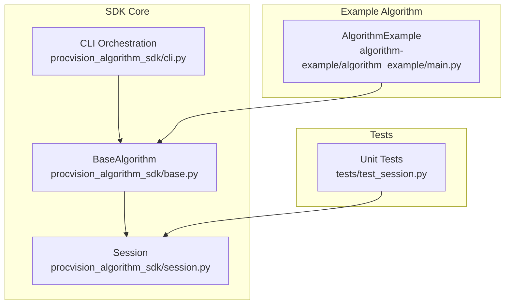
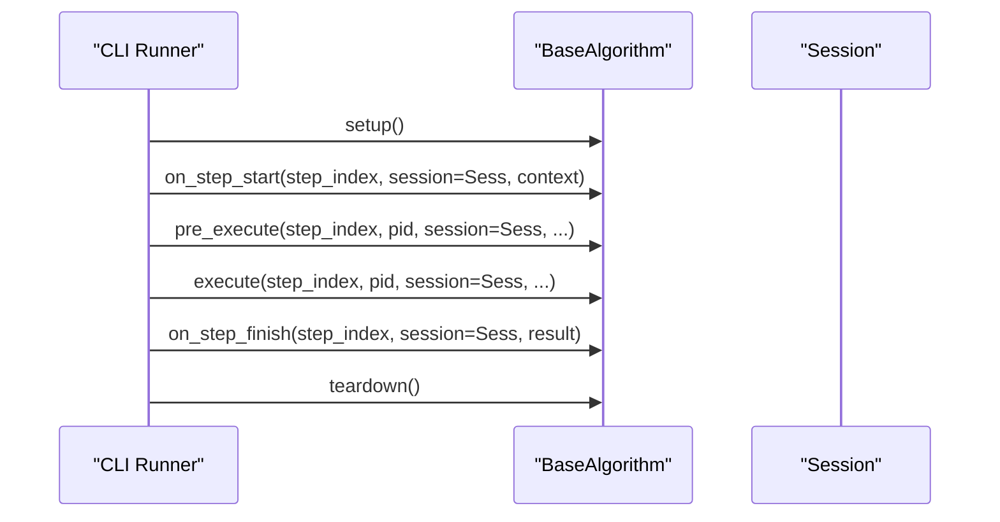
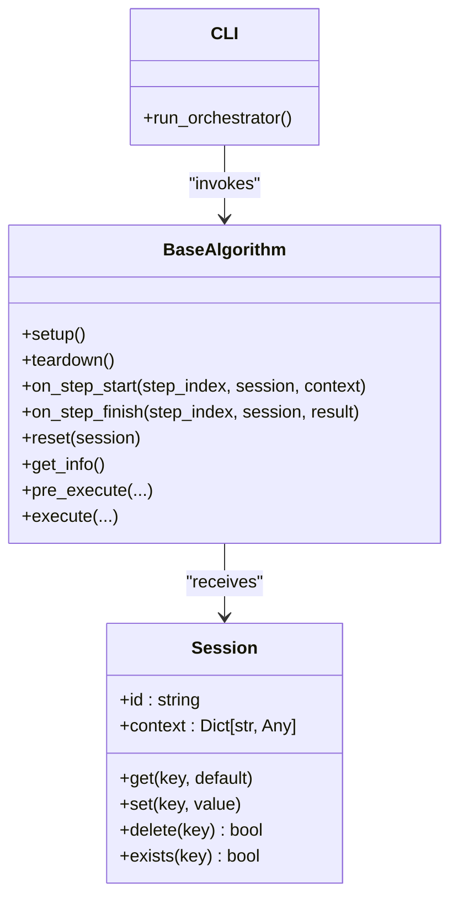

# Session Management

<cite>
**Referenced Files in This Document**
- [session.py](file://procvision_algorithm_sdk/session.py)
- [base.py](file://procvision_algorithm_sdk/base.py)
- [cli.py](file://procvision_algorithm_sdk/cli.py)
- [main.py](file://algorithm-example/algorithm_example/main.py)
- [test_session.py](file://tests/test_session.py)
- [algorithm_dev_tutorial.md](file://algorithm_dev_tutorial.md)
- [README.md](file://README.md)
</cite>

## Table of Contents
1. [Introduction](#introduction)
2. [Project Structure](#project-structure)
3. [Core Components](#core-components)
4. [Architecture Overview](#architecture-overview)
5. [Detailed Component Analysis](#detailed-component-analysis)
6. [Dependency Analysis](#dependency-analysis)
7. [Performance Considerations](#performance-considerations)
8. [Troubleshooting Guide](#troubleshooting-guide)
9. [Conclusion](#conclusion)

## Introduction
This document focuses on the Session Management sub-component of the algorithm SDK. It explains how the Session class maintains execution state across algorithm lifecycle steps, documents the set, get, delete, and exists methods, clarifies the immutable context property, and demonstrates concrete usage patterns. It also covers the integration between BaseAlgorithm and Session, including how session is passed to lifecycle methods, and provides guidance on handling non-serializable data and performance considerations for large state objects.

## Project Structure
The Session Management feature spans several modules:
- Session class definition and behavior
- BaseAlgorithm lifecycle hooks that receive and operate on Session
- CLI orchestration that wires lifecycle methods and passes Session to them
- Example algorithm demonstrating typical session usage patterns
- Tests validating session operations and JSON-serialization constraints

**Diagram sources**
- [session.py](file://procvision_algorithm_sdk/session.py#L1-L36)
- [base.py](file://procvision_algorithm_sdk/base.py#L1-L58)
- [cli.py](file://procvision_algorithm_sdk/cli.py#L192-L225)
- [main.py](file://algorithm-example/algorithm_example/main.py#L1-L150)
- [test_session.py](file://tests/test_session.py#L1-L24)

**Section sources**
- [session.py](file://procvision_algorithm_sdk/session.py#L1-L36)
- [base.py](file://procvision_algorithm_sdk/base.py#L1-L58)
- [cli.py](file://procvision_algorithm_sdk/cli.py#L192-L225)
- [main.py](file://algorithm-example/algorithm_example/main.py#L1-L150)
- [test_session.py](file://tests/test_session.py#L1-L24)

## Core Components
- Session: Provides a lightweight, JSON-serializable key-value store for cross-step state and an immutable context snapshot.
- BaseAlgorithm: Defines lifecycle hooks that receive a Session instance and can read/write state during execution.
- CLI: Invokes BaseAlgorithm lifecycle methods and passes a Session instance to each hook.

Key responsibilities:
- Session: Store and retrieve step-scoped state; enforce JSON-serializability; expose immutable context.
- BaseAlgorithm: Implement lifecycle hooks to initialize, prepare, execute, finalize, and reset state.
- CLI: Construct Session and pass it to lifecycle methods during validation and runtime.

**Section sources**
- [session.py](file://procvision_algorithm_sdk/session.py#L1-L36)
- [base.py](file://procvision_algorithm_sdk/base.py#L1-L58)
- [cli.py](file://procvision_algorithm_sdk/cli.py#L192-L225)

## Architecture Overview
The lifecycle orchestrator constructs a Session and invokes BaseAlgorithm hooks in order. The Session instance is passed to each hook, enabling state persistence across steps.

**Diagram sources**
- [cli.py](file://procvision_algorithm_sdk/cli.py#L192-L225)
- [base.py](file://procvision_algorithm_sdk/base.py#L1-L58)

## Detailed Component Analysis

### Session Class
The Session class encapsulates:
- id: Unique identifier for the session.
- context: Immutable snapshot of initial context (returned as a copy).
- _state_store: Internal dictionary for key-value state persisted across steps.

Methods:
- get(key, default): Retrieve a value by key.
- set(key, value): Store a value; raises TypeError if value is not JSON-serializable.
- delete(key): Remove a key; returns whether deletion occurred.
- exists(key): Check presence of a key.

Immutable context pattern:
- The context property returns a shallow copy of the internal context dictionary, preventing external mutation of the original context snapshot.

JSON-serialization requirement:
- The set method validates that values are JSON-serializable by attempting json.dumps. Non-serializable types cause a TypeError.

Usage patterns demonstrated in the example algorithm:
- Storing intermediate timestamps for latency computation.
- Publishing diagnostic metrics derived from session state.
- Cleaning up temporary keys in reset.

Integration with BaseAlgorithm:
- Lifecycle hooks receive a Session instance and can read/write state.
- The CLI constructs and passes Session to each hook during execution.

Common issues and solutions:
- Attempting to store non-serializable objects (e.g., sets, numpy arrays) triggers a TypeError. Convert to JSON-compatible types (lists, dicts, scalars) or serialize to bytes/JSON string first.
- Large state objects increase memory footprint and serialization cost. Prefer compact representations and prune unnecessary keys.

**Section sources**
- [session.py](file://procvision_algorithm_sdk/session.py#L1-L36)
- [test_session.py](file://tests/test_session.py#L1-L24)
- [main.py](file://algorithm-example/algorithm_example/main.py#L1-L150)
- [algorithm_dev_tutorial.md](file://algorithm_dev_tutorial.md#L96-L101)

### BaseAlgorithm Integration
BaseAlgorithm defines lifecycle hooks that accept a Session argument:
- on_step_start(step_index, session, context)
- on_step_finish(step_index, session, result)
- reset(session)
- pre_execute and execute also receive session alongside other parameters.

The CLI orchestrates these hooks and passes a Session instance to each call. This enables algorithms to persist state across steps and to share context-derived metadata (e.g., trace identifiers) across lifecycle boundaries.

**Section sources**
- [base.py](file://procvision_algorithm_sdk/base.py#L1-L58)
- [cli.py](file://procvision_algorithm_sdk/cli.py#L192-L225)

### Example Usage Patterns
The example algorithm demonstrates:
- Recording step start time in session during on_step_start.
- Computing and publishing latency metrics in on_step_finish using session data.
- Cleaning up temporary keys in reset.

These patterns illustrate:
- Storing intermediate results (timestamps).
- Caching configuration-like metadata (e.g., trace_id via context).
- Tracking execution metrics (latency) derived from session state.

**Section sources**
- [main.py](file://algorithm-example/algorithm_example/main.py#L1-L150)
- [cli.py](file://procvision_algorithm_sdk/cli.py#L192-L225)

## Dependency Analysis
Session is a standalone class with minimal dependencies. BaseAlgorithm depends on Session for state passing. The CLI composes BaseAlgorithm and Session during lifecycle execution.

**Diagram sources**
- [session.py](file://procvision_algorithm_sdk/session.py#L1-L36)
- [base.py](file://procvision_algorithm_sdk/base.py#L1-L58)
- [cli.py](file://procvision_algorithm_sdk/cli.py#L192-L225)

**Section sources**
- [session.py](file://procvision_algorithm_sdk/session.py#L1-L36)
- [base.py](file://procvision_algorithm_sdk/base.py#L1-L58)
- [cli.py](file://procvision_algorithm_sdk/cli.py#L192-L225)

## Performance Considerations
- JSON serialization cost: The set method performs json.dumps on every write. For large or frequently updated state, consider:
  - Minimizing the size of stored objects.
  - Using compact JSON-compatible structures (lists/dicts of primitives).
  - Avoiding repeated writes by batching updates.
- Memory footprint: Large state dictionaries increase memory usage. Periodically prune unused keys and avoid storing heavy artifacts (e.g., full images) in session.
- Access patterns: Frequent reads and writes can be optimized by caching frequently accessed values locally within a step and writing summaries at the end.
- Diagnostic overhead: Publishing diagnostics and logging should be lightweight; avoid serializing large objects unnecessarily.

[No sources needed since this section provides general guidance]

## Troubleshooting Guide
Common issues and resolutions:
- Non-serializable values cause TypeError on set:
  - Symptom: TypeError indicating the value must be JSON-serializable.
  - Resolution: Convert to JSON-compatible types (e.g., list/tuple to list, set to list, numpy arrays to lists or JSON strings). Ensure all nested structures are serializable.
- Mutable context mutations:
  - Symptom: External modifications to context appear to affect session.
  - Resolution: The context property returns a copy; avoid mutating the returned dictionary. If you need to modify context, reconstruct and pass a new context to the Session constructor.
- State not persisting across steps:
  - Symptom: Values disappear between steps.
  - Resolution: Verify that keys are set in on_step_start or earlier hooks and not deleted prematurely. Confirm that reset does not remove required keys unintentionally.
- Excessive memory usage:
  - Symptom: Out-of-memory errors or slow performance.
  - Resolution: Reduce state size, prune keys after use, and avoid storing large objects in session.

**Section sources**
- [session.py](file://procvision_algorithm_sdk/session.py#L1-L36)
- [test_session.py](file://tests/test_session.py#L1-L24)
- [algorithm_dev_tutorial.md](file://algorithm_dev_tutorial.md#L96-L101)

## Conclusion
Session provides a simple, robust mechanism for maintaining execution state across algorithm lifecycle steps while enforcing JSON-serializability. By leveraging BaseAlgorithm’s lifecycle hooks and the CLI’s orchestrated execution, algorithms can reliably store intermediate results, cache configuration, track metrics, and manage cleanup. Following the guidance here will help ensure predictable behavior, avoid common pitfalls, and achieve efficient state management.