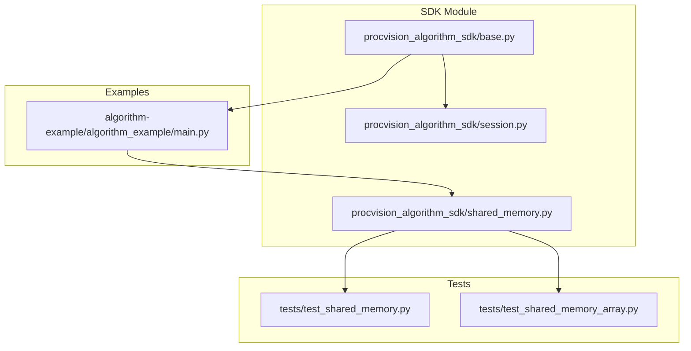
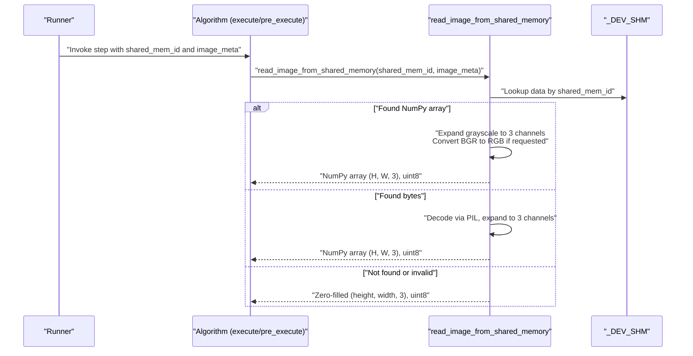
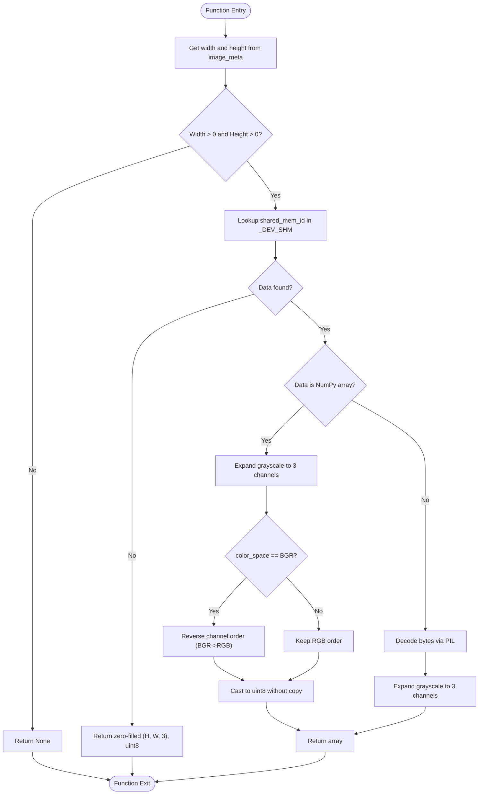
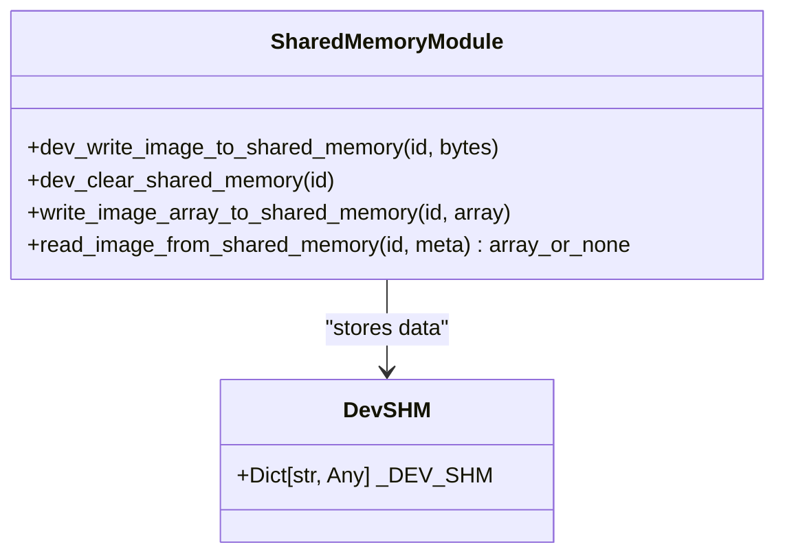
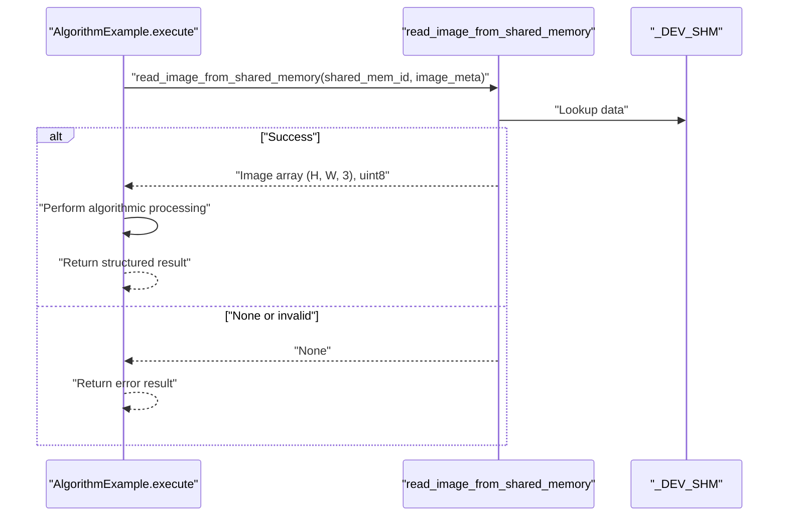
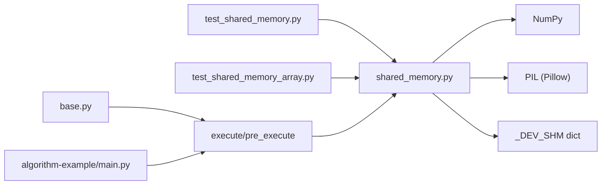

# Shared Memory

<cite>
**Referenced Files in This Document**
- [shared_memory.py](file://procvision_algorithm_sdk/shared_memory.py)
- [test_shared_memory.py](file://tests/test_shared_memory.py)
- [test_shared_memory_array.py](file://tests/test_shared_memory_array.py)
- [algorithm_dev_tutorial.md](file://algorithm_dev_tutorial.md)
- [algorithm_dev_quickstart.md](file://algorithm_dev_quickstart.md)
- [README.md](file://README.md)
- [base.py](file://procvision_algorithm_sdk/base.py)
- [main.py](file://algorithm-example/algorithm_example/main.py)
</cite>

## Table of Contents
1. [Introduction](#introduction)
2. [Project Structure](#project-structure)
3. [Core Components](#core-components)
4. [Architecture Overview](#architecture-overview)
5. [Detailed Component Analysis](#detailed-component-analysis)
6. [Dependency Analysis](#dependency-analysis)
7. [Performance Considerations](#performance-considerations)
8. [Troubleshooting Guide](#troubleshooting-guide)
9. [Conclusion](#conclusion)
10. [Appendices](#appendices)

## Introduction
This document explains the Shared Memory sub-component used by the ProcVision platform to transfer image data between the platform and algorithms. It focuses on the read_image_from_shared_memory function, its parameters, and the development-mode simulation of shared memory via an internal dictionary. It also covers image format handling (grayscale expansion, BGR-to-RGB conversion), fallback behavior, and the typical data flow from user-provided shared memory identifiers to a NumPy array output. Practical examples demonstrate how execute methods commonly call read_image_from_shared_memory, and guidance is provided for common issues and performance optimizations.

## Project Structure
The Shared Memory functionality resides in a dedicated module and is exercised by unit tests and example algorithms. The module exposes helper functions for writing and reading images in development mode, and the algorithm base class defines the interface contract for passing shared memory identifiers and metadata into algorithm steps.

**Diagram sources**
- [shared_memory.py](file://procvision_algorithm_sdk/shared_memory.py#L1-L53)
- [base.py](file://procvision_algorithm_sdk/base.py#L1-L58)
- [session.py](file://procvision_algorithm_sdk/session.py#L1-L36)
- [test_shared_memory.py](file://tests/test_shared_memory.py#L1-L16)
- [test_shared_memory_array.py](file://tests/test_shared_memory_array.py#L1-L39)
- [main.py](file://algorithm-example/algorithm_example/main.py#L1-L150)

**Section sources**
- [shared_memory.py](file://procvision_algorithm_sdk/shared_memory.py#L1-L53)
- [base.py](file://procvision_algorithm_sdk/base.py#L1-L58)
- [session.py](file://procvision_algorithm_sdk/session.py#L1-L36)
- [test_shared_memory.py](file://tests/test_shared_memory.py#L1-L16)
- [test_shared_memory_array.py](file://tests/test_shared_memory_array.py#L1-L39)
- [main.py](file://algorithm-example/algorithm_example/main.py#L1-L150)

## Core Components
- read_image_from_shared_memory(shared_mem_id, image_meta): Reads image data from development-mode shared memory and returns a NumPy array suitable for algorithm processing. It validates dimensions, supports both NumPy arrays and decoded image bytes, expands grayscale to 3-channel, and converts BGR to RGB when requested.
- dev_write_image_to_shared_memory(shared_mem_id, image_bytes): Writes raw image bytes (e.g., JPEG/PNG) into the development-mode shared memory for testing.
- write_image_array_to_shared_memory(shared_mem_id, image_array): Writes a NumPy array into development-mode shared memory for testing.
- _DEV_SHM: Internal dictionary acting as a simulated shared memory store during development.

Key behaviors:
- Dimensions: width and height must be positive integers; otherwise the function returns None.
- Data sources: Accepts either bytes (decoded via PIL) or NumPy arrays.
- Grayscale handling: Expands 2D arrays and single-channel 3D arrays to 3 channels.
- Color space: Converts BGR to RGB when color_space is set to BGR.
- Fallback: Returns a zero-filled array with shape (height, width, 3) and dtype uint8 when no data is present or decoding fails.

**Section sources**
- [shared_memory.py](file://procvision_algorithm_sdk/shared_memory.py#L1-L53)
- [test_shared_memory.py](file://tests/test_shared_memory.py#L1-L16)
- [test_shared_memory_array.py](file://tests/test_shared_memory_array.py#L1-L39)
- [algorithm_dev_tutorial.md](file://algorithm_dev_tutorial.md#L103-L127)
- [algorithm_dev_quickstart.md](file://algorithm_dev_quickstart.md#L89-L120)

## Architecture Overview
The Shared Memory sub-component integrates with the algorithm lifecycle. Algorithms receive a shared_mem_id and image_meta from the platform. The algorithm’s execute/pre_execute methods call read_image_from_shared_memory to obtain a NumPy array. During development, the SDK simulates shared memory using an internal dictionary.

**Diagram sources**
- [shared_memory.py](file://procvision_algorithm_sdk/shared_memory.py#L15-L52)
- [main.py](file://algorithm-example/algorithm_example/main.py#L1-L150)

## Detailed Component Analysis

### read_image_from_shared_memory
Purpose: Retrieve an image as a NumPy array from development-mode shared memory using a shared identifier and metadata.

Parameters:
- shared_mem_id: String identifier used to locate the image in development-mode storage.
- image_meta: Dictionary containing at least width and height (and optional color_space). The tutorial and quickstart documents note additional keys such as timestamp_ms and camera_id.

Processing logic:
- Dimension validation: If width or height are non-positive, return None.
- Lookup: Retrieve data by shared_mem_id from the internal dictionary.
- Array path:
  - Expand grayscale to 3 channels if needed.
  - Convert BGR to RGB when color_space is BGR.
  - Cast to uint8 without copying when possible.
- Bytes path:
  - Decode via PIL and convert to NumPy array.
  - Expand grayscale to 3 channels if needed.
- Fallback:
  - Return a zero-filled array with shape (height, width, 3) and dtype uint8.

Behavioral guarantees:
- Always returns a 3-channel array with uint8 dtype when successful.
- Returns None when dimensions are invalid.
- Returns a zero-filled fallback when data is absent or decoding fails.

**Diagram sources**
- [shared_memory.py](file://procvision_algorithm_sdk/shared_memory.py#L15-L52)

**Section sources**
- [shared_memory.py](file://procvision_algorithm_sdk/shared_memory.py#L1-L53)
- [algorithm_dev_tutorial.md](file://algorithm_dev_tutorial.md#L103-L127)
- [algorithm_dev_quickstart.md](file://algorithm_dev_quickstart.md#L89-L120)

### Development Mode Simulation (_DEV_SHM)
- Purpose: Simulate shared memory during development and testing.
- Mechanism: A global dictionary stores image data keyed by shared_mem_id. Two writers are provided:
  - dev_write_image_to_shared_memory: stores raw bytes (e.g., JPEG/PNG).
  - write_image_array_to_shared_memory: stores a NumPy array.
- Clearing: dev_clear_shared_memory removes entries by key.

**Diagram sources**
- [shared_memory.py](file://procvision_algorithm_sdk/shared_memory.py#L1-L53)

**Section sources**
- [shared_memory.py](file://procvision_algorithm_sdk/shared_memory.py#L1-L53)

### Example Usage in Algorithm Steps
- The algorithm base class defines execute and pre_execute signatures that include shared_mem_id and image_meta.
- Example algorithms call read_image_from_shared_memory inside execute/pre_execute to obtain the image array.
- Typical checks include validating the returned image and handling None when dimensions are invalid.

**Diagram sources**
- [base.py](file://procvision_algorithm_sdk/base.py#L1-L58)
- [main.py](file://algorithm-example/algorithm_example/main.py#L1-L150)
- [shared_memory.py](file://procvision_algorithm_sdk/shared_memory.py#L15-L52)

**Section sources**
- [base.py](file://procvision_algorithm_sdk/base.py#L1-L58)
- [main.py](file://algorithm-example/algorithm_example/main.py#L1-L150)

## Dependency Analysis
- read_image_from_shared_memory depends on:
  - NumPy for array operations and casting.
  - PIL for decoding bytes into arrays.
  - An internal dictionary for development-mode storage.
- Tests validate:
  - Fallback behavior when decoding fails.
  - Correctness of grayscale expansion and BGR-to-RGB conversion.
- The algorithm base class defines the contract for passing shared_mem_id and image_meta into execute and pre_execute.

**Diagram sources**
- [shared_memory.py](file://procvision_algorithm_sdk/shared_memory.py#L1-L53)
- [test_shared_memory.py](file://tests/test_shared_memory.py#L1-L16)
- [test_shared_memory_array.py](file://tests/test_shared_memory_array.py#L1-L39)
- [base.py](file://procvision_algorithm_sdk/base.py#L1-L58)
- [main.py](file://algorithm-example/algorithm_example/main.py#L1-L150)

**Section sources**
- [shared_memory.py](file://procvision_algorithm_sdk/shared_memory.py#L1-L53)
- [test_shared_memory.py](file://tests/test_shared_memory.py#L1-L16)
- [test_shared_memory_array.py](file://tests/test_shared_memory_array.py#L1-L39)
- [base.py](file://procvision_algorithm_sdk/base.py#L1-L58)
- [main.py](file://algorithm-example/algorithm_example/main.py#L1-L150)

## Performance Considerations
- Minimizing memory copies:
  - The function attempts to cast to uint8 without copying when possible. Ensure input arrays are already uint8 to avoid unnecessary conversions.
  - Prefer passing 3-channel arrays directly to avoid extra expansion and conversion steps.
- Handling large images:
  - Large images increase memory footprint and processing time. Consider resizing upstream or using streaming decoders if applicable.
  - Avoid repeated reads by caching the image within a step when appropriate.
- Decoding costs:
  - Decoding bytes via PIL introduces overhead. If possible, pass arrays directly to reduce decode time.
- Color space conversions:
  - BGR-to-RGB reversal is a simple channel swap; keep it minimal by setting color_space correctly upstream.

[No sources needed since this section provides general guidance]

## Troubleshooting Guide
Common issues and resolutions:
- Incorrect image_meta specifications:
  - Symptom: read_image_from_shared_memory returns None.
  - Cause: width or height are non-positive.
  - Resolution: Ensure width and height are valid positive integers in image_meta.
  - Reference: [shared_memory.py](file://procvision_algorithm_sdk/shared_memory.py#L15-L22)
- Missing shared memory entries:
  - Symptom: Fallback zero-filled array is returned.
  - Cause: shared_mem_id not present in _DEV_SHM.
  - Resolution: Write data using dev_write_image_to_shared_memory or write_image_array_to_shared_memory before reading.
  - References:
    - [shared_memory.py](file://procvision_algorithm_sdk/shared_memory.py#L1-L53)
    - [test_shared_memory.py](file://tests/test_shared_memory.py#L1-L16)
- Invalid or unsupported data:
  - Symptom: Decoding fails and fallback zero-filled array is returned.
  - Cause: Data is not valid image bytes or incompatible format.
  - Resolution: Ensure data is valid JPEG/PNG bytes or pass a NumPy array directly.
  - References:
    - [shared_memory.py](file://procvision_algorithm_sdk/shared_memory.py#L23-L52)
    - [test_shared_memory.py](file://tests/test_shared_memory.py#L1-L16)
- Grayscale to RGB conversion:
  - Symptom: Unexpected color appearance.
  - Cause: Grayscale images are expanded to 3 channels automatically; BGR vs RGB mismatch.
  - Resolution: Set color_space appropriately in image_meta to trigger BGR-to-RGB conversion when needed.
  - References:
    - [test_shared_memory_array.py](file://tests/test_shared_memory_array.py#L1-L39)
    - [algorithm_dev_tutorial.md](file://algorithm_dev_tutorial.md#L103-L127)
- JPEG-only constraint:
  - Symptom: Confusion about supported formats.
  - Cause: The specification documents indicate JPEG-only for shared memory transfers.
  - Resolution: Provide JPEG-encoded bytes or arrays.
  - Reference: [README.md](file://README.md#L1-L116)

**Section sources**
- [shared_memory.py](file://procvision_algorithm_sdk/shared_memory.py#L1-L53)
- [test_shared_memory.py](file://tests/test_shared_memory.py#L1-L16)
- [test_shared_memory_array.py](file://tests/test_shared_memory_array.py#L1-L39)
- [algorithm_dev_tutorial.md](file://algorithm_dev_tutorial.md#L103-L127)
- [README.md](file://README.md#L1-L116)

## Conclusion
The Shared Memory sub-component provides a robust, development-friendly mechanism for transferring images between the ProcVision platform and algorithms. The read_image_from_shared_memory function centralizes dimension validation, data source handling, format normalization, and fallback behavior. By adhering to the documented image_meta requirements and using the provided helpers, developers can reliably integrate image acquisition into their algorithms while maintaining predictable performance and behavior.

[No sources needed since this section summarizes without analyzing specific files]

## Appendices

### API Summary
- read_image_from_shared_memory(shared_mem_id: str, image_meta: Dict[str, Any]) -> Any
  - Validates width and height; returns None if invalid.
  - Supports NumPy arrays and bytes; expands grayscale to 3 channels; converts BGR to RGB when requested.
  - Returns a zero-filled (height, width, 3), uint8 array on failure.
- dev_write_image_to_shared_memory(shared_mem_id: str, image_bytes: bytes) -> None
- write_image_array_to_shared_memory(shared_mem_id: str, image_array: Any) -> None
- dev_clear_shared_memory(shared_mem_id: str) -> None

References:
- [shared_memory.py](file://procvision_algorithm_sdk/shared_memory.py#L1-L53)
- [algorithm_dev_tutorial.md](file://algorithm_dev_tutorial.md#L103-L127)
- [algorithm_dev_quickstart.md](file://algorithm_dev_quickstart.md#L89-L120)

**Section sources**
- [shared_memory.py](file://procvision_algorithm_sdk/shared_memory.py#L1-L53)
- [algorithm_dev_tutorial.md](file://algorithm_dev_tutorial.md#L103-L127)
- [algorithm_dev_quickstart.md](file://algorithm_dev_quickstart.md#L89-L120)