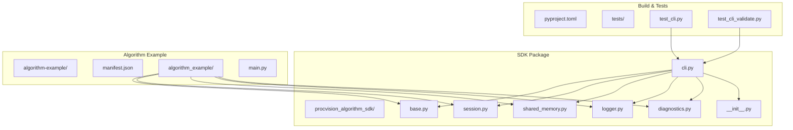
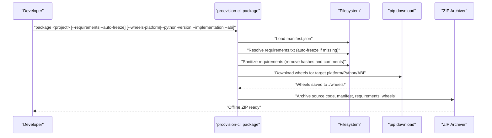
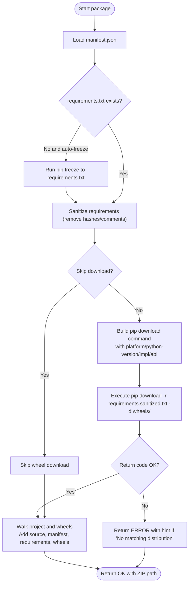
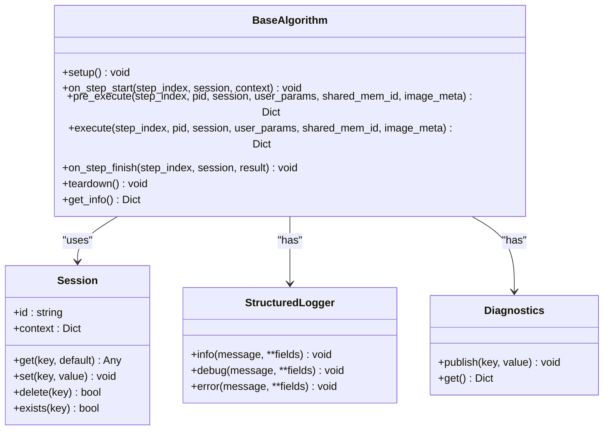
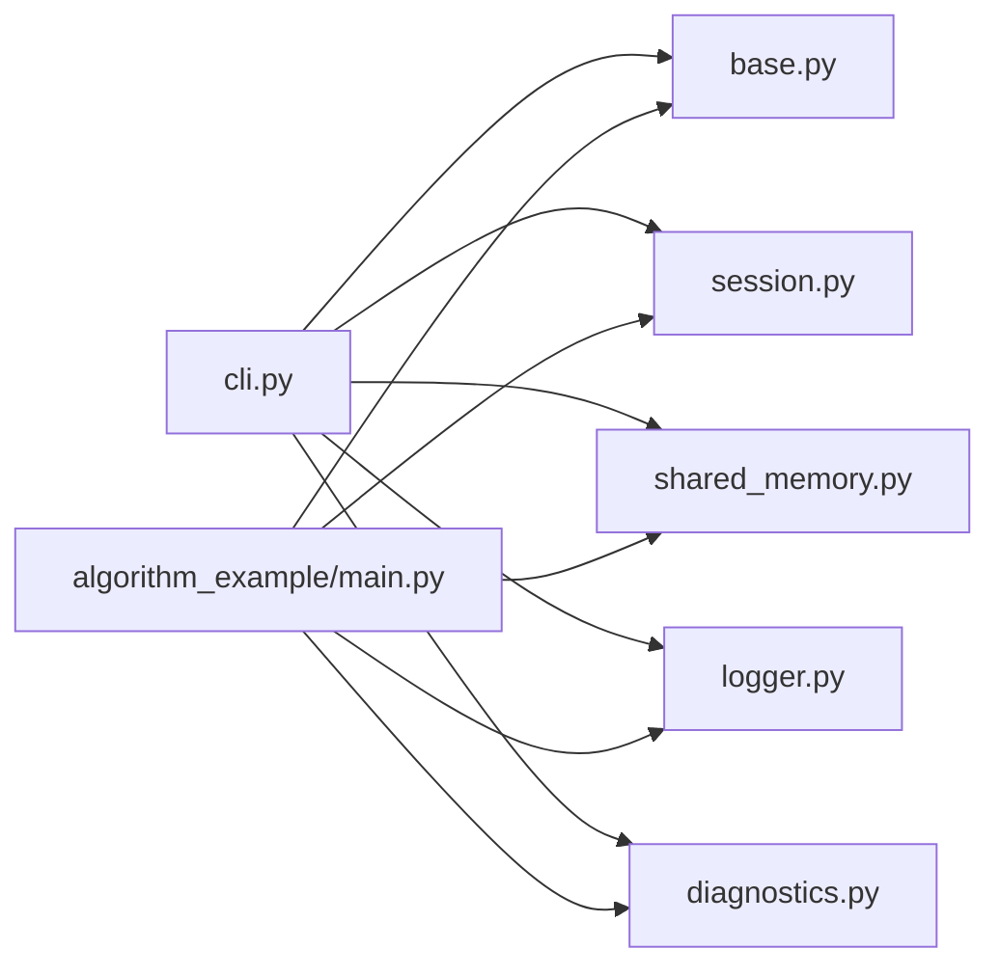

# Deployment

<cite>
**Referenced Files in This Document**
- [cli.py](file://procvision_algorithm_sdk/cli.py)
- [base.py](file://procvision_algorithm_sdk/base.py)
- [session.py](file://procvision_algorithm_sdk/session.py)
- [shared_memory.py](file://procvision_algorithm_sdk/shared_memory.py)
- [logger.py](file://procvision_algorithm_sdk/logger.py)
- [diagnostics.py](file://procvision_algorithm_sdk/diagnostics.py)
- [__init__.py](file://procvision_algorithm_sdk/__init__.py)
- [manifest.json](file://algorithm-example/manifest.json)
- [main.py](file://algorithm-example/algorithm_example/main.py)
- [README.md](file://README.md)
- [pyproject.toml](file://pyproject.toml)
- [test_cli.py](file://tests/test_cli.py)
- [test_cli_validate.py](file://tests/test_cli_validate.py)
</cite>

## Table of Contents
1. [Introduction](#introduction)
2. [Project Structure](#project-structure)
3. [Core Components](#core-components)
4. [Architecture Overview](#architecture-overview)
5. [Detailed Component Analysis](#detailed-component-analysis)
6. [Dependency Analysis](#dependency-analysis)
7. [Performance Considerations](#performance-considerations)
8. [Troubleshooting Guide](#troubleshooting-guide)
9. [Conclusion](#conclusion)
10. [Appendices](#appendices)

## Introduction
This document explains how to deploy ProcVision algorithms to production environments using the offline packaging workflow provided by the SDK’s command-line interface. The workflow packages source code, manifest, requirements, and dependency wheels into a ZIP archive suitable for offline installation on target platforms. It covers dependency resolution, wheel targeting for specific Python versions and platforms, the structure of the generated offline package, version management via manifest.json and semantic versioning, validation steps on the target platform, and best practices for testing and logging.

## Project Structure
The repository is organized around the SDK and a minimal example algorithm. The CLI orchestrates packaging, validation, and local runs. The example algorithm demonstrates the expected manifest and implementation structure.

**Diagram sources**
- [cli.py](file://procvision_algorithm_sdk/cli.py#L1-L615)
- [base.py](file://procvision_algorithm_sdk/base.py#L1-L58)
- [session.py](file://procvision_algorithm_sdk/session.py#L1-L36)
- [shared_memory.py](file://procvision_algorithm_sdk/shared_memory.py#L1-L53)
- [logger.py](file://procvision_algorithm_sdk/logger.py#L1-L24)
- [diagnostics.py](file://procvision_algorithm_sdk/diagnostics.py#L1-L12)
- [__init__.py](file://procvision_algorithm_sdk/__init__.py#L1-L20)
- [manifest.json](file://algorithm-example/manifest.json#L1-L25)
- [main.py](file://algorithm-example/algorithm_example/main.py#L1-L150)
- [pyproject.toml](file://pyproject.toml#L1-L36)
- [test_cli.py](file://tests/test_cli.py#L1-L20)
- [test_cli_validate.py](file://tests/test_cli_validate.py#L1-L11)

**Section sources**
- [README.md](file://README.md#L1-L116)
- [pyproject.toml](file://pyproject.toml#L1-L36)

## Core Components
- CLI entrypoint and commands:
  - validate: verifies manifest presence and correctness, imports the entry class, checks supported PIDs, and validates the algorithm lifecycle and return structures. It can also validate an existing offline ZIP for required files and wheels.
  - run: simulates a local execution by writing an image to a development shared memory and invoking pre_execute and execute.
  - package: builds an offline ZIP by sanitizing requirements, downloading wheels for a target platform/Python version/ABI, and archiving source code, manifest, requirements, and wheels.
  - init: scaffolds a new algorithm project with a manifest and a minimal algorithm class.
- Algorithm base contract:
  - BaseAlgorithm defines lifecycle hooks and abstract methods that implementors must provide.
- Runtime helpers:
  - Session manages per-run context and state.
  - Shared memory utilities enable reading images from a shared memory identifier.
  - StructuredLogger and Diagnostics provide structured logging and diagnostic publishing.

**Section sources**
- [cli.py](file://procvision_algorithm_sdk/cli.py#L1-L615)
- [base.py](file://procvision_algorithm_sdk/base.py#L1-L58)
- [session.py](file://procvision_algorithm_sdk/session.py#L1-L36)
- [shared_memory.py](file://procvision_algorithm_sdk/shared_memory.py#L1-L53)
- [logger.py](file://procvision_algorithm_sdk/logger.py#L1-L24)
- [diagnostics.py](file://procvision_algorithm_sdk/diagnostics.py#L1-L12)

## Architecture Overview
The offline packaging pipeline integrates CLI orchestration, dependency resolution, and artifact assembly.

**Diagram sources**
- [cli.py](file://procvision_algorithm_sdk/cli.py#L228-L326)
- [README.md](file://README.md#L1-L116)

## Detailed Component Analysis

### Offline Packaging Workflow
- Manifest-driven package name and version:
  - The offline ZIP filename is derived from the algorithm name and semantic version embedded in manifest.json.
- Requirements handling:
  - If requirements.txt is missing, the CLI can auto-generate it using pip freeze.
  - The CLI sanitizes requirements by removing hash markers and comment fragments to produce a clean requirements.sanitized.txt used for wheel downloads.
- Targeted wheel downloads:
  - Wheels are downloaded into a wheels/ directory using pip with explicit platform, Python version, implementation, and ABI flags.
  - The CLI reads defaults from a project-local .procvision_env.json if present, otherwise falls back to defaults.
- ZIP assembly:
  - The CLI walks the project directory, excluding virtual environments and wheels, and adds source files and manifest/requirements.
  - It then appends all wheel files from wheels/ into the archive.

**Diagram sources**
- [cli.py](file://procvision_algorithm_sdk/cli.py#L228-L326)
- [cli.py](file://procvision_algorithm_sdk/cli.py#L259-L298)

**Section sources**
- [cli.py](file://procvision_algorithm_sdk/cli.py#L228-L326)
- [cli.py](file://procvision_algorithm_sdk/cli.py#L259-L298)
- [README.md](file://README.md#L1-L116)

### Dependency Resolution and Wheel Targeting
- Auto-freeze:
  - When requirements.txt is absent and auto-freeze is enabled, the CLI executes pip freeze in the current environment to generate requirements.txt.
- Sanitization:
  - Lines are stripped of trailing comments and hash constraints to produce a portable requirements.sanitized.txt for wheel downloads.
- Target selection:
  - The CLI constructs pip download arguments with platform, Python version, implementation, and ABI. Defaults are read from .procvision_env.json if present.
- Binary-only wheels:
  - The CLI enforces --only-binary=:all: to ensure only prebuilt wheels are fetched, avoiding compilation on the target platform.

**Section sources**
- [cli.py](file://procvision_algorithm_sdk/cli.py#L228-L326)
- [cli.py](file://procvision_algorithm_sdk/cli.py#L259-L298)
- [README.md](file://README.md#L1-L116)

### Generated Offline Package Structure
The offline ZIP contains:
- Algorithm source code (excluding virtual environments and wheels).
- manifest.json at the root.
- requirements.txt (sanitized).
- wheels/ directory containing all dependency wheels.
- Optional assets/ directory (as supported by the packaging logic).

Validation checks ensure that an offline ZIP contains manifest.json, requirements.txt, and wheels.

**Section sources**
- [cli.py](file://procvision_algorithm_sdk/cli.py#L127-L159)
- [cli.py](file://procvision_algorithm_sdk/cli.py#L228-L326)

### Version Management and Semantic Versioning
- manifest.json:
  - The manifest specifies name and version, which are used to derive the offline ZIP filename.
  - The example manifest uses a numeric version string; semantic versioning is recommended for clarity and compatibility.
- SDK version:
  - The SDK itself declares its version in pyproject.toml under [project].
- Best practice:
  - Align algorithm version with manifest version and use semantic versioning (major.minor.patch) to communicate breaking changes, features, and fixes.

**Section sources**
- [manifest.json](file://algorithm-example/manifest.json#L1-L25)
- [cli.py](file://procvision_algorithm_sdk/cli.py#L228-L240)
- [pyproject.toml](file://pyproject.toml#L1-L36)

### Deployment Validation on Target Platform
- Pre-deployment checks:
  - Verify the offline ZIP contains manifest.json, requirements.txt, and wheels/.
  - Confirm that wheels match the target platform/Python version/ABI.
- Post-installation verification:
  - Run the algorithm locally using the CLI to validate lifecycle hooks and return structures.
  - Use validate to confirm manifest fields, entry class import, supported PIDs, and basic execution behavior.

**Section sources**
- [cli.py](file://procvision_algorithm_sdk/cli.py#L127-L159)
- [cli.py](file://procvision_algorithm_sdk/cli.py#L1-L120)
- [test_cli.py](file://tests/test_cli.py#L1-L20)
- [test_cli_validate.py](file://tests/test_cli_validate.py#L1-L11)

### Algorithm Lifecycle and Execution Hooks
- BaseAlgorithm contract:
  - Implement get_info, pre_execute, and execute.
  - Lifecycle hooks include setup, on_step_start, on_step_finish, and teardown.
- Session and shared memory:
  - Session carries context and per-run state.
  - Shared memory utilities support reading images for execution.
- Logging and diagnostics:
  - StructuredLogger emits structured records with timestamps.
  - Diagnostics collects metrics and metadata for observability.

**Diagram sources**
- [base.py](file://procvision_algorithm_sdk/base.py#L1-L58)
- [session.py](file://procvision_algorithm_sdk/session.py#L1-L36)
- [logger.py](file://procvision_algorithm_sdk/logger.py#L1-L24)
- [diagnostics.py](file://procvision_algorithm_sdk/diagnostics.py#L1-L12)

**Section sources**
- [base.py](file://procvision_algorithm_sdk/base.py#L1-L58)
- [session.py](file://procvision_algorithm_sdk/session.py#L1-L36)
- [shared_memory.py](file://procvision_algorithm_sdk/shared_memory.py#L1-L53)
- [logger.py](file://procvision_algorithm_sdk/logger.py#L1-L24)
- [diagnostics.py](file://procvision_algorithm_sdk/diagnostics.py#L1-L12)

## Dependency Analysis
- CLI depends on:
  - BaseAlgorithm for importing the entry class.
  - Session for runtime context.
  - Shared memory utilities for image access during local runs.
  - Standard library modules for file operations, subprocess, and ZIP creation.
- Algorithm example depends on:
  - BaseAlgorithm, Session, and shared memory utilities.
  - Demonstrates lifecycle hooks and structured logging/diagnostics.

**Diagram sources**
- [cli.py](file://procvision_algorithm_sdk/cli.py#L1-L615)
- [base.py](file://procvision_algorithm_sdk/base.py#L1-L58)
- [session.py](file://procvision_algorithm_sdk/session.py#L1-L36)
- [shared_memory.py](file://procvision_algorithm_sdk/shared_memory.py#L1-L53)
- [logger.py](file://procvision_algorithm_sdk/logger.py#L1-L24)
- [diagnostics.py](file://procvision_algorithm_sdk/diagnostics.py#L1-L12)
- [main.py](file://algorithm-example/algorithm_example/main.py#L1-L150)

**Section sources**
- [cli.py](file://procvision_algorithm_sdk/cli.py#L1-L615)
- [base.py](file://procvision_algorithm_sdk/base.py#L1-L58)
- [session.py](file://procvision_algorithm_sdk/session.py#L1-L36)
- [shared_memory.py](file://procvision_algorithm_sdk/shared_memory.py#L1-L53)
- [logger.py](file://procvision_algorithm_sdk/logger.py#L1-L24)
- [diagnostics.py](file://procvision_algorithm_sdk/diagnostics.py#L1-L12)
- [main.py](file://algorithm-example/algorithm_example/main.py#L1-L150)

## Performance Considerations
- Prefer binary-only wheels to avoid compilation overhead on the target platform.
- Keep wheels minimal by sanitizing requirements and avoiding unnecessary extras.
- Use targeted platform/ABI settings to prevent cross-platform compatibility issues.
- Validate the offline package locally before deployment to catch performance regressions early.

[No sources needed since this section provides general guidance]

## Troubleshooting Guide
Common issues and resolutions:
- Missing wheels:
  - Ensure requirements.sanitized.txt is valid and that pip download succeeded for the target platform/Python version/ABI.
  - Re-run package with --auto-freeze and correct --wheels-platform/--python-version/--implementation/--abi.
- Platform incompatibility:
  - Match --platform, --python-version, --implementation, and --abi exactly to the target environment.
  - Use a virtual environment aligned with the target Python version to generate requirements.txt.
- Version conflicts:
  - Review requirements.sanitized.txt for incompatible combinations.
  - Pin versions explicitly in requirements.txt if necessary.
- Offline ZIP validation failures:
  - Confirm the ZIP contains manifest.json, requirements.txt, and wheels/.
  - Use the validate command with --zip to inspect the archive contents.

**Section sources**
- [cli.py](file://procvision_algorithm_sdk/cli.py#L228-L326)
- [cli.py](file://procvision_algorithm_sdk/cli.py#L127-L159)
- [README.md](file://README.md#L1-L116)

## Conclusion
The offline packaging workflow ensures deterministic deployments by bundling algorithm sources, manifest, sanitized requirements, and platform-targeted wheels into a single ZIP. By validating manifests, wheels, and execution behavior, teams can confidently deliver algorithms to production environments while adhering to semantic versioning and best practices for testing and logging.

[No sources needed since this section summarizes without analyzing specific files]

## Appendices

### Appendix A: CLI Commands Reference
- validate:
  - Validates manifest presence and correctness, imports the entry class, checks supported PIDs, and verifies lifecycle and return structures. Can also validate an offline ZIP for required files and wheels.
- run:
  - Writes a local image to development shared memory and invokes pre_execute and execute for quick smoke testing.
- package:
  - Builds an offline ZIP by sanitizing requirements, downloading wheels for a target platform/Python version/ABI, and archiving source code, manifest, requirements, and wheels.
- init:
  - Scaffolds a new algorithm project with a manifest and a minimal algorithm class.

**Section sources**
- [cli.py](file://procvision_algorithm_sdk/cli.py#L1-L615)

### Appendix B: Example Algorithm Manifest
- The example manifest demonstrates fields such as name, version, entry_point, description, supported_pids, and steps. Use semantic versioning for clarity and compatibility.

**Section sources**
- [manifest.json](file://algorithm-example/manifest.json#L1-L25)