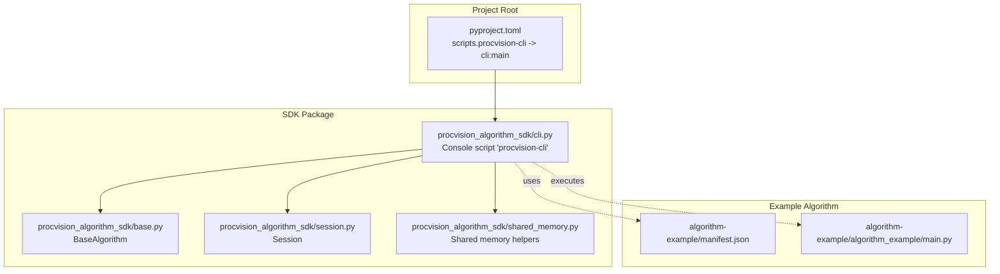
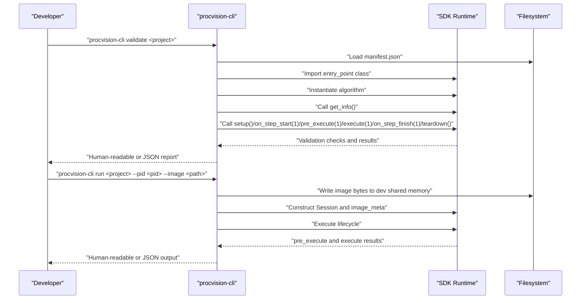
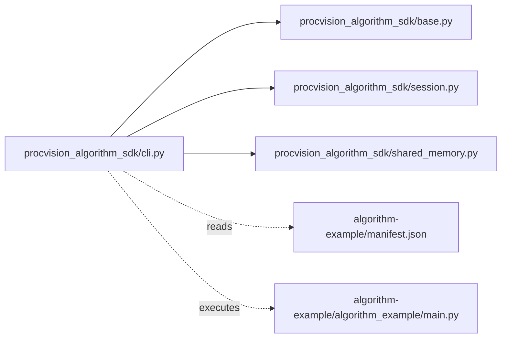

# Development CLI

<cite>
**Referenced Files in This Document**
- [cli.py](file://procvision_algorithm_sdk/cli.py)
- [base.py](file://procvision_algorithm_sdk/base.py)
- [session.py](file://procvision_algorithm_sdk/session.py)
- [shared_memory.py](file://procvision_algorithm_sdk/shared_memory.py)
- [pyproject.toml](file://pyproject.toml)
- [README.md](file://README.md)
- [algorithm-example/manifest.json](file://algorithm-example/manifest.json)
- [algorithm-example/algorithm_example/main.py](file://algorithm-example/algorithm_example/main.py)
- [tests/test_cli.py](file://tests/test_cli.py)
- [tests/test_cli_validate.py](file://tests/test_cli_validate.py)
- [algorithm_dev_quickstart.md](file://algorithm_dev_quickstart.md)
- [algorithm_dev_tutorial.md](file://algorithm_dev_tutorial.md)
</cite>

## Table of Contents
1. [Introduction](#introduction)
2. [Project Structure](#project-structure)
3. [Core Components](#core-components)
4. [Architecture Overview](#architecture-overview)
5. [Detailed Component Analysis](#detailed-component-analysis)
6. [Dependency Analysis](#dependency-analysis)
7. [Performance Considerations](#performance-considerations)
8. [Troubleshooting Guide](#troubleshooting-guide)
9. [Conclusion](#conclusion)
10. [Appendices](#appendices)

## Introduction
This document provides comprehensive developer guidance for the Development CLI (procvision-cli), the primary tooling for algorithm development within the ProcVision SDK. It covers four commands:
- init: project scaffolding generation
- validate: structural and functional verification
- run: local execution simulation
- package: offline deployment bundling

It explains how validate checks manifest consistency, entry point validity, and method return schemas; how run simulates shared memory with local images and outputs results; and how package freezes dependencies, downloads wheels, and creates ZIP archives. It also documents configuration via .procvision_env.json and addresses common issues such as missing requirements.txt or platform mismatch in wheel downloads.

## Project Structure
The CLI is implemented as a console script entry point declared in the project metadata and wired to the main function in the SDK module. The CLI orchestrates algorithm validation, local simulation, and packaging workflows around the SDK’s core primitives: BaseAlgorithm, Session, and shared memory helpers.

**Diagram sources**
- [cli.py](file://procvision_algorithm_sdk/cli.py#L520-L611)
- [base.py](file://procvision_algorithm_sdk/base.py#L1-L58)
- [session.py](file://procvision_algorithm_sdk/session.py#L1-L36)
- [shared_memory.py](file://procvision_algorithm_sdk/shared_memory.py#L1-L53)
- [pyproject.toml](file://pyproject.toml#L24-L31)
- [algorithm-example/manifest.json](file://algorithm-example/manifest.json#L1-L25)
- [algorithm-example/algorithm_example/main.py](file://algorithm-example/algorithm_example/main.py#L1-L150)

**Section sources**
- [pyproject.toml](file://pyproject.toml#L24-L31)
- [cli.py](file://procvision_algorithm_sdk/cli.py#L520-L611)

## Core Components
- Console entry point: The CLI is exposed as a console script named procvision-cli, pointing to the main function in the SDK module.
- Subcommands:
  - init: Generates a new algorithm project scaffold with manifest.json, package directory, and a minimal algorithm class.
  - validate: Verifies manifest presence and correctness, imports the entry point class, ensures supported_pids match, and runs a smoke test of get_info, pre_execute, and execute with a demo session and image metadata.
  - run: Writes a local image into simulated shared memory, constructs a Session, and executes the full lifecycle (setup, on_step_start, pre_execute, execute, on_step_finish, teardown).
  - package: Ensures requirements.txt exists (optionally auto-generating via pip freeze), sanitizes hashes, downloads wheels for a target platform/ABI, and packages the project plus wheels into a ZIP archive.

**Section sources**
- [cli.py](file://procvision_algorithm_sdk/cli.py#L36-L145)
- [cli.py](file://procvision_algorithm_sdk/cli.py#L163-L226)
- [cli.py](file://procvision_algorithm_sdk/cli.py#L228-L326)
- [cli.py](file://procvision_algorithm_sdk/cli.py#L344-L463)
- [pyproject.toml](file://pyproject.toml#L24-L31)

## Architecture Overview
The CLI coordinates with the SDK’s BaseAlgorithm interface and runtime helpers to provide a repeatable development workflow. The validate and run commands exercise the algorithm’s lifecycle and return schemas, while package bundles artifacts for offline delivery.

**Diagram sources**
- [cli.py](file://procvision_algorithm_sdk/cli.py#L36-L145)
- [cli.py](file://procvision_algorithm_sdk/cli.py#L163-L226)
- [shared_memory.py](file://procvision_algorithm_sdk/shared_memory.py#L1-L20)
- [session.py](file://procvision_algorithm_sdk/session.py#L1-L36)
- [base.py](file://procvision_algorithm_sdk/base.py#L1-L58)

## Detailed Component Analysis

### Command: init (Project Scaffolding Generation)
Purpose:
- Generate a new algorithm project with manifest.json, a package directory, and a minimal BaseAlgorithm subclass.

Syntax:
- procvision-cli init <name> [-d|--dir <dir>] [--pids <p1,p2>] [-v|--version <ver>] [-e|--desc <text>]

Arguments:
- name: Algorithm name (required). Used to derive module name and class name.
- -d|--dir: Target directory (optional). Defaults to creating a directory named after the algorithm.
- --pids: Comma-separated list of supported PIDs. Defaults to a placeholder if omitted.
- -v|--version: Version string. Defaults to 1.0.0.
- -e|--desc: Description written into manifest.json.

Behavior:
- Creates manifest.json with name, version, entry_point, description, supported_pids, and steps.
- Generates a package directory under the target path with __init__.py exporting the generated class.
- Writes a main.py containing a BaseAlgorithm subclass with get_info, pre_execute, and execute stubs.
- Writes .procvision_env.json with default packaging environment settings (python_version, implementation, abi, wheels_platform, auto_freeze).

Practical example:
- Initialize a project named product_a_screw_check with two PIDs and version 1.2.1 in a dedicated directory.

Common pitfalls:
- Ensure the target directory does not already contain conflicting files.
- After generation, update supported_pids, steps schema, and detection logic in main.py.

**Section sources**
- [cli.py](file://procvision_algorithm_sdk/cli.py#L344-L463)
- [algorithm_dev_quickstart.md](file://algorithm_dev_quickstart.md#L1-L120)

### Command: validate (Structural and Functional Verification)
Purpose:
- Verify manifest existence and loadability, required fields, entry point import and inheritance, supported_pids consistency, and method return schemas.

Syntax:
- procvision-cli validate [project] [--manifest <path>] [--zip <path>] [--json]

Arguments:
- project: Algorithm project root directory (optional positional). Defaults to current directory.
- --manifest: Explicit manifest.json path (alternative to project).
- --zip: Offline ZIP path to validate internal structure (manifest, requirements, wheels).
- --json: Output machine-readable JSON report.

Validation checks performed:
- Manifest existence and loadability.
- Required keys: name, version, entry_point, supported_pids.
- Entry point import and subclassing from BaseAlgorithm.
- get_info returns a dict with steps as a list; supported_pids match between manifest and get_info.
- Smoke execution with a demo Session and image metadata:
  - setup
  - on_step_start(1)
  - pre_execute(1) returns a dict with status ∈ {OK, ERROR}; message present; optional debug.
  - execute(1) returns a dict with status ∈ {OK, ERROR}; when OK, data.result_status ∈ {OK, NG, None}; if NG, ng_reason present and defect_rects is a list with length ≤ 20.
  - on_step_finish(1)
  - teardown
- If --zip is provided, verify the ZIP contains manifest.json, requirements.txt, and wheels directory.

Exit codes:
- 0 on PASS; 1 on FAIL.

Practical example:
- Validate the example algorithm project and optionally validate an offline ZIP.

Notes:
- The validate command intentionally tolerates exceptions in lifecycle hooks to avoid failing the whole run; it focuses on core return schemas and structural checks.

**Section sources**
- [cli.py](file://procvision_algorithm_sdk/cli.py#L36-L145)
- [tests/test_cli_validate.py](file://tests/test_cli_validate.py#L1-L11)
- [tests/test_cli.py](file://tests/test_cli.py#L1-L20)
- [algorithm_dev_tutorial.md](file://algorithm_dev_tutorial.md#L1-L120)

### Command: run (Local Execution Simulation)
Purpose:
- Simulate a local run by writing a local image into simulated shared memory and invoking the algorithm lifecycle.

Syntax:
- procvision-cli run <project> --pid <pid> --image <path> [--step <index>] [--params <json>] [--json]

Arguments:
- project: Algorithm project root directory (required).
- --pid: Product ID must be in supported_pids.
- --image: Local image path (JPEG/PNG). Its bytes are written into dev shared memory.
- --step: Step index (platform and Dev Runner start from 1). Defaults to 1.
- --params: JSON string of user parameters injected into pre_execute/execute.
- --json: Output machine-readable JSON.

Behavior:
- Loads manifest.json and imports the entry_point class.
- Constructs a Session with a randomized id and context including product_code, operator, and trace_id.
- Writes the image bytes into dev shared memory using a dev-specific shared_mem_id.
- Infers image dimensions; falls back to 640x480 if decoding fails.
- Builds image_meta with width, height, timestamp_ms, camera_id.
- Parses user_params JSON if provided.
- Executes the lifecycle: setup, on_step_start(step), pre_execute(step), execute(step), on_step_finish(step), teardown.
- Returns pre_execute and execute results.

Exit codes:
- 0 if execute.status == "OK"; otherwise 1.

Practical example:
- Run the example algorithm against a test image with a specific PID and optional parameters.

**Section sources**
- [cli.py](file://procvision_algorithm_sdk/cli.py#L163-L226)
- [shared_memory.py](file://procvision_algorithm_sdk/shared_memory.py#L1-L20)
- [session.py](file://procvision_algorithm_sdk/session.py#L1-L36)
- [algorithm-example/manifest.json](file://algorithm-example/manifest.json#L1-L25)
- [algorithm-example/algorithm_example/main.py](file://algorithm-example/algorithm_example/main.py#L1-L150)
- [algorithm_dev_quickstart.md](file://algorithm_dev_quickstart.md#L120-L220)

### Command: package (Offline Deployment Bundling)
Purpose:
- Build an offline ZIP for delivery that includes source code, manifest.json, requirements.txt, wheels/, and optional assets/.

Syntax:
- procvision-cli package <project> [--output <zip>] [--requirements <path>] [--auto-freeze] [--wheels-platform 
] [--python-version <v>] [--implementation <impl>] [--abi <abi>] [--skip-download]

Arguments:
- project: Algorithm project root directory (required).
- -o|--output: Output ZIP path. Defaults to <name>-v<version>-offline.zip derived from manifest.
- -r|--requirements: requirements.txt path. If missing, can be auto-generated via --auto-freeze.
- -a|--auto-freeze: Auto-generate requirements.txt via pip freeze if missing.
- -w|--wheels-platform: Target platform (e.g., win_amd64). Defaults to cached value or win_amd64.
- -p|--python-version: Target Python version (e.g., 3.10). Defaults to cached value or 3.10.
- -i|--implementation: Implementation (e.g., cp). Defaults to cached value or cp.
- -b|--abi: ABI (e.g., cp310). Defaults to cached value or cp310.
- -s|--skip-download: Skip downloading wheels; only package existing content.

Behavior:
- Load manifest.json to derive name and version for default output naming.
- Ensure requirements.txt exists; if missing and --auto-freeze is enabled, run pip freeze and write requirements.txt.
- Sanitize requirements by removing hash markers and --hash= entries, writing requirements.sanitized.txt.
- Create wheels/ directory and download compatible wheels using pip download with explicit platform, python-version, implementation, and abi flags. Enforce --only-binary=:all:.
- Package the project tree into a ZIP, excluding .venv/ and wheels/ from the source tree, and including wheels/ content.
- On success, return status OK with the ZIP path; on failure, return ERROR with a message.

Configuration via .procvision_env.json:
- The file can store wheels_platform, python_version, implementation, abi, and auto_freeze defaults. These values are used when CLI flags are not provided.

Practical example:
- Package the example algorithm project with default settings, or override platform/ABI/version flags.

Common issues and resolutions:
- Missing requirements.txt: Enable --auto-freeze to generate it automatically.
- Platform mismatch in wheel downloads: Ensure you run pip freeze in the target Python environment and ABI, or adjust --python-version, --implementation, --abi, and --wheels-platform accordingly. The CLI provides a helpful hint when pip reports “No matching distribution found.”

**Section sources**
- [cli.py](file://procvision_algorithm_sdk/cli.py#L228-L326)
- [cli.py](file://procvision_algorithm_sdk/cli.py#L285-L307)
- [cli.py](file://procvision_algorithm_sdk/cli.py#L311-L326)
- [algorithm_dev_quickstart.md](file://algorithm_dev_quickstart.md#L220-L269)
- [algorithm_dev_tutorial.md](file://algorithm_dev_tutorial.md#L240-L347)

## Dependency Analysis
The CLI depends on SDK primitives to implement its workflows. The validate and run commands exercise BaseAlgorithm lifecycle and return schemas, while package coordinates with filesystem and subprocess to manage dependencies and packaging.

**Diagram sources**
- [cli.py](file://procvision_algorithm_sdk/cli.py#L36-L145)
- [cli.py](file://procvision_algorithm_sdk/cli.py#L163-L226)
- [cli.py](file://procvision_algorithm_sdk/cli.py#L228-L326)
- [base.py](file://procvision_algorithm_sdk/base.py#L1-L58)
- [session.py](file://procvision_algorithm_sdk/session.py#L1-L36)
- [shared_memory.py](file://procvision_algorithm_sdk/shared_memory.py#L1-L53)
- [algorithm-example/manifest.json](file://algorithm-example/manifest.json#L1-L25)
- [algorithm-example/algorithm_example/main.py](file://algorithm-example/algorithm_example/main.py#L1-L150)

**Section sources**
- [cli.py](file://procvision_algorithm_sdk/cli.py#L36-L145)
- [cli.py](file://procvision_algorithm_sdk/cli.py#L163-L226)
- [cli.py](file://procvision_algorithm_sdk/cli.py#L228-L326)

## Performance Considerations
- validate and run perform lightweight checks and lifecycle calls suitable for rapid iteration during development.
- package downloads wheels using pip with explicit platform/ABI constraints; ensure the target environment matches the specified flags to avoid repeated downloads or failures.
- When building offline ZIPs, exclude .venv/ and wheels/ from the source tree to keep the archive compact.

## Troubleshooting Guide
Common issues and resolutions:
- Missing requirements.txt:
  - Use --auto-freeze to generate requirements.txt via pip freeze.
  - Alternatively, provide --requirements <path> to point to an existing file.
- Platform mismatch in wheel downloads:
  - Align --python-version, --implementation, --abi, and --wheels-platform with the target environment.
  - The CLI prints a helpful hint when pip reports “No matching distribution found,” suggesting to generate requirements in the target Python version.
- Unsupported PID:
  - Ensure --pid is included in manifest.json.supported_pids and that get_info().supported_pids matches.
- Image dimension errors:
  - The CLI infers width/height from the image; if decoding fails, it falls back to 640x480. Ensure image_meta.width/height are positive integers for deterministic behavior.
- JSON parsing errors:
  - --params must be a valid JSON string; otherwise, the CLI exits with an error.

**Section sources**
- [cli.py](file://procvision_algorithm_sdk/cli.py#L285-L307)
- [cli.py](file://procvision_algorithm_sdk/cli.py#L559-L584)
- [cli.py](file://procvision_algorithm_sdk/cli.py#L586-L603)
- [algorithm_dev_tutorial.md](file://algorithm_dev_tutorial.md#L300-L347)

## Conclusion
The Development CLI streamlines algorithm development by providing scaffolding, validation, local simulation, and packaging for offline delivery. By adhering to manifest and return-schema requirements, using the CLI’s built-in checks, and configuring .procvision_env.json for packaging, developers can iterate quickly and produce reliable, reproducible algorithm packages.

## Appendices

### Appendix A: CLI Help Text and Entry Points
- Console script entry point: scripts.procvision-cli -> procvision_algorithm_sdk.cli:main
- CLI program description and examples are embedded in the argument parser.

**Section sources**
- [pyproject.toml](file://pyproject.toml#L24-L31)
- [cli.py](file://procvision_algorithm_sdk/cli.py#L520-L611)

### Appendix B: Example Workflows
- Initialize a new algorithm project, edit main.py and manifest.json, then validate and run locally.
- After local validation, generate requirements.txt and package an offline ZIP for delivery.

**Section sources**
- [algorithm_dev_quickstart.md](file://algorithm_dev_quickstart.md#L1-L269)
- [algorithm_dev_tutorial.md](file://algorithm_dev_tutorial.md#L1-L347)