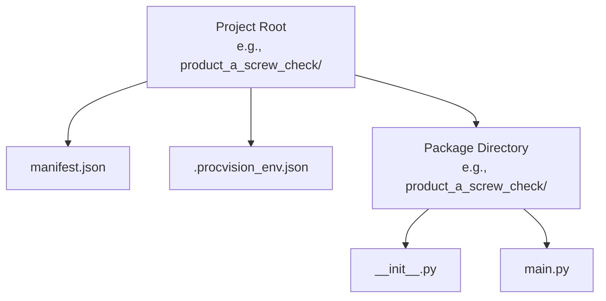
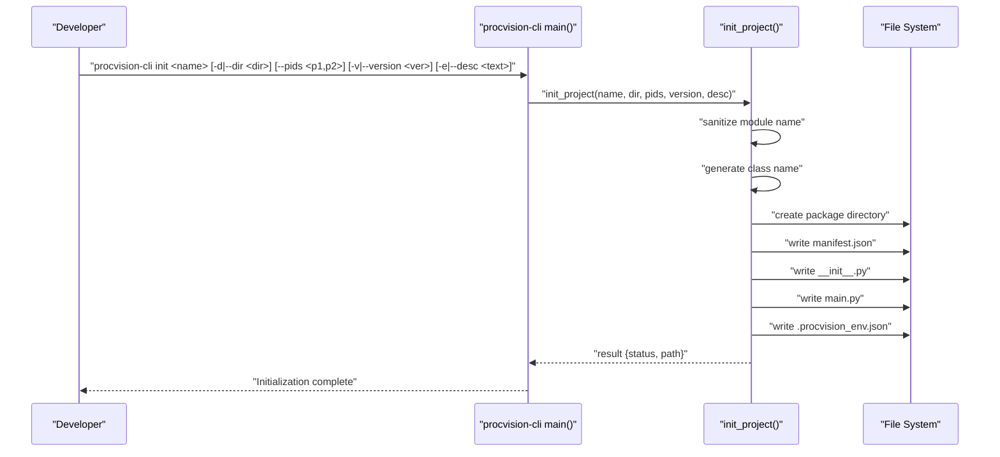
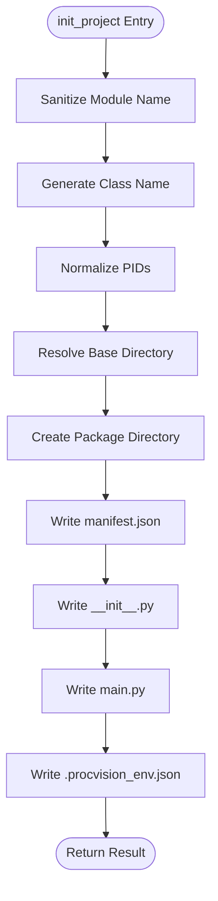
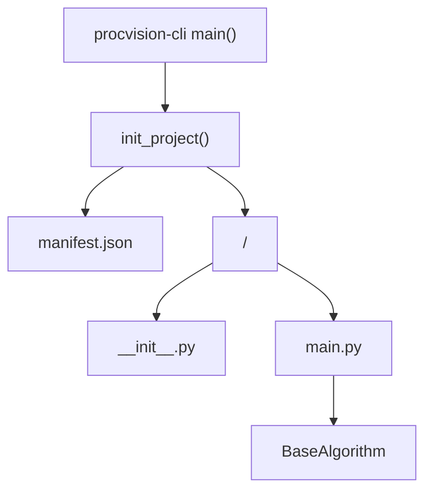

# Init Command

<cite>
**Referenced Files in This Document**
- [cli.py](file://procvision_algorithm_sdk/cli.py)
- [base.py](file://procvision_algorithm_sdk/base.py)
- [README.md](file://README.md)
- [algorithm_dev_quickstart.md](file://algorithm_dev_quickstart.md)
- [algorithm_dev_tutorial.md](file://algorithm_dev_tutorial.md)
- [algorithm-example/manifest.json](file://algorithm-example/manifest.json)
- [algorithm-example/algorithm_example/main.py](file://algorithm-example/algorithm_example/main.py)
- [pyproject.toml](file://pyproject.toml)
</cite>

## Table of Contents
1. [Introduction](#introduction)
2. [Project Structure](#project-structure)
3. [Core Components](#core-components)
4. [Architecture Overview](#architecture-overview)
5. [Detailed Component Analysis](#detailed-component-analysis)
6. [Dependency Analysis](#dependency-analysis)
7. [Performance Considerations](#performance-considerations)
8. [Troubleshooting Guide](#troubleshooting-guide)
9. [Conclusion](#conclusion)
10. [Appendices](#appendices)

## Introduction
This document explains the init command of the Development CLI, which scaffolds a new algorithm project. It covers command syntax, arguments, and their purposes; how the init_project function generates manifest.json, source code structure, and configuration; and how the generated .procvision_env.json enables offline packaging. Practical examples and common issues are included to guide developers through setting up a new algorithm package quickly and correctly.

## Project Structure
The init command creates a minimal algorithm project layout under a target directory. The generated structure includes:
- A project root directory named after the algorithm name
- A manifest.json file at the project root
- A package directory whose name is derived from the sanitized algorithm name
- An entry module main.py inside the package
- An empty __init__.py in the package
- A .procvision_env.json file at the project root for packaging defaults

**Diagram sources**
- [cli.py](file://procvision_algorithm_sdk/cli.py#L344-L463)

**Section sources**
- [cli.py](file://procvision_algorithm_sdk/cli.py#L344-L463)
- [algorithm_dev_quickstart.md](file://algorithm_dev_quickstart.md#L1-L120)

## Core Components
- CLI entry point: The console script procvision-cli maps to the main function in cli.py.
- init command: Implemented by the main function’s argument parsing and the init_project function.
- BaseAlgorithm: The abstract base class that the generated entry class inherits from.

Key responsibilities:
- CLI main parses subcommands and dispatches to validate, run, package, or init.
- init_project performs sanitization, class naming, manifest creation, source generation, and environment cache creation.

**Section sources**
- [pyproject.toml](file://pyproject.toml#L24-L31)
- [cli.py](file://procvision_algorithm_sdk/cli.py#L596-L611)
- [base.py](file://procvision_algorithm_sdk/base.py#L1-L58)

## Architecture Overview
The init command orchestrates file generation and writes configuration for offline packaging. The following sequence diagram shows the end-to-end flow from invoking procvision-cli init to writing the generated files.

**Diagram sources**
- [cli.py](file://procvision_algorithm_sdk/cli.py#L344-L463)
- [cli.py](file://procvision_algorithm_sdk/cli.py#L596-L611)

## Detailed Component Analysis

### Command Syntax and Arguments
- Command: procvision-cli init
- Syntax: procvision-cli init <name> [-d|--dir <dir>] [--pids <p1,p2>] [-v|--version <ver>] [-e|--desc <text>]
- Arguments:
  - name: Algorithm name; used to derive module name and class name; required.
  - -d|--dir: Target directory; defaults to a directory named after the sanitized algorithm name in the current working directory.
  - --pids: Comma-separated list of supported PIDs; defaults to a placeholder if omitted.
  - -v|--version: Algorithm version; defaults to 1.0.0.
  - -e|--desc: Description written into manifest.json; optional.

Purpose:
- name drives module naming and class naming.
- -d controls where the project is scaffolded.
- --pids sets supported product identifiers.
- -v sets the algorithm version.
- -e sets the human-readable description.

Practical examples:
- Minimal: procvision-cli init product_a_screw_check
- With directory and PIDs: procvision-cli init product_a_screw_check -d ./product_a_screw_check --pids A01,A02 -v 1.2.1
- With description: procvision-cli init product_a_screw_check -e "A产品螺丝检测"

Generated file structure:
- project_root/manifest.json
- project_root/<sanitized_module>/__init__.py
- project_root/<sanitized_module>/main.py
- project_root/.procvision_env.json

**Section sources**
- [cli.py](file://procvision_algorithm_sdk/cli.py#L596-L611)
- [algorithm_dev_quickstart.md](file://algorithm_dev_quickstart.md#L1-L120)

### Implementation Details: init_project
The init_project function performs several key tasks:

- Sanitization of module names:
  - Strips whitespace and converts to lowercase.
  - Replaces non-alphanumeric underscores with a single underscore.
  - Removes leading/trailing underscores.
  - Falls back to a default if empty.
  - Reference: [cli.py](file://procvision_algorithm_sdk/cli.py#L246-L256)

- Generation of class names:
  - Splits the original name by non-alphanumeric characters.
  - Capitalizes each part and concatenates.
  - Ensures a non-empty title; otherwise uses a default suffix.
  - Adds a consistent suffix to form the final class name.
  - Reference: [cli.py](file://procvision_algorithm_sdk/cli.py#L258-L266)

- Default manifest content:
  - name: Provided algorithm name.
  - version: Provided version.
  - entry_point: Constructed from sanitized module and generated class name.
  - description: Provided or a default message.
  - supported_pids: Provided or a placeholder.
  - steps: A minimal step schema with a sample parameter.
  - Reference: [cli.py](file://procvision_algorithm_sdk/cli.py#L344-L363)

- Source code generation:
  - Writes package __init__.py exporting the generated class name.
  - Writes main.py containing:
    - A class inheriting from BaseAlgorithm.
    - get_info returning metadata and steps.
    - pre_execute validating PID and image presence, returning debug info.
    - execute performing a simple decision and returning result_status with optional defect_rects.
  - References:
    - [cli.py](file://procvision_algorithm_sdk/cli.py#L365-L442)
    - [base.py](file://procvision_algorithm_sdk/base.py#L1-L58)

- Environment cache (.procvision_env.json):
  - Writes default packaging parameters:
    - python_version, implementation, abi, wheels_platform.
    - auto_freeze enabled.
  - These defaults are used by the package command to download wheels consistently.
  - Reference: [cli.py](file://procvision_algorithm_sdk/cli.py#L444-L463)

- Output:
  - Returns a result dictionary with status and path to the created project root.
  - Reference: [cli.py](file://procvision_algorithm_sdk/cli.py#L465-L467)

**Diagram sources**
- [cli.py](file://procvision_algorithm_sdk/cli.py#L246-L467)
- [base.py](file://procvision_algorithm_sdk/base.py#L1-L58)

**Section sources**
- [cli.py](file://procvision_algorithm_sdk/cli.py#L246-L467)
- [base.py](file://procvision_algorithm_sdk/base.py#L1-L58)

### Generated File Content Overview
- manifest.json:
  - Contains name, version, entry_point, description, supported_pids, and steps.
  - Example structure reference: [algorithm-example/manifest.json](file://algorithm-example/manifest.json#L1-L24)
- package __init__.py:
  - Exports the generated class name.
  - Example reference: [algorithm-example/algorithm_example/__init__.py](file://algorithm-example/algorithm_example/__init__.py#L1-L1)
- main.py:
  - Defines a class inheriting BaseAlgorithm.
  - Implements get_info, pre_execute, and execute with basic logic and comments indicating areas to customize.
  - Example reference: [algorithm-example/algorithm_example/main.py](file://algorithm-example/algorithm_example/main.py#L1-L149)
- .procvision_env.json:
  - Stores packaging defaults for wheels platform, Python version, implementation, ABI, and whether to auto-freeze requirements.
  - Reference: [cli.py](file://procvision_algorithm_sdk/cli.py#L444-L463)

**Section sources**
- [cli.py](file://procvision_algorithm_sdk/cli.py#L344-L463)
- [algorithm-example/manifest.json](file://algorithm-example/manifest.json#L1-L24)
- [algorithm-example/algorithm_example/__init__.py](file://algorithm-example/algorithm_example/__init__.py#L1-L1)
- [algorithm-example/algorithm_example/main.py](file://algorithm-example/algorithm_example/main.py#L1-L149)

### How the Generated .procvision_env.json Facilitates Offline Packaging
- The package command reads .procvision_env.json to determine default packaging parameters if not explicitly provided.
- Defaults include wheels_platform, python_version, implementation, abi, and auto_freeze.
- This ensures consistent offline packaging across environments without manual parameter repetition.
- Reference: [cli.py](file://procvision_algorithm_sdk/cli.py#L242-L326)

**Section sources**
- [cli.py](file://procvision_algorithm_sdk/cli.py#L242-L326)

## Dependency Analysis
The init command relies on the CLI module’s argument parsing and the init_project function. The generated main.py depends on BaseAlgorithm from the SDK.

**Diagram sources**
- [cli.py](file://procvision_algorithm_sdk/cli.py#L596-L611)
- [cli.py](file://procvision_algorithm_sdk/cli.py#L344-L463)
- [base.py](file://procvision_algorithm_sdk/base.py#L1-L58)

**Section sources**
- [cli.py](file://procvision_algorithm_sdk/cli.py#L596-L611)
- [base.py](file://procvision_algorithm_sdk/base.py#L1-L58)

## Performance Considerations
- init_project performs local filesystem operations only; overhead is minimal.
- The generated main.py uses lightweight logic suitable for development iteration.
- Packaging defaults in .procvision_env.json streamline wheel downloads during package; ensure correct platform and Python version to avoid repeated downloads.

[No sources needed since this section provides general guidance]

## Troubleshooting Guide
Common issues and resolutions:

- Invalid algorithm name:
  - The module name is sanitized to be lowercase and underscore-only; avoid special characters that would be stripped.
  - If the sanitized module name becomes empty, a fallback is used.
  - References: [cli.py](file://procvision_algorithm_sdk/cli.py#L246-L256)

- Directory permissions:
  - Ensure the target directory (-d) exists and is writable; init_project creates the package directory but requires write permission to the parent.
  - Reference: [cli.py](file://procvision_algorithm_sdk/cli.py#L344-L363)

- PID configuration:
  - If --pids is omitted, a placeholder is used; update supported_pids in manifest.json and the entry class’s get_info to match.
  - References:
    - [cli.py](file://procvision_algorithm_sdk/cli.py#L344-L363)
    - [algorithm-example/manifest.json](file://algorithm-example/manifest.json#L1-L24)
    - [algorithm-example/algorithm_example/main.py](file://algorithm-example/algorithm_example/main.py#L1-L149)

- Entry point mismatch:
  - The entry_point in manifest.json must match the generated class name and module path.
  - Reference: [cli.py](file://procvision_algorithm_sdk/cli.py#L344-L363)

- Version and description:
  - -v sets manifest version; -e sets description. Ensure both align with your project’s metadata.
  - Reference: [cli.py](file://procvision_algorithm_sdk/cli.py#L344-L363)

- Packaging defaults not applied:
  - Verify .procvision_env.json exists and contains expected keys; otherwise, package will use defaults or prompt for requirements.
  - Reference: [cli.py](file://procvision_algorithm_sdk/cli.py#L242-L326)

**Section sources**
- [cli.py](file://procvision_algorithm_sdk/cli.py#L246-L363)
- [cli.py](file://procvision_algorithm_sdk/cli.py#L242-L326)
- [algorithm-example/manifest.json](file://algorithm-example/manifest.json#L1-L24)
- [algorithm-example/algorithm_example/main.py](file://algorithm-example/algorithm_example/main.py#L1-L149)

## Conclusion
The init command streamlines algorithm project setup by generating a complete skeleton with manifest.json, a package directory, and a ready-to-edit entry module. It also writes .procvision_env.json to simplify offline packaging. By following the command syntax and updating the generated files as indicated, developers can quickly bootstrap a compliant algorithm package aligned with the SDK’s interface and packaging expectations.

[No sources needed since this section summarizes without analyzing specific files]

## Appendices

### Appendix A: Command Reference
- procvision-cli init <name> [-d|--dir <dir>] [--pids <p1,p2>] [-v|--version <ver>] [-e|--desc <text>]
- Purpose: Initialize a new algorithm project with manifest.json, package directory, main.py, and .procvision_env.json.
- Notes: After initialization, edit main.py comments and ensure manifest.json and get_info remain consistent.

**Section sources**
- [cli.py](file://procvision_algorithm_sdk/cli.py#L596-L611)
- [algorithm_dev_quickstart.md](file://algorithm_dev_quickstart.md#L1-L120)

### Appendix B: Example Usage
- Minimal: procvision-cli init product_a_screw_check
- With directory and PIDs: procvision-cli init product_a_screw_check -d ./product_a_screw_check --pids A01,A02 -v 1.2.1
- With description: procvision-cli init product_a_screw_check -e "A产品螺丝检测"

**Section sources**
- [algorithm_dev_quickstart.md](file://algorithm_dev_quickstart.md#L1-L120)