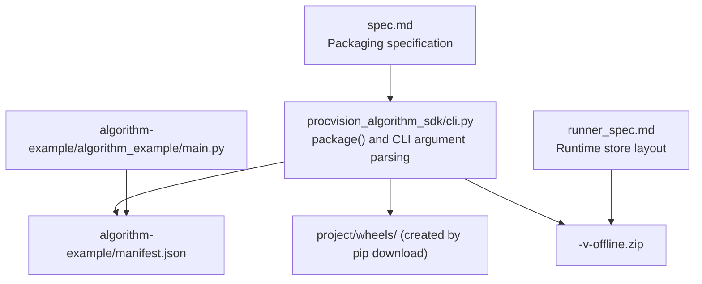
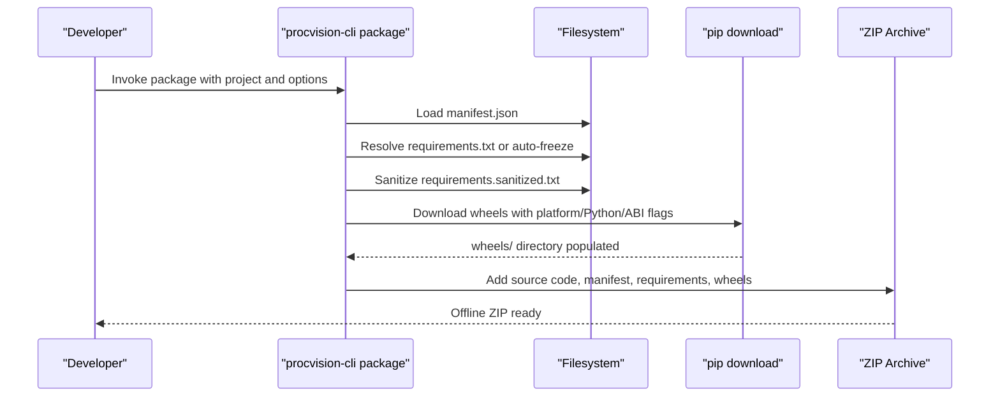
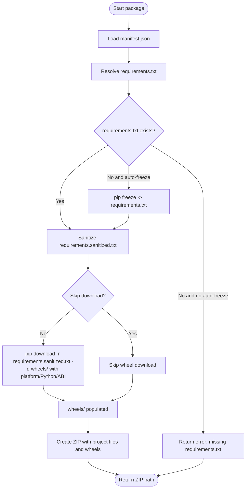
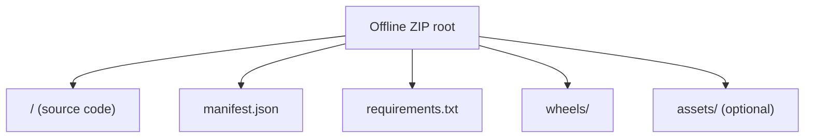
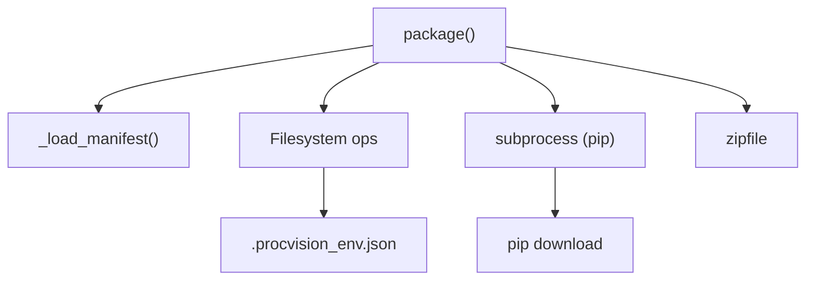

# Package Command

<cite>
**Referenced Files in This Document**
- [cli.py](file://procvision_algorithm_sdk/cli.py)
- [README.md](file://README.md)
- [algorithm_dev_quickstart.md](file://algorithm_dev_quickstart.md)
- [spec.md](file://spec.md)
- [runner_spec.md](file://runner_spec.md)
- [algorithm-example/manifest.json](file://algorithm-example/manifest.json)
- [algorithm-example/algorithm_example/main.py](file://algorithm-example/algorithm_example/main.py)
- [pyproject.toml](file://pyproject.toml)
</cite>

## Table of Contents
1. [Introduction](#introduction)
2. [Project Structure](#project-structure)
3. [Core Components](#core-components)
4. [Architecture Overview](#architecture-overview)
5. [Detailed Component Analysis](#detailed-component-analysis)
6. [Dependency Analysis](#dependency-analysis)
7. [Performance Considerations](#performance-considerations)
8. [Troubleshooting Guide](#troubleshooting-guide)
9. [Conclusion](#conclusion)
10. [Appendices](#appendices)

## Introduction
This document explains the Development CLI package command for creating offline deployment packages for algorithm distribution. It covers command syntax, arguments, the packaging workflow (requirements handling, dependency freezing, wheel downloading, ZIP creation), the role of the .procvision_env.json configuration file, output ZIP structure, usage examples, and best practices to ensure successful offline deployment.

## Project Structure
The package command is implemented in the CLI module and integrates with the SDK’s manifest and packaging specifications. The algorithm example demonstrates a minimal project layout suitable for packaging.

**Diagram sources**
- [cli.py](file://procvision_algorithm_sdk/cli.py#L228-L326)
- [spec.md](file://spec.md#L1980-L2026)
- [runner_spec.md](file://runner_spec.md#L204-L252)
- [algorithm-example/manifest.json](file://algorithm-example/manifest.json#L1-L24)
- [algorithm-example/algorithm_example/main.py](file://algorithm-example/algorithm_example/main.py#L1-L149)

**Section sources**
- [cli.py](file://procvision_algorithm_sdk/cli.py#L515-L529)
- [algorithm-example/manifest.json](file://algorithm-example/manifest.json#L1-L24)
- [spec.md](file://spec.md#L1980-L2026)

## Core Components
- CLI package subcommand: Parses arguments and orchestrates packaging.
- Requirements handling: Validates or auto-generates requirements.txt; sanitizes hashes and markers.
- Wheel downloading: Uses pip download with platform, Python version, implementation, and ABI options.
- ZIP creation: Archives source code, manifest, requirements, wheels, and optional assets.

Key implementation references:
- [package()](file://procvision_algorithm_sdk/cli.py#L228-L326)
- [Argument parser for package](file://procvision_algorithm_sdk/cli.py#L515-L529)

**Section sources**
- [cli.py](file://procvision_algorithm_sdk/cli.py#L228-L326)
- [cli.py](file://procvision_algorithm_sdk/cli.py#L515-L529)

## Architecture Overview
The package command follows a deterministic workflow: load manifest, resolve requirements, sanitize and optionally auto-generate requirements, download wheels with platform-specific constraints, and create a ZIP archive containing source code, manifest, requirements, and wheels.

**Diagram sources**
- [cli.py](file://procvision_algorithm_sdk/cli.py#L228-L326)
- [spec.md](file://spec.md#L1980-L2026)

## Detailed Component Analysis

### Command Syntax and Arguments
- Command: procvision-cli package
- Positional argument:
  - project: Algorithm project root directory (required)
- Options:
  - -o, --output: Output ZIP path (optional; defaults to <name>-v<version>-offline.zip)
  - -r, --requirements: requirements.txt path (optional; defaults to project requirements.txt or auto-generated)
  - -a, --auto-freeze: Auto-generate requirements.txt via pip freeze when missing (default enabled)
  - -w, --wheels-platform: Target platform (e.g., win_amd64) (optional; defaults to cached value or win_amd64)
  - -p, --python-version: Target Python version (e.g., 3.10) (optional; defaults to cached value or 3.10)
  - -i, --implementation: Python implementation (e.g., cp) (optional; defaults to cached value or cp)
  - -b, --abi: ABI (e.g., cp310) (optional; defaults to cached value or cp310)
  - -s, --skip-download: Skip wheel download; only package existing content (optional)

References:
- [Argument parser definition](file://procvision_algorithm_sdk/cli.py#L515-L529)

**Section sources**
- [cli.py](file://procvision_algorithm_sdk/cli.py#L515-L529)

### Packaging Workflow
1) Requirements handling
- If requirements.txt does not exist:
  - If --auto-freeze is enabled, generate requirements.txt via pip freeze.
  - Otherwise, return an error indicating missing requirements.txt.
- Sanitize requirements.sanitized.txt by removing hash markers and extra pip options, then use the sanitized file for subsequent steps.

References:
- [Requirements resolution and sanitization](file://procvision_algorithm_sdk/cli.py#L228-L298)

2) Dependency freezing
- When --auto-freeze is used, the command executes pip freeze in the current Python environment and writes the generated requirements.txt.

Reference:
- [Auto-freeze behavior](file://procvision_algorithm_sdk/cli.py#L228-L262)

3) Wheel downloading with platform-specific configuration
- Create wheels/ directory under the project.
- If --skip-download is not set:
  - Read .procvision_env.json if present to populate defaults for wheels-platform, python-version, implementation, and abi.
  - Construct pip download command with -r requirements.sanitized.txt, -d wheels/, and platform/Python/implementation/ABI flags.
  - Enforce --only-binary=:all: to ensure only wheels are downloaded.
  - On failure, return error with hints if “No matching distribution found” appears in output.

References:
- [Wheel download and configuration](file://procvision_algorithm_sdk/cli.py#L259-L298)
- [.procvision_env.json usage](file://procvision_algorithm_sdk/cli.py#L259-L298)

4) ZIP archive creation
- Walk the project directory and add all files except .venv and wheels to the archive under a top-level folder named after the project.
- Add all wheel files from wheels/ to the archive at the root level.
- Return the absolute path to the created ZIP.

References:
- [ZIP creation](file://procvision_algorithm_sdk/cli.py#L297-L326)

**Diagram sources**
- [cli.py](file://procvision_algorithm_sdk/cli.py#L228-L326)

**Section sources**
- [cli.py](file://procvision_algorithm_sdk/cli.py#L228-L326)

### .procvision_env.json Configuration
- Purpose: Stores target environment settings to streamline repeated packaging.
- Fields commonly used:
  - python_version
  - implementation
  - abi
  - wheels_platform
  - auto_freeze
- Behavior: The package command reads .procvision_env.json from the project root if present and uses its values as defaults for wheels-platform, python-version, implementation, and abi.

References:
- [Default environment loading](file://procvision_algorithm_sdk/cli.py#L259-L298)
- [Initialization of .procvision_env.json](file://procvision_algorithm_sdk/cli.py#L327-L366)

**Section sources**
- [cli.py](file://procvision_algorithm_sdk/cli.py#L259-L298)
- [cli.py](file://procvision_algorithm_sdk/cli.py#L327-L366)

### Output ZIP Structure
The offline ZIP must include:
- Source code directory (same as the project root)
- manifest.json
- requirements.txt (or requirements.sanitized.txt)
- wheels/ directory containing all wheel files
- Optional assets/ directory (as needed)

References:
- [Packaging specification](file://spec.md#L1980-L2026)
- [Runner runtime store layout](file://runner_spec.md#L204-L252)

**Diagram sources**
- [spec.md](file://spec.md#L1980-L2026)
- [runner_spec.md](file://runner_spec.md#L204-L252)

**Section sources**
- [spec.md](file://spec.md#L1980-L2026)
- [runner_spec.md](file://runner_spec.md#L204-L252)

### Examples for Different Deployment Scenarios
- Minimal packaging (defaults inferred from .procvision_env.json):
  - procvision-cli package ./my-algorithm-project
- Explicit platform and Python configuration:
  - procvision-cli package ./my-algorithm-project --wheels-platform win_amd64 --python-version 3.10 --implementation cp --abi cp310
- Custom output path:
  - procvision-cli package ./my-algorithm-project --output ./dist/my-algo-offline.zip
- Skip wheel download (existing wheels only):
  - procvision-cli package ./my-algorithm-project --skip-download
- Provide a custom requirements.txt:
  - procvision-cli package ./my-algorithm-project --requirements ./custom-req.txt

References:
- [Quickstart examples and defaults](file://algorithm_dev_quickstart.md#L239-L260)
- [Specification examples](file://spec.md#L1980-L2026)

**Section sources**
- [algorithm_dev_quickstart.md](file://algorithm_dev_quickstart.md#L239-L260)
- [spec.md](file://spec.md#L1980-L2026)

## Dependency Analysis
- Internal dependencies:
  - package() depends on _load_manifest(), filesystem operations, subprocess for pip, and zipfile for archive creation.
- External dependencies:
  - pip download for resolving and fetching wheels.
  - Python interpreter for running pip and freezing dependencies.
- Environment configuration:
  - .procvision_env.json influences platform, Python version, implementation, and ABI defaults.

**Diagram sources**
- [cli.py](file://procvision_algorithm_sdk/cli.py#L228-L326)

**Section sources**
- [cli.py](file://procvision_algorithm_sdk/cli.py#L228-L326)

## Performance Considerations
- Prefer using --skip-download when wheels are already present to avoid network overhead.
- Ensure requirements.txt is locked to exact versions to minimize download variability.
- Limit included assets to only what is necessary to reduce ZIP size.
- Use appropriate platform/Python/ABI flags to match target environments and avoid unnecessary retries.

[No sources needed since this section provides general guidance]

## Troubleshooting Guide
Common issues and resolutions:
- Missing requirements.txt:
  - Enable --auto-freeze to generate requirements.txt automatically.
  - Alternatively, provide --requirements pointing to a valid file.
  - Reference: [Requirements resolution](file://procvision_algorithm_sdk/cli.py#L228-L262)
- Platform compatibility problems:
  - Ensure --wheels-platform, --python-version, --implementation, and --abi match the target environment.
  - If “No matching distribution found” occurs, adjust versions or use a compatible environment to generate requirements.txt.
  - Reference: [Wheel download error handling](file://procvision_algorithm_sdk/cli.py#L259-L298)
- Network issues during wheel download:
  - Retry with --skip-download if wheels are already available locally.
  - Verify connectivity and proxy settings; consider caching wheels locally.
  - Reference: [Wheel download and error handling](file://procvision_algorithm_sdk/cli.py#L259-L298)
- ZIP structure validation failures:
  - Confirm that manifest.json, requirements.txt, and wheels/ are present in the final ZIP.
  - Reference: [Runner store validation expectations](file://runner_spec.md#L204-L252)

**Section sources**
- [cli.py](file://procvision_algorithm_sdk/cli.py#L228-L298)
- [runner_spec.md](file://runner_spec.md#L204-L252)

## Conclusion
The package command streamlines offline algorithm distribution by validating and preparing a portable ZIP that includes source code, manifest, requirements, and wheels. By leveraging .procvision_env.json defaults and strict platform/ABI constraints, teams can reliably reproduce builds across environments. Following the examples and best practices outlined here ensures consistent, repeatable offline deployments.

[No sources needed since this section summarizes without analyzing specific files]

## Appendices

### Appendix A: Manifest and Example Algorithm
- The manifest defines the algorithm identity, entry point, supported PIDs, and steps.
- The example algorithm illustrates the structure and lifecycle hooks used during packaging and runtime.

References:
- [algorithm-example/manifest.json](file://algorithm-example/manifest.json#L1-L24)
- [algorithm-example/algorithm_example/main.py](file://algorithm-example/algorithm_example/main.py#L1-L149)

**Section sources**
- [algorithm-example/manifest.json](file://algorithm-example/manifest.json#L1-L24)
- [algorithm-example/algorithm_example/main.py](file://algorithm-example/algorithm_example/main.py#L1-L149)

### Appendix B: CLI Entrypoint and Scripts
- The CLI is exposed via a console script entry point configured in pyproject.toml.

Reference:
- [Console script configuration](file://pyproject.toml#L25-L35)

**Section sources**
- [pyproject.toml](file://pyproject.toml#L25-L35)