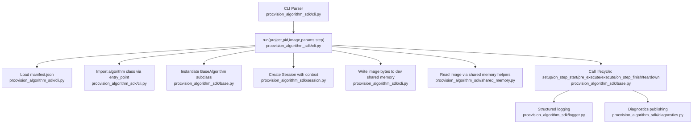
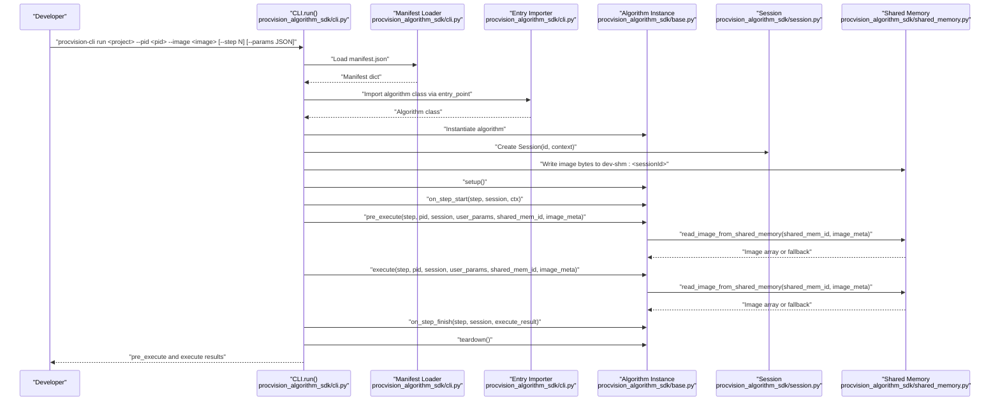
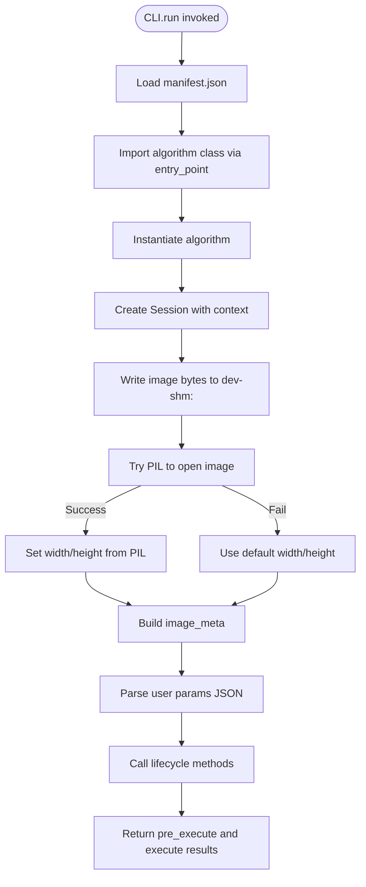
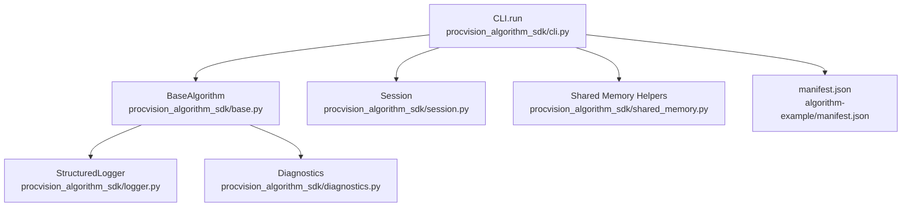

# Run Command

<cite>
**Referenced Files in This Document**
- [cli.py](file://procvision_algorithm_sdk/cli.py)
- [base.py](file://procvision_algorithm_sdk/base.py)
- [session.py](file://procvision_algorithm_sdk/session.py)
- [shared_memory.py](file://procvision_algorithm_sdk/shared_memory.py)
- [logger.py](file://procvision_algorithm_sdk/logger.py)
- [diagnostics.py](file://procvision_algorithm_sdk/diagnostics.py)
- [manifest.json](file://algorithm-example/manifest.json)
- [main.py](file://algorithm-example/algorithm_example/main.py)
- [README.md](file://README.md)
</cite>

## Table of Contents
1. [Introduction](#introduction)
2. [Project Structure](#project-structure)
3. [Core Components](#core-components)
4. [Architecture Overview](#architecture-overview)
5. [Detailed Component Analysis](#detailed-component-analysis)
6. [Dependency Analysis](#dependency-analysis)
7. [Performance Considerations](#performance-considerations)
8. [Troubleshooting Guide](#troubleshooting-guide)
9. [Conclusion](#conclusion)
10. [Appendices](#appendices)

## Introduction
This document explains the run command of the Development CLI, which enables local simulation of algorithm execution using real image data. It documents the command syntax, required and optional arguments, the end-to-end execution flow, and how the development environment is set up to mimic production behavior. It also covers image metadata extraction, output interpretation, and common issues developers encounter during local testing.

## Project Structure
The run command orchestrates several modules:
- CLI entrypoint parses arguments and invokes the run workflow
- BaseAlgorithm defines the algorithm lifecycle contract
- Session manages runtime context and state
- Shared memory simulates production image transport
- Logger and Diagnostics provide structured logging and diagnostic metrics

**Diagram sources**
- [cli.py](file://procvision_algorithm_sdk/cli.py#L461-L584)
- [base.py](file://procvision_algorithm_sdk/base.py#L1-L58)
- [session.py](file://procvision_algorithm_sdk/session.py#L1-L36)
- [shared_memory.py](file://procvision_algorithm_sdk/shared_memory.py#L1-L53)
- [logger.py](file://procvision_algorithm_sdk/logger.py#L1-L24)
- [diagnostics.py](file://procvision_algorithm_sdk/diagnostics.py#L1-L12)

**Section sources**
- [cli.py](file://procvision_algorithm_sdk/cli.py#L461-L584)
- [README.md](file://README.md#L1-L116)

## Core Components
- CLI run subcommand: validates inputs, loads manifest, imports algorithm class, creates a session, writes the image to simulated shared memory, and executes the algorithm lifecycle.
- BaseAlgorithm: defines the lifecycle hooks and required methods that the run command expects.
- Session: holds runtime context and state for the algorithm’s execution.
- Shared memory: provides a development-only mechanism to simulate image transport between the host and the algorithm.
- Logger and Diagnostics: provide structured logging and diagnostic metrics used by algorithms.

**Section sources**
- [cli.py](file://procvision_algorithm_sdk/cli.py#L494-L513)
- [base.py](file://procvision_algorithm_sdk/base.py#L1-L58)
- [session.py](file://procvision_algorithm_sdk/session.py#L1-L36)
- [shared_memory.py](file://procvision_algorithm_sdk/shared_memory.py#L1-L53)
- [logger.py](file://procvision_algorithm_sdk/logger.py#L1-L24)
- [diagnostics.py](file://procvision_algorithm_sdk/diagnostics.py#L1-L12)

## Architecture Overview
The run command follows a deterministic flow that closely mirrors production behavior while using local resources for images and a development-only shared memory store.

**Diagram sources**
- [cli.py](file://procvision_algorithm_sdk/cli.py#L558-L584)
- [cli.py](file://procvision_algorithm_sdk/cli.py#L1-L120)
- [base.py](file://procvision_algorithm_sdk/base.py#L1-L58)
- [session.py](file://procvision_algorithm_sdk/session.py#L1-L36)
- [shared_memory.py](file://procvision_algorithm_sdk/shared_memory.py#L1-L53)

## Detailed Component Analysis

### Command Syntax and Arguments
- Command: run
- Positional argument:
  - project: Path to the algorithm project directory containing manifest.json and source code.
- Required named arguments:
  - --pid: Product identifier; must match one of the supported_pids declared in manifest.json.
  - --image: Local path to a JPEG or PNG image file; the image bytes are written to simulated shared memory.
- Optional named arguments:
  - --step: Integer step index; defaults to 1. Used to select the appropriate step in the algorithm’s lifecycle.
  - --params: JSON string representing user-defined parameters passed to pre_execute and execute.
  - --json: Output raw JSON instead of human-readable format.

Validation performed by the CLI:
- Ensures project directory exists.
- Ensures manifest.json exists under the project path.
- Ensures the image file exists.
- Validates that --params is valid JSON if provided.

Exit behavior:
- Exits with success if execute.status equals "OK"; otherwise exits with failure.

**Section sources**
- [cli.py](file://procvision_algorithm_sdk/cli.py#L494-L513)
- [cli.py](file://procvision_algorithm_sdk/cli.py#L558-L584)

### Execution Flow
The run command performs the following steps:

1. Load manifest.json from the project directory.
2. Import the algorithm class using the entry_point defined in manifest.json.
3. Instantiate the algorithm class.
4. Create a Session with a generated id and a context containing product_code, operator, and trace_id.
5. Write the image bytes to a development shared memory id of the form dev-shm:<sessionId>.
6. Extract image metadata:
   - Attempt to open the image with PIL to determine width and height.
   - If PIL fails, fall back to default width and height.
   - Construct image_meta with width, height, timestamp_ms, and camera_id.
7. Parse user parameters from --params if provided; otherwise use an empty dict.
8. Call lifecycle methods in order:
   - setup()
   - on_step_start(step_index, session, context)
   - pre_execute(step_index, pid, session, user_params, shared_mem_id, image_meta)
   - execute(step_index, pid, session, user_params, shared_mem_id, image_meta)
   - on_step_finish(step_index, session, execute_result)
   - teardown()
9. Return a dictionary containing pre_execute and execute results.

**Diagram sources**
- [cli.py](file://procvision_algorithm_sdk/cli.py#L1-L120)
- [cli.py](file://procvision_algorithm_sdk/cli.py#L558-L584)
- [shared_memory.py](file://procvision_algorithm_sdk/shared_memory.py#L1-L53)

**Section sources**
- [cli.py](file://procvision_algorithm_sdk/cli.py#L1-L120)
- [cli.py](file://procvision_algorithm_sdk/cli.py#L558-L584)

### Algorithm Lifecycle Methods Called
- setup(): Called once before any step.
- on_step_start(step_index, session, context): Called before pre_execute and execute for the selected step.
- pre_execute(step_index, pid, session, user_params, shared_mem_id, image_meta): Validates inputs and prepares for execution; may return calibration or debug data.
- execute(step_index, pid, session, user_params, shared_mem_id, image_meta): Performs detection/inference and returns result_status and optional defect_rects/ng_reason.
- on_step_finish(step_index, session, result): Called after execution completes.
- teardown(): Called once after execution finishes.

The example algorithm demonstrates typical usage of read_image_from_shared_memory and structured logging/diagnostics.

**Section sources**
- [base.py](file://procvision_algorithm_sdk/base.py#L1-L58)
- [main.py](file://algorithm-example/algorithm_example/main.py#L1-L150)
- [logger.py](file://procvision_algorithm_sdk/logger.py#L1-L24)
- [diagnostics.py](file://procvision_algorithm_sdk/diagnostics.py#L1-L12)

### Simulated Shared Memory Behavior
- The CLI writes the raw image bytes to a development-only shared memory store keyed by dev-shm:<sessionId>.
- The algorithm reads the image via read_image_from_shared_memory, which:
  - Uses image_meta.width and image_meta.height to construct a fallback array if needed.
  - Accepts either raw bytes or a NumPy array.
  - Normalizes color channels and orientation when applicable.
  - Returns a uint8 RGB array suitable for inference.

This design ensures the algorithm receives a realistic image representation locally.

**Section sources**
- [cli.py](file://procvision_algorithm_sdk/cli.py#L1-L120)
- [shared_memory.py](file://procvision_algorithm_sdk/shared_memory.py#L1-L53)

### Image Metadata Extraction and Passing
- Width and height are determined by attempting to open the image with PIL; if that fails, defaults are used.
- image_meta includes width, height, timestamp_ms, and camera_id.
- The algorithm receives image_meta and can use it to validate dimensions or derive additional context.

**Section sources**
- [cli.py](file://procvision_algorithm_sdk/cli.py#L1-L120)
- [README.md](file://README.md#L1-L116)

### Output Format and Interpretation
- By default, the CLI prints a human-readable summary:
  - Pre-execute: status and message
  - Execute: status, result_status, and optionally ng_reason and defect_rects count
- When --json is provided, the CLI prints a JSON object containing:
  - pre_execute: the pre_execute result dictionary
  - execute: the execute result dictionary

Interpretation guidelines:
- pre_execute.status should be "OK" to indicate readiness; if "ERROR", inspect message and error_code.
- execute.status should be "OK" for successful execution; if "ERROR", inspect message and error_code.
- result_status in execute.data indicates OK or NG; NG often includes ng_reason and defect_rects.

**Section sources**
- [cli.py](file://procvision_algorithm_sdk/cli.py#L1-L120)
- [cli.py](file://procvision_algorithm_sdk/cli.py#L558-L584)

### Example Usage Scenarios
- Basic run with defaults:
  - procvision-cli run ./algorithm-example --pid p001 --image ./test.jpg
- With step index:
  - procvision-cli run ./algorithm-example --pid p001 --image ./test.jpg --step 2
- With user parameters:
  - procvision-cli run ./algorithm-example --pid p001 --image ./test.jpg --params '{"threshold":0.8}'
- With JSON output:
  - procvision-cli run ./algorithm-example --pid p001 --image ./test.jpg --json

Notes:
- The --pid must be present in manifest.json.supported_pids.
- The image must be readable by PIL (JPEG/PNG recommended).

**Section sources**
- [cli.py](file://procvision_algorithm_sdk/cli.py#L494-L513)
- [manifest.json](file://algorithm-example/manifest.json#L1-L25)
- [README.md](file://README.md#L1-L116)

## Dependency Analysis
The run command depends on the following relationships:

**Diagram sources**
- [cli.py](file://procvision_algorithm_sdk/cli.py#L1-L120)
- [base.py](file://procvision_algorithm_sdk/base.py#L1-L58)
- [session.py](file://procvision_algorithm_sdk/session.py#L1-L36)
- [shared_memory.py](file://procvision_algorithm_sdk/shared_memory.py#L1-L53)
- [logger.py](file://procvision_algorithm_sdk/logger.py#L1-L24)
- [diagnostics.py](file://procvision_algorithm_sdk/diagnostics.py#L1-L12)
- [manifest.json](file://algorithm-example/manifest.json#L1-L25)

**Section sources**
- [cli.py](file://procvision_algorithm_sdk/cli.py#L1-L120)
- [base.py](file://procvision_algorithm_sdk/base.py#L1-L58)
- [session.py](file://procvision_algorithm_sdk/session.py#L1-L36)
- [shared_memory.py](file://procvision_algorithm_sdk/shared_memory.py#L1-L53)
- [logger.py](file://procvision_algorithm_sdk/logger.py#L1-L24)
- [diagnostics.py](file://procvision_algorithm_sdk/diagnostics.py#L1-L12)
- [manifest.json](file://algorithm-example/manifest.json#L1-L25)

## Performance Considerations
- Image decoding occurs via PIL; ensure images are reasonably sized to avoid long decode times.
- The development shared memory is an in-memory store; very large images may increase memory usage.
- The algorithm’s pre_execute and execute methods should avoid heavy computation during local runs to keep feedback fast.

[No sources needed since this section provides general guidance]

## Troubleshooting Guide
Common issues and resolutions:

- Missing manifest.json:
  - Symptom: CLI reports manifest.json not found.
  - Resolution: Ensure the project directory contains manifest.json at the root.
  - Reference: [cli.py](file://procvision_algorithm_sdk/cli.py#L558-L584)

- Unsupported --pid:
  - Symptom: pre_execute returns ERROR with message indicating unsupported product code.
  - Resolution: Verify that --pid is included in manifest.json.supported_pids.
  - Reference: [manifest.json](file://algorithm-example/manifest.json#L1-L25), [main.py](file://algorithm-example/algorithm_example/main.py#L1-L150)

- Image format compatibility:
  - Symptom: execute returns ERROR with message indicating empty image data.
  - Cause: The image cannot be opened by PIL or dimensions are invalid.
  - Resolution: Use JPEG or PNG; confirm width/height are positive integers.
  - Reference: [cli.py](file://procvision_algorithm_sdk/cli.py#L1-L120), [shared_memory.py](file://procvision_algorithm_sdk/shared_memory.py#L1-L53)

- Parameter parsing errors (--params):
  - Symptom: CLI reports that --params must be a JSON string.
  - Resolution: Provide a valid JSON string; ensure keys and values are properly quoted.
  - Reference: [cli.py](file://procvision_algorithm_sdk/cli.py#L558-L584)

- Exit code behavior:
  - Symptom: CLI exits with failure even though results appear correct.
  - Cause: execute.status is not "OK".
  - Resolution: Inspect execute.status and data.result_status; fix algorithm logic or parameters.
  - Reference: [cli.py](file://procvision_algorithm_sdk/cli.py#L558-L584)

**Section sources**
- [cli.py](file://procvision_algorithm_sdk/cli.py#L558-L584)
- [shared_memory.py](file://procvision_algorithm_sdk/shared_memory.py#L1-L53)
- [manifest.json](file://algorithm-example/manifest.json#L1-L25)
- [main.py](file://algorithm-example/algorithm_example/main.py#L1-L150)

## Conclusion
The run command provides a streamlined way to locally simulate algorithm execution against real images. It loads the manifest, imports the algorithm class, sets up a session, writes the image to simulated shared memory, and invokes the lifecycle methods. By validating inputs and returning structured results, it helps developers quickly iterate and debug their algorithms before deployment.

[No sources needed since this section summarizes without analyzing specific files]

## Appendices

### API Contract Summary for Run
- pre_execute(step_index, pid, session, user_params, shared_mem_id, image_meta) -> Dict
- execute(step_index, pid, session, user_params, shared_mem_id, image_meta) -> Dict
- Supported image_meta fields: width, height, timestamp_ms, camera_id
- Supported image formats: JPEG, PNG (via PIL)

**Section sources**
- [README.md](file://README.md#L1-L116)
- [shared_memory.py](file://procvision_algorithm_sdk/shared_memory.py#L1-L53)