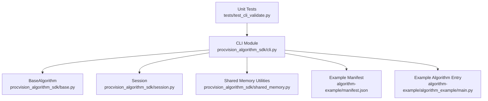
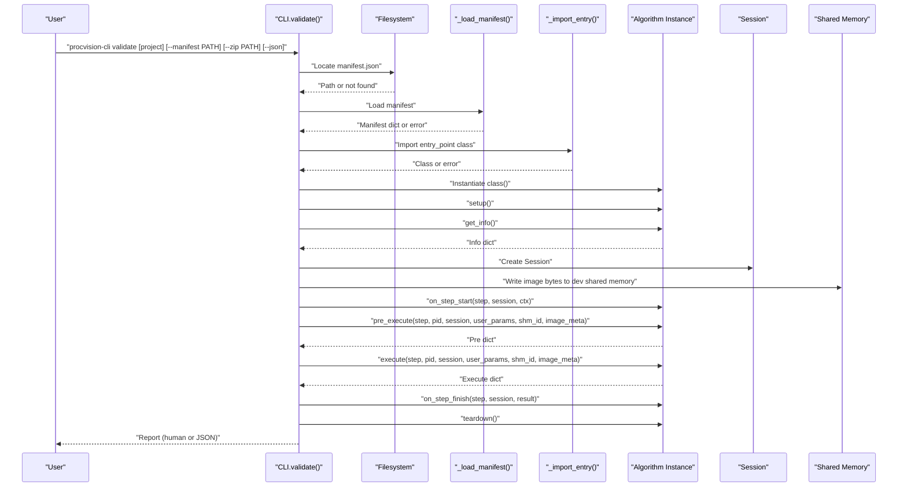
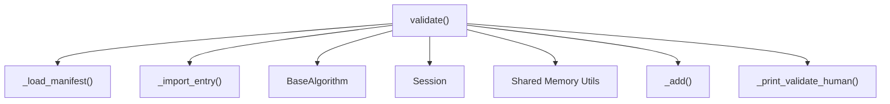

# Validate Command

<cite>
**Referenced Files in This Document**
- [cli.py](file://procvision_algorithm_sdk/cli.py)
- [base.py](file://procvision_algorithm_sdk/base.py)
- [session.py](file://procvision_algorithm_sdk/session.py)
- [shared_memory.py](file://procvision_algorithm_sdk/shared_memory.py)
- [manifest.json](file://algorithm-example/manifest.json)
- [main.py](file://algorithm-example/algorithm_example/main.py)
- [test_cli_validate.py](file://tests/test_cli_validate.py)
- [README.md](file://README.md)
- [spec.md](file://spec.md)
- [runner_spec.md](file://runner_spec.md)
</cite>

## Table of Contents
1. [Introduction](#introduction)
2. [Project Structure](#project-structure)
3. [Core Components](#core-components)
4. [Architecture Overview](#architecture-overview)
5. [Detailed Component Analysis](#detailed-component-analysis)
6. [Dependency Analysis](#dependency-analysis)
7. [Performance Considerations](#performance-considerations)
8. [Troubleshooting Guide](#troubleshooting-guide)
9. [Conclusion](#conclusion)
10. [Appendices](#appendices)

## Introduction
This document explains the validate command of the Development CLI. Its primary purpose is to verify algorithm package structure and implementation correctness before deployment. The validate command checks:
- Manifest existence and parsing
- Required fields presence
- Entry point import and inheritance from the base algorithm interface
- get_info method signature and supported_pids consistency
- Lifecycle method smoke testing (setup, on_step_start, pre_execute, execute, on_step_finish, teardown)
- Pre-execute and execute return schemas
- Optional offline zip structure verification (manifest, requirements, wheels)

It simulates a minimal runtime environment by constructing a Session and image metadata, invoking lifecycle hooks, and validating return structures against the specification.

## Project Structure
The validate command is implemented in the CLI module and integrates with the SDK base classes and shared memory utilities. Example algorithm and manifest are provided under the example directory.

**Diagram sources**
- [cli.py](file://procvision_algorithm_sdk/cli.py#L36-L145)
- [base.py](file://procvision_algorithm_sdk/base.py#L1-L58)
- [session.py](file://procvision_algorithm_sdk/session.py#L1-L36)
- [shared_memory.py](file://procvision_algorithm_sdk/shared_memory.py#L1-L53)
- [manifest.json](file://algorithm-example/manifest.json#L1-L24)
- [main.py](file://algorithm-example/algorithm_example/main.py#L1-L150)
- [test_cli_validate.py](file://tests/test_cli_validate.py#L1-L11)

**Section sources**
- [cli.py](file://procvision_algorithm_sdk/cli.py#L36-L145)
- [README.md](file://README.md#L1-L116)

## Core Components
- validate(project, manifest, zip_path): Orchestrates the validation pipeline and returns a structured report.
- _load_manifest(path): Loads and parses manifest.json.
- _import_entry(entry_point, sys_path): Imports the algorithm class from the entry_point string.
- _add(checks, name, ok, message): Adds a check result to the report.
- Human-readable printer for validation reports.

Key behaviors:
- Determines manifest path from either --project or --manifest.
- Validates required manifest fields.
- Imports the entry_point class and ensures it inherits from BaseAlgorithm.
- Instantiates the algorithm and runs lifecycle smoke tests.
- Validates supported_pids consistency between manifest and get_info.
- Validates pre_execute and execute return schemas.
- Optionally validates offline zip structure.

**Section sources**
- [cli.py](file://procvision_algorithm_sdk/cli.py#L36-L145)
- [cli.py](file://procvision_algorithm_sdk/cli.py#L147-L161)

## Architecture Overview
The validate command constructs a minimal runtime simulation to exercise the algorithm’s lifecycle and return schemas.

**Diagram sources**
- [cli.py](file://procvision_algorithm_sdk/cli.py#L36-L145)
- [cli.py](file://procvision_algorithm_sdk/cli.py#L163-L212)
- [base.py](file://procvision_algorithm_sdk/base.py#L1-L58)
- [session.py](file://procvision_algorithm_sdk/session.py#L1-L36)
- [shared_memory.py](file://procvision_algorithm_sdk/shared_memory.py#L1-L53)

## Detailed Component Analysis

### Command Syntax and Arguments
- Command: validate
- Positional argument:
  - project: Algorithm project root directory (defaults to current directory)
- Optional arguments:
  - --manifest PATH: Explicit manifest.json path (alternative to project)
  - --zip PATH: Offline delivery zip path to check wheels/requirements presence
  - --json: Output raw JSON report instead of human-readable summary

Exit codes:
- 0 if validation passes
- 1 otherwise

**Section sources**
- [cli.py](file://procvision_algorithm_sdk/cli.py#L461-L556)
- [README.md](file://README.md#L1-L116)

### Validation Pipeline
The validate function performs the following steps:

1. Determine manifest path:
   - Use --manifest if provided
   - Else use project/manifest.json
   - If not found, try alternative path rooted at repo parent
   - If still not found, fail immediately

2. Load and parse manifest:
   - Attempt to load JSON
   - Fail if parsing fails

3. Validate required fields:
   - name, version, entry_point, supported_pids must be present

4. Import entry_point:
   - Split module:class
   - Import module and resolve class
   - Verify subclass of BaseAlgorithm

5. Instantiate and smoke test:
   - setup()
   - get_info() and validate return type and steps schema
   - Compare supported_pids from manifest vs get_info
   - Create Session with product_code from supported_pids
   - on_step_start(step, session, ctx)
   - pre_execute(step, pid, session, user_params, shm_id, image_meta)
   - execute(step, pid, session, user_params, shm_id, image_meta)
   - on_step_finish(step, session, result)
   - teardown()

6. Validate offline zip (optional):
   - Open zip
   - Check for manifest.json, requirements.txt, and wheels presence

7. Compute summary:
   - Count PASS/FAIL
   - status = PASS if no FAIL, else FAIL

Output formats:
- Human-readable: prints summary and per-check messages
- JSON: prints the full report object

**Section sources**
- [cli.py](file://procvision_algorithm_sdk/cli.py#L36-L145)
- [cli.py](file://procvision_algorithm_sdk/cli.py#L147-L161)

### Manifest Existence and Parsing
- The command locates manifest.json from either --manifest or project path.
- If not found, it attempts an alternate path rooted at the repository parent.
- On failure, the report status is FAIL with a failing check for manifest existence.
- On success, it loads and parses the manifest; any parsing error yields a failing check for manifest load.

Common failures:
- Missing manifest.json
- Invalid JSON

**Section sources**
- [cli.py](file://procvision_algorithm_sdk/cli.py#L36-L62)
- [test_cli_validate.py](file://tests/test_cli_validate.py#L1-L11)

### Entry Point Import and Type Checking
- Parses entry_point into module and class name.
- Imports the module and resolves the class.
- Ensures the class is a subclass of BaseAlgorithm.
- Errors include invalid entry_point format, import errors, or wrong type.

Validation checks:
- entry_import: PASS if import succeeds and class is BaseAlgorithm subclass

**Section sources**
- [cli.py](file://procvision_algorithm_sdk/cli.py#L18-L35)
- [base.py](file://procvision_algorithm_sdk/base.py#L1-L58)

### get_info Method Execution and Steps Schema
- Instantiates the algorithm and calls get_info().
- Validates that get_info returns a dict.
- Validates that steps is a list within the returned dict.

Checks:
- get_info: PASS if dict
- step_schema: PASS if steps is a list

**Section sources**
- [cli.py](file://procvision_algorithm_sdk/cli.py#L78-L104)

### supported_pids Consistency Between Manifest and Runtime
- Extracts supported_pids from manifest.
- Extracts supported_pids from get_info().
- Compares them and records PASS/FAIL.

Checks:
- supported_pids_match: PASS if equal

Notes:
- The example algorithm sets internal _supported_pids and mirrors it in get_info(), ensuring consistency.

**Section sources**
- [cli.py](file://procvision_algorithm_sdk/cli.py#L104-L116)
- [manifest.json](file://algorithm-example/manifest.json#L1-L24)
- [main.py](file://algorithm-example/algorithm_example/main.py#L1-L150)

### Lifecycle Method Smoke Testing
The command simulates a minimal runtime by:
- Creating a Session with product_code from supported_pids
- Writing dummy image bytes to shared memory
- Calling lifecycle hooks in order:
  - setup()
  - on_step_start(step, session, ctx)
  - pre_execute(step, pid, session, user_params, shm_id, image_meta)
  - execute(step, pid, session, user_params, shm_id, image_meta)
  - on_step_finish(step, session, result)
  - teardown()

Checks:
- smoke_execute: PASS if no exceptions during lifecycle
- Additional checks for pre_execute and execute return schemas occur below

**Section sources**
- [cli.py](file://procvision_algorithm_sdk/cli.py#L116-L145)
- [session.py](file://procvision_algorithm_sdk/session.py#L1-L36)
- [shared_memory.py](file://procvision_algorithm_sdk/shared_memory.py#L1-L53)

### Pre-execute and Execute Return Schema Validation
For pre_execute:
- Must return a dict
- status must be "OK" or "ERROR"
- message must be present when status is "ERROR"
- Optional debug fields may be included

For execute:
- Must return a dict
- status must be "OK" or "ERROR"
- If status == "OK":
  - data must be a dict
  - result_status must be "OK", "NG", or None
  - If result_status == "NG":
    - ng_reason must be present and non-empty
    - defect_rects must be a list
    - defect_rects length must be <= 20

Checks:
- pre_execute_return_dict
- pre_status_valid
- pre_message_present
- execute_return_dict
- execute_status_valid
- execute_result_status_valid
- ng_reason_present
- defect_rects_type
- defect_rects_count_limit

**Section sources**
- [cli.py](file://procvision_algorithm_sdk/cli.py#L116-L145)
- [spec.md](file://spec.md#L1-L799)

### Offline Zip Structure Verification
When --zip PATH is provided:
- Opens the zip file
- Checks for presence of manifest.json, requirements.txt, and wheels directory or wheels path
- Reports PASS/FAIL for each

Checks:
- zip_manifest
- zip_requirements
- zip_wheels
- zip_open (failure if zip cannot be opened)

**Section sources**
- [cli.py](file://procvision_algorithm_sdk/cli.py#L133-L145)

### How the Validation Checks Simulate the Actual Runtime Environment
- Session creation: The command constructs a Session with product_code, operator, and trace_id, mirroring the platform’s runtime context injection.
- Image meta: Provides width, height, timestamp_ms, camera_id to emulate platform-provided image metadata.
- Shared memory: Writes dummy image bytes to dev shared memory so pre_execute/execute can read images via the SDK utility.
- Lifecycle hooks: Executes the same hook sequence as the platform would, ensuring method signatures and return schemas align with the specification.

**Section sources**
- [cli.py](file://procvision_algorithm_sdk/cli.py#L116-L145)
- [session.py](file://procvision_algorithm_sdk/session.py#L1-L36)
- [shared_memory.py](file://procvision_algorithm_sdk/shared_memory.py#L1-L53)
- [runner_spec.md](file://runner_spec.md#L1-L282)

### Output Formats
- Human-readable:
  - Prints a summary line with PASS/FAIL counts
  - Prints each check with PASS/FAIL indicator and optional message
- JSON:
  - Prints the full report object containing summary and checks arrays

**Section sources**
- [cli.py](file://procvision_algorithm_sdk/cli.py#L147-L161)

### Examples

#### Successful Validation
- Scenario: A valid algorithm project with a correct manifest and compliant implementation.
- Expected outcome:
  - All checks PASS
  - Report status = PASS
  - Exit code 0

Evidence:
- The example algorithm implements get_info, pre_execute, and execute with correct return schemas and supported_pids consistency.
- The CLI test suite includes a positive validation test for the example project.

**Section sources**
- [cli.py](file://procvision_algorithm_sdk/cli.py#L36-L145)
- [test_cli_validate.py](file://tests/test_cli_validate.py#L1-L11)
- [main.py](file://algorithm-example/algorithm_example/main.py#L1-L150)
- [manifest.json](file://algorithm-example/manifest.json#L1-L24)

#### Common Failure Scenarios
- Missing manifest.json:
  - Check: manifest_exists FAIL
  - Outcome: Report status = FAIL, exit code 1
- Incorrect entry_point format:
  - Check: entry_import FAIL
  - Outcome: Report status = FAIL, exit code 1
- get_info does not return a dict or steps is not a list:
  - Checks: get_info FAIL, step_schema FAIL
  - Outcome: Report status = FAIL, exit code 1
- supported_pids mismatch between manifest and get_info:
  - Check: supported_pids_match FAIL
  - Outcome: Report status = FAIL, exit code 1
- pre_execute or execute return schema violations:
  - Checks: pre_execute_return_dict, pre_status_valid, execute_return_dict, execute_status_valid FAIL
  - Outcome: Report status = FAIL, exit code 1
- NG result without required fields:
  - Checks: ng_reason_present, defect_rects_type, defect_rects_count_limit FAIL
  - Outcome: Report status = FAIL, exit code 1
- Offline zip missing required files:
  - Checks: zip_manifest, zip_requirements, zip_wheels FAIL
  - Outcome: Report status = FAIL, exit code 1

**Section sources**
- [cli.py](file://procvision_algorithm_sdk/cli.py#L36-L145)
- [test_cli_validate.py](file://tests/test_cli_validate.py#L1-L11)
- [spec.md](file://spec.md#L1-L799)

## Dependency Analysis
The validate command depends on the SDK base classes and utilities to simulate runtime behavior and enforce specification compliance.

**Diagram sources**
- [cli.py](file://procvision_algorithm_sdk/cli.py#L36-L161)
- [base.py](file://procvision_algorithm_sdk/base.py#L1-L58)
- [session.py](file://procvision_algorithm_sdk/session.py#L1-L36)
- [shared_memory.py](file://procvision_algorithm_sdk/shared_memory.py#L1-L53)

**Section sources**
- [cli.py](file://procvision_algorithm_sdk/cli.py#L36-L161)
- [base.py](file://procvision_algorithm_sdk/base.py#L1-L58)
- [session.py](file://procvision_algorithm_sdk/session.py#L1-L36)
- [shared_memory.py](file://procvision_algorithm_sdk/shared_memory.py#L1-L53)

## Performance Considerations
- The validate command performs local file I/O and lightweight imports; performance impact is minimal.
- Zip validation reads file entries; keep zip sizes reasonable for quick checks.
- Image meta validation avoids heavy decoding; the shared memory read path handles fallbacks gracefully.

## Troubleshooting Guide
- Manifest not found:
  - Ensure --manifest points to a valid manifest.json or place manifest.json under the project directory.
  - Confirm the project path is correct.
- Invalid JSON in manifest:
  - Fix syntax errors; the loader will fail and mark manifest_load as FAIL.
- Wrong entry_point format:
  - Use module:class format; ensure the class exists in the module and inherits from BaseAlgorithm.
- get_info return type error:
  - Ensure get_info returns a dict and steps is a list.
- supported_pids mismatch:
  - Align supported_pids in manifest.json with the value returned by get_info.
- pre_execute/execute return schema errors:
  - Ensure dicts with correct status values and required fields for NG results.
- Zip validation failures:
  - Include manifest.json, requirements.txt, and wheels directory in the offline zip.

**Section sources**
- [cli.py](file://procvision_algorithm_sdk/cli.py#L36-L145)
- [spec.md](file://spec.md#L1-L799)

## Conclusion
The validate command provides a robust, specification-aligned mechanism to verify algorithm packages locally. By simulating a minimal runtime environment and enforcing strict return schemas, it helps catch structural and implementation issues early, reducing risk during deployment and production runs.

## Appendices

### Command Reference
- Name: validate
- Purpose: Verify algorithm package structure and implementation correctness
- Arguments:
  - project: Algorithm project root directory (default current directory)
  - --manifest PATH: Explicit manifest.json path
  - --zip PATH: Offline delivery zip path
  - --json: Output JSON report
- Exit codes:
  - 0 on PASS
  - 1 on FAIL

**Section sources**
- [cli.py](file://procvision_algorithm_sdk/cli.py#L461-L556)
- [README.md](file://README.md#L1-L116)