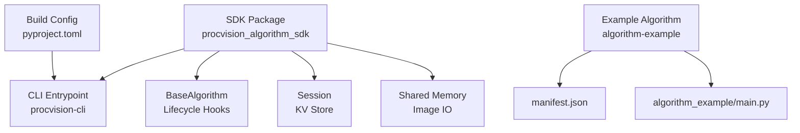
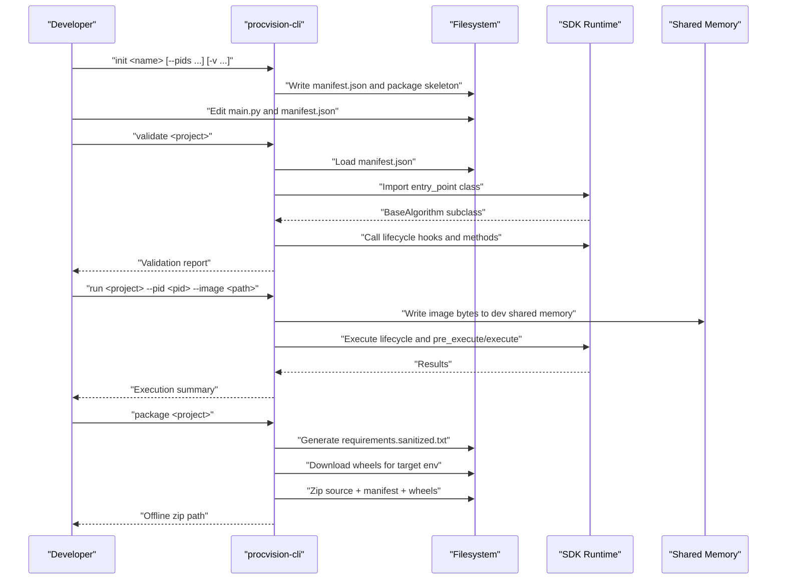
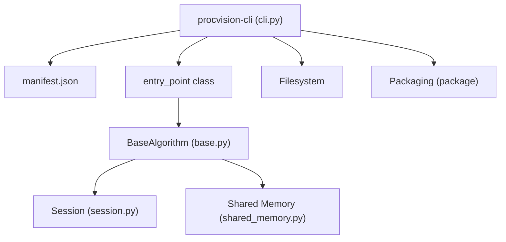

# Getting Started

<cite>
**Referenced Files in This Document**
- [pyproject.toml](file://pyproject.toml)
- [README.md](file://README.md)
- [procvision_algorithm_sdk/cli.py](file://procvision_algorithm_sdk/cli.py)
- [procvision_algorithm_sdk/base.py](file://procvision_algorithm_sdk/base.py)
- [procvision_algorithm_sdk/session.py](file://procvision_algorithm_sdk/session.py)
- [procvision_algorithm_sdk/shared_memory.py](file://procvision_algorithm_sdk/shared_memory.py)
- [algorithm-example/manifest.json](file://algorithm-example/manifest.json)
- [algorithm-example/algorithm_example/main.py](file://algorithm-example/algorithm_example/main.py)
- [algorithm_dev_quickstart.md](file://algorithm_dev_quickstart.md)
- [algorithm_dev_tutorial.md](file://algorithm_dev_tutorial.md)
</cite>

## Table of Contents
1. [Introduction](#introduction)
2. [Project Structure](#project-structure)
3. [Core Components](#core-components)
4. [Architecture Overview](#architecture-overview)
5. [Detailed Component Analysis](#detailed-component-analysis)
6. [Dependency Analysis](#dependency-analysis)
7. [Performance Considerations](#performance-considerations)
8. [Troubleshooting Guide](#troubleshooting-guide)
9. [Conclusion](#conclusion)
10. [Appendices](#appendices)

## Introduction
This Getting Started guide helps new developers onboard quickly to the ProcVision Algorithm SDK. You will:
- Install the SDK using pip
- Prepare a Python environment with required dependencies
- Initialize a new algorithm project using the CLI
- Validate the scaffold with the validator
- Run a test execution against a sample image
- Package the algorithm for deployment
- Understand the roles of manifest.json and entry_point
- Learn common pitfalls and how to troubleshoot them

The flow follows the user workflow from project initialization to local testing and packaging.

## Project Structure
At a high level, the repository contains:
- The SDK package under procvision_algorithm_sdk
- A working example algorithm under algorithm-example
- Developer documentation and CLI implementation
- Build configuration for publishing the SDK

**Diagram sources**
- [procvision_algorithm_sdk/cli.py](file://procvision_algorithm_sdk/cli.py#L464-L611)
- [procvision_algorithm_sdk/base.py](file://procvision_algorithm_sdk/base.py#L1-L58)
- [procvision_algorithm_sdk/session.py](file://procvision_algorithm_sdk/session.py#L1-L36)
- [procvision_algorithm_sdk/shared_memory.py](file://procvision_algorithm_sdk/shared_memory.py#L1-L53)
- [algorithm-example/manifest.json](file://algorithm-example/manifest.json#L1-L25)
- [algorithm-example/algorithm_example/main.py](file://algorithm-example/algorithm_example/main.py#L1-L150)
- [pyproject.toml](file://pyproject.toml#L1-L36)

**Section sources**
- [README.md](file://README.md#L1-L116)
- [pyproject.toml](file://pyproject.toml#L1-L36)

## Core Components
- CLI program name: procvision-cli
- Subcommands:
  - init: Scaffold a new algorithm project
  - validate: Verify manifest and entry_point correctness
  - run: Simulate a local execution against a sample image
  - package: Build an offline delivery zip with wheels and metadata
- BaseAlgorithm lifecycle hooks:
  - setup, teardown, on_step_start, on_step_finish, reset
  - get_info, pre_execute, execute (required)
- Session: In-process KV store and context for cross-step state
- Shared memory: Read/write images for local simulation and platform integration

**Section sources**
- [procvision_algorithm_sdk/cli.py](file://procvision_algorithm_sdk/cli.py#L464-L611)
- [procvision_algorithm_sdk/base.py](file://procvision_algorithm_sdk/base.py#L1-L58)
- [procvision_algorithm_sdk/session.py](file://procvision_algorithm_sdk/session.py#L1-L36)
- [procvision_algorithm_sdk/shared_memory.py](file://procvision_algorithm_sdk/shared_memory.py#L1-L53)

## Architecture Overview
The developer workflow maps to CLI-driven actions that validate and run your algorithm locally before packaging for deployment.

**Diagram sources**
- [procvision_algorithm_sdk/cli.py](file://procvision_algorithm_sdk/cli.py#L344-L463)
- [procvision_algorithm_sdk/cli.py](file://procvision_algorithm_sdk/cli.py#L36-L145)
- [procvision_algorithm_sdk/cli.py](file://procvision_algorithm_sdk/cli.py#L163-L212)
- [procvision_algorithm_sdk/cli.py](file://procvision_algorithm_sdk/cli.py#L228-L326)
- [procvision_algorithm_sdk/shared_memory.py](file://procvision_algorithm_sdk/shared_memory.py#L1-L53)

## Detailed Component Analysis

### Installation and Environment Setup
- Install the SDK package using pip. The package name and scripts are defined in the build configuration.
- Required dependencies include numpy and pillow.

Steps:
- Create and activate a virtual environment appropriate for your OS
- Install the SDK package using pip

Command examples:
- pip install procvision_algorithm_sdk

Notes:
- The SDK requires Python 3.10 or newer
- Dependencies include numpy and pillow

**Section sources**
- [pyproject.toml](file://pyproject.toml#L1-L36)
- [README.md](file://README.md#L1-L116)

### Initialize a New Algorithm Project
Use the CLI to scaffold a new algorithm project. The init command generates:
- manifest.json with name, version, entry_point, supported_pids, and steps
- A package directory with __init__.py and main.py
- A .procvision_env.json with target environment defaults for packaging

Command:
- procvision-cli init <name> [-d|--dir <dir>] [--pids <p1,p2>] [-v|--version <ver>] [-e|--desc <text>]

What happens:
- The CLI sanitizes the module name and derives a class name
- It writes manifest.json and the package skeleton
- It populates supported_pids and a default step schema
- It writes a .procvision_env.json with wheels platform and Python version defaults

Next steps:
- Edit main.py to implement get_info, pre_execute, execute, and lifecycle hooks
- Ensure manifest.json supported_pids matches get_info().supported_pids

Expected outcome:
- A new directory containing manifest.json, a package directory, and main.py

**Section sources**
- [procvision_algorithm_sdk/cli.py](file://procvision_algorithm_sdk/cli.py#L344-L463)
- [algorithm_dev_quickstart.md](file://algorithm_dev_quickstart.md#L1-L120)

### Validate the Scaffold
Run the validator to ensure your project adheres to the SDK contract.

Command:
- procvision-cli validate <project> [--manifest <path>] [--zip <path>] [--json]

What the validator checks:
- manifest.json exists and loads successfully
- Required fields are present (name, version, entry_point, supported_pids)
- The entry_point resolves to a subclass of BaseAlgorithm
- get_info returns a dictionary with steps
- supported_pids match between manifest and get_info
- pre_execute and execute return dictionaries with valid status values
- On NG results, required fields like ng_reason and defect_rects are present and bounded
- When validating a zip, it checks for manifest, requirements, and wheels presence

Exit codes:
- 0 on PASS, non-zero on FAIL

**Section sources**
- [procvision_algorithm_sdk/cli.py](file://procvision_algorithm_sdk/cli.py#L36-L145)
- [procvision_algorithm_sdk/base.py](file://procvision_algorithm_sdk/base.py#L1-L58)
- [README.md](file://README.md#L1-L116)

### Local Test Execution
Run a local simulation against a sample image to exercise your algorithm.

Command:
- procvision-cli run <project> --pid <pid> --image <path> [--step <index>] [--params <json>] [--json]

What happens:
- The CLI loads manifest.json and imports the entry_point class
- It constructs a Session and image_meta
- It writes the image bytes into dev shared memory
- It executes the lifecycle: setup → on_step_start → pre_execute → execute → on_step_finish → teardown
- It prints a human-readable summary or JSON depending on flags

Exit codes:
- 0 if execute.status == "OK", otherwise 1

Tips:
- Ensure the --pid is included in manifest.json supported_pids
- The --step defaults to 1; adjust if your algorithm has multiple steps
- The --params argument expects a JSON string

**Section sources**
- [procvision_algorithm_sdk/cli.py](file://procvision_algorithm_sdk/cli.py#L163-L212)
- [procvision_algorithm_sdk/shared_memory.py](file://procvision_algorithm_sdk/shared_memory.py#L1-L53)
- [README.md](file://README.md#L1-L116)

### Package for Deployment
Package your algorithm into an offline delivery zip suitable for deployment.

Command:
- procvision-cli package <project> [--output <zip>] [--requirements <path>] [--auto-freeze] [--wheels-platform 
] [--python-version <v>] [--implementation <impl>] [--abi <abi>] [--skip-download]

What the packager does:
- Generates requirements.sanitized.txt by freezing the current environment
- Downloads wheels for the target platform and Python version
- Zips the project source tree, manifest.json, requirements, and wheels
- Excludes .venv and wheels from the source tree inside the zip

Defaults:
- Output filename based on name/version
- Wheels platform, Python version, implementation, and ABI defaults are read from .procvision_env.json if present

Notes:
- Ensure requirements.txt exists or use --auto-freeze
- If pip download fails due to incompatible versions, adjust target environment settings

**Section sources**
- [procvision_algorithm_sdk/cli.py](file://procvision_algorithm_sdk/cli.py#L228-L326)
- [algorithm_dev_quickstart.md](file://algorithm_dev_quickstart.md#L120-L269)

### Understanding manifest.json and entry_point
- manifest.json defines:
  - name, version, description (optional)
  - entry_point: "<module_path>:<ClassName>"
  - supported_pids: list of product IDs your algorithm supports
  - steps: optional schema describing steps and parameters
- entry_point must resolve to a class that inherits from BaseAlgorithm
- supported_pids must match get_info().supported_pids

Reference example:
- algorithm-example manifest.json and main.py demonstrate a working baseline

**Section sources**
- [algorithm-example/manifest.json](file://algorithm-example/manifest.json#L1-L25)
- [algorithm-example/algorithm_example/main.py](file://algorithm-example/algorithm_example/main.py#L1-L150)
- [procvision_algorithm_sdk/cli.py](file://procvision_algorithm_sdk/cli.py#L66-L73)
- [procvision_algorithm_sdk/cli.py](file://procvision_algorithm_sdk/cli.py#L86-L89)

### Working with the Example Algorithm
The algorithm-example demonstrates a minimal working implementation:
- manifest.json declares supported_pids and steps
- main.py implements BaseAlgorithm with lifecycle hooks and detection logic

You can use it as a reference while developing your own algorithm.

**Section sources**
- [algorithm-example/manifest.json](file://algorithm-example/manifest.json#L1-L25)
- [algorithm-example/algorithm_example/main.py](file://algorithm-example/algorithm_example/main.py#L1-L150)

## Dependency Analysis
The CLI orchestrates the SDK runtime and filesystem operations. The SDK exposes BaseAlgorithm, Session, and shared memory utilities.

**Diagram sources**
- [procvision_algorithm_sdk/cli.py](file://procvision_algorithm_sdk/cli.py#L464-L611)
- [procvision_algorithm_sdk/base.py](file://procvision_algorithm_sdk/base.py#L1-L58)
- [procvision_algorithm_sdk/session.py](file://procvision_algorithm_sdk/session.py#L1-L36)
- [procvision_algorithm_sdk/shared_memory.py](file://procvision_algorithm_sdk/shared_memory.py#L1-L53)

**Section sources**
- [procvision_algorithm_sdk/cli.py](file://procvision_algorithm_sdk/cli.py#L36-L145)
- [procvision_algorithm_sdk/base.py](file://procvision_algorithm_sdk/base.py#L1-L58)

## Performance Considerations
- Keep pre_execute lightweight; heavy work belongs in execute
- Use debug fields and diagnostics to track latency and model metrics
- Avoid unnecessary image decoding; rely on shared memory read-through
- Minimize allocations during hot paths

[No sources needed since this section provides general guidance]

## Troubleshooting Guide
Common issues and resolutions:
- Unsupported PID:
  - Symptom: pre_execute returns ERROR with a PID-related message
  - Fix: Ensure the --pid is included in manifest.json supported_pids and that get_info().supported_pids matches
- Missing manifest.json:
  - Symptom: validate/run fail with missing manifest
  - Fix: Initialize a project with init or place manifest.json at the project root
- Invalid entry_point:
  - Symptom: import failure during validate
  - Fix: Ensure entry_point follows "<module_path>:<ClassName>" and the class extends BaseAlgorithm
- Invalid params JSON:
  - Symptom: run exits with error about invalid JSON
  - Fix: Pass a valid JSON string to --params
- No requirements.txt and auto-freeze disabled:
  - Symptom: package fails because requirements.txt is missing
  - Fix: Enable --auto-freeze or provide --requirements
- pip download failures:
  - Symptom: wheels download errors indicating no matching distribution
  - Fix: Align target platform and Python version with your environment; generate requirements in the target environment
- Image meta width/height not positive:
  - Symptom: read_image_from_shared_memory returns zeros or None
  - Fix: Ensure image_meta includes positive width and height

**Section sources**
- [procvision_algorithm_sdk/cli.py](file://procvision_algorithm_sdk/cli.py#L548-L603)
- [procvision_algorithm_sdk/shared_memory.py](file://procvision_algorithm_sdk/shared_memory.py#L1-L53)
- [algorithm_dev_tutorial.md](file://algorithm_dev_tutorial.md#L250-L347)

## Conclusion
You now have the essentials to onboard with the ProcVision Algorithm SDK:
- Installed the SDK and prepared the environment
- Initialized a scaffold project and edited manifest.json and main.py
- Validated the scaffold and ran a local test against a sample image
- Packaged the algorithm for deployment

Continue iterating by refining your algorithm’s logic, adding diagnostics, and ensuring manifest.json and entry_point remain consistent with your implementation.

[No sources needed since this section summarizes without analyzing specific files]

## Appendices

### Command Reference Quick Reference
- Initialize: procvision-cli init <name> [--pids <p1,p2>] [-v <ver>] [-d <dir>] [-e <desc>]
- Validate: procvision-cli validate <project> [--manifest <path>] [--zip <path>] [--json]
- Run: procvision-cli run <project> --pid <pid> --image <path> [--step <index>] [--params <json>] [--json]
- Package: procvision-cli package <project> [--output <zip>] [--requirements <path>] [--auto-freeze] [--wheels-platform 
] [--python-version <v>] [--implementation <impl>] [--abi <abi>] [--skip-download]

**Section sources**
- [procvision_algorithm_sdk/cli.py](file://procvision_algorithm_sdk/cli.py#L464-L611)
- [README.md](file://README.md#L1-L116)