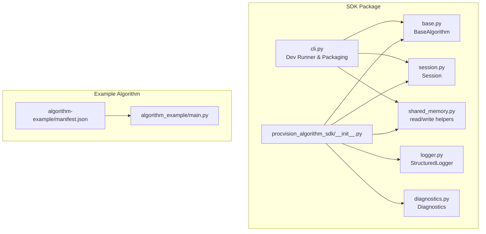
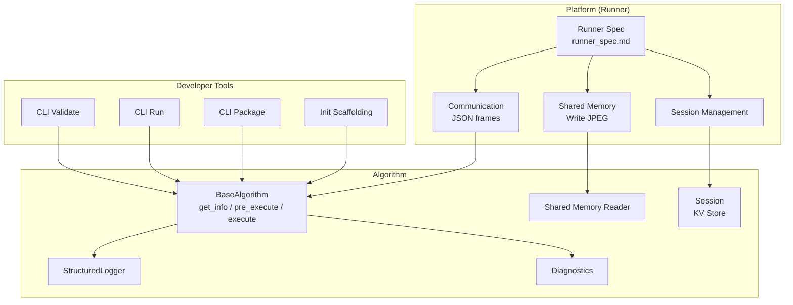
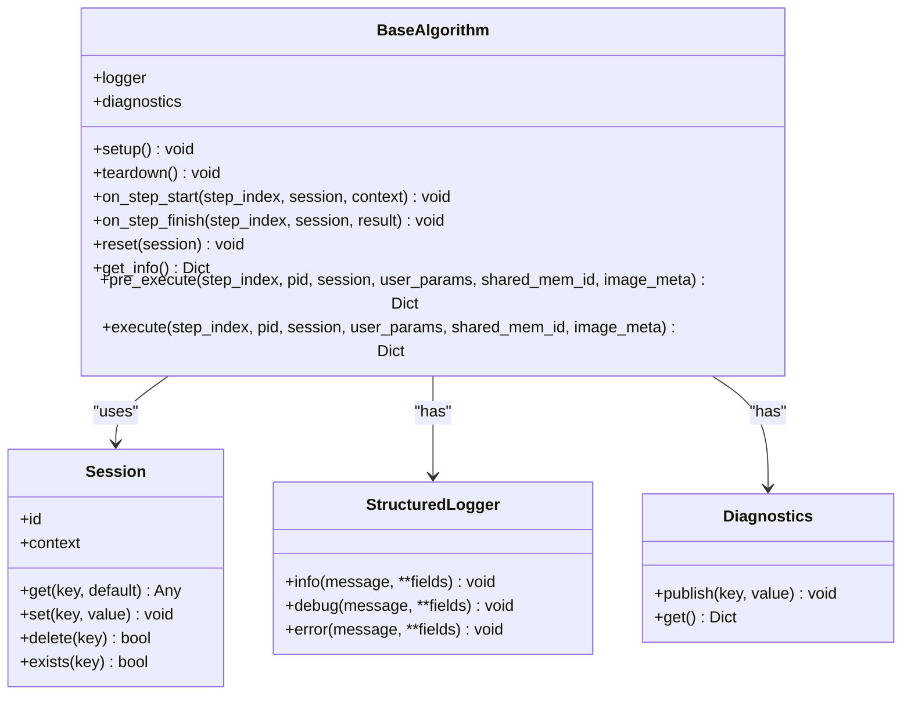
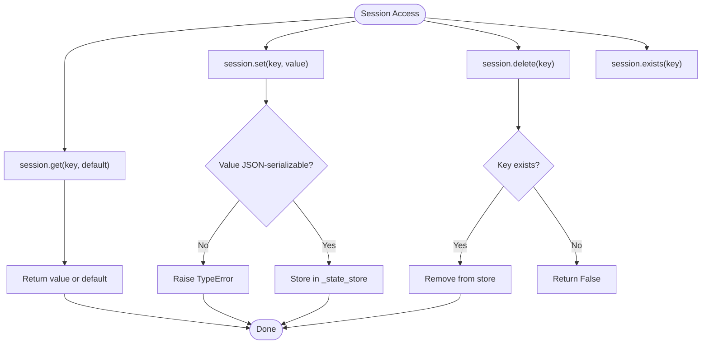
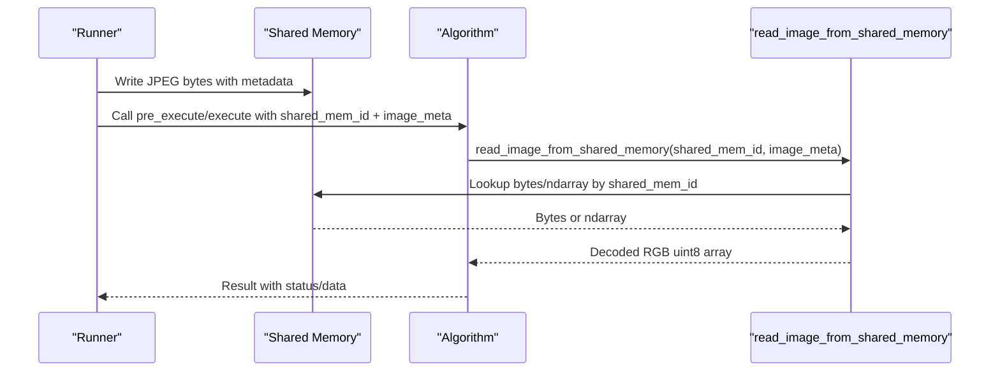
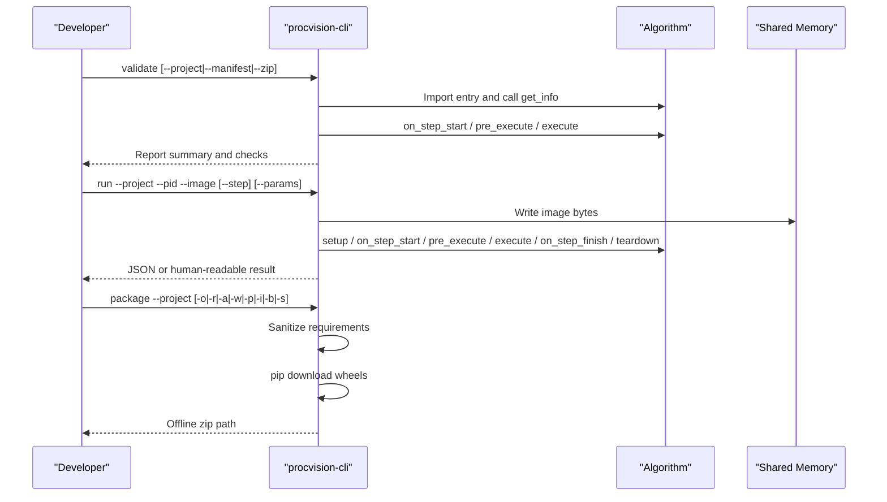
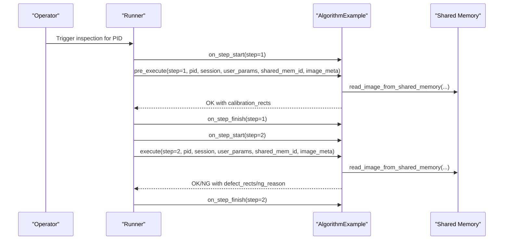
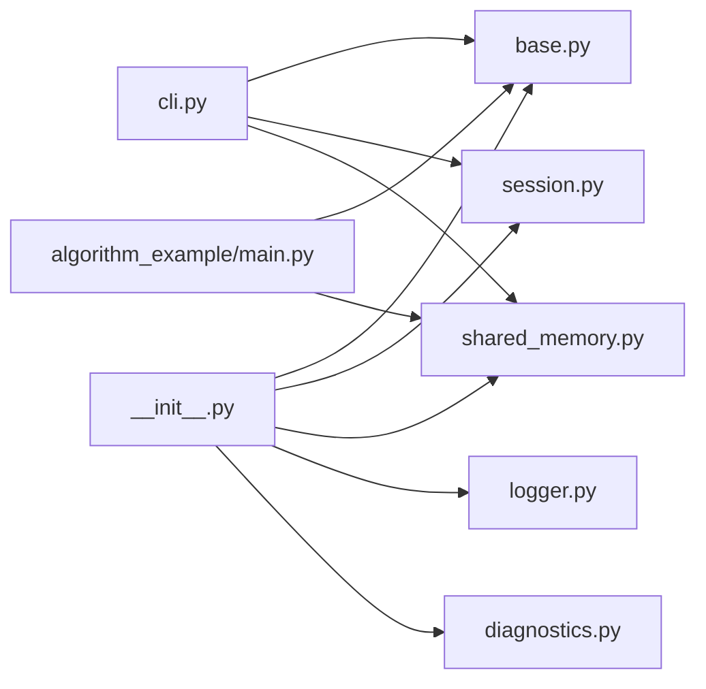

# Introduction

<cite>
**Referenced Files in This Document**
- [README.md](file://README.md)
- [spec.md](file://spec.md)
- [runner_spec.md](file://runner_spec.md)
- [pyproject.toml](file://pyproject.toml)
- [procvision_algorithm_sdk/__init__.py](file://procvision_algorithm_sdk/__init__.py)
- [procvision_algorithm_sdk/base.py](file://procvision_algorithm_sdk/base.py)
- [procvision_algorithm_sdk/session.py](file://procvision_algorithm_sdk/session.py)
- [procvision_algorithm_sdk/shared_memory.py](file://procvision_algorithm_sdk/shared_memory.py)
- [procvision_algorithm_sdk/cli.py](file://procvision_algorithm_sdk/cli.py)
- [procvision_algorithm_sdk/logger.py](file://procvision_algorithm_sdk/logger.py)
- [procvision_algorithm_sdk/diagnostics.py](file://procvision_algorithm_sdk/diagnostics.py)
- [algorithm-example/manifest.json](file://algorithm-example/manifest.json)
- [algorithm-example/algorithm_example/main.py](file://algorithm-example/algorithm_example/main.py)
</cite>

## Table of Contents
1. [Introduction](#introduction)
2. [Project Structure](#project-structure)
3. [Core Components](#core-components)
4. [Architecture Overview](#architecture-overview)
5. [Detailed Component Analysis](#detailed-component-analysis)
6. [Dependency Analysis](#dependency-analysis)
7. [Performance Considerations](#performance-considerations)
8. [Troubleshooting Guide](#troubleshooting-guide)
9. [Conclusion](#conclusion)
10. [Appendices](#appendices)

## Introduction
ProcVision Algorithm SDK is a standardized framework designed to accelerate the development of industrial vision algorithms while ensuring consistency, reliability, and performance in manufacturing inspection systems. It enables algorithm teams to deliver portable, production-ready packages that integrate seamlessly with the ProcVision platform.

Key goals:
- Consistency: Unified interfaces, response schemas, and shared memory image transfer minimize integration variability.
- Reliability: Structured logging, diagnostics, lifecycle hooks, and robust CLI validation improve stability and observability.
- Performance: Shared-memory image transfer (JPEG-only), minimal protocol overhead, and explicit timeouts support real-time throughput.

Target audience:
- Computer vision engineers building detection, classification, and guidance algorithms.
- Algorithm developers who want to ship offline, reproducible packages.
- System integrators deploying and operating inspection stations at scale.

High-level architecture highlights:
- BaseAlgorithm interface defines lifecycle hooks and two-phase execution: pre_execute (prepare reference data) and execute (business decision).
- Session-based state management: a lightweight, JSON-serializable KV store scoped to a single detection flow.
- Shared memory image transfer: platform writes camera images to shared memory and passes metadata; algorithms read via SDK helpers.

Benefits:
- Rapid development via CLI tools: validate, run locally, and package offline.
- Structured logging: unified JSON records with timestamps and contextual fields.
- Offline packaging: deterministic wheels, isolated environments, and reproducible deployments.

Typical use case example:
- Defect detection on a production line: pre_execute validates product ID and loads ROI templates from shared memory; execute detects defects, returns NG/OK with reasons and bounding boxes, and publishes diagnostic metrics.

Terminology aligned with the codebase:
- PID: Product Identifier used to select configuration and supported models.
- Step: A numbered stage in the inspection pipeline (1-indexed).
- Shared memory: A platform-managed buffer containing JPEG-encoded images and metadata.

Getting started and core concepts:
- See Getting Started and Core Concepts for step-by-step guidance and foundational topics.

**Section sources**
- [README.md](file://README.md#L1-L116)
- [spec.md](file://spec.md#L1-L120)
- [runner_spec.md](file://runner_spec.md#L1-L120)

## Project Structure
At a high level, the SDK provides:
- Core runtime APIs: BaseAlgorithm, Session, shared memory helpers, structured logging, diagnostics, and error types.
- CLI tools for validation, local simulation, and offline packaging.
- An example algorithm demonstrating best practices.

**Diagram sources**
- [procvision_algorithm_sdk/__init__.py](file://procvision_algorithm_sdk/__init__.py#L1-L20)
- [procvision_algorithm_sdk/base.py](file://procvision_algorithm_sdk/base.py#L1-L58)
- [procvision_algorithm_sdk/session.py](file://procvision_algorithm_sdk/session.py#L1-L36)
- [procvision_algorithm_sdk/shared_memory.py](file://procvision_algorithm_sdk/shared_memory.py#L1-L53)
- [procvision_algorithm_sdk/logger.py](file://procvision_algorithm_sdk/logger.py#L1-L24)
- [procvision_algorithm_sdk/diagnostics.py](file://procvision_algorithm_sdk/diagnostics.py#L1-L12)
- [procvision_algorithm_sdk/cli.py](file://procvision_algorithm_sdk/cli.py#L1-L615)
- [algorithm-example/manifest.json](file://algorithm-example/manifest.json#L1-L25)
- [algorithm-example/algorithm_example/main.py](file://algorithm-example/algorithm_example/main.py#L1-L150)

**Section sources**
- [README.md](file://README.md#L1-L116)
- [pyproject.toml](file://pyproject.toml#L1-L36)

## Core Components
- BaseAlgorithm: Defines the contract for algorithm lifecycle and execution phases. It exposes get_info, pre_execute, execute, plus optional hooks (setup, teardown, on_step_start, on_step_finish, reset). It also embeds StructuredLogger and Diagnostics for consistent logging and diagnostics.
- Session: Provides a lightweight, JSON-serializable state store scoped to a single detection flow. It supports get/set/delete/exists with strict serialization rules.
- Shared Memory Helpers: Provide read/write helpers for JPEG images stored in shared memory, with metadata-driven decoding and fallback behavior.
- StructuredLogger: Emits JSON log records with a unified timestamp field and arbitrary fields for traceability.
- Diagnostics: Publishes key-value metrics for UI and remote monitoring.
- CLI Tools: Validate projects, simulate runs, initialize scaffolding, and package offline distributions.

These components collectively enable a consistent, reliable, and high-performance development and deployment experience for industrial vision algorithms.

**Section sources**
- [procvision_algorithm_sdk/base.py](file://procvision_algorithm_sdk/base.py#L1-L58)
- [procvision_algorithm_sdk/session.py](file://procvision_algorithm_sdk/session.py#L1-L36)
- [procvision_algorithm_sdk/shared_memory.py](file://procvision_algorithm_sdk/shared_memory.py#L1-L53)
- [procvision_algorithm_sdk/logger.py](file://procvision_algorithm_sdk/logger.py#L1-L24)
- [procvision_algorithm_sdk/diagnostics.py](file://procvision_algorithm_sdk/diagnostics.py#L1-L12)
- [procvision_algorithm_sdk/cli.py](file://procvision_algorithm_sdk/cli.py#L1-L615)

## Architecture Overview
The ProcVision Algorithm SDK follows a clean separation of concerns:
- Platform side (Runner) manages lifecycle, communication, shared memory, and scheduling.
- Algorithm side implements BaseAlgorithm and uses SDK-provided utilities for logging, diagnostics, and image access.
- CLI bridges development and delivery by validating, simulating, and packaging algorithms.

**Diagram sources**
- [runner_spec.md](file://runner_spec.md#L1-L120)
- [spec.md](file://spec.md#L1-L120)
- [procvision_algorithm_sdk/base.py](file://procvision_algorithm_sdk/base.py#L1-L58)
- [procvision_algorithm_sdk/session.py](file://procvision_algorithm_sdk/session.py#L1-L36)
- [procvision_algorithm_sdk/shared_memory.py](file://procvision_algorithm_sdk/shared_memory.py#L1-L53)
- [procvision_algorithm_sdk/logger.py](file://procvision_algorithm_sdk/logger.py#L1-L24)
- [procvision_algorithm_sdk/diagnostics.py](file://procvision_algorithm_sdk/diagnostics.py#L1-L12)
- [procvision_algorithm_sdk/cli.py](file://procvision_algorithm_sdk/cli.py#L1-L615)

## Detailed Component Analysis

### BaseAlgorithm and Lifecycle
BaseAlgorithm defines the core contract:
- get_info returns metadata and step schemas.
- pre_execute prepares reference data (e.g., templates) and returns structured results.
- execute performs the core detection/business decision and returns OK/NG with diagnostics.
- Optional hooks: setup/teardown for resource management; on_step_start/on_step_finish for timing and cleanup; reset for mid-flow resets.

**Diagram sources**
- [procvision_algorithm_sdk/base.py](file://procvision_algorithm_sdk/base.py#L1-L58)
- [procvision_algorithm_sdk/session.py](file://procvision_algorithm_sdk/session.py#L1-L36)
- [procvision_algorithm_sdk/logger.py](file://procvision_algorithm_sdk/logger.py#L1-L24)
- [procvision_algorithm_sdk/diagnostics.py](file://procvision_algorithm_sdk/diagnostics.py#L1-L12)

**Section sources**
- [procvision_algorithm_sdk/base.py](file://procvision_algorithm_sdk/base.py#L1-L58)
- [spec.md](file://spec.md#L1-L120)

### Session-Based State Management
Session encapsulates:
- A unique identifier and a read-only context dictionary.
- A JSON-serializable state store for cross-step data sharing.
- Strict validation for values to ensure portability and safety.

**Diagram sources**
- [procvision_algorithm_sdk/session.py](file://procvision_algorithm_sdk/session.py#L1-L36)

**Section sources**
- [procvision_algorithm_sdk/session.py](file://procvision_algorithm_sdk/session.py#L1-L36)

### Shared Memory Image Transfer
The platform writes JPEG images to shared memory and supplies metadata (width, height, timestamp_ms, camera_id). Algorithms read images via SDK helpers, which decode JPEG and normalize to a consistent array shape.

**Diagram sources**
- [runner_spec.md](file://runner_spec.md#L1-L120)
- [procvision_algorithm_sdk/shared_memory.py](file://procvision_algorithm_sdk/shared_memory.py#L1-L53)

**Section sources**
- [runner_spec.md](file://runner_spec.md#L1-L120)
- [procvision_algorithm_sdk/shared_memory.py](file://procvision_algorithm_sdk/shared_memory.py#L1-L53)

### CLI Tools: Validation, Simulation, Packaging, Initialization
The CLI provides:
- validate: Checks manifest presence, entry import, supported_pids match, smoke execution of pre_execute/execute, and optional zip structure.
- run: Writes a local image to shared memory and simulates a single step execution with structured output.
- package: Generates an offline zip with sanitized requirements and downloaded wheels.
- init: Scaffolds a new algorithm project with manifest and boilerplate.

**Diagram sources**
- [procvision_algorithm_sdk/cli.py](file://procvision_algorithm_sdk/cli.py#L1-L615)

**Section sources**
- [procvision_algorithm_sdk/cli.py](file://procvision_algorithm_sdk/cli.py#L1-L615)
- [README.md](file://README.md#L1-L116)

### Example Algorithm: Defect Detection on a Production Line
A typical defect detection scenario:
- pre_execute validates the PID, reads the image from shared memory, and returns calibration/reference rectangles.
- execute detects defects, decides OK/NG, and returns bounding boxes and reasons.
- Diagnostics and structured logging provide runtime insights.

**Diagram sources**
- [algorithm-example/algorithm_example/main.py](file://algorithm-example/algorithm_example/main.py#L1-L150)
- [algorithm-example/manifest.json](file://algorithm-example/manifest.json#L1-L25)
- [runner_spec.md](file://runner_spec.md#L1-L120)

**Section sources**
- [algorithm-example/algorithm_example/main.py](file://algorithm-example/algorithm_example/main.py#L1-L150)
- [algorithm-example/manifest.json](file://algorithm-example/manifest.json#L1-L25)

## Dependency Analysis
The SDK exports a cohesive surface:
- __init__ aggregates BaseAlgorithm, Session, shared memory helpers, StructuredLogger, Diagnostics, and error types.
- CLI depends on BaseAlgorithm, Session, and shared memory helpers to validate and run algorithms.
- Example algorithm depends on BaseAlgorithm and shared memory helpers.

**Diagram sources**
- [procvision_algorithm_sdk/__init__.py](file://procvision_algorithm_sdk/__init__.py#L1-L20)
- [procvision_algorithm_sdk/cli.py](file://procvision_algorithm_sdk/cli.py#L1-L615)
- [algorithm-example/algorithm_example/main.py](file://algorithm-example/algorithm_example/main.py#L1-L150)

**Section sources**
- [procvision_algorithm_sdk/__init__.py](file://procvision_algorithm_sdk/__init__.py#L1-L20)
- [procvision_algorithm_sdk/cli.py](file://procvision_algorithm_sdk/cli.py#L1-L615)

## Performance Considerations
- Shared memory image transfer avoids disk I/O and network overhead; ensure image_meta dimensions match actual data.
- Keep Session state small and JSON-serializable to minimize serialization costs.
- Use structured logging sparingly; batch diagnostics when possible.
- Leverage CLI’s validate and run commands to profile latency and detect regressions early.

[No sources needed since this section provides general guidance]

## Troubleshooting Guide
Common issues and remedies:
- Unsupported PID: pre_execute should return an error with a standard code and message; verify supported_pids in manifest and get_info.
- Empty image data: ensure the platform wrote the image to shared memory and image_meta width/height are valid.
- Non-JSON-serializable Session values: set only JSON-compatible types; otherwise, a TypeError is raised.
- Offline packaging failures: confirm requirements.txt exists or use auto-freeze; verify wheels platform and ABI match target environment.

**Section sources**
- [procvision_algorithm_sdk/session.py](file://procvision_algorithm_sdk/session.py#L1-L36)
- [procvision_algorithm_sdk/cli.py](file://procvision_algorithm_sdk/cli.py#L1-L615)
- [README.md](file://README.md#L1-L116)

## Conclusion
ProcVision Algorithm SDK provides a robust, standardized foundation for industrial vision algorithm development. By adhering to the BaseAlgorithm contract, leveraging Session for state management, and using shared memory for efficient image transfer, teams can deliver consistent, reliable, and high-performance inspection solutions. The CLI accelerates development and ensures reproducible offline packaging, while structured logging and diagnostics enhance observability and maintainability.

[No sources needed since this section summarizes without analyzing specific files]

## Appendices
- Getting Started: Follow the quickstart guide to scaffold a project, implement BaseAlgorithm, and validate with the CLI.
- Core Concepts: Study the specification documents to understand interfaces, session semantics, shared memory protocols, and runner expectations.

**Section sources**
- [README.md](file://README.md#L1-L116)
- [spec.md](file://spec.md#L1-L120)
- [runner_spec.md](file://runner_spec.md#L1-L120)