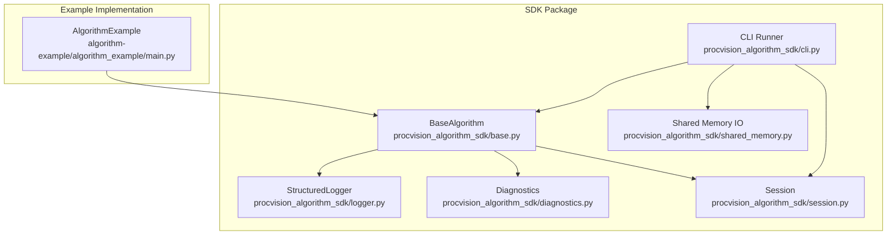
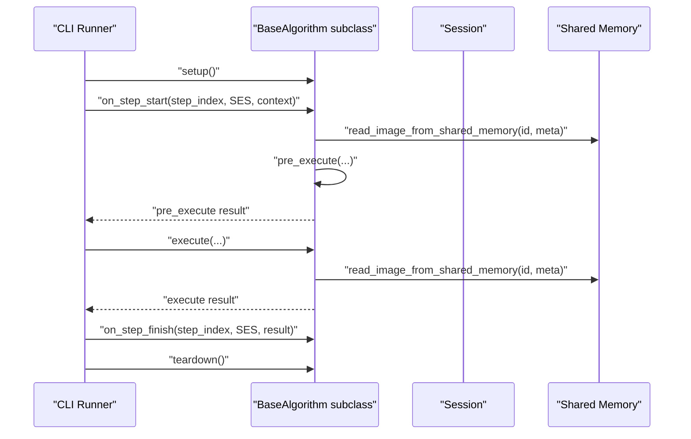
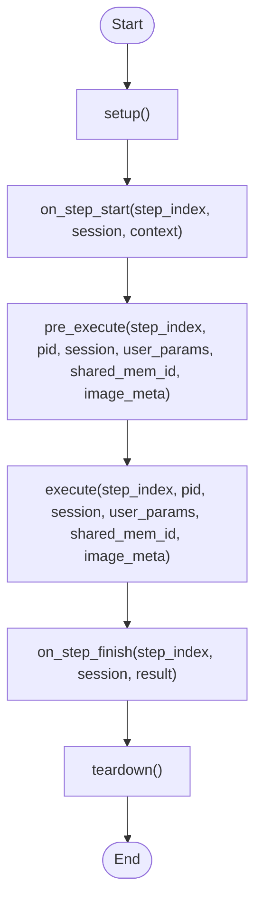
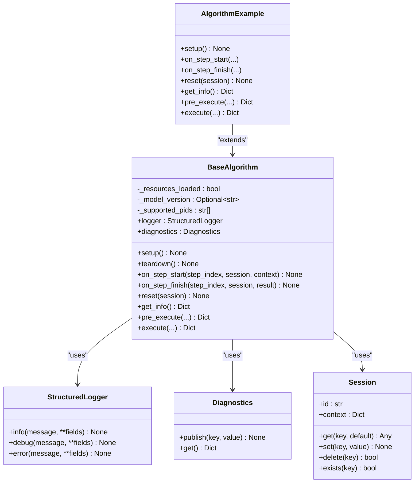

# BaseAlgorithm API Reference

<cite>
**Referenced Files in This Document**
- [base.py](file://procvision_algorithm_sdk/base.py)
- [logger.py](file://procvision_algorithm_sdk/logger.py)
- [diagnostics.py](file://procvision_algorithm_sdk/diagnostics.py)
- [session.py](file://procvision_algorithm_sdk/session.py)
- [shared_memory.py](file://procvision_algorithm_sdk/shared_memory.py)
- [cli.py](file://procvision_algorithm_sdk/cli.py)
- [main.py](file://algorithm-example/algorithm_example/main.py)
- [test_base_algo.py](file://tests/test_base_algo.py)
- [README.md](file://README.md)
- [algorithm_dev_tutorial.md](file://algorithm_dev_tutorial.md)
</cite>

## Table of Contents
1. [Introduction](#introduction)
2. [Project Structure](#project-structure)
3. [Core Components](#core-components)
4. [Architecture Overview](#architecture-overview)
5. [Detailed Component Analysis](#detailed-component-analysis)
6. [Dependency Analysis](#dependency-analysis)
7. [Performance Considerations](#performance-considerations)
8. [Troubleshooting Guide](#troubleshooting-guide)
9. [Conclusion](#conclusion)
10. [Appendices](#appendices)

## Introduction
This document provides a comprehensive API reference for the BaseAlgorithm abstract base class used in the ProcVision Algorithm SDK. It documents lifecycle methods, required abstract methods, built-in capabilities (logger and diagnostics), internal fields, invocation timing, error conditions, and practical guidance for implementing robust industrial vision algorithms.

## Project Structure
The BaseAlgorithm resides in the SDK package and integrates with Session, structured logging, diagnostics, and shared memory utilities. Example implementations live under the algorithm-example package.

**Diagram sources**
- [base.py](file://procvision_algorithm_sdk/base.py#L1-L58)
- [logger.py](file://procvision_algorithm_sdk/logger.py#L1-L24)
- [diagnostics.py](file://procvision_algorithm_sdk/diagnostics.py#L1-L12)
- [session.py](file://procvision_algorithm_sdk/session.py#L1-L36)
- [shared_memory.py](file://procvision_algorithm_sdk/shared_memory.py#L1-L53)
- [cli.py](file://procvision_algorithm_sdk/cli.py#L64-L100)
- [main.py](file://algorithm-example/algorithm_example/main.py#L1-L150)

**Section sources**
- [base.py](file://procvision_algorithm_sdk/base.py#L1-L58)
- [README.md](file://README.md#L1-L116)

## Core Components
- BaseAlgorithm: Abstract base class defining lifecycle hooks and required methods for algorithm implementations.
- StructuredLogger: Provides structured logging with JSON records and standardized fields.
- Diagnostics: Lightweight metrics publisher for runtime diagnostics.
- Session: In-process key-value store and read-only context container for cross-step state.
- Shared memory utilities: Read/write helpers for images in development mode.

Key responsibilities:
- Lifecycle orchestration: setup, on_step_start, pre_execute, execute, on_step_finish, reset, teardown.
- Metadata and capability reporting via get_info.
- Built-in observability via logger and diagnostics.
- Cross-step state via Session.

**Section sources**
- [base.py](file://procvision_algorithm_sdk/base.py#L1-L58)
- [logger.py](file://procvision_algorithm_sdk/logger.py#L1-L24)
- [diagnostics.py](file://procvision_algorithm_sdk/diagnostics.py#L1-L12)
- [session.py](file://procvision_algorithm_sdk/session.py#L1-L36)
- [shared_memory.py](file://procvision_algorithm_sdk/shared_memory.py#L1-L53)

## Architecture Overview
The BaseAlgorithm orchestrates a typical algorithm execution flow. The CLI invokes lifecycle methods and delegates to pre_execute and execute, while the algorithm uses logger and diagnostics for instrumentation and Session for state.

**Diagram sources**
- [cli.py](file://procvision_algorithm_sdk/cli.py#L192-L225)
- [base.py](file://procvision_algorithm_sdk/base.py#L1-L58)
- [shared_memory.py](file://procvision_algorithm_sdk/shared_memory.py#L1-L53)

## Detailed Component Analysis

### BaseAlgorithm Class API
BaseAlgorithm defines lifecycle hooks and three required abstract methods. All hooks are optional by default and can be overridden by subclasses.

- Constructor
  - Signature: BaseAlgorithm.__init__()
  - Purpose: Initializes logger, diagnostics, and internal fields.
  - Internal fields:
    - _resources_loaded: bool
    - _model_version: Optional[str]
    - _supported_pids: List[str]

- Lifecycle Hooks
  - setup(self) -> None
    - Invocation timing: Called once before any step runs.
    - Purpose: Load resources, initialize models, caches, and set _model_version.
    - Notes: Idempotent; safe to call multiple times.
  - teardown(self) -> None
    - Invocation timing: Called after the last step completes.
    - Purpose: Release resources and close handles.
    - Notes: Idempotent; safe to call multiple times.
  - on_step_start(self, step_index: int, session: Session, context: Dict[str, Any]) -> None
    - Invocation timing: Before pre_execute for each step.
    - Purpose: Record step context, reset timers, and prepare transient state in Session.
    - Notes: Keep lightweight; heavy work belongs in pre_execute/execute.
  - on_step_finish(self, step_index: int, session: Session, result: Dict[str, Any]) -> None
    - Invocation timing: After execute for each step.
    - Purpose: Publish diagnostics, compute latency, and log outcomes.
    - Notes: Robustness: catch exceptions and continue; rely on logger.error for failures.
  - reset(self, session: Session) -> None
    - Invocation timing: During pipeline resets or between runs.
    - Purpose: Clear transient state in both Session and algorithm internals.

- Required Abstract Methods
  - get_info(self) -> Dict[str, Any]
    - Purpose: Return algorithm metadata including name, version, description, supported_pids, and steps with parameter schemas.
    - Behavior: Must return a dictionary conforming to the specification.
    - Error condition: NotImplementedError if not implemented by subclass.
  - pre_execute(self, step_index: int, pid: str, session: Session, user_params: Dict[str, Any], shared_mem_id: str, image_meta: Dict[str, Any]) -> Dict[str, Any]
    - Purpose: Validate inputs, perform preprocessing, and optionally read images from shared memory.
    - Returns: Dictionary with top-level "status" field ("OK" or "ERROR"). On error, include "message" and optional "error_code". On success, include optional "data" and "debug".
    - Behavior: Do not return detection results here; reserve execute for that.
    - Error condition: NotImplementedError if not implemented by subclass.
  - execute(self, step_index: int, pid: str, session: Session, user_params: Dict[str, Any], shared_mem_id: str, image_meta: Dict[str, Any]) -> Dict[str, Any]
    - Purpose: Perform the core algorithm logic.
    - Returns: Dictionary with top-level "status" field ("OK" or "ERROR"). On success, include "data" containing "result_status" ("OK" or "NG") and optional defect/position rectangles and debug info.
    - Behavior: Must produce deterministic results given the same inputs.
    - Error condition: NotImplementedError if not implemented by subclass.

- Built-in Attributes Available to Subclasses
  - logger: StructuredLogger
    - Methods: info(message, **fields), debug(message, **fields), error(message, **fields)
    - Output: JSON records with standardized fields including level and timestamp_ms.
  - diagnostics: Diagnostics
    - Methods: publish(key: str, value: Any), get() -> Dict[str, Any]
    - Purpose: Publish runtime metrics; retrieve snapshot for reporting.

- Internal Fields
  - _resources_loaded: bool
  - _model_version: Optional[str]
  - _supported_pids: List[str]

- Invocation Timing and Call Chaining
  - Typical CLI flow:
    - setup()
    - on_step_start(step_index, session, context)
    - pre_execute(...)
    - execute(...)
    - on_step_finish(step_index, session, result)
    - teardown()
  - reset(session) is invoked during pipeline resets and should clear both Session and internal state.

- Error Conditions
  - NotImplementedError raised by abstract methods if not overridden.
  - Session.set raises TypeError if values are not JSON serializable.
  - Implementations should return structured error responses with "status":"ERROR" and include "message" and optional "error_code".

- Practical Guidance
  - Override lifecycle hooks to manage resources and state.
  - Keep on_step_start/on_step_finish lightweight; heavy work in pre_execute/execute.
  - Use logger.info/error for instrumentation; diagnostics.publish for metrics.
  - Ensure get_info returns a complete steps schema for platform integration.

**Section sources**
- [base.py](file://procvision_algorithm_sdk/base.py#L1-L58)
- [logger.py](file://procvision_algorithm_sdk/logger.py#L1-L24)
- [diagnostics.py](file://procvision_algorithm_sdk/diagnostics.py#L1-L12)
- [session.py](file://procvision_algorithm_sdk/session.py#L1-L36)
- [cli.py](file://procvision_algorithm_sdk/cli.py#L64-L100)
- [cli.py](file://procvision_algorithm_sdk/cli.py#L192-L225)
- [README.md](file://README.md#L1-L116)
- [algorithm_dev_tutorial.md](file://algorithm_dev_tutorial.md#L56-L80)

### Concrete Implementation Examples
The example implementation demonstrates best practices for lifecycle hooks and required methods.

- Example class: AlgorithmExample
  - Overrides lifecycle hooks to set _model_version, record timestamps, publish latency, and clean up state.
  - Implements get_info with steps and parameter schemas.
  - Implements pre_execute and execute to validate inputs, read images from shared memory, and return structured results.

Code example references:
- [AlgorithmExample.setup](file://algorithm-example/algorithm_example/main.py#L1-L150)
- [AlgorithmExample.on_step_start](file://algorithm-example/algorithm_example/main.py#L1-L150)
- [AlgorithmExample.on_step_finish](file://algorithm-example/algorithm_example/main.py#L1-L150)
- [AlgorithmExample.reset](file://algorithm-example/algorithm_example/main.py#L1-L150)
- [AlgorithmExample.get_info](file://algorithm-example/algorithm_example/main.py#L1-L150)
- [AlgorithmExample.pre_execute](file://algorithm-example/algorithm_example/main.py#L1-L150)
- [AlgorithmExample.execute](file://algorithm-example/algorithm_example/main.py#L1-L150)

**Section sources**
- [main.py](file://algorithm-example/algorithm_example/main.py#L1-L150)

### Lifecycle Method Flow

**Diagram sources**
- [cli.py](file://procvision_algorithm_sdk/cli.py#L192-L225)
- [base.py](file://procvision_algorithm_sdk/base.py#L1-L58)

## Dependency Analysis
BaseAlgorithm depends on StructuredLogger, Diagnostics, and Session. Example implementations depend on BaseAlgorithm and shared memory utilities.

**Diagram sources**
- [base.py](file://procvision_algorithm_sdk/base.py#L1-L58)
- [logger.py](file://procvision_algorithm_sdk/logger.py#L1-L24)
- [diagnostics.py](file://procvision_algorithm_sdk/diagnostics.py#L1-L12)
- [session.py](file://procvision_algorithm_sdk/session.py#L1-L36)
- [main.py](file://algorithm-example/algorithm_example/main.py#L1-L150)

**Section sources**
- [base.py](file://procvision_algorithm_sdk/base.py#L1-L58)
- [main.py](file://algorithm-example/algorithm_example/main.py#L1-L150)

## Performance Considerations
- Resource loading and caching
  - Move heavy initialization (models, caches) into setup to avoid repeated overhead.
  - Keep on_step_start/on_step_finish lightweight; avoid heavy computation here.
- Image I/O
  - Use shared memory utilities to minimize copies and overhead; ensure image_meta contains width/height.
- Diagnostics and logging
  - Publish latency and throughput metrics via diagnostics; log events with minimal overhead.
- Determinism and reproducibility
  - Ensure deterministic behavior across runs; seed RNGs if randomness is used.
- Error handling
  - Return structured error responses rather than raising exceptions to keep the pipeline resilient.

[No sources needed since this section provides general guidance]

## Troubleshooting Guide
Common issues and resolutions:
- NotImplementedError for unimplemented abstract methods
  - Symptom: Calling get_info/pre_execute/execute without overriding in subclass.
  - Resolution: Implement all three abstract methods in your subclass.
- Session.set TypeError
  - Symptom: Setting non-JSON-serializable values.
  - Resolution: Ensure values stored in Session are JSON serializable.
- Empty or invalid images
  - Symptom: read_image_from_shared_memory returns None or zeros.
  - Resolution: Validate image_meta and handle None gracefully; return "status":"ERROR" with appropriate message and error_code.
- Lifecycle hook exceptions
  - Symptom: Exceptions in on_step_start/on_step_finish.
  - Resolution: Catch and log via logger.error; continue execution to avoid breaking the pipeline.

**Section sources**
- [base.py](file://procvision_algorithm_sdk/base.py#L1-L58)
- [session.py](file://procvision_algorithm_sdk/session.py#L1-L36)
- [shared_memory.py](file://procvision_algorithm_sdk/shared_memory.py#L1-L53)
- [cli.py](file://procvision_algorithm_sdk/cli.py#L192-L225)

## Conclusion
BaseAlgorithm provides a robust foundation for building industrial vision algorithms with clear lifecycle hooks, structured logging, diagnostics, and session state management. By following the documented signatures, invocation timing, and best practices, developers can implement reliable, observable, and maintainable algorithms that integrate seamlessly with the platform.

[No sources needed since this section summarizes without analyzing specific files]

## Appendices

### A. Method Signatures and Contracts
- BaseAlgorithm.__init__()
  - Initializes logger, diagnostics, and internal fields.
- BaseAlgorithm.setup() -> None
  - Load resources and set _model_version.
- BaseAlgorithm.teardown() -> None
  - Release resources.
- BaseAlgorithm.on_step_start(step_index: int, session: Session, context: Dict[str, Any]) -> None
  - Prepare transient state; record timestamps.
- BaseAlgorithm.on_step_finish(step_index: int, session: Session, result: Dict[str, Any]) -> None
  - Publish diagnostics and compute latency.
- BaseAlgorithm.reset(session: Session) -> None
  - Clear transient state in Session and algorithm internals.
- BaseAlgorithm.get_info() -> Dict[str, Any]
  - Return metadata and steps schema.
- BaseAlgorithm.pre_execute(step_index: int, pid: str, session: Session, user_params: Dict[str, Any], shared_mem_id: str, image_meta: Dict[str, Any]) -> Dict[str, Any]
  - Validate inputs and preprocess; return "status":"OK"/"ERROR".
- BaseAlgorithm.execute(step_index: int, pid: str, session: Session, user_params: Dict[str, Any], shared_mem_id: str, image_meta: Dict[str, Any]) -> Dict[str, Any]
  - Core algorithm logic; return "status":"OK"/"ERROR" with "data.result_status":"OK"/"NG".

**Section sources**
- [base.py](file://procvision_algorithm_sdk/base.py#L1-L58)
- [README.md](file://README.md#L1-L116)

### B. Example References
- Lifecycle and get_info: [AlgorithmExample](file://algorithm-example/algorithm_example/main.py#L1-L150)
- pre_execute and execute: [AlgorithmExample](file://algorithm-example/algorithm_example/main.py#L1-L150)
- CLI invocation flow: [CLI Runner](file://procvision_algorithm_sdk/cli.py#L192-L225)

**Section sources**
- [main.py](file://algorithm-example/algorithm_example/main.py#L1-L150)
- [cli.py](file://procvision_algorithm_sdk/cli.py#L192-L225)