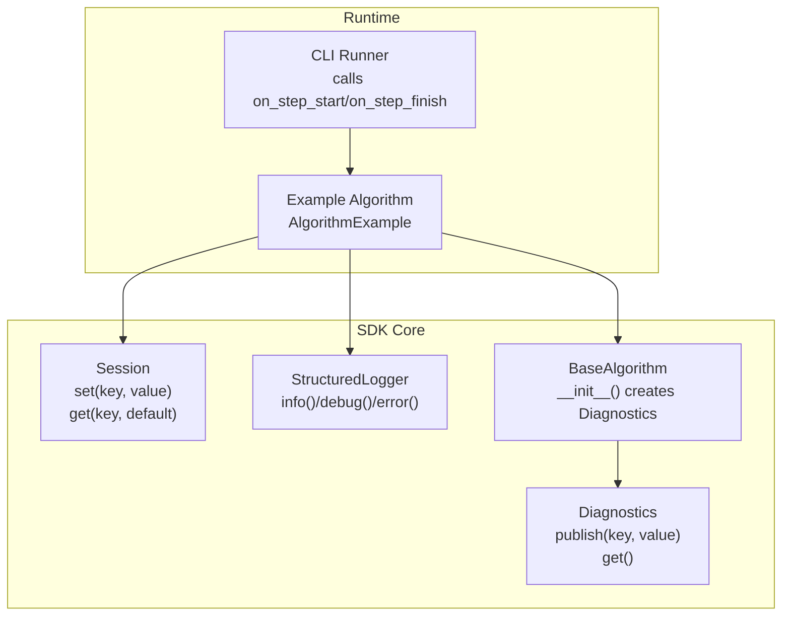
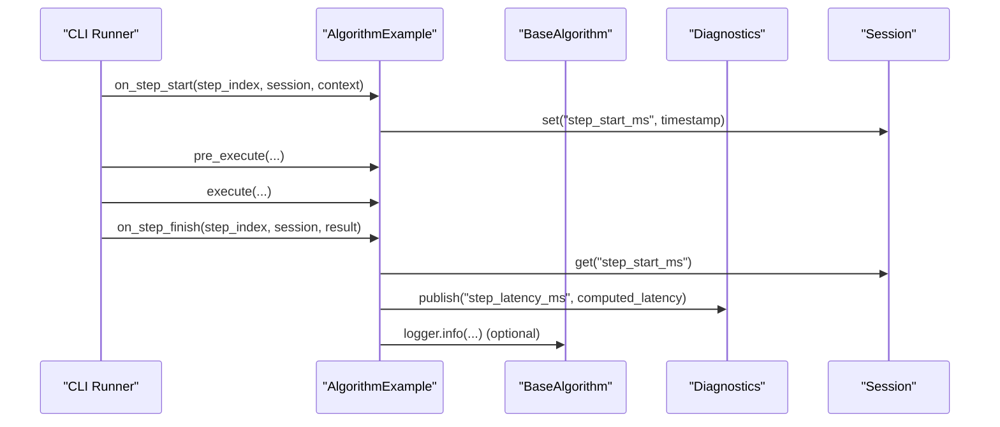
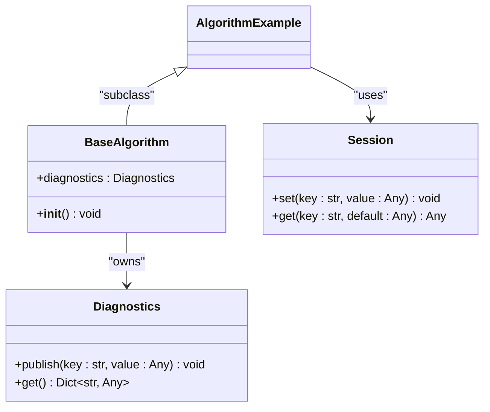

# Diagnostics API Reference

<cite>
**Referenced Files in This Document**
- [diagnostics.py](file://procvision_algorithm_sdk/diagnostics.py)
- [base.py](file://procvision_algorithm_sdk/base.py)
- [session.py](file://procvision_algorithm_sdk/session.py)
- [main.py](file://algorithm-example/algorithm_example/main.py)
- [cli.py](file://procvision_algorithm_sdk/cli.py)
- [logger.py](file://procvision_algorithm_sdk/logger.py)
</cite>

## Table of Contents
1. [Introduction](#introduction)
2. [Project Structure](#project-structure)
3. [Core Components](#core-components)
4. [Architecture Overview](#architecture-overview)
5. [Detailed Component Analysis](#detailed-component-analysis)
6. [Dependency Analysis](#dependency-analysis)
7. [Performance Considerations](#performance-considerations)
8. [Troubleshooting Guide](#troubleshooting-guide)
9. [Conclusion](#conclusion)
10. [Appendices](#appendices)

## Introduction
This document provides a focused API reference for the Diagnostics class used for performance metric collection in the algorithm SDK. It explains how to publish diagnostic data with string keys and arbitrary serializable values, how to retrieve a dictionary copy of all published diagnostics, and how diagnostics integrate with the algorithm lifecycle—particularly during on_step_finish. It also covers data type constraints, JSON-serializability requirements for values, integration patterns with the Session object for persistent diagnostic tracking, thread-safety considerations, and memory usage for high-frequency metric collection. Finally, it references diagnostics usage in BaseAlgorithm initialization and example implementations.

## Project Structure
The Diagnostics API is part of the core SDK package and integrates with BaseAlgorithm, Session, and the CLI runtime. The example algorithm demonstrates practical usage in lifecycle hooks.

**Diagram sources**
- [diagnostics.py](file://procvision_algorithm_sdk/diagnostics.py#L1-L12)
- [base.py](file://procvision_algorithm_sdk/base.py#L1-L25)
- [session.py](file://procvision_algorithm_sdk/session.py#L1-L36)
- [main.py](file://algorithm-example/algorithm_example/main.py#L1-L150)
- [cli.py](file://procvision_algorithm_sdk/cli.py#L192-L225)
- [logger.py](file://procvision_algorithm_sdk/logger.py#L1-L24)

**Section sources**
- [diagnostics.py](file://procvision_algorithm_sdk/diagnostics.py#L1-L12)
- [base.py](file://procvision_algorithm_sdk/base.py#L1-L25)
- [session.py](file://procvision_algorithm_sdk/session.py#L1-L36)
- [main.py](file://algorithm-example/algorithm_example/main.py#L1-L150)
- [cli.py](file://procvision_algorithm_sdk/cli.py#L192-L225)
- [logger.py](file://procvision_algorithm_sdk/logger.py#L1-L24)

## Core Components
- Diagnostics: Lightweight in-memory storage for diagnostic metrics keyed by strings with arbitrary serializable values. Provides publish(key, value) and get() methods.
- BaseAlgorithm: Initializes a Diagnostics instance as part of the algorithm object lifecycle.
- Session: Provides persistent key-value storage with JSON-serialization enforcement for values stored via set(key, value).
- Example Algorithm: Demonstrates publishing step latency metrics in on_step_finish and integrating with Session timestamps.

Key API surface:
- Diagnostics.publish(key: str, value: Any) -> None
- Diagnostics.get() -> Dict[str, Any]
- BaseAlgorithm.__init__() initializes Diagnostics
- Session.set(key: str, value: Any) enforces JSON-serializability
- CLI runtime invokes on_step_start and on_step_finish around algorithm steps

**Section sources**
- [diagnostics.py](file://procvision_algorithm_sdk/diagnostics.py#L1-L12)
- [base.py](file://procvision_algorithm_sdk/base.py#L1-L25)
- [session.py](file://procvision_algorithm_sdk/session.py#L1-L36)
- [main.py](file://algorithm-example/algorithm_example/main.py#L1-L150)
- [cli.py](file://procvision_algorithm_sdk/cli.py#L192-L225)

## Architecture Overview
The Diagnostics class is owned by BaseAlgorithm and scoped to the algorithm instance. During runtime, the CLI orchestrator calls lifecycle hooks. The example algorithm uses Session timestamps to compute latency and publishes it as a diagnostic metric. The Session ensures values persisted via set are JSON-serializable, while Diagnostics stores arbitrary serializable values in-process.

**Diagram sources**
- [cli.py](file://procvision_algorithm_sdk/cli.py#L192-L225)
- [main.py](file://algorithm-example/algorithm_example/main.py#L1-L150)
- [diagnostics.py](file://procvision_algorithm_sdk/diagnostics.py#L1-L12)
- [session.py](file://procvision_algorithm_sdk/session.py#L1-L36)
- [base.py](file://procvision_algorithm_sdk/base.py#L1-L25)
- [logger.py](file://procvision_algorithm_sdk/logger.py#L1-L24)

## Detailed Component Analysis

### Diagnostics Class
Purpose:
- Store diagnostic metrics during an algorithm run with string keys and arbitrary serializable values.
- Provide a safe copy of all published metrics via get().

Methods:
- publish(key: str, value: Any) -> None
  - Stores the given value under the provided key. No validation is performed here; values are stored as-is.
- get() -> Dict[str, Any]
  - Returns a shallow copy of the internal items dictionary. This prevents external mutation of the internal state.

Data type constraints and JSON-serializability:
- Values stored via Diagnostics.publish are arbitrary and not validated for JSON-serializability.
- Values stored via Session.set are enforced to be JSON-serializable; attempting to store non-serializable values raises a TypeError.

Thread-safety:
- The Diagnostics class is not thread-safe. Concurrent calls to publish from multiple threads can lead to race conditions. Use synchronization primitives (e.g., locks) if publishing from multiple threads.

Memory usage:
- Diagnostics stores values in an in-memory dictionary. For high-frequency metric collection, consider limiting the number of keys or periodically aggregating metrics to control memory growth.

Integration with BaseAlgorithm:
- BaseAlgorithm.__init__() initializes a Diagnostics instance as self.diagnostics, making it available throughout the algorithm lifecycle.

Integration with Session:
- While Diagnostics is in-process, Session persists values across steps with JSON-serialization checks. Use Session for long-lived state and Diagnostics for ephemeral metrics.

Lifecycle hook usage:
- The example algorithm computes step latency in on_step_finish using Session timestamps and publishes it via Diagnostics.publish.

**Section sources**
- [diagnostics.py](file://procvision_algorithm_sdk/diagnostics.py#L1-L12)
- [base.py](file://procvision_algorithm_sdk/base.py#L1-L25)
- [session.py](file://procvision_algorithm_sdk/session.py#L1-L36)
- [main.py](file://algorithm-example/algorithm_example/main.py#L1-L150)

### BaseAlgorithm Integration
- BaseAlgorithm.__init__() creates a Diagnostics instance and assigns it to self.diagnostics.
- This makes Diagnostics available to subclasses for publishing metrics during lifecycle hooks such as on_step_start and on_step_finish.

**Section sources**
- [base.py](file://procvision_algorithm_sdk/base.py#L1-L25)

### Session Integration for Persistent Tracking
- Session.set(key, value) validates that value is JSON-serializable. Non-serializable values cause a TypeError.
- Session.get(key, default) retrieves values previously stored via set.
- The example algorithm stores a step start timestamp in Session and later reads it to compute latency, which is then published to Diagnostics.

**Section sources**
- [session.py](file://procvision_algorithm_sdk/session.py#L1-L36)
- [main.py](file://algorithm-example/algorithm_example/main.py#L1-L150)

### Lifecycle Hook: on_step_finish
- The CLI runtime invokes on_step_start, pre_execute, execute, and on_step_finish in sequence.
- The example algorithm demonstrates computing latency in on_step_finish using Session timestamps and publishing it to Diagnostics.

**Section sources**
- [cli.py](file://procvision_algorithm_sdk/cli.py#L192-L225)
- [main.py](file://algorithm-example/algorithm_example/main.py#L1-L150)

### Data Type Constraints and JSON-Serializability
- Diagnostics values: Arbitrary serializable values. No runtime validation is performed.
- Session values: Must be JSON-serializable. The set method attempts json.dumps(value) and raises TypeError if not serializable.

Guidelines:
- Prefer basic types (str, int, float, bool, list, dict) for both Diagnostics and Session values.
- Avoid storing complex objects that are not JSON-serializable in Session.set.
- If you need to store structured data in Diagnostics, ensure it remains serializable if you plan to serialize it later.

**Section sources**
- [session.py](file://procvision_algorithm_sdk/session.py#L1-L36)
- [diagnostics.py](file://procvision_algorithm_sdk/diagnostics.py#L1-L12)

### Publishing Examples
Below are example scenarios for publishing metrics using Diagnostics.publish. These illustrate typical use cases without reproducing code:

- Execution time:
  - Compute elapsed milliseconds in on_step_finish using timestamps from Session and publish a key such as "step_latency_ms".
  - Reference: [AlgorithmExample.on_step_finish](file://algorithm-example/algorithm_example/main.py#L1-L150)

- Image statistics:
  - After loading an image in pre_execute or execute, publish keys such as "image_width_px", "image_height_px", or "image_channels" for diagnostics.
  - Reference: [AlgorithmExample.pre_execute](file://algorithm-example/algorithm_example/main.py#L1-L150)

- Model inference latency:
  - Measure the duration of model inference and publish a key such as "inference_latency_ms".
  - Reference: [AlgorithmExample.execute](file://algorithm-example/algorithm_example/main.py#L1-L150)

- Quality metrics:
  - Publish computed metrics such as "confidence_mean", "defect_count", or "processing_fps" as needed for monitoring and debugging.
  - Reference: [AlgorithmExample.execute](file://algorithm-example/algorithm_example/main.py#L1-L150)

**Section sources**
- [main.py](file://algorithm-example/algorithm_example/main.py#L1-L150)

### Retrieval Pattern
- Retrieve a snapshot of all published diagnostics via Diagnostics.get(), which returns a shallow copy of the internal dictionary.
- Use this copy to serialize or log metrics without affecting the live Diagnostics state.

**Section sources**
- [diagnostics.py](file://procvision_algorithm_sdk/diagnostics.py#L1-L12)

## Dependency Analysis
The Diagnostics class is a simple in-memory container. Its primary dependency is BaseAlgorithm for initialization and usage in lifecycle hooks. Session provides complementary persistence with JSON-serialization enforcement.

**Diagram sources**
- [diagnostics.py](file://procvision_algorithm_sdk/diagnostics.py#L1-L12)
- [base.py](file://procvision_algorithm_sdk/base.py#L1-L25)
- [session.py](file://procvision_algorithm_sdk/session.py#L1-L36)
- [main.py](file://algorithm-example/algorithm_example/main.py#L1-L150)

**Section sources**
- [diagnostics.py](file://procvision_algorithm_sdk/diagnostics.py#L1-L12)
- [base.py](file://procvision_algorithm_sdk/base.py#L1-L25)
- [session.py](file://procvision_algorithm_sdk/session.py#L1-L36)
- [main.py](file://algorithm-example/algorithm_example/main.py#L1-L150)

## Performance Considerations
- Thread-safety:
  - Diagnostics is not thread-safe. If multiple threads publish concurrently, synchronize access externally.
- Memory usage:
  - Diagnostics stores metrics in an in-memory dictionary. For high-frequency metrics, consider:
    - Limiting the number of distinct keys
    - Aggregating metrics (e.g., averages, counts) instead of storing raw samples
    - Periodically clearing or resetting Diagnostics at appropriate lifecycle boundaries
- Serialization overhead:
  - Diagnostics.get() returns a shallow copy. For large dictionaries, copying can be expensive. Consider sampling or throttling updates.
- JSON-serialization:
  - Prefer lightweight, JSON-friendly structures for values to minimize serialization costs when persisting via Session.

[No sources needed since this section provides general guidance]

## Troubleshooting Guide
Common issues and resolutions:
- Publishing non-serializable values to Session:
  - Symptom: TypeError raised when calling Session.set.
  - Resolution: Ensure values passed to Session.set are JSON-serializable (basic types, lists, dicts of basic types).
  - Reference: [Session.set](file://procvision_algorithm_sdk/session.py#L1-L36)

- Race conditions with concurrent publishing:
  - Symptom: Inconsistent or corrupted metrics.
  - Resolution: Protect Diagnostics.publish with a lock if accessed from multiple threads.
  - Reference: [Diagnostics.publish](file://procvision_algorithm_sdk/diagnostics.py#L1-L12)

- Retrieving stale or missing metrics:
  - Symptom: Diagnostics.get() returns an empty dict or outdated values.
  - Resolution: Verify that publish was called before get and that lifecycle hooks are invoked as expected by the CLI.
  - References: [Diagnostics.get](file://procvision_algorithm_sdk/diagnostics.py#L1-L12), [CLI lifecycle](file://procvision_algorithm_sdk/cli.py#L192-L225)

- Integrating with logging:
  - Use StructuredLogger to emit structured logs alongside diagnostics for observability.
  - Reference: [StructuredLogger](file://procvision_algorithm_sdk/logger.py#L1-L24)

**Section sources**
- [session.py](file://procvision_algorithm_sdk/session.py#L1-L36)
- [diagnostics.py](file://procvision_algorithm_sdk/diagnostics.py#L1-L12)
- [cli.py](file://procvision_algorithm_sdk/cli.py#L192-L225)
- [logger.py](file://procvision_algorithm_sdk/logger.py#L1-L24)

## Conclusion
The Diagnostics API provides a straightforward mechanism for collecting and retrieving performance metrics during algorithm execution. Combined with BaseAlgorithm’s lifecycle hooks and Session’s persistent storage, it enables robust monitoring and debugging. Adhering to JSON-serializability for Session values, considering thread-safety, and managing memory for high-frequency metrics are essential for reliable operation.

[No sources needed since this section summarizes without analyzing specific files]

## Appendices

### API Summary
- Diagnostics.publish(key: str, value: Any) -> None
  - Adds or updates a metric under the given key.
- Diagnostics.get() -> Dict[str, Any]
  - Returns a shallow copy of all published metrics.

**Section sources**
- [diagnostics.py](file://procvision_algorithm_sdk/diagnostics.py#L1-L12)

### Example Implementation References
- BaseAlgorithm initialization and Diagnostics ownership:
  - [BaseAlgorithm.__init__](file://procvision_algorithm_sdk/base.py#L1-L25)
- Lifecycle usage in on_step_finish:
  - [AlgorithmExample.on_step_finish](file://algorithm-example/algorithm_example/main.py#L1-L150)
- CLI runtime invoking lifecycle hooks:
  - [CLI runner](file://procvision_algorithm_sdk/cli.py#L192-L225)

**Section sources**
- [base.py](file://procvision_algorithm_sdk/base.py#L1-L25)
- [main.py](file://algorithm-example/algorithm_example/main.py#L1-L150)
- [cli.py](file://procvision_algorithm_sdk/cli.py#L192-L225)