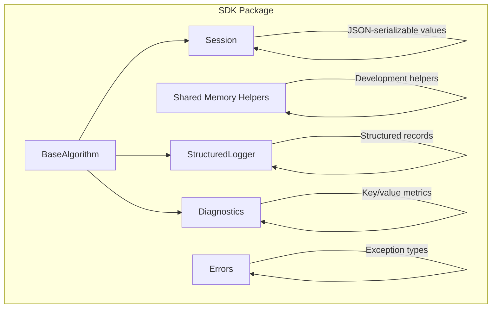
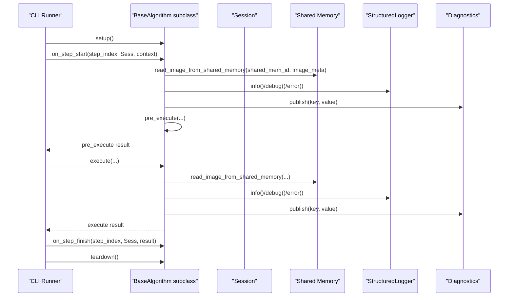
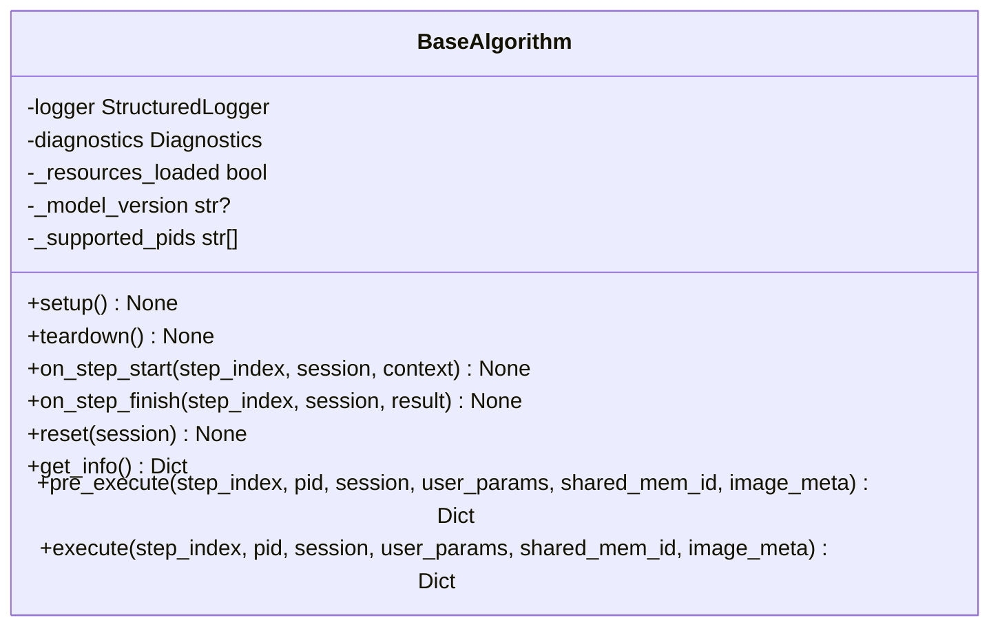
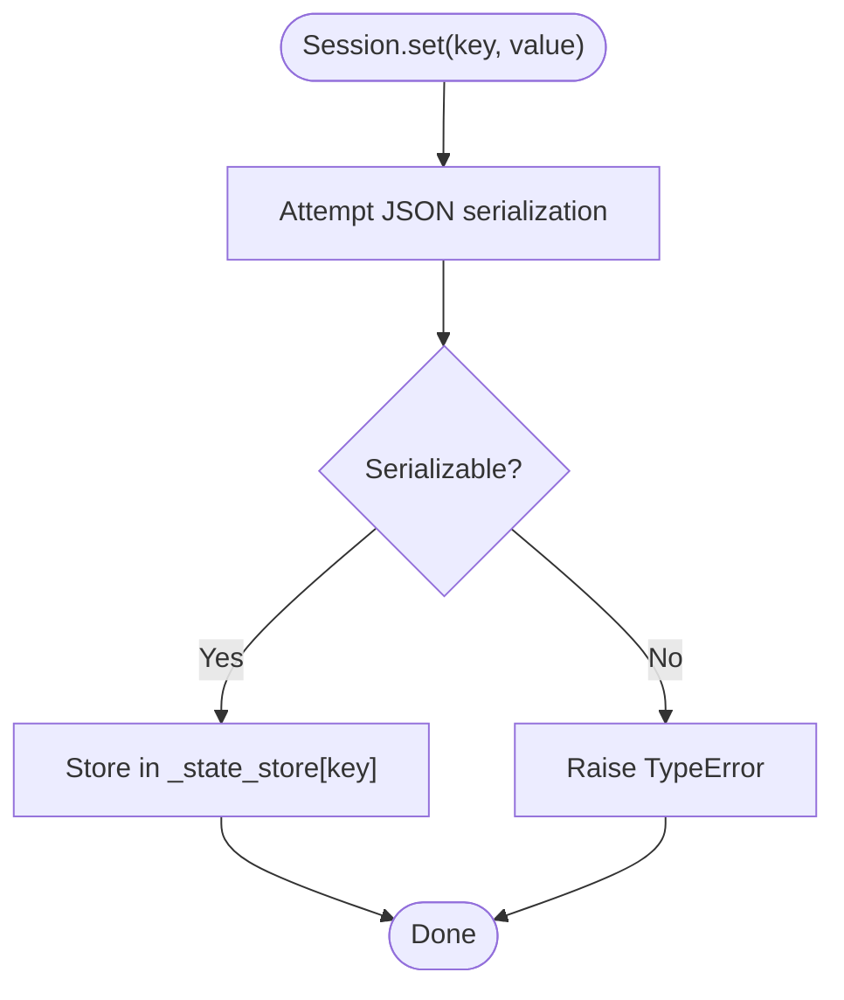
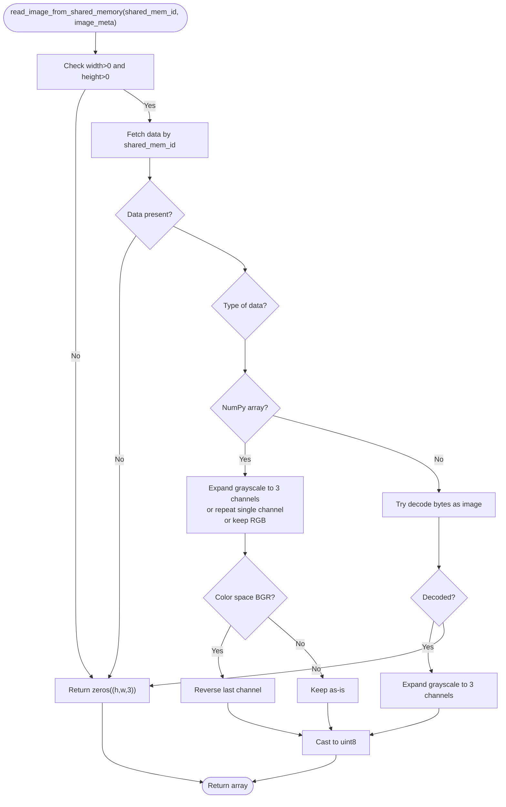
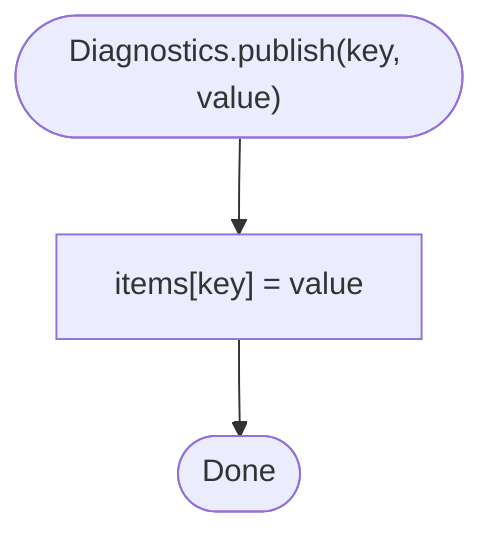
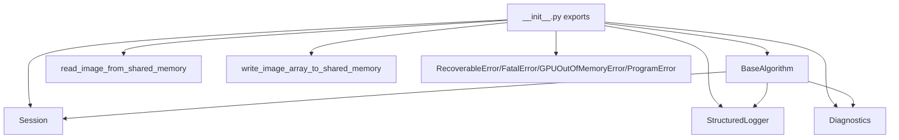

# Reference

<cite>
**Referenced Files in This Document**
- [base.py](file://procvision_algorithm_sdk/base.py)
- [session.py](file://procvision_algorithm_sdk/session.py)
- [shared_memory.py](file://procvision_algorithm_sdk/shared_memory.py)
- [logger.py](file://procvision_algorithm_sdk/logger.py)
- [diagnostics.py](file://procvision_algorithm_sdk/diagnostics.py)
- [errors.py](file://procvision_algorithm_sdk/errors.py)
- [__init__.py](file://procvision_algorithm_sdk/__init__.py)
- [cli.py](file://procvision_algorithm_sdk/cli.py)
- [test_base_algo.py](file://tests/test_base_algo.py)
- [test_session.py](file://tests/test_session.py)
- [test_shared_memory.py](file://tests/test_shared_memory.py)
- [README.md](file://README.md)
</cite>

## Table of Contents
1. [Introduction](#introduction)
2. [Project Structure](#project-structure)
3. [Core Components](#core-components)
4. [Architecture Overview](#architecture-overview)
5. [Detailed Component Analysis](#detailed-component-analysis)
6. [Dependency Analysis](#dependency-analysis)
7. [Performance Considerations](#performance-considerations)
8. [Troubleshooting Guide](#troubleshooting-guide)
9. [Conclusion](#conclusion)
10. [Appendices](#appendices)

## Introduction
This document provides comprehensive API documentation for the ProcVision Algorithm SDK. It covers all public interfaces exposed to algorithm developers, including BaseAlgorithm lifecycle hooks, Session state management, shared memory read/write helpers, StructuredLogger logging primitives, Diagnostics metrics publishing, and error types. It also includes usage examples, error conditions, and links to implementation files.

## Project Structure
The SDK exposes a minimal yet cohesive set of APIs:
- BaseAlgorithm: abstract base class defining the algorithm contract and lifecycle hooks.
- Session: in-memory key-value store with JSON-serializable value constraints and context propagation.
- Shared memory helpers: development-time utilities to simulate inter-process image sharing.
- StructuredLogger: structured logging with standardized fields.
- Diagnostics: in-memory metrics storage and retrieval.
- Errors: typed exceptions for recoverable and fatal conditions.
- CLI: developer runner and packaging utilities.

**Diagram sources**
- [base.py](file://procvision_algorithm_sdk/base.py#L1-L58)
- [session.py](file://procvision_algorithm_sdk/session.py#L1-L36)
- [shared_memory.py](file://procvision_algorithm_sdk/shared_memory.py#L1-L53)
- [logger.py](file://procvision_algorithm_sdk/logger.py#L1-L24)
- [diagnostics.py](file://procvision_algorithm_sdk/diagnostics.py#L1-L12)
- [errors.py](file://procvision_algorithm_sdk/errors.py#L1-L14)

**Section sources**
- [README.md](file://README.md#L1-L116)
- [__init__.py](file://procvision_algorithm_sdk/__init__.py#L1-L20)

## Core Components
This section documents the primary public classes and functions, including signatures, parameters, return types, descriptions, error conditions, and example usage locations.

### BaseAlgorithm
BaseAlgorithm defines the algorithm contract and lifecycle hooks. Implementations must override get_info, pre_execute, and execute. Optional hooks setup, teardown, on_step_start, on_step_finish, and reset are provided for resource management and step-scoped logic.

- Constructor
  - Signature: BaseAlgorithm()
  - Description: Initializes internal logger, diagnostics, and internal state flags.
  - Notes: Subclasses may set supported product identifiers and model metadata.
  - Example usage: See [DummyAlgo](file://tests/test_base_algo.py#L1-L65) implementation.

- setup()
  - Signature: setup() -> None
  - Description: Called once before any step execution. Use for global initialization.
  - Returns: None
  - Example usage: See [CLI smoke test](file://procvision_algorithm_sdk/cli.py#L1-L615).

- teardown()
  - Signature: teardown() -> None
  - Description: Called after all steps finish. Use for cleanup.
  - Returns: None
  - Example usage: See [CLI smoke test](file://procvision_algorithm_sdk/cli.py#L1-L615).

- on_step_start(step_index: int, session: Session, context: Dict[str, Any]) -> None
  - Description: Invoked at the beginning of a step. Use to prepare per-step resources or log step boundaries.
  - Parameters:
    - step_index: integer index of the current step.
    - session: Session instance containing id and context.
    - context: dictionary with step-specific context (e.g., trace identifiers).
  - Returns: None
  - Example usage: See [CLI smoke test](file://procvision_algorithm_sdk/cli.py#L1-L615).

- on_step_finish(step_index: int, session: Session, result: Dict[str, Any]) -> None
  - Description: Invoked after a step completes. Use to finalize per-step actions or diagnostics.
  - Parameters:
    - step_index: integer index of the current step.
    - session: Session instance.
    - result: dictionary returned by execute (may be empty if not a dict).
  - Returns: None
  - Example usage: See [CLI smoke test](file://procvision_algorithm_sdk/cli.py#L1-L615).

- reset(session: Session) -> None
  - Signature: reset(session: Session) -> None
  - Description: Resets algorithm state for a new run within the same session.
  - Parameters: session: Session instance.
  - Returns: None
  - Notes: Useful for multi-step pipelines or re-runs.

- get_info() -> Dict[str, Any]
  - Signature: get_info() -> Dict[str, Any]
  - Description: Returns algorithm metadata including name, version, description, supported_pids, and steps schema.
  - Returns: Dictionary with metadata fields.
  - Throws: Not applicable; must return a dictionary.
  - Example usage: See [DummyAlgo.get_info](file://tests/test_base_algo.py#L1-L65).

- pre_execute(step_index: int, pid: str, session: Session, user_params: Dict[str, Any], shared_mem_id: str, image_meta: Dict[str, Any]) -> Dict[str, Any]
  - Signature: pre_execute(...) -> Dict[str, Any]
  - Description: Validates inputs, prepares resources, and optionally reads image data from shared memory. Must return a dictionary with status and optional message/error_code/debug fields.
  - Parameters:
    - step_index: integer step index.
    - pid: product identifier string.
    - session: Session instance.
    - user_params: dictionary of user-provided parameters.
    - shared_mem_id: string identifier for shared memory region.
    - image_meta: dictionary with image metadata (width, height, timestamp_ms, camera_id).
  - Returns: Dictionary with keys including status and optional message/error_code/debug.
  - Error conditions:
    - Unsupported product id: return status "ERROR" with error_code and message.
    - Empty or invalid image data: return status "ERROR" with error_code and message.
  - Example usage: See [DummyAlgo.pre_execute](file://tests/test_base_algo.py#L1-L65).

- execute(step_index: int, pid: str, session: Session, user_params: Dict[str, Any], shared_mem_id: str, image_meta: Dict[str, Any]) -> Dict[str, Any]
  - Signature: execute(...) -> Dict[str, Any]
  - Description: Performs detection/inference and returns results. Business outcome is encoded in data.result_status (OK/NG). Optionally includes defect_rects and debug metrics.
  - Parameters: Same as pre_execute.
  - Returns: Dictionary with keys including status and optional data.result_status/ng_reason/defect_rects/debug.
  - Error conditions:
    - Empty or invalid image data: return status "ERROR" with error_code and message.
  - Example usage: See [DummyAlgo.execute](file://tests/test_base_algo.py#L1-L65).

**Section sources**
- [base.py](file://procvision_algorithm_sdk/base.py#L1-L58)
- [test_base_algo.py](file://tests/test_base_algo.py#L1-L65)
- [cli.py](file://procvision_algorithm_sdk/cli.py#L1-L615)

### Session
Session encapsulates per-run state and context. Values stored via set must be JSON serializable.

- Constructor
  - Signature: Session(id: str, context: Optional[Dict[str, Any]] = None)
  - Description: Creates a session with a unique id and optional context dictionary.
  - Parameters:
    - id: string identifier for the session.
    - context: optional dictionary of context fields.
  - Example usage: See [CLI smoke test](file://procvision_algorithm_sdk/cli.py#L1-L615).

- id: property -> str
  - Description: Read-only session identifier.
  - Returns: String id.

- context: property -> Dict[str, Any]
  - Description: Copy of the context dictionary.
  - Returns: Dictionary copy.

- get(key: str, default: Any = None) -> Any
  - Description: Retrieves a stored value by key.
  - Parameters:
    - key: string key.
    - default: default value if key is absent.
  - Returns: Stored value or default.

- set(key: str, value: Any) -> None
  - Description: Stores a value under the given key.
  - Parameters:
    - key: string key.
    - value: value to store (must be JSON serializable).
  - Raises: TypeError if value is not JSON serializable.
  - Example usage: See [Session tests](file://tests/test_session.py#L1-L24).

- delete(key: str) -> bool
  - Description: Deletes a key if present.
  - Parameters: key: string key.
  - Returns: True if deleted, False otherwise.

- exists(key: str) -> bool
  - Description: Checks if a key exists.
  - Parameters: key: string key.
  - Returns: Boolean indicating presence.

**Section sources**
- [session.py](file://procvision_algorithm_sdk/session.py#L1-L36)
- [test_session.py](file://tests/test_session.py#L1-L24)

### Shared Memory Functions
These functions provide development-time helpers to simulate inter-process image sharing. They operate on an in-memory dictionary keyed by shared_mem_id.

- dev_write_image_to_shared_memory(shared_mem_id: str, image_bytes: bytes) -> None
  - Description: Writes raw bytes (e.g., JPEG) into shared memory for development runs.
  - Parameters:
    - shared_mem_id: string identifier.
    - image_bytes: bytes representing an image.
  - Notes: Intended for development; not suitable for production IPC.

- write_image_array_to_shared_memory(shared_mem_id: str, image_array: Any) -> None
  - Description: Writes a NumPy array into shared memory.
  - Parameters:
    - shared_mem_id: string identifier.
    - image_array: NumPy array (supports grayscale and RGB).
  - Notes: Intended for development; not suitable for production IPC.

- read_image_from_shared_memory(shared_mem_id: str, image_meta: Dict[str, Any]) -> Any
  - Description: Reads image data from shared memory and converts to a standardized 3-channel uint8 array. If image_meta lacks width/height or data is unavailable, returns a zero-filled array with shape (height, width, 3).
  - Parameters:
    - shared_mem_id: string identifier.
    - image_meta: dictionary with keys width, height, timestamp_ms, camera_id.
  - Returns: NumPy array of shape (height, width, 3) with dtype uint8.
  - Behavior:
    - If width or height non-positive, returns zeros.
    - If stored data is a NumPy array:
      - Grayscale: expanded to 3 channels.
      - Single-channel 3D: repeated to 3 channels.
      - RGB 3D: preserved.
      - Otherwise: treated as invalid.
    - If stored data is bytes, attempts to decode as an image; expands to 3 channels if grayscale.
    - On failure, returns zeros with requested dimensions.
  - Example usage: See [DummyAlgo pre_execute/execute](file://tests/test_base_algo.py#L1-L65) and [Shared memory fallback test](file://tests/test_shared_memory.py#L1-L16).

**Section sources**
- [shared_memory.py](file://procvision_algorithm_sdk/shared_memory.py#L1-L53)
- [test_shared_memory.py](file://tests/test_shared_memory.py#L1-L16)
- [test_base_algo.py](file://tests/test_base_algo.py#L1-L65)

### StructuredLogger
StructuredLogger emits structured log records with standardized fields.

- Constructor
  - Signature: StructuredLogger(sink: Optional[Any] = None)
  - Description: Initializes logger with an optional output sink (defaults to stderr).
  - Parameters:
    - sink: optional writable object (e.g., sys.stderr).

- info(message: str, **fields: Any) -> None
  - Description: Emits an info-level record with message and additional fields.
  - Fields include level and timestamp_ms.

- debug(message: str, **fields: Any) -> None
  - Description: Emits a debug-level record with message and additional fields.

- error(message: str, **fields: Any) -> None
  - Description: Emits an error-level record with message and additional fields.

Log record structure:
- level: string ("info", "debug", "error").
- timestamp_ms: integer milliseconds since epoch.
- message: string human-readable message.
- Additional fields: arbitrary key-value pairs passed as keyword arguments.

**Section sources**
- [logger.py](file://procvision_algorithm_sdk/logger.py#L1-L24)

### Diagnostics
Diagnostics provides a simple in-memory key/value store for metrics and diagnostic data.

- Constructor
  - Signature: Diagnostics()
  - Description: Initializes an empty items dictionary.

- publish(key: str, value: Any) -> None
  - Description: Stores a value under the given key.

- get() -> Dict[str, Any]
  - Description: Returns a shallow copy of the items dictionary.

**Section sources**
- [diagnostics.py](file://procvision_algorithm_sdk/diagnostics.py#L1-L12)

### Errors
Typed exceptions for algorithm error handling.

- RecoverableError
  - Description: Indicates an error condition that can be recovered from.

- FatalError
  - Description: Indicates a fatal error that stops execution.

- GPUOutOfMemoryError
  - Description: Indicates out-of-memory on GPU devices.

- ProgramError
  - Description: General programmatic error.

**Section sources**
- [errors.py](file://procvision_algorithm_sdk/errors.py#L1-L14)

## Architecture Overview
The SDK orchestrates algorithm execution through BaseAlgorithm lifecycle hooks, with Session providing runtime state and context, and shared memory helpers enabling image transfer during development. StructuredLogger and Diagnostics support observability.

**Diagram sources**
- [cli.py](file://procvision_algorithm_sdk/cli.py#L1-L615)
- [base.py](file://procvision_algorithm_sdk/base.py#L1-L58)
- [session.py](file://procvision_algorithm_sdk/session.py#L1-L36)
- [shared_memory.py](file://procvision_algorithm_sdk/shared_memory.py#L1-L53)
- [logger.py](file://procvision_algorithm_sdk/logger.py#L1-L24)
- [diagnostics.py](file://procvision_algorithm_sdk/diagnostics.py#L1-L12)

## Detailed Component Analysis

### BaseAlgorithm Class Diagram

**Diagram sources**
- [base.py](file://procvision_algorithm_sdk/base.py#L1-L58)

**Section sources**
- [base.py](file://procvision_algorithm_sdk/base.py#L1-L58)

### Session Methods Flow

**Diagram sources**
- [session.py](file://procvision_algorithm_sdk/session.py#L1-L36)

**Section sources**
- [session.py](file://procvision_algorithm_sdk/session.py#L1-L36)
- [test_session.py](file://tests/test_session.py#L1-L24)

### Shared Memory Read Flow

**Diagram sources**
- [shared_memory.py](file://procvision_algorithm_sdk/shared_memory.py#L1-L53)
- [test_shared_memory.py](file://tests/test_shared_memory.py#L1-L16)

**Section sources**
- [shared_memory.py](file://procvision_algorithm_sdk/shared_memory.py#L1-L53)
- [test_shared_memory.py](file://tests/test_shared_memory.py#L1-L16)

### Diagnostics Publish Flow

**Diagram sources**
- [diagnostics.py](file://procvision_algorithm_sdk/diagnostics.py#L1-L12)

**Section sources**
- [diagnostics.py](file://procvision_algorithm_sdk/diagnostics.py#L1-L12)

## Dependency Analysis
Public exports and their relationships:

**Diagram sources**
- [__init__.py](file://procvision_algorithm_sdk/__init__.py#L1-L20)
- [base.py](file://procvision_algorithm_sdk/base.py#L1-L58)
- [session.py](file://procvision_algorithm_sdk/session.py#L1-L36)
- [shared_memory.py](file://procvision_algorithm_sdk/shared_memory.py#L1-L53)
- [logger.py](file://procvision_algorithm_sdk/logger.py#L1-L24)
- [diagnostics.py](file://procvision_algorithm_sdk/diagnostics.py#L1-L12)
- [errors.py](file://procvision_algorithm_sdk/errors.py#L1-L14)

**Section sources**
- [__init__.py](file://procvision_algorithm_sdk/__init__.py#L1-L20)

## Performance Considerations
- Prefer lightweight pre_execute checks and avoid heavy I/O in hot paths.
- Use Diagnostics to measure latency and throughput; emit only necessary metrics.
- For image processing, minimize conversions; ensure image_meta dimensions match actual data to avoid fallback costs.
- Keep Session values small and JSON-serializable to avoid serialization overhead.

## Troubleshooting Guide
- BaseAlgorithm pre_execute/execute returns ERROR:
  - Verify pid is included in supported_pids from get_info.
  - Confirm shared_mem_id and image_meta are correct and image data is readable.
  - See [DummyAlgo error handling](file://tests/test_base_algo.py#L1-L65).
- Session.set raises TypeError:
  - Ensure the value is JSON serializable.
  - See [Session tests](file://tests/test_session.py#L1-L24).
- read_image_from_shared_memory returns zeros:
  - Check width/height in image_meta are positive.
  - Verify shared_mem_id contains valid image data.
  - See [Shared memory fallback test](file://tests/test_shared_memory.py#L1-L16).
- Diagnostics.get returns unexpected data:
  - Ensure publish was called with the expected key.
  - See [Diagnostics tests](file://procvision_algorithm_sdk/diagnostics.py#L1-L12).

**Section sources**
- [test_base_algo.py](file://tests/test_base_algo.py#L1-L65)
- [test_session.py](file://tests/test_session.py#L1-L24)
- [test_shared_memory.py](file://tests/test_shared_memory.py#L1-L16)
- [diagnostics.py](file://procvision_algorithm_sdk/diagnostics.py#L1-L12)

## Conclusion
The ProcVision Algorithm SDK provides a focused, extensible interface for algorithm authors. BaseAlgorithm defines a clear lifecycle and execution contract, Session offers safe state management, shared memory helpers enable development-time image simulation, and StructuredLogger/Diagnostics streamline observability. Typed errors allow precise error handling. Together, these components support robust, portable algorithm development aligned with platform specifications.

## Appendices

### API Usage Examples (by reference)
- BaseAlgorithm.get_info: [DummyAlgo.get_info](file://tests/test_base_algo.py#L1-L65)
- BaseAlgorithm.pre_execute: [DummyAlgo.pre_execute](file://tests/test_base_algo.py#L1-L65)
- BaseAlgorithm.execute: [DummyAlgo.execute](file://tests/test_base_algo.py#L1-L65)
- Session.set/get/delete/exists: [Session tests](file://tests/test_session.py#L1-L24)
- Shared memory helpers: [Shared memory tests](file://tests/test_shared_memory.py#L1-L16)
- StructuredLogger.info/debug/error: [Logger tests](file://procvision_algorithm_sdk/logger.py#L1-L24)
- Diagnostics.publish/get: [Diagnostics tests](file://procvision_algorithm_sdk/diagnostics.py#L1-L12)