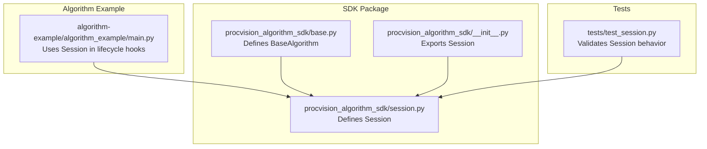
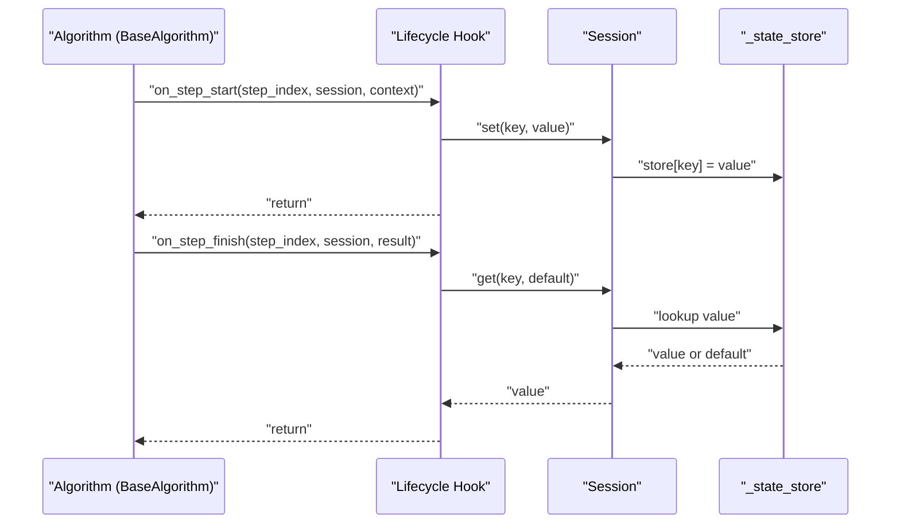
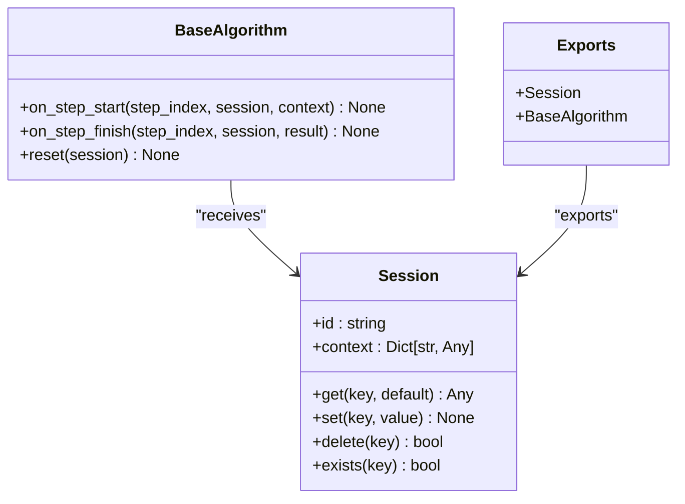

# Session API Reference

<cite>
**Referenced Files in This Document**
- [session.py](file://procvision_algorithm_sdk/session.py)
- [test_session.py](file://tests/test_session.py)
- [algorithm_example/main.py](file://algorithm-example/algorithm_example/main.py)
- [base.py](file://procvision_algorithm_sdk/base.py)
- [__init__.py](file://procvision_algorithm_sdk/__init__.py)
- [algorithm_dev_tutorial.md](file://algorithm_dev_tutorial.md)
</cite>

## Table of Contents
1. [Introduction](#introduction)
2. [Project Structure](#project-structure)
3. [Core Components](#core-components)
4. [Architecture Overview](#architecture-overview)
5. [Detailed Component Analysis](#detailed-component-analysis)
6. [Dependency Analysis](#dependency-analysis)
7. [Performance Considerations](#performance-considerations)
8. [Troubleshooting Guide](#troubleshooting-guide)
9. [Conclusion](#conclusion)
10. [Appendices](#appendices)

## Introduction
This document provides a comprehensive API reference for the Session class used for state management during algorithm execution. It covers constructor parameters, property semantics, state manipulation methods, JSON serialization constraints, immutability guarantees, and practical usage patterns. It also highlights thread-safety considerations and performance implications for large state objects.

## Project Structure
The Session class resides in the SDK package and is consumed by algorithms that extend the BaseAlgorithm interface. Example usage appears in the algorithm example module and is validated by unit tests.

**Diagram sources**
- [session.py](file://procvision_algorithm_sdk/session.py#L1-L36)
- [base.py](file://procvision_algorithm_sdk/base.py#L1-L58)
- [__init__.py](file://procvision_algorithm_sdk/__init__.py#L1-L20)
- [algorithm_example/main.py](file://algorithm-example/algorithm_example/main.py#L1-L150)
- [test_session.py](file://tests/test_session.py#L1-L24)

**Section sources**
- [session.py](file://procvision_algorithm_sdk/session.py#L1-L36)
- [base.py](file://procvision_algorithm_sdk/base.py#L1-L58)
- [__init__.py](file://procvision_algorithm_sdk/__init__.py#L1-L20)
- [algorithm_example/main.py](file://algorithm-example/algorithm_example/main.py#L1-L150)
- [test_session.py](file://tests/test_session.py#L1-L24)

## Core Components
- Session: Lightweight state container with an immutable context copy and a mutable key-value store for cross-step persistence.
- BaseAlgorithm: Provides lifecycle hooks that receive a Session instance for state access and manipulation.

Key responsibilities:
- Session: Store and retrieve step-scoped state, enforce JSON-serializability for values, and expose a read-only copy of the initial context.
- BaseAlgorithm: Orchestrates algorithm execution and passes a Session instance to lifecycle hooks.

**Section sources**
- [session.py](file://procvision_algorithm_sdk/session.py#L1-L36)
- [base.py](file://procvision_algorithm_sdk/base.py#L1-L58)

## Architecture Overview
The Session class integrates with BaseAlgorithm lifecycle hooks to enable stateful algorithm execution across steps.

**Diagram sources**
- [base.py](file://procvision_algorithm_sdk/base.py#L1-L58)
- [session.py](file://procvision_algorithm_sdk/session.py#L1-L36)

## Detailed Component Analysis

### Constructor and Properties
- Constructor parameters
  - id: Unique identifier for the session. Type: string. Behavior: stored as-is and exposed via the id property.
  - context: Optional dictionary passed to the algorithm. Type: Optional[Dict[str, Any]]. Behavior: stored internally; the context property returns a shallow copy to prevent external mutation.
- Properties
  - id: Returns the session’s identifier string.
  - context: Returns a shallow copy of the internal context dictionary. Mutating the returned dictionary does not affect the internal context.

Immutable copy behavior:
- The context property returns a new dictionary object, ensuring external modifications do not alter the internal state.

**Section sources**
- [session.py](file://procvision_algorithm_sdk/session.py#L1-L36)
- [test_session.py](file://tests/test_session.py#L1-L24)

### State Manipulation Methods

#### get(key, default=None) -> Any
- Purpose: Retrieve a value by key from the session’s internal state store.
- Parameters:
  - key: string key.
  - default: fallback value if key is absent.
- Returns: Stored value or default.
- Complexity: O(1) average-case lookup.

Usage pattern:
- Access persisted values across steps, e.g., timestamps or computed metrics.

**Section sources**
- [session.py](file://procvision_algorithm_sdk/session.py#L1-L36)
- [algorithm_example/main.py](file://algorithm-example/algorithm_example/main.py#L1-L150)

#### set(key, value) -> None
- Purpose: Persist a value under the given key.
- Constraints:
  - Value must be JSON-serializable. The implementation validates this by attempting to serialize the value with JSON. If serialization fails, a TypeError is raised.
- Parameters:
  - key: string key.
  - value: any JSON-serializable value.
- Raises:
  - TypeError: if value is not JSON-serializable.
- Complexity: O(1) average-case insertion plus serialization cost proportional to value size.

JSON serialization constraint examples:
- Valid types: strings, numbers, booleans, lists, dicts, null.
- Invalid types: sets, frozensets, custom objects without custom encoder, file-like objects, etc.

Behavioral note:
- The set operation stores a reference to the provided value. If the value is a mutable container (e.g., list or dict), mutating it externally after setting it will mutate the stored value. To avoid unintended side effects, pass immutable copies or ensure defensive copying.

**Section sources**
- [session.py](file://procvision_algorithm_sdk/session.py#L1-L36)
- [test_session.py](file://tests/test_session.py#L1-L24)

#### delete(key) -> bool
- Purpose: Remove a key from the state store.
- Parameters:
  - key: string key.
- Returns: True if the key existed and was deleted; False otherwise.
- Complexity: O(1) average-case deletion.

Usage pattern:
- Clear temporary state at the end of a step or upon reset.

**Section sources**
- [session.py](file://procvision_algorithm_sdk/session.py#L1-L36)
- [algorithm_example/main.py](file://algorithm-example/algorithm_example/main.py#L1-L150)

#### exists(key) -> bool
- Purpose: Check whether a key exists in the state store.
- Parameters:
  - key: string key.
- Returns: True if present; False otherwise.
- Complexity: O(1) average-case membership test.

**Section sources**
- [session.py](file://procvision_algorithm_sdk/session.py#L1-L36)
- [test_session.py](file://tests/test_session.py#L1-L24)

### Practical Usage Patterns
- Storing intermediate results:
  - Persist computed metrics or metadata during on_step_start/on_step_finish for later retrieval.
- Configuration and execution state:
  - Store derived parameters or flags that influence subsequent steps.
- Cross-step persistence:
  - Values set in one step are available in subsequent steps until deleted.

Example references:
- Setting a timestamp in a lifecycle hook and retrieving it later for latency computation.
- Deleting keys during reset to clean up transient state.

**Section sources**
- [algorithm_example/main.py](file://algorithm-example/algorithm_example/main.py#L1-L150)
- [test_session.py](file://tests/test_session.py#L1-L24)

### Thread-Safety Considerations
- The Session class is not designed with thread-safety guarantees. If multiple threads access the same Session instance concurrently, race conditions may occur during set/get/delete operations.
- Recommendation:
  - Ensure single-threaded access to a Session instance within a process.
  - If multi-threading is required, synchronize access externally or use separate Session instances per thread.

**Section sources**
- [session.py](file://procvision_algorithm_sdk/session.py#L1-L36)

### Performance Implications of Large State Objects
- Serialization cost:
  - The set method performs JSON serialization to validate serializability. Large or deeply nested values incur higher CPU and memory overhead during set.
- Memory footprint:
  - Values are stored by reference. Large mutable containers increase memory usage and risk unintended mutations if modified after storage.
- Recommendations:
  - Prefer compact, primitive types where possible.
  - Use smaller, focused dictionaries instead of monolithic structures.
  - Delete large temporary values promptly to free memory.

**Section sources**
- [session.py](file://procvision_algorithm_sdk/session.py#L1-L36)

## Dependency Analysis
Session is used by BaseAlgorithm lifecycle hooks and is exported by the SDK package.

**Diagram sources**
- [session.py](file://procvision_algorithm_sdk/session.py#L1-L36)
- [base.py](file://procvision_algorithm_sdk/base.py#L1-L58)
- [__init__.py](file://procvision_algorithm_sdk/__init__.py#L1-L20)

**Section sources**
- [session.py](file://procvision_algorithm_sdk/session.py#L1-L36)
- [base.py](file://procvision_algorithm_sdk/base.py#L1-L58)
- [__init__.py](file://procvision_algorithm_sdk/__init__.py#L1-L20)

## Performance Considerations
- Validation overhead: Each set triggers JSON serialization to validate type compatibility. For large payloads, consider batching or deferring persistence.
- Memory pressure: Mutable containers stored in session can grow large; periodically prune unnecessary entries.
- Lookup and mutation: get, set, delete, and exists operate in constant time on average; however, frequent mutations in tight loops can still impact throughput.

[No sources needed since this section provides general guidance]

## Troubleshooting Guide
Common issues and resolutions:
- TypeError on set with non-JSON-serializable value:
  - Symptom: set raises TypeError indicating the value must be JSON-serializable.
  - Resolution: Convert to a JSON-compatible type (e.g., replace sets with lists, encode binary data appropriately).
- Unexpected mutations after set:
  - Symptom: Modifying a mutable value after setting it affects the stored value.
  - Resolution: Pass a copy of the value or ensure immutability before setting.
- Context mutation appears to affect internal state:
  - Symptom: Changes to the dictionary returned by context seem to persist.
  - Resolution: Remember that context returns a shallow copy; mutate the copy, not the original context dictionary.

Validation references:
- Unit tests demonstrate successful get/set/delete/exists operations and the TypeError for non-serializable values.

**Section sources**
- [session.py](file://procvision_algorithm_sdk/session.py#L1-L36)
- [test_session.py](file://tests/test_session.py#L1-L24)

## Conclusion
The Session class provides a simple, efficient mechanism for cross-step state persistence in algorithm execution. Its JSON-serialization requirement ensures portability and platform interoperability. By adhering to the documented constraints—immutable context copy, JSON-serializability, and careful handling of large state objects—developers can reliably manage intermediate results, configuration, and execution state across algorithm steps.

[No sources needed since this section summarizes without analyzing specific files]

## Appendices

### API Summary
- Constructor: Session(id: str, context: Optional[Dict[str, Any]] = None)
- Properties:
  - id: str
  - context: Dict[str, Any] (shallow copy)
- Methods:
  - get(key: str, default: Any = None) -> Any
  - set(key: str, value: Any) -> None
  - delete(key: str) -> bool
  - exists(key: str) -> bool

**Section sources**
- [session.py](file://procvision_algorithm_sdk/session.py#L1-L36)
- [algorithm_dev_tutorial.md](file://algorithm_dev_tutorial.md#L96-L101)