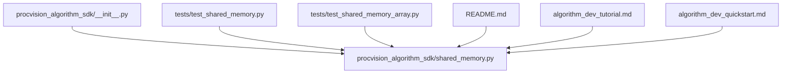
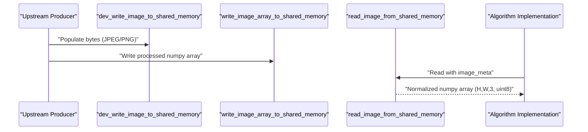
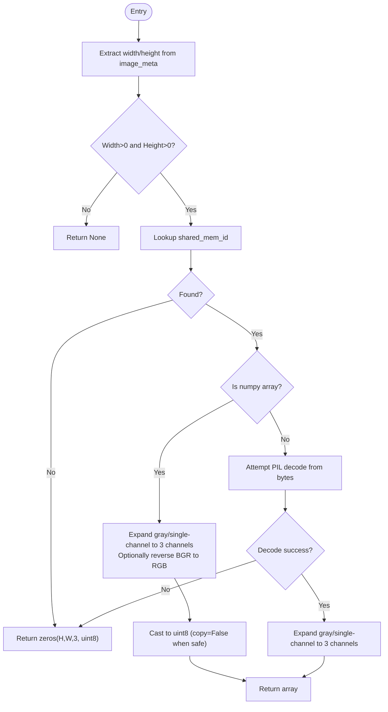
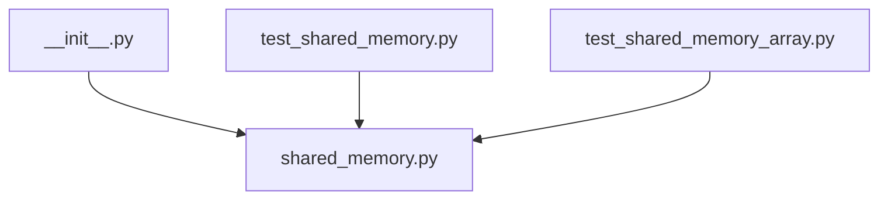

# Shared Memory API Reference

<cite>
**Referenced Files in This Document**
- [shared_memory.py](file://procvision_algorithm_sdk/shared_memory.py)
- [__init__.py](file://procvision_algorithm_sdk/__init__.py)
- [test_shared_memory.py](file://tests/test_shared_memory.py)
- [test_shared_memory_array.py](file://tests/test_shared_memory_array.py)
- [README.md](file://README.md)
- [algorithm_dev_tutorial.md](file://algorithm_dev_tutorial.md)
- [algorithm_dev_quickstart.md](file://algorithm_dev_quickstart.md)
</cite>

## Table of Contents
1. [Introduction](#introduction)
2. [Project Structure](#project-structure)
3. [Core Components](#core-components)
4. [Architecture Overview](#architecture-overview)
5. [Detailed Component Analysis](#detailed-component-analysis)
6. [Dependency Analysis](#dependency-analysis)
7. [Performance Considerations](#performance-considerations)
8. [Troubleshooting Guide](#troubleshooting-guide)
9. [Conclusion](#conclusion)
10. [Appendices](#appendices)

## Introduction
This document provides API documentation for shared memory functions that enable efficient image data transfer between upstream producers and algorithm implementations. It focuses on:
- Reading images from shared memory into numpy arrays
- Writing processed images back to shared memory
- Development/testing helpers for populating shared memory
It also defines the image metadata schema, expected behaviors, error conditions, and performance best practices.

## Project Structure
The shared memory APIs live in the SDK package and are exposed via the public module interface. Tests demonstrate expected behavior and edge cases.

**Diagram sources**
- [shared_memory.py](file://procvision_algorithm_sdk/shared_memory.py#L1-L53)
- [__init__.py](file://procvision_algorithm_sdk/__init__.py#L1-L19)
- [test_shared_memory.py](file://tests/test_shared_memory.py#L1-L16)
- [test_shared_memory_array.py](file://tests/test_shared_memory_array.py#L1-L39)
- [README.md](file://README.md#L1-L116)
- [algorithm_dev_tutorial.md](file://algorithm_dev_tutorial.md#L103-L127)
- [algorithm_dev_quickstart.md](file://algorithm_dev_quickstart.md#L89-L120)

**Section sources**
- [shared_memory.py](file://procvision_algorithm_sdk/shared_memory.py#L1-L53)
- [__init__.py](file://procvision_algorithm_sdk/__init__.py#L1-L19)

## Core Components
This section documents the primary shared memory APIs and their contracts.

- read_image_from_shared_memory(shared_mem_id: str, image_meta: dict) -> numpy.ndarray
  - Purpose: Retrieve an image from shared memory and return a numpy array compatible with the provided metadata.
  - Parameters:
    - shared_mem_id: string identifier used to locate the stored image.
    - image_meta: dictionary containing at least width and height; optional color_space controls channel order.
  - Returns: numpy array with shape matching image_meta and dtype aligned to the expected output format.
  - Behavior:
    - If width or height are non-positive, returns None.
    - If data exists as a numpy array, it is normalized to 3-channel RGB uint8 with automatic conversions:
      - Gray (H,W) and single-channel (H,W,1) are expanded to 3 channels.
      - If color_space is "BGR", channel order is reversed to "RGB".
    - If data exists as bytes, attempts to decode as an image and normalize to 3 channels.
    - If no data or decoding fails, returns a zero-filled array of shape (height, width, 3) with dtype uint8.
  - Notes:
    - The returned array may be a view or copy depending on internal transformations; callers should treat it as read-only unless they explicitly manage ownership.

- write_image_array_to_shared_memory(shared_mem_id: str, image_array: numpy.ndarray) -> None
  - Purpose: Write a processed numpy array back to shared memory for downstream consumers.
  - Parameters:
    - shared_mem_id: string identifier used to store the array.
    - image_array: numpy array representing an image (H,W,3) or grayscale (H,W)/(H,W,1) supported by normalization rules.
  - Behavior:
    - Stores the array under the given identifier for later retrieval via read_image_from_shared_memory.

- dev_write_image_to_shared_memory(shared_mem_id: str, image_bytes: bytes) -> None
  - Purpose: Populate shared memory with raw image bytes (e.g., JPEG/PNG) for development and testing.
  - Parameters:
    - shared_mem_id: string identifier used to store the bytes.
    - image_bytes: raw bytes representing an image.
  - Behavior:
    - Stores the bytes under the given identifier for later decoding by read_image_from_shared_memory.

- dev_clear_shared_memory(shared_mem_id: str) -> None
  - Purpose: Remove an entry from shared memory during development/testing.
  - Parameters:
    - shared_mem_id: string identifier to remove.

**Section sources**
- [shared_memory.py](file://procvision_algorithm_sdk/shared_memory.py#L1-L53)
- [test_shared_memory.py](file://tests/test_shared_memory.py#L1-L16)
- [test_shared_memory_array.py](file://tests/test_shared_memory_array.py#L1-L39)
- [algorithm_dev_tutorial.md](file://algorithm_dev_tutorial.md#L103-L127)
- [algorithm_dev_quickstart.md](file://algorithm_dev_quickstart.md#L89-L120)

## Architecture Overview
The shared memory APIs operate against an internal development store. The read path supports both numpy arrays and raw bytes, while the write path supports arrays and bytes. The read function normalizes inputs to a consistent output format.

**Diagram sources**
- [shared_memory.py](file://procvision_algorithm_sdk/shared_memory.py#L1-L53)

## Detailed Component Analysis

### read_image_from_shared_memory
- Input validation:
  - Requires positive width and height; otherwise returns None.
- Data source resolution:
  - If stored as numpy array:
    - Expand gray/single-channel to 3 channels.
    - Optionally convert BGR to RGB based on color_space.
    - Cast to uint8 without copying when safe.
  - If stored as bytes:
    - Attempt to decode via PIL; normalize to 3 channels.
- Fallback:
  - Return zero-filled array of requested shape and dtype when no data or decoding fails.

**Diagram sources**
- [shared_memory.py](file://procvision_algorithm_sdk/shared_memory.py#L15-L53)

**Section sources**
- [shared_memory.py](file://procvision_algorithm_sdk/shared_memory.py#L15-L53)
- [test_shared_memory.py](file://tests/test_shared_memory.py#L1-L16)
- [test_shared_memory_array.py](file://tests/test_shared_memory_array.py#L1-L39)

### write_image_array_to_shared_memory
- Stores a numpy array under the given identifier for later retrieval.
- Supports arrays with shapes (H,W,3), (H,W), and (H,W,1) via normalization rules in the read path.

**Section sources**
- [shared_memory.py](file://procvision_algorithm_sdk/shared_memory.py#L12-L14)
- [test_shared_memory_array.py](file://tests/test_shared_memory_array.py#L1-L39)

### dev_write_image_to_shared_memory and dev_clear_shared_memory
- Development helpers to populate or clear entries in the internal store.
- Useful for testing and local simulation.

**Section sources**
- [shared_memory.py](file://procvision_algorithm_sdk/shared_memory.py#L6-L11)
- [test_shared_memory.py](file://tests/test_shared_memory.py#L1-L16)

## Dependency Analysis
The public API is re-exported from the package’s init module, and tests exercise the core functions.

**Diagram sources**
- [__init__.py](file://procvision_algorithm_sdk/__init__.py#L1-L19)
- [shared_memory.py](file://procvision_algorithm_sdk/shared_memory.py#L1-L53)
- [test_shared_memory.py](file://tests/test_shared_memory.py#L1-L16)
- [test_shared_memory_array.py](file://tests/test_shared_memory_array.py#L1-L39)

**Section sources**
- [__init__.py](file://procvision_algorithm_sdk/__init__.py#L1-L19)
- [shared_memory.py](file://procvision_algorithm_sdk/shared_memory.py#L1-L53)

## Performance Considerations
- Zero-copy semantics:
  - The read function may return a view when casting to uint8 is safe; treat the returned array as read-only to avoid unintended side effects.
- Normalization overhead:
  - Expanding grayscale to 3 channels and reversing BGR to RGB introduce minimal overhead; avoid unnecessary repeated reads.
- Memory ownership:
  - The internal store holds references to arrays and bytes. Ownership remains with the caller; the store does not manage lifecycle.
- Cleanup:
  - Use dev_clear_shared_memory to remove entries during development/testing to prevent accidental reuse.

[No sources needed since this section provides general guidance]

## Troubleshooting Guide
Common issues and resolutions:
- Invalid shared memory ID:
  - Symptom: Returned array is zeros with requested shape.
  - Cause: No data stored under the given identifier.
  - Resolution: Ensure the producer has written data or development helper populated the identifier.
- Malformed image_meta:
  - Symptom: read_image_from_shared_memory returns None.
  - Cause: width or height are non-positive.
  - Resolution: Provide valid width and height in image_meta.
- Type mismatch:
  - Symptom: Unexpected channel count or color order.
  - Cause: Input array was grayscale or BGR; read function normalizes to 3-channel RGB.
  - Resolution: Confirm color_space in image_meta and verify input shape.
- Decoding failure:
  - Symptom: Returned zeros despite bytes present.
  - Cause: Bytes could not be decoded as an image.
  - Resolution: Verify image_bytes represent a valid JPEG/PNG.

**Section sources**
- [shared_memory.py](file://procvision_algorithm_sdk/shared_memory.py#L15-L53)
- [test_shared_memory.py](file://tests/test_shared_memory.py#L1-L16)
- [test_shared_memory_array.py](file://tests/test_shared_memory_array.py#L1-L39)

## Conclusion
The shared memory APIs provide a simple, robust mechanism for transferring images between upstream producers and algorithm implementations. They support both raw bytes and numpy arrays, normalize inputs to a consistent output format, and offer development helpers for testing. By following the metadata schema and error-handling guidance, developers can implement efficient and reliable image pipelines.

[No sources needed since this section summarizes without analyzing specific files]

## Appendices

### A. API Definitions and Contracts
- read_image_from_shared_memory(shared_mem_id: str, image_meta: dict) -> numpy.ndarray
  - Returns: numpy array with shape (height, width, 3) and dtype uint8.
  - Errors: Returns None when width or height are non-positive; returns zeros when no data or decoding fails.
- write_image_array_to_shared_memory(shared_mem_id: str, image_array: numpy.ndarray) -> None
  - Accepts: numpy arrays with shapes (H,W,3), (H,W), or (H,W,1).
- dev_write_image_to_shared_memory(shared_mem_id: str, image_bytes: bytes) -> None
  - Accepts: raw bytes representing an image (e.g., JPEG/PNG).
- dev_clear_shared_memory(shared_mem_id: str) -> None
  - Removes an entry from the internal store.

**Section sources**
- [shared_memory.py](file://procvision_algorithm_sdk/shared_memory.py#L1-L53)

### B. image_meta Schema
- Required keys:
  - width: integer > 0
  - height: integer > 0
- Optional keys:
  - color_space: string, either "RGB" or "BGR". Defaults to "RGB".
- Additional keys:
  - timestamp_ms: integer (development/testing context)
  - camera_id: string (development/testing context)

Behavioral notes:
- color_space affects channel order normalization; BGR inputs are converted to RGB.
- Other keys may be present but are not consumed by the read function.

**Section sources**
- [shared_memory.py](file://procvision_algorithm_sdk/shared_memory.py#L15-L53)
- [README.md](file://README.md#L1-L116)
- [algorithm_dev_tutorial.md](file://algorithm_dev_tutorial.md#L103-L127)
- [algorithm_dev_quickstart.md](file://algorithm_dev_quickstart.md#L89-L120)

### C. Example Workflows
- Reading from shared memory:
  - Steps:
    1. Prepare image_meta with width, height, and optional color_space.
    2. Call read_image_from_shared_memory with shared_mem_id and image_meta.
    3. Validate returned array shape and dtype.
- Writing processed images back:
  - Steps:
    1. Produce a numpy array (H,W,3) or compatible grayscale shape.
    2. Call write_image_array_to_shared_memory with shared_mem_id and array.
- Development/testing:
  - Steps:
    1. Populate bytes via dev_write_image_to_shared_memory.
    2. Alternatively, write a numpy array via write_image_array_to_shared_memory.
    3. Clear entries via dev_clear_shared_memory when done.

References to tests demonstrating expected behavior:
- Reading fallback behavior: [test_shared_memory.py](file://tests/test_shared_memory.py#L1-L16)
- Array passthrough and BGR conversion: [test_shared_memory_array.py](file://tests/test_shared_memory_array.py#L1-L39)

**Section sources**
- [test_shared_memory.py](file://tests/test_shared_memory.py#L1-L16)
- [test_shared_memory_array.py](file://tests/test_shared_memory_array.py#L1-L39)
- [algorithm_dev_tutorial.md](file://algorithm_dev_tutorial.md#L103-L127)
- [algorithm_dev_quickstart.md](file://algorithm_dev_quickstart.md#L89-L120)