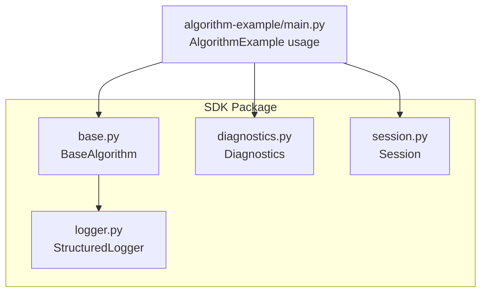
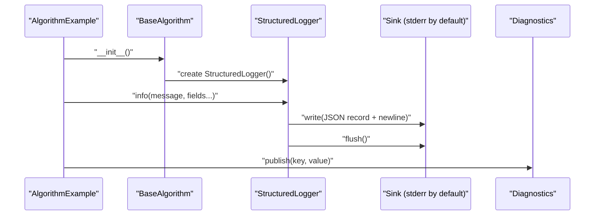
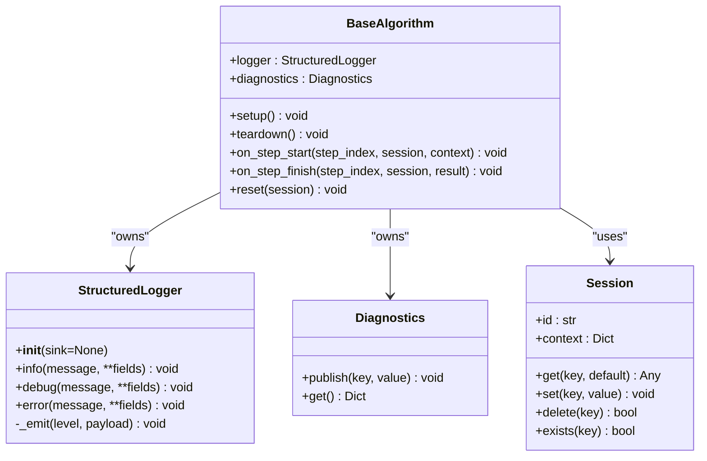
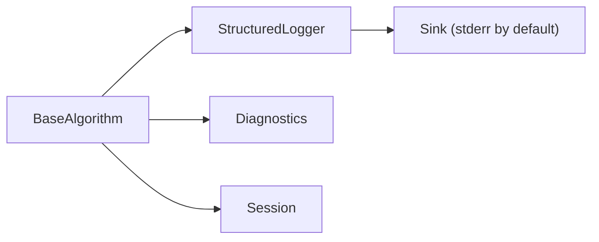

# StructuredLogger API Reference

<cite>
**Referenced Files in This Document**
- [logger.py](file://procvision_algorithm_sdk/logger.py)
- [base.py](file://procvision_algorithm_sdk/base.py)
- [diagnostics.py](file://procvision_algorithm_sdk/diagnostics.py)
- [session.py](file://procvision_algorithm_sdk/session.py)
- [main.py](file://algorithm-example/algorithm_example/main.py)
- [algorithm_dev_tutorial.md](file://algorithm_dev_tutorial.md)
- [README.md](file://README.md)
</cite>

## Table of Contents
1. [Introduction](#introduction)
2. [Project Structure](#project-structure)
3. [Core Components](#core-components)
4. [Architecture Overview](#architecture-overview)
5. [Detailed Component Analysis](#detailed-component-analysis)
6. [Dependency Analysis](#dependency-analysis)
7. [Performance Considerations](#performance-considerations)
8. [Troubleshooting Guide](#troubleshooting-guide)
9. [Conclusion](#conclusion)
10. [Appendices](#appendices)

## Introduction
This document provides a comprehensive API reference for the StructuredLogger class, which standardizes logging output as single-line JSON records. It covers the constructor, logging methods, internal formatting behavior, and integration patterns with BaseAlgorithm and diagnostic systems. It also includes guidance for production usage, field naming consistency, and examples of structured log output.

## Project Structure
The StructuredLogger resides in the SDK package and integrates with BaseAlgorithm, Diagnostics, and Session. The example algorithm demonstrates typical usage patterns for logging progress, parameters, and metrics.

**Diagram sources**
- [logger.py](file://procvision_algorithm_sdk/logger.py#L1-L24)
- [base.py](file://procvision_algorithm_sdk/base.py#L1-L20)
- [diagnostics.py](file://procvision_algorithm_sdk/diagnostics.py#L1-L12)
- [session.py](file://procvision_algorithm_sdk/session.py#L1-L36)
- [main.py](file://algorithm-example/algorithm_example/main.py#L1-L150)

**Section sources**
- [logger.py](file://procvision_algorithm_sdk/logger.py#L1-L24)
- [base.py](file://procvision_algorithm_sdk/base.py#L1-L20)
- [diagnostics.py](file://procvision_algorithm_sdk/diagnostics.py#L1-L12)
- [session.py](file://procvision_algorithm_sdk/session.py#L1-L36)
- [main.py](file://algorithm-example/algorithm_example/main.py#L1-L150)

## Core Components
- StructuredLogger: Provides three logging methods that emit structured JSON records to a configurable sink.
- BaseAlgorithm: Instantiates a StructuredLogger during initialization, enabling subclasses to log via self.logger.
- Diagnostics: Aggregates runtime metrics and debug information for platform consumption.
- Session: Encapsulates runtime context and enforces JSON-serializable state values.

Key responsibilities:
- Standardized logging: Ensures consistent fields (level, timestamp_ms, message) plus user-defined fields.
- Stream handling: Writes JSON records and flushes after each write.
- Integration: Seamlessly used within BaseAlgorithm lifecycle hooks and algorithm steps.

**Section sources**
- [logger.py](file://procvision_algorithm_sdk/logger.py#L1-L24)
- [base.py](file://procvision_algorithm_sdk/base.py#L1-L20)
- [diagnostics.py](file://procvision_algorithm_sdk/diagnostics.py#L1-L12)
- [session.py](file://procvision_algorithm_sdk/session.py#L1-L36)

## Architecture Overview
The logging pipeline centers on StructuredLogger’s internal emission mechanism. BaseAlgorithm initializes the logger, and algorithms use it to report progress, parameters, and metrics. Diagnostics complements logs by aggregating numeric metrics for platform UI.

**Diagram sources**
- [base.py](file://procvision_algorithm_sdk/base.py#L1-L20)
- [logger.py](file://procvision_algorithm_sdk/logger.py#L1-L24)
- [diagnostics.py](file://procvision_algorithm_sdk/diagnostics.py#L1-L12)
- [main.py](file://algorithm-example/algorithm_example/main.py#L1-L150)

## Detailed Component Analysis

### StructuredLogger API
- Constructor
  - Signature: StructuredLogger(sink=None)
  - Behavior: Stores the provided sink or defaults to stderr.
  - Notes: sink must support write() and flush() methods.
- Methods
  - info(message, **fields): Emits an info-level record.
  - debug(message, **fields): Emits a debug-level record.
  - error(message, **fields): Emits an error-level record.
- Internal method
  - _emit(level, payload): Builds a record with level and timestamp_ms, merges user fields, writes JSON to sink, and flushes.

Log record structure
- Required fields:
  - level: "info", "debug", or "error"
  - timestamp_ms: integer milliseconds since epoch
  - message: string provided by caller
- Additional fields: All keyword arguments passed to logging methods are merged into the record.

Stream handling and flushing
- Each call to info/debug/error triggers a write and flush, ensuring immediate visibility in logs.

Integration with external sinks
- Replace the default stderr sink with any file-like object that implements write() and flush(). This enables piping logs to external systems or files.

Best practices for field naming
- Use snake_case for field keys to improve readability and consistency.
- Prefer short, descriptive keys for common metrics (e.g., step_index, latency_ms).
- Place derived or computed values under a debug container when appropriate.

**Section sources**
- [logger.py](file://procvision_algorithm_sdk/logger.py#L1-L24)

### BaseAlgorithm Integration
- BaseAlgorithm creates a StructuredLogger instance during initialization.
- Subclasses can access self.logger to emit structured logs throughout lifecycle hooks and execution steps.

Usage pattern
- Initialize logger in subclass __init__ and use it in setup, on_step_start/on_step_finish, and execute methods.

**Section sources**
- [base.py](file://procvision_algorithm_sdk/base.py#L1-L20)
- [main.py](file://algorithm-example/algorithm_example/main.py#L1-L150)

### Diagnostics and Session Complement
- Diagnostics.publish(key, value) stores metrics for later aggregation.
- Session.set(key, value) validates that values are JSON serializable and stores them in a state dictionary.

Practical usage
- Compute latency in on_step_finish, publish to Diagnostics, and log the same metric via StructuredLogger for observability.

**Section sources**
- [diagnostics.py](file://procvision_algorithm_sdk/diagnostics.py#L1-L12)
- [session.py](file://procvision_algorithm_sdk/session.py#L1-L36)
- [main.py](file://algorithm-example/algorithm_example/main.py#L1-L150)

### Example: Structured Log Output
Sample JSON records emitted by StructuredLogger:
- Info record: {"level":"info","timestamp_ms":<epoch_ms>,"message":"setup","model_version":"example_v1"}
- Debug record: {"level":"debug","timestamp_ms":<epoch_ms>,"message":"processing","step_index":1}
- Error record: {"level":"error","timestamp_ms":<epoch_ms>,"message":"failed","error_code":"1002"}

These examples illustrate the standard fields and demonstrate how additional fields enrich the record with contextual information.

**Section sources**
- [logger.py](file://procvision_algorithm_sdk/logger.py#L1-L24)
- [main.py](file://algorithm-example/algorithm_example/main.py#L1-L150)

### Class Diagram

**Diagram sources**
- [logger.py](file://procvision_algorithm_sdk/logger.py#L1-L24)
- [base.py](file://procvision_algorithm_sdk/base.py#L1-L20)
- [diagnostics.py](file://procvision_algorithm_sdk/diagnostics.py#L1-L12)
- [session.py](file://procvision_algorithm_sdk/session.py#L1-L36)

## Dependency Analysis
- Coupling: BaseAlgorithm depends on StructuredLogger for logging and Diagnostics for metrics.
- Cohesion: StructuredLogger encapsulates all logging concerns, keeping algorithm code focused on business logic.
- External dependencies: The logger relies on JSON serialization and time utilities; sink behavior is decoupled via interface.

**Diagram sources**
- [base.py](file://procvision_algorithm_sdk/base.py#L1-L20)
- [logger.py](file://procvision_algorithm_sdk/logger.py#L1-L24)
- [diagnostics.py](file://procvision_algorithm_sdk/diagnostics.py#L1-L12)
- [session.py](file://procvision_algorithm_sdk/session.py#L1-L36)

**Section sources**
- [base.py](file://procvision_algorithm_sdk/base.py#L1-L20)
- [logger.py](file://procvision_algorithm_sdk/logger.py#L1-L24)
- [diagnostics.py](file://procvision_algorithm_sdk/diagnostics.py#L1-L12)
- [session.py](file://procvision_algorithm_sdk/session.py#L1-L36)

## Performance Considerations
- Emit cost: Each logging call performs a write and flush. In high-throughput scenarios, consider reducing log frequency or aggregating metrics into fewer records.
- Serialization overhead: JSON serialization occurs per record; avoid passing excessively large or deeply nested structures as fields.
- Sink choice: Using a buffered or asynchronous sink can reduce I/O contention, but ensure correctness for critical error logs.

[No sources needed since this section provides general guidance]

## Troubleshooting Guide
Common issues and resolutions:
- Non-serializable values: If a field cannot be serialized to JSON, the logger will fail. Ensure all fields are JSON-compatible.
- Unexpected sink behavior: Verify that the provided sink supports write() and flush(). For file-based sinks, ensure permissions and disk availability.
- Missing timestamp_ms: The timestamp is automatically included. If absent, confirm the record was emitted by StructuredLogger.

**Section sources**
- [logger.py](file://procvision_algorithm_sdk/logger.py#L1-L24)
- [session.py](file://procvision_algorithm_sdk/session.py#L1-L36)

## Conclusion
StructuredLogger offers a simple, consistent way to produce machine-readable logs with standardized fields. Combined with BaseAlgorithm initialization and Diagnostics, it enables robust monitoring and observability for algorithm execution. Adopt field naming conventions, control log volume in production, and integrate sinks thoughtfully to align with your logging infrastructure.

[No sources needed since this section summarizes without analyzing specific files]

## Appendices

### API Summary
- StructuredLogger(sink=None)
  - sink: Optional; defaults to stderr; must support write() and flush()
- info(message, **fields)
  - Emits an info-level record with level, timestamp_ms, message, and additional fields
- debug(message, **fields)
  - Emits a debug-level record with the same structure
- error(message, **fields)
  - Emits an error-level record with the same structure
- _emit(level, payload)
  - Internal formatter that builds the record and writes to sink

**Section sources**
- [logger.py](file://procvision_algorithm_sdk/logger.py#L1-L24)

### Usage Patterns and Examples
- Logging algorithm progress:
  - Use info to mark lifecycle events (setup, teardown, step start/finish).
  - Include step_index and context to provide context.
- Parameter values:
  - Pass user_params and computed values as fields for reproducibility.
- Execution metrics:
  - Compute latency and publish to Diagnostics; also log via info for quick inspection.
- Example references:
  - BaseAlgorithm initialization and logger usage in the example algorithm.
  - Structured log output format and field inclusion in the tutorial.

**Section sources**
- [base.py](file://procvision_algorithm_sdk/base.py#L1-L20)
- [main.py](file://algorithm-example/algorithm_example/main.py#L1-L150)
- [algorithm_dev_tutorial.md](file://algorithm_dev_tutorial.md#L128-L135)
- [README.md](file://README.md#L1-L116)