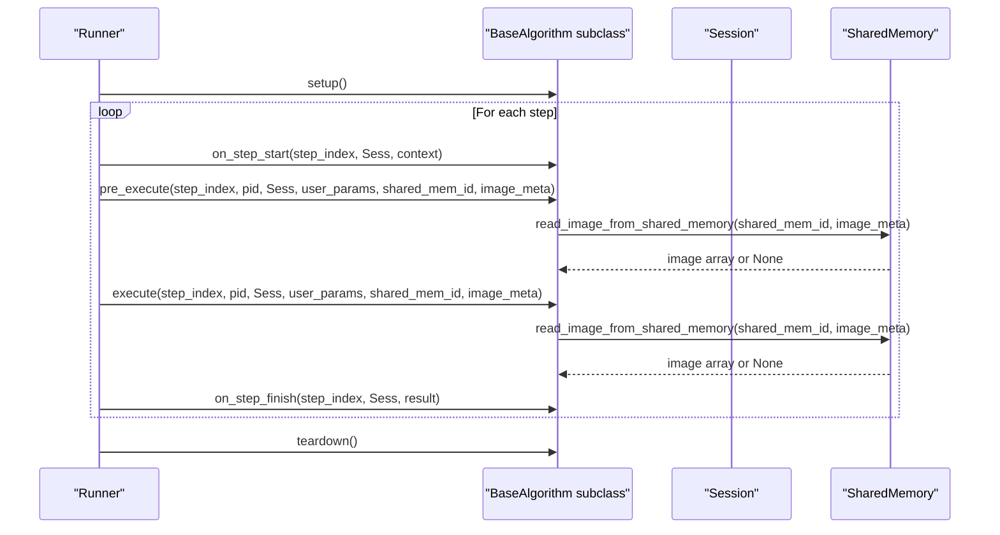
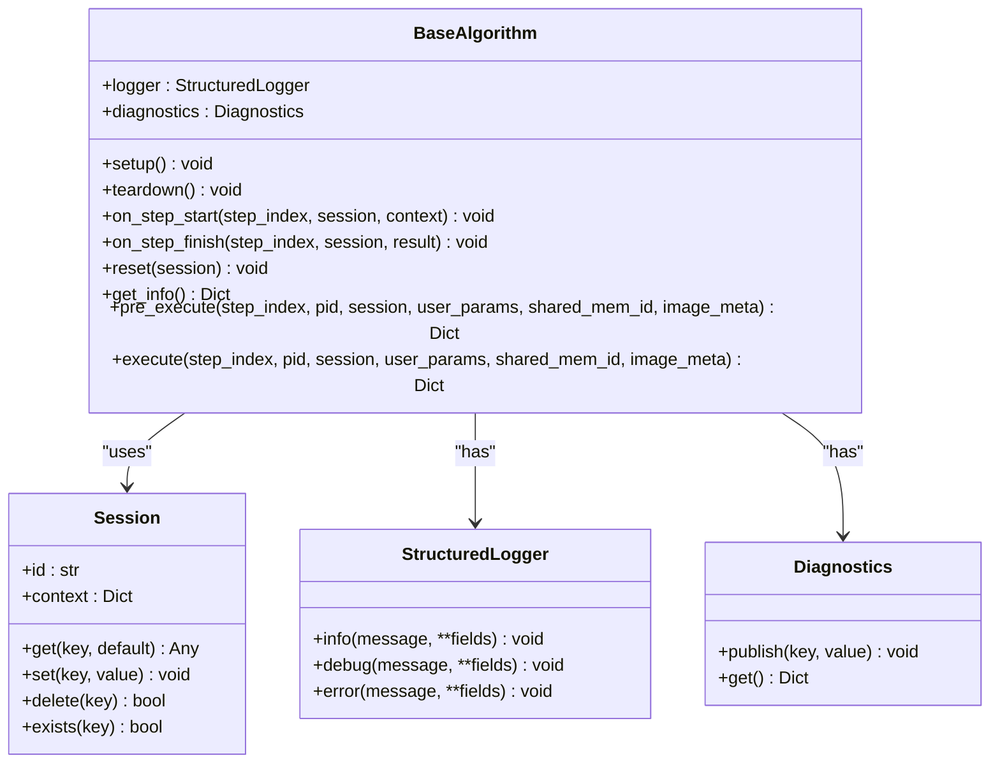
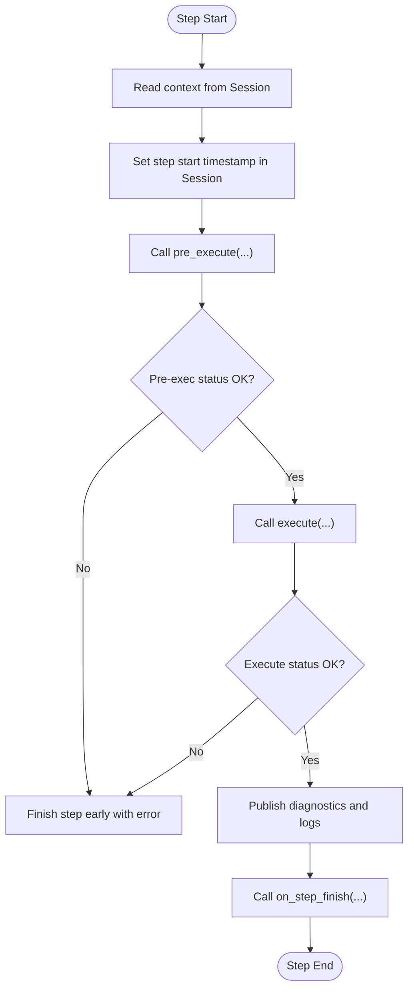
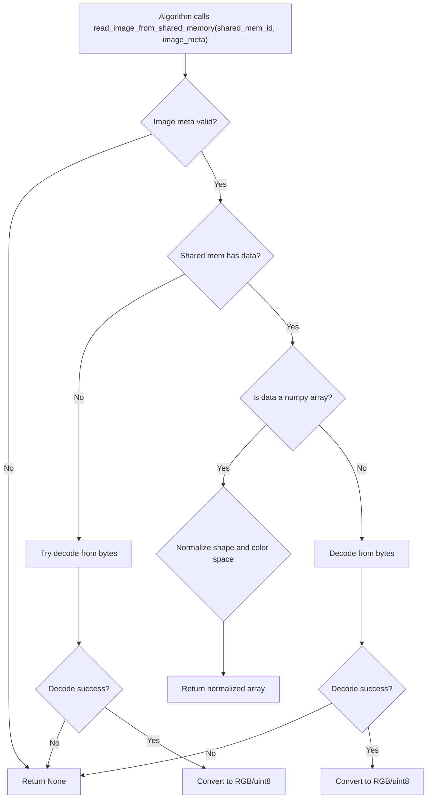
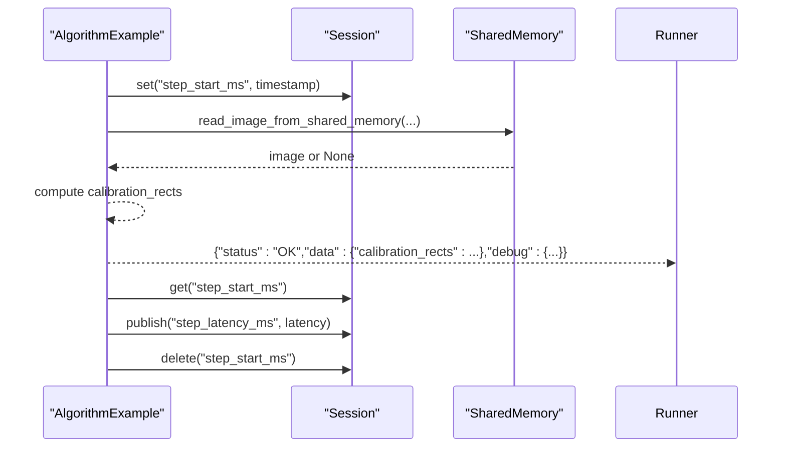
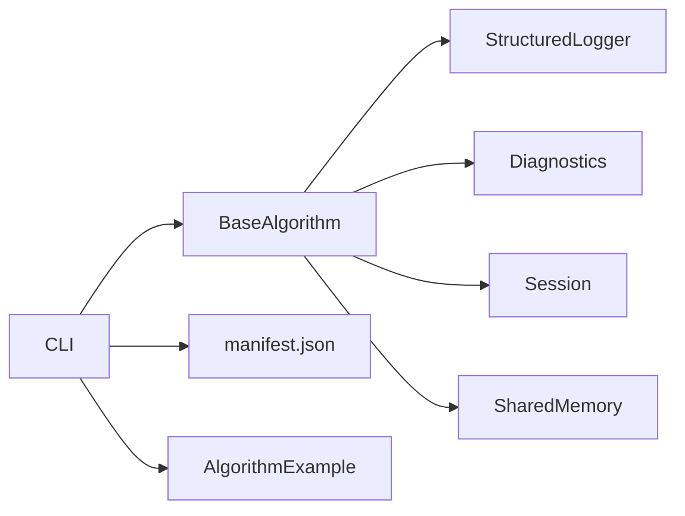

# BaseAlgorithm Interface

<cite>
**Referenced Files in This Document**
- [base.py](file://procvision_algorithm_sdk/base.py)
- [session.py](file://procvision_algorithm_sdk/session.py)
- [shared_memory.py](file://procvision_algorithm_sdk/shared_memory.py)
- [logger.py](file://procvision_algorithm_sdk/logger.py)
- [diagnostics.py](file://procvision_algorithm_sdk/diagnostics.py)
- [cli.py](file://procvision_algorithm_sdk/cli.py)
- [errors.py](file://procvision_algorithm_sdk/errors.py)
- [main.py](file://algorithm-example/algorithm_example/main.py)
- [manifest.json](file://algorithm-example/manifest.json)
- [spec.md](file://spec.md)
- [README.md](file://README.md)
- [test_base_algo.py](file://tests/test_base_algo.py)
</cite>

## Table of Contents
1. [Introduction](#introduction)
2. [Project Structure](#project-structure)
3. [Core Components](#core-components)
4. [Architecture Overview](#architecture-overview)
5. [Detailed Component Analysis](#detailed-component-analysis)
6. [Dependency Analysis](#dependency-analysis)
7. [Performance Considerations](#performance-considerations)
8. [Troubleshooting Guide](#troubleshooting-guide)
9. [Conclusion](#conclusion)
10. [Appendices](#appendices)

## Introduction
This document explains the BaseAlgorithm interface in the ProcVision Algorithm SDK. It defines the contract that all algorithm implementations must fulfill, including lifecycle hooks and required abstract methods. It also documents how BaseAlgorithm integrates with Session for state management, SharedMemory for image access, and how structured logging and diagnostics are used. Implementation patterns are illustrated using the example algorithm and validated against the specification.

## Project Structure
The SDK exposes a minimal set of core capabilities:
- BaseAlgorithm: abstract interface and lifecycle hooks
- Session: per-detection state storage and context
- SharedMemory utilities: image transport via shared memory
- StructuredLogger and Diagnostics: logging and metrics
- CLI: validation, local simulation, packaging, and scaffolding

```mermaid
graph TB
subgraph "SDK Core"
BA["BaseAlgorithm<br/>base.py"]
SES["Session<br/>session.py"]
SM["SharedMemory Utils<br/>shared_memory.py"]
LOG["StructuredLogger<br/>logger.py"]
DIAG["Diagnostics<br/>diagnostics.py"]
end
subgraph "Algorithm Example"
EX["AlgorithmExample<br/>algorithm_example/main.py"]
MAN["manifest.json"]
end
subgraph "CLI"
CLI["procvision-cli<br/>cli.py"]
end
BA --> SES
BA --> LOG
BA --> DIAG
BA --> SM
EX --> BA
EX --> SES
EX --> SM
CLI --> MAN
CLI --> EX
```

**Diagram sources**
- [base.py](file://procvision_algorithm_sdk/base.py#L1-L58)
- [session.py](file://procvision_algorithm_sdk/session.py#L1-L36)
- [shared_memory.py](file://procvision_algorithm_sdk/shared_memory.py#L1-L53)
- [logger.py](file://procvision_algorithm_sdk/logger.py#L1-L24)
- [diagnostics.py](file://procvision_algorithm_sdk/diagnostics.py#L1-L12)
- [main.py](file://algorithm-example/algorithm_example/main.py#L1-L150)
- [manifest.json](file://algorithm-example/manifest.json#L1-L25)
- [cli.py](file://procvision_algorithm_sdk/cli.py#L1-L615)

**Section sources**
- [README.md](file://README.md#L1-L116)
- [cli.py](file://procvision_algorithm_sdk/cli.py#L1-L615)

## Core Components
- BaseAlgorithm: Defines lifecycle hooks and abstract methods. Provides logger and diagnostics instances and internal state flags.
- Session: Encapsulates per-detection state and context; enforces JSON-serializable values.
- SharedMemory: Provides development helpers to write/read images to/from shared memory.
- StructuredLogger: Emits structured log records with standardized fields.
- Diagnostics: Collects key-value metrics for reporting.

Key responsibilities:
- BaseAlgorithm: Contract definition, lifecycle orchestration, and invocation of pre_execute/execute.
- Session: Lightweight KV store for cross-step sharing during a detection run.
- SharedMemory: Minimal abstraction for image transport; reads JPEG-encoded bytes and converts to arrays.
- Logger/Diagnostics: Standardized telemetry and metrics collection.

**Section sources**
- [base.py](file://procvision_algorithm_sdk/base.py#L1-L58)
- [session.py](file://procvision_algorithm_sdk/session.py#L1-L36)
- [shared_memory.py](file://procvision_algorithm_sdk/shared_memory.py#L1-L53)
- [logger.py](file://procvision_algorithm_sdk/logger.py#L1-L24)
- [diagnostics.py](file://procvision_algorithm_sdk/diagnostics.py#L1-L12)

## Architecture Overview
The algorithm lifecycle is orchestrated by the platform runner. The BaseAlgorithm instance is created once and reused across multiple PIDs. At runtime, the runner invokes lifecycle hooks and calls pre_execute/execute with the current PID and session.



**Diagram sources**
- [base.py](file://procvision_algorithm_sdk/base.py#L1-L58)
- [session.py](file://procvision_algorithm_sdk/session.py#L1-L36)
- [shared_memory.py](file://procvision_algorithm_sdk/shared_memory.py#L1-L53)
- [cli.py](file://procvision_algorithm_sdk/cli.py#L1-L615)

## Detailed Component Analysis

### BaseAlgorithm Interface
BaseAlgorithm is an abstract base class that defines:
- Lifecycle hooks: setup, teardown, on_step_start, on_step_finish, reset
- Required abstract methods: get_info, pre_execute, execute
- Internal state: resource flags and supported PID list
- Dependencies: StructuredLogger, Diagnostics, Session

Implementation patterns:
- Multi-PID support: PID is passed dynamically to pre_execute/execute rather than bound to the instance. See [spec.md](file://spec.md#L1-L799).
- Return-status error handling: Methods return dictionaries with status and optional message/error_code/data/debug fields. See [spec.md](file://spec.md#L1-L799).
- Lazy loading: Heavy resources (models, caches) are loaded in setup() to minimize cold-start overhead. See [spec.md](file://spec.md#L1-L799).



**Diagram sources**
- [base.py](file://procvision_algorithm_sdk/base.py#L1-L58)
- [session.py](file://procvision_algorithm_sdk/session.py#L1-L36)
- [logger.py](file://procvision_algorithm_sdk/logger.py#L1-L24)
- [diagnostics.py](file://procvision_algorithm_sdk/diagnostics.py#L1-L12)

**Section sources**
- [base.py](file://procvision_algorithm_sdk/base.py#L1-L58)
- [spec.md](file://spec.md#L1-L799)

### Session Integration
Session encapsulates per-detection state and context:
- Immutable id and context
- JSON-serializable state store with get/set/delete/existence checks
- Enforces serialization at set() to prevent invalid payloads

Common usage patterns:
- Store intermediate results between steps
- Track timing and counters
- Reset temporary state via reset()



**Diagram sources**
- [session.py](file://procvision_algorithm_sdk/session.py#L1-L36)
- [base.py](file://procvision_algorithm_sdk/base.py#L1-L58)

**Section sources**
- [session.py](file://procvision_algorithm_sdk/session.py#L1-L36)
- [base.py](file://procvision_algorithm_sdk/base.py#L1-L58)

### SharedMemory Integration
SharedMemory utilities provide a development-friendly way to simulate image transport:
- Write image bytes or arrays to a shared memory ID
- Read image from shared memory using image metadata (width, height, camera_id, timestamp_ms)
- Normalize color spaces and handle grayscale/bgr conversions
- Fallback to decoding from bytes if arrays are not available



**Diagram sources**
- [shared_memory.py](file://procvision_algorithm_sdk/shared_memory.py#L1-L53)

**Section sources**
- [shared_memory.py](file://procvision_algorithm_sdk/shared_memory.py#L1-L53)

### Logging and Diagnostics
- StructuredLogger emits JSON records with standardized fields including level and timestamp_ms.
- Diagnostics collects key-value metrics that can be published and retrieved.
- Algorithms should use logger.info/debug/error and diagnostics.publish for observability.

**Section sources**
- [logger.py](file://procvision_algorithm_sdk/logger.py#L1-L24)
- [diagnostics.py](file://procvision_algorithm_sdk/diagnostics.py#L1-L12)
- [spec.md](file://spec.md#L1-L799)

### Implementation Examples
- Example algorithm demonstrates multi-PID support by validating pid in pre_execute/execute and returning structured results with status and data.
- The example uses Session to track step timing and Diagnostics to publish latency metrics.
- The example reads images from shared memory and returns either OK with result_status or ERROR with message and error_code.



**Diagram sources**
- [main.py](file://algorithm-example/algorithm_example/main.py#L1-L150)
- [session.py](file://procvision_algorithm_sdk/session.py#L1-L36)
- [shared_memory.py](file://procvision_algorithm_sdk/shared_memory.py#L1-L53)

**Section sources**
- [main.py](file://algorithm-example/algorithm_example/main.py#L1-L150)
- [manifest.json](file://algorithm-example/manifest.json#L1-L25)

## Dependency Analysis
BaseAlgorithm depends on:
- StructuredLogger and Diagnostics for telemetry
- Session for state management
- SharedMemory utilities for image access

The CLI validates algorithm packages and ensures supported_pids match between manifest.json and get_info output, enforcing contract compliance.



**Diagram sources**
- [base.py](file://procvision_algorithm_sdk/base.py#L1-L58)
- [logger.py](file://procvision_algorithm_sdk/logger.py#L1-L24)
- [diagnostics.py](file://procvision_algorithm_sdk/diagnostics.py#L1-L12)
- [session.py](file://procvision_algorithm_sdk/session.py#L1-L36)
- [shared_memory.py](file://procvision_algorithm_sdk/shared_memory.py#L1-L53)
- [cli.py](file://procvision_algorithm_sdk/cli.py#L1-L615)
- [manifest.json](file://algorithm-example/manifest.json#L1-L25)

**Section sources**
- [cli.py](file://procvision_algorithm_sdk/cli.py#L1-L615)
- [spec.md](file://spec.md#L1-L799)

## Performance Considerations
- Lazy loading: Initialize heavy resources (models, caches) in setup() to avoid repeated initialization costs across PIDs.
- Minimize allocations: Reuse buffers and avoid unnecessary copies when processing images.
- Efficient image access: Use shared memory read utilities and avoid decoding multiple times.
- Logging overhead: Prefer structured logging and keep payloads minimal.
- Session size: Keep stored values small and JSON-serializable to avoid serialization overhead.

[No sources needed since this section provides general guidance]

## Troubleshooting Guide
Common issues and resolutions:
- Unsupported PID: pre_execute/execute should return ERROR with appropriate message and error_code when pid is not supported.
- Empty image data: If read_image_from_shared_memory returns None, return ERROR with message indicating missing image data.
- Serialization errors: Session.set raises TypeError for non-JSON-serializable values; ensure stored data is serializable.
- Validation failures: Use CLI validate to check manifest.json, entry_point, supported_pids consistency, and return value shapes.

**Section sources**
- [main.py](file://algorithm-example/algorithm_example/main.py#L1-L150)
- [session.py](file://procvision_algorithm_sdk/session.py#L1-L36)
- [cli.py](file://procvision_algorithm_sdk/cli.py#L1-L615)
- [test_base_algo.py](file://tests/test_base_algo.py#L1-L65)

## Conclusion
BaseAlgorithm defines a robust, standardized contract for algorithm implementations in ProcVision. By separating PID binding from instance creation, leveraging Session for lightweight state, and using structured logging and diagnostics, algorithms can be efficient, maintainable, and portable. The example implementation and CLI validation provide practical patterns and verification mechanisms aligned with the specification.

[No sources needed since this section summarizes without analyzing specific files]

## Appendices

### Interface Contracts and Validation Rules
- supported_pids must match between manifest.json and get_info output.
- pre_execute returns reference data; execute returns result_status and optional defect_rects.
- Return status must be OK or ERROR; use message and error_code for error details.
- image_meta must include width, height, timestamp_ms, and camera_id.

**Section sources**
- [spec.md](file://spec.md#L1-L799)
- [manifest.json](file://algorithm-example/manifest.json#L1-L25)
- [test_base_algo.py](file://tests/test_base_algo.py#L1-L65)