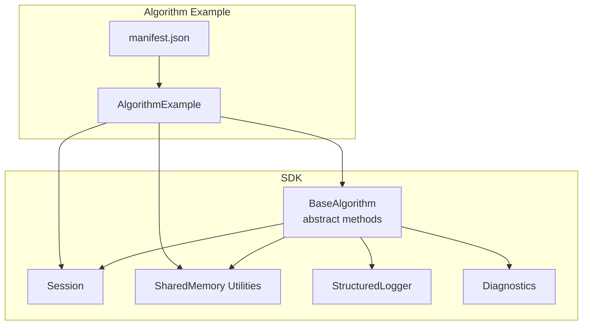
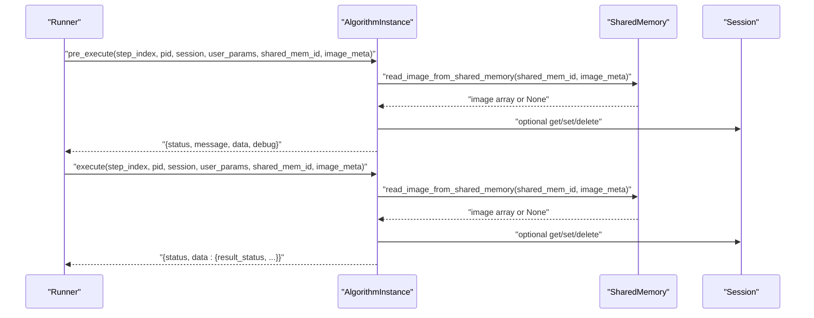
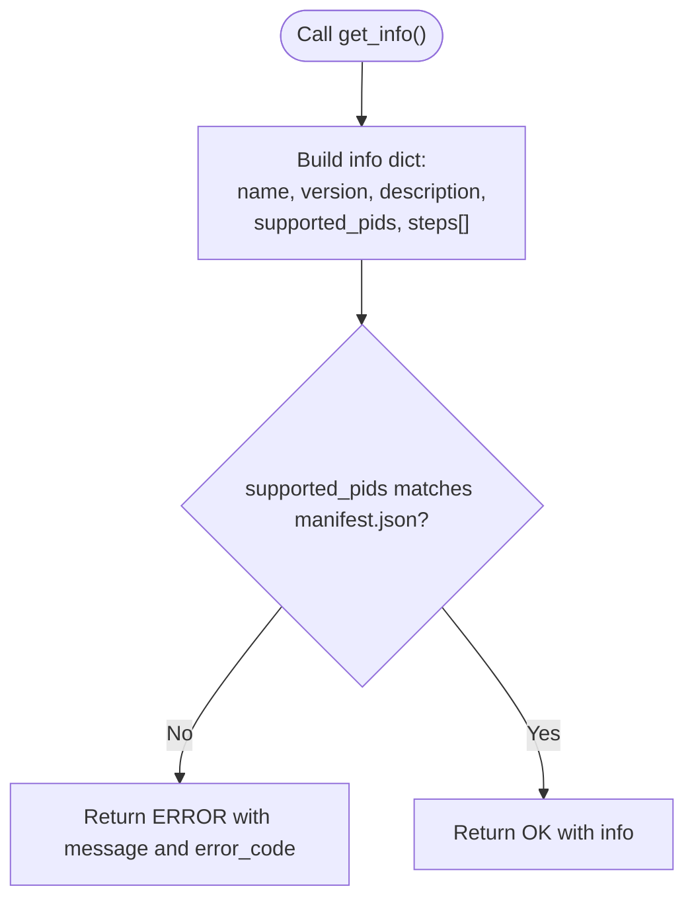
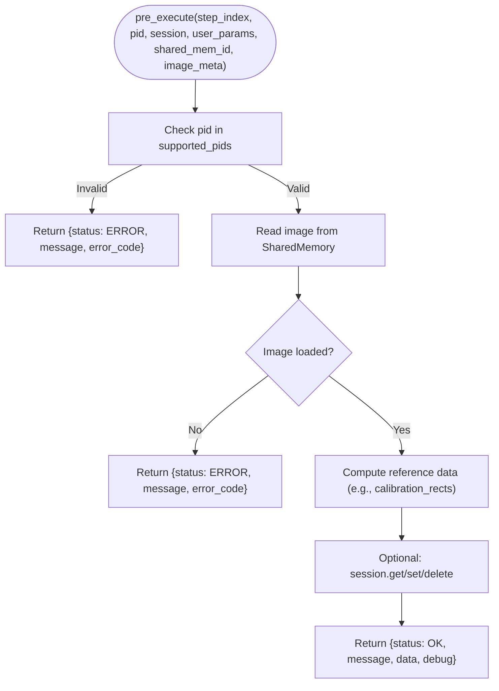
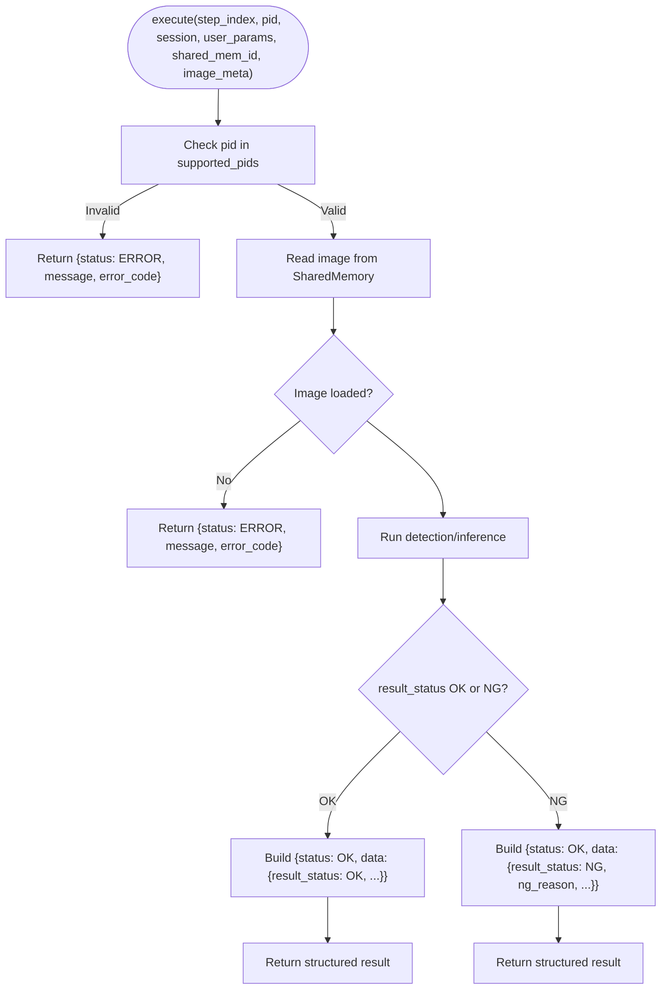
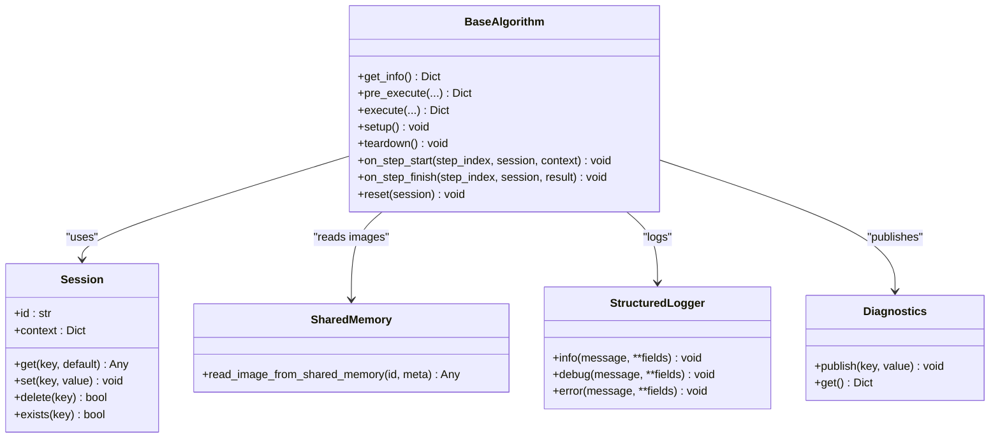

# Core Execution Methods

<cite>
**Referenced Files in This Document**
- [base.py](file://procvision_algorithm_sdk/base.py)
- [session.py](file://procvision_algorithm_sdk/session.py)
- [shared_memory.py](file://procvision_algorithm_sdk/shared_memory.py)
- [logger.py](file://procvision_algorithm_sdk/logger.py)
- [diagnostics.py](file://procvision_algorithm_sdk/diagnostics.py)
- [spec.md](file://spec.md)
- [README.md](file://README.md)
- [algorithm_example/main.py](file://algorithm-example/algorithm_example/main.py)
- [manifest.json](file://algorithm-example/manifest.json)
- [test_base_algo.py](file://tests/test_base_algo.py)
- [cli.py](file://procvision_algorithm_sdk/cli.py)
</cite>

## Table of Contents
1. [Introduction](#introduction)
2. [Project Structure](#project-structure)
3. [Core Components](#core-components)
4. [Architecture Overview](#architecture-overview)
5. [Detailed Component Analysis](#detailed-component-analysis)
6. [Dependency Analysis](#dependency-analysis)
7. [Performance Considerations](#performance-considerations)
8. [Troubleshooting Guide](#troubleshooting-guide)
9. [Conclusion](#conclusion)
10. [Appendices](#appendices)

## Introduction
This document focuses on the abstract core methods of BaseAlgorithm: get_info(), pre_execute(), and execute(). It explains their purpose, invocation context, required implementation, and integration with Session, SharedMemory, and platform orchestration. It also highlights critical requirements such as supported_pids matching manifest.json, error handling via return status, dynamic PID-based configuration loading, structured result formatting, and common pitfalls.

## Project Structure
The SDK defines the BaseAlgorithm interface and auxiliary utilities (Session, SharedMemory, Logger, Diagnostics). Example algorithms demonstrate correct usage, and tests validate basic contracts.

**Diagram sources**
- [base.py](file://procvision_algorithm_sdk/base.py#L1-L58)
- [session.py](file://procvision_algorithm_sdk/session.py#L1-L36)
- [shared_memory.py](file://procvision_algorithm_sdk/shared_memory.py#L1-L53)
- [logger.py](file://procvision_algorithm_sdk/logger.py#L1-L24)
- [diagnostics.py](file://procvision_algorithm_sdk/diagnostics.py#L1-L12)
- [algorithm_example/main.py](file://algorithm-example/algorithm_example/main.py#L1-L150)
- [manifest.json](file://algorithm-example/manifest.json#L1-L25)

**Section sources**
- [base.py](file://procvision_algorithm_sdk/base.py#L1-L58)
- [README.md](file://README.md#L1-L116)

## Core Components
- BaseAlgorithm: Defines the contract for algorithm metadata exposure, pre-execution preparation, and core detection logic.
- Session: Provides cross-step state storage and context for each detection flow.
- SharedMemory Utilities: Provide image access via shared memory identifiers and metadata.
- Logger and Diagnostics: Standardized logging and diagnostic publishing for observability.

Key responsibilities:
- get_info(): Expose algorithm metadata and step parameter schema; enforce supported_pids consistency with manifest.json.
- pre_execute(): Prepare reference data (e.g., calibration ROIs) and validate conditions; return structured status and optional debug info.
- execute(): Perform core detection logic and produce NG/OK result; return structured status and result data.

**Section sources**
- [base.py](file://procvision_algorithm_sdk/base.py#L1-L58)
- [session.py](file://procvision_algorithm_sdk/session.py#L1-L36)
- [shared_memory.py](file://procvision_algorithm_sdk/shared_memory.py#L1-L53)
- [logger.py](file://procvision_algorithm_sdk/logger.py#L1-L24)
- [diagnostics.py](file://procvision_algorithm_sdk/diagnostics.py#L1-L12)

## Architecture Overview
The platform orchestrates algorithm execution by invoking BaseAlgorithm methods with a consistent signature. Images are accessed via SharedMemory, and state is managed through Session. Results are returned as structured dictionaries with a top-level status and a data payload.

**Diagram sources**
- [base.py](file://procvision_algorithm_sdk/base.py#L1-L58)
- [shared_memory.py](file://procvision_algorithm_sdk/shared_memory.py#L1-L53)
- [session.py](file://procvision_algorithm_sdk/session.py#L1-L36)

## Detailed Component Analysis

### BaseAlgorithm.get_info()
Purpose:
- Return algorithm metadata and step parameter schema.
- Enforce that supported_pids matches manifest.json exactly; platform validates this during load.

Required implementation:
- Provide name, version, description, supported_pids, and steps with parameter definitions.
- Ensure supported_pids equals manifest.json supported_pids.

**Diagram sources**
- [base.py](file://procvision_algorithm_sdk/base.py#L1-L58)
- [cli.py](file://procvision_algorithm_sdk/cli.py#L64-L100)
- [manifest.json](file://algorithm-example/manifest.json#L1-L25)

Implementation notes:
- Steps define parameter keys, types, defaults, constraints, and descriptions.
- supported_pids must be identical to manifest.json; otherwise, platform validation fails.

Common pitfalls:
- Mismatched supported_pids cause immediate rejection by platform validation.
- Omitting steps or missing parameter definitions leads to UI validation failures.

**Section sources**
- [base.py](file://procvision_algorithm_sdk/base.py#L1-L58)
- [cli.py](file://procvision_algorithm_sdk/cli.py#L64-L100)
- [manifest.json](file://algorithm-example/manifest.json#L1-L25)

### BaseAlgorithm.pre_execute()
Purpose:
- Prepare reference data (e.g., calibration rectangles) and validate preconditions before execute().
- Do not perform core detection in pre_execute(); return OK to proceed to execute().

Invocation context:
- Called by platform before execute() for the same step.
- Receives step_index, pid, session, user_params, shared_mem_id, image_meta.

Parameter grouping:
- Step control: step_index
- Context: pid, session
- User input: user_params
- Image data: shared_mem_id, image_meta

Processing logic:
- Validate pid against supported_pids.
- Read image from SharedMemory using shared_mem_id and image_meta.
- Compute reference data (e.g., calibration_rects).
- Optionally use Session to store intermediate results for later steps.
- Return structured dictionary with status, message, and optional data/debug.

**Diagram sources**
- [base.py](file://procvision_algorithm_sdk/base.py#L1-L58)
- [shared_memory.py](file://procvision_algorithm_sdk/shared_memory.py#L1-L53)
- [session.py](file://procvision_algorithm_sdk/session.py#L1-L36)

Implementation examples:
- AlgorithmExample demonstrates returning calibration_rects and debug metrics.
- Tests show minimal pre_execute returning OK or error depending on pid and image availability.

**Section sources**
- [algorithm_example/main.py](file://algorithm-example/algorithm_example/main.py#L1-L150)
- [test_base_algo.py](file://tests/test_base_algo.py#L1-L65)

### BaseAlgorithm.execute()
Purpose:
- Perform core detection logic and determine NG/OK outcome.
- Produce defect_rects, position_rects, and other result data as needed.

Invocation context:
- Called by platform after successful pre_execute() for the same step.
- Receives the same parameter signature as pre_execute().

Processing logic:
- Validate pid against supported_pids.
- Read image from SharedMemory.
- Run detection/inference pipeline.
- Determine result_status (OK/NG) and populate defect_rects/position_rects.
- Optionally publish diagnostics and log metrics.

**Diagram sources**
- [base.py](file://procvision_algorithm_sdk/base.py#L1-L58)
- [shared_memory.py](file://procvision_algorithm_sdk/shared_memory.py#L1-L53)
- [diagnostics.py](file://procvision_algorithm_sdk/diagnostics.py#L1-L12)

Implementation examples:
- AlgorithmExample demonstrates alternating NG/OK outcomes per step index and returns defect_rects or position_rects accordingly.
- Tests show minimal execute returning OK with result_status and empty defect_rects.

**Section sources**
- [algorithm_example/main.py](file://algorithm-example/algorithm_example/main.py#L1-L150)
- [test_base_algo.py](file://tests/test_base_algo.py#L1-L65)

### Shared Parameter Signature and Grouping
All three methods share the same parameter signature:
- step_index: integer indicating the current step (1-based)
- pid: product identifier passed dynamically at runtime
- session: Session object for cross-step state and context
- user_params: validated user-provided parameters per step schema
- shared_mem_id: identifier for SharedMemory-backed image buffer
- image_meta: minimal metadata (width, height, timestamp_ms, camera_id)

Grouping rationale:
- Step control: step_index
- Context: pid, session
- User input: user_params
- Image data: shared_mem_id, image_meta

This uniformity simplifies platform orchestration and ensures consistent error handling and logging across steps.

**Section sources**
- [base.py](file://procvision_algorithm_sdk/base.py#L1-L58)
- [spec.md](file://spec.md#L1-L799)

### Dynamic PID-Based Configuration Loading
- BaseAlgorithm instances are not bound to a specific PID; they support all PIDs declared in supported_pids.
- During pre_execute()/execute(), the platform passes pid as a parameter.
- Algorithms can dynamically load assets/configurations per pid and cache them appropriately.

Best practices:
- Load lightweight resources in setup() and heavy resources conditionally per pid.
- Validate pid early and fail fast with structured error response.
- Use supported_pids to guard against unsupported configurations.

**Section sources**
- [spec.md](file://spec.md#L1-L799)
- [algorithm_example/main.py](file://algorithm-example/algorithm_example/main.py#L1-L150)

### Structured Result Formatting
- Top-level status: "OK" or "ERROR"
- Messages: human-readable info or error details
- Data payload: business results (e.g., result_status, defect_rects, position_rects)
- Debug payload: latency, confidence, model version, etc.
- Diagnostics: publish metrics for UI and remote troubleshooting

Examples:
- pre_execute() returns OK with calibration_rects and debug metrics.
- execute() returns OK with result_status and defect_rects/position_rects.

**Section sources**
- [spec.md](file://spec.md#L1-L799)
- [algorithm_example/main.py](file://algorithm-example/algorithm_example/main.py#L1-L150)

### Integration with SharedMemory and Session
- SharedMemory: Use read_image_from_shared_memory(shared_mem_id, image_meta) to obtain image arrays safely.
- Session: Store cross-step state (e.g., templates, alignment results) with set/get/delete; ensure values are JSON serializable.

Lifecycle hooks:
- on_step_start/on_step_finish: useful for timing and diagnostics.
- reset: clean temporary state between retries without releasing heavy resources.

**Section sources**
- [shared_memory.py](file://procvision_algorithm_sdk/shared_memory.py#L1-L53)
- [session.py](file://procvision_algorithm_sdk/session.py#L1-L36)
- [algorithm_example/main.py](file://algorithm-example/algorithm_example/main.py#L1-L150)

## Dependency Analysis

**Diagram sources**
- [base.py](file://procvision_algorithm_sdk/base.py#L1-L58)
- [session.py](file://procvision_algorithm_sdk/session.py#L1-L36)
- [shared_memory.py](file://procvision_algorithm_sdk/shared_memory.py#L1-L53)
- [logger.py](file://procvision_algorithm_sdk/logger.py#L1-L24)
- [diagnostics.py](file://procvision_algorithm_sdk/diagnostics.py#L1-L12)

**Section sources**
- [base.py](file://procvision_algorithm_sdk/base.py#L1-L58)
- [session.py](file://procvision_algorithm_sdk/session.py#L1-L36)
- [shared_memory.py](file://procvision_algorithm_sdk/shared_memory.py#L1-L53)
- [logger.py](file://procvision_algorithm_sdk/logger.py#L1-L24)
- [diagnostics.py](file://procvision_algorithm_sdk/diagnostics.py#L1-L12)

## Performance Considerations
- Image access: Prefer vectorized operations and avoid unnecessary copies; SharedMemory utilities handle decoding efficiently.
- Memory footprint: Keep session data small (<100KB); avoid storing large images in Session.
- Diagnostics: Publish only essential metrics to reduce overhead.
- Early exits: Validate pid and image availability quickly to avoid wasted compute.
- Caching: Cache per-PID assets in setup() or lazily in pre_execute() to minimize repeated loads.

[No sources needed since this section provides general guidance]

## Troubleshooting Guide
Common issues and resolutions:
- Incorrect status codes:
  - pre_execute(): Use "OK" to proceed, "ERROR" to halt the step.
  - execute(): Use "OK" for successful call; "ERROR" for program exceptions.
- Non-JSON-serializable session data:
  - Session.set() enforces JSON serializability; ensure stored values are primitives or JSON-compatible structures.
- Empty or invalid images:
  - Always validate image_meta and handle read failures gracefully with structured error responses.
- PID mismatch:
  - Ensure supported_pids in get_info() matches manifest.json exactly; otherwise, platform validation fails.
- Performance bottlenecks:
  - Profile image reads and inference; avoid blocking operations in heartbeat thread.
  - Use diagnostics to track latency and resource usage.

Validation references:
- CLI validates get_info(), supported_pids match, and pre_execute() return shape.
- Tests exercise minimal flows and verify status semantics.

**Section sources**
- [cli.py](file://procvision_algorithm_sdk/cli.py#L64-L100)
- [test_base_algo.py](file://tests/test_base_algo.py#L1-L65)
- [session.py](file://procvision_algorithm_sdk/session.py#L1-L36)
- [spec.md](file://spec.md#L1-L799)

## Conclusion
BaseAlgorithm.get_info(), pre_execute(), and execute() form a cohesive contract for algorithm development. By adhering to the shared parameter signature, enforcing supported_pids consistency, returning structured results, and leveraging Session and SharedMemory, algorithms integrate seamlessly with the platform. Following the best practices and troubleshooting guidance ensures robust, observable, and performant implementations.

[No sources needed since this section summarizes without analyzing specific files]

## Appendices
- Example manifests and algorithm implementations demonstrate correct usage of supported_pids, parameter schemas, and structured results.
- CLI and tests provide validation and quick verification of contracts.

**Section sources**
- [manifest.json](file://algorithm-example/manifest.json#L1-L25)
- [algorithm_example/main.py](file://algorithm-example/algorithm_example/main.py#L1-L150)
- [cli.py](file://procvision_algorithm_sdk/cli.py#L64-L100)
- [test_base_algo.py](file://tests/test_base_algo.py#L1-L65)