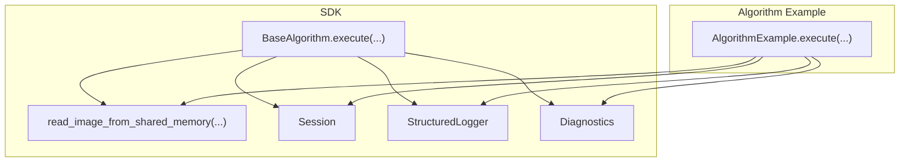
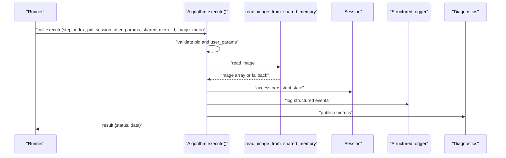
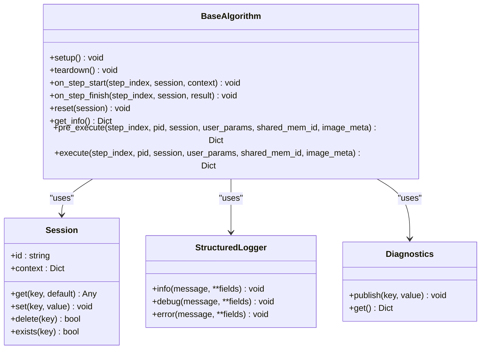
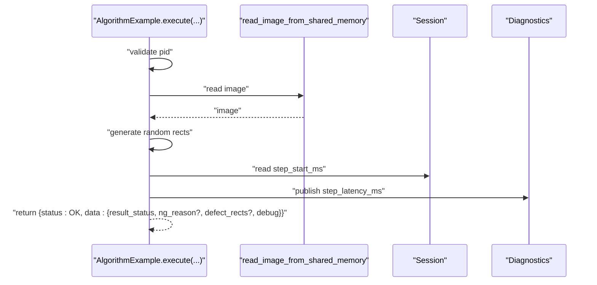
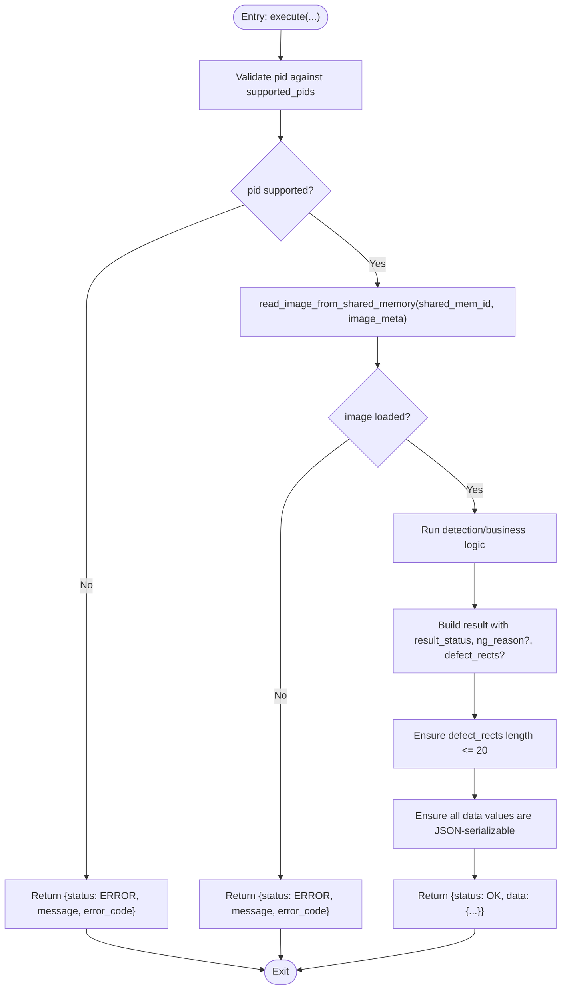
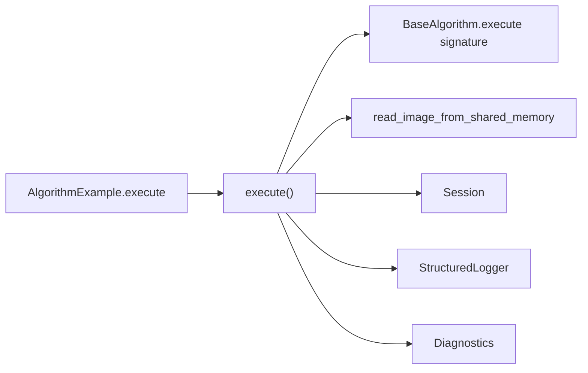

# execute Method

<cite>
**Referenced Files in This Document**
- [base.py](file://procvision_algorithm_sdk/base.py)
- [session.py](file://procvision_algorithm_sdk/session.py)
- [shared_memory.py](file://procvision_algorithm_sdk/shared_memory.py)
- [logger.py](file://procvision_algorithm_sdk/logger.py)
- [diagnostics.py](file://procvision_algorithm_sdk/diagnostics.py)
- [spec.md](file://spec.md)
- [algorithm_example/main.py](file://algorithm-example/algorithm_example/main.py)
- [test_base_algo.py](file://tests/test_base_algo.py)
</cite>

## Table of Contents
1. [Introduction](#introduction)
2. [Project Structure](#project-structure)
3. [Core Components](#core-components)
4. [Architecture Overview](#architecture-overview)
5. [Detailed Component Analysis](#detailed-component-analysis)
6. [Dependency Analysis](#dependency-analysis)
7. [Performance Considerations](#performance-considerations)
8. [Troubleshooting Guide](#troubleshooting-guide)
9. [Conclusion](#conclusion)

## Introduction
This document focuses on the execute() method in BaseAlgorithm, which is the core detection logic handler responsible for determining NG/OK status based on image analysis and business rules. It explains the shared parameter signature with pre_execute(), the importance of consistent parameter validation patterns, and how to implement robust execution with dynamic configuration loading, image access via shared memory, and persistent state using Session. It also covers the required response structure, critical implementation requirements (limiting defect_rects to 20 elements, ensuring JSON-serializable output, and maintaining sub-30 second execution time), and provides guidance on performance optimization and structured error handling.

## Project Structure
The execute() method is part of the BaseAlgorithm interface defined in the SDK. The algorithm-example demonstrates a minimal implementation that reads images from shared memory, generates synthetic defects, and returns a structured result. Tests validate the basic lifecycle and response shape.

**Diagram sources**
- [base.py](file://procvision_algorithm_sdk/base.py#L1-L58)
- [shared_memory.py](file://procvision_algorithm_sdk/shared_memory.py#L1-L52)
- [session.py](file://procvision_algorithm_sdk/session.py#L1-L36)
- [logger.py](file://procvision_algorithm_sdk/logger.py#L1-L24)
- [diagnostics.py](file://procvision_algorithm_sdk/diagnostics.py#L1-L12)
- [algorithm_example/main.py](file://algorithm-example/algorithm_example/main.py#L1-L150)

**Section sources**
- [base.py](file://procvision_algorithm_sdk/base.py#L1-L58)
- [algorithm_example/main.py](file://algorithm-example/algorithm_example/main.py#L1-L150)

## Core Components
- BaseAlgorithm.execute(): Abstract method that must implement the core detection logic and return a structured result containing result_status (OK/NG), optional ng_reason, defect_rects, and debug information.
- Session: Provides persistent state storage across steps with JSON-serializable constraints.
- Shared Memory: Supplies image data via read_image_from_shared_memory() with fallback behavior.
- StructuredLogger and Diagnostics: Provide standardized logging and diagnostic publishing.

Key responsibilities of execute():
- Validate inputs consistently with pre_execute().
- Load dynamic configurations based on pid and step_index.
- Access image data through shared memory.
- Run detection/business logic.
- Produce a JSON-serializable response with required fields and constraints.

**Section sources**
- [base.py](file://procvision_algorithm_sdk/base.py#L1-L58)
- [session.py](file://procvision_algorithm_sdk/session.py#L1-L36)
- [shared_memory.py](file://procvision_algorithm_sdk/shared_memory.py#L1-L52)
- [logger.py](file://procvision_algorithm_sdk/logger.py#L1-L24)
- [diagnostics.py](file://procvision_algorithm_sdk/diagnostics.py#L1-L12)

## Architecture Overview
The execute() method participates in a deterministic lifecycle orchestrated by the platform/runner. It receives step_index, pid, session, user_params, shared_mem_id, and image_meta, and must return a response with a top-level status and business data under data.

**Diagram sources**
- [base.py](file://procvision_algorithm_sdk/base.py#L1-L58)
- [shared_memory.py](file://procvision_algorithm_sdk/shared_memory.py#L1-L52)
- [session.py](file://procvision_algorithm_sdk/session.py#L1-L36)
- [logger.py](file://procvision_algorithm_sdk/logger.py#L1-L24)
- [diagnostics.py](file://procvision_algorithm_sdk/diagnostics.py#L1-L12)

## Detailed Component Analysis

### execute() Method Contract and Responsibilities
- Signature: Must match pre_execute() in parameter order and semantics.
- Purpose: Perform detection/business logic and produce a structured result.
- Output: Top-level status OK/ERROR; when OK, data must include result_status (OK/NG). Optional fields include ng_reason, defect_rects, position_rects, and debug.
- Constraints:
  - defect_rects must contain no more than 20 elements.
  - All values under data must be JSON-serializable.
  - Execution must complete within 30 seconds.

Consistency with pre_execute():
- Both methods share the same parameter signature and validation patterns.
- Both should return status OK/ERROR and use the same error semantics.

Dynamic configuration loading:
- Use pid to select product-specific configuration.
- Use step_index to select step-specific parameters.
- Store derived values in Session for cross-step persistence.

Image access:
- Use read_image_from_shared_memory(shared_mem_id, image_meta) to obtain the image.
- image_meta must include width, height, timestamp_ms, camera_id; color_space is optional.

Persistent state:
- Use Session.get/set/delete to persist lightweight state across steps.
- Values stored in Session must be JSON-serializable.

Required response structure:
- status: "OK" | "ERROR"
- When status == "OK":
  - data.result_status: "OK" | "NG"
  - When result_status == "NG":
    - data.ng_reason: string
    - data.defect_rects: list of up to 20 defect rectangles
  - Optional:
    - data.position_rects: list of rectangles
    - data.debug: dict with numeric metrics and strings

Validation examples:
- AlgorithmExample demonstrates consistent validation and response shape for both pre_execute and execute.

**Section sources**
- [base.py](file://procvision_algorithm_sdk/base.py#L1-L58)
- [spec.md](file://spec.md#L1-L799)
- [algorithm_example/main.py](file://algorithm-example/algorithm_example/main.py#L1-L150)
- [test_base_algo.py](file://tests/test_base_algo.py#L1-L65)

### Class and Method Relationships

**Diagram sources**
- [base.py](file://procvision_algorithm_sdk/base.py#L1-L58)
- [session.py](file://procvision_algorithm_sdk/session.py#L1-L36)
- [logger.py](file://procvision_algorithm_sdk/logger.py#L1-L24)
- [diagnostics.py](file://procvision_algorithm_sdk/diagnostics.py#L1-L12)

### AlgorithmExample: execute() Implementation Patterns
AlgorithmExample illustrates:
- Consistent validation against supported_pids.
- Reading image data from shared memory.
- Randomly generating defect_rects and position_rects.
- Returning result_status NG/OK with ng_reason and debug metrics.
- Using Session to track step timing and Diagnostics to publish metrics.

**Diagram sources**
- [algorithm_example/main.py](file://algorithm-example/algorithm_example/main.py#L1-L150)

**Section sources**
- [algorithm_example/main.py](file://algorithm-example/algorithm_example/main.py#L1-L150)

### Validation and Error Handling Flow

**Diagram sources**
- [spec.md](file://spec.md#L1-L799)
- [algorithm_example/main.py](file://algorithm-example/algorithm_example/main.py#L1-L150)

## Dependency Analysis
- execute() depends on:
  - BaseAlgorithm.execute() signature contract.
  - read_image_from_shared_memory() for image acquisition.
  - Session for persistent state.
  - StructuredLogger and Diagnostics for observability.
- AlgorithmExample demonstrates these dependencies in practice.

**Diagram sources**
- [base.py](file://procvision_algorithm_sdk/base.py#L1-L58)
- [shared_memory.py](file://procvision_algorithm_sdk/shared_memory.py#L1-L52)
- [session.py](file://procvision_algorithm_sdk/session.py#L1-L36)
- [logger.py](file://procvision_algorithm_sdk/logger.py#L1-L24)
- [diagnostics.py](file://procvision_algorithm_sdk/diagnostics.py#L1-L12)
- [algorithm_example/main.py](file://algorithm-example/algorithm_example/main.py#L1-L150)

**Section sources**
- [base.py](file://procvision_algorithm_sdk/base.py#L1-L58)
- [shared_memory.py](file://procvision_algorithm_sdk/shared_memory.py#L1-L52)
- [session.py](file://procvision_algorithm_sdk/session.py#L1-L36)
- [logger.py](file://procvision_algorithm_sdk/logger.py#L1-L24)
- [diagnostics.py](file://procvision_algorithm_sdk/diagnostics.py#L1-L12)
- [algorithm_example/main.py](file://algorithm-example/algorithm_example/main.py#L1-L150)

## Performance Considerations
- Image I/O:
  - Use read_image_from_shared_memory() efficiently; avoid repeated decoding.
  - Prefer in-memory operations on the returned array.
- Computation:
  - Keep detection logic within 30 seconds; offload heavy work to setup/teardown when possible.
  - Publish latency metrics via debug and Diagnostics to monitor performance.
- Serialization:
  - Ensure all data under data is JSON-serializable; avoid numpy dtypes or custom objects.
- Memory:
  - Avoid storing large objects in Session; keep only small, serializable state.

[No sources needed since this section provides general guidance]

## Troubleshooting Guide
Common issues and resolutions:
- Unsupported pid:
  - Ensure supported_pids aligns with manifest.json and get_info(). Return an error response with a clear message and error_code.
- Empty or invalid image:
  - Validate image_meta fields and handle fallback gracefully. Return an error response if image cannot be loaded.
- Excessive defect_rects:
  - Cap defect_rects to 20 elements before returning the result.
- Non-serializable data:
  - Convert numpy arrays, tensors, or custom objects to native Python types.
- Exceeding execution time:
  - Optimize detection pipeline and publish debug metrics to identify bottlenecks.

**Section sources**
- [spec.md](file://spec.md#L1-L799)
- [algorithm_example/main.py](file://algorithm-example/algorithm_example/main.py#L1-L150)
- [test_base_algo.py](file://tests/test_base_algo.py#L1-L65)

## Conclusion
The execute() method is the heart of the algorithm’s detection logic. By adhering to the shared parameter signature with pre_execute(), validating inputs consistently, loading dynamic configurations based on pid and step_index, accessing image data via shared memory, and leveraging Session for persistent state, algorithms can reliably produce NG/OK results. Following the required response structure, respecting the 20-defect limit, ensuring JSON-serializability, and maintaining sub-30 second execution times guarantees interoperability and performance. Structured logging and diagnostics further support observability and troubleshooting.