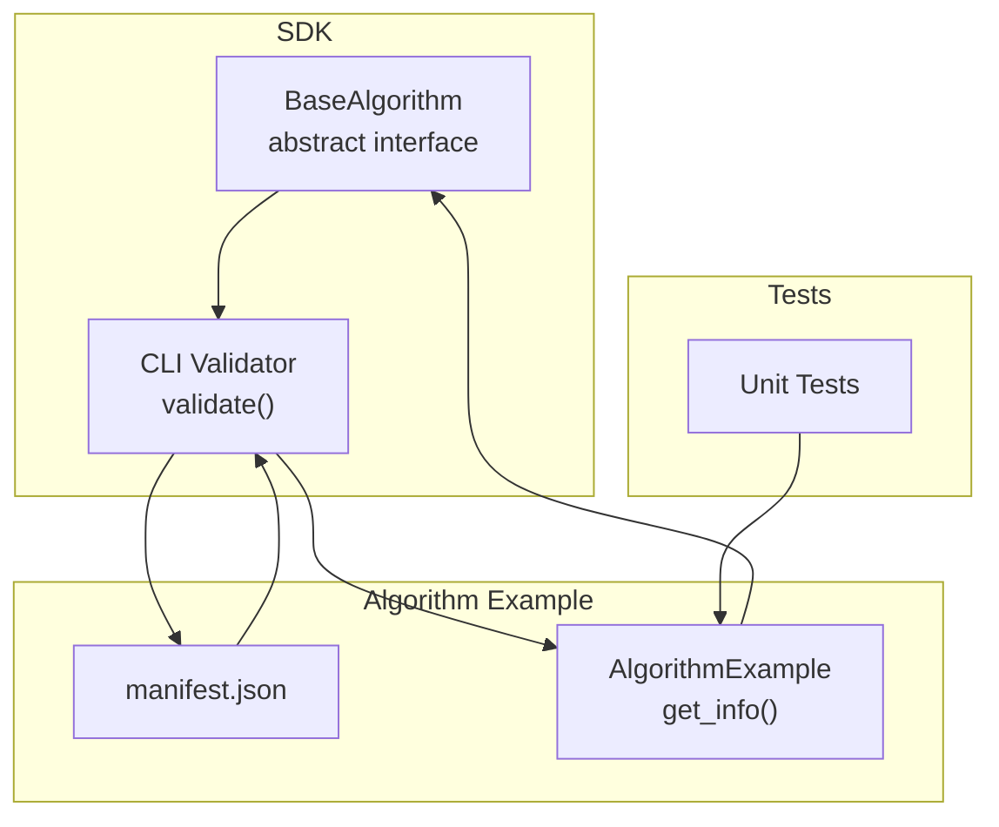
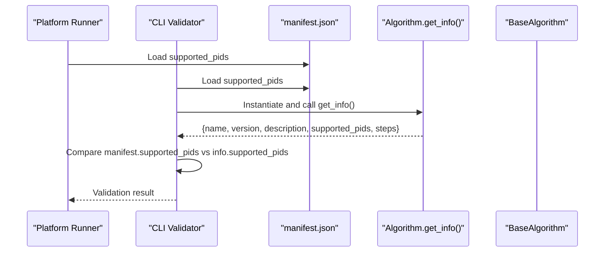
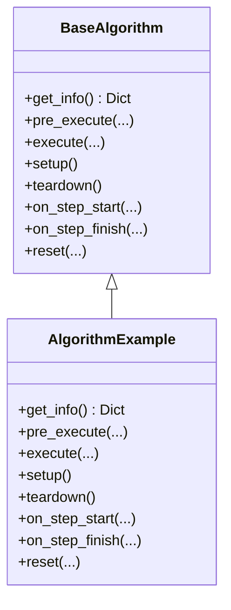
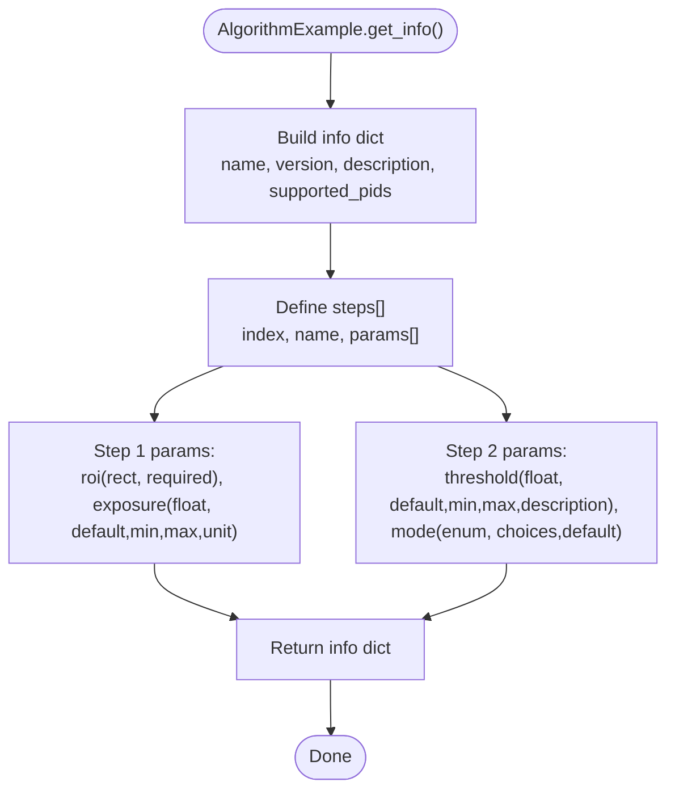
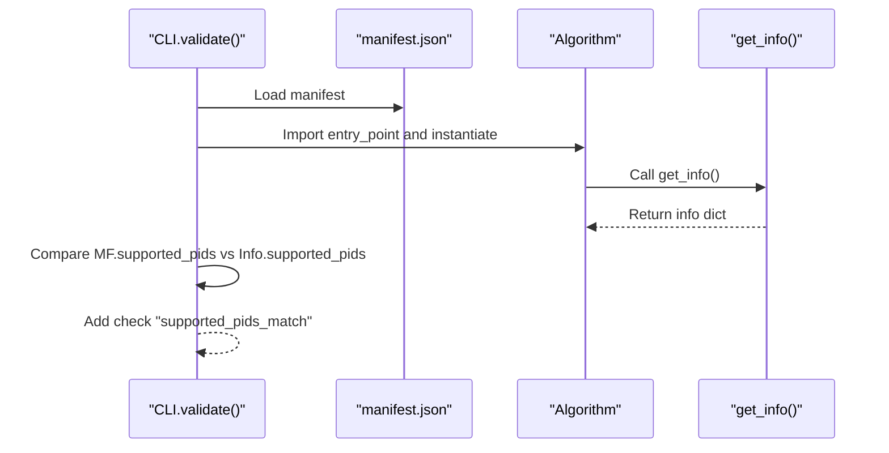
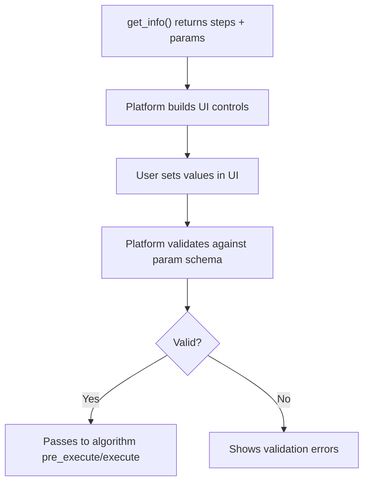
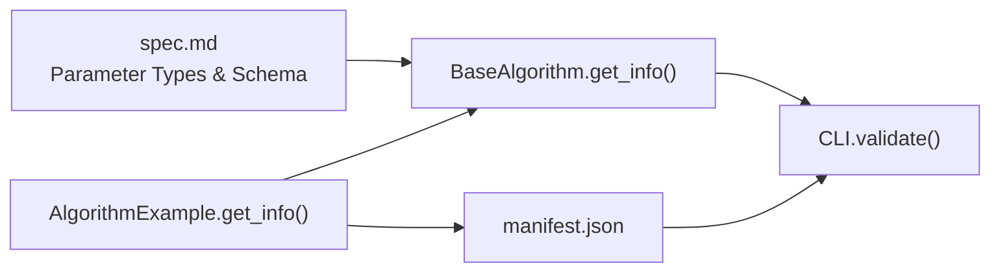

# get_info Method

<cite>
**Referenced Files in This Document**
- [base.py](file://procvision_algorithm_sdk/base.py)
- [cli.py](file://procvision_algorithm_sdk/cli.py)
- [spec.md](file://spec.md)
- [README.md](file://README.md)
- [manifest.json](file://algorithm-example/manifest.json)
- [main.py](file://algorithm-example/algorithm_example/main.py)
- [test_base_algo.py](file://tests/test_base_algo.py)
</cite>

## Table of Contents
1. [Introduction](#introduction)
2. [Project Structure](#project-structure)
3. [Core Components](#core-components)
4. [Architecture Overview](#architecture-overview)
5. [Detailed Component Analysis](#detailed-component-analysis)
6. [Dependency Analysis](#dependency-analysis)
7. [Performance Considerations](#performance-considerations)
8. [Troubleshooting Guide](#troubleshooting-guide)
9. [Conclusion](#conclusion)
10. [Appendices](#appendices)

## Introduction
The get_info() method in BaseAlgorithm is the cornerstone for exposing algorithm metadata and parameter schema to the platform. It defines:
- Algorithm identity and version
- Human-readable description
- Supported product identifiers (PIDs)
- Step definitions with parameter schemas

The platform validates that the supported_pids list returned by get_info exactly matches the manifest.json configuration. This strict requirement ensures correctness and prevents runtime mismatches during execution.

## Project Structure
This repository provides:
- SDK base class and CLI validation
- An example algorithm implementation
- Specification documents detailing the interface contract

**Diagram sources**
- [base.py](file://procvision_algorithm_sdk/base.py#L1-L58)
- [cli.py](file://procvision_algorithm_sdk/cli.py#L1-L120)
- [manifest.json](file://algorithm-example/manifest.json#L1-L24)
- [main.py](file://algorithm-example/algorithm_example/main.py#L1-L150)
- [test_base_algo.py](file://tests/test_base_algo.py#L1-L65)

**Section sources**
- [base.py](file://procvision_algorithm_sdk/base.py#L1-L58)
- [cli.py](file://procvision_algorithm_sdk/cli.py#L1-L120)
- [manifest.json](file://algorithm-example/manifest.json#L1-L24)
- [main.py](file://algorithm-example/algorithm_example/main.py#L1-L150)
- [test_base_algo.py](file://tests/test_base_algo.py#L1-L65)

## Core Components
- BaseAlgorithm.get_info(): Abstract method that must return a dictionary containing algorithm metadata and step parameter schemas.
- CLI.validate(): Loads manifest.json, imports the entry point class, instantiates the algorithm, calls get_info(), and enforces supported_pids equality.
- AlgorithmExample.get_info(): Concrete implementation demonstrating supported_pids and multi-step parameter schemas.

Key responsibilities:
- Expose algorithm identity and version
- Declare supported_pids exactly matching manifest.json
- Define steps with parameter keys, types, defaults, constraints, and descriptions
- Enable dynamic UI generation and parameter validation on the platform

**Section sources**
- [base.py](file://procvision_algorithm_sdk/base.py#L1-L58)
- [cli.py](file://procvision_algorithm_sdk/cli.py#L60-L120)
- [main.py](file://algorithm-example/algorithm_example/main.py#L1-L150)
- [spec.md](file://spec.md#L321-L400)

## Architecture Overview
The platform loads an algorithm package, imports the entry point class, and calls get_info() to discover supported_pids and step schemas. The CLI validator mirrors this flow to ensure compliance.

**Diagram sources**
- [cli.py](file://procvision_algorithm_sdk/cli.py#L60-L120)
- [manifest.json](file://algorithm-example/manifest.json#L1-L24)
- [main.py](file://algorithm-example/algorithm_example/main.py#L1-L150)
- [base.py](file://procvision_algorithm_sdk/base.py#L1-L58)

## Detailed Component Analysis

### BaseAlgorithm.get_info() Contract
- Purpose: Return algorithm metadata and step parameter schemas.
- Required fields:
  - name: Must match manifest.json name
  - version: Must match manifest.json version
  - description: Human-readable description
  - supported_pids: Must exactly match manifest.json supported_pids
  - steps: Array of steps, each with index, name, and params
- Parameter types and constraints are defined in the specification.

Dynamic PID support:
- The algorithm instance does not bind to a specific PID in __init__; PID is passed per-call.
- supported_pids declares which PIDs the algorithm supports.
- During validation and execution, the platform ensures the PID is in supported_pids.

**Diagram sources**
- [base.py](file://procvision_algorithm_sdk/base.py#L1-L58)
- [main.py](file://algorithm-example/algorithm_example/main.py#L1-L150)

**Section sources**
- [base.py](file://procvision_algorithm_sdk/base.py#L1-L58)
- [spec.md](file://spec.md#L321-L400)
- [README.md](file://README.md#L1-L116)

### AlgorithmExample.get_info() Implementation
- Declares supported_pids matching the manifest.
- Defines two steps with parameter schemas:
  - Step 1: rect roi and float exposure with min/max/unit
  - Step 2: float threshold with min/max/description and enum mode with choices/default

**Diagram sources**
- [main.py](file://algorithm-example/algorithm_example/main.py#L1-L150)
- [manifest.json](file://algorithm-example/manifest.json#L1-L24)

**Section sources**
- [main.py](file://algorithm-example/algorithm_example/main.py#L1-L150)
- [manifest.json](file://algorithm-example/manifest.json#L1-L24)

### CLI Validation and supported_pids Matching
The CLI loader instantiates the algorithm, calls get_info(), and compares supported_pids from manifest.json and get_info(). This comparison is the critical validation step.

**Diagram sources**
- [cli.py](file://procvision_algorithm_sdk/cli.py#L60-L120)
- [manifest.json](file://algorithm-example/manifest.json#L1-L24)
- [main.py](file://algorithm-example/algorithm_example/main.py#L1-L150)

**Section sources**
- [cli.py](file://procvision_algorithm_sdk/cli.py#L60-L120)

### Dynamic UI Generation and Parameter Validation
- The platform reads the steps and params from get_info() to generate UI controls dynamically.
- Parameter types (int, float, rect, enum, bool, string) and constraints (min, max, unit, choices, required, description) drive validation and rendering.
- The example demonstrates:
  - rect roi for region-of-interest selection
  - float exposure with numeric bounds and unit
  - float threshold with numeric bounds and description
  - enum mode with predefined choices and default

**Diagram sources**
- [spec.md](file://spec.md#L868-L956)
- [main.py](file://algorithm-example/algorithm_example/main.py#L1-L150)

**Section sources**
- [spec.md](file://spec.md#L868-L956)
- [main.py](file://algorithm-example/algorithm_example/main.py#L1-L150)

### Multi-step Organization and Parameter Types
- Organize steps by logical order (index), each with a descriptive name.
- Define parameter keys, types, defaults, and constraints.
- Use rect for spatial regions, float/int for numeric thresholds, enum for discrete modes, bool for toggles, string for paths/text.
- Provide descriptions and units where applicable.

**Section sources**
- [spec.md](file://spec.md#L868-L956)
- [main.py](file://algorithm-example/algorithm_example/main.py#L1-L150)

## Dependency Analysis
- BaseAlgorithm.get_info() is the contract boundary between algorithm and platform.
- CLI.validate() depends on BaseAlgorithm.get_info() and manifest.json to enforce supported_pids equality.
- AlgorithmExample.get_info() depends on the algorithm’s supported_pids and step schemas.

**Diagram sources**
- [spec.md](file://spec.md#L868-L956)
- [base.py](file://procvision_algorithm_sdk/base.py#L1-L58)
- [cli.py](file://procvision_algorithm_sdk/cli.py#L60-L120)
- [manifest.json](file://algorithm-example/manifest.json#L1-L24)
- [main.py](file://algorithm-example/algorithm_example/main.py#L1-L150)

**Section sources**
- [base.py](file://procvision_algorithm_sdk/base.py#L1-L58)
- [cli.py](file://procvision_algorithm_sdk/cli.py#L60-L120)
- [manifest.json](file://algorithm-example/manifest.json#L1-L24)
- [main.py](file://algorithm-example/algorithm_example/main.py#L1-L150)

## Performance Considerations
- get_info() should be lightweight and deterministic; avoid heavy computation.
- Keep supported_pids minimal and precise to reduce validation overhead.
- Parameter schema definitions should be concise to aid fast UI generation.

[No sources needed since this section provides general guidance]

## Troubleshooting Guide
Common issues and resolutions:

- supported_pids mismatch
  - Symptom: CLI validation fails with supported_pids_match.
  - Cause: supported_pids in manifest.json differs from get_info().
  - Fix: Ensure both lists are identical (order-insensitive for validation, but keep consistent ordering).

- Non-serializable data types
  - Symptom: Session.set() raises serialization errors.
  - Cause: Attempting to store non-JSON-serializable values.
  - Fix: Store only JSON-serializable types in Session.

- Version inconsistencies
  - Symptom: name/version mismatches between manifest.json and get_info().
  - Cause: Out-of-sync versions.
  - Fix: Align name and version in both manifest.json and get_info().

- Schema mismatches
  - Symptom: UI shows unexpected controls or validation fails.
  - Cause: Parameter types, defaults, or constraints do not match expectations.
  - Fix: Review spec-defined parameter types and constraints; align with get_info().

- Missing required fields
  - Symptom: CLI reports get_info or step_schema failures.
  - Cause: Missing name, version, description, supported_pids, or steps.
  - Fix: Provide all required fields as per the specification.

**Section sources**
- [cli.py](file://procvision_algorithm_sdk/cli.py#L60-L120)
- [spec.md](file://spec.md#L321-L400)
- [README.md](file://README.md#L1-L116)

## Conclusion
The get_info() method is central to platform integration. It must:
- Match manifest.json supported_pids exactly
- Provide accurate name, version, description
- Define clear step schemas with parameter types and constraints

By following the specification and validating with the CLI, you ensure dynamic UI generation, robust parameter validation, and reliable platform behavior.

[No sources needed since this section summarizes without analyzing specific files]

## Appendices

### Appendix A: Required Return Structure
- name: Algorithm identifier (must match manifest.json)
- version: Semantic version (must match manifest.json)
- description: Human-readable description
- supported_pids: List of supported product identifiers
- steps: Array of steps, each with:
  - index: Integer step index
  - name: Human-readable step name
  - params: Array of parameter definitions with:
    - key: Parameter identifier
    - type: One of int, float, rect, enum, bool, string
    - default: Optional default value
    - min/max: Numeric bounds for int/float
    - unit: Optional unit label
    - choices: Enum choices
    - required: Boolean flag
    - description: Human-readable description

**Section sources**
- [spec.md](file://spec.md#L321-L400)
- [spec.md](file://spec.md#L868-L956)

### Appendix B: Example References
- AlgorithmExample.get_info(): Demonstrates supported_pids and multi-step parameter schemas.
- CLI.validate(): Validates supported_pids equality and smoke-executes pre_execute/execute.

**Section sources**
- [main.py](file://algorithm-example/algorithm_example/main.py#L1-L150)
- [cli.py](file://procvision_algorithm_sdk/cli.py#L60-L120)