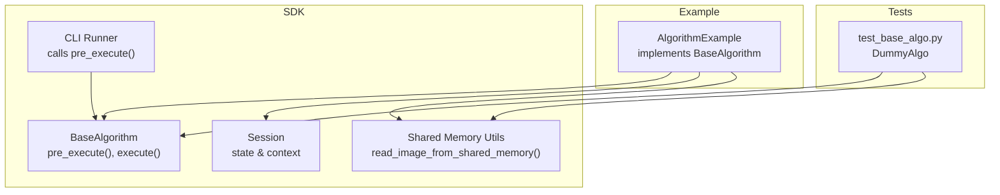
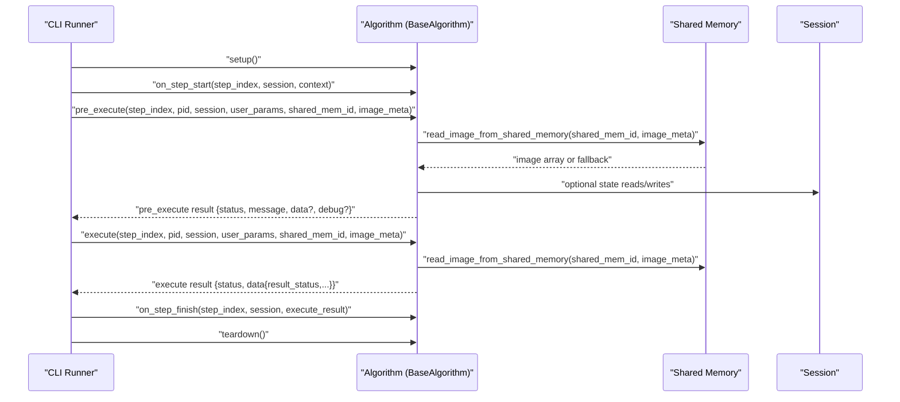
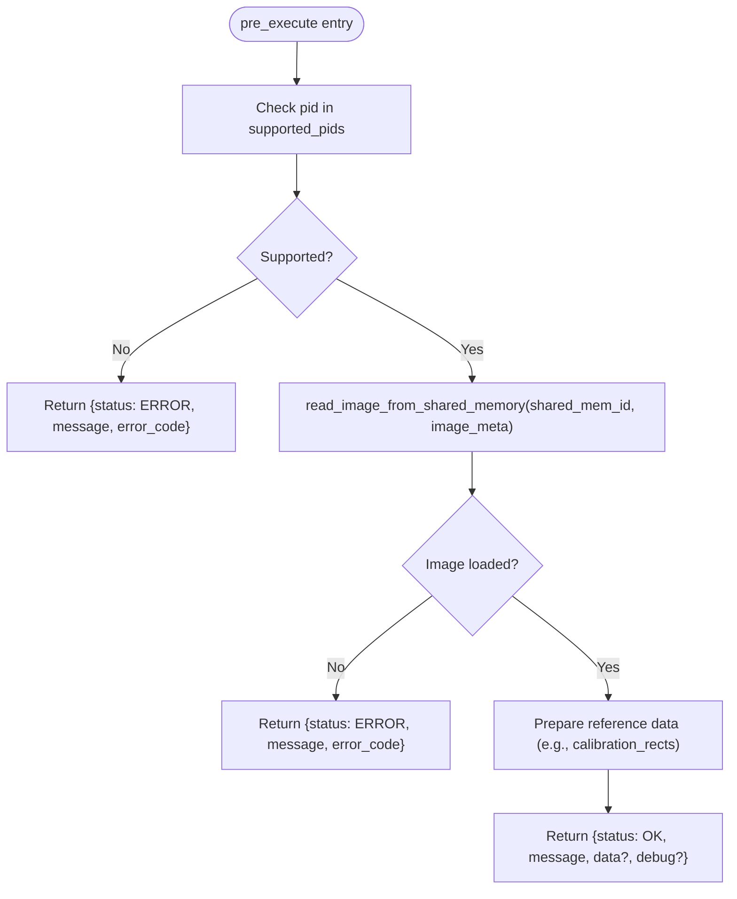
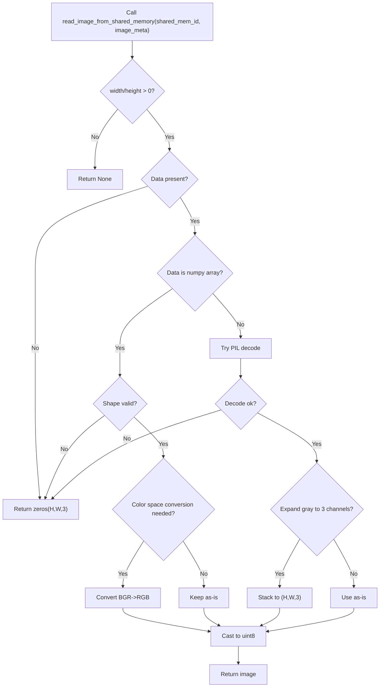
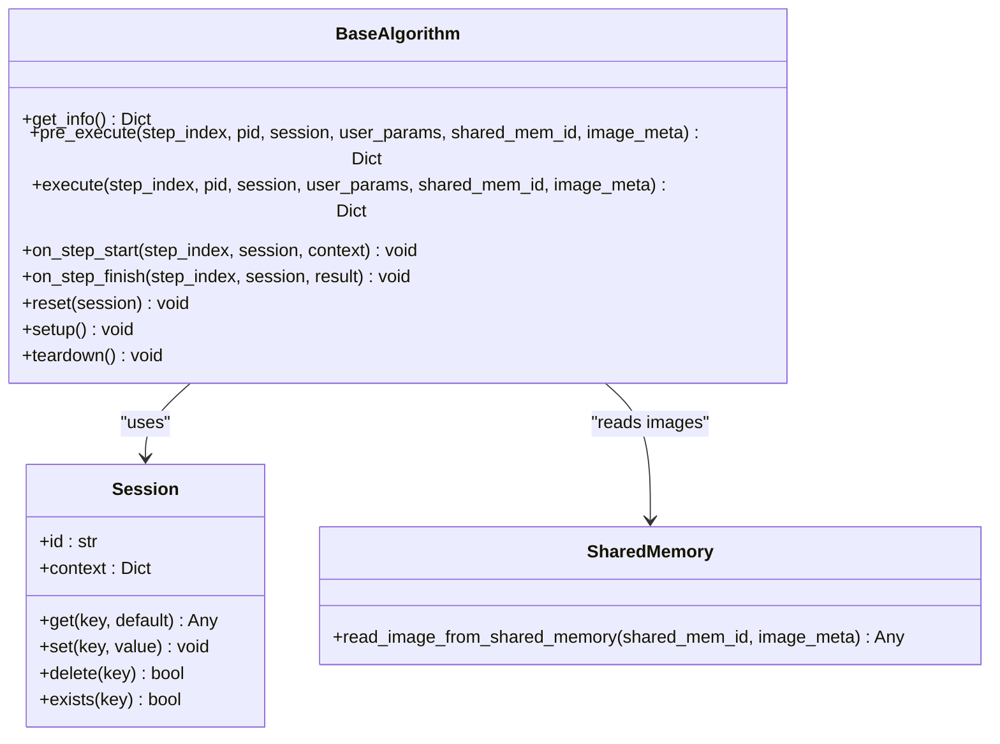

# pre_execute Method

<cite>
**Referenced Files in This Document**
- [base.py](file://procvision_algorithm_sdk/base.py)
- [session.py](file://procvision_algorithm_sdk/session.py)
- [shared_memory.py](file://procvision_algorithm_sdk/shared_memory.py)
- [cli.py](file://procvision_algorithm_sdk/cli.py)
- [main.py](file://algorithm-example/algorithm_example/main.py)
- [test_base_algo.py](file://tests/test_base_algo.py)
- [spec.md](file://spec.md)
- [README.md](file://README.md)
</cite>

## Table of Contents
1. [Introduction](#introduction)
2. [Project Structure](#project-structure)
3. [Core Components](#core-components)
4. [Architecture Overview](#architecture-overview)
5. [Detailed Component Analysis](#detailed-component-analysis)
6. [Dependency Analysis](#dependency-analysis)
7. [Performance Considerations](#performance-considerations)
8. [Troubleshooting Guide](#troubleshooting-guide)
9. [Conclusion](#conclusion)
10. [Appendices](#appendices)

## Introduction
This document explains the pre_execute() method in BaseAlgorithm, focusing on its role in preparing and validating conditions before full execution. It covers the parameter signature, grouping logic, product ID validation, image access via shared memory, lightweight processing, dynamic calibration rectangle generation, cross-step state management with Session, performance considerations, and structured error handling. It also clarifies the distinction between pre_execute and execute.

## Project Structure
The SDK defines the BaseAlgorithm interface and runtime helpers (Session, shared memory utilities). Example algorithms demonstrate typical pre_execute usage, and tests validate the contract.

**Diagram sources**
- [base.py](file://procvision_algorithm_sdk/base.py#L1-L58)
- [session.py](file://procvision_algorithm_sdk/session.py#L1-L36)
- [shared_memory.py](file://procvision_algorithm_sdk/shared_memory.py#L1-L53)
- [cli.py](file://procvision_algorithm_sdk/cli.py#L180-L230)
- [main.py](file://algorithm-example/algorithm_example/main.py#L1-L150)
- [test_base_algo.py](file://tests/test_base_algo.py#L1-L65)

**Section sources**
- [base.py](file://procvision_algorithm_sdk/base.py#L1-L58)
- [README.md](file://README.md#L1-L116)

## Core Components
- BaseAlgorithm: Defines the abstract interface including pre_execute() and execute().
- Session: Provides cross-step state storage and context sharing.
- Shared Memory Utilities: Provide read_image_from_shared_memory() for lightweight image access.
- CLI Runner: Invokes pre_execute() before execute() during local runs.

Key responsibilities:
- pre_execute(): Validates readiness and returns reference data (e.g., calibration rectangles) without performing heavy detection.
- execute(): Performs the actual detection and returns business outcomes.

**Section sources**
- [base.py](file://procvision_algorithm_sdk/base.py#L1-L58)
- [session.py](file://procvision_algorithm_sdk/session.py#L1-L36)
- [shared_memory.py](file://procvision_algorithm_sdk/shared_memory.py#L1-L53)
- [cli.py](file://procvision_algorithm_sdk/cli.py#L180-L230)

## Architecture Overview
The pre_execute() call flow integrates with the CLI runner and uses shared memory for image access. It validates product support and performs minimal checks to ensure readiness.

**Diagram sources**
- [cli.py](file://procvision_algorithm_sdk/cli.py#L180-L230)
- [base.py](file://procvision_algorithm_sdk/base.py#L1-L58)
- [shared_memory.py](file://procvision_algorithm_sdk/shared_memory.py#L1-L53)
- [session.py](file://procvision_algorithm_sdk/session.py#L1-L36)

## Detailed Component Analysis

### Parameter Signature and Grouping Logic
- step_index: Integer index of the current step (1-based in quickstart).
- pid: Product identifier string validated against supported_pids.
- session: Cross-step state container for storing transient data.
- user_params: User-provided parameters validated by the platform before calling pre_execute().
- shared_mem_id: Identifier for the shared memory region containing the image payload.
- image_meta: Metadata describing the image shape and color space; minimum keys include width, height, timestamp_ms, camera_id.

Grouping rationale:
- Pre-execution validation and preparation are grouped under pre_execute() to separate concerns from the heavy detection logic in execute().
- Parameters are intentionally minimal to keep pre_execute fast and deterministic.

**Section sources**
- [base.py](file://procvision_algorithm_sdk/base.py#L20-L58)
- [README.md](file://README.md#L1-L116)
- [cli.py](file://procvision_algorithm_sdk/cli.py#L180-L230)

### Product ID Validation Against supported_pids
- Algorithms define _supported_pids in their constructor.
- pre_execute() must check pid against _supported_pids and return a structured error response if unsupported.
- The error response pattern uses status=ERROR with message and error_code.

**Diagram sources**
- [main.py](file://algorithm-example/algorithm_example/main.py#L1-L150)
- [test_base_algo.py](file://tests/test_base_algo.py#L1-L65)

**Section sources**
- [main.py](file://algorithm-example/algorithm_example/main.py#L1-L150)
- [test_base_algo.py](file://tests/test_base_algo.py#L1-L65)

### Accessing Image Data via read_image_from_shared_memory
- read_image_from_shared_memory() supports:
  - Numpy arrays (H,W,3) or grayscale (H,W)/(H,W,1) expanded to 3 channels.
  - Bytes (e.g., JPEG/PNG) decoded to arrays.
  - Color space conversion: BGR to RGB when color_space=BGR.
- Fallback behavior: Returns zeros(H,W,3) when metadata invalid or no data.
- Usage in pre_execute(): Perform lightweight checks (e.g., shape validation, brightness estimation) without heavy inference.

**Diagram sources**
- [shared_memory.py](file://procvision_algorithm_sdk/shared_memory.py#L1-L53)

**Section sources**
- [shared_memory.py](file://procvision_algorithm_sdk/shared_memory.py#L1-L53)
- [README.md](file://README.md#L1-L116)

### Lightweight Processing in pre_execute
- Typical pre_execute tasks:
  - Validate product support and image availability.
  - Compute minimal reference data (e.g., dynamic calibration rectangles).
  - Measure lightweight metrics (e.g., brightness, ROI coverage).
- The example demonstrates generating random rectangles and reporting latency in debug.

**Section sources**
- [main.py](file://algorithm-example/algorithm_example/main.py#L1-L150)

### Dynamic Calibration Rectangle Generation
- pre_execute() can return calibration_rects in data to guide downstream steps.
- The example generates 1–3 random rectangles with labels and positions derived from image_meta width/height.

**Section sources**
- [main.py](file://algorithm-example/algorithm_example/main.py#L1-L150)

### Using Session for Cross-Step State Management and Parameter Validation
- Session stores transient state (e.g., timestamps) and context (e.g., trace_id).
- Algorithms can persist small amounts of state across steps for timing or coordination.
- Parameter validation is handled by the platform before invoking pre_execute(); algorithms should still guard against unexpected values.

**Section sources**
- [session.py](file://procvision_algorithm_sdk/session.py#L1-L36)
- [cli.py](file://procvision_algorithm_sdk/cli.py#L180-L230)

### Structured Error Handling vs Exceptions
- pre_execute() must return a structured response with status=ERROR on failure.
- The SDK’s error types (RecoverableError, FatalError, etc.) are intended for internal use; pre_execute() should not raise exceptions but return error responses.
- Platform expects consistent status/message/error_code semantics.

**Section sources**
- [errors.py](file://procvision_algorithm_sdk/errors.py#L1-L14)
- [spec.md](file://spec.md#L1070-L1269)

### Distinction Between pre_execute and execute
- pre_execute():
  - Purpose: Validate readiness and return reference data (e.g., calibration_rects).
  - Output: status=OK/ERROR; message; optional data/debug.
  - No business result_status.
- execute():
  - Purpose: Perform detection and return business outcome (OK/NG).
  - Output: status=OK/ERROR; data.result_status=OK/NG; optional defect_rects/position_rects/ng_reason/debug.

**Section sources**
- [spec.md](file://spec.md#L1507-L1546)
- [README.md](file://README.md#L1-L116)

## Dependency Analysis
- BaseAlgorithm depends on Session for state and on shared memory utilities for image access.
- CLI runner orchestrates lifecycle hooks and invokes pre_execute() before execute().
- Example and test implementations demonstrate the contract.

**Diagram sources**
- [base.py](file://procvision_algorithm_sdk/base.py#L1-L58)
- [session.py](file://procvision_algorithm_sdk/session.py#L1-L36)
- [shared_memory.py](file://procvision_algorithm_sdk/shared_memory.py#L1-L53)

**Section sources**
- [base.py](file://procvision_algorithm_sdk/base.py#L1-L58)
- [session.py](file://procvision_algorithm_sdk/session.py#L1-L36)
- [shared_memory.py](file://procvision_algorithm_sdk/shared_memory.py#L1-L53)
- [cli.py](file://procvision_algorithm_sdk/cli.py#L180-L230)

## Performance Considerations
- Keep pre_execute() lightweight:
  - Avoid heavy inference; use minimal checks (shape, brightness thresholds).
  - Return debug.latency_ms to monitor overhead.
- Image access:
  - read_image_from_shared_memory() handles decoding and conversions; avoid repeated loads by caching small metadata in Session when appropriate.
- Time-sensitive tasks:
  - Use Session timestamps to measure and report latency.
  - Ensure image_meta.width/height are valid to prevent unnecessary fallbacks.

**Section sources**
- [main.py](file://algorithm-example/algorithm_example/main.py#L1-L150)
- [shared_memory.py](file://procvision_algorithm_sdk/shared_memory.py#L1-L53)
- [session.py](file://procvision_algorithm_sdk/session.py#L1-L36)

## Troubleshooting Guide
Common issues and resolutions:
- Unsupported product ID:
  - Symptom: pre_execute returns ERROR with error_code indicating unsupported pid.
  - Resolution: Ensure _supported_pids includes the incoming pid.
- Empty or invalid image:
  - Symptom: pre_execute returns ERROR with error_code indicating missing image.
  - Resolution: Verify shared_mem_id and image_meta (width/height > 0); confirm upstream producer writes the image.
- Unexpected error responses:
  - Symptom: Status differs from expected or missing message.
  - Resolution: Align with spec.md’s pre_execute return schema; ensure status=OK only when ready.

**Section sources**
- [test_base_algo.py](file://tests/test_base_algo.py#L1-L65)
- [spec.md](file://spec.md#L1070-L1269)

## Conclusion
pre_execute() is the gateway to safe execution, responsible for validating readiness and returning reference data without performing heavy detection. By adhering to the parameter contract, using Session for state, accessing images via shared memory, and returning structured responses, algorithms can integrate cleanly with the platform while maintaining robustness and performance.

## Appendices

### API Reference: pre_execute Signature
- Inputs:
  - step_index: int
  - pid: str
  - session: Session
  - user_params: Dict[str, Any]
  - shared_mem_id: str
  - image_meta: Dict[str, Any]
- Outputs:
  - Dict with fields: status, message, optional data, optional debug
  - data may include calibration_rects for guidance
  - debug may include latency_ms and other metrics

**Section sources**
- [base.py](file://procvision_algorithm_sdk/base.py#L20-L58)
- [spec.md](file://spec.md#L1507-L1546)