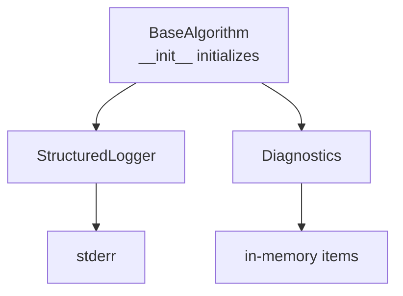
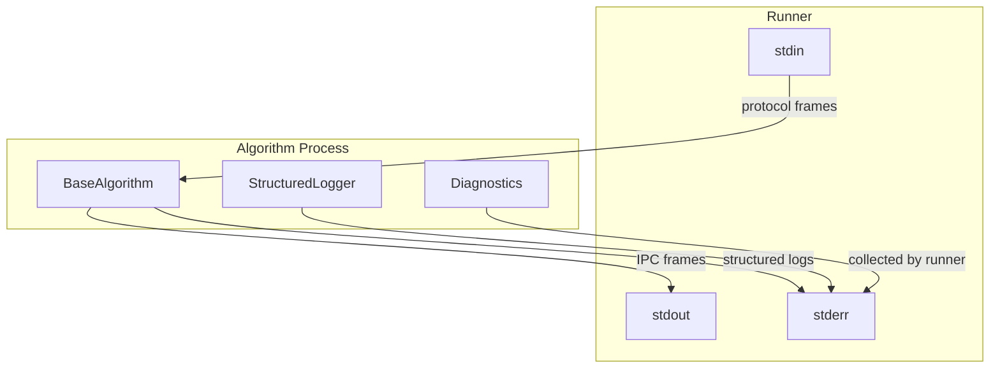
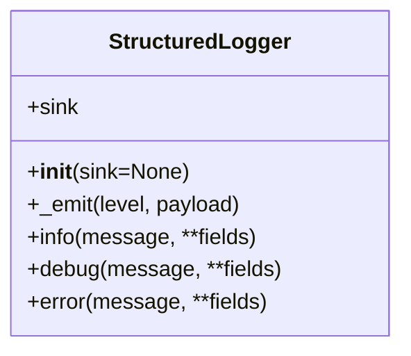
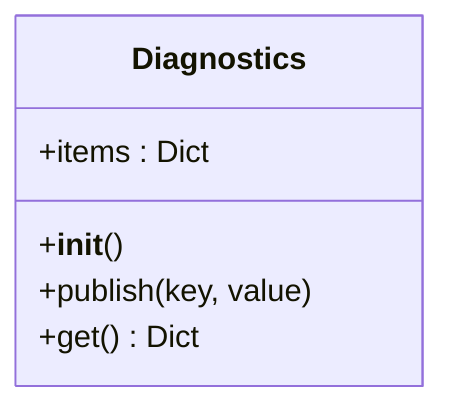
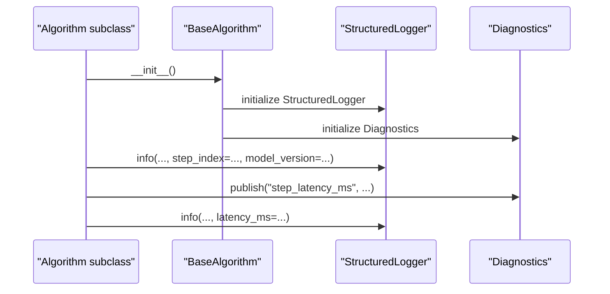
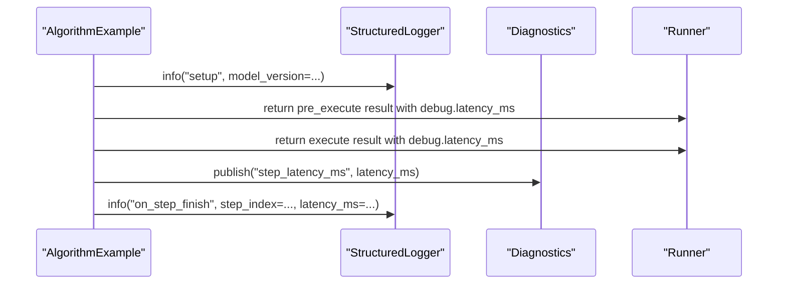
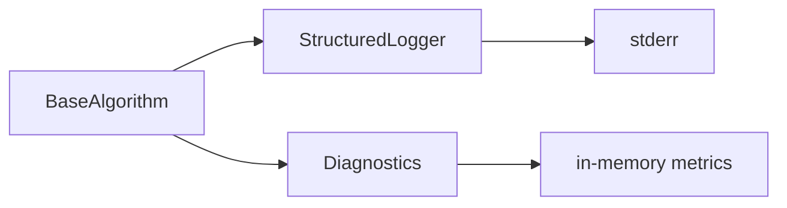

# Infrastructure Attributes

<cite>
**Referenced Files in This Document**
- [base.py](file://procvision_algorithm_sdk/base.py)
- [logger.py](file://procvision_algorithm_sdk/logger.py)
- [diagnostics.py](file://procvision_algorithm_sdk/diagnostics.py)
- [session.py](file://procvision_algorithm_sdk/session.py)
- [runner_spec.md](file://runner_spec.md)
- [spec.md](file://spec.md)
- [algorithm_example/main.py](file://algorithm-example/algorithm_example/main.py)
- [tests/test_base_algo.py](file://tests/test_base_algo.py)
</cite>

## Table of Contents
1. [Introduction](#introduction)
2. [Project Structure](#project-structure)
3. [Core Components](#core-components)
4. [Architecture Overview](#architecture-overview)
5. [Detailed Component Analysis](#detailed-component-analysis)
6. [Dependency Analysis](#dependency-analysis)
7. [Performance Considerations](#performance-considerations)
8. [Troubleshooting Guide](#troubleshooting-guide)
9. [Conclusion](#conclusion)

## Introduction
This document explains the BaseAlgorithm infrastructure attributes logger and diagnostics, focusing on how they support structured logging to stderr and diagnostic metric publishing for UI display and remote troubleshooting. It also clarifies how these components are automatically initialized in BaseAlgorithm.__init__, why direct print statements must be avoided, and how they relate to the runner’s protocol isolation requirements where stdout is reserved exclusively for IPC messages.

## Project Structure
The BaseAlgorithm class exposes two primary infrastructure attributes:
- logger: a structured logger writing JSON records to stderr
- diagnostics: a lightweight metrics aggregator for debug fields

These are initialized automatically during BaseAlgorithm construction and are ready for immediate use inside algorithm lifecycle hooks and execution methods.

**Diagram sources**
- [base.py](file://procvision_algorithm_sdk/base.py#L1-L30)
- [logger.py](file://procvision_algorithm_sdk/logger.py#L1-L24)
- [diagnostics.py](file://procvision_algorithm_sdk/diagnostics.py#L1-L12)

**Section sources**
- [base.py](file://procvision_algorithm_sdk/base.py#L1-L30)

## Core Components
- StructuredLogger
  - Purpose: Emit structured log records to stderr with consistent fields (level, timestamp_ms, message, and optional custom fields).
  - Output: Single-line JSON records flushed immediately to stderr.
  - Levels: info, debug, error.
- Diagnostics
  - Purpose: Aggregate key-value metrics (e.g., latency, model version, confidence) during execution for later retrieval and UI display.
  - Access: publish(key, value) and get() return a copy of the internal dictionary.

Both components are instantiated in BaseAlgorithm.__init__ and are available as self.logger and self.diagnostics for all algorithm subclasses.

**Section sources**
- [logger.py](file://procvision_algorithm_sdk/logger.py#L1-L24)
- [diagnostics.py](file://procvision_algorithm_sdk/diagnostics.py#L1-L12)
- [base.py](file://procvision_algorithm_sdk/base.py#L1-L30)

## Architecture Overview
The runner enforces strict protocol isolation:
- stdout: reserved for IPC frames (hello, ping/pong, call, result).
- stderr: reserved for structured logs produced by the logger.

This separation ensures that protocol parsing remains deterministic and unaffected by ad-hoc print statements.

**Diagram sources**
- [runner_spec.md](file://runner_spec.md#L1-L120)
- [spec.md](file://spec.md#L615-L637)
- [logger.py](file://procvision_algorithm_sdk/logger.py#L1-L24)
- [diagnostics.py](file://procvision_algorithm_sdk/diagnostics.py#L1-L12)

## Detailed Component Analysis

### StructuredLogger
- Initialization and sink
  - Defaults to stderr; can accept a custom sink for testing.
- Emission format
  - Records include level, timestamp_ms, message, and any additional fields passed to info/debug/error.
  - Each record is written as a single-line JSON and flushed immediately.
- Usage patterns
  - Prefer logger.info/debug/error over print to stderr.
  - Include contextual fields (e.g., step_index, latency_ms, model_version) to aid UI and troubleshooting.

**Diagram sources**
- [logger.py](file://procvision_algorithm_sdk/logger.py#L1-L24)

**Section sources**
- [logger.py](file://procvision_algorithm_sdk/logger.py#L1-L24)

### Diagnostics
- Purpose
  - Collect runtime metrics (e.g., latency_ms, model_version, confidence) during algorithm execution.
- API
  - publish(key, value): stores a metric under the given key.
  - get(): returns a shallow copy of the current metrics dictionary.
- Typical usage
  - Publish latency_ms in on_step_finish.
  - Include debug fields in pre_execute/execute responses for UI visibility.

**Diagram sources**
- [diagnostics.py](file://procvision_algorithm_sdk/diagnostics.py#L1-L12)

**Section sources**
- [diagnostics.py](file://procvision_algorithm_sdk/diagnostics.py#L1-L12)

### BaseAlgorithm Integration
- Automatic initialization
  - BaseAlgorithm.__init__ creates StructuredLogger and Diagnostics instances and assigns them to self.logger and self.diagnostics.
- Lifecycle hooks
  - setup/teardown: good places to emit lifecycle events.
  - on_step_start/on_step_finish: ideal for measuring step latency and publishing diagnostics.
- Execution methods
  - pre_execute/execute: include debug fields in response.data.debug for UI display.

**Diagram sources**
- [base.py](file://procvision_algorithm_sdk/base.py#L1-L30)
- [logger.py](file://procvision_algorithm_sdk/logger.py#L1-L24)
- [diagnostics.py](file://procvision_algorithm_sdk/diagnostics.py#L1-L12)

**Section sources**
- [base.py](file://procvision_algorithm_sdk/base.py#L1-L30)

### Usage Examples from the Codebase
- Example algorithm demonstrates:
  - Using logger.info in setup/teardown and on_step_start/on_step_finish.
  - Publishing step_latency_ms via Diagnostics.
  - Including debug fields in pre_execute/execute responses.
- Tests demonstrate:
  - Basic algorithm flow and result structure expectations.

**Diagram sources**
- [algorithm_example/main.py](file://algorithm-example/algorithm_example/main.py#L1-L150)
- [tests/test_base_algo.py](file://tests/test_base_algo.py#L1-L65)

**Section sources**
- [algorithm_example/main.py](file://algorithm-example/algorithm_example/main.py#L1-L150)
- [tests/test_base_algo.py](file://tests/test_base_algo.py#L1-L65)

## Dependency Analysis
- BaseAlgorithm depends on StructuredLogger and Diagnostics.
- Logger writes to stderr; Diagnostics stores metrics in memory.
- Runner reads stderr for structured logs and collects debug fields from algorithm responses.

**Diagram sources**
- [base.py](file://procvision_algorithm_sdk/base.py#L1-L30)
- [logger.py](file://procvision_algorithm_sdk/logger.py#L1-L24)
- [diagnostics.py](file://procvision_algorithm_sdk/diagnostics.py#L1-L12)

**Section sources**
- [base.py](file://procvision_algorithm_sdk/base.py#L1-L30)
- [runner_spec.md](file://runner_spec.md#L1-L120)

## Performance Considerations
- Logging overhead
  - StructuredLogger flushes after each record; keep log volume reasonable to avoid I/O contention.
- Diagnostic bloat
  - Avoid publishing large or frequently changing metrics; prefer compact summaries.
- Protocol purity
  - Excessive stderr output can increase log ingestion load; align with runner’s log retention policies.

[No sources needed since this section provides general guidance]

## Troubleshooting Guide
Common issues and resolutions:
- Unstructured log output interfering with protocol parsing
  - Symptom: stdout contains non-JSON text or mixed content.
  - Cause: direct print statements or third-party libraries printing to stdout.
  - Fix: route all logs through logger.info/debug/error; ensure only IPC frames go to stdout.
  - Reference: runner protocol requires stdout for IPC frames only.
- Excessive diagnostic data impacting performance
  - Symptom: high memory usage or slow response times.
  - Cause: publishing large or redundant metrics.
  - Fix: prune unnecessary keys; publish only essential metrics; periodically clear diagnostics if needed.
- Missing error context in logs
  - Symptom: logs lack timestamps, step_index, or session context.
  - Cause: inconsistent field usage or missing structured fields.
  - Fix: include step_index, session_id, latency_ms, model_version, and other relevant fields in logger calls and debug blocks.

Protocol isolation and field requirements:
- Runner specification mandates:
  - stdout: IPC frames only.
  - stderr: structured logs (recommended fields include timestamp_ms, level, message, step_index, and others).
  - Debug fields in algorithm responses (e.g., debug.latency_ms) for UI and troubleshooting.

**Section sources**
- [runner_spec.md](file://runner_spec.md#L1-L120)
- [spec.md](file://spec.md#L634-L637)
- [logger.py](file://procvision_algorithm_sdk/logger.py#L1-L24)
- [diagnostics.py](file://procvision_algorithm_sdk/diagnostics.py#L1-L12)

## Conclusion
BaseAlgorithm’s logger and diagnostics provide a robust foundation for structured logging and diagnostic metrics collection. They are automatically initialized and ready for immediate use, enabling consistent, machine-readable logs and UI-friendly metrics while preserving the runner’s protocol isolation. By following the recommended patterns—using logger.info/debug/error, publishing targeted diagnostics, and keeping stdout free for IPC—you ensure reliable operation, efficient troubleshooting, and seamless platform integration.