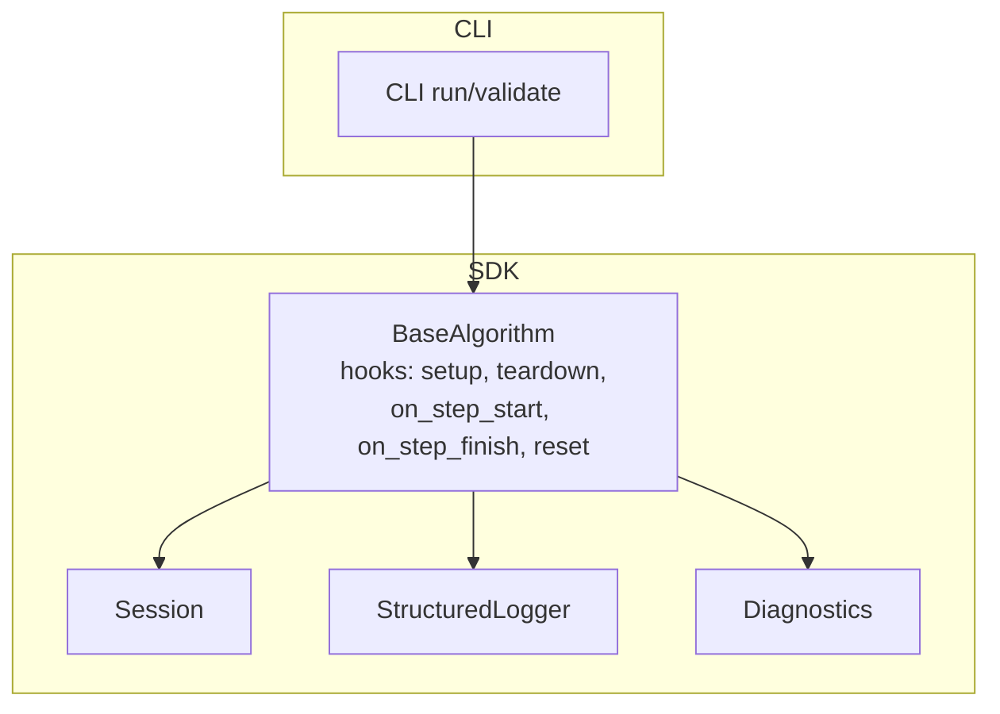
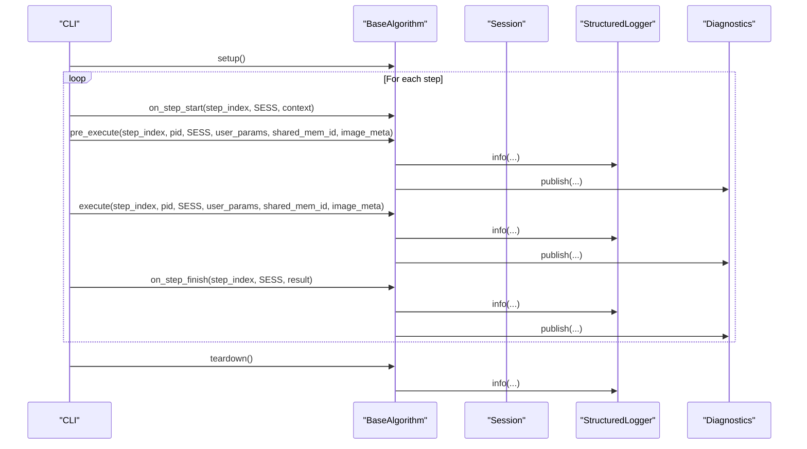
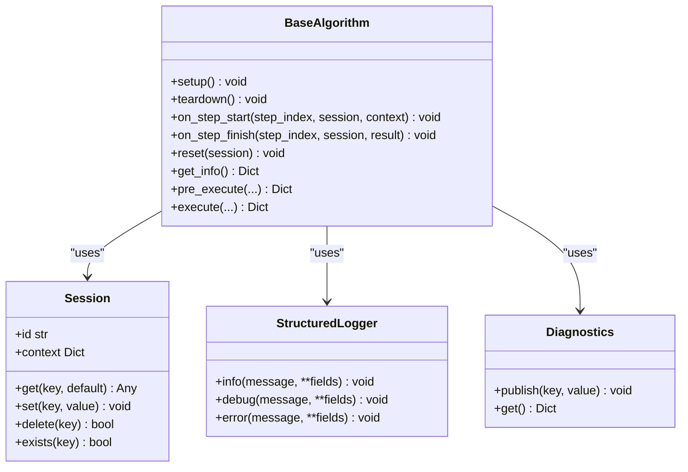
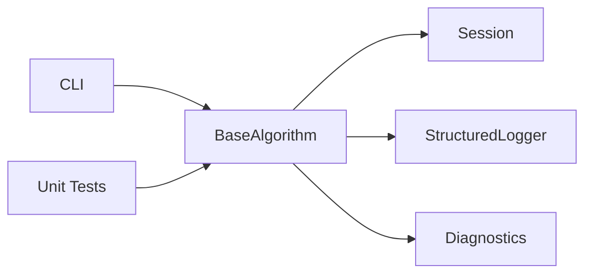

# Lifecycle Hooks

<cite>
**Referenced Files in This Document**
- [base.py](file://procvision_algorithm_sdk/base.py)
- [session.py](filevision_algorithm_sdk/session.py)
- [logger.py](file://procvision_algorithm_sdk/logger.py)
- [diagnostics.py](file://procvision_algorithm_sdk/diagnostics.py)
- [cli.py](file://procvision_algorithm_sdk/cli.py)
- [spec.md](file://spec.md)
- [algorithm_example/main.py](file://algorithm-example/algorithm_example/main.py)
- [test_base_algo.py](file://tests/test_base_algo.py)
</cite>

## Table of Contents
1. [Introduction](#introduction)
2. [Project Structure](#project-structure)
3. [Core Components](#core-components)
4. [Architecture Overview](#architecture-overview)
5. [Detailed Component Analysis](#detailed-component-analysis)
6. [Dependency Analysis](#dependency-analysis)
7. [Performance Considerations](#performance-considerations)
8. [Troubleshooting Guide](#troubleshooting-guide)
9. [Conclusion](#conclusion)
10. [Appendices](#appendices)

## Introduction
This document explains the BaseAlgorithm lifecycle hooks: setup(), teardown(), on_step_start(), on_step_finish(), and reset(). It covers invocation sequence and timing, primary use cases, best practices, and integration with Session and logging for observability. It also highlights common pitfalls such as improper resource cleanup and performance implications of heavy operations in per-step hooks.

## Project Structure
The lifecycle hooks are part of the BaseAlgorithm interface and are invoked by the SDK’s CLI during development and validation runs. The Session object carries state across steps, while StructuredLogger and Diagnostics support observability.

**Diagram sources**
- [base.py](file://procvision_algorithm_sdk/base.py#L1-L57)
- [session.py](file://procvision_algorithm_sdk/session.py#L1-L36)
- [logger.py](file://procvision_algorithm_sdk/logger.py#L1-L24)
- [diagnostics.py](file://procvision_algorithm_sdk/diagnostics.py#L1-L12)
- [cli.py](file://procvision_algorithm_sdk/cli.py#L70-L120)

**Section sources**
- [base.py](file://procvision_algorithm_sdk/base.py#L1-L57)
- [cli.py](file://procvision_algorithm_sdk/cli.py#L70-L120)

## Core Components
- BaseAlgorithm: Defines the lifecycle hooks as optional methods. They are designed to be lightweight and idempotent where possible.
- Session: Provides a per-flow key-value store and read-only context for cross-step state persistence.
- StructuredLogger: Emits structured log records to stderr for observability.
- Diagnostics: Collects diagnostic metrics that can be published and retrieved.

Key responsibilities:
- setup(): Initialize heavy resources once per algorithm instance.
- teardown(): Release heavy resources before process exit.
- on_step_start(on_step_finish): Per-step instrumentation and cleanup.
- reset(session): Reset temporary state for a new detection run without releasing heavy resources.

**Section sources**
- [base.py](file://procvision_algorithm_sdk/base.py#L1-L57)
- [session.py](file://procvision_algorithm_sdk/session.py#L1-L36)
- [logger.py](file://procvision_algorithm_sdk/logger.py#L1-L24)
- [diagnostics.py](file://procvision_algorithm_sdk/diagnostics.py#L1-L12)

## Architecture Overview
The CLI orchestrates the lifecycle around algorithm execution. It invokes setup() once, then iterates steps, invoking on_step_start(), pre_execute(), execute(), and on_step_finish() per step. Finally, teardown() is called once at the end.

**Diagram sources**
- [cli.py](file://procvision_algorithm_sdk/cli.py#L70-L120)
- [cli.py](file://procvision_algorithm_sdk/cli.py#L180-L230)
- [base.py](file://procvision_algorithm_sdk/base.py#L1-L57)
- [logger.py](file://procvision_algorithm_sdk/logger.py#L1-L24)
- [diagnostics.py](file://procvision_algorithm_sdk/diagnostics.py#L1-L12)

## Detailed Component Analysis

### Invocation Sequence and Timing
- setup(): Called once at the beginning of a run or validate operation.
- on_step_start(step_index, session, context): Called before pre_execute() for each step.
- pre_execute(...): Produces reference data (e.g., templates, ROIs).
- execute(...): Performs the core detection logic.
- on_step_finish(step_index, session, result): Called after execute() completes for each step.
- teardown(): Called once at the end of a run or validate operation.

Notes:
- reset(session) is invoked by the platform when a run is interrupted or restarted; it is not called by the CLI in typical run/validate flows.
- Session is created per run and destroyed automatically after teardown().

**Section sources**
- [cli.py](file://procvision_algorithm_sdk/cli.py#L70-L120)
- [cli.py](file://procvision_algorithm_sdk/cli.py#L180-L230)
- [spec.md](file://spec.md#L3.3.3)

### Hook Purpose and Best Practices

- setup()
  - Purpose: Load heavy resources once per algorithm instance (models, caches, handles).
  - Best practice: Call super().setup() when overriding to preserve parent behavior.
  - Example reference: [setup() definition](file://procvision_algorithm_sdk/base.py#L1-L57), [setup() usage in example](file://algorithm-example/algorithm_example/main.py#L1-L33).

- teardown()
  - Purpose: Release heavy resources before process exit.
  - Best practice: Call super().teardown() when overriding.
  - Example reference: [teardown() definition](file://procvision_algorithm_sdk/base.py#L1-L57), [teardown() usage in example](file://algorithm-example/algorithm_example/main.py#L1-L33).

- on_step_start(step_index, session, context)
  - Purpose: Per-step preparation (e.g., record timestamps, initialize per-step counters).
  - Best practice: Keep it lightweight; avoid heavy computation here.
  - Example reference: [on_step_start() definition](file://procvision_algorithm_sdk/base.py#L1-L57), [on_step_start() usage in example](file://algorithm-example/algorithm_example/main.py#L1-L33).

- on_step_finish(step_index, session, result)
  - Purpose: Per-step cleanup and reporting (e.g., compute latency, publish diagnostics).
  - Best practice: Keep it lightweight; avoid heavy computation here.
  - Example reference: [on_step_finish() definition](file://procvision_algorithm_sdk/base.py#L1-L57), [on_step_finish() usage in example](file://algorithm-example/algorithm_example/main.py#L1-L33).

- reset(session)
  - Purpose: Reset temporary state for a new detection run without releasing heavy resources.
  - Best practice: Do not release model or long-lived handles; only clear transient caches and step-scoped keys.
  - Example reference: [reset() definition](file://procvision_algorithm_sdk/base.py#L1-L57), [reset() usage in example](file://algorithm-example/algorithm_example/main.py#L1-L33).

### Implementation Examples and Patterns
- Extending BaseAlgorithm: Always call super().__init__() and super().setup()/super().teardown() when overriding lifecycle methods.
- Using Session: Store and retrieve step-scoped data via session.set()/session.get(); avoid storing large objects.
- Logging and Diagnostics: Emit structured logs and publish diagnostics for observability.

References:
- [BaseAlgorithm lifecycle hooks](file://procvision_algorithm_sdk/base.py#L1-L57)
- [Session API](file://procvision_algorithm_sdk/session.py#L1-L36)
- [StructuredLogger](file://procvision_algorithm_sdk/logger.py#L1-L24)
- [Diagnostics](file://procvision_algorithm_sdk/diagnostics.py#L1-L12)
- [Example algorithm implementation](file://algorithm-example/algorithm_example/main.py#L1-L59)

**Section sources**
- [base.py](file://procvision_algorithm_sdk/base.py#L1-L57)
- [session.py](file://procvision_algorithm_sdk/session.py#L1-L36)
- [logger.py](file://procvision_algorithm_sdk/logger.py#L1-L24)
- [diagnostics.py](file://procvision_algorithm_sdk/diagnostics.py#L1-L12)
- [algorithm_example/main.py](file://algorithm-example/algorithm_example/main.py#L1-L59)

### Class and Relationship Diagram

**Diagram sources**
- [base.py](file://procvision_algorithm_sdk/base.py#L1-L57)
- [session.py](file://procvision_algorithm_sdk/session.py#L1-L36)
- [logger.py](file://procvision_algorithm_sdk/logger.py#L1-L24)
- [diagnostics.py](file://procvision_algorithm_sdk/diagnostics.py#L1-L12)

## Dependency Analysis
- BaseAlgorithm depends on Session for state persistence, StructuredLogger for logging, and Diagnostics for metrics.
- CLI orchestrates the lifecycle and passes Session instances to hooks.
- Tests demonstrate minimal algorithm usage without overriding hooks.

**Diagram sources**
- [cli.py](file://procvision_algorithm_sdk/cli.py#L70-L120)
- [base.py](file://procvision_algorithm_sdk/base.py#L1-L57)
- [session.py](file://procvision_algorithm_sdk/session.py#L1-L36)
- [logger.py](file://procvision_algorithm_sdk/logger.py#L1-L24)
- [diagnostics.py](file://procvision_algorithm_sdk/diagnostics.py#L1-L12)
- [test_base_algo.py](file://tests/test_base_algo.py#L1-L65)

**Section sources**
- [cli.py](file://procvision_algorithm_sdk/cli.py#L70-L120)
- [base.py](file://procvision_algorithm_sdk/base.py#L1-L57)
- [test_base_algo.py](file://tests/test_base_algo.py#L1-L65)

## Performance Considerations
- Keep on_step_start() and on_step_finish() lightweight to avoid slowing down per-step execution.
- Heavy initialization belongs in setup(); heavy cleanup belongs in teardown().
- Avoid blocking operations in reset() because it may be invoked by the platform during interruption/restart scenarios.
- Use Diagnostics to track latency and throughput; use StructuredLogger for observability without impacting protocol streams.

[No sources needed since this section provides general guidance]

## Troubleshooting Guide
Common issues and remedies:
- Improper resource cleanup leading to memory leaks
  - Ensure teardown() releases heavy resources (models, handles, caches).
  - References: [teardown() definition](file://procvision_algorithm_sdk/base.py#L1-L57), [teardown() usage in example](file://algorithm-example/algorithm_example/main.py#L1-L33).
- Excessive work in per-step hooks
  - Move heavy computations to pre_execute()/execute().
  - References: [on_step_start/on_step_finish definitions](file://procvision_algorithm_sdk/base.py#L1-L57), [example usage](file://algorithm-example/algorithm_example/main.py#L1-L33).
- Incorrect reset semantics
  - reset(session) should clear transient state only; do not release long-lived resources.
  - References: [reset() definition](file://procvision_algorithm_sdk/base.py#L1-L57), [example usage](file://algorithm-example/algorithm_example/main.py#L1-L33).
- Session misuse
  - Do not store large objects in Session; keep it under a small size threshold.
  - References: [Session API](file://procvision_algorithm_sdk/session.py#L1-L36), [Session lifecycle note](file://spec.md#L3.3.3).

**Section sources**
- [base.py](file://procvision_algorithm_sdk/base.py#L1-L57)
- [session.py](file://procvision_algorithm_sdk/session.py#L1-L36)
- [algorithm_example/main.py](file://algorithm-example/algorithm_example/main.py#L1-L59)
- [spec.md](file://spec.md#L3.3.3)

## Conclusion
The BaseAlgorithm lifecycle hooks provide a clean separation of concerns:
- setup() and teardown() manage heavy resources,
- on_step_start() and on_step_finish() instrument per-step execution,
- reset(session) resets temporary state for new runs.
By following best practices—calling super() when overriding, keeping hooks lightweight, and leveraging Session, StructuredLogger, and Diagnostics—you can build robust, observable, and efficient algorithms.

[No sources needed since this section summarizes without analyzing specific files]

## Appendices

### Appendix A: Hook Timing in CLI Runs
- validate/run sequences call setup(), on_step_start(), pre_execute(), execute(), on_step_finish(), teardown() in order.
- reset() is invoked by the platform during interruption/restart; it is not called by the CLI in typical flows.

**Section sources**
- [cli.py](file://procvision_algorithm_sdk/cli.py#L70-L120)
- [cli.py](file://procvision_algorithm_sdk/cli.py#L180-L230)
- [spec.md](file://spec.md#L3.3.3)

### Appendix B: Example Algorithm Using Lifecycle Hooks
- Demonstrates setup(), teardown(), on_step_start(), on_step_finish(), and reset(session) usage patterns.

**Section sources**
- [algorithm_example/main.py](file://algorithm-example/algorithm_example/main.py#L1-L59)