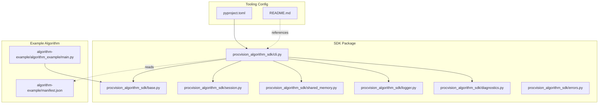
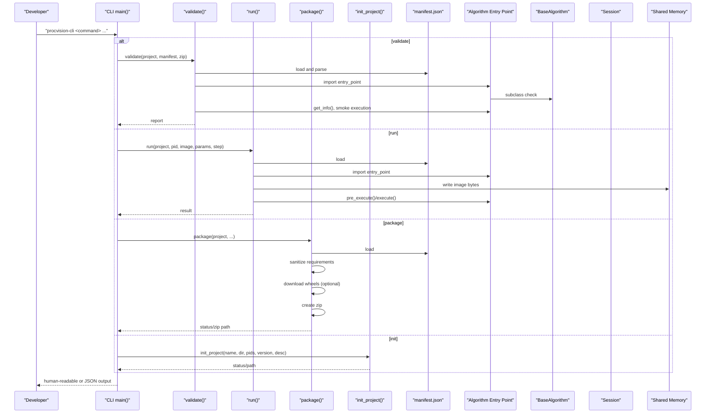
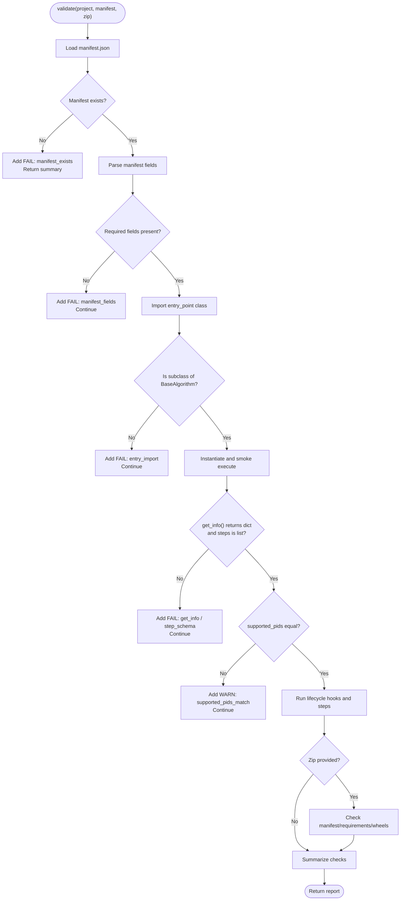
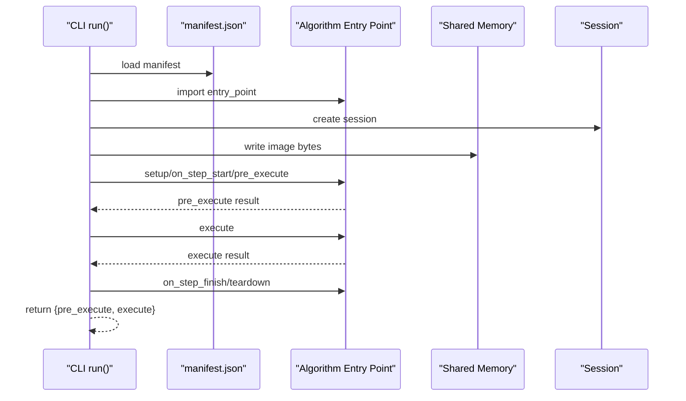
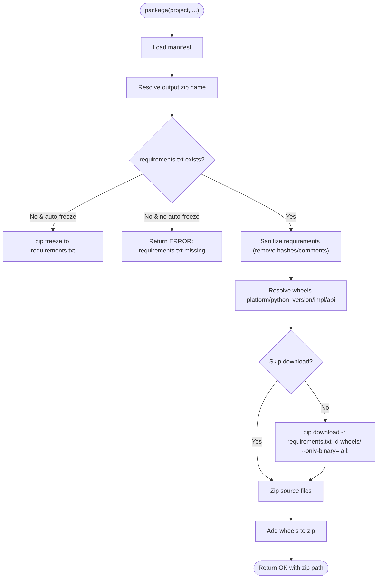
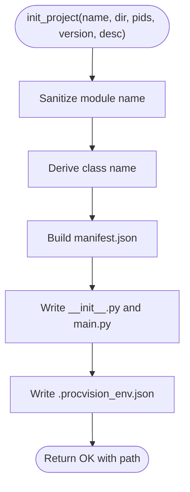
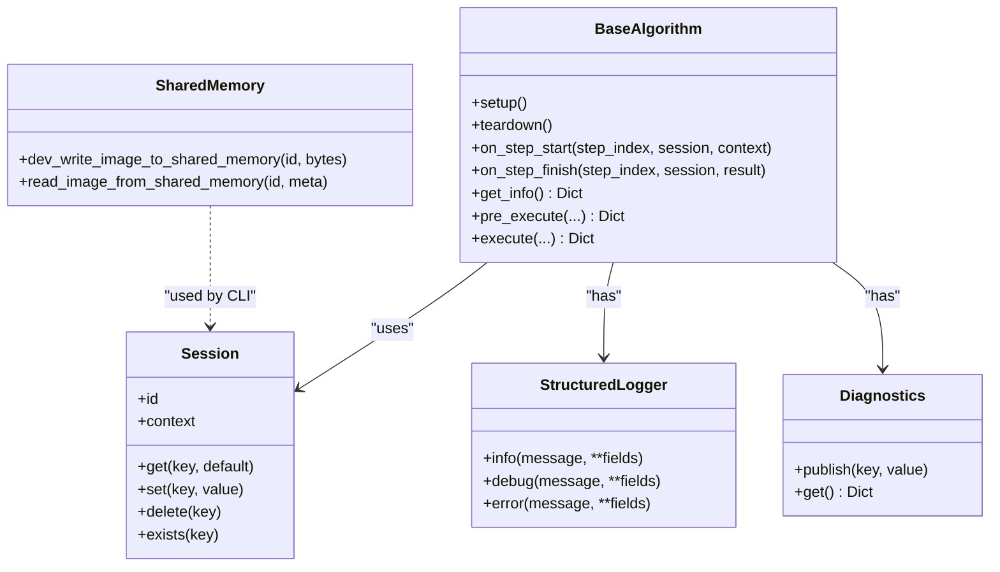
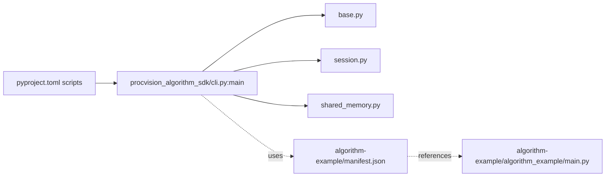

# CLI Tooling

<cite>
**Referenced Files in This Document**
- [cli.py](file://procvision_algorithm_sdk/cli.py)
- [pyproject.toml](file://pyproject.toml)
- [README.md](file://README.md)
- [base.py](file://procvision_algorithm_sdk/base.py)
- [session.py](file://procvision_algorithm_sdk/session.py)
- [shared_memory.py](file://procvision_algorithm_sdk/shared_memory.py)
- [logger.py](file://procvision_algorithm_sdk/logger.py)
- [diagnostics.py](file://procvision_algorithm_sdk/diagnostics.py)
- [errors.py](file://procvision_algorithm_sdk/errors.py)
- [test_cli.py](file://tests/test_cli.py)
- [test_cli_validate.py](file://tests/test_cli_validate.py)
- [manifest.json](file://algorithm-example/manifest.json)
- [main.py](file://algorithm-example/algorithm_example/main.py)
</cite>

## Table of Contents
1. [Introduction](#introduction)
2. [Project Structure](#project-structure)
3. [Core Components](#core-components)
4. [Architecture Overview](#architecture-overview)
5. [Detailed Component Analysis](#detailed-component-analysis)
6. [Dependency Analysis](#dependency-analysis)
7. [Performance Considerations](#performance-considerations)
8. [Troubleshooting Guide](#troubleshooting-guide)
9. [Conclusion](#conclusion)
10. [Appendices](#appendices)

## Introduction
This document describes the CLI tooling component of the ProcVision Algorithm SDK. It explains how the CLI supports the algorithm development lifecycle through four commands:
- init: scaffolds a new algorithm project with a manifest and a minimal algorithm class
- validate: verifies package structure and implementation against the manifest and algorithm entry point
- run: simulates local execution using a local image written into shared memory and invokes pre_execute and execute
- package: builds an offline deployment bundle (zip) containing source, manifest, requirements, wheels, and assets

The CLI integrates with other SDK components to validate manifests, import the algorithm entry point, and ensure compliance with platform contracts. It also documents the command-line interface design, argument parsing, and error reporting mechanisms, and references the console script entry point configured in pyproject.toml.

## Project Structure
The CLI resides in the SDK package and orchestrates interactions with the algorithm base class, session management, shared memory utilities, and logging/diagnostics subsystems. The example algorithm demonstrates a typical implementation aligned with the CLI’s expectations.

**Diagram sources**
- [cli.py](file://procvision_algorithm_sdk/cli.py#L1-L615)
- [base.py](file://procvision_algorithm_sdk/base.py#L1-L58)
- [session.py](file://procvision_algorithm_sdk/session.py#L1-L36)
- [shared_memory.py](file://procvision_algorithm_sdk/shared_memory.py#L1-L53)
- [logger.py](file://procvision_algorithm_sdk/logger.py#L1-L24)
- [diagnostics.py](file://procvision_algorithm_sdk/diagnostics.py#L1-L12)
- [errors.py](file://procvision_algorithm_sdk/errors.py#L1-L14)
- [manifest.json](file://algorithm-example/manifest.json#L1-L25)
- [main.py](file://algorithm-example/algorithm_example/main.py#L1-L150)
- [pyproject.toml](file://pyproject.toml#L1-L36)
- [README.md](file://README.md#L1-L116)

**Section sources**
- [cli.py](file://procvision_algorithm_sdk/cli.py#L1-L615)
- [pyproject.toml](file://pyproject.toml#L1-L36)
- [README.md](file://README.md#L1-L116)

## Core Components
- Command orchestration and argument parsing: The CLI defines subcommands and parses arguments for validate, run, package, and init.
- Validation pipeline: Loads manifest, imports the entry point class, verifies fields, and performs a smoke execution to check return structures and supported PIDs alignment.
- Local execution simulation: Writes a local image into shared memory and executes pre_execute and execute with a generated Session.
- Packaging pipeline: Ensures requirements, sanitizes them, downloads wheels for a target platform, and creates an offline zip bundle.
- Scaffolding: Generates a project skeleton with a manifest and a minimal algorithm class.

Key integration points:
- Imports the algorithm entry point via importlib and ensures it subclasses the SDK’s BaseAlgorithm.
- Uses Session for context propagation and state storage.
- Uses shared memory helpers to simulate image transfer during run and package.
- Emits structured logs and diagnostics during lifecycle hooks.

**Section sources**
- [cli.py](file://procvision_algorithm_sdk/cli.py#L1-L615)
- [base.py](file://procvision_algorithm_sdk/base.py#L1-L58)
- [session.py](file://procvision_algorithm_sdk/session.py#L1-L36)
- [shared_memory.py](file://procvision_algorithm_sdk/shared_memory.py#L1-L53)
- [logger.py](file://procvision_algorithm_sdk/logger.py#L1-L24)
- [diagnostics.py](file://procvision_algorithm_sdk/diagnostics.py#L1-L12)

## Architecture Overview
The CLI acts as a developer-first toolchain that validates and runs algorithms locally, and packages them for offline delivery. It relies on SDK primitives to enforce contract compliance and simulate runtime conditions.

**Diagram sources**
- [cli.py](file://procvision_algorithm_sdk/cli.py#L1-L615)
- [manifest.json](file://algorithm-example/manifest.json#L1-L25)
- [main.py](file://algorithm-example/algorithm_example/main.py#L1-L150)
- [base.py](file://procvision_algorithm_sdk/base.py#L1-L58)
- [session.py](file://procvision_algorithm_sdk/session.py#L1-L36)
- [shared_memory.py](file://procvision_algorithm_sdk/shared_memory.py#L1-L53)

## Detailed Component Analysis

### Command-Line Interface Design and Argument Parsing
- Subcommands: validate, run, package, init
- validate: supports project path or explicit manifest path, optional zip validation, and JSON output flag
- run: requires project path, pid, and image; optional step index and JSON params; supports JSON output
- package: project path, output path, requirements path, auto-freeze toggle, wheels platform/python version/implementation/abi, and skip-download
- init: project name, optional target directory, comma-separated PIDs, version, and description

The CLI prints contextual help and usage examples and exits with non-zero status codes on failure to support scripting and CI.

**Section sources**
- [cli.py](file://procvision_algorithm_sdk/cli.py#L350-L615)

### Validation Pipeline
The validate command performs a series of checks:
- Manifest existence and loadability
- Presence of required fields (name, version, entry_point, supported_pids)
- Importability and subclassing of BaseAlgorithm
- get_info() contract compliance (returns dict, steps array)
- supported_pids match between manifest and get_info()
- Smoke execution: on_step_start, pre_execute, execute, on_step_finish, teardown
- Optional zip bundle checks for manifest, requirements, and wheels presence

Validation results are aggregated with PASS/FAIL and a summary.

**Diagram sources**
- [cli.py](file://procvision_algorithm_sdk/cli.py#L1-L250)

**Section sources**
- [cli.py](file://procvision_algorithm_sdk/cli.py#L1-L250)
- [test_cli_validate.py](file://tests/test_cli_validate.py#L1-L11)
- [test_cli.py](file://tests/test_cli.py#L1-L20)

### Local Execution Simulation (run)
The run command:
- Loads manifest and imports the entry point class
- Creates a Session with product code, operator, and trace ID
- Writes the local image bytes into shared memory under a dev identifier
- Opens the image to derive width/height fallback if Pillow fails
- Parses user params JSON if provided
- Executes lifecycle hooks and pre_execute/execute
- Returns pre_execute and execute results

**Diagram sources**
- [cli.py](file://procvision_algorithm_sdk/cli.py#L250-L420)
- [shared_memory.py](file://procvision_algorithm_sdk/shared_memory.py#L1-L53)
- [session.py](file://procvision_algorithm_sdk/session.py#L1-L36)

**Section sources**
- [cli.py](file://procvision_algorithm_sdk/cli.py#L250-L420)
- [shared_memory.py](file://procvision_algorithm_sdk/shared_memory.py#L1-L53)
- [session.py](file://procvision_algorithm_sdk/session.py#L1-L36)
- [test_cli.py](file://tests/test_cli.py#L1-L20)

### Packaging Pipeline (package)
The package command:
- Loads manifest and determines output filename
- Validates or generates requirements.txt (with auto-freeze)
- Sanitizes requirements by removing hashes and comments
- Optionally downloads wheels for a target platform (python version, implementation, ABI)
- Walks the project directory and writes source files into the zip
- Adds existing wheels into the zip
- Returns success with the zip path or error with a message

**Diagram sources**
- [cli.py](file://procvision_algorithm_sdk/cli.py#L420-L560)

**Section sources**
- [cli.py](file://procvision_algorithm_sdk/cli.py#L420-L560)

### Scaffolding (init)
The init command:
- Sanitizes the algorithm name into a module name and derives a class name
- Generates a manifest with name, version, entry_point, description, supported PIDs, and steps
- Creates package directory and files: __init__.py and main.py
- Writes a .procvision_env.json with environment defaults for wheels download
- Returns success with the created path

**Diagram sources**
- [cli.py](file://procvision_algorithm_sdk/cli.py#L560-L615)

**Section sources**
- [cli.py](file://procvision_algorithm_sdk/cli.py#L560-L615)

### Integration with SDK Components
- BaseAlgorithm: The CLI imports the entry point and asserts it subclasses BaseAlgorithm, ensuring lifecycle hooks and method contracts are implemented.
- Session: Used to carry context (product code, operator, trace ID) and state across lifecycle hooks.
- Shared Memory: During run, the CLI writes image bytes into shared memory and reads them back to simulate platform behavior.
- Logging/Diagnostics: The CLI does not directly emit structured logs; the algorithm’s logger and diagnostics are used internally during execution.

**Diagram sources**
- [base.py](file://procvision_algorithm_sdk/base.py#L1-L58)
- [session.py](file://procvision_algorithm_sdk/session.py#L1-L36)
- [shared_memory.py](file://procvision_algorithm_sdk/shared_memory.py#L1-L53)
- [logger.py](file://procvision_algorithm_sdk/logger.py#L1-L24)
- [diagnostics.py](file://procvision_algorithm_sdk/diagnostics.py#L1-L12)

**Section sources**
- [base.py](file://procvision_algorithm_sdk/base.py#L1-L58)
- [session.py](file://procvision_algorithm_sdk/session.py#L1-L36)
- [shared_memory.py](file://procvision_algorithm_sdk/shared_memory.py#L1-L53)
- [logger.py](file://procvision_algorithm_sdk/logger.py#L1-L24)
- [diagnostics.py](file://procvision_algorithm_sdk/diagnostics.py#L1-L12)

## Dependency Analysis
- Console script entry point: The CLI is exposed via a console script named procvision-cli mapped to the main function in the SDK package.
- Internal dependencies: The CLI depends on SDK primitives (BaseAlgorithm, Session, shared memory helpers) and standard libraries for file operations, JSON parsing, subprocess, and argument parsing.
- Example algorithm: The example project demonstrates a valid manifest and implementation that passes validation and run checks.

**Diagram sources**
- [pyproject.toml](file://pyproject.toml#L1-L36)
- [cli.py](file://procvision_algorithm_sdk/cli.py#L1-L615)
- [base.py](file://procvision_algorithm_sdk/base.py#L1-L58)
- [session.py](file://procvision_algorithm_sdk/session.py#L1-L36)
- [shared_memory.py](file://procvision_algorithm_sdk/shared_memory.py#L1-L53)
- [manifest.json](file://algorithm-example/manifest.json#L1-L25)
- [main.py](file://algorithm-example/algorithm_example/main.py#L1-L150)

**Section sources**
- [pyproject.toml](file://pyproject.toml#L1-L36)
- [cli.py](file://procvision_algorithm_sdk/cli.py#L1-L615)

## Performance Considerations
- Image I/O: The run command attempts to open the image with Pillow to derive dimensions; if it fails, it falls back to defaults. This avoids heavy computation but ensures deterministic behavior.
- Shared memory: The CLI writes raw bytes into an in-memory dictionary keyed by a shared memory ID. This is suitable for local simulation but not a production transport mechanism.
- Wheel downloads: The package command downloads wheels for a specific platform and ABI. Choosing appropriate wheels reduces runtime overhead and improves reliability.
- JSON parsing: The CLI parses user-provided JSON params and manifest files. Ensure inputs are valid to avoid unnecessary retries or failures.

[No sources needed since this section provides general guidance]

## Troubleshooting Guide
Common issues and resolutions:
- Missing manifest.json: The validate command reports FAIL when manifest.json is not found. Ensure the project root contains a valid manifest.
- Invalid entry_point: If the entry_point cannot be imported or does not subclass BaseAlgorithm, validation fails. Verify the module path and class name in the manifest.
- Unsupported PID: The run command checks that the provided pid is in supported_pids. Ensure the manifest lists the pid and the algorithm’s get_info aligns.
- Image file not found: The run command exits with error if the image path is invalid. Provide a valid JPEG/PNG path.
- JSON params invalid: The run command expects a valid JSON string for user params. Correct the JSON syntax.
- Requirements missing: The package command requires a requirements.txt or auto-freeze enabled. Generate requirements.txt or use --auto-freeze.
- Wheel download failures: The package command may fail if wheels are unavailable for the selected platform/ABI. Adjust wheels platform/python version/implementation/abi or use --skip-download to package existing wheels.

**Section sources**
- [cli.py](file://procvision_algorithm_sdk/cli.py#L350-L615)
- [test_cli.py](file://tests/test_cli.py#L1-L20)
- [test_cli_validate.py](file://tests/test_cli_validate.py#L1-L11)

## Conclusion
The CLI tooling provides a cohesive developer experience for algorithm authors:
- init accelerates project setup with a scaffold aligned to SDK contracts
- validate enforces manifest and implementation correctness early
- run simulates platform execution locally with realistic image and session contexts
- package streamlines offline delivery with standardized requirements and wheels

Its integration with BaseAlgorithm, Session, and shared memory ensures consistent behavior across environments, while robust error reporting and exit codes enable automation-friendly workflows.

[No sources needed since this section summarizes without analyzing specific files]

## Appendices

### Command Reference and Examples
- Initialize a project: procvision-cli init "<name>" [--dir "<target_dir>"] [--pids "<pid1,pid2>"] [--version "<version>"] [--desc "<description>"]
- Validate a project: procvision-cli validate ["<project_dir>"] [--manifest "<path>"] [--zip "<zip_path>"] [--json]
- Run locally: procvision-cli run "<project_dir>" --pid "<pid>" --image "<image_path>" [--step <index>] [--params '<json>'] [--json]
- Package offline: procvision-cli package "<project_dir>" [-o "<output.zip>"] [-r "<requirements.txt>"] [-a] [-w "<platform>"] [-p "<python_version>"] [-i "<implementation>"] [-b "<abi>"] [-s]

These commands integrate with the SDK’s contracts and leverage the example algorithm to demonstrate expected behavior.

**Section sources**
- [cli.py](file://procvision_algorithm_sdk/cli.py#L350-L615)
- [README.md](file://README.md#L1-L116)
- [manifest.json](file://algorithm-example/manifest.json#L1-L25)
- [main.py](file://algorithm-example/algorithm_example/main.py#L1-L150)