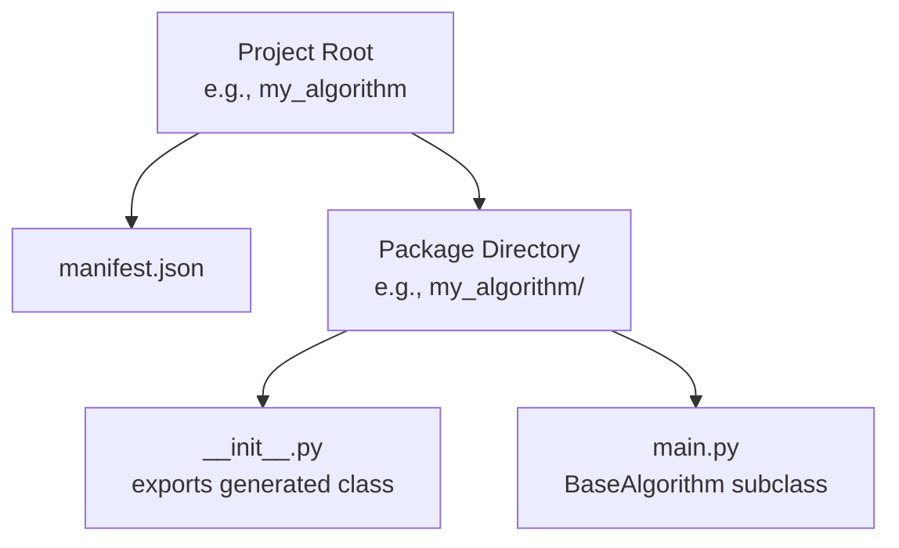
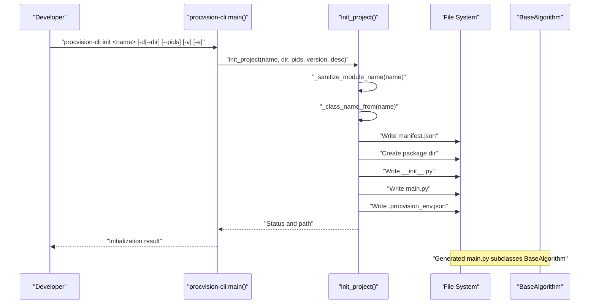
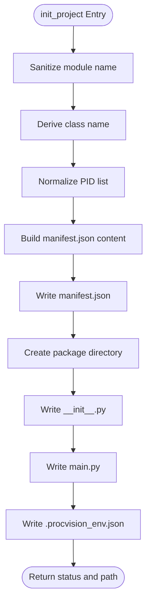
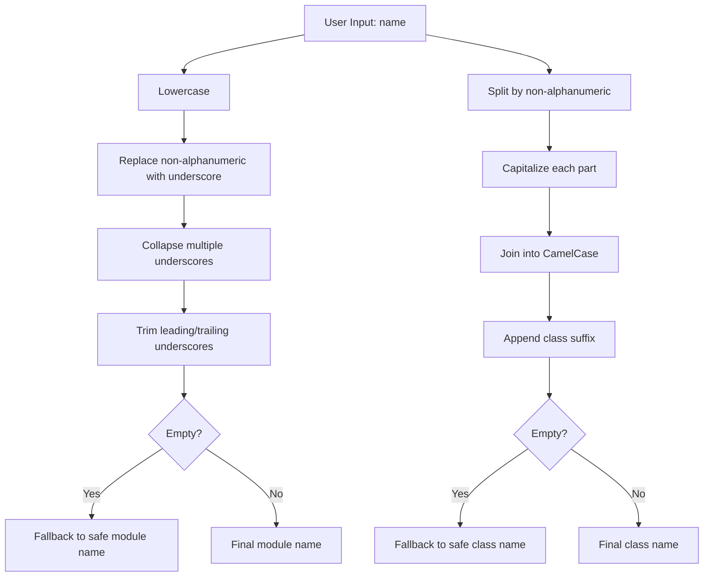
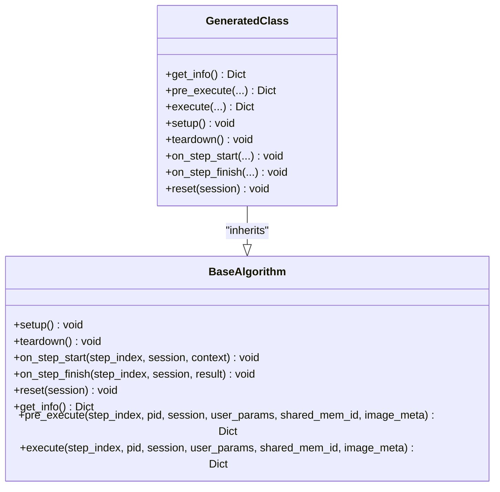
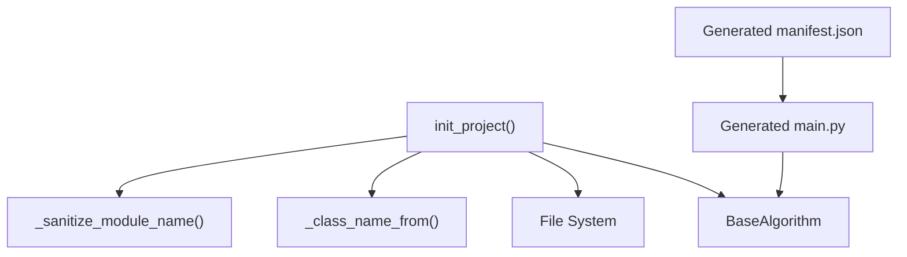

# init Command

<cite>
**Referenced Files in This Document**
- [cli.py](file://procvision_algorithm_sdk/cli.py)
- [base.py](filevision_algorithm_sdk/base.py)
- [algorithm-example/manifest.json](file://algorithm-example/manifest.json)
- [algorithm-example/algorithm_example/main.py](file://algorithm-example/algorithm_example/main.py)
- [algorithm_dev_quickstart.md](file://algorithm_dev_quickstart.md)
- [algorithm_dev_tutorial.md](file://algorithm_dev_tutorial.md)
- [README.md](file://README.md)
</cite>

## Table of Contents
1. [Introduction](#introduction)
2. [Project Structure](#project-structure)
3. [Core Components](#core-components)
4. [Architecture Overview](#architecture-overview)
5. [Detailed Component Analysis](#detailed-component-analysis)
6. [Dependency Analysis](#dependency-analysis)
7. [Performance Considerations](#performance-considerations)
8. [Troubleshooting Guide](#troubleshooting-guide)
9. [Conclusion](#conclusion)
10. [Appendices](#appendices)

## Introduction
The init command in the ProcVision Algorithm SDK CLI generates a complete project scaffold for a new algorithm. It creates a manifest.json, a package directory, and a main.py file that implements a BaseAlgorithm subclass. The command transforms user-provided algorithm name into a valid Python module name and class name, sets defaults for version and description, and ensures a minimal working baseline aligned with SDK conventions. This is the first step in the development workflow, enabling developers to quickly switch from scaffolding to editing the algorithm’s logic and manifest.

## Project Structure
The init command produces a predictable directory layout:
- A project root folder named after the sanitized algorithm name
- Inside the project root:
  - manifest.json containing metadata, entry_point, supported_pids, and steps
  - A package directory whose name is the sanitized module name
  - Inside the package directory:
    - __init__.py exporting the generated class
    - main.py containing a BaseAlgorithm subclass with placeholder logic and comments indicating areas to customize

**Diagram sources**
- [cli.py](file://procvision_algorithm_sdk/cli.py#L344-L463)

**Section sources**
- [cli.py](file://procvision_algorithm_sdk/cli.py#L344-L463)

## Core Components
- init_project(name, target_dir, pids_csv, version, description)
  - Purpose: Generate the scaffold and write files to disk
  - Behavior:
    - Sanitizes the algorithm name into a valid Python module name
    - Derives a class name from the algorithm name
    - Ensures supported_pids is non-empty (defaults to a placeholder if empty)
    - Writes manifest.json with name, version, entry_point, description, supported_pids, and a minimal steps schema
    - Creates package directory and writes __init__.py and main.py
    - Writes a .procvision_env.json for packaging defaults
  - Returns a status and the absolute path to the generated project root

- Parameter transformations:
  - _sanitize_module_name(name): Converts the user-provided name into a valid Python module name (lowercase, underscores, no special characters)
  - _class_name_from(name): Produces a class name suitable for Python identifiers (CamelCase, with a trailing suffix)

- Generated files:
  - manifest.json: Includes name, version, entry_point, description, supported_pids, and steps
  - __init__.py: Exports the generated class
  - main.py: Implements BaseAlgorithm with get_info(), pre_execute(), execute(), plus lifecycle hooks and comments guiding customization

**Section sources**
- [cli.py](file://procvision_algorithm_sdk/cli.py#L329-L463)
- [base.py](file://procvision_algorithm_sdk/base.py#L1-L58)

## Architecture Overview
The init command orchestrates file generation and writes the project to disk. It relies on the BaseAlgorithm interface to ensure the generated main.py conforms to the SDK contract. The generated manifest.json references the entry_point that points to the generated class inside the package.

**Diagram sources**
- [cli.py](file://procvision_algorithm_sdk/cli.py#L531-L613)
- [cli.py](file://procvision_algorithm_sdk/cli.py#L329-L463)
- [base.py](file://procvision_algorithm_sdk/base.py#L1-L58)

## Detailed Component Analysis

### init_project Implementation
- Input sanitization and defaults:
  - Module name derived from _sanitize_module_name(name)
  - Class name derived from _class_name_from(name)
  - supported_pids defaults to a placeholder if empty
- manifest.json generation:
  - name, version, entry_point, description, supported_pids, steps
  - steps includes a minimal example step with parameters
- Package directory and files:
  - __init__.py exports the generated class
  - main.py implements BaseAlgorithm with get_info(), pre_execute(), execute(), and lifecycle hooks
  - .procvision_env.json stores packaging defaults for later use by the package command

**Diagram sources**
- [cli.py](file://procvision_algorithm_sdk/cli.py#L329-L463)

**Section sources**
- [cli.py](file://procvision_algorithm_sdk/cli.py#L329-L463)

### Parameter Transformations
- _sanitize_module_name(name)
  - Lowercases and replaces non-alphanumeric characters with underscores
  - Collapses multiple underscores and trims leading/trailing underscores
  - Defaults to a safe module name if input becomes empty
- _class_name_from(name)
  - Splits by non-alphanumeric characters and capitalizes each part
  - Joins into a CamelCase identifier and appends a suffix to form a class name
  - Defaults to a safe class name if input becomes empty

**Diagram sources**
- [cli.py](file://procvision_algorithm_sdk/cli.py#L329-L342)

**Section sources**
- [cli.py](file://procvision_algorithm_sdk/cli.py#L329-L342)

### Generated Files and SDK Conformance
- manifest.json
  - entry_point references the generated class inside the package
  - supported_pids aligns with the class’s internal list
  - steps schema includes a minimal example step
- main.py
  - Inherits BaseAlgorithm and implements required methods
  - Provides lifecycle hooks and diagnostic logging
  - Includes comments indicating where to update PID list, steps schema, and detection logic
- __init__.py
  - Exports the generated class for clean imports

**Diagram sources**
- [base.py](file://procvision_algorithm_sdk/base.py#L1-L58)
- [cli.py](file://procvision_algorithm_sdk/cli.py#L377-L442)

**Section sources**
- [cli.py](file://procvision_algorithm_sdk/cli.py#L377-L442)
- [base.py](file://procvision_algorithm_sdk/base.py#L1-L58)

### Example: Generated Files in Practice
- The algorithm-example demonstrates a real-world scaffold with a proper manifest and a fully implemented BaseAlgorithm subclass.
- This illustrates how the init command’s generated files serve as a working baseline that mirrors SDK conventions.

**Section sources**
- [algorithm-example/manifest.json](file://algorithm-example/manifest.json#L1-L25)
- [algorithm-example/algorithm_example/main.py](file://algorithm-example/algorithm_example/main.py#L1-L150)

## Dependency Analysis
- init_project depends on:
  - _sanitize_module_name(name) and _class_name_from(name) for naming
  - File system operations to create directories and write JSON and Python files
  - BaseAlgorithm for ensuring the generated main.py conforms to the SDK contract
- The generated main.py imports BaseAlgorithm and shared memory utilities, aligning with SDK usage patterns described in the quickstart and tutorial documents.

**Diagram sources**
- [cli.py](file://procvision_algorithm_sdk/cli.py#L329-L463)
- [base.py](file://procvision_algorithm_sdk/base.py#L1-L58)

**Section sources**
- [cli.py](file://procvision_algorithm_sdk/cli.py#L329-L463)
- [base.py](file://procvision_algorithm_sdk/base.py#L1-L58)

## Performance Considerations
- The init command performs lightweight file I/O and string transformations; it is fast and deterministic.
- The generated files are minimal and focused, avoiding unnecessary overhead during development.

## Troubleshooting Guide
Common issues and resolutions:
- Invalid characters in algorithm name
  - Symptom: Unexpected underscores or fallback module/class names
  - Cause: Non-alphanumeric characters in the name
  - Resolution: Use names with letters and digits; the command sanitizes automatically
  - Reference: [cli.py](file://procvision_algorithm_sdk/cli.py#L329-L342)
- Missing PID list
  - Symptom: Placeholder PID appears in manifest
  - Cause: --pids was not provided or empty
  - Resolution: Provide a comma-separated list of supported PIDs
  - Reference: [cli.py](file://procvision_algorithm_sdk/cli.py#L344-L356)
- Unsupported PID at runtime
  - Symptom: pre_execute returns an error indicating unsupported PID
  - Cause: PID not included in supported_pids
  - Resolution: Update supported_pids in manifest.json and main.py get_info() to match
  - Reference: [cli.py](file://procvision_algorithm_sdk/cli.py#L410-L420)
- Steps schema mismatch
  - Symptom: Validation fails due to inconsistent steps between manifest and get_info()
  - Resolution: Align steps in manifest.json with get_info().steps
  - Reference: [cli.py](file://procvision_algorithm_sdk/cli.py#L86-L89)
- Next steps after initialization
  - Edit main.py to implement detection logic and update supported_pids and steps
  - Run validate to confirm conformance
  - Reference: [algorithm_dev_quickstart.md](file://algorithm_dev_quickstart.md#L1-L268), [algorithm_dev_tutorial.md](file://algorithm_dev_tutorial.md#L1-L347)

**Section sources**
- [cli.py](file://procvision_algorithm_sdk/cli.py#L86-L89)
- [cli.py](file://procvision_algorithm_sdk/cli.py#L410-L420)
- [algorithm_dev_quickstart.md](file://algorithm_dev_quickstart.md#L1-L268)
- [algorithm_dev_tutorial.md](file://algorithm_dev_tutorial.md#L1-L347)

## Conclusion
The init command streamlines algorithm development by generating a compliant scaffold with manifest.json, package directory, and main.py. It transforms user input into valid Python identifiers, ensures a non-empty PID list, and writes a minimal working baseline. Together with the validate and run commands, it forms the foundation of the SDK workflow, enabling rapid iteration from scaffolding to validated execution.

## Appendices

### Command Reference and Examples
- Command: procvision-cli init <name> [-d|--dir <dir>] [--pids <p1,p2>] [-v|--version <ver>] [-e|--desc <text>]
- Examples:
  - Minimal: procvision-cli init product_a_screw_check
  - With directory and PID list: procvision-cli init product_a_screw_check -d ./product_a_screw_check --pids A01,A02 -v 1.2.1
- Generated structure:
  - <project_root>/manifest.json
  - <project_root>/<module>/__init__.py
  - <project_root>/<module>/main.py
- Next steps:
  - Edit main.py to implement logic and update supported_pids and steps
  - Run procvision-cli validate <project_root>
  - Reference: [algorithm_dev_quickstart.md](file://algorithm_dev_quickstart.md#L1-L268), [README.md](file://README.md#L1-L115)

**Section sources**
- [algorithm_dev_quickstart.md](file://algorithm_dev_quickstart.md#L1-L268)
- [README.md](file://README.md#L1-L115)