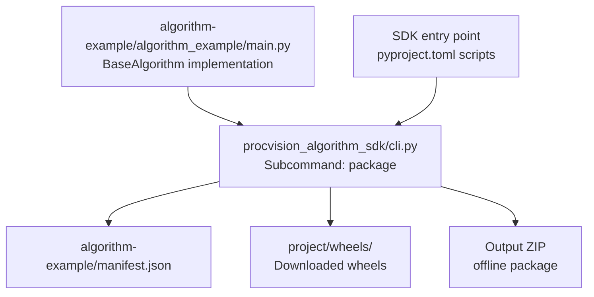
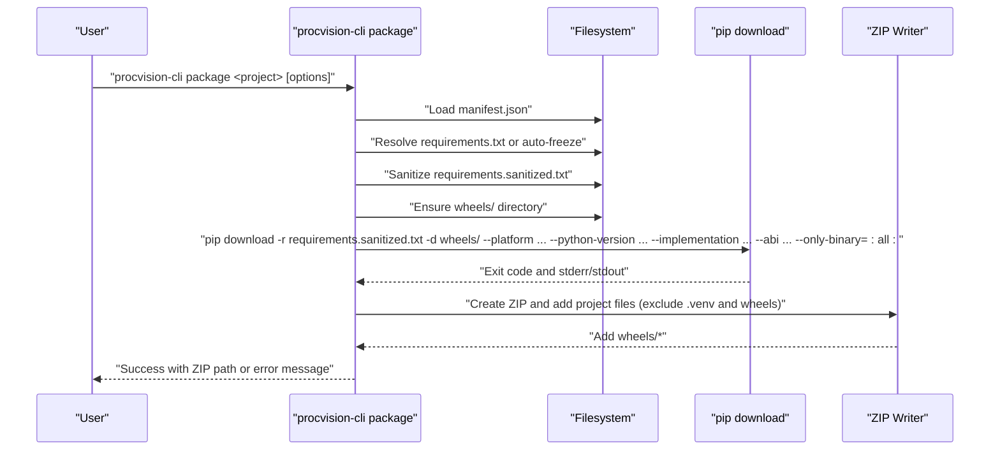
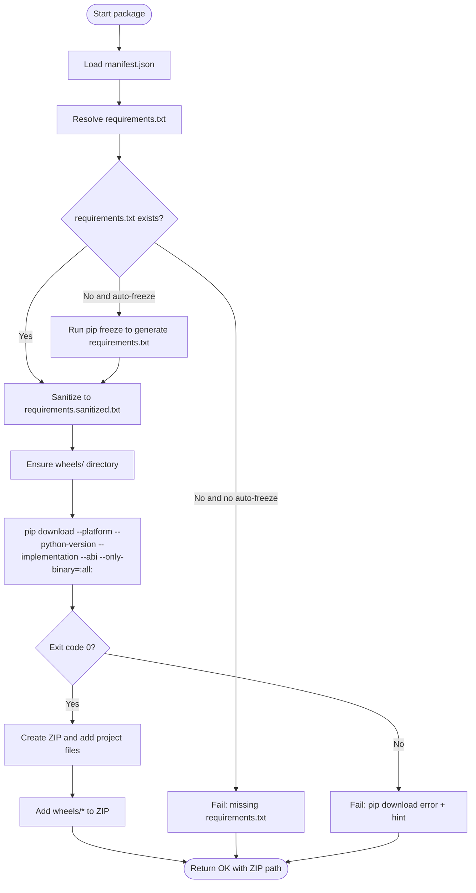
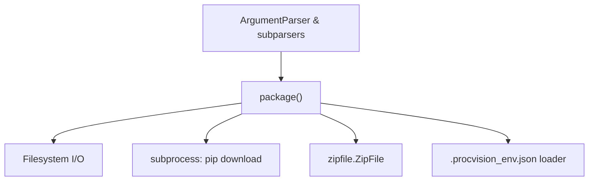

# package Command

<cite>
**Referenced Files in This Document**
- [cli.py](file://procvision_algorithm_sdk/cli.py)
- [README.md](file://README.md)
- [algorithm_dev_quickstart.md](file://algorithm_dev_quickstart.md)
- [algorithm_dev_tutorial.md](file://algorithm_dev_tutorial.md)
- [manifest.json](file://algorithm-example/manifest.json)
- [main.py](file://algorithm-example/algorithm_example/main.py)
- [pyproject.toml](file://pyproject.toml)
</cite>

## Table of Contents
1. [Introduction](#introduction)
2. [Project Structure](#project-structure)
3. [Core Components](#core-components)
4. [Architecture Overview](#architecture-overview)
5. [Detailed Component Analysis](#detailed-component-analysis)
6. [Dependency Analysis](#dependency-analysis)
7. [Performance Considerations](#performance-considerations)
8. [Troubleshooting Guide](#troubleshooting-guide)
9. [Conclusion](#conclusion)
10. [Appendices](#appendices)

## Introduction
This document explains the package command in the ProcVision Algorithm SDK CLI. Its role is to create offline deployment packages for algorithm distribution by:
- Validating the presence and correctness of requirements.txt
- Downloading compatible wheels for the target platform and Python version
- Creating a ZIP archive that bundles algorithm code, manifest.json, requirements.txt, and wheels

It also documents the command’s parameters and how they influence package creation, including dependency resolution across platforms and Python versions using the .procvision_env.json configuration file. Guidance is provided for successful packaging, common failure scenarios, and troubleshooting.

## Project Structure
The package command is implemented in the CLI module and integrates with the SDK’s base algorithm interface and session management. The algorithm example demonstrates a typical project layout with manifest.json and a main module implementing BaseAlgorithm.

**Diagram sources**
- [cli.py](file://procvision_algorithm_sdk/cli.py#L228-L326)
- [manifest.json](file://algorithm-example/manifest.json#L1-L24)
- [main.py](file://algorithm-example/algorithm_example/main.py#L1-L149)
- [pyproject.toml](file://pyproject.toml#L24-L35)

**Section sources**
- [cli.py](file://procvision_algorithm_sdk/cli.py#L228-L326)
- [manifest.json](file://algorithm-example/manifest.json#L1-L24)
- [main.py](file://algorithm-example/algorithm_example/main.py#L1-L149)
- [pyproject.toml](file://pyproject.toml#L24-L35)

## Core Components
- CLI package subcommand: orchestrates validation, dependency download, and ZIP creation.
- Requirements handling: reads requirements.txt or auto-generates via pip freeze.
- Dependency resolution: uses pip download with platform, Python version, implementation, and ABI flags.
- Packaging: walks the project directory and adds wheels to the ZIP archive.

Key implementation references:
- Package function and argument parsing: [package](file://procvision_algorithm_sdk/cli.py#L228-L326), [argument parser](file://procvision_algorithm_sdk/cli.py#L515-L529)
- ZIP creation and exclusion rules: [ZIP write loop](file://procvision_algorithm_sdk/cli.py#L310-L326)
- Environment configuration loading: [.procvision_env.json](file://procvision_algorithm_sdk/cli.py#L278-L299)

**Section sources**
- [cli.py](file://procvision_algorithm_sdk/cli.py#L228-L326)
- [cli.py](file://procvision_algorithm_sdk/cli.py#L515-L529)
- [cli.py](file://procvision_algorithm_sdk/cli.py#L278-L299)

## Architecture Overview
The package command follows a deterministic workflow: load manifest, resolve requirements, download wheels, and produce a ZIP. The diagram below maps the actual code paths.

**Diagram sources**
- [cli.py](file://procvision_algorithm_sdk/cli.py#L228-L326)
- [cli.py](file://procvision_algorithm_sdk/cli.py#L515-L529)

## Detailed Component Analysis

### Workflow: package command
The package command performs the following steps:
1. Load manifest.json from the project root.
2. Determine output ZIP name from algorithm name and version.
3. Resolve requirements.txt:
   - Use provided path or project default.
   - If missing and auto-freeze enabled, generate requirements.txt via pip freeze.
   - Sanitize requirements.sanitized.txt by removing hashes and comments.
4. Prepare wheels directory and download compatible wheels:
   - Build pip download command with platform, Python version, implementation, ABI, and only-binary flag.
   - Read defaults from .procvision_env.json if present.
   - On failure, return error with hints.
5. Create ZIP:
   - Walk project tree and add files excluding .venv and wheels/.
   - Add wheels/ contents into the archive.
6. Return success with ZIP path.

**Diagram sources**
- [cli.py](file://procvision_algorithm_sdk/cli.py#L228-L326)
- [cli.py](file://procvision_algorithm_sdk/cli.py#L278-L299)

**Section sources**
- [cli.py](file://procvision_algorithm_sdk/cli.py#L228-L326)
- [cli.py](file://procvision_algorithm_sdk/cli.py#L278-L299)

### Parameters and Their Impact
- project: Path to the algorithm project root (required).
- --output/-o: Output ZIP path; defaults to name-version-offline.zip derived from manifest.
- --requirements/-r: Path to requirements.txt; if absent and --auto-freeze is used, requirements.txt is generated automatically.
- --auto-freeze/-a: When requirements.txt is missing, generate it using pip freeze.
- --wheels-platform/-w: Target platform for wheels (e.g., win_amd64). Defaults to cached value or win_amd64.
- --python-version/-p: Target Python version (e.g., 3.10). Defaults to cached value or 3.10.
- --implementation/-i: Python implementation (e.g., cp). Defaults to cached value or cp.
- --abi/-b: ABI (e.g., cp310). Defaults to cached value or cp310.
- --skip-download/-s: Skip downloading wheels; only package existing content.

Impact on dependency resolution:
- The command constructs a pip download command with explicit platform, Python version, implementation, and ABI flags.
- It enforces --only-binary=:all: to ensure only wheel artifacts are downloaded.
- If .procvision_env.json exists in the project root, these flags are read from it as defaults.

**Section sources**
- [cli.py](file://procvision_algorithm_sdk/cli.py#L515-L529)
- [cli.py](file://procvision_algorithm_sdk/cli.py#L278-L299)

### Dependency Resolution Across Platforms and Python Versions
- Platform targeting: The platform flag ensures wheels match the target OS/architecture.
- Python version targeting: Ensures compatibility with the target interpreter.
- Implementation and ABI: Controls CPython vs PyPy and ABI tag selection.
- Only-binary enforcement: Prevents source builds and forces wheel-only downloads.
- Environment cache: .procvision_env.json stores wheels_platform, python_version, implementation, abi, and auto_freeze, enabling reproducible packaging across environments.

**Section sources**
- [cli.py](file://procvision_algorithm_sdk/cli.py#L278-L299)
- [algorithm_dev_quickstart.md](file://algorithm_dev_quickstart.md#L228-L260)

### Packaging Behavior and ZIP Contents
- ZIP includes:
  - Algorithm source code and assets (excluding .venv and wheels/)
  - manifest.json
  - requirements.txt or requirements.sanitized.txt
  - wheels/ directory with compatible wheels
- Exclusions:
  - .venv directories are skipped during ZIP creation.
  - wheels/ is excluded from the initial walk to avoid duplicating wheel files later.

**Section sources**
- [cli.py](file://procvision_algorithm_sdk/cli.py#L310-L326)

### Examples of Successful Packaging
- Minimal invocation:
  - procvision-cli package ./algorithm-example
- Custom output and platform:
  - procvision-cli package ./algorithm-example --output ./dist/my-algo-v1.0-offline.zip --wheels-platform linux_x86_64 --python-version 3.10 --implementation cp --abi cp310

Notes:
- The algorithm-example project demonstrates a valid manifest and implementation suitable for packaging.
- The CLI’s validate subcommand can be used to verify the resulting ZIP contains manifest.json, requirements.txt, and wheels/.

**Section sources**
- [algorithm_dev_quickstart.md](file://algorithm_dev_quickstart.md#L239-L260)
- [manifest.json](file://algorithm-example/manifest.json#L1-L24)
- [main.py](file://algorithm-example/algorithm_example/main.py#L1-L149)

### Common Failure Scenarios
- Missing requirements.txt:
  - Without --auto-freeze, the command fails with a clear message indicating the requirement.
- Incompatible wheel distributions:
  - If pip download reports “No matching distribution found,” the command returns an error and suggests verifying the target environment (Python version and ABI) and regenerating requirements.txt in the target environment.
- Invalid project structure:
  - If manifest.json is missing or unreadable, packaging cannot proceed.

Mitigation tips:
- Ensure requirements.txt is generated in the exact target Python environment.
- Verify platform, Python version, implementation, and ABI match the deployment target.
- Confirm .procvision_env.json contains correct defaults if relying on cached values.

**Section sources**
- [cli.py](file://procvision_algorithm_sdk/cli.py#L244-L258)
- [cli.py](file://procvision_algorithm_sdk/cli.py#L301-L307)
- [cli.py](file://procvision_algorithm_sdk/cli.py#L35-L62)

## Dependency Analysis
The package command depends on:
- CLI argument parsing and subcommand routing
- Filesystem operations for manifests, requirements, and wheels
- Subprocess execution of pip download
- ZIP archive creation

**Diagram sources**
- [cli.py](file://procvision_algorithm_sdk/cli.py#L515-L529)
- [cli.py](file://procvision_algorithm_sdk/cli.py#L228-L326)
- [cli.py](file://procvision_algorithm_sdk/cli.py#L278-L299)

**Section sources**
- [cli.py](file://procvision_algorithm_sdk/cli.py#L515-L529)
- [cli.py](file://procvision_algorithm_sdk/cli.py#L228-L326)
- [cli.py](file://procvision_algorithm_sdk/cli.py#L278-L299)

## Performance Considerations
- Dependency download cost: Large dependency sets or slow networks can increase packaging time. Consider caching wheels locally and using --skip-download when iterating on packaging logic.
- ZIP size: Including wheels increases archive size. Ensure only necessary wheels are included by aligning requirements.txt with the target environment.
- Sanitization overhead: The sanitization step removes hashes and comments; keep requirements.txt minimal to reduce processing time.

[No sources needed since this section provides general guidance]

## Troubleshooting Guide
- Missing requirements.txt:
  - Use --auto-freeze to generate requirements.txt in the current environment.
  - Alternatively, provide --requirements pointing to a valid requirements.txt.
- Incompatible wheels:
  - Align --wheels-platform, --python-version, --implementation, and --abi with the target deployment environment.
  - Regenerate requirements.txt in the target Python virtual environment to ensure compatible versions.
- ZIP verification:
  - After packaging, validate the ZIP contains manifest.json, requirements.txt, and wheels/ using the validate subcommand with --zip.
- Environment configuration:
  - Ensure .procvision_env.json exists in the project root if you rely on cached defaults for wheels_platform, python_version, implementation, and abi.

**Section sources**
- [cli.py](file://procvision_algorithm_sdk/cli.py#L244-L258)
- [cli.py](file://procvision_algorithm_sdk/cli.py#L278-L299)
- [cli.py](file://procvision_algorithm_sdk/cli.py#L301-L307)
- [algorithm_dev_quickstart.md](file://algorithm_dev_quickstart.md#L239-L260)

## Conclusion
The package command streamlines offline algorithm distribution by validating requirements, resolving compatible wheels for the target platform and Python version, and bundling all necessary artifacts into a single ZIP. By leveraging .procvision_env.json defaults and carefully managing requirements.txt, teams can achieve reproducible, portable packages tailored to diverse deployment environments.

[No sources needed since this section summarizes without analyzing specific files]

## Appendices

### Appendix A: Parameter Reference
- project: Algorithm project root (required)
- --output/-o: Output ZIP path
- --requirements/-r: requirements.txt path
- --auto-freeze/-a: Generate requirements.txt via pip freeze if missing
- --wheels-platform/-w: Target platform (e.g., win_amd64)
- --python-version/-p: Target Python version (e.g., 3.10)
- --implementation/-i: Python implementation (e.g., cp)
- --abi/-b: ABI (e.g., cp310)
- --skip-download/-s: Skip downloading wheels

**Section sources**
- [cli.py](file://procvision_algorithm_sdk/cli.py#L515-L529)

### Appendix B: Environment Configuration (.procvision_env.json)
- Fields commonly used by the package command:
  - wheels_platform: Target platform for wheels
  - python_version: Target Python version
  - implementation: Python implementation
  - abi: ABI tag
  - auto_freeze: Whether to auto-generate requirements.txt if missing
- The CLI reads these values as defaults when building the pip download command and when deriving the default output ZIP name.

**Section sources**
- [cli.py](file://procvision_algorithm_sdk/cli.py#L278-L299)
- [algorithm_dev_quickstart.md](file://algorithm_dev_quickstart.md#L239-L260)