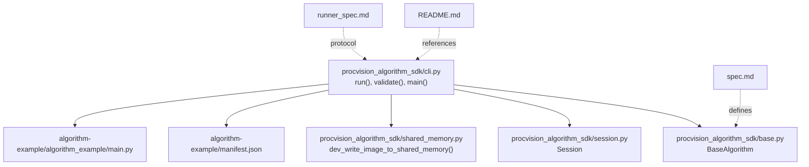
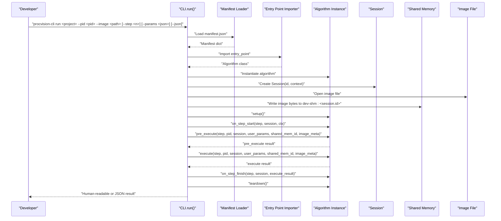
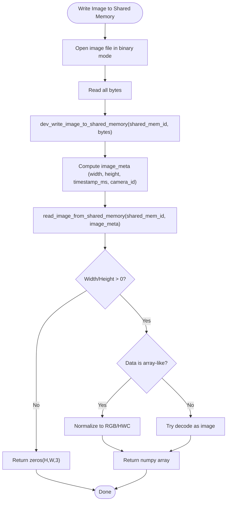
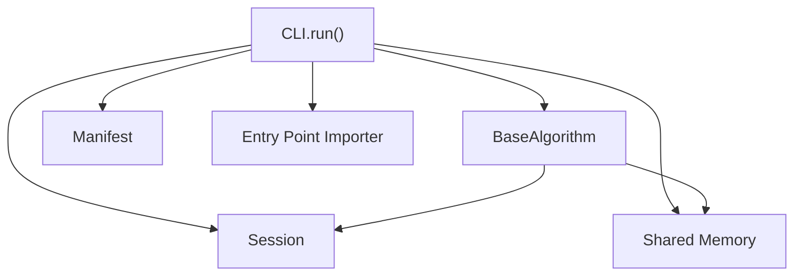

# run Command

<cite>
**Referenced Files in This Document**
- [cli.py](file://procvision_algorithm_sdk/cli.py)
- [session.py](file://procvision_algorithm_sdk/session.py)
- [shared_memory.py](file://procvision_algorithm_sdk/shared_memory.py)
- [base.py](file://procvision_algorithm_sdk/base.py)
- [README.md](file://README.md)
- [spec.md](file://spec.md)
- [runner_spec.md](file://runner_spec.md)
- [test_cli.py](file://tests/test_cli.py)
- [test_shared_memory.py](file://tests/test_shared_memory.py)
- [algorithm-example/manifest.json](file://algorithm-example/manifest.json)
- [algorithm-example/algorithm_example/main.py](file://algorithm-example/algorithm_example/main.py)
</cite>

## Table of Contents
1. [Introduction](#introduction)
2. [Project Structure](#project-structure)
3. [Core Components](#core-components)
4. [Architecture Overview](#architecture-overview)
5. [Detailed Component Analysis](#detailed-component-analysis)
6. [Dependency Analysis](#dependency-analysis)
7. [Performance Considerations](#performance-considerations)
8. [Troubleshooting Guide](#troubleshooting-guide)
9. [Conclusion](#conclusion)
10. [Appendices](#appendices)

## Introduction
The run command in the ProcVision Algorithm SDK CLI enables developers to simulate local algorithm execution against real images without platform integration. It validates the algorithm’s manifest and entry point, loads the algorithm class, creates a Session object, writes the local image to shared memory, and invokes the algorithm’s lifecycle hooks and execution methods. The command supports both human-readable and JSON output formats, making it easy to iterate quickly during development and testing.

## Project Structure
The run command is implemented in the CLI module and integrates with the SDK’s core components:
- CLI argument parsing and orchestration
- Session creation and state management
- Shared memory utilities for image transport
- BaseAlgorithm interface definition
- Example algorithm and manifest for demonstration

**Diagram sources**
- [cli.py](file://procvision_algorithm_sdk/cli.py#L1-L615)
- [base.py](file://procvision_algorithm_sdk/base.py#L1-L58)
- [session.py](file://procvision_algorithm_sdk/session.py#L1-L36)
- [shared_memory.py](file://procvision_algorithm_sdk/shared_memory.py#L1-L53)
- [README.md](file://README.md#L1-L116)
- [spec.md](file://spec.md#L1-L2102)
- [runner_spec.md](file://runner_spec.md#L1-L283)
- [algorithm-example/manifest.json](file://algorithm-example/manifest.json#L1-L25)
- [algorithm-example/algorithm_example/main.py](file://algorithm-example/algorithm_example/main.py#L1-L150)

**Section sources**
- [cli.py](file://procvision_algorithm_sdk/cli.py#L1-L615)
- [README.md](file://README.md#L1-L116)

## Core Components
- CLI run command: Parses arguments, validates inputs, loads manifest and entry point, creates a Session, writes image to shared memory, and executes algorithm lifecycle methods.
- BaseAlgorithm: Defines the contract for algorithm lifecycle and execution.
- Session: Provides a lightweight context object for cross-step state sharing.
- Shared memory utilities: Provide a development-time image transport mechanism.

Key responsibilities:
- Argument validation and error reporting
- Manifest loading and entry point import
- Session creation with product context
- Image transport via shared memory
- Lifecycle hooks: setup, on_step_start, pre_execute, execute, on_step_finish, teardown
- Output formatting in human-readable or JSON

**Section sources**
- [cli.py](file://procvision_algorithm_sdk/cli.py#L1-L615)
- [base.py](file://procvision_algorithm_sdk/base.py#L1-L58)
- [session.py](file://procvision_algorithm_sdk/session.py#L1-L36)
- [shared_memory.py](file://procvision_algorithm_sdk/shared_memory.py#L1-L53)

## Architecture Overview
The run command orchestrates the following flow:
1. Parse CLI arguments and validate inputs
2. Load manifest and import algorithm entry point
3. Instantiate algorithm and create a Session
4. Write image bytes to shared memory
5. Compute image metadata and parse user parameters
6. Invoke lifecycle hooks and execution methods
7. Return structured results for human-readable or JSON output

**Diagram sources**
- [cli.py](file://procvision_algorithm_sdk/cli.py#L1-L615)
- [shared_memory.py](file://procvision_algorithm_sdk/shared_memory.py#L1-L53)
- [session.py](file://procvision_algorithm_sdk/session.py#L1-L36)
- [base.py](file://procvision_algorithm_sdk/base.py#L1-L58)

## Detailed Component Analysis

### Command Line Interface and Orchestration
- The CLI defines the run subcommand with required and optional arguments:
  - project: Path to the algorithm project containing manifest.json and source code
  - --pid: Product identifier (must match supported_pids)
  - --image: Local image path (JPEG/PNG) written to shared memory
  - --step: Step index (default 1)
  - --params: JSON string of user parameters
  - --json: Output in JSON format
- Validation and error handling:
  - Ensures project directory exists
  - Verifies manifest.json presence
  - Validates image file existence
  - Parses JSON parameters safely
- Execution flow:
  - Loads manifest and imports entry point
  - Creates a Session with product_code, operator, and trace_id
  - Writes image bytes to shared memory using dev_write_image_to_shared_memory
  - Computes image metadata (width, height, timestamp_ms, camera_id)
  - Parses user_params JSON safely
  - Invokes lifecycle hooks and execution methods
  - Returns pre_execute and execute results

Output formats:
- Human-readable: Prints status and messages from pre_execute and execute
- JSON: Emits a JSON object containing pre_execute and execute dictionaries

**Section sources**
- [cli.py](file://procvision_algorithm_sdk/cli.py#L1-L615)

### Algorithm Lifecycle and Execution
- BaseAlgorithm defines the contract:
  - setup/teardown lifecycle
  - on_step_start/on_step_finish hooks
  - pre_execute and execute methods
- The run command invokes:
  - setup()
  - on_step_start(step_index, session, context)
  - pre_execute(step_index, pid, session, user_params, shared_mem_id, image_meta)
  - execute(step_index, pid, session, user_params, shared_mem_id, image_meta)
  - on_step_finish(step_index, session, execute_result)
  - teardown()

Interpretation of results:
- pre_execute: Returns status and optional message; may include debug data
- execute: Returns status and data; data contains result_status (OK/NG), optional ng_reason, and defect_rects; may include debug fields

**Section sources**
- [base.py](file://procvision_algorithm_sdk/base.py#L1-L58)
- [cli.py](file://procvision_algorithm_sdk/cli.py#L1-L615)

### Session Management
- Session encapsulates:
  - id: Unique session identifier
  - context: Immutable copy of product/operator/trace_id
  - state_store: Lightweight key-value store for cross-step data
- Session.set enforces JSON serializability
- The run command passes session to lifecycle hooks and execution methods

**Section sources**
- [session.py](file://procvision_algorithm_sdk/session.py#L1-L36)
- [cli.py](file://procvision_algorithm_sdk/cli.py#L1-L615)

### Shared Memory Transport
- dev_write_image_to_shared_memory writes raw bytes to an in-memory dictionary keyed by shared_mem_id
- read_image_from_shared_memory reads bytes or array-like data and converts to a numpy array with RGB shape
- Fallback behavior: If image_meta width/height are invalid or data is not array-like, returns zeros with expected shape; otherwise attempts to decode as image

**Diagram sources**
- [shared_memory.py](file://procvision_algorithm_sdk/shared_memory.py#L1-L53)
- [cli.py](file://procvision_algorithm_sdk/cli.py#L1-L615)

**Section sources**
- [shared_memory.py](file://procvision_algorithm_sdk/shared_memory.py#L1-L53)
- [cli.py](file://procvision_algorithm_sdk/cli.py#L1-L615)

### Example Algorithm and Manifest
- The example algorithm demonstrates:
  - Supported PIDs declared in get_info and maintained in _supported_pids
  - Lifecycle hooks using session state and diagnostics
  - pre_execute and execute returning structured results with result_status and optional defect_rects/ng_reason
- The example manifest declares supported_pids and steps with parameter schemas

**Section sources**
- [algorithm-example/manifest.json](file://algorithm-example/manifest.json#L1-L25)
- [algorithm-example/algorithm_example/main.py](file://algorithm-example/algorithm_example/main.py#L1-L150)

## Dependency Analysis
The run command depends on:
- CLI module for argument parsing and orchestration
- BaseAlgorithm for the algorithm interface
- Session for context and state
- Shared memory utilities for image transport
- Manifest and entry point for algorithm discovery

**Diagram sources**
- [cli.py](file://procvision_algorithm_sdk/cli.py#L1-L615)
- [base.py](file://procvision_algorithm_sdk/base.py#L1-L58)
- [session.py](file://procvision_algorithm_sdk/session.py#L1-L36)
- [shared_memory.py](file://procvision_algorithm_sdk/shared_memory.py#L1-L53)

**Section sources**
- [cli.py](file://procvision_algorithm_sdk/cli.py#L1-L615)
- [base.py](file://procvision_algorithm_sdk/base.py#L1-L58)
- [session.py](file://procvision_algorithm_sdk/session.py#L1-L36)
- [shared_memory.py](file://procvision_algorithm_sdk/shared_memory.py#L1-L53)

## Performance Considerations
- Image decoding cost: The run command opens and decodes the image to compute width/height; for repeated runs, consider caching decoded sizes or using a smaller test image.
- Shared memory overhead: Writing large images increases memory usage; ensure images are appropriately sized for local testing.
- Lifecycle hooks: setup/teardown and on_step_start/on_step_finish introduce minimal overhead; keep them efficient for rapid iteration.
- JSON parsing: User parameters are parsed safely; avoid overly large parameter sets to minimize overhead.

[No sources needed since this section provides general guidance]

## Troubleshooting Guide
Common issues and resolutions:
- Missing manifest.json
  - Symptom: Error indicating manifest.json not found
  - Resolution: Ensure the project directory contains manifest.json or use --manifest to specify its path
  - Reference: [cli.py](file://procvision_algorithm_sdk/cli.py#L1-L615)
- Invalid image path
  - Symptom: Error indicating image file does not exist
  - Resolution: Verify the --image path points to an existing JPEG/PNG file
  - Reference: [cli.py](file://procvision_algorithm_sdk/cli.py#L1-L615)
- Parameter parsing errors
  - Symptom: Error stating --params must be a JSON string
  - Resolution: Provide a valid JSON string for --params
  - Reference: [cli.py](file://procvision_algorithm_sdk/cli.py#L1-L615)
- Unsupported product ID
  - Symptom: pre_execute/execute returns ERROR with message indicating unsupported product
  - Resolution: Ensure --pid is included in manifest.json supported_pids
  - Reference: [algorithm-example/manifest.json](file://algorithm-example/manifest.json#L1-L25), [algorithm-example/algorithm_example/main.py](file://algorithm-example/algorithm_example/main.py#L1-L150)
- Image load failures
  - Symptom: pre_execute/execute returns ERROR with message indicating image data empty
  - Resolution: Confirm image path is valid and readable; fallback behavior returns zeros with expected shape if meta is valid
  - Reference: [shared_memory.py](file://procvision_algorithm_sdk/shared_memory.py#L1-L53)
- JSON output interpretation
  - pre_execute: status and optional message; may include debug data
  - execute: status and data; data contains result_status (OK/NG), optional ng_reason, and defect_rects; may include debug fields
  - Reference: [spec.md](file://spec.md#L1-L2102), [runner_spec.md](file://runner_spec.md#L1-L283)

**Section sources**
- [cli.py](file://procvision_algorithm_sdk/cli.py#L1-L615)
- [shared_memory.py](file://procvision_algorithm_sdk/shared_memory.py#L1-L53)
- [algorithm-example/manifest.json](file://algorithm-example/manifest.json#L1-L25)
- [algorithm-example/algorithm_example/main.py](file://algorithm-example/algorithm_example/main.py#L1-L150)
- [spec.md](file://spec.md#L1-L2102)
- [runner_spec.md](file://runner_spec.md#L1-L283)

## Conclusion
The run command streamlines local algorithm development by simulating platform execution with real images, enabling rapid iteration without platform integration. By validating inputs, creating a Session, writing images to shared memory, and invoking lifecycle and execution methods, developers can quickly assess algorithm behavior and refine results. The human-readable and JSON output modes support both interactive debugging and automated testing.

[No sources needed since this section summarizes without analyzing specific files]

## Appendices

### Command Parameters
- project: Path to the algorithm project directory containing manifest.json and source code
- --pid: Product identifier; must match supported_pids declared in manifest.json
- --image: Local image path (JPEG/PNG); written to shared memory
- --step: Step index (default 1)
- --params: JSON string of user parameters
- --json: Output in JSON format

**Section sources**
- [cli.py](file://procvision_algorithm_sdk/cli.py#L1-L615)

### Example Usage
- Human-readable output:
  - procvision-cli run ./algorithm-example --pid p001 --image ./test.jpg
- JSON output:
  - procvision-cli run ./algorithm-example --pid p001 --image ./test.jpg --json

Interpretation:
- Human-readable prints status and messages from pre_execute and execute
- JSON output includes pre_execute and execute dictionaries suitable for automation

**Section sources**
- [cli.py](file://procvision_algorithm_sdk/cli.py#L1-L615)
- [README.md](file://README.md#L1-L116)

### Related Specifications
- SDK interface definitions and expected result structures
- Runner protocol and communication semantics

**Section sources**
- [spec.md](file://spec.md#L1-L2102)
- [runner_spec.md](file://runner_spec.md#L1-L283)