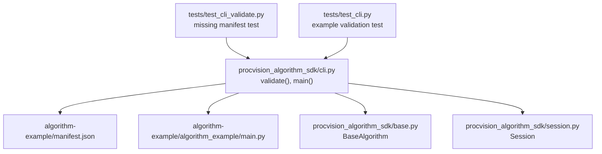
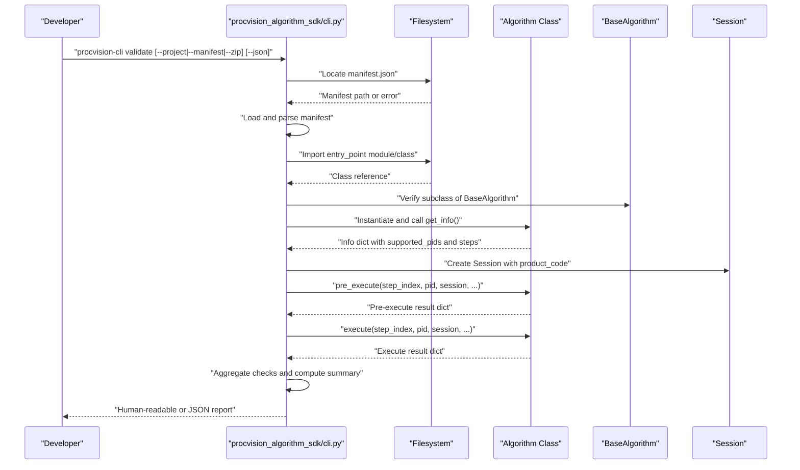
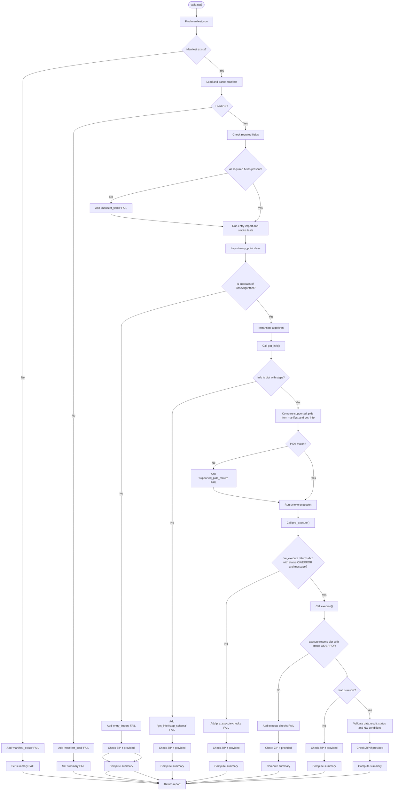
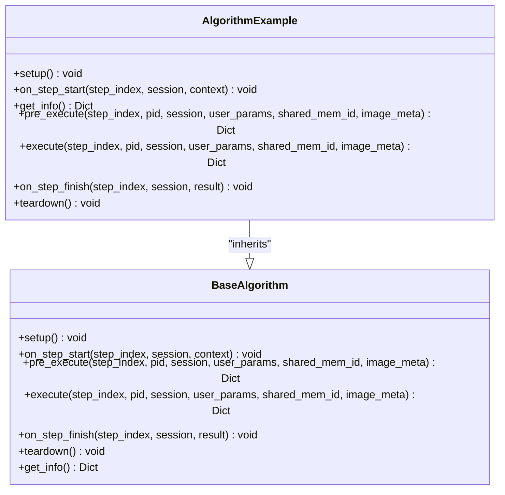
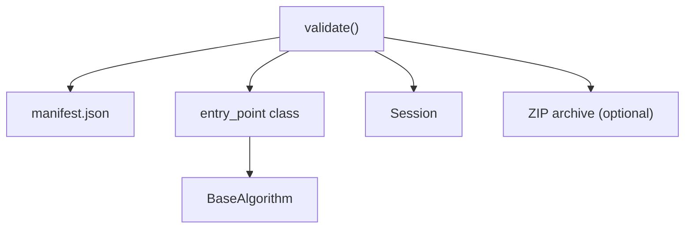

# validate Command

<cite>
**Referenced Files in This Document**
- [cli.py](file://procvision_algorithm_sdk/cli.py)
- [base.py](file://procvision_algorithm_sdk/base.py)
- [session.py](file://procvision_algorithm_sdk/session.py)
- [test_cli_validate.py](file://tests/test_cli_validate.py)
- [test_cli.py](file://tests/test_cli.py)
- [manifest.json](file://algorithm-example/manifest.json)
- [main.py](file://algorithm-example/algorithm_example/main.py)
- [README.md](file://README.md)
</cite>

## Table of Contents
1. [Introduction](#introduction)
2. [Project Structure](#project-structure)
3. [Core Components](#core-components)
4. [Architecture Overview](#architecture-overview)
5. [Detailed Component Analysis](#detailed-component-analysis)
6. [Dependency Analysis](#dependency-analysis)
7. [Performance Considerations](#performance-considerations)
8. [Troubleshooting Guide](#troubleshooting-guide)
9. [Conclusion](#conclusion)
10. [Appendices](#appendices)

## Introduction
The validate command in the ProcVision Algorithm SDK CLI performs comprehensive checks to ensure an algorithm package is structurally sound and its implementation adheres to the platform’s expectations before deployment. It validates:
- Manifest presence and required fields
- Entry point importability and inheritance from the BaseAlgorithm interface
- Consistency between supported product identifiers declared in the manifest and the algorithm’s runtime metadata
- Correct return structures from pre_execute and execute methods

It supports validating both a local directory-based algorithm and a packaged ZIP delivery artifact. The command emits either a human-readable summary or structured JSON output, enabling automated CI pipelines and quick developer feedback loops.

## Project Structure
The validate command lives in the CLI module and orchestrates validation against the BaseAlgorithm interface, Session context, and example algorithm assets.

**Diagram sources**
- [cli.py](file://procvision_algorithm_sdk/cli.py#L35-L125)
- [base.py](file://procvision_algorithm_sdk/base.py#L1-L58)
- [session.py](file://procvision_algorithm_sdk/session.py#L1-L35)
- [manifest.json](file://algorithm-example/manifest.json#L1-L24)
- [main.py](file://algorithm-example/algorithm_example/main.py#L1-L149)
- [test_cli_validate.py](file://tests/test_cli_validate.py#L1-L10)
- [test_cli.py](file://tests/test_cli.py#L1-L19)

**Section sources**
- [cli.py](file://procvision_algorithm_sdk/cli.py#L35-L125)
- [README.md](file://README.md#L1-L115)

## Core Components
- validate(project, manifest, zip_path): Central validation routine that loads and parses the manifest, imports the entry point class, verifies BaseAlgorithm inheritance, runs smoke tests against get_info and execution methods, and optionally checks ZIP packaging structure.
- BaseAlgorithm: Abstract base class defining the required contract (get_info, pre_execute, execute) and lifecycle hooks.
- Session: Lightweight context carrier used during validation to simulate runtime conditions.
- CLI entrypoint: Adds a validate subcommand with options for project path, explicit manifest path, ZIP package path, and JSON output.

Key validation outcomes are aggregated into a summary and a list of check items, each with PASS/FAIL and a message.

**Section sources**
- [cli.py](file://procvision_algorithm_sdk/cli.py#L35-L125)
- [base.py](file://procvision_algorithm_sdk/base.py#L1-L58)
- [session.py](file://procvision_algorithm_sdk/session.py#L1-L35)

## Architecture Overview
The validate command follows a deterministic flow: locate manifest, load and parse it, import the entry point class, instantiate and introspect via get_info, run pre_execute and execute with synthetic inputs, and optionally verify ZIP packaging.

**Diagram sources**
- [cli.py](file://procvision_algorithm_sdk/cli.py#L35-L125)
- [base.py](file://procvision_algorithm_sdk/base.py#L1-L58)
- [session.py](file://procvision_algorithm_sdk/session.py#L1-L35)

## Detailed Component Analysis

### validate Function and Validation Checks
The validate function performs the following checks and actions:

- Manifest discovery and loading
  - Accepts either a project directory or an explicit manifest path.
  - Supports locating manifest under alternative project roots when invoked from sibling directories.
  - Records PASS/FAIL for manifest existence and loadability.

- Required manifest fields
  - Ensures presence of name, version, entry_point, and supported_pids.
  - Reports missing keys in the message.

- Entry point importability and inheritance
  - Parses entry_point into module and class name.
  - Imports the module and retrieves the class.
  - Verifies subclass relationship with BaseAlgorithm.

- Runtime introspection via get_info
  - Calls get_info and asserts it returns a dictionary containing a steps array.
  - Compares supported_pids from manifest and get_info for equality.

- Smoke execution
  - Creates a Session with a product code and minimal image metadata.
  - Calls pre_execute and validates its return structure:
    - Must be a dictionary.
    - status must be one of OK or ERROR.
    - message must be present.
  - Calls execute and validates:
    - Must be a dictionary.
    - status must be one of OK or ERROR.
    - If status is OK, data must include result_status which is OK, NG, or None.
    - If result_status is NG, data must include ng_reason and defect_rects as a list with length ≤ 20.
  - Invokes lifecycle hooks on_step_start/on_step_finish and teardown.

- ZIP packaging verification (optional)
  - If a ZIP path is provided, opens the archive and checks for presence of manifest.json, requirements.txt, and wheels directory entries.

- Output formatting
  - Aggregates check results into a summary with PASS/FAIL and counts.
  - Provides human-readable output or JSON when requested.

**Diagram sources**
- [cli.py](file://procvision_algorithm_sdk/cli.py#L35-L125)

**Section sources**
- [cli.py](file://procvision_algorithm_sdk/cli.py#L35-L125)

### Example Algorithm and Manifest
The example algorithm demonstrates a complete implementation aligned with the validation expectations:
- Manifest declares name, version, entry_point, description, supported_pids, and steps.
- Algorithm class inherits from BaseAlgorithm, implements get_info, pre_execute, and execute, and includes lifecycle hooks.
- The algorithm returns dictionaries with required fields and adheres to the supported_pids constraint.

**Diagram sources**
- [base.py](file://procvision_algorithm_sdk/base.py#L1-L58)
- [main.py](file://algorithm-example/algorithm_example/main.py#L1-L149)

**Section sources**
- [manifest.json](file://algorithm-example/manifest.json#L1-L24)
- [main.py](file://algorithm-example/algorithm_example/main.py#L1-L149)
- [base.py](file://procvision_algorithm_sdk/base.py#L1-L58)

### Human-Readable vs JSON Output
- Human-readable mode prints a summary line and per-check results with emoji markers.
- JSON mode prints a structured report suitable for automation and CI systems.

**Section sources**
- [cli.py](file://procvision_algorithm_sdk/cli.py#L126-L170)

### ZIP Package Validation
- Validates that a ZIP artifact contains manifest.json, requirements.txt, and wheels directory entries.
- Useful for offline delivery packages.

**Section sources**
- [cli.py](file://procvision_algorithm_sdk/cli.py#L108-L125)

## Dependency Analysis
The validate command depends on:
- BaseAlgorithm for interface enforcement
- Session for runtime context
- Filesystem for manifest and ZIP inspection
- Standard libraries for JSON parsing, ZIP handling, and import mechanisms

**Diagram sources**
- [cli.py](file://procvision_algorithm_sdk/cli.py#L35-L125)
- [base.py](file://procvision_algorithm_sdk/base.py#L1-L58)
- [session.py](file://procvision_algorithm_sdk/session.py#L1-L35)

**Section sources**
- [cli.py](file://procvision_algorithm_sdk/cli.py#L35-L125)
- [base.py](file://procvision_algorithm_sdk/base.py#L1-L58)
- [session.py](file://procvision_algorithm_sdk/session.py#L1-L35)

## Performance Considerations
- The validate command executes lightweight smoke tests and does not perform heavy computation.
- It imports and instantiates the algorithm class, so ensure the algorithm’s setup/teardown are fast and do not rely on external resources.
- ZIP checks are O(N) over the archive entries; keep archives reasonably sized.

[No sources needed since this section provides general guidance]

## Troubleshooting Guide

Common validation failures and resolutions:
- Missing manifest.json
  - Symptom: manifest_exists FAIL.
  - Resolution: Place manifest.json at the project root or provide --manifest pointing to the correct path.

- Manifest load failure
  - Symptom: manifest_load FAIL with an error message.
  - Resolution: Fix JSON syntax errors or encoding issues in manifest.json.

- Missing required manifest fields
  - Symptom: manifest_fields FAIL listing missing keys.
  - Resolution: Add name, version, entry_point, and supported_pids to manifest.json.

- Entry point import failure
  - Symptom: entry_import FAIL with an error message.
  - Resolution: Ensure entry_point is formatted as module:class and the module is importable from the project path.

- Class not inheriting from BaseAlgorithm
  - Symptom: entry_import FAIL.
  - Resolution: Make sure the class inherits from BaseAlgorithm and implements get_info, pre_execute, and execute.

- supported_pids mismatch
  - Symptom: supported_pids_match FAIL with differing lists.
  - Resolution: Align supported_pids in manifest.json with the algorithm’s get_info implementation.

- pre_execute return structure invalid
  - Symptom: pre_execute_return_dict or pre_status_valid or pre_message_present FAIL.
  - Resolution: Ensure pre_execute returns a dictionary with status OK or ERROR and a message.

- execute return structure invalid
  - Symptom: execute_return_dict or execute_status_valid FAIL, or execute_result_status_valid FAIL.
  - Resolution: Ensure execute returns a dictionary with status OK or ERROR. If status is OK, include data with result_status OK or NG. If NG, include ng_reason and defect_rects as a list with length ≤ 20.

- ZIP packaging issues
  - Symptom: zip_manifest, zip_requirements, or zip_wheels FAIL.
  - Resolution: Ensure the ZIP contains manifest.json, requirements.txt, and wheels directory entries.

Automated test references:
- Missing manifest test: [test_validate_handles_missing_manifest](file://tests/test_cli_validate.py#L1-L10)
- Example algorithm validation test: [test_validate_algorithm_example](file://tests/test_cli.py#L1-L19)

**Section sources**
- [cli.py](file://procvision_algorithm_sdk/cli.py#L35-L125)
- [test_cli_validate.py](file://tests/test_cli_validate.py#L1-L10)
- [test_cli.py](file://tests/test_cli.py#L1-L19)

## Conclusion
The validate command provides a robust, early-stage quality gate for algorithm packages. By checking manifest completeness, importability, inheritance, runtime metadata consistency, and return structures, it helps developers catch packaging and implementation mistakes before deployment. Its dual output modes support both interactive development and automated CI/CD workflows.

[No sources needed since this section summarizes without analyzing specific files]

## Appendices

### Command Reference
- validate subcommand options:
  - project: Algorithm project root directory (default current directory)
  - --manifest: Explicit manifest.json path
  - --zip: Offline delivery ZIP path
  - --json: Emit JSON output

**Section sources**
- [cli.py](file://procvision_algorithm_sdk/cli.py#L171-L260)

### Example Manifest and Algorithm
- Example manifest: [manifest.json](file://algorithm-example/manifest.json#L1-L24)
- Example algorithm implementation: [main.py](file://algorithm-example/algorithm_example/main.py#L1-L149)

**Section sources**
- [manifest.json](file://algorithm-example/manifest.json#L1-L24)
- [main.py](file://algorithm-example/algorithm_example/main.py#L1-L149)