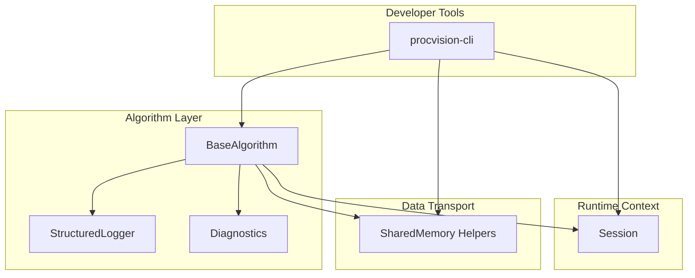
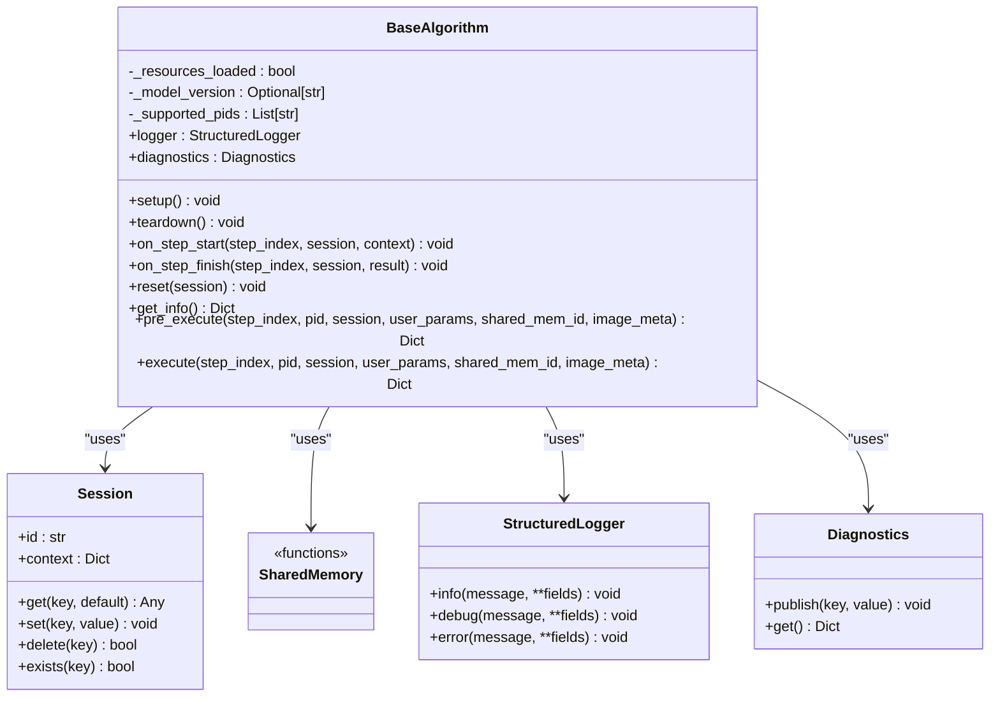
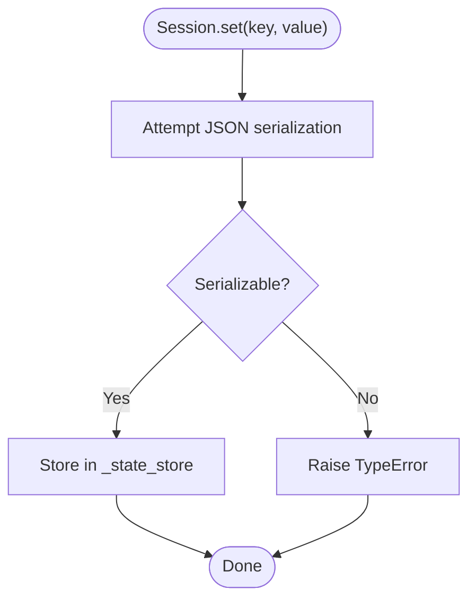
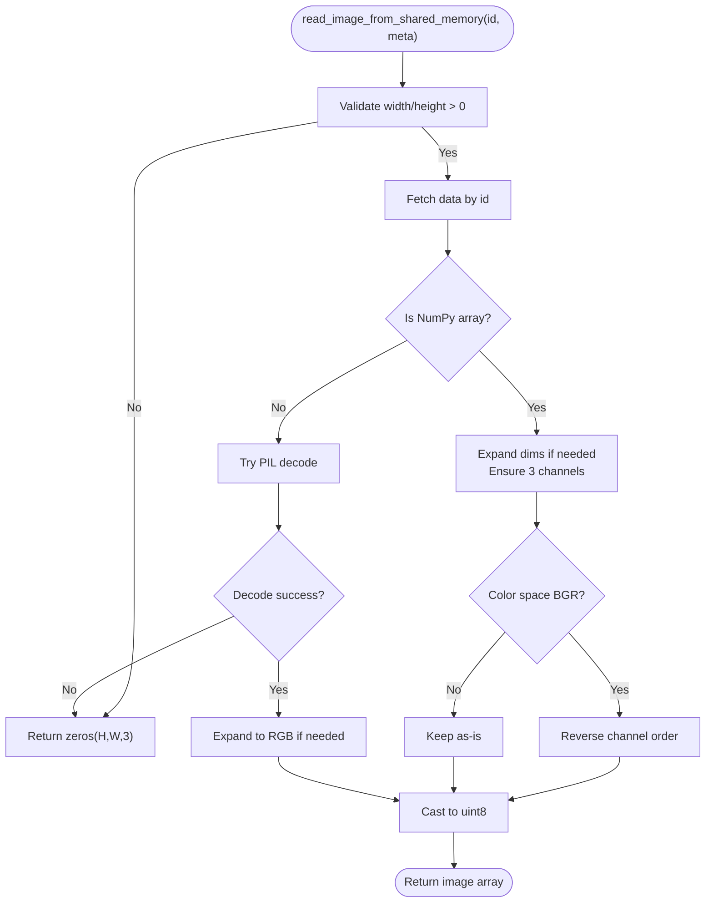
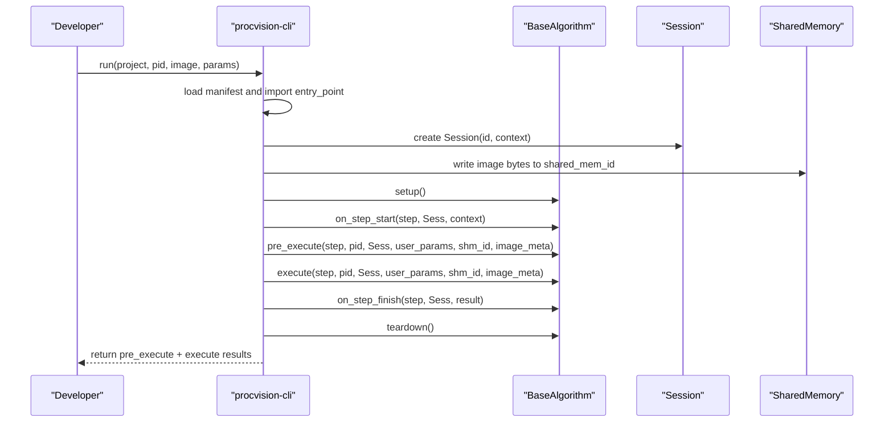
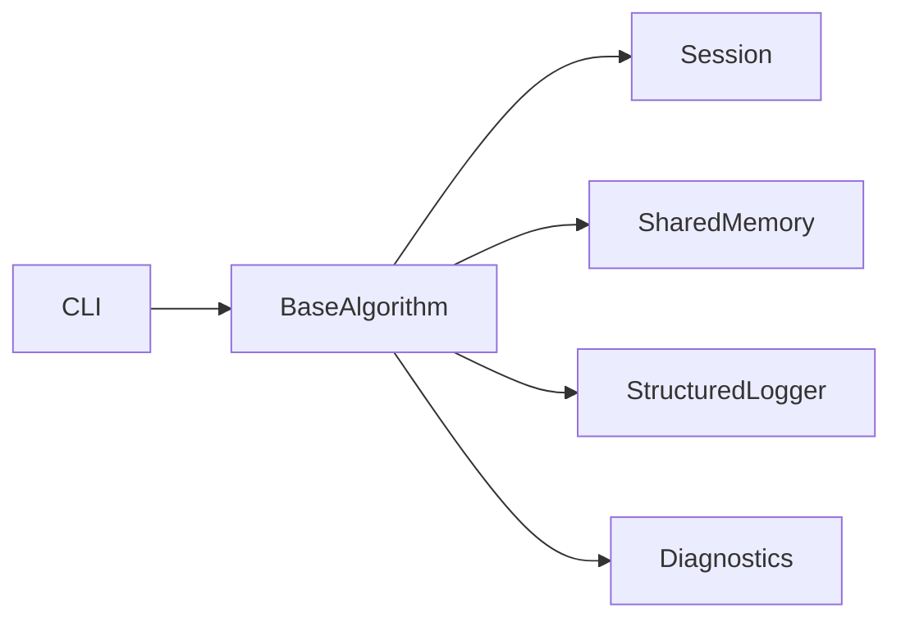

# Component Overview

<cite>
**Referenced Files in This Document**
- [base.py](file://procvision_algorithm_sdk/base.py)
- [session.py](file://procvision_algorithm_sdk/session.py)
- [shared_memory.py](file://procvision_algorithm_sdk/shared_memory.py)
- [cli.py](file://procvision_algorithm_sdk/cli.py)
- [__init__.py](file://procvision_algorithm_sdk/__init__.py)
- [logger.py](file://procvision_algorithm_sdk/logger.py)
- [diagnostics.py](file://procvision_algorithm_sdk/diagnostics.py)
- [spec.md](file://spec.md)
- [runner_spec.md](file://runner_spec.md)
- [README.md](file://README.md)
- [test_base_algo.py](file://tests/test_base_algo.py)
- [test_session.py](file://tests/test_session.py)
- [test_shared_memory.py](file://tests/test_shared_memory.py)
</cite>

## Table of Contents
1. [Introduction](#introduction)
2. [Project Structure](#project-structure)
3. [Core Components](#core-components)
4. [Architecture Overview](#architecture-overview)
5. [Detailed Component Analysis](#detailed-component-analysis)
6. [Dependency Analysis](#dependency-analysis)
7. [Performance Considerations](#performance-considerations)
8. [Troubleshooting Guide](#troubleshooting-guide)
9. [Conclusion](#conclusion)
10. [Appendices](#appendices)

## Introduction
This document provides an architectural overview of the ProcVision Algorithm SDK’s core components. It explains the responsibilities of BaseAlgorithm, Session, SharedMemory, and CLI, and how they interact during the development lifecycle. The BaseAlgorithm interface defines the contract for algorithm logic; Session manages execution state across steps; SharedMemory enables efficient image data transfer; and CLI orchestrates validation, local simulation, packaging, and scaffolding. The dependency graph shows BaseAlgorithm depends on Session and SharedMemory, while CLI orchestrates all components.

## Project Structure
The SDK is organized around a small set of cohesive modules:
- BaseAlgorithm interface and lifecycle hooks
- Session state management
- SharedMemory image transfer utilities
- CLI tooling for validation, local run, packaging, and scaffolding
- Logger and Diagnostics helpers
- Public exports and entry points

```mermaid
graph TB
subgraph "SDK Core"
BA["BaseAlgorithm<br/>interface + hooks"]
SES["Session<br/>state store + context"]
SHM["SharedMemory<br/>dev helpers"]
LOG["StructuredLogger"]
DIAG["Diagnostics"]
end
subgraph "CLI"
CLI["procvision-cli<br/>validate/run/package/init"]
end
CLI --> BA
CLI --> SES
CLI --> SHM
BA --> SES
BA --> SHM
BA --> LOG
BA --> DIAG
```

**Diagram sources**
- [base.py](file://procvision_algorithm_sdk/base.py#L1-L58)
- [session.py](file://procvision_algorithm_sdk/session.py#L1-L36)
- [shared_memory.py](file://procvision_algorithm_sdk/shared_memory.py#L1-L53)
- [cli.py](file://procvision_algorithm_sdk/cli.py#L1-L615)
- [logger.py](file://procvision_algorithm_sdk/logger.py#L1-L24)
- [diagnostics.py](file://procvision_algorithm_sdk/diagnostics.py#L1-L12)

**Section sources**
- [README.md](file://README.md#L1-L116)
- [__init__.py](file://procvision_algorithm_sdk/__init__.py#L1-L20)

## Core Components
- BaseAlgorithm: Defines the algorithm contract, lifecycle hooks, and the two primary execution methods pre_execute and execute. It also exposes logging and diagnostics facilities and carries lightweight state.
- Session: Provides a JSON-serializable in-memory key-value store scoped to a single detection session, plus immutable context metadata.
- SharedMemory: Provides development-time helpers to write/read images to/from a shared memory-like store and convert them to NumPy arrays with color-space handling.
- CLI: Offers commands to validate algorithm packages, run locally against images, package offline deliverables, and scaffold new projects.

**Section sources**
- [base.py](file://procvision_algorithm_sdk/base.py#L1-L58)
- [session.py](file://procvision_algorithm_sdk/session.py#L1-L36)
- [shared_memory.py](file://procvision_algorithm_sdk/shared_memory.py#L1-L53)
- [cli.py](file://procvision_algorithm_sdk/cli.py#L1-L615)
- [logger.py](file://procvision_algorithm_sdk/logger.py#L1-L24)
- [diagnostics.py](file://procvision_algorithm_sdk/diagnostics.py#L1-L12)

## Architecture Overview
The SDK enforces a clean separation of concerns:
- BaseAlgorithm encapsulates algorithm logic and interacts with Session and SharedMemory.
- Session mediates cross-step state sharing and context propagation.
- SharedMemory abstracts image transport for development and testing.
- CLI orchestrates the developer workflow and validates compliance with the platform specification.



**Diagram sources**
- [base.py](file://procvision_algorithm_sdk/base.py#L1-L58)
- [session.py](file://procvision_algorithm_sdk/session.py#L1-L36)
- [shared_memory.py](file://procvision_algorithm_sdk/shared_memory.py#L1-L53)
- [cli.py](file://procvision_algorithm_sdk/cli.py#L1-L615)

## Detailed Component Analysis

### BaseAlgorithm
Responsibilities:
- Define the algorithm contract via get_info, pre_execute, and execute.
- Lifecycle hooks: setup, teardown, on_step_start, on_step_finish, reset.
- Provide structured logging and diagnostics.
- Accept step_index, pid, session, user_params, shared_mem_id, and image_meta as inputs to pre_execute and execute.

Key behaviors:
- get_info must return metadata including supported_pids and steps.
- pre_execute prepares references and returns status and optional data.
- execute performs detection and returns result_status and optional defect_rects/ng_reason.
- Hooks enable instrumentation and cleanup without platform coupling.



**Diagram sources**
- [base.py](file://procvision_algorithm_sdk/base.py#L1-L58)
- [session.py](file://procvision_algorithm_sdk/session.py#L1-L36)
- [shared_memory.py](file://procvision_algorithm_sdk/shared_memory.py#L1-L53)
- [logger.py](file://procvision_algorithm_sdk/logger.py#L1-L24)
- [diagnostics.py](file://procvision_algorithm_sdk/diagnostics.py#L1-L12)

**Section sources**
- [base.py](file://procvision_algorithm_sdk/base.py#L1-L58)
- [spec.md](file://spec.md#L1-L2102)

### Session
Responsibilities:
- Provide a lightweight, JSON-serializable state store scoped to a single detection session.
- Expose immutable context metadata (e.g., product_code, operator, trace_id).
- Enforce JSON-serializability for stored values.

Behavior highlights:
- get/set/delete/exists for state management.
- context is a shallow copy to prevent mutation from caller side.
- set raises TypeError for non-serializable values.



**Diagram sources**
- [session.py](file://procvision_algorithm_sdk/session.py#L1-L36)

**Section sources**
- [session.py](file://procvision_algorithm_sdk/session.py#L1-L36)
- [test_session.py](file://tests/test_session.py#L1-L24)

### SharedMemory
Responsibilities:
- Provide development-time helpers to simulate platform-provided shared memory.
- Convert raw bytes or NumPy arrays into a normalized RGB array with color-space handling.
- Fallback to zero-filled arrays when image_meta is invalid or data is unavailable.

Key behaviors:
- dev_write_image_to_shared_memory writes bytes or arrays under a shared_mem_id.
- read_image_from_shared_memory reads and normalizes image data according to width/height/color_space.
- Handles grayscale to RGB expansion and BGR to RGB conversion.



**Diagram sources**
- [shared_memory.py](file://procvision_algorithm_sdk/shared_memory.py#L1-L53)

**Section sources**
- [shared_memory.py](file://procvision_algorithm_sdk/shared_memory.py#L1-L53)
- [test_shared_memory.py](file://tests/test_shared_memory.py#L1-L16)

### CLI
Responsibilities:
- validate: Verify manifest presence and correctness, import entry_point, check supported_pids match get_info, and smoke-test pre_execute/execute.
- run: Load manifest, import algorithm, create Session, write image to shared memory, and execute pre_execute/execute with user_params.
- package: Build offline zip with source, manifest, requirements, wheels, and assets.
- init: Scaffold a new algorithm project with manifest and boilerplate code.

Execution flow for run:



**Diagram sources**
- [cli.py](file://procvision_algorithm_sdk/cli.py#L1-L615)
- [base.py](file://procvision_algorithm_sdk/base.py#L1-L58)
- [session.py](file://procvision_algorithm_sdk/session.py#L1-L36)
- [shared_memory.py](file://procvision_algorithm_sdk/shared_memory.py#L1-L53)

**Section sources**
- [cli.py](file://procvision_algorithm_sdk/cli.py#L1-L615)
- [README.md](file://README.md#L1-L116)

## Dependency Analysis
High-level dependencies:
- BaseAlgorithm depends on Session and SharedMemory for state and image access.
- CLI orchestrates BaseAlgorithm, Session, and SharedMemory during validation and local runs.
- Logger and Diagnostics are used by BaseAlgorithm for structured logging and diagnostic publishing.



**Diagram sources**
- [cli.py](file://procvision_algorithm_sdk/cli.py#L1-L615)
- [base.py](file://procvision_algorithm_sdk/base.py#L1-L58)
- [session.py](file://procvision_algorithm_sdk/session.py#L1-L36)
- [shared_memory.py](file://procvision_algorithm_sdk/shared_memory.py#L1-L53)
- [logger.py](file://procvision_algorithm_sdk/logger.py#L1-L24)
- [diagnostics.py](file://procvision_algorithm_sdk/diagnostics.py#L1-L12)

**Section sources**
- [__init__.py](file://procvision_algorithm_sdk/__init__.py#L1-L20)
- [cli.py](file://procvision_algorithm_sdk/cli.py#L1-L615)
- [base.py](file://procvision_algorithm_sdk/base.py#L1-L58)

## Performance Considerations
- SharedMemory read path includes decoding and normalization; keep image_meta accurate to avoid fallback costs.
- Session.set enforces JSON serialization; avoid storing large non-serializable objects.
- CLI packaging downloads wheels; ensure requirements.txt is minimal and sanitized to reduce download time.
- BaseAlgorithm should avoid heavy initialization in __init__; defer to setup() to leverage platform lifecycle management.

[No sources needed since this section provides general guidance]

## Troubleshooting Guide
Common issues and remedies:
- Non-serializable Session values: set() raises TypeError; ensure stored values are JSON serializable.
- Unsupported PID: pre_execute should return ERROR with appropriate error_code when pid is not in supported_pids.
- Empty image data: read_image_from_shared_memory returns zeros or fallback; verify image_meta and shared_mem_id.
- CLI validation failures: check manifest fields, entry_point import, supported_pids consistency, and return value schemas.

**Section sources**
- [session.py](file://procvision_algorithm_sdk/session.py#L1-L36)
- [shared_memory.py](file://procvision_algorithm_sdk/shared_memory.py#L1-L53)
- [cli.py](file://procvision_algorithm_sdk/cli.py#L1-L615)
- [test_session.py](file://tests/test_session.py#L1-L24)
- [test_shared_memory.py](file://tests/test_shared_memory.py#L1-L16)
- [test_base_algo.py](file://tests/test_base_algo.py#L1-L65)

## Conclusion
The ProcVision Algorithm SDK cleanly separates algorithm logic (BaseAlgorithm), runtime context (Session), and data transport (SharedMemory), with CLI providing a cohesive development lifecycle. BaseAlgorithm’s contract ensures portability and platform alignment, while Session and SharedMemory enable robust state and image handling. CLI integrates these components to support validation, local runs, packaging, and scaffolding, aligning with the platform’s runner specification.

[No sources needed since this section summarizes without analyzing specific files]

## Appendices

### Interface Contracts and Runtime Integration References
- BaseAlgorithm contract and lifecycle hooks are defined in the specification.
- Runner protocol and runtime integration are defined in the runner specification.

**Section sources**
- [spec.md](file://spec.md#L1-L2102)
- [runner_spec.md](file://runner_spec.md#L1-L283)