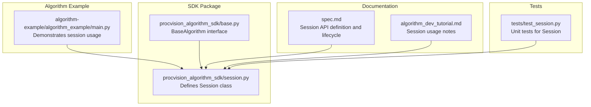
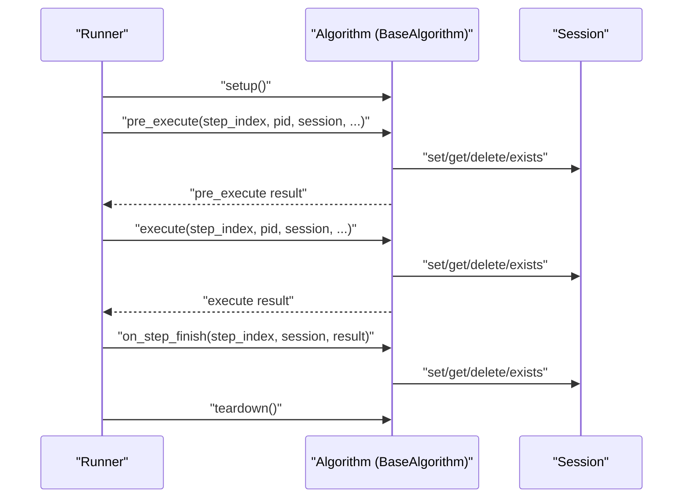
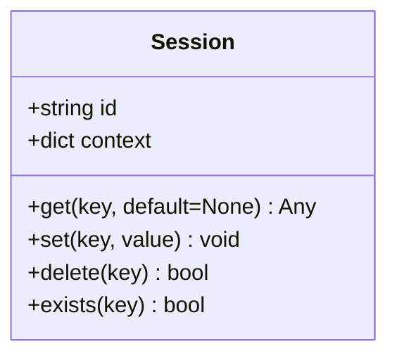
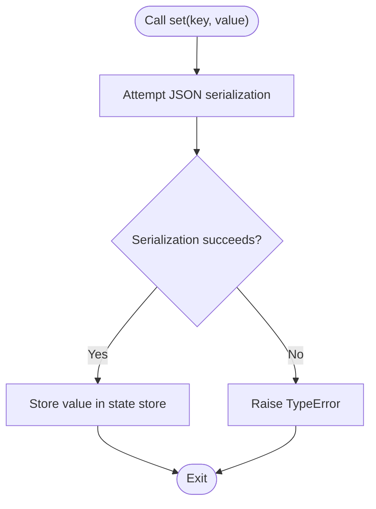
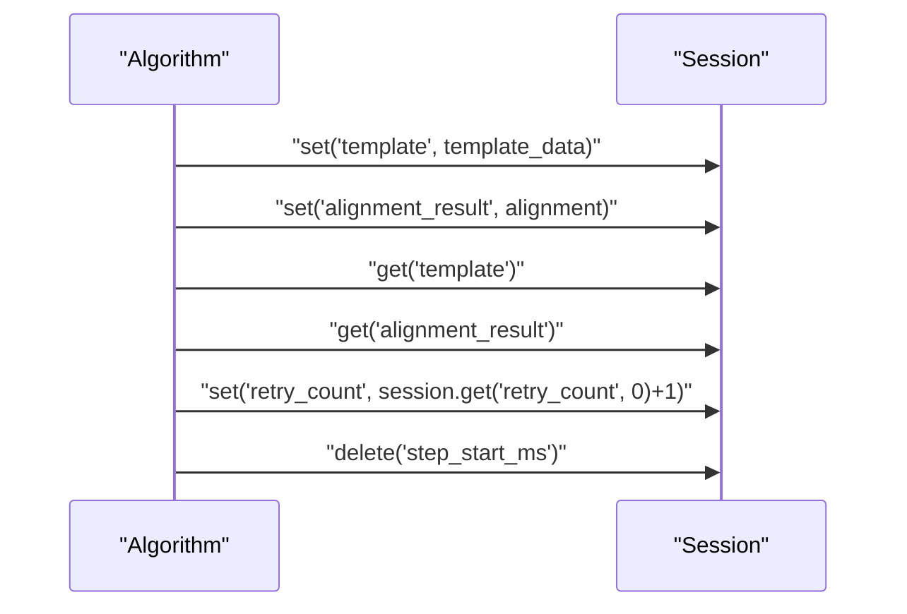
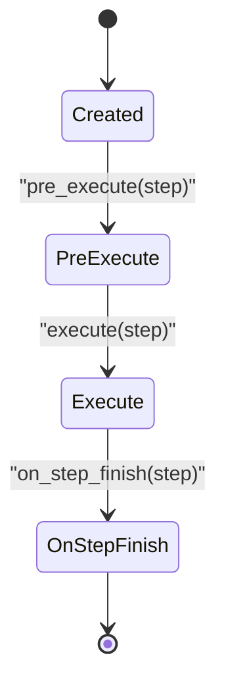
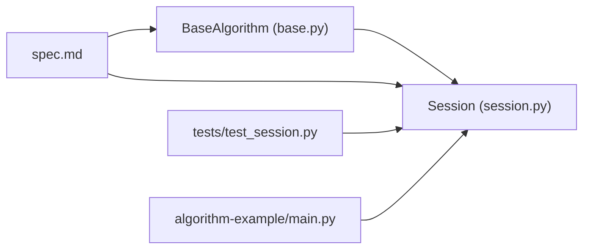

# Session Management

<cite>
**Referenced Files in This Document**
- [session.py](file://procvision_algorithm_sdk/session.py)
- [spec.md](file://spec.md)
- [algorithm_dev_tutorial.md](file://algorithm_dev_tutorial.md)
- [test_session.py](file://tests/test_session.py)
- [main.py](file://algorithm-example/algorithm_example/main.py)
- [base.py](file://procvision_algorithm_sdk/base.py)
</cite>

## Table of Contents
1. [Introduction](#introduction)
2. [Project Structure](#project-structure)
3. [Core Components](#core-components)
4. [Architecture Overview](#architecture-overview)
5. [Detailed Component Analysis](#detailed-component-analysis)
6. [Dependency Analysis](#dependency-analysis)
7. [Performance Considerations](#performance-considerations)
8. [Troubleshooting Guide](#troubleshooting-guide)
9. [Conclusion](#conclusion)

## Introduction
This document explains the Session component in the ProcVision Algorithm SDK. Session acts as a lightweight, in-memory state container that persists data across algorithm steps within a single detection session. It enables algorithms to share intermediate results (such as templates, alignment outcomes, counters, and debug metadata) between pre_execute and execute calls without relying on external persistence. The component exposes a simple API: get, set, delete, exists, and read-only id and context properties. Values stored via set must be JSON-serializable, which constrains the kinds of objects that can be safely cached in session state.

## Project Structure
The Session component is implemented in the SDK package and integrated into the algorithm lifecycle defined by the specification. The example algorithm demonstrates typical usage patterns for session state.

**Diagram sources**
- [session.py](file://procvision_algorithm_sdk/session.py#L1-L36)
- [base.py](file://procvision_algorithm_sdk/base.py#L1-L58)
- [main.py](file://algorithm-example/algorithm_example/main.py#L1-L150)
- [spec.md](file://spec.md#L408-L485)
- [algorithm_dev_tutorial.md](file://algorithm_dev_tutorial.md#L96-L101)
- [test_session.py](file://tests/test_session.py#L1-L24)

**Section sources**
- [session.py](file://procvision_algorithm_sdk/session.py#L1-L36)
- [spec.md](file://spec.md#L408-L485)
- [algorithm_dev_tutorial.md](file://algorithm_dev_tutorial.md#L96-L101)
- [test_session.py](file://tests/test_session.py#L1-L24)
- [main.py](file://algorithm-example/algorithm_example/main.py#L1-L150)
- [base.py](file://procvision_algorithm_sdk/base.py#L1-L58)

## Core Components
- Session class
  - Purpose: Provide a simple, in-process key-value store scoped to a single detection session.
  - Public API:
    - id: read-only property returning the session identifier.
    - context: read-only property returning a copy of the immutable context dictionary.
    - get(key, default=None): retrieve a value by key.
    - set(key, value): store a value after validating JSON serializability.
    - delete(key): remove a key and return whether deletion occurred.
    - exists(key): check if a key exists.
  - Constraints:
    - Values passed to set must be JSON-serializable; otherwise a TypeError is raised.
    - Session data is ephemeral and does not persist across separate detections or product changes.

**Section sources**
- [session.py](file://procvision_algorithm_sdk/session.py#L1-L36)
- [spec.md](file://spec.md#L408-L485)
- [algorithm_dev_tutorial.md](file://algorithm_dev_tutorial.md#L96-L101)

## Architecture Overview
The Session object is created by the platform at the start of a detection session and passed into each algorithm lifecycle hook and step method. Algorithms can use it to cache lightweight artifacts (e.g., templates, alignment results, counters) during the session.

**Diagram sources**
- [spec.md](file://spec.md#L408-L485)
- [base.py](file://procvision_algorithm_sdk/base.py#L1-L58)

## Detailed Component Analysis

### Session Class API and Behavior
- Properties
  - id: returns the session identifier string.
  - context: returns a shallow copy of the context dictionary to prevent mutation from outside the SDK.
- Methods
  - get(key, default=None): returns the stored value or default if absent.
  - set(key, value): validates JSON serializability; raises TypeError if not serializable; stores the value.
  - delete(key): removes the key if present and returns True; otherwise returns False.
  - exists(key): checks membership in the internal state store.

**Diagram sources**
- [session.py](file://procvision_algorithm_sdk/session.py#L1-L36)

**Section sources**
- [session.py](file://procvision_algorithm_sdk/session.py#L1-L36)
- [spec.md](file://spec.md#L408-L485)

### JSON-Serializable Constraint in set()
- Validation mechanism: set attempts to serialize the value using JSON serialization. If serialization fails, a TypeError is raised.
- Implications:
  - Only basic types and structures supported by JSON are allowed (strings, numbers, booleans, lists, dicts, null).
  - Mutable containers like sets are not allowed.
  - Large binary blobs (e.g., raw images) should not be stored directly; instead, store lightweight descriptors (e.g., shapes, identifiers) and keep heavy data elsewhere.

**Diagram sources**
- [session.py](file://procvision_algorithm_sdk/session.py#L1-L36)

**Section sources**
- [session.py](file://procvision_algorithm_sdk/session.py#L1-L36)
- [spec.md](file://spec.md#L408-L485)

### Usage Patterns and Examples
- Caching templates and alignment results between pre_execute and execute:
  - In pre_execute, compute and store a template or alignment result in session.
  - In execute, retrieve the cached artifact and proceed with detection.
- Counters and timing:
  - Record timestamps in on_step_start and compute latency in on_step_finish using session.
- Resetting temporary state:
  - Clear temporary keys in reset to avoid cross-session leakage.

**Diagram sources**
- [main.py](file://algorithm-example/algorithm_example/main.py#L1-L150)
- [spec.md](file://spec.md#L408-L485)

**Section sources**
- [main.py](file://algorithm-example/algorithm_example/main.py#L1-L150)
- [algorithm_dev_tutorial.md](file://algorithm_dev_tutorial.md#L96-L101)
- [spec.md](file://spec.md#L408-L485)

### Session Lifecycle and Integration
- Creation and lifetime:
  - The platform creates a Session at the start of a detection session and passes it to all lifecycle hooks and step methods.
  - Session data is ephemeral and does not persist across separate detections or product changes.
- Integration points:
  - BaseAlgorithm defines lifecycle hooks (on_step_start, on_step_finish) and step methods (pre_execute, execute) that receive the Session instance.
  - Algorithms can use session to coordinate state across steps without platform-managed persistence.

**Diagram sources**
- [spec.md](file://spec.md#L408-L485)
- [base.py](file://procvision_algorithm_sdk/base.py#L1-L58)

**Section sources**
- [spec.md](file://spec.md#L408-L485)
- [base.py](file://procvision_algorithm_sdk/base.py#L1-L58)

## Dependency Analysis
- Internal dependencies:
  - BaseAlgorithm depends on Session for passing session state to lifecycle hooks and step methods.
  - Tests validate Session behavior and enforce JSON-serializability constraints.
- External constraints:
  - The specification defines the Session API and lifecycle expectations, while the implementation enforces JSON-serializability and ephemeral semantics.

**Diagram sources**
- [base.py](file://procvision_algorithm_sdk/base.py#L1-L58)
- [session.py](file://procvision_algorithm_sdk/session.py#L1-L36)
- [spec.md](file://spec.md#L408-L485)
- [test_session.py](file://tests/test_session.py#L1-L24)
- [main.py](file://algorithm-example/algorithm_example/main.py#L1-L150)

**Section sources**
- [base.py](file://procvision_algorithm_sdk/base.py#L1-L58)
- [session.py](file://procvision_algorithm_sdk/session.py#L1-L36)
- [spec.md](file://spec.md#L408-L485)
- [test_session.py](file://tests/test_session.py#L1-L24)
- [main.py](file://algorithm-example/algorithm_example/main.py#L1-L150)

## Performance Considerations
- Memory footprint:
  - Session stores are kept in memory and are intended for small, lightweight artifacts. The specification recommends keeping stored data under a modest size threshold.
- Serialization overhead:
  - set performs JSON serialization to validate types. Avoid storing extremely large or frequently changing objects to minimize overhead.
- Thread safety:
  - The Session implementation is a simple in-memory dict wrapper with no explicit locking. If algorithms use threading internally, they must ensure thread-safe access to shared mutable state outside of Session. Session itself is not a thread-safe container.

[No sources needed since this section provides general guidance]

## Troubleshooting Guide
- Symptom: TypeError when calling set
  - Cause: Value is not JSON-serializable.
  - Resolution: Convert to a JSON-compatible type (e.g., replace sets with lists, encode binary data as compact descriptors).
- Symptom: Missing data in subsequent steps
  - Cause: Session is ephemeral and does not persist across detections or products.
  - Resolution: Re-compute or re-store the data in the appropriate step, or move long-lived state to algorithm instance attributes.
- Symptom: Unexpected mutations to context
  - Cause: Attempting to modify the context dictionary returned by session.context.
  - Resolution: Treat context as read-only; mutate only within the platform-provided context.

**Section sources**
- [session.py](file://procvision_algorithm_sdk/session.py#L1-L36)
- [test_session.py](file://tests/test_session.py#L1-L24)
- [spec.md](file://spec.md#L408-L485)

## Conclusion
Session provides a straightforward, in-memory state container for sharing lightweight data across algorithm steps within a single detection session. Its API is intentionally minimal, with strict JSON-serializability enforcement and read-only context semantics. By following the documented usage patterns—caching templates and alignment results, using counters and timing, and resetting temporary state—algorithms can reliably coordinate state across steps while avoiding persistent storage pitfalls. For large or heavy objects, store only descriptors or references and keep the actual data elsewhere to maintain performance and reliability.