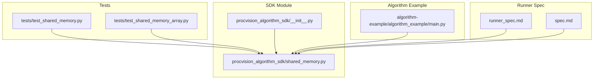
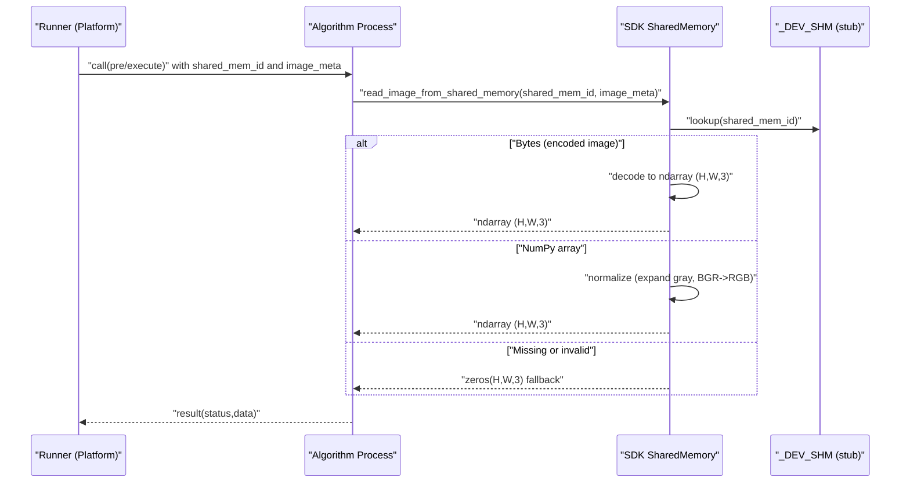
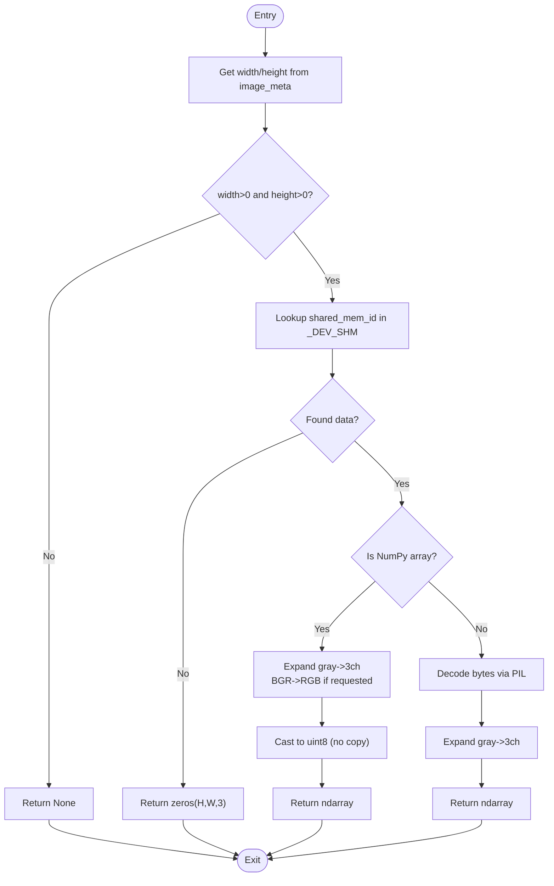
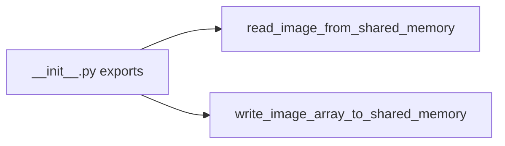
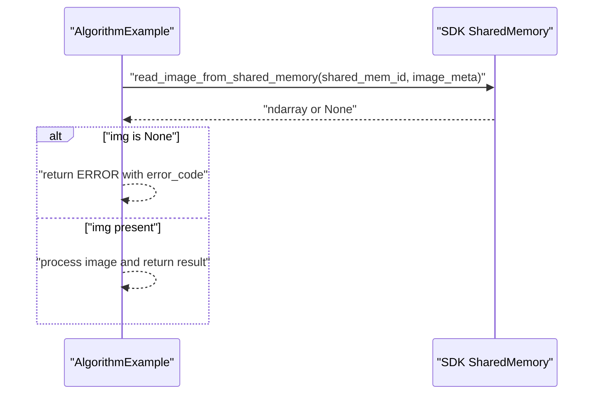
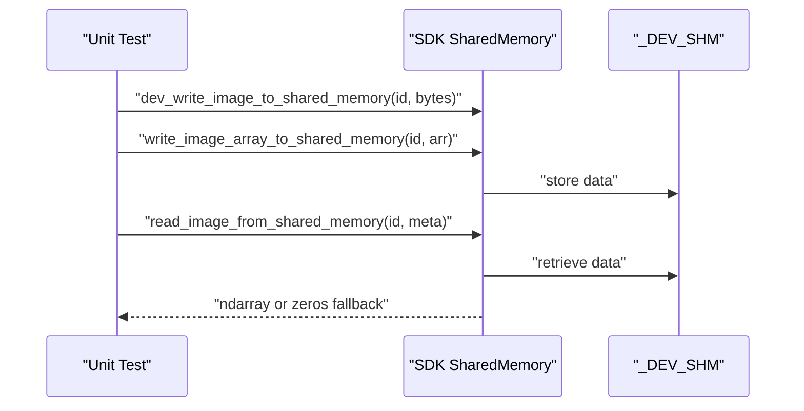
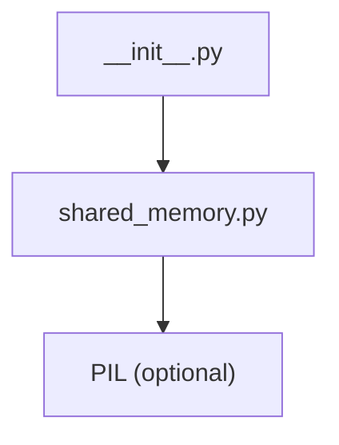

# Shared Memory Data Transfer

<cite>
**Referenced Files in This Document**
- [shared_memory.py](file://procvision_algorithm_sdk/shared_memory.py)
- [__init__.py](file://procvision_algorithm_sdk/__init__.py)
- [spec.md](file://spec.md)
- [runner_spec.md](file://runner_spec.md)
- [test_shared_memory.py](file://tests/test_shared_memory.py)
- [test_shared_memory_array.py](file://tests/test_shared_memory_array.py)
- [algorithm_example/main.py](file://algorithm-example/algorithm_example/main.py)
- [cli.py](file://procvision_algorithm_sdk/cli.py)
- [algorithm_dev_tutorial.md](file://algorithm_dev_tutorial.md)
- [algorithm_dev_quickstart.md](file://algorithm_dev_quickstart.md)
</cite>

## Table of Contents
1. [Introduction](#introduction)
2. [Project Structure](#project-structure)
3. [Core Components](#core-components)
4. [Architecture Overview](#architecture-overview)
5. [Detailed Component Analysis](#detailed-component-analysis)
6. [Dependency Analysis](#dependency-analysis)
7. [Performance Considerations](#performance-considerations)
8. [Troubleshooting Guide](#troubleshooting-guide)
9. [Conclusion](#conclusion)
10. [Appendices](#appendices)

## Introduction
This document explains the SharedMemory component in the ProcVision Algorithm SDK, focusing on how it enables high-performance, zero-copy image data transfer between the platform and algorithm processes. The design follows a strict read-only model: algorithms only read images from shared memory segments identified by shared_mem_id, while the platform manages all memory allocation and cleanup. The image_meta structure carries minimal metadata required to interpret buffers correctly. The implementation currently provides a development-time in-memory stub that simulates platform-provided shared memory, and the specification requires algorithms to avoid creating or writing to shared memory.

## Project Structure
The SharedMemory capability is implemented in a dedicated module and exposed via the SDK’s public interface. Tests demonstrate usage patterns and fallback behavior. The algorithm example shows how algorithms integrate the read API into their pre_execute and execute steps.

**Diagram sources**
- [shared_memory.py](file://procvision_algorithm_sdk/shared_memory.py#L1-L52)
- [__init__.py](file://procvision_algorithm_sdk/__init__.py#L1-L19)
- [test_shared_memory.py](file://tests/test_shared_memory.py#L1-L16)
- [test_shared_memory_array.py](file://tests/test_shared_memory_array.py#L1-L39)
- [algorithm_example/main.py](file://algorithm-example/algorithm_example/main.py#L1-L149)
- [runner_spec.md](file://runner_spec.md#L1-L282)
- [spec.md](file://spec.md#L1-L799)

**Section sources**
- [shared_memory.py](file://procvision_algorithm_sdk/shared_memory.py#L1-L52)
- [__init__.py](file://procvision_algorithm_sdk/__init__.py#L1-L19)
- [test_shared_memory.py](file://tests/test_shared_memory.py#L1-L16)
- [test_shared_memory_array.py](file://tests/test_shared_memory_array.py#L1-L39)
- [algorithm_example/main.py](file://algorithm-example/algorithm_example/main.py#L1-L149)
- [runner_spec.md](file://runner_spec.md#L1-L282)
- [spec.md](file://spec.md#L1-L799)

## Core Components
- read_image_from_shared_memory(shared_mem_id: str, image_meta: Dict[str, Any]) -> Any
  - Purpose: Retrieve an image array from a shared memory segment using the platform-provided identifier and metadata.
  - Behavior:
    - Validates width and height from image_meta; returns None if invalid.
    - Supports two data sources:
      - NumPy arrays written via write_image_array_to_shared_memory (development/test).
      - Bytes (e.g., JPEG/PNG) written via dev_write_image_to_shared_memory (development/test).
    - Normalizes arrays:
      - Expands grayscale to 3-channel RGB.
      - Converts BGR to RGB when color_space is "BGR".
      - Ensures dtype is uint8 without copying when possible.
    - Fallback: Returns zeros(H, W, 3) when data is missing or decoding fails.
- write_image_array_to_shared_memory(shared_mem_id: str, image_array: Any) -> None
  - Purpose: Development/test helper to place a NumPy array into the internal shared memory map.
- dev_write_image_to_shared_memory(shared_mem_id: str, image_bytes: bytes) -> None
  - Purpose: Development/test helper to place encoded image bytes into the internal shared memory map.
- dev_clear_shared_memory(shared_mem_id: str) -> None
  - Purpose: Development/test helper to remove entries from the internal shared memory map.

Key constraints:
- Algorithms must not create or write to shared memory; they only read.
- image_meta must include width, height, timestamp_ms, camera_id; optional color_space can be "RGB" or "BGR".
- The current implementation is a development-time stub backed by an in-memory dictionary; production uses a platform-backed shared memory backend.

**Section sources**
- [shared_memory.py](file://procvision_algorithm_sdk/shared_memory.py#L1-L52)
- [spec.md](file://spec.md#L1-L799)
- [runner_spec.md](file://runner_spec.md#L1-L282)
- [algorithm_dev_tutorial.md](file://algorithm_dev_tutorial.md#L103-L127)
- [algorithm_dev_quickstart.md](file://algorithm_dev_quickstart.md#L89-L120)

## Architecture Overview
The SharedMemory architecture enforces a read-only contract for algorithms. The platform allocates and writes image data into a shared memory segment and passes a unique shared_mem_id plus image_meta to the algorithm. The algorithm reads the image using the SDK’s read function, which interprets the buffer according to image_meta and returns a normalized NumPy array.

**Diagram sources**
- [shared_memory.py](file://procvision_algorithm_sdk/shared_memory.py#L1-L52)
- [cli.py](file://procvision_algorithm_sdk/cli.py#L91-L102)
- [runner_spec.md](file://runner_spec.md#L1-L282)

**Section sources**
- [runner_spec.md](file://runner_spec.md#L1-L282)
- [shared_memory.py](file://procvision_algorithm_sdk/shared_memory.py#L1-L52)
- [cli.py](file://procvision_algorithm_sdk/cli.py#L91-L102)

## Detailed Component Analysis

### read_image_from_shared_memory Implementation
The function orchestrates buffer interpretation and normalization:
- Validates width and height from image_meta.
- Retrieves data from the internal map keyed by shared_mem_id.
- Handles two data paths:
  - NumPy arrays: expands grayscale to 3 channels, converts BGR to RGB if requested.
  - Bytes: decodes via PIL, then expands grayscale to 3 channels.
- Returns a normalized uint8 array; otherwise returns zeros(H, W, 3).

**Diagram sources**
- [shared_memory.py](file://procvision_algorithm_sdk/shared_memory.py#L15-L51)

**Section sources**
- [shared_memory.py](file://procvision_algorithm_sdk/shared_memory.py#L1-L52)

### Public API Exposure
The SDK exposes the read and write helpers through its package initializer, allowing algorithms to import them directly.

**Diagram sources**
- [__init__.py](file://procvision_algorithm_sdk/__init__.py#L1-L19)

**Section sources**
- [__init__.py](file://procvision_algorithm_sdk/__init__.py#L1-L19)

### Usage in Algorithm Example
The example demonstrates reading images in both pre_execute and execute, validating image_meta defaults, and handling None returns gracefully.

**Diagram sources**
- [algorithm_example/main.py](file://algorithm-example/algorithm_example/main.py#L60-L140)

**Section sources**
- [algorithm_example/main.py](file://algorithm-example/algorithm_example/main.py#L1-L149)

### Development/Test Helpers
Development and testing rely on dev_write_image_to_shared_memory and write_image_array_to_shared_memory to populate the internal map. Tests verify:
- Fallback behavior when bytes are not valid images.
- RGB passthrough for 3-channel arrays.
- Gray-to-3-channel expansion.
- BGR-to-RGB conversion when color_space is "BGR".

**Diagram sources**
- [test_shared_memory.py](file://tests/test_shared_memory.py#L1-L16)
- [test_shared_memory_array.py](file://tests/test_shared_memory_array.py#L1-L39)
- [shared_memory.py](file://procvision_algorithm_sdk/shared_memory.py#L1-L52)

**Section sources**
- [test_shared_memory.py](file://tests/test_shared_memory.py#L1-L16)
- [test_shared_memory_array.py](file://tests/test_shared_memory_array.py#L1-L39)
- [shared_memory.py](file://procvision_algorithm_sdk/shared_memory.py#L1-L52)

## Dependency Analysis
- Internal dependency: read_image_from_shared_memory depends on the internal _DEV_SHM map and PIL for decoding bytes.
- External dependency: PIL is conditionally imported and used when decoding bytes.
- Public exposure: __init__.py re-exports read_image_from_shared_memory and write_image_array_to_shared_memory.

**Diagram sources**
- [shared_memory.py](file://procvision_algorithm_sdk/shared_memory.py#L1-L52)
- [__init__.py](file://procvision_algorithm_sdk/__init__.py#L1-L19)

**Section sources**
- [shared_memory.py](file://procvision_algorithm_sdk/shared_memory.py#L1-L52)
- [__init__.py](file://procvision_algorithm_sdk/__init__.py#L1-L19)

## Performance Considerations
- Zero-copy semantics: The implementation casts arrays to uint8 without copying when possible, minimizing overhead.
- Minimal decoding cost: When arrays are passed directly, decoding is skipped; fallback to zeros is fast.
- Practical targets: The specification references a target of reading a 640x480 image in ≤ 1 ms. This implies avoiding heavy decoding and leveraging direct array paths.
- Cross-platform: The current implementation is a development-time stub. Production SharedMemory uses a platform-backed backend; the SDK’s API remains unchanged, preserving portability.

[No sources needed since this section provides general guidance]

## Troubleshooting Guide
Common issues and resolutions:
- Empty or invalid image_meta:
  - Symptom: read returns None or zeros fallback.
  - Cause: width or height ≤ 0, or missing data.
  - Resolution: Validate image_meta before calling read; ensure platform sets width/height correctly.
- Unsupported array shapes:
  - Symptom: Unexpected shape or conversion failure.
  - Cause: Arrays with unsupported channel counts.
  - Resolution: Ensure arrays are (H,W,3) or grayscale (H,W)/(H,W,1); the function expands grayscale automatically.
- Color space mismatch:
  - Symptom: Blue/red channel order appears swapped.
  - Cause: image_meta.color_space set to "BGR".
  - Resolution: Set color_space to "RGB" or rely on automatic BGR→RGB conversion.
- Decoding failures:
  - Symptom: Fallback to zeros(H,W,3).
  - Cause: Bytes not valid JPEG/PNG.
  - Resolution: Verify platform writes valid encoded images; use development helpers only for testing.

**Section sources**
- [shared_memory.py](file://procvision_algorithm_sdk/shared_memory.py#L1-L52)
- [test_shared_memory.py](file://tests/test_shared_memory.py#L1-L16)
- [test_shared_memory_array.py](file://tests/test_shared_memory_array.py#L1-L39)

## Conclusion
The SharedMemory component provides a standardized, read-only mechanism for high-performance image transfer between the platform and algorithm processes. By strictly separating responsibilities—platform allocates and writes, algorithms only read—the SDK ensures predictable performance and portability. The current implementation is a development-time stub that mirrors production behavior, enabling robust testing and validation. Adhering to the read-only contract and providing accurate image_meta ensures efficient, zero-copy image consumption aligned with the documented performance targets.

[No sources needed since this section summarizes without analyzing specific files]

## Appendices

### API Definitions and Contracts
- read_image_from_shared_memory(shared_mem_id: str, image_meta: Dict[str, Any]) -> Any
  - Returns a normalized uint8 ndarray (H, W, 3) or None/fallback zeros.
- write_image_array_to_shared_memory(shared_mem_id: str, image_array: Any) -> None
  - Development/test helper to store arrays in the internal map.
- dev_write_image_to_shared_memory(shared_mem_id: str, image_bytes: bytes) -> None
  - Development/test helper to store encoded bytes in the internal map.
- dev_clear_shared_memory(shared_mem_id: str) -> None
  - Development/test helper to clear entries.

**Section sources**
- [shared_memory.py](file://procvision_algorithm_sdk/shared_memory.py#L1-L52)
- [algorithm_dev_tutorial.md](file://algorithm_dev_tutorial.md#L103-L127)
- [algorithm_dev_quickstart.md](file://algorithm_dev_quickstart.md#L89-L120)

### Usage Examples from the Spec
- Preparing image_meta with width, height, timestamp_ms, camera_id.
- Passing shared_mem_id and image_meta to read_image_from_shared_memory.
- Handling None returns and fallback behavior.

**Section sources**
- [spec.md](file://spec.md#L1-L799)
- [runner_spec.md](file://runner_spec.md#L1-L282)
- [algorithm_example/main.py](file://algorithm-example/algorithm_example/main.py#L60-L140)