# Data Flow

<cite>
**Referenced Files in This Document**
- [README.md](file://README.md)
- [spec.md](file://spec.md)
- [runner_spec.md](file://runner_spec.md)
- [procvision_algorithm_sdk/base.py](file://procvision_algorithm_sdk/base.py)
- [procvision_algorithm_sdk/session.py](file://procvision_algorithm_sdk/session.py)
- [procvision_algorithm_sdk/shared_memory.py](file://procvision_algorithm_sdk/shared_memory.py)
- [procvision_algorithm_sdk/logger.py](file://procvision_algorithm_sdk/logger.py)
- [procvision_algorithm_sdk/diagnostics.py](file://procvision_algorithm_sdk/diagnostics.py)
- [procvision_algorithm_sdk/errors.py](file://procvision_algorithm_sdk/errors.py)
- [procvision_algorithm_sdk/cli.py](file://procvision_algorithm_sdk/cli.py)
- [algorithm-example/algorithm_example/main.py](file://algorithm-example/algorithm_example/main.py)
- [algorithm-example/manifest.json](file://algorithm-example/manifest.json)
- [tests/test_base_algo.py](file://tests/test_base_algo.py)
- [tests/test_shared_memory.py](file://tests/test_shared_memory.py)
- [tests/test_session.py](file://tests/test_session.py)
</cite>

## Table of Contents
1. [Introduction](#introduction)
2. [Project Structure](#project-structure)
3. [Core Components](#core-components)
4. [Architecture Overview](#architecture-overview)
5. [Detailed Component Analysis](#detailed-component-analysis)
6. [Dependency Analysis](#dependency-analysis)
7. [Performance Considerations](#performance-considerations)
8. [Troubleshooting Guide](#troubleshooting-guide)
9. [Conclusion](#conclusion)
10. [Appendices](#appendices)

## Introduction
This document explains the end-to-end data flow within the ProcVision Algorithm SDK, focusing on the algorithm execution lifecycle from initialization through runtime phases. It covers:
- Handshake protocol and heartbeat mechanism
- Step execution for pre_execute and execute
- How parameters (step_index, pid, user_params), context (session), and image data (shared_mem_id, image_meta) are passed between platform and algorithm
- Bidirectional communication via stdin/stdout with length-prefixed JSON frames and stderr for structured logging
- Sequence diagrams for normal execution, error handling, and heartbeat monitoring
- References to spec.md for payload structures and runner_spec.md for protocol timing and timeout policies

## Project Structure
The SDK is organized around a small set of cohesive modules:
- Base algorithm interface and lifecycle hooks
- Session state management
- Shared memory utilities for image transport
- Structured logging and diagnostics
- CLI for validation, local simulation, packaging, and scaffolding
- Example algorithm implementation and manifest

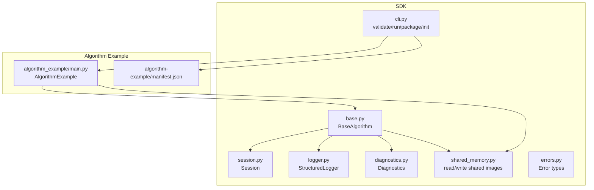

**Diagram sources**
- [procvision_algorithm_sdk/base.py](file://procvision_algorithm_sdk/base.py#L1-L58)
- [procvision_algorithm_sdk/session.py](file://procvision_algorithm_sdk/session.py#L1-L36)
- [procvision_algorithm_sdk/shared_memory.py](file://procvision_algorithm_sdk/shared_memory.py#L1-L53)
- [procvision_algorithm_sdk/logger.py](file://procvision_algorithm_sdk/logger.py#L1-L24)
- [procvision_algorithm_sdk/diagnostics.py](file://procvision_algorithm_sdk/diagnostics.py#L1-L12)
- [procvision_algorithm_sdk/errors.py](file://procvision_algorithm_sdk/errors.py#L1-L14)
- [procvision_algorithm_sdk/cli.py](file://procvision_algorithm_sdk/cli.py#L1-L615)
- [algorithm-example/algorithm_example/main.py](file://algorithm-example/algorithm_example/main.py#L1-L150)
- [algorithm-example/manifest.json](file://algorithm-example/manifest.json#L1-L25)

**Section sources**
- [README.md](file://README.md#L1-L116)
- [procvision_algorithm_sdk/base.py](file://procvision_algorithm_sdk/base.py#L1-L58)
- [procvision_algorithm_sdk/session.py](file://procvision_algorithm_sdk/session.py#L1-L36)
- [procvision_algorithm_sdk/shared_memory.py](file://procvision_algorithm_sdk/shared_memory.py#L1-L53)
- [procvision_algorithm_sdk/logger.py](file://procvision_algorithm_sdk/logger.py#L1-L24)
- [procvision_algorithm_sdk/diagnostics.py](file://procvision_algorithm_sdk/diagnostics.py#L1-L12)
- [procvision_algorithm_sdk/errors.py](file://procvision_algorithm_sdk/errors.py#L1-L14)
- [procvision_algorithm_sdk/cli.py](file://procvision_algorithm_sdk/cli.py#L1-L615)
- [algorithm-example/algorithm_example/main.py](file://algorithm-example/algorithm_example/main.py#L1-L150)
- [algorithm-example/manifest.json](file://algorithm-example/manifest.json#L1-L25)

## Core Components
- BaseAlgorithm: Defines lifecycle hooks (setup, teardown, on_step_start, on_step_finish, reset) and abstract methods (get_info, pre_execute, execute). It also exposes logger and diagnostics helpers.
- Session: Provides a lightweight, in-memory key-value store for cross-step state sharing during a single detection session.
- Shared Memory Utilities: Provide a development-time image transport abstraction and a read helper that returns a numpy array given shared_mem_id and image_meta.
- StructuredLogger: Emits structured JSON records to stderr for logging.
- Diagnostics: Collects diagnostic metrics that can be included in algorithm responses.
- CLI: Validates algorithm packages, runs locally against images, packages offline deliverables, and initializes scaffolding.

Key data flow elements:
- Parameters: step_index, pid, user_params
- Context: session (id, context, state_store)
- Image data: shared_mem_id, image_meta (width, height, timestamp_ms, camera_id)
- Protocol: stdin/stdout frames, stderr structured logs

**Section sources**
- [procvision_algorithm_sdk/base.py](file://procvision_algorithm_sdk/base.py#L1-L58)
- [procvision_algorithm_sdk/session.py](file://procvision_algorithm_sdk/session.py#L1-L36)
- [procvision_algorithm_sdk/shared_memory.py](file://procvision_algorithm_sdk/shared_memory.py#L1-L53)
- [procvision_algorithm_sdk/logger.py](file://procvision_algorithm_sdk/logger.py#L1-L24)
- [procvision_algorithm_sdk/diagnostics.py](file://procvision_algorithm_sdk/diagnostics.py#L1-L12)
- [procvision_algorithm_sdk/cli.py](file://procvision_algorithm_sdk/cli.py#L1-L615)

## Architecture Overview
The platform and algorithm communicate over a length-prefixed JSON frame protocol on stdin/stdout, with structured logging on stderr. The Runner manages lifecycle, session creation, and step orchestration. The algorithm implements BaseAlgorithm and receives inputs via pre_execute/execute.

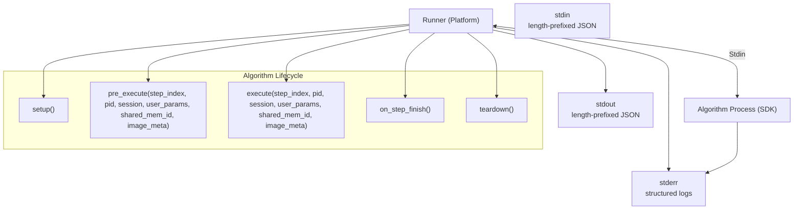

**Diagram sources**
- [runner_spec.md](file://runner_spec.md#L1-L283)
- [spec.md](file://spec.md#L1-L799)
- [procvision_algorithm_sdk/base.py](file://procvision_algorithm_sdk/base.py#L1-L58)

**Section sources**
- [runner_spec.md](file://runner_spec.md#L1-L283)
- [spec.md](file://spec.md#L1-L799)

## Detailed Component Analysis

### BaseAlgorithm and Lifecycle Hooks
BaseAlgorithm defines:
- Lifecycle: setup, teardown, on_step_start, on_step_finish, reset
- Interface: get_info, pre_execute, execute
- Helpers: logger (structured), diagnostics (publish/get)

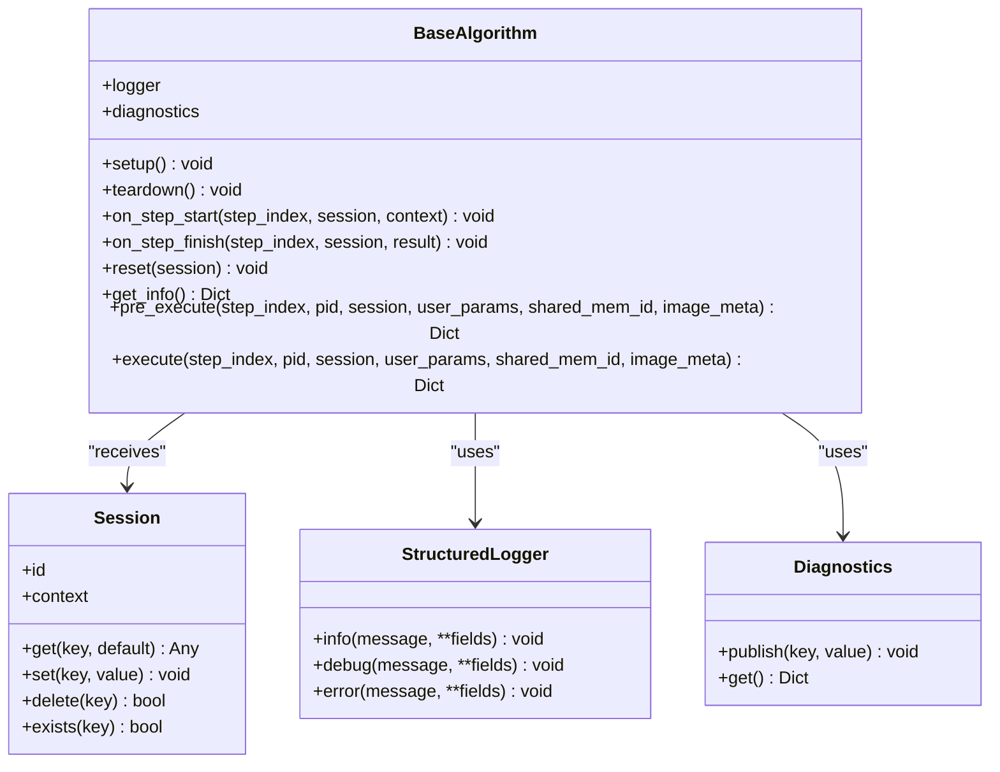

**Diagram sources**
- [procvision_algorithm_sdk/base.py](file://procvision_algorithm_sdk/base.py#L1-L58)
- [procvision_algorithm_sdk/session.py](file://procvision_algorithm_sdk/session.py#L1-L36)
- [procvision_algorithm_sdk/logger.py](file://procvision_algorithm_sdk/logger.py#L1-L24)
- [procvision_algorithm_sdk/diagnostics.py](file://procvision_algorithm_sdk/diagnostics.py#L1-L12)

**Section sources**
- [procvision_algorithm_sdk/base.py](file://procvision_algorithm_sdk/base.py#L1-L58)
- [procvision_algorithm_sdk/session.py](file://procvision_algorithm_sdk/session.py#L1-L36)
- [procvision_algorithm_sdk/logger.py](file://procvision_algorithm_sdk/logger.py#L1-L24)
- [procvision_algorithm_sdk/diagnostics.py](file://procvision_algorithm_sdk/diagnostics.py#L1-L12)

### Session State Management
Session encapsulates:
- id and context (product_code, operator, trace_id)
- state_store (in-memory, JSON-serializable values)
- get/set/delete/exists APIs

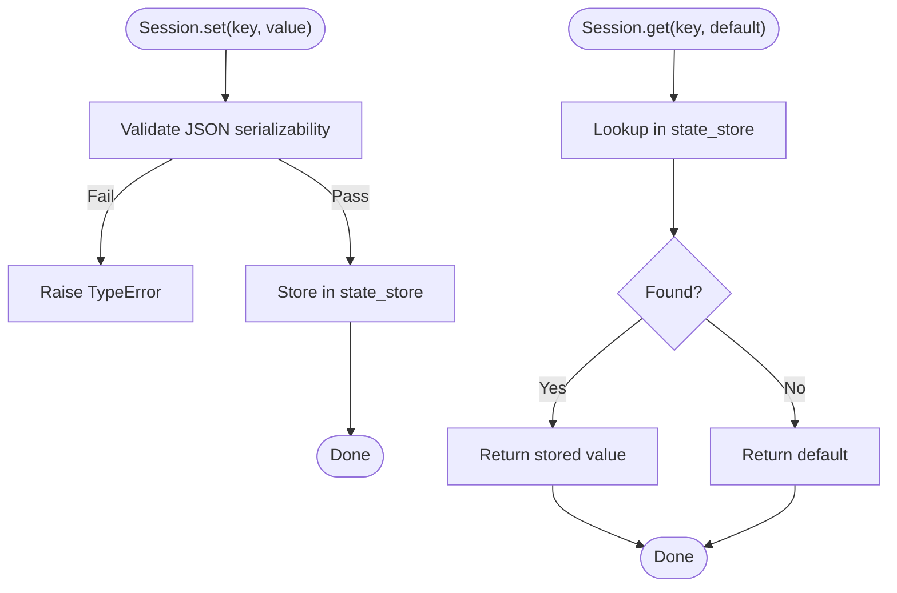

**Diagram sources**
- [procvision_algorithm_sdk/session.py](file://procvision_algorithm_sdk/session.py#L1-L36)

**Section sources**
- [procvision_algorithm_sdk/session.py](file://procvision_algorithm_sdk/session.py#L1-L36)
- [tests/test_session.py](file://tests/test_session.py#L1-L24)

### Shared Memory Image Transport
The SDK provides a development-time shared memory abstraction:
- dev_write_image_to_shared_memory
- read_image_from_shared_memory returns a numpy array using image_meta (width, height, color_space optional)
- Fallback behavior if raw bytes are not a valid image

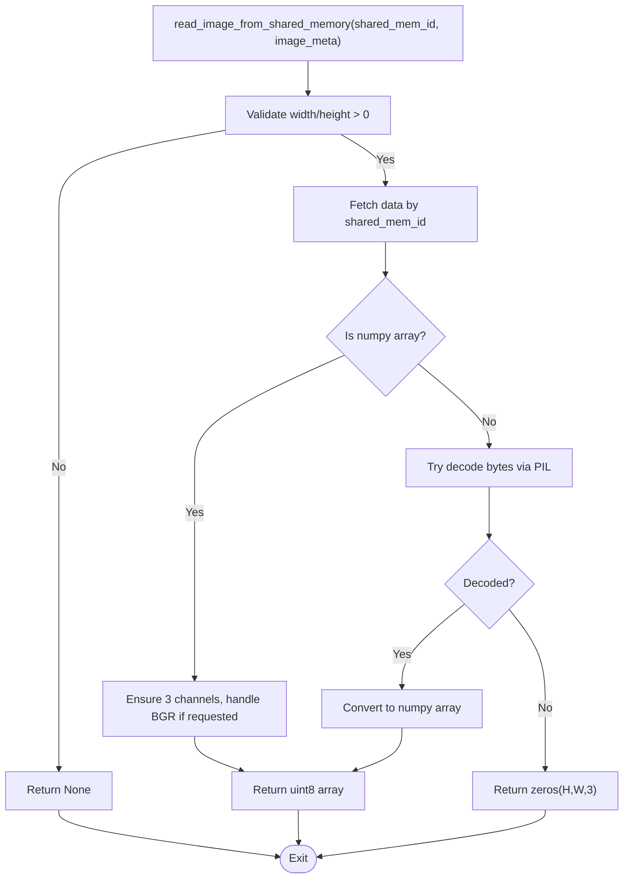

**Diagram sources**
- [procvision_algorithm_sdk/shared_memory.py](file://procvision_algorithm_sdk/shared_memory.py#L1-L53)

**Section sources**
- [procvision_algorithm_sdk/shared_memory.py](file://procvision_algorithm_sdk/shared_memory.py#L1-L53)
- [tests/test_shared_memory.py](file://tests/test_shared_memory.py#L1-L16)

### Protocol Frames and Handshake
Protocol framing uses 4-byte big-endian length prefix plus UTF-8 JSON. The handshake and heartbeat are defined in runner_spec.md and spec.md.

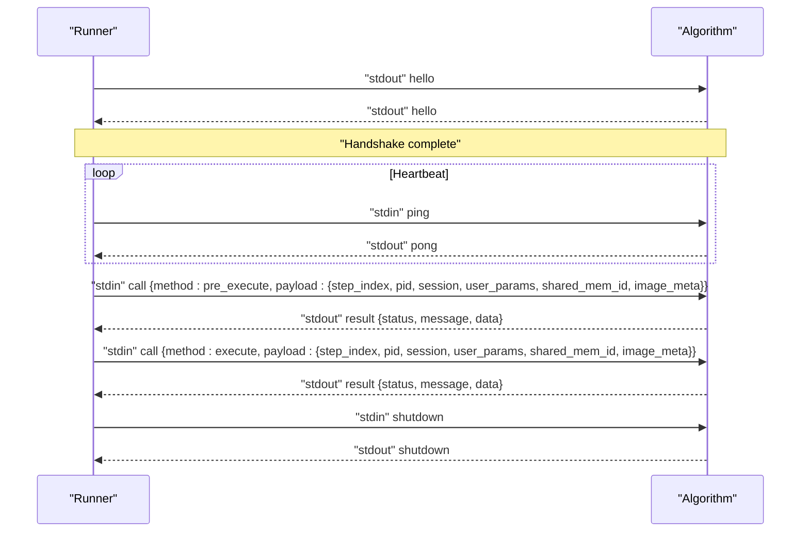

**Diagram sources**
- [runner_spec.md](file://runner_spec.md#L1-L283)
- [spec.md](file://spec.md#L1-L799)

**Section sources**
- [runner_spec.md](file://runner_spec.md#L1-L283)
- [spec.md](file://spec.md#L1-L799)

### Normal Execution Sequence
This sequence shows the typical flow for a single step (pre_execute then execute) with session and image data.

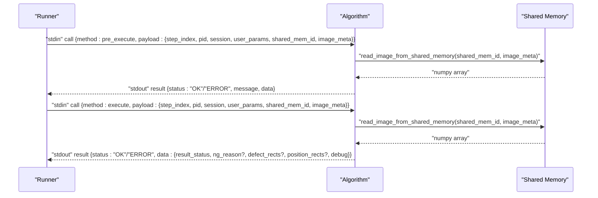

**Diagram sources**
- [runner_spec.md](file://runner_spec.md#L1-L283)
- [spec.md](file://spec.md#L1-L799)
- [procvision_algorithm_sdk/shared_memory.py](file://procvision_algorithm_sdk/shared_memory.py#L1-L53)

**Section sources**
- [runner_spec.md](file://runner_spec.md#L1-L283)
- [spec.md](file://spec.md#L1-L799)

### Error Handling Sequence
Errors can occur in pre_execute/execute or due to invalid inputs. The protocol uses status and message fields; fatal vs recoverable errors are indicated by error types.

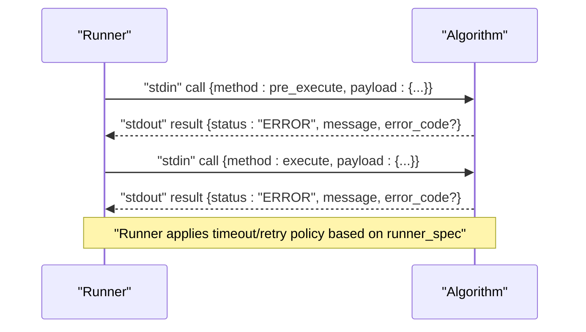

**Diagram sources**
- [runner_spec.md](file://runner_spec.md#L1-L283)
- [procvision_algorithm_sdk/errors.py](file://procvision_algorithm_sdk/errors.py#L1-L14)

**Section sources**
- [runner_spec.md](file://runner_spec.md#L1-L283)
- [procvision_algorithm_sdk/errors.py](file://procvision_algorithm_sdk/errors.py#L1-L14)

### Heartbeat Monitoring Sequence
Runner periodically sends ping; algorithm must reply pong within grace period.

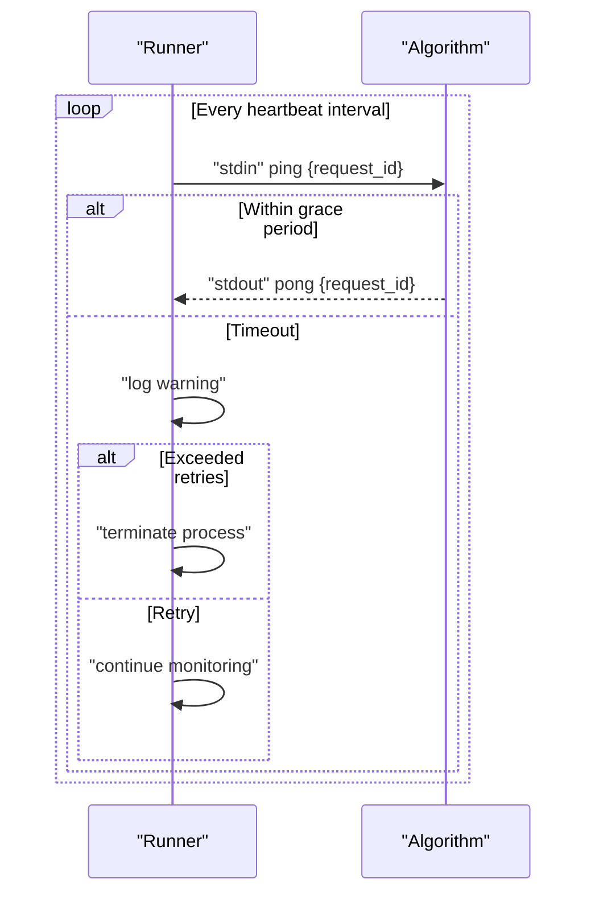

**Diagram sources**
- [runner_spec.md](file://runner_spec.md#L1-L283)

**Section sources**
- [runner_spec.md](file://runner_spec.md#L1-L283)

### Local Simulation and Validation
The CLI provides:
- validate: checks manifest, entry_point, supported_pids match, smoke tests get_info, pre_execute, execute
- run: writes image to dev shared memory and simulates a single step
- package: builds offline zip with wheels and requirements
- init: scaffolds a new algorithm package

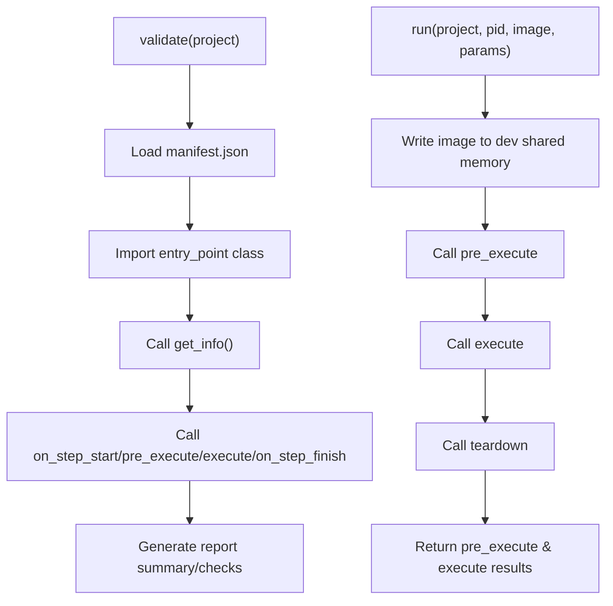

**Diagram sources**
- [procvision_algorithm_sdk/cli.py](file://procvision_algorithm_sdk/cli.py#L1-L615)

**Section sources**
- [procvision_algorithm_sdk/cli.py](file://procvision_algorithm_sdk/cli.py#L1-L615)

## Dependency Analysis
The algorithm example demonstrates the end-to-end usage of the SDK.

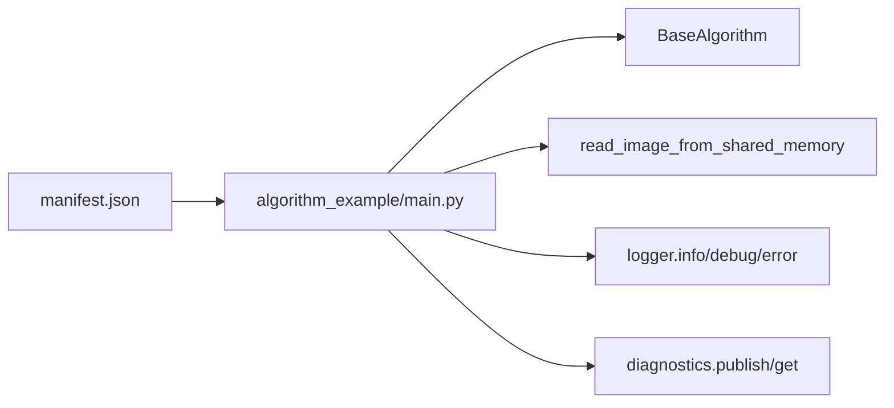

**Diagram sources**
- [algorithm-example/manifest.json](file://algorithm-example/manifest.json#L1-L25)
- [algorithm-example/algorithm_example/main.py](file://algorithm-example/algorithm_example/main.py#L1-L150)
- [procvision_algorithm_sdk/base.py](file://procvision_algorithm_sdk/base.py#L1-L58)
- [procvision_algorithm_sdk/shared_memory.py](file://procvision_algorithm_sdk/shared_memory.py#L1-L53)
- [procvision_algorithm_sdk/logger.py](file://procvision_algorithm_sdk/logger.py#L1-L24)
- [procvision_algorithm_sdk/diagnostics.py](file://procvision_algorithm_sdk/diagnostics.py#L1-L12)

**Section sources**
- [algorithm-example/algorithm_example/main.py](file://algorithm-example/algorithm_example/main.py#L1-L150)
- [algorithm-example/manifest.json](file://algorithm-example/manifest.json#L1-L25)
- [tests/test_base_algo.py](file://tests/test_base_algo.py#L1-L65)

## Performance Considerations
- Image decoding: read_image_from_shared_memory decodes via PIL fallback; ensure image_meta matches actual dimensions to avoid unnecessary fallbacks.
- Logging: StructuredLogger writes to stderr; keep messages concise and avoid excessive logging in hot paths.
- Session size: Keep state_store small (<100KB) to minimize overhead.
- Diagnostics: Publish only necessary metrics; large payloads increase response sizes.
- Heartbeat: Keep heartbeat thread non-blocking; ensure pong replies are immediate.

[No sources needed since this section provides general guidance]

## Troubleshooting Guide
Common issues and resolutions:
- Invalid PID: pre_execute/execute should return ERROR with appropriate message and error_code.
- Missing or empty image: read_image_from_shared_memory returns None; handle gracefully and return ERROR.
- Non-serializable session values: Session.set raises TypeError; ensure values are JSON-serializable.
- Protocol errors: Verify length-prefixed JSON frames and that only stdout emits protocol frames while stderr emits logs.
- Heartbeat timeouts: Ensure algorithm responds to ping within grace period; offload heavy work from heartbeat thread.

**Section sources**
- [procvision_algorithm_sdk/session.py](file://procvision_algorithm_sdk/session.py#L1-L36)
- [procvision_algorithm_sdk/shared_memory.py](file://procvision_algorithm_sdk/shared_memory.py#L1-L53)
- [runner_spec.md](file://runner_spec.md#L1-L283)

## Conclusion
The ProcVision Algorithm SDK defines a clear, protocol-driven lifecycle for algorithm execution. The platform and algorithm exchange structured JSON frames over stdin/stdout, with structured logging on stderr. The SDK’s BaseAlgorithm, Session, and shared memory utilities enable robust, testable implementations that align with the Runner’s heartbeat, timeout, and error-handling policies.

[No sources needed since this section summarizes without analyzing specific files]

## Appendices

### Payload Structures and Field Constraints
- Pre-execute payload: includes step_index, pid, session, user_params, shared_mem_id, image_meta.
- Pre-execute result: status, message, optional data (e.g., calibration_rects), optional debug.
- Execute result: status, message, data with result_status (OK/NG), optional ng_reason, defect_rects, position_rects, debug.
- Session: id, context, state_store (JSON-serializable values).
- Shared memory: image_meta minimal set (width, height, timestamp_ms, camera_id); read returns numpy array.

**Section sources**
- [runner_spec.md](file://runner_spec.md#L1-L283)
- [spec.md](file://spec.md#L1-L799)