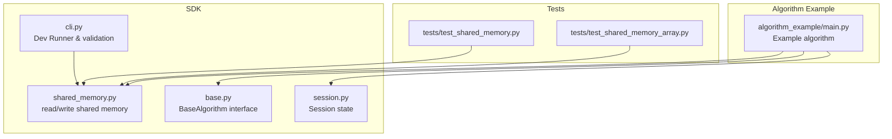
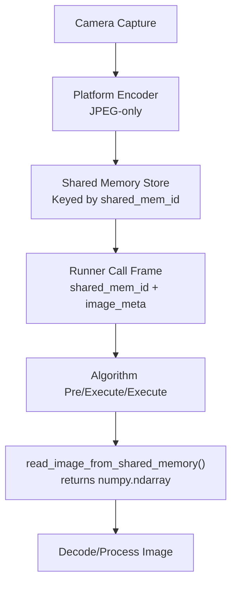
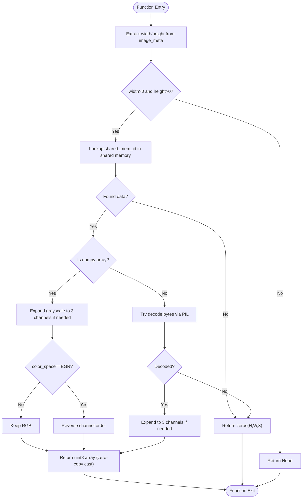
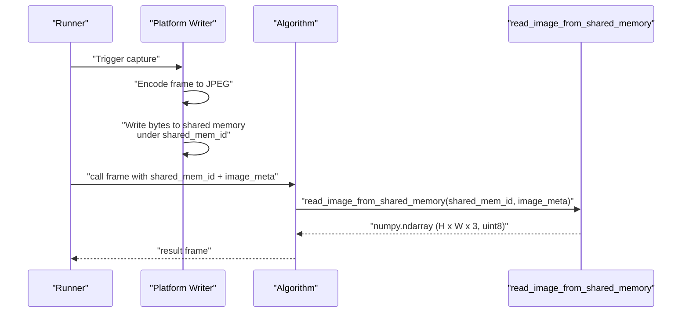
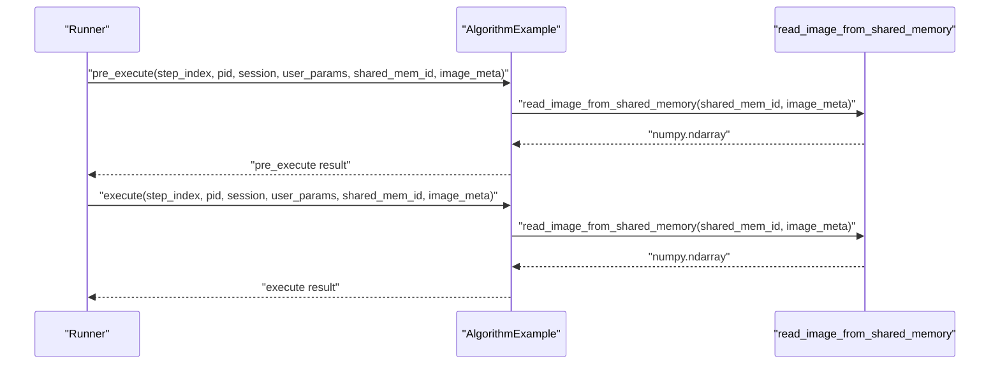
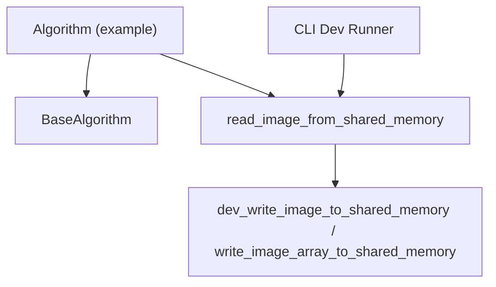

# Image Data Transfer

<cite>
**Referenced Files in This Document**
- [README.md](file://README.md)
- [spec.md](file://spec.md)
- [runner_spec.md](file://runner_spec.md)
- [procvision_algorithm_sdk/shared_memory.py](file://procvision_algorithm_sdk/shared_memory.py)
- [procvision_algorithm_sdk/cli.py](file://procvision_algorithm_sdk/cli.py)
- [procvision_algorithm_sdk/base.py](file://procvision_algorithm_sdk/base.py)
- [procvision_algorithm_sdk/session.py](file://procvision_algorithm_sdk/session.py)
- [algorithm-example/algorithm_example/main.py](file://algorithm-example/algorithm_example/main.py)
- [tests/test_shared_memory.py](file://tests/test_shared_memory.py)
- [tests/test_shared_memory_array.py](file://tests/test_shared_memory_array.py)
</cite>

## Table of Contents
1. [Introduction](#introduction)
2. [Project Structure](#project-structure)
3. [Core Components](#core-components)
4. [Architecture Overview](#architecture-overview)
5. [Detailed Component Analysis](#detailed-component-analysis)
6. [Dependency Analysis](#dependency-analysis)
7. [Performance Considerations](#performance-considerations)
8. [Troubleshooting Guide](#troubleshooting-guide)
9. [Conclusion](#conclusion)
10. [Appendices](#appendices)

## Introduction
This document explains the image data transfer mechanism using shared memory in the ProcVision Algorithm SDK. It focuses on how the platform writes JPEG-encoded image data into shared memory and passes the shared_mem_id along with minimal image metadata (image_meta) to the algorithm via the call frame. It also documents how algorithms retrieve the image using the SDK utility read_image_from_shared_memory(shared_mem_id, image_meta), returning a numpy.ndarray suitable for decoding and processing. The document covers the end-to-end data flow from camera capture to platform write, then to algorithm read and decode, and addresses performance considerations such as memory ownership, zero-copy semantics, and encoding efficiency. Sequence diagrams illustrate the platform write and algorithm read flows, and references to spec.md and runner_spec.md clarify JPEG-only convention and shared memory backend configuration.

## Project Structure
The SDK provides a minimal runtime surface for algorithms, including shared memory utilities, a CLI for development and validation, and a base algorithm interface. The example algorithm demonstrates typical usage of the shared memory read API.

**Diagram sources**
- [procvision_algorithm_sdk/shared_memory.py](file://procvision_algorithm_sdk/shared_memory.py#L1-L52)
- [procvision_algorithm_sdk/cli.py](file://procvision_algorithm_sdk/cli.py#L1-L614)
- [procvision_algorithm_sdk/base.py](file://procvision_algorithm_sdk/base.py#L1-L58)
- [procvision_algorithm_sdk/session.py](file://procvision_algorithm_sdk/session.py#L1-L36)
- [algorithm-example/algorithm_example/main.py](file://algorithm-example/algorithm_example/main.py#L1-L150)
- [tests/test_shared_memory.py](file://tests/test_shared_memory.py#L1-L16)
- [tests/test_shared_memory_array.py](file://tests/test_shared_memory_array.py#L1-L39)

**Section sources**
- [README.md](file://README.md#L1-L116)
- [procvision_algorithm_sdk/shared_memory.py](file://procvision_algorithm_sdk/shared_memory.py#L1-L52)
- [procvision_algorithm_sdk/cli.py](file://procvision_algorithm_sdk/cli.py#L1-L614)
- [procvision_algorithm_sdk/base.py](file://procvision_algorithm_sdk/base.py#L1-L58)
- [procvision_algorithm_sdk/session.py](file://procvision_algorithm_sdk/session.py#L1-L36)
- [algorithm-example/algorithm_example/main.py](file://algorithm-example/algorithm_example/main.py#L1-L150)
- [tests/test_shared_memory.py](file://tests/test_shared_memory.py#L1-L16)
- [tests/test_shared_memory_array.py](file://tests/test_shared_memory_array.py#L1-L39)

## Core Components
- Shared Memory Utilities
  - dev_write_image_to_shared_memory(shared_mem_id, image_bytes): Writes raw bytes (e.g., JPEG) into an internal dictionary keyed by shared_mem_id for development/testing.
  - write_image_array_to_shared_memory(shared_mem_id, image_array): Stores a numpy array in the internal dictionary for development/testing.
  - read_image_from_shared_memory(shared_mem_id, image_meta): Retrieves image data and returns a numpy.ndarray (H x W x 3, uint8). Accepts bytes (decoded via PIL) or numpy arrays; expands grayscale to 3-channel; converts BGR to RGB if color_space is BGR.
- Runner Protocol
  - The Runner injects shared_mem_id and image_meta into the call frame for each step. image_meta contains width, height, timestamp_ms, and camera_id. The Runner’s shared_memory backend and image_encoding are configured in runner configuration.
- JPEG-only Convention
  - The SDK specifies JPEG-only encoding for shared memory image transport. image_meta carries minimal metadata required for decoding.

**Section sources**
- [procvision_algorithm_sdk/shared_memory.py](file://procvision_algorithm_sdk/shared_memory.py#L1-L52)
- [runner_spec.md](file://runner_spec.md#L1-L283)
- [spec.md](file://spec.md#L1-L799)

## Architecture Overview
The image data transfer pipeline consists of two primary stages:
- Platform write: The platform encodes captured frames to JPEG, writes them into shared memory under a generated shared_mem_id, and injects image_meta into the call frame.
- Algorithm read: The algorithm reads the image via read_image_from_shared_memory(shared_mem_id, image_meta), receiving a numpy.ndarray ready for decoding and processing.

**Diagram sources**
- [runner_spec.md](file://runner_spec.md#L1-L283)
- [spec.md](file://spec.md#L1-L799)
- [procvision_algorithm_sdk/shared_memory.py](file://procvision_algorithm_sdk/shared_memory.py#L1-L52)

## Detailed Component Analysis

### Shared Memory Utility: read_image_from_shared_memory
The read function enforces JPEG-only convention and minimal metadata contract:
- image_meta minimal set: width, height, timestamp_ms, camera_id.
- Behavior:
  - If width or height are non-positive, returns None.
  - If shared_mem_id has no data, returns a zero-filled ndarray sized (height, width, 3).
  - If stored data is a numpy array:
    - Expands grayscale to 3 channels.
    - Converts BGR to RGB if color_space is BGR.
    - Returns a uint8 array with zero-copy semantics when possible.
  - If stored data is bytes, attempts to decode via PIL and expand to 3 channels.
  - On failure, returns a zero-filled ndarray sized (height, width, 3).

**Diagram sources**
- [procvision_algorithm_sdk/shared_memory.py](file://procvision_algorithm_sdk/shared_memory.py#L1-L52)

**Section sources**
- [procvision_algorithm_sdk/shared_memory.py](file://procvision_algorithm_sdk/shared_memory.py#L1-L52)
- [tests/test_shared_memory.py](file://tests/test_shared_memory.py#L1-L16)
- [tests/test_shared_memory_array.py](file://tests/test_shared_memory_array.py#L1-L39)

### Runner Call Frame and Image Meta Contract
- The Runner constructs the call frame with:
  - shared_mem_id: a string identifier for the image payload in shared memory.
  - image_meta: a dictionary containing width, height, timestamp_ms, camera_id, and optionally color_space.
- The Runner’s configuration defines:
  - shared_memory_backend: native or alternative backends.
  - image_encoding: jpeg (enforced by the SDK).

**Diagram sources**
- [runner_spec.md](file://runner_spec.md#L1-L283)
- [spec.md](file://spec.md#L1-L799)
- [procvision_algorithm_sdk/shared_memory.py](file://procvision_algorithm_sdk/shared_memory.py#L1-L52)

**Section sources**
- [runner_spec.md](file://runner_spec.md#L1-L283)
- [spec.md](file://spec.md#L1-L799)

### Algorithm Usage Pattern
- The example algorithm demonstrates:
  - Using read_image_from_shared_memory to obtain the image.
  - Returning structured results with result_status and optional defect_rects/ng_reason.
- The BaseAlgorithm interface exposes pre_execute and execute methods that receive shared_mem_id and image_meta.

**Diagram sources**
- [algorithm-example/algorithm_example/main.py](file://algorithm-example/algorithm_example/main.py#L1-L150)
- [procvision_algorithm_sdk/base.py](file://procvision_algorithm_sdk/base.py#L1-L58)
- [procvision_algorithm_sdk/shared_memory.py](file://procvision_algorithm_sdk/shared_memory.py#L1-L52)

**Section sources**
- [algorithm-example/algorithm_example/main.py](file://algorithm-example/algorithm_example/main.py#L1-L150)
- [procvision_algorithm_sdk/base.py](file://procvision_algorithm_sdk/base.py#L1-L58)

### Development and Testing Utilities
- Development write APIs:
  - dev_write_image_to_shared_memory(shared_mem_id, image_bytes): Write raw bytes (e.g., JPEG) for testing.
  - write_image_array_to_shared_memory(shared_mem_id, image_array): Write numpy arrays for testing.
- CLI Dev Runner:
  - The CLI validates algorithm packages and simulates a call by writing an image to shared memory and invoking pre_execute/execute.

**Section sources**
- [procvision_algorithm_sdk/shared_memory.py](file://procvision_algorithm_sdk/shared_memory.py#L1-L52)
- [procvision_algorithm_sdk/cli.py](file://procvision_algorithm_sdk/cli.py#L1-L614)
- [tests/test_shared_memory.py](file://tests/test_shared_memory.py#L1-L16)
- [tests/test_shared_memory_array.py](file://tests/test_shared_memory_array.py#L1-L39)

## Dependency Analysis
The algorithm depends on the SDK’s shared memory utilities and the Runner’s call frame contract. The CLI depends on the shared memory utilities for local simulation.

**Diagram sources**
- [algorithm-example/algorithm_example/main.py](file://algorithm-example/algorithm_example/main.py#L1-L150)
- [procvision_algorithm_sdk/base.py](file://procvision_algorithm_sdk/base.py#L1-L58)
- [procvision_algorithm_sdk/shared_memory.py](file://procvision_algorithm_sdk/shared_memory.py#L1-L52)
- [procvision_algorithm_sdk/cli.py](file://procvision_algorithm_sdk/cli.py#L1-L614)

**Section sources**
- [algorithm-example/algorithm_example/main.py](file://algorithm-example/algorithm_example/main.py#L1-L150)
- [procvision_algorithm_sdk/base.py](file://procvision_algorithm_sdk/base.py#L1-L58)
- [procvision_algorithm_sdk/shared_memory.py](file://procvision_algorithm_sdk/shared_memory.py#L1-L52)
- [procvision_algorithm_sdk/cli.py](file://procvision_algorithm_sdk/cli.py#L1-L614)

## Performance Considerations
- Memory Ownership
  - The shared memory store is an internal dictionary keyed by shared_mem_id. Ownership remains with the caller (Runner or developer) who supplies the data; the SDK does not manage lifecycle beyond read access.
- Zero-Copy Semantics
  - When the stored data is a numpy array, the read function performs a zero-copy cast to uint8 when possible, minimizing overhead.
- Encoding Efficiency
  - JPEG-only convention ensures compact storage and fast transport. The Runner’s configuration allows specifying image_encoding as jpeg, aligning with the SDK’s JPEG-only requirement.
- Color Space Handling
  - Automatic conversion from BGR to RGB avoids extra conversions in the algorithm and ensures consistent color representation.
- Fallback Behavior
  - On missing or invalid data, the read function returns a zero-filled ndarray sized to the requested dimensions, preventing crashes while signaling invalid metadata.

**Section sources**
- [procvision_algorithm_sdk/shared_memory.py](file://procvision_algorithm_sdk/shared_memory.py#L1-L52)
- [runner_spec.md](file://runner_spec.md#L1-L283)
- [spec.md](file://spec.md#L1-L799)

## Troubleshooting Guide
- Symptom: read_image_from_shared_memory returns None
  - Cause: width or height in image_meta is non-positive.
  - Action: Verify image_meta contains valid width and height.
- Symptom: read_image_from_shared_memory returns zeros(H, W, 3)
  - Cause: No data found for shared_mem_id or decoding failed.
  - Action: Confirm the platform wrote JPEG bytes under the correct shared_mem_id and that image_meta matches the actual frame dimensions.
- Symptom: Incorrect color order (BGR vs RGB)
  - Cause: Stored array is BGR but algorithm expects RGB.
  - Action: Set color_space to BGR in image_meta to trigger automatic conversion to RGB.
- Symptom: Grayscale image appears monochrome
  - Cause: Grayscale input was expanded to 3 channels automatically.
  - Action: Ensure the algorithm expects 3-channel input; the SDK expands grayscale to 3-channel automatically.

**Section sources**
- [procvision_algorithm_sdk/shared_memory.py](file://procvision_algorithm_sdk/shared_memory.py#L1-L52)
- [tests/test_shared_memory.py](file://tests/test_shared_memory.py#L1-L16)
- [tests/test_shared_memory_array.py](file://tests/test_shared_memory_array.py#L1-L39)

## Conclusion
The ProcVision Algorithm SDK provides a clear, efficient image data transfer mechanism using shared memory. The platform writes JPEG-encoded frames into shared memory and supplies shared_mem_id plus minimal image_meta to the algorithm via the Runner call frame. Algorithms retrieve images using read_image_from_shared_memory, which handles decoding, color space normalization, and robust fallbacks. The design emphasizes zero-copy semantics, JPEG-only encoding, and minimal metadata, enabling high-performance industrial vision workflows.

## Appendices

### API Definitions and Contracts
- read_image_from_shared_memory(shared_mem_id: str, image_meta: Dict[str, Any]) -> Any
  - Returns a numpy.ndarray (H x W x 3, uint8) or None/zero-filled array depending on availability and validity.
- dev_write_image_to_shared_memory(shared_mem_id: str, image_bytes: bytes) -> None
  - Writes raw bytes (e.g., JPEG) into the internal shared memory store for development/testing.
- write_image_array_to_shared_memory(shared_mem_id: str, image_array: Any) -> None
  - Writes a numpy array into the internal shared memory store for development/testing.

**Section sources**
- [procvision_algorithm_sdk/shared_memory.py](file://procvision_algorithm_sdk/shared_memory.py#L1-L52)

### Runner Configuration References
- shared_memory_backend: native or alternative backends.
- image_encoding: jpeg (enforced by the SDK).

**Section sources**
- [runner_spec.md](file://runner_spec.md#L1-L283)

### JPEG-only Convention Reference
- The SDK specifies JPEG-only encoding for shared memory image transport and requires width, height, timestamp_ms, and camera_id in image_meta.

**Section sources**
- [spec.md](file://spec.md#L1-L799)