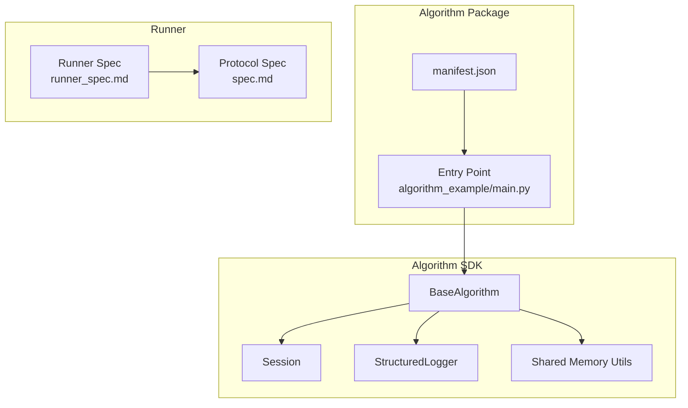
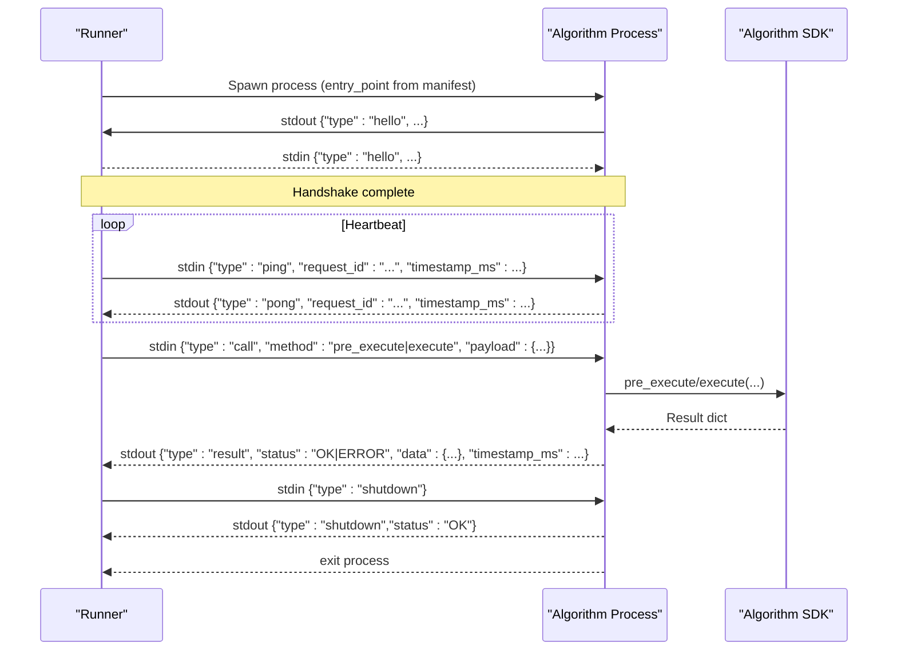
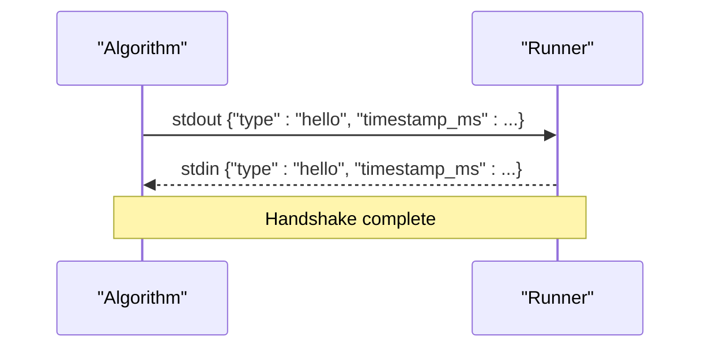
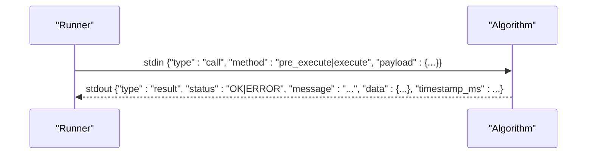
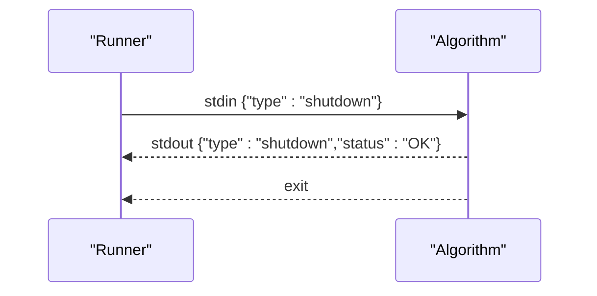
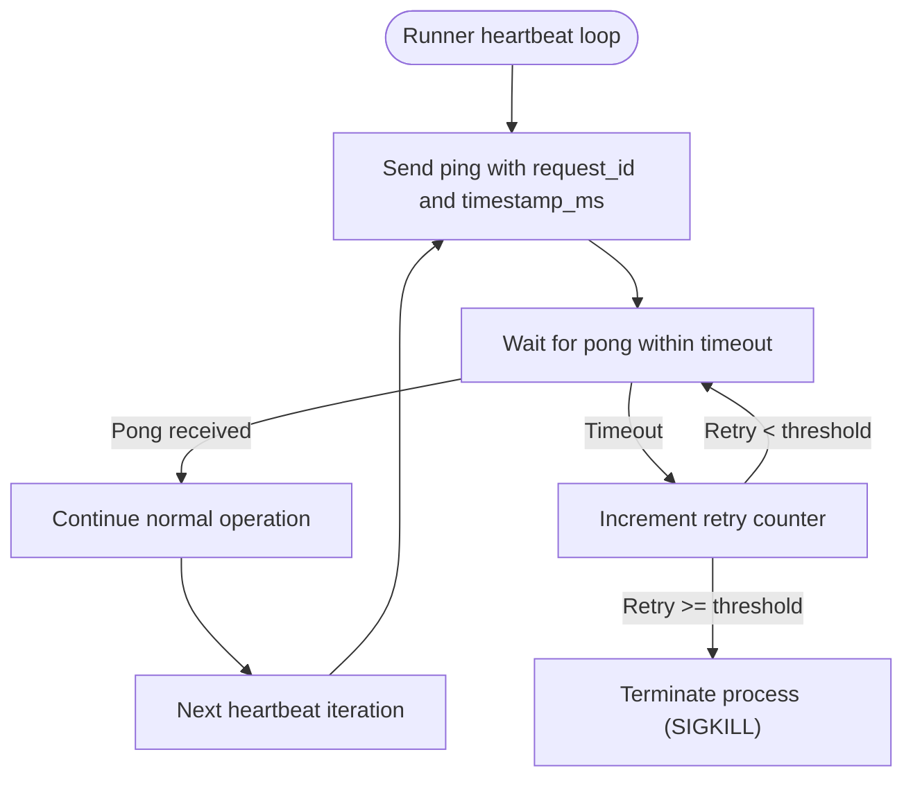
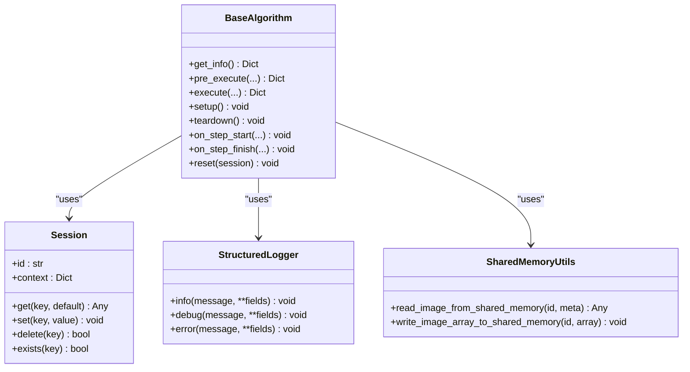

# Protocol Communication

<cite>
**Referenced Files in This Document**
- [spec.md](file://spec.md)
- [runner_spec.md](file://runner_spec.md)
- [README.md](file://README.md)
- [procvision_algorithm_sdk/__init__.py](file://procvision_algorithm_sdk/__init__.py)
- [procvision_algorithm_sdk/base.py](file://procvision_algorithm_sdk/base.py)
- [procvision_algorithm_sdk/session.py](file://procvision_algorithm_sdk/session.py)
- [procvision_algorithm_sdk/logger.py](file://procvision_algorithm_sdk/logger.py)
- [procvision_algorithm_sdk/shared_memory.py](file://procvision_algorithm_sdk/shared_memory.py)
- [procvision_algorithm_sdk/cli.py](file://procvision_algorithm_sdk/cli.py)
- [algorithm-example/manifest.json](file://algorithm-example/manifest.json)
- [algorithm-example/algorithm_example/main.py](file://algorithm-example/algorithm_example/main.py)
</cite>

## Table of Contents
1. [Introduction](#introduction)
2. [Project Structure](#project-structure)
3. [Core Components](#core-components)
4. [Architecture Overview](#architecture-overview)
5. [Detailed Component Analysis](#detailed-component-analysis)
6. [Dependency Analysis](#dependency-analysis)
7. [Performance Considerations](#performance-considerations)
8. [Troubleshooting Guide](#troubleshooting-guide)
9. [Conclusion](#conclusion)
10. [Appendices](#appendices)

## Introduction
This document describes the inter-process communication (IPC) protocol between the ProcVision platform’s Runner and algorithm SDK. The protocol uses bidirectional stdin/stdout streams with length-prefixed JSON frames. It defines message types (hello, call, result, ping, pong, shutdown), request correlation via request_id, and timestamp_ms synchronization. It also documents the handshake sequence, call/result frame structure, error handling semantics, and structured logging to stderr. References to payload schemas and timeout policies are drawn from spec.md and runner_spec.md.

## Project Structure
The SDK exposes core primitives used by algorithms and the Runner:
- BaseAlgorithm interface and lifecycle hooks
- Session for cross-step state sharing
- StructuredLogger for stderr logging
- Shared memory utilities for image transport
- CLI for validation and local simulation

**Diagram sources**
- [procvision_algorithm_sdk/__init__.py](file://procvision_algorithm_sdk/__init__.py#L1-L19)
- [procvision_algorithm_sdk/base.py](file://procvision_algorithm_sdk/base.py#L1-L58)
- [procvision_algorithm_sdk/session.py](file://procvision_algorithm_sdk/session.py#L1-L36)
- [procvision_algorithm_sdk/logger.py](file://procvision_algorithm_sdk/logger.py#L1-L24)
- [procvision_algorithm_sdk/shared_memory.py](file://procvision_algorithm_sdk/shared_memory.py#L1-L53)
- [runner_spec.md](file://runner_spec.md#L1-L28)
- [spec.md](file://spec.md#L615-L637)
- [algorithm-example/manifest.json](file://algorithm-example/manifest.json#L1-L25)
- [algorithm-example/algorithm_example/main.py](file://algorithm-example/algorithm_example/main.py#L1-L149)

**Section sources**
- [README.md](file://README.md#L1-L116)
- [procvision_algorithm_sdk/__init__.py](file://procvision_algorithm_sdk/__init__.py#L1-L19)

## Core Components
- BaseAlgorithm: Defines get_info, pre_execute, execute, and lifecycle hooks used by Runner to orchestrate calls.
- Session: Provides a lightweight, in-memory key-value store and context for cross-step state sharing.
- StructuredLogger: Emits structured JSON records to stderr with timestamp_ms and other fields.
- Shared Memory Utilities: Provide read/write helpers for images transported via shared memory identifiers and metadata.

Key protocol-related behaviors:
- Protocol framing: Length-prefixed JSON frames on stdin/stdout.
- Message types: hello, call, result, ping, pong, shutdown.
- Correlation: request_id used across frames.
- Timestamps: timestamp_ms included in frames.
- Handshake: Algorithm emits hello on startup; Runner replies hello.
- Heartbeat: Runner periodically sends ping; Algorithm must reply pong within timeout.
- Shutdown: Runner sends shutdown; Algorithm responds and exits.

**Section sources**
- [spec.md](file://spec.md#L615-L637)
- [runner_spec.md](file://runner_spec.md#L1-L28)
- [procvision_algorithm_sdk/base.py](file://procvision_algorithm_sdk/base.py#L1-L58)
- [procvision_algorithm_sdk/session.py](file://procvision_algorithm_sdk/session.py#L1-L36)
- [procvision_algorithm_sdk/logger.py](file://procvision_algorithm_sdk/logger.py#L1-L24)
- [procvision_algorithm_sdk/shared_memory.py](file://procvision_algorithm_sdk/shared_memory.py#L1-L53)

## Architecture Overview
The Runner manages algorithm processes and communicates via stdin/stdout. The algorithm implements BaseAlgorithm and uses SDK-provided utilities for logging and image access.

**Diagram sources**
- [runner_spec.md](file://runner_spec.md#L1-L28)
- [spec.md](file://spec.md#L615-L637)
- [algorithm-example/manifest.json](file://algorithm-example/manifest.json#L1-L25)
- [algorithm-example/algorithm_example/main.py](file://algorithm-example/algorithm_example/main.py#L1-L149)

## Detailed Component Analysis

### Protocol Frame Format and Message Types
- Framing: Each frame is a 4-byte big-endian length prefix followed by UTF-8 JSON.
- Message types:
  - hello: Startup handshake from algorithm to Runner and vice versa.
  - call: Runner requests pre_execute or execute with payload.
  - result: Algorithm response with status and data.
  - ping/pong: Heartbeat messages.
  - shutdown: Runner initiates graceful termination; algorithm responds and exits.
- Fields:
  - type: One of the above message types.
  - request_id: Correlates related frames.
  - timestamp_ms: Milliseconds since epoch.
  - method: pre_execute or execute (call).
  - payload: Call payload fields include step_index, pid, session, user_params, shared_mem_id, image_meta.
  - status: OK or ERROR at the top level of result frames.
  - message: Human-readable message (often for ERROR).
  - data: Business result payload.

**Section sources**
- [spec.md](file://spec.md#L615-L637)
- [runner_spec.md](file://runner_spec.md#L1-L28)

### Handshake Sequence
- Algorithm startup:
  - On process start, algorithm prints a hello frame to stdout.
- Runner response:
  - Runner waits for algorithm hello and replies hello to stdin.
- Pre-call restriction:
  - No business frames are accepted until handshake completes.

**Diagram sources**
- [runner_spec.md](file://runner_spec.md#L1-L28)
- [spec.md](file://spec.md#L615-L637)

**Section sources**
- [runner_spec.md](file://runner_spec.md#L1-L28)
- [spec.md](file://spec.md#L615-L637)

### Normal Call-Result Cycle
- Runner sends a call frame with method pre_execute or execute and payload containing:
  - step_index
  - pid
  - session (id and context)
  - user_params
  - shared_mem_id
  - image_meta
- Algorithm executes pre_execute or execute and returns a result frame:
  - status: OK or ERROR
  - message: Optional human-readable message (for ERROR)
  - data: Business payload (e.g., calibration_rects, result_status, defect_rects, position_rects, debug)

**Diagram sources**
- [runner_spec.md](file://runner_spec.md#L1-L28)
- [spec.md](file://spec.md#L615-L637)

**Section sources**
- [runner_spec.md](file://runner_spec.md#L1-L28)
- [spec.md](file://spec.md#L615-L637)

### Shutdown Sequence
- Runner sends shutdown frame.
- Algorithm responds with shutdown result and exits.

**Diagram sources**
- [runner_spec.md](file://runner_spec.md#L1-L28)
- [spec.md](file://spec.md#L634-L637)

**Section sources**
- [runner_spec.md](file://runner_spec.md#L1-L28)
- [spec.md](file://spec.md#L634-L637)

### Heartbeat and Timeout Policies
- Heartbeat interval: Runner periodically sends ping.
- Pong requirement: Algorithm must reply pong within a grace period.
- Timeout policy highlights:
  - Heartbeat timeout window and retry threshold.
  - Execute timeout and pre_execute timeout.
  - Graceful termination and forced termination windows.
- Runner behavior includes logging warnings, retries, and process termination strategies.

**Diagram sources**
- [runner_spec.md](file://runner_spec.md#L1-L28)
- [spec.md](file://spec.md#L678-L689)

**Section sources**
- [runner_spec.md](file://runner_spec.md#L1-L28)
- [spec.md](file://spec.md#L678-L689)

### Request Correlation and Timestamp Synchronization
- request_id: Used to correlate related frames across the lifecycle.
- timestamp_ms: Included in frames to synchronize timestamps across Runner and Algorithm.

**Section sources**
- [spec.md](file://spec.md#L615-L637)
- [runner_spec.md](file://runner_spec.md#L1-L28)

### Call Payload Structure
- Fields in call.payload:
  - step_index
  - pid
  - session (id and context)
  - user_params
  - shared_mem_id
  - image_meta

Runner injects these fields into each call. Algorithms consume them to prepare and execute detection logic.

**Section sources**
- [runner_spec.md](file://runner_spec.md#L1-L28)
- [spec.md](file://spec.md#L615-L637)

### Result Frame Semantics
- Top-level fields:
  - status: OK or ERROR
  - message: Present when ERROR
  - data: Business payload
- Pre-execute:
  - May return calibration_rects and debug info; does not return business result_status.
- Execute:
  - Returns business result_status (OK or NG), optional ng_reason, defect_rects, position_rects, and debug fields.

**Section sources**
- [runner_spec.md](file://runner_spec.md#L1-L28)
- [spec.md](file://spec.md#L615-L637)

### Error Handling via Status='ERROR'
- Algorithms must return status='ERROR' in result frames rather than raising exceptions.
- message should describe the error condition.
- error_code may be included for standardized classification.

**Section sources**
- [spec.md](file://spec.md#L615-L637)
- [runner_spec.md](file://runner_spec.md#L1-L28)

### Structured Logging to stderr
- Algorithms must log only protocol frames to stdout.
- All logs must go to stderr via StructuredLogger.
- Records include level, timestamp_ms, and other fields.

**Section sources**
- [spec.md](file://spec.md#L634-L637)
- [procvision_algorithm_sdk/logger.py](file://procvision_algorithm_sdk/logger.py#L1-L24)

### Example Algorithm Behavior
- The example algorithm demonstrates:
  - Using BaseAlgorithm lifecycle hooks
  - Reading images from shared memory
  - Returning structured results with status and data
  - Emitting logs via logger

**Section sources**
- [algorithm-example/algorithm_example/main.py](file://algorithm-example/algorithm_example/main.py#L1-L149)
- [algorithm-example/manifest.json](file://algorithm-example/manifest.json#L1-L25)

## Dependency Analysis
The SDK composes the core building blocks used by algorithms and the Runner.

**Diagram sources**
- [procvision_algorithm_sdk/base.py](file://procvision_algorithm_sdk/base.py#L1-L58)
- [procvision_algorithm_sdk/session.py](file://procvision_algorithm_sdk/session.py#L1-L36)
- [procvision_algorithm_sdk/logger.py](file://procvision_algorithm_sdk/logger.py#L1-L24)
- [procvision_algorithm_sdk/shared_memory.py](file://procvision_algorithm_sdk/shared_memory.py#L1-L53)

**Section sources**
- [procvision_algorithm_sdk/__init__.py](file://procvision_algorithm_sdk/__init__.py#L1-L19)
- [procvision_algorithm_sdk/base.py](file://procvision_algorithm_sdk/base.py#L1-L58)
- [procvision_algorithm_sdk/session.py](file://procvision_algorithm_sdk/session.py#L1-L36)
- [procvision_algorithm_sdk/logger.py](file://procvision_algorithm_sdk/logger.py#L1-L24)
- [procvision_algorithm_sdk/shared_memory.py](file://procvision_algorithm_sdk/shared_memory.py#L1-L53)

## Performance Considerations
- Keep heartbeats responsive: pong must be sent promptly to avoid timeouts.
- Minimize blocking in pre_execute/execute; offload heavy work to background threads if necessary.
- Avoid large payloads in result.data; keep image_meta minimal and rely on shared memory for images.
- Use structured logging sparingly; excessive stderr writes can impact throughput.

## Troubleshooting Guide
Common issues and remedies:
- Protocol framing errors:
  - Ensure frames are length-prefixed JSON and properly encoded.
- Handshake failures:
  - Verify algorithm hello is emitted on stdout and Runner hello is received on stdin.
- Heartbeat timeouts:
  - Confirm pong replies arrive within the configured timeout window.
- Excessive stderr noise:
  - Ensure only protocol frames are printed to stdout; all logs go to stderr via StructuredLogger.
- Call payload mismatches:
  - Validate presence of step_index, pid, session, user_params, shared_mem_id, image_meta in call frames.
- Result status anomalies:
  - For pre_execute, do not return business result_status; for execute, ensure result_status and required fields are present when NG.

**Section sources**
- [spec.md](file://spec.md#L615-L637)
- [runner_spec.md](file://runner_spec.md#L1-L28)
- [procvision_algorithm_sdk/logger.py](file://procvision_algorithm_sdk/logger.py#L1-L24)

## Conclusion
The ProcVision IPC protocol is a robust, length-prefixed JSON-based channel enabling reliable communication between Runner and algorithm processes. By adhering to the handshake, heartbeat, call/result semantics, and logging separation, algorithms integrate seamlessly with the platform while maintaining predictable performance and diagnostics.

## Appendices

### Appendix A: Message Type Reference
- hello: Startup handshake frames.
- call: Invocation frames with method and payload.
- result: Response frames with status and data.
- ping/pong: Heartbeat frames.
- shutdown: Termination frames.

**Section sources**
- [spec.md](file://spec.md#L615-L637)
- [runner_spec.md](file://runner_spec.md#L1-L28)

### Appendix B: Example Algorithm Entry Point
- The example algorithm demonstrates the SDK usage and expected return structures.

**Section sources**
- [algorithm-example/manifest.json](file://algorithm-example/manifest.json#L1-L25)
- [algorithm-example/algorithm_example/main.py](file://algorithm-example/algorithm_example/main.py#L1-L149)