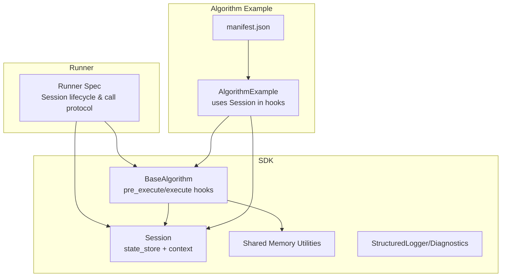
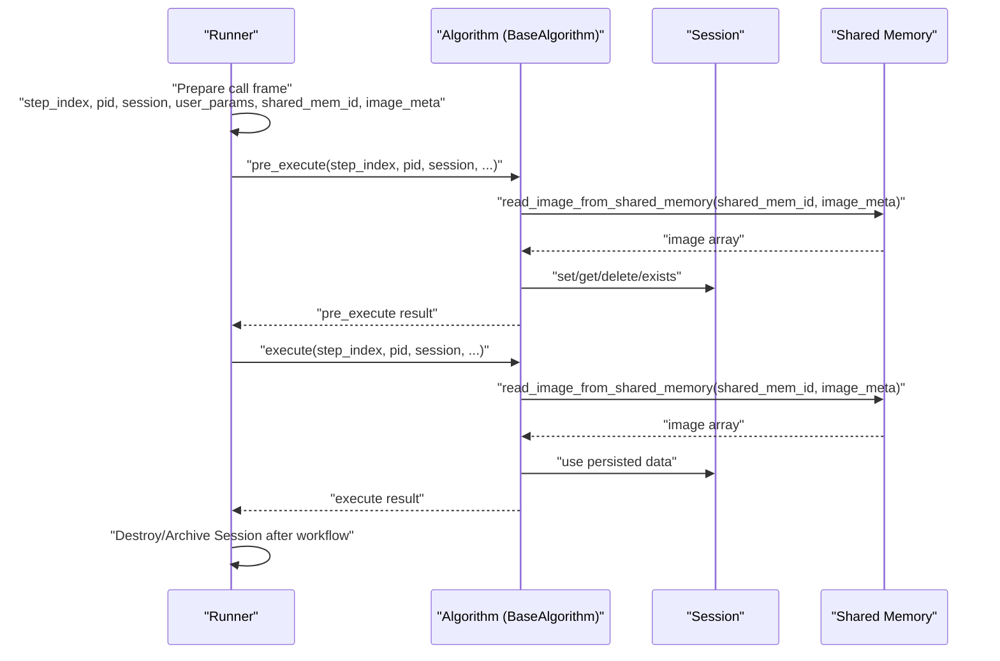
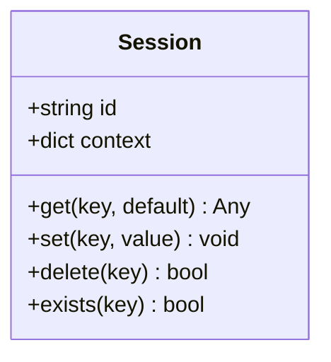
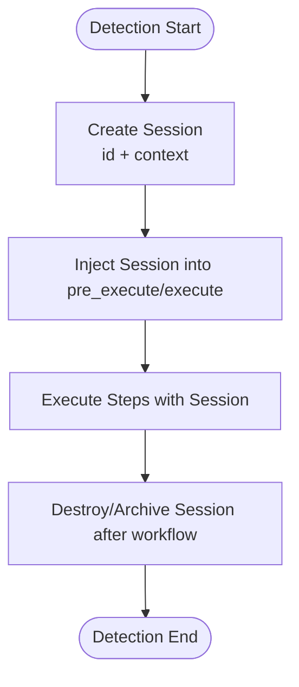
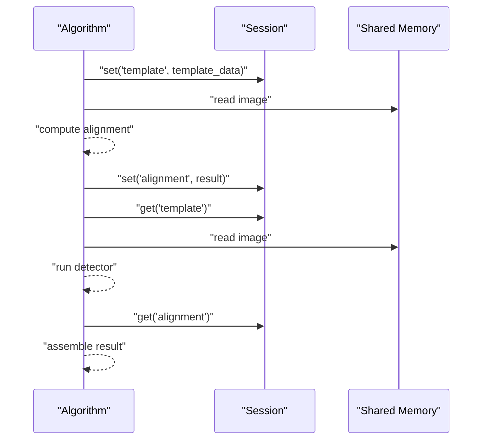
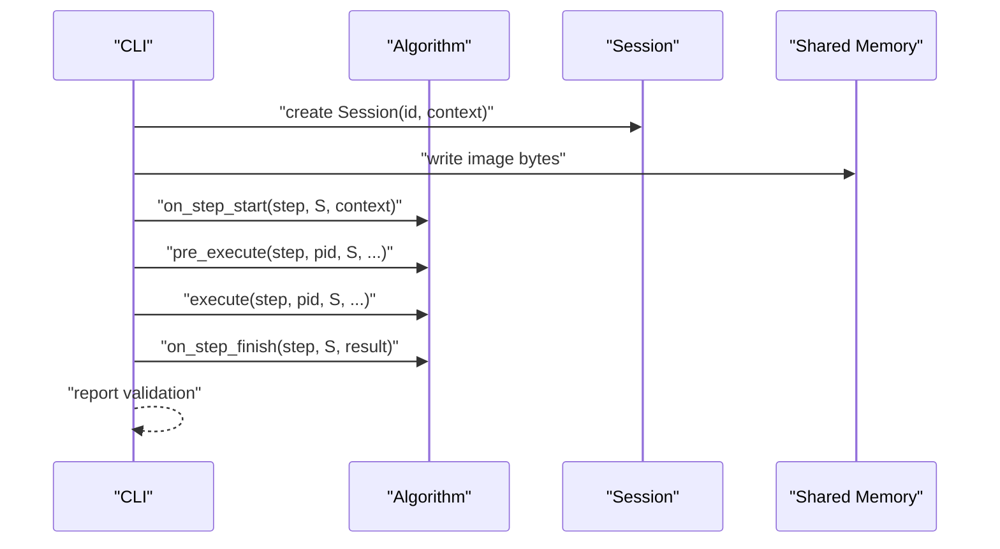
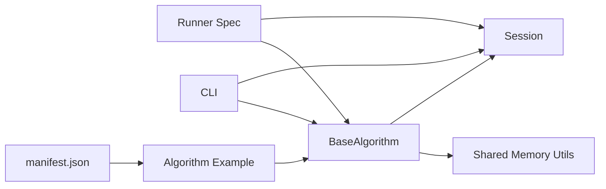

# State Persistence and Session Management

<cite>
**Referenced Files in This Document**
- [session.py](file://procvision_algorithm_sdk/session.py)
- [base.py](file://procvision_algorithm_sdk/base.py)
- [cli.py](file://procvision_algorithm_sdk/cli.py)
- [shared_memory.py](file://procvision_algorithm_sdk/shared_memory.py)
- [__init__.py](file://procvision_algorithm_sdk/__init__.py)
- [runner_spec.md](file://runner_spec.md)
- [spec.md](file://spec.md)
- [test_session.py](file://tests/test_session.py)
- [main.py](file://algorithm-example/algorithm_example/main.py)
- [manifest.json](file://algorithm-example/manifest.json)
</cite>

## Table of Contents
1. [Introduction](#introduction)
2. [Project Structure](#project-structure)
3. [Core Components](#core-components)
4. [Architecture Overview](#architecture-overview)
5. [Detailed Component Analysis](#detailed-component-analysis)
6. [Dependency Analysis](#dependency-analysis)
7. [Performance Considerations](#performance-considerations)
8. [Troubleshooting Guide](#troubleshooting-guide)
9. [Conclusion](#conclusion)
10. [Appendices](#appendices)

## Introduction
This document explains how state persistence is achieved through Session objects in the ProcVision Algorithm SDK. It details how the Runner creates a Session with a unique id and context (product_code, operator, trace_id) at the beginning of a detection workflow and passes it through all pre_execute and execute calls. It also documents the Session’s internal state_store for JSON-serializable key-value data, accessible via get/set/delete/exists, and its role in maintaining state across algorithm steps. The lifecycle of a Session is described from creation to destruction after workflow completion, emphasizing its single-detection scope and in-memory storage constraints. Finally, it illustrates how Session enables step-to-step coordination, such as template passing from pre_execute to execute, and provides sequence diagrams for Session creation, data mutation across steps, and cleanup.

## Project Structure
The SDK exposes the Session API and integrates with the BaseAlgorithm interface. The Runner specification defines how Sessions are created and managed during a detection workflow. The CLI demonstrates Session usage in a development context and validates algorithm behavior against the Session contract.

**Diagram sources**
- [session.py](file://procvision_algorithm_sdk/session.py#L1-L36)
- [base.py](file://procvision_algorithm_sdk/base.py#L1-L58)
- [runner_spec.md](file://runner_spec.md#L1-L283)
- [main.py](file://algorithm-example/algorithm_example/main.py#L1-L150)
- [manifest.json](file://algorithm-example/manifest.json#L1-L25)

**Section sources**
- [session.py](file://procvision_algorithm_sdk/session.py#L1-L36)
- [base.py](file://procvision_algorithm_sdk/base.py#L1-L58)
- [runner_spec.md](file://runner_spec.md#L1-L283)
- [spec.md](file://spec.md#L1-L799)

## Core Components
- Session: Encapsulates a unique id and a JSON-serializable state_store for cross-step data sharing. It also holds a context dictionary (product_code, operator, trace_id, etc.) and exposes get/set/delete/exists APIs. See [Session class](file://procvision_algorithm_sdk/session.py#L1-L36).
- BaseAlgorithm: Defines the algorithm interface and lifecycle hooks. The Runner injects Session into pre_execute and execute calls. See [BaseAlgorithm](file://procvision_algorithm_sdk/base.py#L1-L58).
- Runner Spec: Defines the call protocol and Session lifecycle. See [Runner Spec](file://runner_spec.md#L1-L283).
- Shared Memory Utilities: Provide read/write helpers for images used in algorithm steps. See [shared_memory.py](file://procvision_algorithm_sdk/shared_memory.py#L1-L53).
- CLI: Demonstrates Session usage in development and validates algorithm behavior. See [cli.py](file://procvision_algorithm_sdk/cli.py#L1-L615).

**Section sources**
- [session.py](file://procvision_algorithm_sdk/session.py#L1-L36)
- [base.py](file://procvision_algorithm_sdk/base.py#L1-L58)
- [runner_spec.md](file://runner_spec.md#L1-L283)
- [shared_memory.py](file://procvision_algorithm_sdk/shared_memory.py#L1-L53)
- [cli.py](file://procvision_algorithm_sdk/cli.py#L1-L615)

## Architecture Overview
The Runner orchestrates a detection workflow and manages Session instances per detection. The Session is created at the start of a detection and passed through each step boundary. The algorithm uses Session to persist small, JSON-serializable artifacts across steps, enabling coordinated behavior such as template passing from pre_execute to execute.

**Diagram sources**
- [runner_spec.md](file://runner_spec.md#L1-L283)
- [base.py](file://procvision_algorithm_sdk/base.py#L1-L58)
- [session.py](file://procvision_algorithm_sdk/session.py#L1-L36)
- [shared_memory.py](file://procvision_algorithm_sdk/shared_memory.py#L1-L53)

## Detailed Component Analysis

### Session API and State Store
- Purpose: Provide a lightweight, in-memory, JSON-serializable key-value store scoped to a single detection workflow. It also carries immutable context metadata.
- Key capabilities:
  - Unique id for identification
  - Context copy for read-only access
  - get(key, default)
  - set(key, value) with JSON serialization validation
  - delete(key) returns boolean
  - exists(key)
- Constraints:
  - Values must be JSON serializable; otherwise, a TypeError is raised.
  - Designed for small payloads (<100KB recommended).
  - Lifetime is bound to a single detection; data does not persist across detections.

**Diagram sources**
- [session.py](file://procvision_algorithm_sdk/session.py#L1-L36)

**Section sources**
- [session.py](file://procvision_algorithm_sdk/session.py#L1-L36)
- [spec.md](file://spec.md#L1-L799)
- [test_session.py](file://tests/test_session.py#L1-L24)

### Runner Responsibilities for Session Lifecycle
- Creation: The Runner constructs a Session with a unique id and a context containing product_code, operator, and trace_id for each detection.
- Injection: The Runner injects the Session into pre_execute and execute calls.
- Lifecycle: The Runner binds Session to a single detection workflow and destroys or archives it after completion.
- Protocol: The Runner communicates call frames with session, user_params, shared_mem_id, and image_meta.

**Diagram sources**
- [runner_spec.md](file://runner_spec.md#L1-L283)

**Section sources**
- [runner_spec.md](file://runner_spec.md#L1-L283)

### Algorithm Hooks and Step Coordination via Session
- BaseAlgorithm exposes hooks that receive the Session instance:
  - on_step_start(step_index, session, context)
  - on_step_finish(step_index, session, result)
  - reset(session)
- Algorithms can use Session to coordinate data between steps, for example:
  - Store computed templates in pre_execute
  - Retrieve templates in execute
  - Track counters or timing metrics across steps

**Diagram sources**
- [base.py](file://procvision_algorithm_sdk/base.py#L1-L58)
- [session.py](file://procvision_algorithm_sdk/session.py#L1-L36)
- [shared_memory.py](file://procvision_algorithm_sdk/shared_memory.py#L1-L53)

**Section sources**
- [base.py](file://procvision_algorithm_sdk/base.py#L1-L58)
- [main.py](file://algorithm-example/algorithm_example/main.py#L1-L150)

### CLI Usage and Validation with Session
- The CLI demonstrates Session usage in a development context:
  - Creates a Session with id and context
  - Writes image bytes to shared memory
  - Calls on_step_start, pre_execute, execute, on_step_finish
  - Validates return structures and supported_pids match
- This validates that algorithms correctly integrate with Session and the call protocol.

**Diagram sources**
- [cli.py](file://procvision_algorithm_sdk/cli.py#L1-L615)
- [session.py](file://procvision_algorithm_sdk/session.py#L1-L36)
- [shared_memory.py](file://procvision_algorithm_sdk/shared_memory.py#L1-L53)

**Section sources**
- [cli.py](file://procvision_algorithm_sdk/cli.py#L1-L615)
- [test_session.py](file://tests/test_session.py#L1-L24)

## Dependency Analysis
- BaseAlgorithm depends on Session for stateful coordination across steps.
- Session is used by algorithms in pre_execute and execute, and by hooks for timing and diagnostics.
- Runner supplies Session to algorithms via the call protocol.
- Shared Memory utilities are used by algorithms to read images for computation.

**Diagram sources**
- [runner_spec.md](file://runner_spec.md#L1-L283)
- [base.py](file://procvision_algorithm_sdk/base.py#L1-L58)
- [session.py](file://procvision_algorithm_sdk/session.py#L1-L36)
- [shared_memory.py](file://procvision_algorithm_sdk/shared_memory.py#L1-L53)
- [cli.py](file://procvision_algorithm_sdk/cli.py#L1-L615)
- [main.py](file://algorithm-example/algorithm_example/main.py#L1-L150)
- [manifest.json](file://algorithm-example/manifest.json#L1-L25)

**Section sources**
- [__init__.py](file://procvision_algorithm_sdk/__init__.py#L1-L20)
- [base.py](file://procvision_algorithm_sdk/base.py#L1-L58)
- [session.py](file://procvision_algorithm_sdk/session.py#L1-L36)
- [shared_memory.py](file://procvision_algorithm_sdk/shared_memory.py#L1-L53)
- [cli.py](file://procvision_algorithm_sdk/cli.py#L1-L615)

## Performance Considerations
- Session is designed for small payloads (<100KB recommended). Avoid storing large binary artifacts in state_store.
- JSON serialization validation occurs on set; ensure values are JSON serializable to prevent runtime errors.
- Use context for immutable metadata (product_code, operator, trace_id) rather than duplicating in state_store.
- Keep state_store keys minimal and descriptive to reduce overhead and improve readability.

[No sources needed since this section provides general guidance]

## Troubleshooting Guide
Common issues and resolutions:
- Non-JSON-serializable values in set:
  - Symptom: TypeError raised when setting a value.
  - Resolution: Ensure values are JSON serializable (str, int, float, list, dict, bool, None).
  - Reference: [Session.set validation](file://procvision_algorithm_sdk/session.py#L1-L36)
- Missing or invalid context:
  - Symptom: Accessing context fields yields unexpected results.
  - Resolution: Verify Runner supplies context with product_code, operator, trace_id.
  - Reference: [Runner Spec context injection](file://runner_spec.md#L1-L283)
- Session not persisted across detections:
  - Symptom: Data disappears after workflow completion.
  - Resolution: Understand Session is per-detection; persist larger artifacts in algorithm instance attributes if needed.
  - Reference: [Session lifecycle constraints](file://spec.md#L1-L799)
- Hook misuse:
  - Symptom: Timing or diagnostic data missing.
  - Resolution: Use on_step_start/on_step_finish to record timestamps and publish diagnostics via Diagnostics.
  - Reference: [BaseAlgorithm hooks](file://procvision_algorithm_sdk/base.py#L1-L58), [Algorithm Example](file://algorithm-example/algorithm_example/main.py#L1-L150)

**Section sources**
- [session.py](file://procvision_algorithm_sdk/session.py#L1-L36)
- [runner_spec.md](file://runner_spec.md#L1-L283)
- [spec.md](file://spec.md#L1-L799)
- [base.py](file://procvision_algorithm_sdk/base.py#L1-L58)
- [main.py](file://algorithm-example/algorithm_example/main.py#L1-L150)

## Conclusion
Session provides a simple yet powerful mechanism for state persistence across algorithm steps within a single detection workflow. By constraining data to JSON-serializable, small payloads and scoping lifetime to a single detection, Session enables clean coordination between pre_execute and execute while keeping the system predictable and efficient. The Runner’s explicit lifecycle management ensures Session is created, injected, and destroyed according to the protocol, and the CLI and example algorithm demonstrate correct usage patterns.

[No sources needed since this section summarizes without analyzing specific files]

## Appendices

### Session API Reference
- id: Unique identifier for the Session.
- context: Copy of immutable metadata (e.g., product_code, operator, trace_id).
- get(key, default): Retrieve value or default.
- set(key, value): Store value; raises TypeError if not JSON serializable.
- delete(key): Remove key; returns True if removed.
- exists(key): Check presence of key.

**Section sources**
- [session.py](file://procvision_algorithm_sdk/session.py#L1-L36)
- [spec.md](file://spec.md#L1-L799)

### Runner Call Protocol and Session Injection
- The Runner constructs a Session with id and context and injects it into pre_execute and execute calls along with user_params, shared_mem_id, and image_meta.
- The Runner manages Session lifecycle per detection and destroys or archives it after workflow completion.

**Section sources**
- [runner_spec.md](file://runner_spec.md#L1-L283)