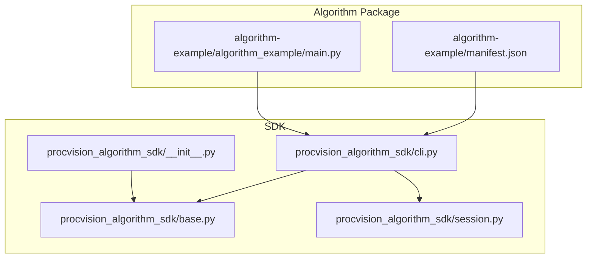
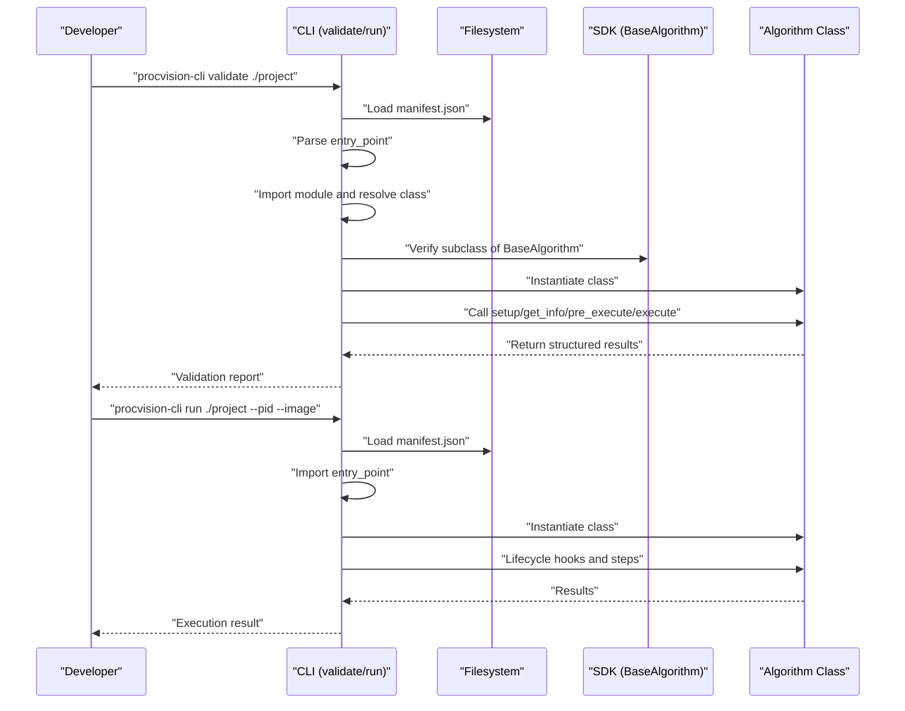
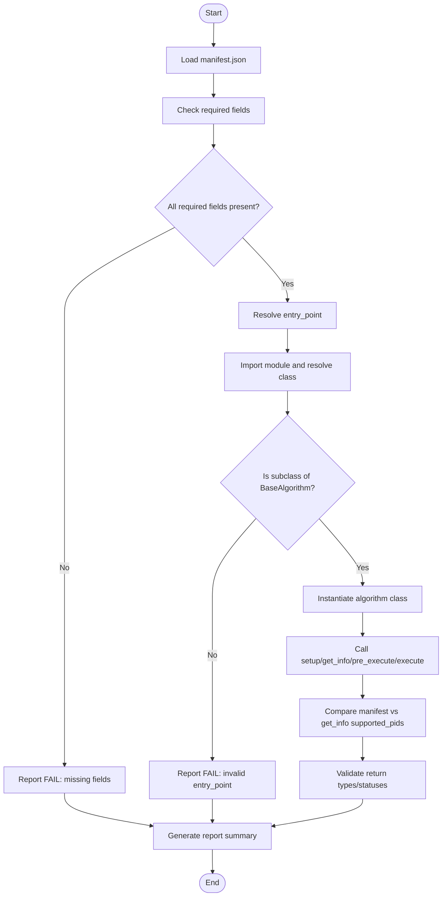
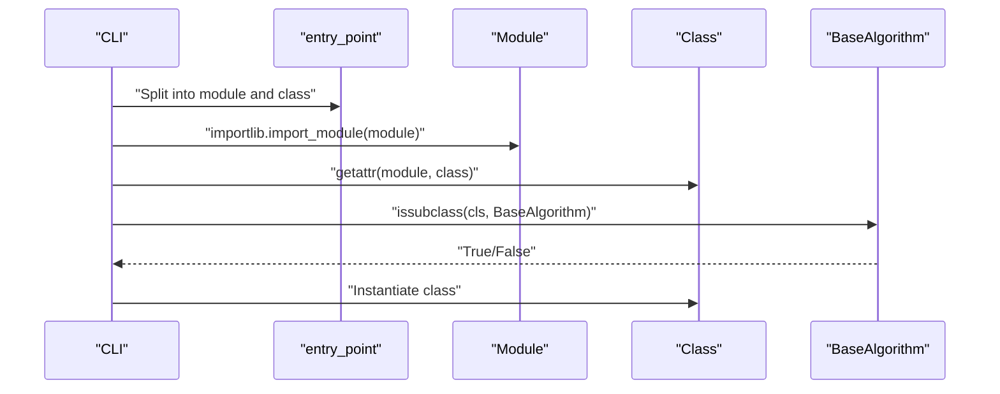
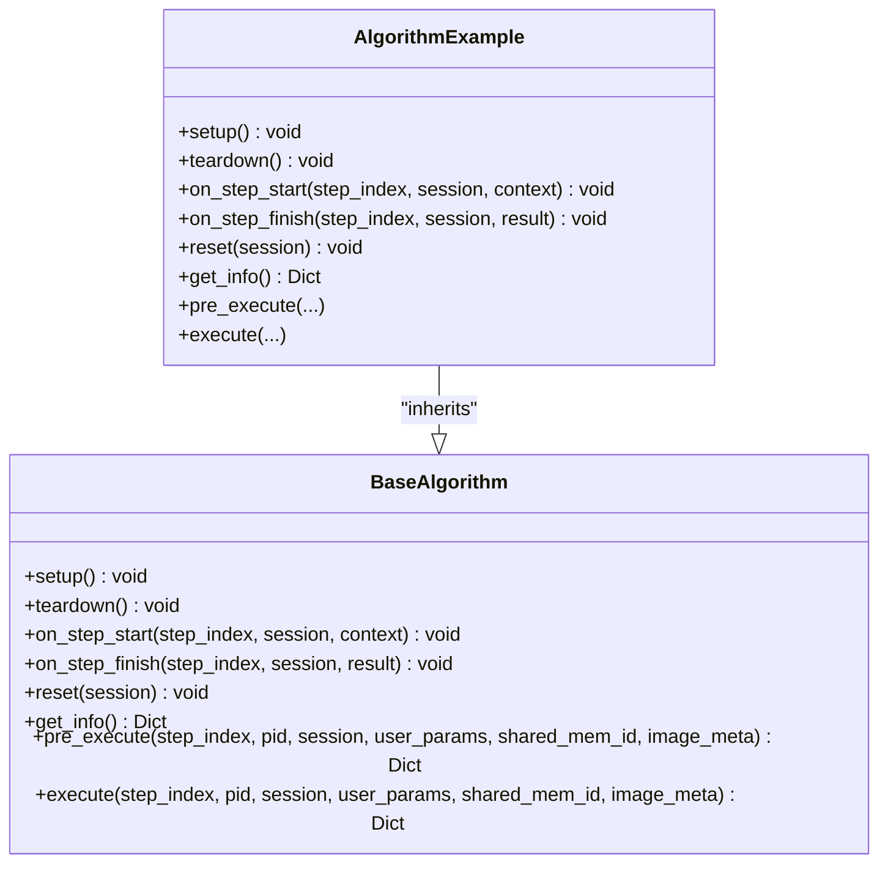
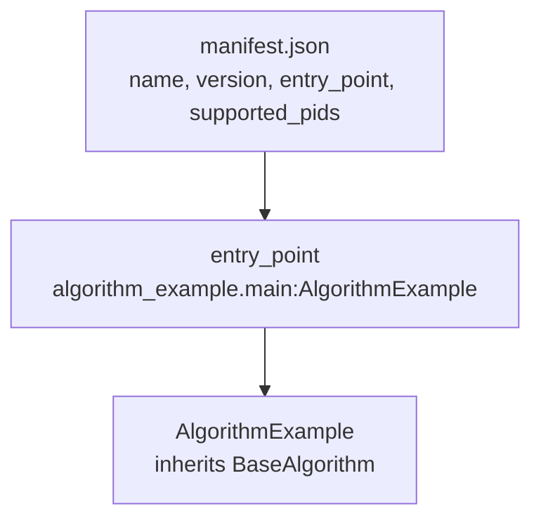
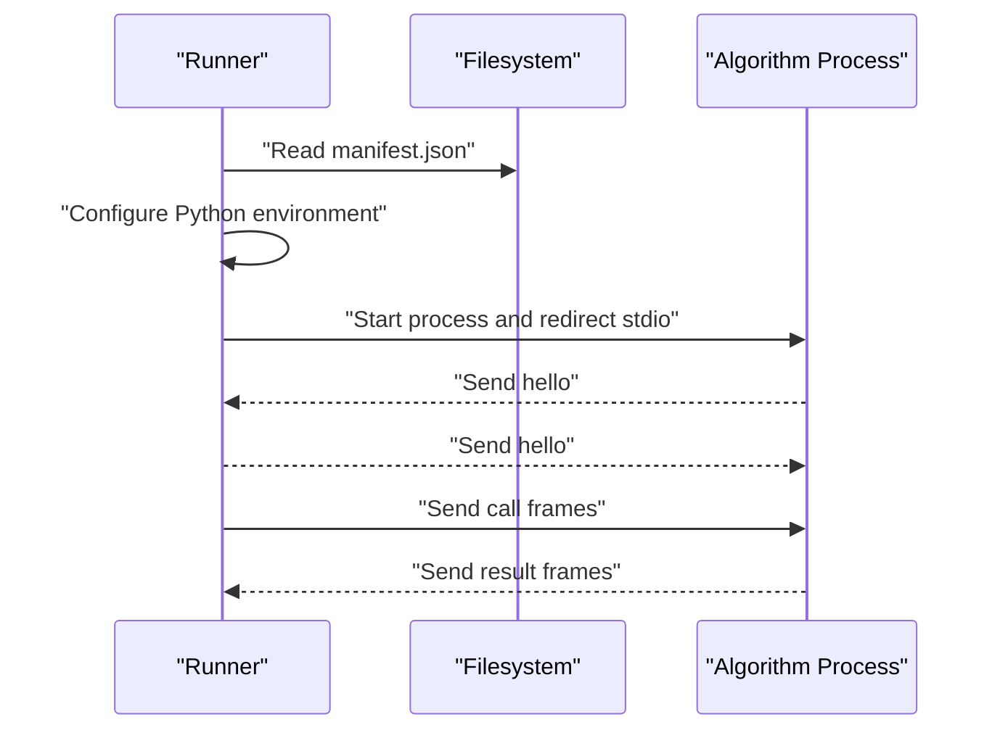
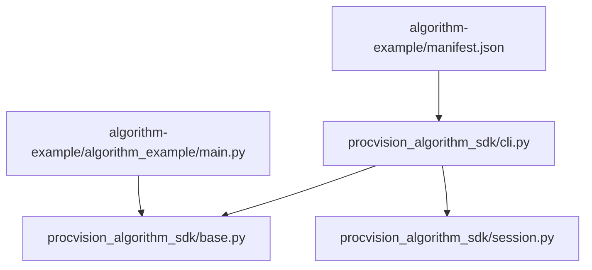

# Algorithm Discovery via Manifest

<cite>
**Referenced Files in This Document**
- [README.md](file://README.md)
- [spec.md](file://spec.md)
- [spec_runner.md](file://spec_runner.md)
- [procvision_algorithm_sdk/cli.py](file://procvision_algorithm_sdk/cli.py)
- [procvision_algorithm_sdk/base.py](file://procvision_algorithm_sdk/base.py)
- [procvision_algorithm_sdk/session.py](file://procvision_algorithm_sdk/session.py)
- [procvision_algorithm_sdk/__init__.py](file://procvision_algorithm_sdk/__init__.py)
- [algorithm-example/manifest.json](file://algorithm-example/manifest.json)
- [algorithm-example/algorithm_example/main.py](file://algorithm-example/algorithm_example/main.py)
- [algorithm_dev_tutorial.md](file://algorithm_dev_tutorial.md)
</cite>

## Table of Contents
1. [Introduction](#introduction)
2. [Project Structure](#project-structure)
3. [Core Components](#core-components)
4. [Architecture Overview](#architecture-overview)
5. [Detailed Component Analysis](#detailed-component-analysis)
6. [Dependency Analysis](#dependency-analysis)
7. [Performance Considerations](#performance-considerations)
8. [Troubleshooting Guide](#troubleshooting-guide)
9. [Conclusion](#conclusion)
10. [Appendices](#appendices)

## Introduction
This document explains how the Runner discovers and loads algorithm packages using the manifest.json file. The manifest declares the algorithm’s name, version, entry_point, and supported_pids. The entry_point field enables dynamic class instantiation, which is validated to ensure it resolves to a class inheriting from BaseAlgorithm. We also describe the validation performed during development and packaging, and how these constraints affect discovery and runtime behavior.

## Project Structure
The repository organizes algorithm packages under a dedicated example and the SDK under procvision_algorithm_sdk. The CLI provides discovery and validation logic, while the example demonstrates a valid manifest and implementation.

**Diagram sources**
- [procvision_algorithm_sdk/cli.py](file://procvision_algorithm_sdk/cli.py#L1-L120)
- [procvision_algorithm_sdk/base.py](file://procvision_algorithm_sdk/base.py#L1-L58)
- [procvision_algorithm_sdk/session.py](file://procvision_algorithm_sdk/session.py#L1-L36)
- [procvision_algorithm_sdk/__init__.py](file://procvision_algorithm_sdk/__init__.py#L1-L20)
- [algorithm-example/manifest.json](file://algorithm-example/manifest.json#L1-L25)
- [algorithm-example/algorithm_example/main.py](file://algorithm-example/algorithm_example/main.py#L1-L150)

**Section sources**
- [README.md](file://README.md#L1-L116)
- [algorithm-example/manifest.json](file://algorithm-example/manifest.json#L1-L25)
- [algorithm-example/algorithm_example/main.py](file://algorithm-example/algorithm_example/main.py#L1-L150)
- [procvision_algorithm_sdk/cli.py](file://procvision_algorithm_sdk/cli.py#L1-L120)
- [procvision_algorithm_sdk/base.py](file://procvision_algorithm_sdk/base.py#L1-L58)
- [procvision_algorithm_sdk/session.py](file://procvision_algorithm_sdk/session.py#L1-L36)
- [procvision_algorithm_sdk/__init__.py](file://procvision_algorithm_sdk/__init__.py#L1-L20)

## Core Components
- Manifest discovery and validation:
  - The CLI reads manifest.json and validates required fields and entry_point resolution.
  - It verifies that the resolved class inherits from BaseAlgorithm and performs smoke execution checks against get_info(), supported_pids, and basic API contracts.
- Dynamic class instantiation:
  - The entry_point is split into module and class parts and imported dynamically.
- BaseAlgorithm contract:
  - The SDK defines lifecycle hooks and abstract methods that algorithm implementations must fulfill.
- Session and shared memory:
  - The SDK provides Session and shared memory helpers used by algorithms during pre_execute and execute.

Key responsibilities:
- Discovery: Load manifest.json, parse entry_point, import and validate the class.
- Validation: Verify manifest fields, class inheritance, and basic API behavior.
- Execution: Instantiate the algorithm class and orchestrate lifecycle hooks and steps.

**Section sources**
- [procvision_algorithm_sdk/cli.py](file://procvision_algorithm_sdk/cli.py#L35-L124)
- [procvision_algorithm_sdk/cli.py](file://procvision_algorithm_sdk/cli.py#L163-L210)
- [procvision_algorithm_sdk/base.py](file://procvision_algorithm_sdk/base.py#L1-L58)
- [procvision_algorithm_sdk/session.py](file://procvision_algorithm_sdk/session.py#L1-L36)

## Architecture Overview
The discovery and loading pipeline consists of two primary flows: development-time validation and production-time loading.

**Diagram sources**
- [procvision_algorithm_sdk/cli.py](file://procvision_algorithm_sdk/cli.py#L35-L124)
- [procvision_algorithm_sdk/cli.py](file://procvision_algorithm_sdk/cli.py#L163-L210)
- [procvision_algorithm_sdk/base.py](file://procvision_algorithm_sdk/base.py#L1-L58)

## Detailed Component Analysis

### Manifest Discovery and Validation
- Manifest loading:
  - The CLI loads manifest.json from the project directory or an alternate path if provided.
  - It validates presence and parses JSON.
- Required fields:
  - The CLI checks for name, version, entry_point, and supported_pids.
- Entry_point resolution:
  - The entry_point is split into module and class parts and dynamically imported.
  - The resolved class must inherit from BaseAlgorithm.
- Smoke execution checks:
  - After successful import, the CLI instantiates the class and exercises lifecycle hooks and API methods.
  - It compares supported_pids from manifest and get_info().
  - It validates return types and statuses for pre_execute and execute.

**Diagram sources**
- [procvision_algorithm_sdk/cli.py](file://procvision_algorithm_sdk/cli.py#L35-L124)
- [procvision_algorithm_sdk/cli.py](file://procvision_algorithm_sdk/cli.py#L163-L210)

**Section sources**
- [procvision_algorithm_sdk/cli.py](file://procvision_algorithm_sdk/cli.py#L35-L124)
- [procvision_algorithm_sdk/cli.py](file://procvision_algorithm_sdk/cli.py#L163-L210)

### Dynamic Class Instantiation via entry_point
- The entry_point field encodes the module path and class name separated by a colon.
- The CLI splits the entry_point and dynamically imports the module, then retrieves the class by name.
- The resolved class is validated to inherit from BaseAlgorithm before use.

**Diagram sources**
- [procvision_algorithm_sdk/cli.py](file://procvision_algorithm_sdk/cli.py#L22-L33)
- [procvision_algorithm_sdk/cli.py](file://procvision_algorithm_sdk/cli.py#L64-L73)
- [procvision_algorithm_sdk/base.py](file://procvision_algorithm_sdk/base.py#L1-L58)

**Section sources**
- [procvision_algorithm_sdk/cli.py](file://procvision_algorithm_sdk/cli.py#L22-L33)
- [procvision_algorithm_sdk/cli.py](file://procvision_algorithm_sdk/cli.py#L64-L73)

### BaseAlgorithm Contract and Lifecycle
- BaseAlgorithm defines lifecycle hooks and abstract methods that algorithms must implement.
- The CLI smoke test exercises these methods to ensure compliance with the SDK contract.

**Diagram sources**
- [procvision_algorithm_sdk/base.py](file://procvision_algorithm_sdk/base.py#L1-L58)
- [algorithm-example/algorithm_example/main.py](file://algorithm-example/algorithm_example/main.py#L1-L150)

**Section sources**
- [procvision_algorithm_sdk/base.py](file://procvision_algorithm_sdk/base.py#L1-L58)
- [algorithm-example/algorithm_example/main.py](file://algorithm-example/algorithm_example/main.py#L1-L150)

### Example Algorithm Implementation
- The example algorithm implements BaseAlgorithm and adheres to the SDK contract.
- Its manifest declares supported_pids and entry_point pointing to the example class.

**Diagram sources**
- [algorithm-example/manifest.json](file://algorithm-example/manifest.json#L1-L25)
- [algorithm-example/algorithm_example/main.py](file://algorithm-example/algorithm_example/main.py#L1-L150)

**Section sources**
- [algorithm-example/manifest.json](file://algorithm-example/manifest.json#L1-L25)
- [algorithm-example/algorithm_example/main.py](file://algorithm-example/algorithm_example/main.py#L1-L150)

### Runner Integration and Production Loading
- The Runner reads manifest.json to obtain entry_point and dependencies.
- It configures the Python interpreter environment and starts the algorithm process.
- The Runner expects the algorithm to handshake and then executes steps via protocol frames.

**Diagram sources**
- [spec_runner.md](file://spec_runner.md#L34-L80)

**Section sources**
- [spec_runner.md](file://spec_runner.md#L1-L120)

## Dependency Analysis
- CLI depends on BaseAlgorithm to validate that the resolved class conforms to the SDK contract.
- The CLI imports the algorithm module via entry_point and inspects the class.
- The example algorithm depends on BaseAlgorithm and Session from the SDK.

**Diagram sources**
- [procvision_algorithm_sdk/cli.py](file://procvision_algorithm_sdk/cli.py#L1-L120)
- [procvision_algorithm_sdk/base.py](file://procvision_algorithm_sdk/base.py#L1-L58)
- [procvision_algorithm_sdk/session.py](file://procvision_algorithm_sdk/session.py#L1-L36)
- [algorithm-example/manifest.json](file://algorithm-example/manifest.json#L1-L25)
- [algorithm-example/algorithm_example/main.py](file://algorithm-example/algorithm_example/main.py#L1-L150)

**Section sources**
- [procvision_algorithm_sdk/cli.py](file://procvision_algorithm_sdk/cli.py#L1-L120)
- [procvision_algorithm_sdk/base.py](file://procvision_algorithm_sdk/base.py#L1-L58)
- [procvision_algorithm_sdk/session.py](file://procvision_algorithm_sdk/session.py#L1-L36)
- [algorithm-example/manifest.json](file://algorithm-example/manifest.json#L1-L25)
- [algorithm-example/algorithm_example/main.py](file://algorithm-example/algorithm_example/main.py#L1-L150)

## Performance Considerations
- Dynamic import overhead is minimal compared to algorithm execution time.
- The CLI performs lightweight smoke checks; full performance testing should be done in production environments with the Runner.
- Keep supported_pids lists concise to simplify initialization and reduce configuration overhead.

[No sources needed since this section provides general guidance]

## Troubleshooting Guide
Common issues and resolutions:
- Missing manifest.json:
  - The CLI reports failure if manifest.json is not found.
- Malformed manifest:
  - Missing required fields cause validation failures.
- Invalid entry_point:
  - If entry_point does not resolve to a class or the class is not a subclass of BaseAlgorithm, validation fails.
- Mismatched supported_pids:
  - The CLI compares manifest.supported_pids with get_info().supported_pids and reports mismatches.
- Incorrect return types/statuses:
  - pre_execute and execute must return dictionaries with valid status values; the CLI validates these.

Operational tips:
- Use the CLI validate command to catch issues early.
- Ensure the algorithm class inherits from BaseAlgorithm and implements all required methods.
- Keep entry_point consistent with the module layout and class name.

**Section sources**
- [procvision_algorithm_sdk/cli.py](file://procvision_algorithm_sdk/cli.py#L35-L124)
- [procvision_algorithm_sdk/cli.py](file://procvision_algorithm_sdk/cli.py#L163-L210)
- [algorithm_dev_tutorial.md](file://algorithm_dev_tutorial.md#L33-L54)

## Conclusion
The algorithm discovery mechanism centers on manifest.json and the entry_point field. The CLI validates the manifest, resolves the entry_point to a class, and ensures it inherits from BaseAlgorithm. During development, the CLI performs smoke tests to confirm API compliance and supported_pids consistency. In production, the Runner reads the manifest to configure and launch algorithm processes. Adhering to the SDK contract and manifest constraints guarantees reliable discovery and execution.

[No sources needed since this section summarizes without analyzing specific files]

## Appendices

### Manifest Field Constraints and Naming
- Required fields: name, version, entry_point, supported_pids.
- supported_pids must match get_info().supported_pids.
- The entry_point must resolve to a class inheriting from BaseAlgorithm.
- Versioning and naming constraints are defined in spec.md.

**Section sources**
- [procvision_algorithm_sdk/cli.py](file://procvision_algorithm_sdk/cli.py#L60-L73)
- [spec.md](file://spec.md#L1-L200)
- [algorithm_dev_tutorial.md](file://algorithm_dev_tutorial.md#L33-L54)

### Example Manifest and Implementation
- Correct manifest:
  - Declares name, version, entry_point, supported_pids, and steps.
- Correct implementation:
  - Inherits from BaseAlgorithm and implements required methods.

**Section sources**
- [algorithm-example/manifest.json](file://algorithm-example/manifest.json#L1-L25)
- [algorithm-example/algorithm_example/main.py](file://algorithm-example/algorithm_example/main.py#L1-L150)