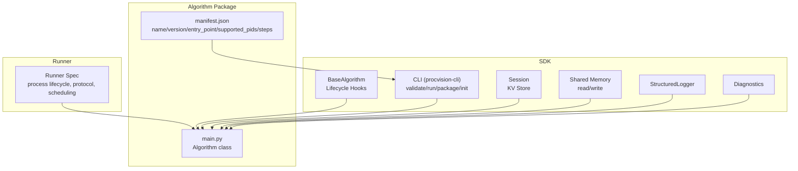
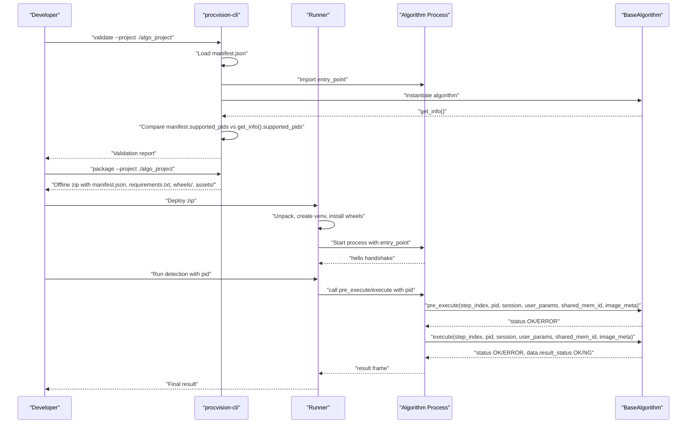
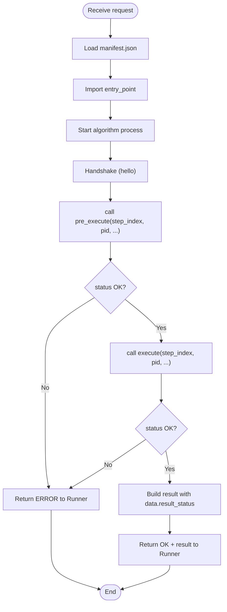
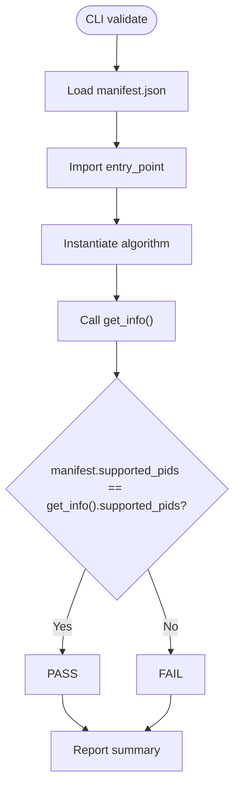
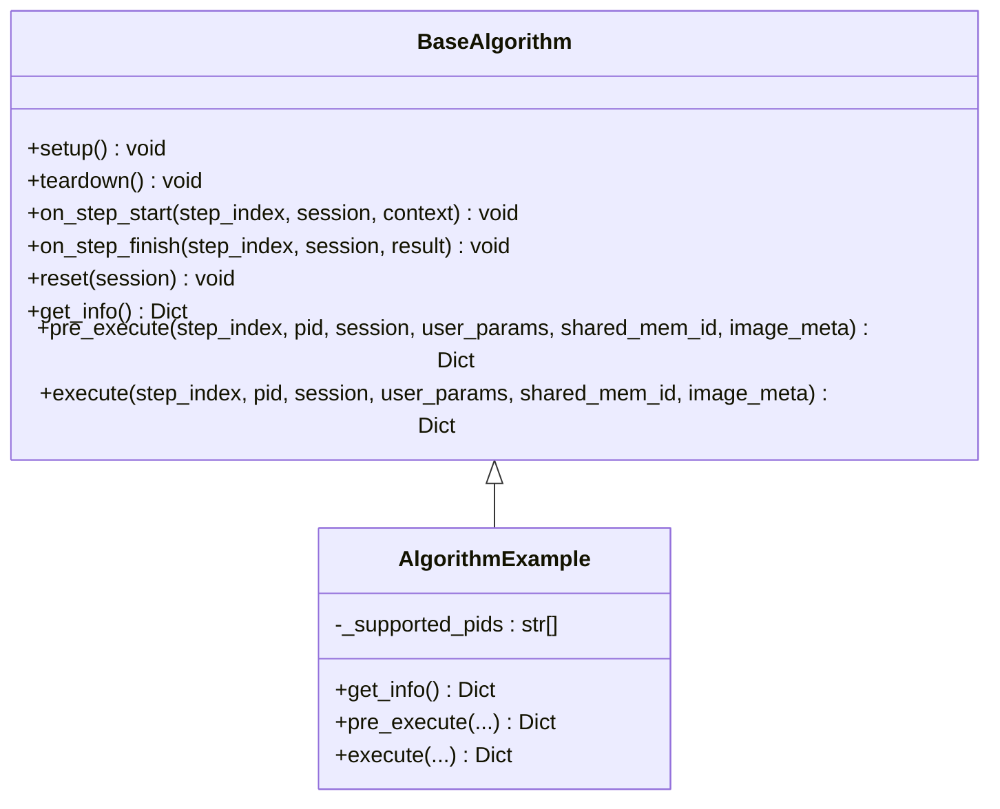
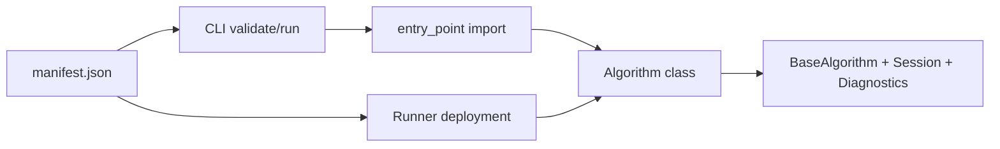

# Configuration-Driven Integration

<cite>
**Referenced Files in This Document**
- [README.md](file://README.md)
- [spec.md](file://spec.md)
- [spec_architecture_review.md](file://spec_architecture_review.md)
- [runner_spec.md](file://runner_spec.md)
- [procvision_algorithm_sdk/base.py](file://procvision_algorithm_sdk/base.py)
- [procvision_algorithm_sdk/cli.py](file://procvision_algorithm_sdk/cli.py)
- [algorithm-example/manifest.json](file://algorithm-example/manifest.json)
- [algorithm-example/algorithm_example/main.py](file://algorithm-example/algorithm_example/main.py)
- [algorithm_dev_tutorial.md](file://algorithm_dev_tutorial.md)
- [docs/design-intent.md](file://docs/design-intent.md)
</cite>

## Table of Contents
1. [Introduction](#introduction)
2. [Project Structure](#project-structure)
3. [Core Components](#core-components)
4. [Architecture Overview](#architecture-overview)
5. [Detailed Component Analysis](#detailed-component-analysis)
6. [Dependency Analysis](#dependency-analysis)
7. [Performance Considerations](#performance-considerations)
8. [Troubleshooting Guide](#troubleshooting-guide)
9. [Conclusion](#conclusion)
10. [Appendices](#appendices)

## Introduction
This document explains the configuration-driven integration pattern centered on manifest.json. It details how the manifest enables dynamic algorithm discovery and routing, how the Runner validates and loads algorithms, and how the SDK enforces consistency between manifest declarations and runtime behavior. It also documents the required_assets field for per-PID resource requirements and provides examples for single-PID and multi-PID algorithms.

## Project Structure
The repository organizes the SDK, example algorithm, specification documents, and CLI tooling that collectively implement the configuration-driven integration:

- SDK core: BaseAlgorithm interface, lifecycle hooks, logging, diagnostics, session, and shared memory utilities
- CLI: Validation, local simulation, packaging, and scaffolding
- Example algorithm: Minimal runnable example with manifest.json and main.py
- Specifications: SDK interface contract, Runner behavior, and architecture review

**Diagram sources**
- [procvision_algorithm_sdk/base.py](file://procvision_algorithm_sdk/base.py#L1-L58)
- [procvision_algorithm_sdk/cli.py](file://procvision_algorithm_sdk/cli.py#L1-L200)
- [algorithm-example/manifest.json](file://algorithm-example/manifest.json#L1-L25)
- [algorithm-example/algorithm_example/main.py](file://algorithm-example/algorithm_example/main.py#L1-L150)
- [runner_spec.md](file://runner_spec.md#L1-L120)

**Section sources**
- [README.md](file://README.md#L1-L116)
- [procvision_algorithm_sdk/base.py](file://procvision_algorithm_sdk/base.py#L1-L58)
- [procvision_algorithm_sdk/cli.py](file://procvision_algorithm_sdk/cli.py#L1-L200)
- [algorithm-example/manifest.json](file://algorithm-example/manifest.json#L1-L25)
- [algorithm-example/algorithm_example/main.py](file://algorithm-example/algorithm_example/main.py#L1-L150)
- [runner_spec.md](file://runner_spec.md#L1-L120)

## Core Components
- manifest.json: Declares algorithm identity, entry_point, supported product IDs, and optional steps schema. It also introduces required_assets for per-PID resource requirements.
- BaseAlgorithm: Defines the algorithm interface and lifecycle hooks. The get_info() method must return metadata consistent with manifest.json.
- CLI (procvision-cli): Validates manifests, runs algorithms locally, packages offline distributions, and initializes scaffolding.
- Runner: Loads algorithms via entry_point, manages processes, communicates via stdin/stdout, and routes requests by PID.

Key integration points:
- Dynamic discovery: Runner scans zipped packages, validates manifest.json, and deploys isolated environments.
- Routing: Runner injects pid into pre_execute/execute; algorithm validates pid against supported_pids.
- Consistency: CLI validates that manifest.supported_pids equals get_info().supported_pids.

**Section sources**
- [spec.md](file://spec.md#L1-L120)
- [procvision_algorithm_sdk/base.py](file://procvision_algorithm_sdk/base.py#L1-L58)
- [procvision_algorithm_sdk/cli.py](file://procvision_algorithm_sdk/cli.py#L35-L100)
- [runner_spec.md](file://runner_spec.md#L60-L120)

## Architecture Overview
The configuration-driven integration follows a manifest-first discovery and deployment pipeline:

**Diagram sources**
- [procvision_algorithm_sdk/cli.py](file://procvision_algorithm_sdk/cli.py#L35-L145)
- [runner_spec.md](file://runner_spec.md#L60-L120)
- [procvision_algorithm_sdk/base.py](file://procvision_algorithm_sdk/base.py#L1-L58)
- [algorithm-example/algorithm_example/main.py](file://algorithm-example/algorithm_example/main.py#L1-L150)

## Detailed Component Analysis

### Manifest.json: Dynamic Discovery and Routing
- Fields:
  - name, version: Algorithm identity
  - entry_point: Module path and class name to instantiate
  - supported_pids: Product IDs supported by this package
  - steps: Optional step definitions and parameter schemas
  - required_assets: Optional per-PID resource mapping (models, configs, templates)
- Purpose:
  - Discovery: Runner identifies algorithm packages and validates structure
  - Routing: Runner passes pid to algorithm; algorithm validates pid against supported_pids
  - Resource allocation: required_assets declares per-PID resource requirements

Examples:
- Single-PID algorithm manifest: [algorithm-example/manifest.json](file://algorithm-example/manifest.json#L1-L25)
- Multi-PID algorithm manifest: [algorithm-example/manifest.json](file://algorithm-example/manifest.json#L1-L25)

Validation:
- CLI validate ensures presence of required fields and imports entry_point successfully.
- CLI validate compares manifest.supported_pids with get_info().supported_pids.

**Section sources**
- [algorithm-example/manifest.json](file://algorithm-example/manifest.json#L1-L25)
- [procvision_algorithm_sdk/cli.py](file://procvision_algorithm_sdk/cli.py#L35-L100)
- [spec.md](file://spec.md#L1-L120)

### Runner Lifecycle and PID Routing
- Process lifecycle: Runner starts algorithm via entry_point, maintains heartbeat, and manages graceful shutdown.
- Execution model: Runner injects pid, session, user_params, shared_mem_id, image_meta, and step_index into pre_execute/execute calls.
- Routing: Runner routes by pid; algorithm validates pid against supported_pids during pre_execute/execute.

**Diagram sources**
- [runner_spec.md](file://runner_spec.md#L60-L120)
- [procvision_algorithm_sdk/base.py](file://procvision_algorithm_sdk/base.py#L1-L58)

**Section sources**
- [runner_spec.md](file://runner_spec.md#L60-L120)
- [procvision_algorithm_sdk/base.py](file://procvision_algorithm_sdk/base.py#L1-L58)

### Validation: supported_pids Consistency
- At development time: CLI validate imports the entry_point, instantiates the algorithm, calls get_info(), and compares manifest.supported_pids with get_info().supported_pids.
- At production time: Runner validates manifest.json during package installation and ensures supported_pids match the algorithm’s declared capabilities.

**Diagram sources**
- [procvision_algorithm_sdk/cli.py](file://procvision_algorithm_sdk/cli.py#L64-L100)

**Section sources**
- [procvision_algorithm_sdk/cli.py](file://procvision_algorithm_sdk/cli.py#L35-L100)
- [spec.md](file://spec.md#L1-L120)

### required_assets: Per-PID Resource Requirements
- Purpose: Declare per-PID resource requirements (models, configs, templates) so algorithms can load appropriate assets at runtime.
- Behavior: Algorithms should load resources based on pid and required_assets; Runner may use this to pre-warm or stage assets.
- Best practice: Use setup() to resolve and cache per-PID assets; keep heavy resources in setup/teardown to minimize per-call overhead.

**Section sources**
- [spec.md](file://spec.md#L1-L120)
- [docs/design-intent.md](file://docs/design-intent.md#L1-L105)

### Algorithm Implementation Pattern
- Implement BaseAlgorithm with get_info(), pre_execute(), execute().
- Validate pid inside pre_execute()/execute() against self._supported_pids or manifest-declared supported_pids.
- Use Session for cross-step state, Diagnostics for metrics, and StructuredLogger for structured logs.

**Diagram sources**
- [procvision_algorithm_sdk/base.py](file://procvision_algorithm_sdk/base.py#L1-L58)
- [algorithm-example/algorithm_example/main.py](file://algorithm-example/algorithm_example/main.py#L1-L150)

**Section sources**
- [procvision_algorithm_sdk/base.py](file://procvision_algorithm_sdk/base.py#L1-L58)
- [algorithm-example/algorithm_example/main.py](file://algorithm-example/algorithm_example/main.py#L1-L150)

### Examples: Single-PID and Multi-PID Algorithms
- Single-PID example: [algorithm-example/manifest.json](file://algorithm-example/manifest.json#L1-L25)
- Multi-PID example: [algorithm-example/manifest.json](file://algorithm-example/manifest.json#L1-L25)

Best practices:
- Keep supported_pids small and explicit
- Use steps to define parameter schemas for UI configuration
- Ensure get_info().supported_pids matches manifest.json

**Section sources**
- [algorithm-example/manifest.json](file://algorithm-example/manifest.json#L1-L25)
- [algorithm_dev_tutorial.md](file://algorithm_dev_tutorial.md#L1-L120)

## Dependency Analysis
- Algorithm depends on SDK interfaces (BaseAlgorithm, Session, Diagnostics, StructuredLogger).
- CLI depends on manifest.json and entry_point to validate and run algorithms.
- Runner depends on manifest.json to discover and deploy algorithms, and on entry_point to start processes.

**Diagram sources**
- [procvision_algorithm_sdk/cli.py](file://procvision_algorithm_sdk/cli.py#L35-L100)
- [runner_spec.md](file://runner_spec.md#L60-L120)
- [procvision_algorithm_sdk/base.py](file://procvision_algorithm_sdk/base.py#L1-L58)

**Section sources**
- [procvision_algorithm_sdk/cli.py](file://procvision_algorithm_sdk/cli.py#L35-L100)
- [runner_spec.md](file://runner_spec.md#L60-L120)
- [procvision_algorithm_sdk/base.py](file://procvision_algorithm_sdk/base.py#L1-L58)

## Performance Considerations
- Keep supported_pids bounded (recommended ≤ 20) to simplify management and reduce initialization overhead.
- Move heavy resource loading to setup() to avoid repeated initialization per call.
- Use Diagnostics and StructuredLogger to monitor latency and resource usage; limit defect_rects and message lengths to optimize UI rendering and logging volume.

[No sources needed since this section provides general guidance]

## Troubleshooting Guide
Common issues and resolutions:
- supported_pids mismatch: Ensure manifest.json.supported_pids equals get_info().supported_pids. Use CLI validate to catch mismatches early.
- PID not supported: Algorithms should return an error response with a clear message and error_code when pid is not in supported_pids.
- Image loading failures: Verify image_meta fields and shared memory availability; ensure image_meta includes width, height, timestamp_ms, camera_id.
- Heartbeat/timeout problems: Confirm algorithm replies to ping within the allowed grace window; avoid blocking operations in pre_execute/execute.

**Section sources**
- [procvision_algorithm_sdk/cli.py](file://procvision_algorithm_sdk/cli.py#L64-L145)
- [runner_spec.md](file://runner_spec.md#L1-L120)
- [spec.md](file://spec.md#L1-L120)

## Conclusion
The configuration-driven integration pattern centers on manifest.json to declare algorithm identity, entry_point, supported product IDs, and optional per-PID resources. The Runner uses manifest.json for discovery and deployment, while the SDK enforces consistency between manifest declarations and algorithm behavior. By validating supported_pids and leveraging required_assets, teams can achieve flexible, scalable, and maintainable algorithm deployments.

[No sources needed since this section summarizes without analyzing specific files]

## Appendices

### Appendix A: Manifest.json Field Reference
- name: Algorithm name
- version: Semantic version
- entry_point: "module_path:ClassName"
- supported_pids: List of product IDs
- steps: Optional step definitions with parameter schemas
- required_assets: Optional per-PID resource mapping

**Section sources**
- [algorithm-example/manifest.json](file://algorithm-example/manifest.json#L1-L25)
- [spec.md](file://spec.md#L1-L120)

### Appendix B: Architecture Review Notes
- The architecture review highlights that manifest.json and SDK behavior must align; discrepancies between manifest configuration and runtime behavior have been resolved in the current spec.

**Section sources**
- [spec_architecture_review.md](file://spec_architecture_review.md#L1-L120)