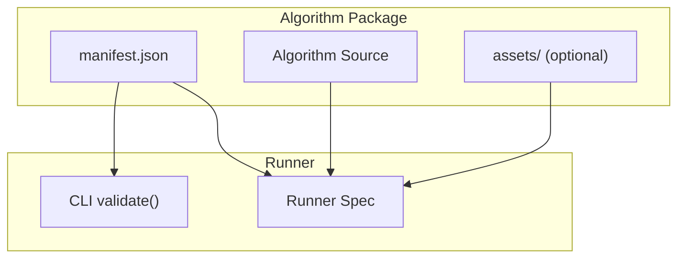
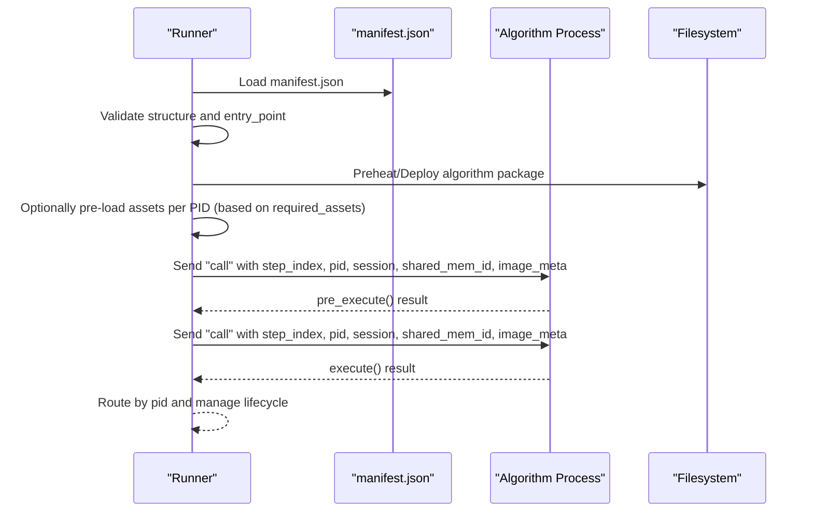
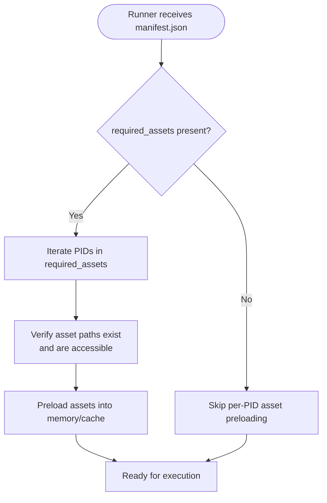
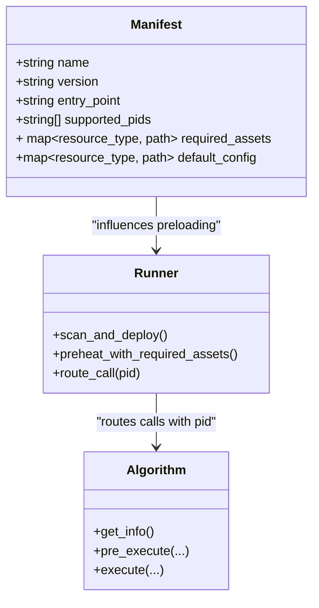
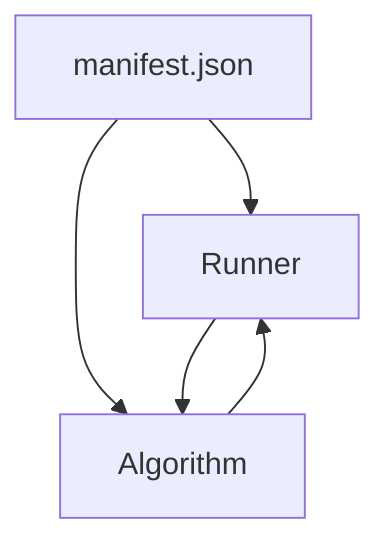

# Declaring Resource Requirements with required_assets

<cite>
**Referenced Files in This Document**
- [spec.md](file://spec.md)
- [runner_spec.md](file://runner_spec.md)
- [algorithm-example/manifest.json](file://algorithm-example/manifest.json)
- [procvision_algorithm_sdk/cli.py](file://procvision_algorithm_sdk/cli.py)
- [docs/design-intent.md](file://docs/design-intent.md)
</cite>

## Table of Contents
1. [Introduction](#introduction)
2. [Project Structure](#project-structure)
3. [Core Components](#core-components)
4. [Architecture Overview](#architecture-overview)
5. [Detailed Component Analysis](#detailed-component-analysis)
6. [Dependency Analysis](#dependency-analysis)
7. [Performance Considerations](#performance-considerations)
8. [Troubleshooting Guide](#troubleshooting-guide)
9. [Conclusion](#conclusion)
10. [Appendices](#appendices)

## Introduction
This document explains how algorithms declare per-PID resource requirements using the required_assets field in manifest.json. The Runner uses this field to pre-load or verify assets before execution, preventing runtime errors caused by missing models or calibration data. The v0.2.0 update introduced required_assets to support multi-PID algorithms with different model versions or configurations per product.

## Project Structure
The repository contains:
- Specification documents that define the manifest schema and Runner behavior
- An example algorithm manifest.json
- A CLI that validates manifests and smoke-tests algorithm behavior
- Design intent documentation that outlines the rationale for required_assets

**Diagram sources**
- [spec.md](file://spec.md#L1928-L1960)
- [runner_spec.md](file://runner_spec.md#L1-L120)
- [procvision_algorithm_sdk/cli.py](file://procvision_algorithm_sdk/cli.py#L35-L62)

**Section sources**
- [spec.md](file://spec.md#L1928-L1960)
- [runner_spec.md](file://runner_spec.md#L1-L120)
- [procvision_algorithm_sdk/cli.py](file://procvision_algorithm_sdk/cli.py#L35-L62)

## Core Components
- required_assets: A new optional field in manifest.json that declares per-PID resource requirements. It enables the Runner to pre-load or verify assets before execution.
- Runner lifecycle: The Runner scans packages, validates structure, deploys, and preheats processes. It injects pid and session during pre_execute/execute calls.
- CLI validation: The CLI loads manifest.json, imports the entry_point class, and runs a smoke test to ensure get_info(), pre_execute(), and execute() behave as expected.

Key points:
- required_assets is optional; if absent, the Runner assumes no per-PID assets are declared.
- supported_pids must match get_info()’s supported_pids.
- The Runner uses supported_pids to route calls and can leverage required_assets to prepare resources.

**Section sources**
- [spec.md](file://spec.md#L20-L39)
- [spec.md](file://spec.md#L1928-L1960)
- [runner_spec.md](file://runner_spec.md#L1-L120)
- [procvision_algorithm_sdk/cli.py](file://procvision_algorithm_sdk/cli.py#L35-L62)

## Architecture Overview
The Runner orchestrates algorithm execution. It reads manifest.json, validates the algorithm package, and prepares resources based on required_assets. At runtime, it passes pid to pre_execute/execute so the algorithm can dynamically select the correct configuration/model.

**Diagram sources**
- [runner_spec.md](file://runner_spec.md#L1-L120)
- [spec.md](file://spec.md#L1928-L1960)

## Detailed Component Analysis

### required_assets Field Definition and Purpose
- Introduced in v0.2.0, required_assets is an optional mapping from pid to a resource map. This allows declaring per-PID assets such as model files, calibration data, templates, or other algorithm-specific files.
- The Runner can use required_assets to pre-load or verify assets before execution, reducing runtime failures due to missing resources.
- default_config is also available to provide fallback resources when a specific pid is not declared in required_assets.

Expected structure:
- required_assets: {pid: {resource_type: path}}
- default_config: optional fallback resource map

Examples of prevention:
- If a PID requires a specific model file, the Runner can verify its presence during preheating. If missing, the Runner reports an error before any detection call, avoiding a model_not_found error during execute().
- If a PID needs calibration data, the Runner can load it once per PID to avoid repeated I/O during steps.

**Section sources**
- [spec.md](file://spec.md#L20-L39)
- [spec.md](file://spec.md#L1928-L1960)
- [docs/design-intent.md](file://docs/design-intent.md#L23-L23)
- [docs/design-intent.md](file://docs/design-intent.md#L90-L90)

### How Runner Uses required_assets
- During deployment and preheating, the Runner inspects required_assets to determine which assets to pre-load or verify.
- At runtime, when a pid is provided, the Runner routes the call to the appropriate algorithm process and ensures the correct resources are available for that pid.
- If required_assets is missing, the Runner proceeds without per-PID asset preparation.

**Diagram sources**
- [runner_spec.md](file://runner_spec.md#L1-L120)
- [spec.md](file://spec.md#L1928-L1960)

### Multi-PID Algorithms with Different Model Versions
- v0.2.0 changed the design philosophy: algorithms no longer bind to a single pid in __init__. Instead, pid is passed to pre_execute/execute each time.
- required_assets enables per-PID model/version selection. The algorithm can then load the correct model or configuration based on pid.
- supported_pids must match get_info()’s supported_pids, and the Runner validates this.

**Diagram sources**
- [spec.md](file://spec.md#L20-L39)
- [spec.md](file://spec.md#L1928-L1960)
- [runner_spec.md](file://runner_spec.md#L1-L120)

### Example Algorithm Manifest (supported_pids)
While this manifest does not include required_assets, it demonstrates the supported_pids field and illustrates how Runner routes calls by pid.

**Section sources**
- [algorithm-example/manifest.json](file://algorithm-example/manifest.json#L1-L24)

### CLI Validation and Smoke Test
The CLI validate() function:
- Loads manifest.json
- Imports the entry_point class
- Calls get_info(), pre_execute(), and execute() to ensure basic behavior
- Validates supported_pids consistency between manifest and get_info()

This helps catch issues early, including missing fields and incorrect pid routing.

**Section sources**
- [procvision_algorithm_sdk/cli.py](file://procvision_algorithm_sdk/cli.py#L35-L62)
- [procvision_algorithm_sdk/cli.py](file://procvision_algorithm_sdk/cli.py#L405-L421)

## Dependency Analysis
- manifest.json depends on:
  - supported_pids for routing
  - required_assets for per-PID asset declarations
  - default_config for fallbacks
- Runner depends on manifest.json to:
  - validate structure and entry_point
  - pre-load or verify assets
  - route calls by pid
- Algorithm depends on:
  - supported_pids to validate incoming pid
  - required_assets indirectly via Runner’s preloading

**Diagram sources**
- [spec.md](file://spec.md#L1928-L1960)
- [runner_spec.md](file://runner_spec.md#L1-L120)
- [procvision_algorithm_sdk/cli.py](file://procvision_algorithm_sdk/cli.py#L35-L62)

**Section sources**
- [spec.md](file://spec.md#L1928-L1960)
- [runner_spec.md](file://runner_spec.md#L1-L120)
- [procvision_algorithm_sdk/cli.py](file://procvision_algorithm_sdk/cli.py#L35-L62)

## Performance Considerations
- Pre-loading per-PID assets reduces runtime I/O and improves latency.
- Keeping assets under assets/ and referencing them via required_assets avoids hardcoding absolute paths.
- Limit the number of supported_pids to keep initialization overhead manageable.

[No sources needed since this section provides general guidance]

## Troubleshooting Guide
Common issues and resolutions:
- missing required_assets: If assets are not declared, the Runner will not pre-load them. Add required_assets to manifest.json and ensure assets exist under assets/.
- mismatched pid: If a pid is not in supported_pids, pre_execute/execute should return an error with status ERROR and a human-readable message. Verify supported_pids in manifest.json and get_info().
- model_not_found: If a model file is missing, the Runner should detect this during preheating and surface an error before execute(). Ensure required_assets points to the correct path under assets/.

Runner error handling and error codes:
- The Runner defines standard error codes and categorizes recoverable vs fatal errors. Use these to guide retries and logging.

**Section sources**
- [spec.md](file://spec.md#L1789-L1789)
- [runner_spec.md](file://runner_spec.md#L180-L282)

## Conclusion
The required_assets field enables precise, per-PID resource declaration in manifest.json. Combined with Runner’s preloading and verification, it prevents runtime errors due to missing models or calibration data. The v0.2.0 update aligns with multi-PID support by decoupling pid from algorithm instances and allowing dynamic resource selection per pid.

[No sources needed since this section summarizes without analyzing specific files]

## Appendices

### Appendix A: Manifest Fields Related to Assets
- supported_pids: list of product identifiers the algorithm supports
- required_assets: optional mapping from pid to resource map
- default_config: optional fallback resource map

**Section sources**
- [spec.md](file://spec.md#L1928-L1960)
- [docs/design-intent.md](file://docs/design-intent.md#L23-L23)