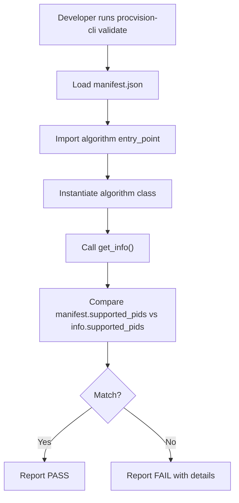
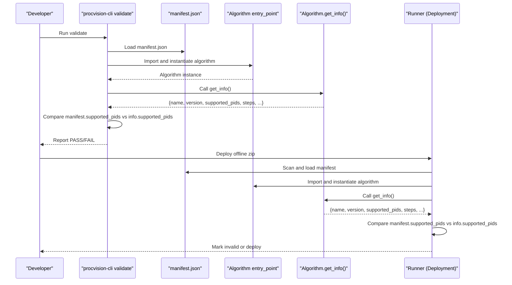
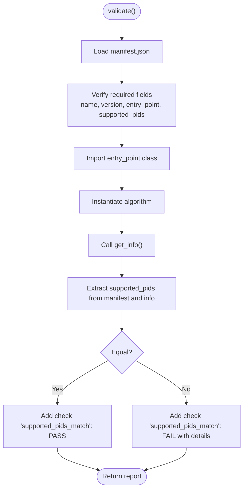
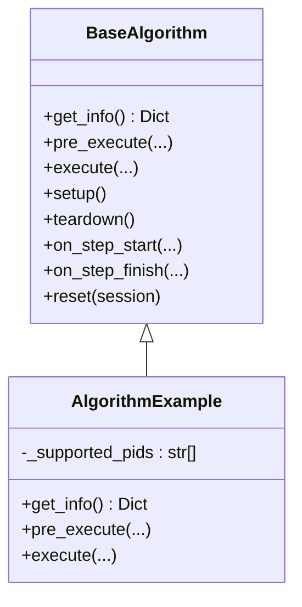
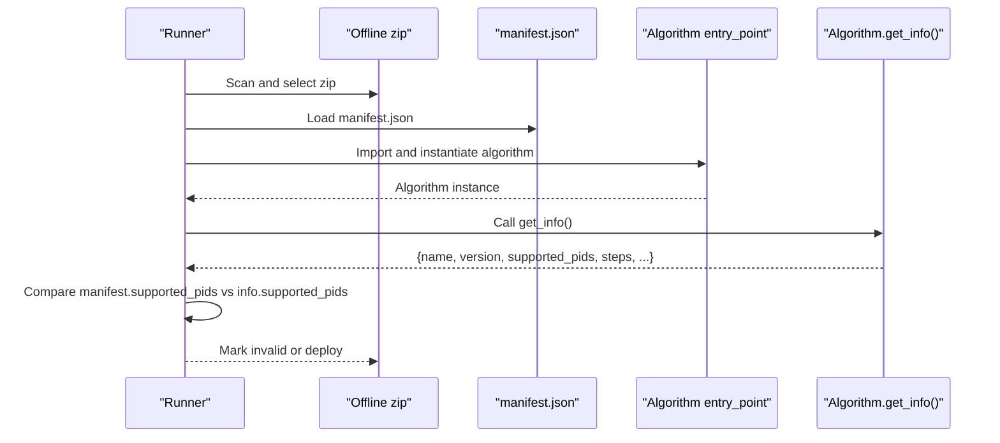
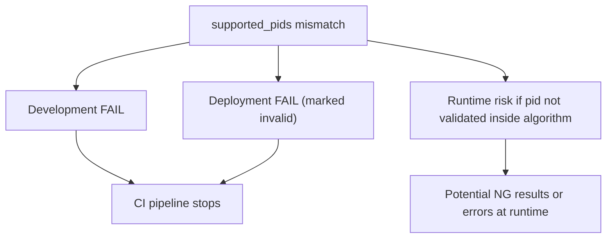
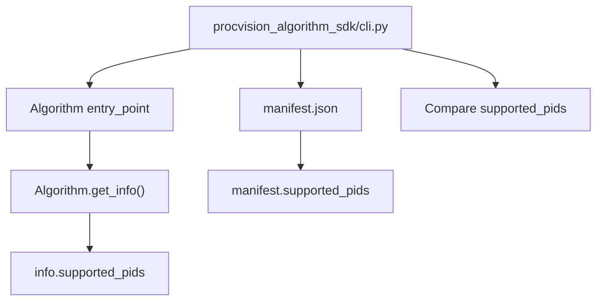

# Manifest and Runtime Consistency Validation

<cite>
**Referenced Files in This Document**
- [cli.py](file://procvision_algorithm_sdk/cli.py)
- [base.py](file://procvision_algorithm_sdk/base.py)
- [spec.md](file://spec.md)
- [runner_spec.md](file://runner_spec.md)
- [manifest.json](file://algorithm-example/manifest.json)
- [main.py](file://algorithm-example/algorithm_example/main.py)
- [test_cli_validate.py](file://tests/test_cli_validate.py)
</cite>

## Table of Contents
1. [Introduction](#introduction)
2. [Project Structure](#project-structure)
3. [Core Components](#core-components)
4. [Architecture Overview](#architecture-overview)
5. [Detailed Component Analysis](#detailed-component-analysis)
6. [Dependency Analysis](#dependency-analysis)
7. [Performance Considerations](#performance-considerations)
8. [Troubleshooting Guide](#troubleshooting-guide)
9. [Conclusion](#conclusion)
10. [Appendices](#appendices)

## Introduction
This document explains the manifest-runtime validation process that ensures the supported_pids list in manifest.json exactly matches the supported_pids returned by the algorithm’s BaseAlgorithm.get_info() method. It covers how the validation is performed during development and packaging, the consequences of mismatches, and how this validation guarantees configuration and runtime behavior consistency. It also addresses common issues such as version drift and manual editing errors, and demonstrates how the validation acts as a CI/CD safeguard.

## Project Structure
The validation logic is implemented in the SDK’s CLI validator, which loads the manifest, imports the algorithm entry point, instantiates the algorithm, calls get_info(), and compares supported_pids from manifest.json and get_info().

**Diagram sources**
- [cli.py](file://procvision_algorithm_sdk/cli.py#L35-L100)
- [manifest.json](file://algorithm-example/manifest.json#L1-L24)
- [main.py](file://algorithm-example/algorithm_example/main.py#L1-L149)

**Section sources**
- [cli.py](file://procvision_algorithm_sdk/cli.py#L35-L100)
- [manifest.json](file://algorithm-example/manifest.json#L1-L24)
- [main.py](file://algorithm-example/algorithm_example/main.py#L1-L149)

## Core Components
- CLI Validator: Loads manifest.json, imports the algorithm class via entry_point, instantiates it, calls get_info(), and compares supported_pids. See [validate](file://procvision_algorithm_sdk/cli.py#L35-L100).
- BaseAlgorithm.get_info(): Must return a dictionary containing supported_pids and other metadata. See [BaseAlgorithm.get_info](file://procvision_algorithm_sdk/base.py#L1-L58).
- Spec Definitions: The spec documents require supported_pids to match between manifest.json and get_info(). See [spec.md](file://spec.md#L1-L200).
- Example Algorithm: Demonstrates returning supported_pids from get_info() and validating pid membership in pre_execute/execute. See [AlgorithmExample.get_info](file://algorithm-example/algorithm_example/main.py#L1-L149).

**Section sources**
- [cli.py](file://procvision_algorithm_sdk/cli.py#L35-L100)
- [base.py](file://procvision_algorithm_sdk/base.py#L1-L58)
- [spec.md](file://spec.md#L1-L200)
- [main.py](file://algorithm-example/algorithm_example/main.py#L1-L149)

## Architecture Overview
The validation occurs in two complementary contexts:
- Development-time validation via procvision-cli validate
- Production-time deployment validation via Runner’s package scanning and pre-start validation

**Diagram sources**
- [cli.py](file://procvision_algorithm_sdk/cli.py#L35-L100)
- [runner_spec.md](file://runner_spec.md#L67-L85)

## Detailed Component Analysis

### Manifest and get_info() Supported PIDs Validation
The CLI validator performs the following steps:
- Load manifest.json and verify required fields
- Import the algorithm class from entry_point
- Instantiate the algorithm and call get_info()
- Compare manifest.supported_pids with info.supported_pids
- Report PASS if equal, otherwise FAIL with details

**Diagram sources**
- [cli.py](file://procvision_algorithm_sdk/cli.py#L35-L100)

**Section sources**
- [cli.py](file://procvision_algorithm_sdk/cli.py#L35-L100)

### BaseAlgorithm.get_info() Contract and Example
- BaseAlgorithm.get_info() must return a dictionary including supported_pids. See [BaseAlgorithm.get_info](file://procvision_algorithm_sdk/base.py#L1-L58).
- The spec requires supported_pids to match manifest.json. See [spec.md](file://spec.md#L1-L200).
- Example algorithm returns supported_pids from its internal list and validates pid membership in pre_execute/execute. See [AlgorithmExample.get_info](file://algorithm-example/algorithm_example/main.py#L1-L149).

**Diagram sources**
- [base.py](file://procvision_algorithm_sdk/base.py#L1-L58)
- [main.py](file://algorithm-example/algorithm_example/main.py#L1-L149)

**Section sources**
- [base.py](file://procvision_algorithm_sdk/base.py#L1-L58)
- [spec.md](file://spec.md#L1-L200)
- [main.py](file://algorithm-example/algorithm_example/main.py#L1-L149)

### Runner Deployment-Time Validation
Runner performs equivalent validation during package scanning and deployment:
- Scans uninstalled zip packages
- Loads manifest.json and entry_point
- Imports and instantiates the algorithm
- Calls get_info() and compares supported_pids
- Marks invalid if mismatch; otherwise deploys and preheats

**Diagram sources**
- [runner_spec.md](file://runner_spec.md#L67-L85)

**Section sources**
- [runner_spec.md](file://runner_spec.md#L67-L85)

### Consequences of a Mismatch
- Development-time: procvision-cli validate reports FAIL with a dedicated check for supported_pids_match. See [cli.py](file://procvision_algorithm_sdk/cli.py#L80-L95).
- Deployment-time: Runner marks the package invalid and records the reason. See [runner_spec.md](file://runner_spec.md#L67-L85).
- Runtime behavior: Even if supported_pids matched at validation time, the algorithm itself must still validate pid membership on each call. See [AlgorithmExample.pre_execute](file://algorithm-example/algorithm_example/main.py#L1-L149).

**Diagram sources**
- [cli.py](file://procvision_algorithm_sdk/cli.py#L80-L95)
- [runner_spec.md](file://runner_spec.md#L67-L85)
- [main.py](file://algorithm-example/algorithm_example/main.py#L1-L149)

**Section sources**
- [cli.py](file://procvision_algorithm_sdk/cli.py#L80-L95)
- [runner_spec.md](file://runner_spec.md#L67-L85)
- [main.py](file://algorithm-example/algorithm_example/main.py#L1-L149)

### How This Ensures Configuration and Runtime Consistency
- Single source of truth: supported_pids is the authoritative list in both manifest.json and get_info().
- Early detection: Validation prevents deploying inconsistent packages.
- Guardrails at runtime: Algorithm-side pid validation ensures only supported PIDs are processed.

**Section sources**
- [spec.md](file://spec.md#L1-L200)
- [main.py](file://algorithm-example/algorithm_example/main.py#L1-L149)

### Common Issues and Safeguards
- Version drift: Ensure manifest.json name/version match get_info() name/version. The spec requires both to align. See [spec.md](file://spec.md#L1-L200).
- Manual editing errors: The validator explicitly checks supported_pids equality and reports differences. See [cli.py](file://procvision_algorithm_sdk/cli.py#L80-L95).
- CI/CD safeguards: procvision-cli validate can be integrated into CI jobs to fail builds on mismatches. See [test_cli_validate.py](file://tests/test_cli_validate.py#L1-L11).

**Section sources**
- [spec.md](file://spec.md#L1-L200)
- [cli.py](file://procvision_algorithm_sdk/cli.py#L80-L95)
- [test_cli_validate.py](file://tests/test_cli_validate.py#L1-L11)

## Dependency Analysis
The validation depends on:
- CLI validator importing the algorithm class via entry_point
- Algorithm.get_info() returning supported_pids
- Manifest fields including supported_pids

**Diagram sources**
- [cli.py](file://procvision_algorithm_sdk/cli.py#L35-L100)
- [manifest.json](file://algorithm-example/manifest.json#L1-L24)
- [main.py](file://algorithm-example/algorithm_example/main.py#L1-L149)

**Section sources**
- [cli.py](file://procvision_algorithm_sdk/cli.py#L35-L100)
- [manifest.json](file://algorithm-example/manifest.json#L1-L24)
- [main.py](file://algorithm-example/algorithm_example/main.py#L1-L149)

## Performance Considerations
- The validation is lightweight and runs in-process; overhead is minimal compared to algorithm execution.
- Keeping supported_pids lists small and consistent improves maintainability and reduces CI failures.

[No sources needed since this section provides general guidance]

## Troubleshooting Guide
- Missing manifest.json: The validator reports FAIL early. See [test_cli_validate.py](file://tests/test_cli_validate.py#L1-L11).
- Import failure: If entry_point cannot be imported, the validator reports FAIL. See [cli.py](file://procvision_algorithm_sdk/cli.py#L60-L85).
- supported_pids mismatch: The validator adds a dedicated check and reports the difference. See [cli.py](file://procvision_algorithm_sdk/cli.py#L80-L95).
- Algorithm not returning dict: The validator checks get_info() return type and steps presence. See [cli.py](file://procvision_algorithm_sdk/cli.py#L85-L100).

**Section sources**
- [test_cli_validate.py](file://tests/test_cli_validate.py#L1-L11)
- [cli.py](file://procvision_algorithm_sdk/cli.py#L60-L100)

## Conclusion
The manifest-runtime validation enforces strict alignment between manifest.json and BaseAlgorithm.get_info() supported_pids. This dual-layer validation (development and deployment) prevents configuration drift, catches manual editing mistakes, and strengthens CI/CD reliability. Together with algorithm-side pid validation, it ensures consistent runtime behavior across environments.

[No sources needed since this section summarizes without analyzing specific files]

## Appendices

### Required Structure References
- BaseAlgorithm.get_info() contract and supported_pids requirement: [BaseAlgorithm.get_info](file://procvision_algorithm_sdk/base.py#L1-L58), [spec.md](file://spec.md#L1-L200)
- Example algorithm implementation: [AlgorithmExample.get_info](file://algorithm-example/algorithm_example/main.py#L1-L149)
- Manifest structure and supported_pids field: [manifest.json](file://algorithm-example/manifest.json#L1-L24)

**Section sources**
- [base.py](file://procvision_algorithm_sdk/base.py#L1-L58)
- [spec.md](file://spec.md#L1-L200)
- [main.py](file://algorithm-example/algorithm_example/main.py#L1-L149)
- [manifest.json](file://algorithm-example/manifest.json#L1-L24)