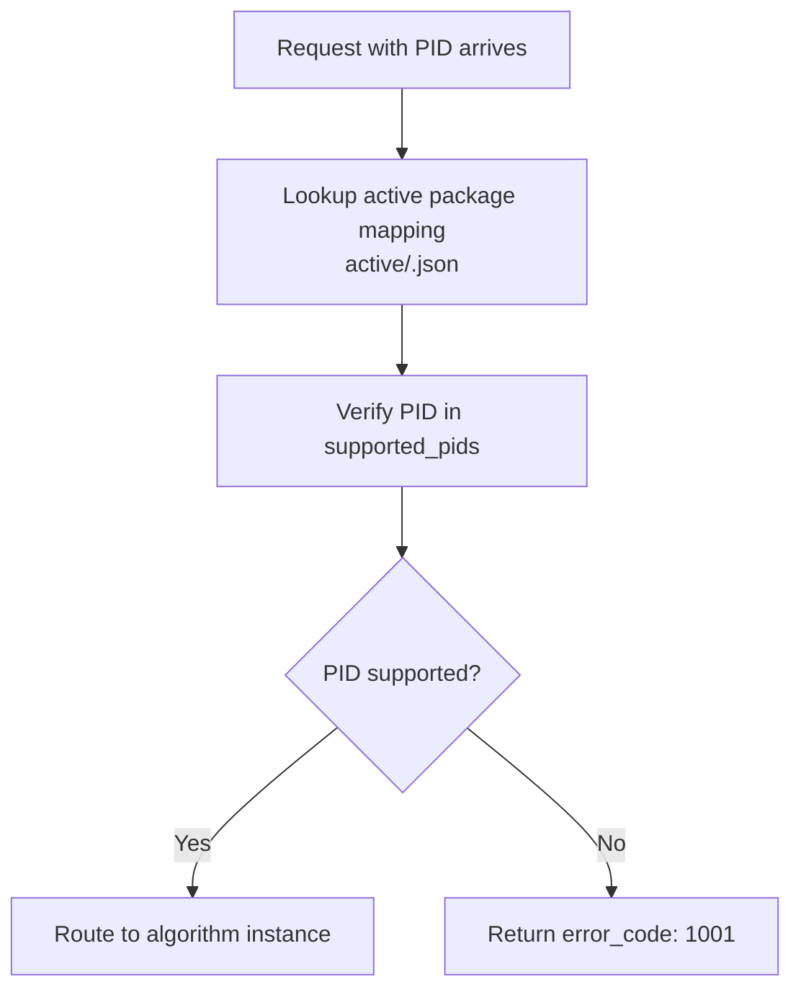
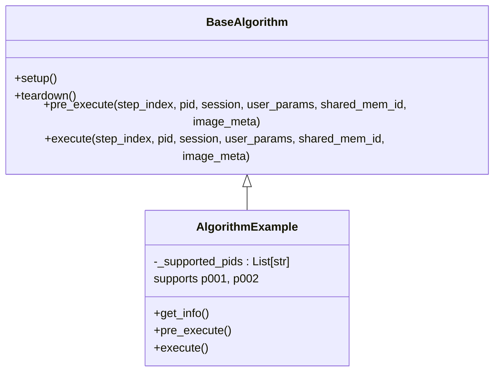
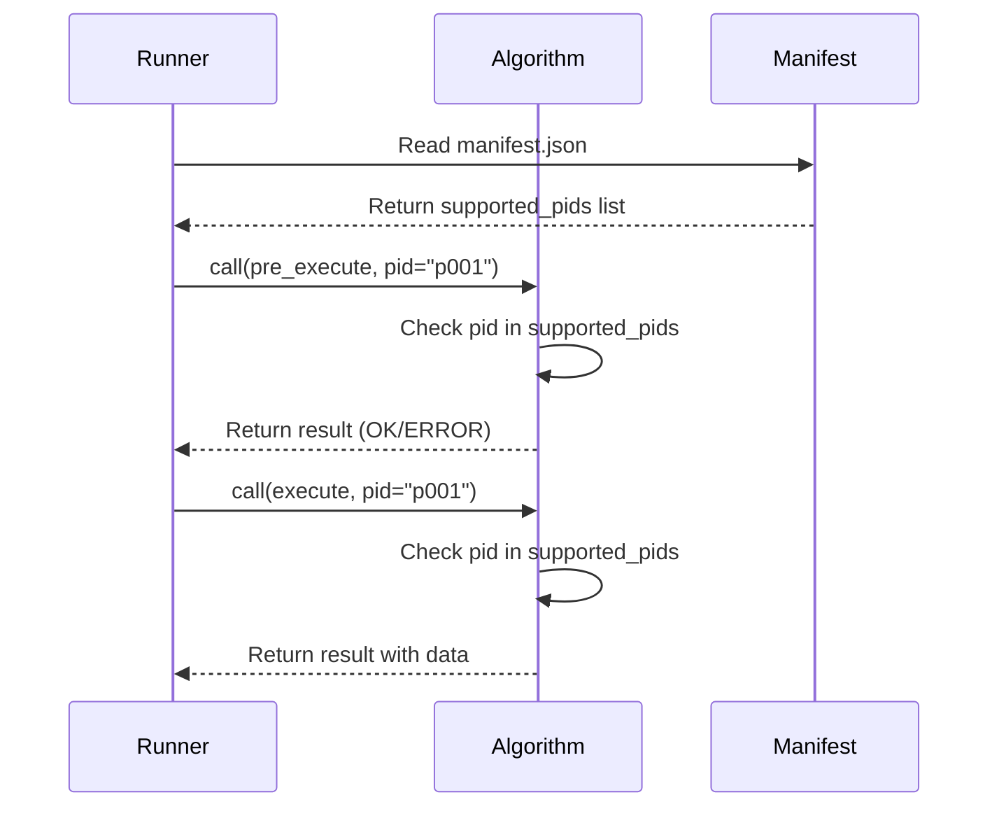

# Request Routing Based on PID

<cite>
**Referenced Files in This Document**   
- [manifest.json](file://algorithm-example/manifest.json)
- [base.py](file://procvision_algorithm_sdk/base.py)
- [main.py](file://algorithm-example/algorithm_example/main.py)
- [cli.py](file://procvision_algorithm_sdk/cli.py)
- [spec_architecture_review.md](file://spec_architecture_review.md)
- [runner_spec.md](file://runner_spec.md)
</cite>

## Table of Contents
1. [Introduction](#introduction)
2. [PID-Based Routing Mechanism](#pid-based-routing-mechanism)
3. [Architecture Evolution: From One-to-One to One-to-Many](#architecture-evolution-from-one-to-one-to-one-to-many)
4. [Detailed Routing Logic](#detailed-routing-logic)
5. [Error Handling for Unsupported PIDs](#error-handling-for-unsupported-pids)
6. [Dynamic Configuration Loading via PID](#dynamic-configuration-loading-via-pid)
7. [Implementation Examples](#implementation-examples)
8. [Conclusion](#conclusion)

## Introduction
This document details the PID-based routing mechanism in the ProcVision Algorithm SDK, explaining how the Runner uses the `supported_pids` field in `manifest.json` to determine which algorithm package can handle a given product ID (PID). The routing logic, error handling, and architectural evolution from one-instance-per-PID to one-instance-for-multiple-PIDs are thoroughly analyzed.

**Section sources**
- [manifest.json](file://algorithm-example/manifest.json)
- [runner_spec.md](file://runner_spec.md)

## PID-Based Routing Mechanism
The Runner determines algorithm package compatibility through the `supported_pids` field in `manifest.json`. When a request with a specific PID arrives, the Runner performs an exact match lookup against this list to route the request to the appropriate algorithm instance.

The routing process begins when the Runner receives a detection request containing a PID. It first identifies the active algorithm package mapped to that PID through the file system-based activation mechanism (`active/<pid>.json`). The Runner then verifies that the requested PID exists in the algorithm's `supported_pids` list defined in `manifest.json`.

This mechanism enables a single algorithm package to support multiple PIDs, as demonstrated in the example `manifest.json` where the algorithm supports both "p001" and "p002". The Runner maintains this mapping and ensures requests are only routed to compatible algorithm packages.



**Diagram sources **
- [manifest.json](file://algorithm-example/manifest.json#L1-L25)
- [runner_spec.md](file://runner_spec.md#L80-L85)

**Section sources**
- [manifest.json](file://algorithm-example/manifest.json#L1-L25)
- [runner_spec.md](file://runner_spec.md#L80-L85)

## Architecture Evolution: From One-to-One to One-to-Many
The architecture has evolved significantly from v0.1.0 to v0.2.0, shifting from a one-instance-per-PID model to a one-instance-for-multiple-PIDs design. This change addresses critical performance and resource utilization issues.

In the original v0.1.0 design, each PID required a separate algorithm instance, with the PID passed to the constructor:
```python
class MyAlgo(BaseAlgorithm):
    def __init__(self, pid: str):
        self.pid = pid  # One-to-one binding
```

The v0.2.0 redesign eliminated this constraint by moving PID handling to runtime parameters:
```python
class MyAlgo(BaseAlgorithm):
    def __init__(self):
        self.configs = {}  # Support multiple PIDs
    def execute(self, pid: str, ...):  # Runtime PID passing
        config = self.configs[pid]
```

This architectural shift provides substantial benefits:
- **Reduced memory footprint**: Single instance serves multiple PIDs
- **Improved initialization efficiency**: Models and resources loaded once
- **Enhanced resource utilization**: Better GPU and CPU utilization
- **Simplified deployment**: Fewer processes to manage

The design leverages configuration-driven differentiation through `manifest.json`'s `required_assets`, allowing the same algorithm instance to adapt to different PIDs dynamically.



**Diagram sources **
- [spec_architecture_review.md](file://spec_architecture_review.md#L291-L348)
- [base.py](file://procvision_algorithm_sdk/base.py#L1-L58)

**Section sources**
- [spec_architecture_review.md](file://spec_architecture_review.md#L291-L348)
- [base.py](file://procvision_algorithm_sdk/base.py#L1-L58)

## Detailed Routing Logic
The routing logic follows a precise sequence when handling requests with specific PIDs. The process begins with the Runner receiving a `call` instruction containing the PID, which is then validated against the algorithm's supported PIDs.

The exact match lookup occurs in the `pre_execute` and `execute` methods, where the algorithm implementation checks if the provided PID exists in its `_supported_pids` list. This validation is performed on every call, ensuring that only supported PIDs are processed.

The routing flow proceeds as follows:
1. Request received with specific PID
2. Runner identifies active algorithm package for the PID
3. Algorithm instance receives PID as a parameter in `pre_execute`/`execute`
4. Algorithm performs exact match lookup in `supported_pids` list
5. Processing continues if PID is supported, otherwise error is returned

This design ensures that the algorithm package remains stateless regarding PID binding, with the routing decision made at the Runner level and validated at the algorithm level.



**Diagram sources **
- [runner_spec.md](file://runner_spec.md#L80-L85)
- [main.py](file://algorithm-example/algorithm_example/main.py#L1-L150)

**Section sources**
- [runner_spec.md](file://runner_spec.md#L80-L85)
- [main.py](file://algorithm-example/algorithm_example/main.py#L1-L150)

## Error Handling for Unsupported PIDs
When a request contains an unsupported PID, the system implements robust error handling through standardized error codes and response patterns. The primary error code for this scenario is `1001` (invalid_pid), which is consistently used across the system.

The error handling process begins in the algorithm's `pre_execute` and `execute` methods, where the PID is validated against the `supported_pids` list. If the PID is not found, the algorithm immediately returns an error response with:
- `status`: "ERROR"
- `message`: Descriptive error message
- `error_code`: "1001"

This error handling is implemented in both the example code and the CLI validation tool. The `procvision-cli validate` command specifically checks for consistency between the `supported_pids` in `manifest.json` and those returned by `get_info()`, ensuring that the algorithm's declared capabilities match its implementation.

The Runner also enforces this validation at the system level, preventing requests from being routed to incompatible algorithm packages. This multi-layered approach ensures that unsupported PID errors are caught early and handled consistently.

**Section sources**
- [main.py](file://algorithm-example/algorithm_example/main.py#L70-L72)
- [main.py](file://algorithm-example/algorithm_example/main.py#L108-L110)
- [cli.py](file://procvision_algorithm_sdk/cli.py#L85-L87)

## Dynamic Configuration Loading via PID
The execute and pre_execute methods receive the PID as a parameter, enabling dynamic configuration loading based on the specific product being processed. This design allows algorithms to load PID-specific configurations, models, or templates at runtime.

In the implementation, the PID parameter is used to:
1. Validate request compatibility
2. Load PID-specific configuration files
3. Select appropriate detection models
4. Apply product-specific parameters
5. Initialize PID-specific resources

The Session object further enhances this capability by providing context isolation between different PIDs. Each detection flow maintains its own Session, allowing state to be preserved within a specific product's processing pipeline while remaining isolated from other PIDs.

This dynamic loading approach maximizes resource efficiency while maintaining the flexibility to handle multiple product variants. The algorithm can cache configurations for frequently used PIDs, reducing initialization overhead for subsequent requests.

**Section sources**
- [main.py](file://algorithm-example/algorithm_example/main.py#L65-L75)
- [main.py](file://algorithm-example/algorithm_example/main.py#L103-L113)
- [session.py](file://procvision_algorithm_sdk/session.py#L1-L36)

## Implementation Examples
The example implementation in `algorithm-example` demonstrates the PID-based routing mechanism in practice. The `AlgorithmExample` class supports two PIDs ("p001" and "p002") as defined in both `manifest.json` and the class's `_supported_pids` attribute.

Key implementation aspects include:
- **Manifest configuration**: The `supported_pids` field explicitly lists supported product IDs
- **Runtime validation**: Both `pre_execute` and `execute` methods validate the PID parameter
- **Consistency checking**: The `get_info()` method returns the same `supported_pids` list
- **Error reporting**: Unsupported PIDs trigger error_code "1001" with descriptive messages

The CLI tool (`procvision-cli`) provides additional validation by verifying that the `supported_pids` in `manifest.json` match those returned by `get_info()`, preventing deployment of inconsistent algorithm packages.

This example illustrates how a single algorithm instance can efficiently handle multiple product variants while maintaining strict validation and error handling for unsupported PIDs.

**Section sources**
- [manifest.json](file://algorithm-example/manifest.json#L1-L25)
- [main.py](file://algorithm-example/algorithm_example/main.py#L1-L150)
- [cli.py](file://procvision_algorithm_sdk/cli.py#L35-L62)

## Conclusion
The PID-based routing mechanism in the ProcVision Algorithm SDK provides an efficient and scalable approach to handling multiple product variants. By leveraging the `supported_pids` field in `manifest.json` and passing the PID as a runtime parameter, the system achieves optimal resource utilization while maintaining strict validation and error handling.

The architectural evolution from one-instance-per-PID to one-instance-for-multiple-PIDs has significantly improved performance and resource efficiency. The routing logic, combined with robust error handling for unsupported PIDs and dynamic configuration loading, creates a flexible and reliable system for industrial detection applications.